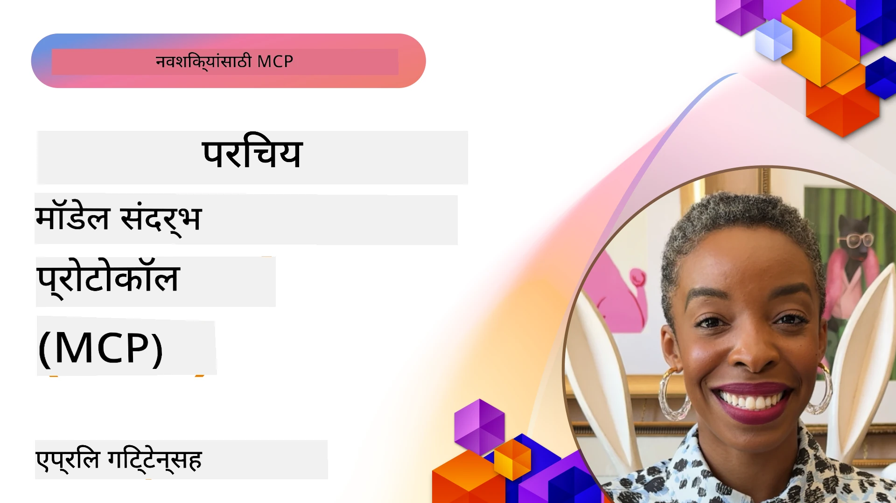
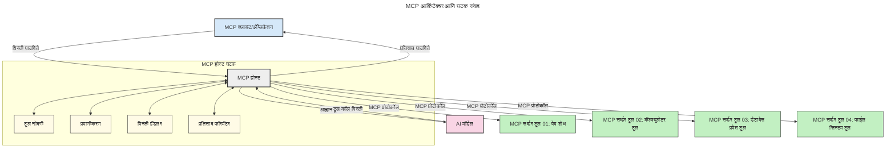
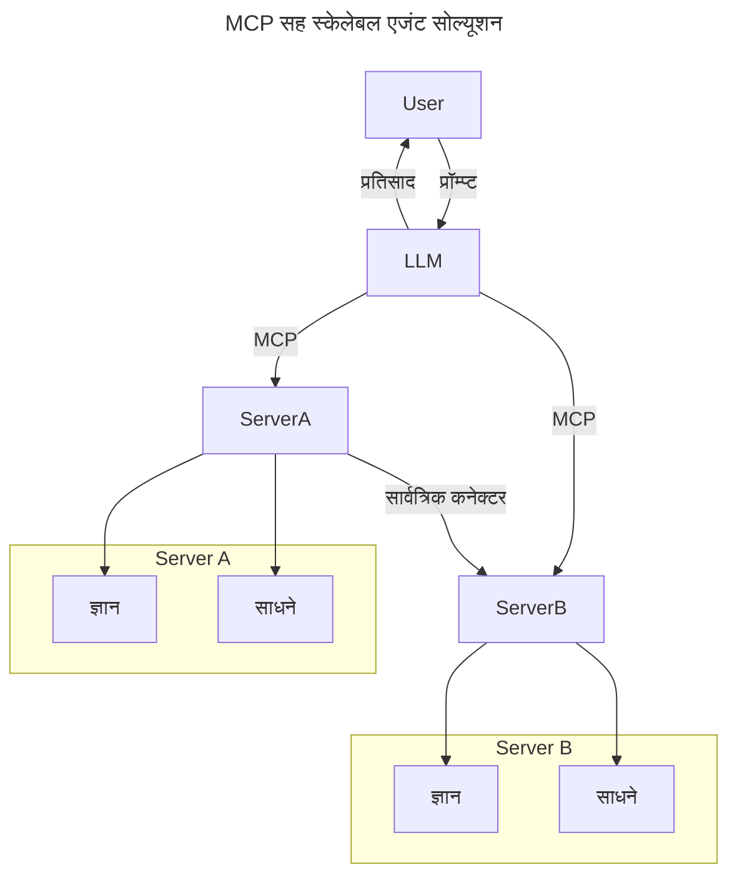
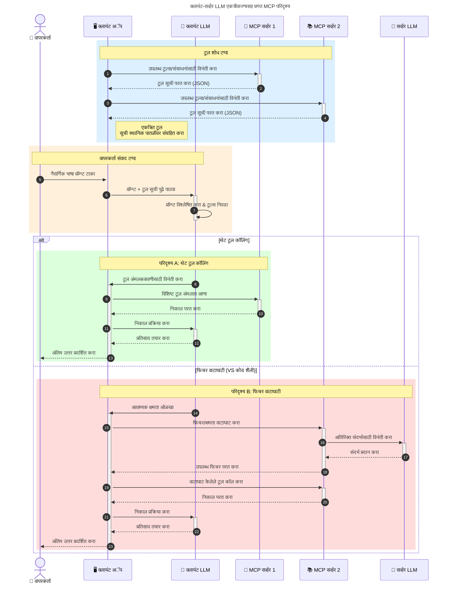

# मॉडेल कॉन्टेक्स्ट प्रोटोकॉल (MCP) परिचय: स्केलेबल AI अनुप्रयोगांसाठी त्याचे महत्त्व

_(या धड्याचा व्हिडिओ पाहण्यासाठी वरील प्रतिमा क्लिक करा)_

जनरेटिव्ह AI अनुप्रयोग हा मोठा टप्पा आहे कारण ते वापरकर्त्याला नैसर्गिक भाषा प्रॉम्प्ट्स वापरून अॅपसह संवाद साधण्याची परवानगी देतात. मात्र, जेव्हा अशा अॅप्समध्ये जास्त वेळ आणि संसाधने गुंतवली जातात, तेव्हा तुम्हाला खात्री करायची असते की तुम्ही कार्यक्षमता आणि स्रोत अशा प्रकारे सहजपणे एकत्रित करू शकता की त्याचा विस्तार करणे सोपे होईल, तुमचा अॅप एकापेक्षा जास्त मॉडेल वापरण्यासाठी सक्षम होईल, आणि विविध मॉडेलच्या जटिलतांना हाताळू शकेल. थोडक्यात, जनरेटिव्ह AI अॅप्स तयार करणे सुरू करण्यात सोपे असते, पण ते वाढत आणि गुंतागुंतीचे होत गेल्यावर आपण आर्किटेक्चर निश्चित करायला सुरुवात करावी लागते आणि आपल्या अॅप्स एकसंध पद्धतीने बांधण्यासाठी एखाद्या मानकावर अवलंबून रहावे लागते. हेच ठिकाण MCP येते, जे गोष्टींबाबत आयोजन करते आणि मानक प्रदान करते.

---

## **🔍 मॉडेल कॉन्टेक्स्ट प्रोटोकॉल (MCP) म्हणजे काय?**

**मॉडेल कॉन्टेक्स्ट प्रोटोकॉल (MCP)** हा एक **ओपन, मानकीकृत इंटरफेस** आहे जो मोठ्या भाषा मॉडेल्स (LLMs) ना बाह्य साधने, API आणि डेटा स्रोतांसह अखंडपणे संवाद साधण्याची परवानगी देतो. हे AI मॉडेलच्या कार्यक्षमतेत त्यांच्या प्रशिक्षण डेटाच्या बाहेर सुधारणा करण्यासाठी एक सुसंगत आर्किटेक्चर प्रदान करतं, ज्यामुळे अधिक बुद्धिमान, स्केलेबल आणि प्रतिसादक्षम AI प्रणाली निर्माण होतात.

---

## **🎯 AI मध्ये मानकीकरण का महत्त्वाचे आहे**

जसे जनरेटिव्ह AI अनुप्रयोग अधिक गुंतागुंतीचे होतात, तसतसे **स्केलेबिलिटी, विस्तारयोग्यता, देखभालयोग्यता** आणि **वेंडर लॉक-इन टाळणे** यांसाठी मानके स्वीकारणे गरजेचे होते. MCP हे गरजा पूर्ण करते:

- मॉडेल-टूल एकत्रीकरणांचे एकत्रीकरण
- नाजूक, एकदा-एकट्या सानुकूल उपाय कमी करणे
- विविध विक्रेत्यांकडील एकापेक्षा जास्त मॉडेल्स एका इकोसिस्टममध्ये सहअस्तित्वात येऊ देणे

**टीप:** जरी MCP स्वतःला ओपन मानक म्हणून मांडत असला तरी, IEEE, IETF, W3C, ISO किंवा इतर कोणत्याही विद्यमान मानक संस्था मार्फत MCP मानकीकरण करण्याचा कोणताही योजना नाही.

---

## **📚 शिकण्याचे उद्दिष्ट**

या लेखाच्या शेवटी, तुम्ही:

- **मॉडेल कॉन्टेक्स्ट प्रोटोकॉल (MCP)** आणि त्याच्या उपयोग प्रकरणांची व्याख्या करू शकाल
- MCP कसे मॉडेल-टूल संवाद सुसंगत करते हे समजून घेऊ शकाल
- MCP आर्किटेक्चरच्या मुख्य घटक ओळखू शकाल
- एंटरप्राइझ आणि विकास संदर्भातील MCP चे प्रत्यक्ष अनुप्रयोग एक्सप्लोर करू शकाल

---

## **💡 मॉडेल कॉन्टेक्स्ट प्रोटोकॉल (MCP) का गेम-चेंजर आहे**

### **🔗 MCP AI संवादातील विखुरलेपणा सोडवतो**

MCP आधी, मॉडेल्सना साधने एकत्र करण्यासाठी आवश्यक होतं:

- प्रत्येक टूल-मॉडेल जोडप्यासाठी सानुकूल कोड
- प्रत्येक विक्रेत्यासाठी गैरमानक API
- अद्ययावतांमुळे वारंवार ब्रेक्स
- अधिक साधने असताना खराब स्केलेबिलिटी

### **✅ MCP मानकीकरणाचे फायदे**

| **फायदा**                | **वर्णन**                                                                     |
|--------------------------|-------------------------------------------------------------------------------|
| इंटरऑपरेबिलिटी          | LLMs विविध विक्रेत्यांच्या साधनांसह अखंडपणे कार्य करतात                     |
| सुसंगतता                | प्लॅटफॉर्म्स आणि साधनांमध्ये एकसंध वर्तन                                    |
| पुनर्वापरयोग्यता        | एकदा बनवलेली साधने प्रकल्प आणि प्रणालींमध्ये वापरता येतात                   |
| वेगवान विकास            | मानकीकृत, प्लग-अँड-प्ले इंटरफेस वापरून विकास वेळ कमी करतो                  |

---

## **🧱 उच्च-स्तरीय MCP आर्किटेक्चर अवलोकन**

MCP एक **क्लायंट-सर्व्हर मॉडेल** अनुसरते, जिथे:

- **MCP होस्ट्स** AI मॉडेल चालवतात
- **MCP क्लायंट्स** विनंती सुरू करतात
- **MCP सर्व्हर्स** संदर्भ, साधने आणि क्षमता सेवा देतात

### **मुख्य घटक:**

- **संसाधने** – मॉडेलसाठी स्थिर किंवा गतिशील डेटा  
- **प्रॉम्प्ट्स** – मार्गदर्शित जनरेशनसाठी पूर्वनिर्धारित वर्कफ्लोज  
- **साधने** – शोध, गणना यांसारख्या कार्यक्षम फंक्शन्स  
- **सॅम्पलिंग** – पुनरावृत्ती संवादाद्वारे एजंटसारखे वर्तन
- **एलिसिटेशन** – वापरकर्ता इनपुटसाठी सर्व्हर-प्रारंभित विनंत्या
- **रुट्स** – सर्व्हर प्रवेश नियंत्रणासाठी फाइलसिस्टिम सीमा

### **प्रोटोकॉल आर्किटेक्चर:**

MCP दोन स्तर आर्किटेक्चरचा वापर करते:
- **डेटा स्तर**: JSON-RPC 2.0 आधारित संवाद, जीवनचक्र व्यवस्थापन आणि प्रिमिटिव्हसह
- **परिवहन स्तर**: STDIO (स्थानिक) आणि Streamable HTTP SSE (दूरस्थ) संवाद चॅनेल्स

---

## MCP सर्व्हर्स कसे कार्य करतात

MCP सर्व्हर्स खालील प्रकारे कार्य करतात:

- **विनंती प्रवाह**:
    1. विनंती अंतिम वापरकर्ता किंवा त्यांच्या वतीने कार्य करणाऱ्या सॉफ्टवेअरने सुरू केली जाते.
    2. **MCP क्लायंट** ही विनंती **MCP होस्ट** कडे पाठवतो जो AI मॉडेल रनटाइम व्यवस्थापित करतो.
    3. **AI मॉडेल** वापरकर्त्याचा प्रॉम्प्ट प्राप्त करते आणि एक किंवा अधिक टूल कॉल्सद्वारे बाह्य साधने किंवा डेटाची मागणी करू शकते.
    4. **MCP होस्ट**, मॉडेलकडे थेट न जाता, मानकीकृत प्रोटोकॉल वापरून संबंधित **MCP सर्व्हर(स)** शी संवाद साधतो.
- **MCP होस्ट कार्यक्षमता**:
    - **टूल रजिस्ट्रेशन**: उपलब्ध साधने आणि त्याच्या क्षमतांची सूची ठेवतो.
    - **प्रमाणीकरण**: साधन प्रवेशासाठी परवानग्या सत्यापित करतो.
    - **विनंती हाताळणी**: मॉडेलकडून येणाऱ्या टूल विनंत्यांची प्रक्रिया करतो.
    - **उत्तर फॉरमॅटर**: मॉडेल समजू शकेल अशा स्वरूपात साधनांचे आउटपुट संरचित करतो.
- **MCP सर्व्हर अंमलबजावणी**:
    - **MCP होस्ट** साधन कॉल्स एका किंवा अधिक **MCP सर्व्हर** कडे मार्गदर्शित करतो, जे प्रत्येकाने विशिष्ट कार्ये उदा. शोध, गणना, डेटाबेस क्वेरी उभारल्या आहेत.
    - **MCP सर्व्हर** आपले संबंधित ऑपरेशन्स पार पाडतात आणि परिणाम एकसंध स्वरूपात **MCP होस्ट** कडे परत पाठवतात.
    - **MCP होस्ट** ही परिणाम मॉडेलला देण्याइतपत स्वरूपित करतो आणि हस्तांतरित करतो.
- **उत्तर पूर्णता**:
    - **AI मॉडेल** साधन आउटपुट अंतिम प्रतिसादात समाविष्ट करते.
    - **MCP होस्ट** हा प्रतिसाद पुन्हा **MCP क्लायंट** कडे पाठवतो जो तो अंतिम वापरकर्ता किंवा कॉल करणाऱ्या सॉफ्टवेअरला देतो.
    

## 👨‍💻 MCP सर्व्हर कसा तयार करावा (उदाहरणांसह)

MCP सर्व्हर्स LLM क्षमतांना डेटा आणि कार्यक्षमतेद्वारे विस्तार देतात.

तयार आहात का? विविध भाषा/स्टॅकसाठी सोप्या MCP सर्व्हर्स तयार करण्यासाठी खाली SDKs आणि उदाहरणे आहेत:

- **Python SDK**: https://github.com/modelcontextprotocol/python-sdk

- **TypeScript SDK**: https://github.com/modelcontextprotocol/typescript-sdk

- **Java SDK**: https://github.com/modelcontextprotocol/java-sdk

- **C#/.NET SDK**: https://github.com/modelcontextprotocol/csharp-sdk

## 🌍 MCP चे प्रत्यक्ष उपयोग प्रकरणे

MCP AI क्षमतांचा विस्तार करून विविध अनुप्रयोग सक्षम करते:

| **अनुप्रयोग**              | **वर्णन**                                                                |
|------------------------------|-------------------------------------------------------------------------|
| एंटरप्राइझ डेटा इंटिग्रेशन   | LLMs ना डेटाबेस, CRM, किंवा अंतर्गत साधनांशी जोडणे                     |
| एजंटिक AI प्रणाली            | साधन प्रवेश आणि निर्णय घेण्याच्या वर्कफ्लोजसह स्वायत्त एजंट सक्षम करणे|
| मल्टी-मोडल अनुप्रयोग        | एकाच AI अॅपमध्ये मजकूर, प्रतिमा आणि ऑडिओ साधने संयोजन करणे         |
| रिअल-टाइम डेटा इंटिग्रेशन  | अचूक, आधुनिक आउटपुटसाठी AI संवादांमध्ये थेट डेटा आणणे                 |

### 🧠 MCP = AI संवादांसाठी सार्वत्रिक मानक

मॉडेल कॉन्टेक्स्ट प्रोटोकॉल (MCP) AI संवादांसाठी एक सार्वत्रिक मानक म्हणून कार्य करते, जसे USB-C ने उपकरणांसाठी भौतिक कनेक्शन मानकीकृत केले. AI च्या जगात, MCP एक सुसंगत इंटरफेस प्रदान करते, ज्यामुळे मॉडेल (क्लायंट) बाह्य साधने आणि डेटा प्रदात्यांशी (सर्व्हर) अखंडपणे समाकलित होऊ शकतात. यामुळे प्रत्येक API किंवा डेटा स्रोतासाठी वेगवेगळे, सानुकूल प्रोटोकॉल वापरण्याची गरज संपते.

MCP अंतर्गत, एक MCP-समर्थित साधन (जे MCP सर्व्हर म्हणतात) एकत्रित मानक अनुसरते. हे सर्व्हर्स उपलब्ध साधने किंवा क्रिया सूचीबद्ध करतात आणि AI एजंटच्या विनंतीवर त्या क्रियांना अंमलात आणतात. MCP समर्थित AI एजंट प्लॅटफॉर्म्स सर्व्हरकडून उपलब्ध साधने शोधू शकतात आणि या मानक प्रोटोकॉलमार्फत त्यांना invoke करू शकतात.

### 💡 ज्ञान प्रवेश सुलभ करतो

साधनांची ऑफर करण्याबरोबरच, MCP ज्ञान प्रवेशाला देखील सुलभ करतो. हे अनुप्रयोगांना मोठ्या भाषा मॉडेल्सना (LLMs) विविध डेटा स्रोतांशी लिंक करून संदर्भ पुरवू शकतात. उदाहरणार्थ, एखादा MCP सर्व्हर कंपनीच्या दस्तऐवज संचाचे प्रतिनिधित्व करू शकतो, ज्यामुळे एजंट्सना आवश्यक माहिती मागणीवर मिळू शकते. दुसरा सर्व्हर विशिष्ट क्रिया जसे ईमेल पाठवणे किंवा रेकॉर्ड अपडेट करणे हाताळू शकतो. एजंटच्या दृष्टीने, ही फक्त वापरता येणारी साधने आहेत—काही साधने डेटा (ज्ञान संदर्भ) परत करतात, तर इतर क्रिया पार पडतात. MCP हे दोन्ही कार्यक्षमतेने व्यवस्थापित करते.

एजंट जेव्हा एका MCP सर्व्हरशी जोडतो, तेव्हा तो सर्व्हरच्या उपलब्ध क्षमता आणि प्रवेशयोग्य डेटाची माहिती मानक स्वरूपात कळतो. हे मानकीकरण डायनॅमिक टूल उपलब्धता सक्षम करते. उदाहरणार्थ, एखादा नव्या MCP सर्व्हरला एजंटच्या प्रणालीमध्ये जोडणे म्हणजे त्या सर्व्हरच्या कार्यांचा वापर ताबडतोब शक्य होतो, एजंटच्या सूचनांमध्ये अतिरिक्त सानुकूलन न करता.

हे सुलभ समाकलन खालील आकृतीत दाखविलेल्या प्रवाहाशी सुसंगत आहे, जिथे सर्व्हर्स साधने आणि ज्ञान दोन्ही पुरवतात, ज्यामुळे प्रणालींमध्ये अखंडपणा राखतो. 

### 👉 उदाहरण: स्केलेबल एजंट सोल्यूशन

युनिव्हर्सल कनेक्टर MCP सर्व्हर्सना एकमेकांशी संवाद साधण्याची आणि क्षमता शेअर करण्याची परवानगी देतो, जिथे ServerA ServerB कडे कार्ये सोपवू शकतो किंवा त्याच्या साधनां व ज्ञानाचा वापर करू शकतो. यामुळे सर्व्हर दरम्यान साधने आणि डेटा संघटित होतात, जे स्केलेबल आणि मॉड्युलर एजंट आर्किटेक्चरसाठी मदत करतात. MCP मुळे साधनांचे प्रदर्शन मानकीकृत होते, त्यामुळे एजंट्सना सर्व्हर्सदरम्यान विनंत्या शोधणे आणि मार्गदर्शन करणे डायनॅमिक होते, कठोर सानुकूल समाकलने न करता.

साधने आणि ज्ञानाचे संघटन: साधने आणि डेटाचा प्रवेश सर्व्हर्सदरम्यान होऊ शकतो, ज्यामुळे अधिक स्केलेबल आणि मॉड्युलर एजंट आर्किटेक्चर तयार होतात.

### 🔄 क्लायंट-साईड LLM समाकलनासह प्रगत MCP परिस्थिती

मूलभूत MCP आर्किटेक्चरव्यतिरिक्त, प्रगत परिस्थिती आहेत जिथे क्लायंट आणि सर्व्हर दोन्हीमध्ये LLMs असतात, ज्यामुळे अधिक गुंतागुंतीचे संवाद शक्य होतात. खालील आकृतीत, **क्लायंट अॅप** एक IDE असू शकतो ज्यात वापरकर्त्यासाठी अनेक MCP साधने उपलब्ध आहेत:

## 🔐 MCP चे व्यावहारिक फायदे

MCP वापरण्याचे व्यावहारिक फायदे येथे आहेत:

- **ताजेपणा**: मॉडेल्सना त्यांच्या प्रशिक्षण डेटेपेक्षा अद्ययावत माहिती मिळू शकते
- **क्षमता विस्तार**: मॉडेल्सना न वापरलेल्या टास्कसाठी विशेष साधने वापरण्याची मुभा
- **गलत कल्पनांमध्ये कपात**: बाह्य डेटा स्रोतांमुळे तथ्यात्मक आधार मिळतो
- **गोपनीयता**: संवेदनशील डेटा प्रम्प्ट मध्ये ठेवण्याऐवजी सुरक्षित वातावरणात राहू शकतो

## 📌 मुख्य मुद्दे

MCP वापरताना खालील मुद्दे लक्षात ठेवावेत:

- **MCP** AI मॉडेल्स आणि साधने व डेटा यांच्यात कसे संवाद साधायचा हे मानकीकृत करते
- **विस्तारयोग्यता, सुसंगतता, आणि इंटरऑपरेबिलिटी** प्रोत्साहित करते
- MCP विकास वेळ कमी करण्यास, विश्वासार्हता सुधारण्यास आणि मॉडेल क्षमतांचा विस्तार करण्यास मदत करते
- क्लायंट-सर्व्हर आर्किटेक्चर लवचिक, विस्तारयोग्य AI अनुप्रयोग सक्षम करते

## 🧠 सराव

तुम्हाला ज्याचा AI अनुप्रयोग तयार करायचा आहे त्याबद्दल विचार करा.

- कोणती **बाह्य साधने किंवा डेटा** त्याच्या क्षमतांमध्ये भर घालू शकतील?
- MCP कसे समाकलन **सोपं आणि विश्वासार्ह** करू शकते?

## अतिरिक्त संसाधने

- [MCP GitHub Repository](https://github.com/modelcontextprotocol)

## पुढचे काय

पुढचे: [अध्याय 1: मुख्य संकल्पना](../01-CoreConcepts/README.md)

---

<!-- CO-OP TRANSLATOR DISCLAIMER START -->
**अस्वीकार पत्र**:  
हा दस्तऐवज AI अनुवाद सेवा [Co-op Translator](https://github.com/Azure/co-op-translator) वापरून अनुवादित केला आहे. आम्ही अचूकतेसाठी प्रयत्नशील असलो तरी, कृपया लक्षात ठेवा की स्वयंचलित अनुवादांमध्ये चुका किंवा अचूकतेची कमतरता असू शकते. मूळ दस्तऐवज त्याच्या मूळ भाषेत अधिकृत स्रोत मानला जातो. महत्त्वपूर्ण माहितीच्या बाबतीत व्यावसायिक मानवी अनुवादची शिफारस केली जाते. या अनुवादाच्या वापरामुळे उद्भवणार्‍या कोणत्याही गैरसमज किंवा चुकीच्या भाष्यांसाठी आम्ही जबाबदार नाही.
<!-- CO-OP TRANSLATOR DISCLAIMER END -->