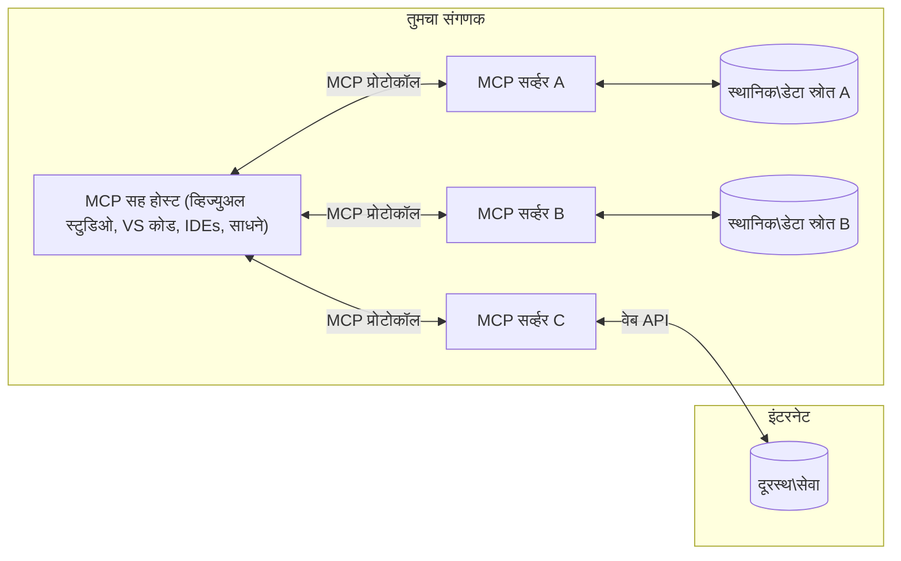

# MCP मुख्य संकल्पना: AI एकत्रीकरणासाठी मॉडेल संदर्भ प्रोटोकॉलमध्ये पारंगत होणे

[](https://youtu.be/earDzWGtE84)

_(वरील प्रतिमा क्लिक करून या धड्याचा व्हिडिओ पाहा)_

[मॉडेल संदर्भ प्रोटोकॉल (MCP)](https://github.com/modelcontextprotocol) हा एक सामर्थ्यशाली, प्रमाणित फ्रेमवर्क आहे जो मोठ्या भाषा मॉडेल्स (LLMs) आणि बाह्य साधने, अनुप्रयोग, आणि डेटा स्रोतांमधील संवाद सुलभ करतो.  
हा मार्गदर्शक तुम्हाला MCP चे मुख्य संकल्पना समजावून सांगेल. तुम्हाला याचा क्लायंट-सर्व्हर आर्किटेक्चर, आवश्यक घटक, संवाद यंत्रणा, आणि अंमलबजावणीसाठी सर्वोत्तम पद्धती याबद्दल शिकायला मिळेल.

- **स्पष्ट वापरकर्ता संमती**: सर्व डेटा प्रवेश आणि ऑपरेशन्ससाठी अंमलबजावणीपूर्वी स्पष्ट वापरकर्ता मान्यता आवश्यक आहे. वापरकर्त्यांनी कोणता डेटा प्रवेश केला जाईल आणि कोणती क्रिया केली जाईल हे स्पष्टपणे समजून घ्यायला हवे, परवानग्या आणि अधिकारांवर सूक्ष्म नियंत्रणासह.

- **डेटा गोपनीयता संरक्षण**: वापरकर्त्याचा डेटा फक्त स्पष्ट संमतीनेच उघड केला जातो आणि सगळ्या संपर्ककाळात मजबूत प्रवेश नियंत्रणांनी संरक्षित केला पाहिजे. अंमलबजावणीने अनधिकृत डेटा प्रसारण टाळले पाहिजे आणि कडक गोपनीयता सीमा राखल्या पाहिजेत.

- **साधन अंमलबजावणी सुरक्षितता**: प्रत्येक साधनाच्या वापरासाठी स्पष्ट वापरकर्ता संमती आवश्यक आहे ज्यामध्ये साधनाच्या कार्यक्षमता, पॅरामीटर्स, आणि संभाव्य परिणामांची स्पष्ट समज असते. मजबूत सुरक्षा सीमा अनपेक्षित, असुरक्षित, किंवा दुष्ट साधन अंमलबजावणीला प्रतिबंधित करतात.

- **प्रवास स्तर सुरक्षा (ट्रान्सपोर्ट लेयर सिक्युरिटी)**: संपूर्ण संवाद चॅनेलमध्ये योग्य एन्क्रिप्शन आणि प्रमाणीकरण यंत्रणा वापरली जावी. रिमोट कनेक्शन्ससाठी सुरक्षित प्रवास प्रोटोकोल आणि योग्य क्रेडेंशियल व्यवस्थापन आवश्यक आहे.

#### अंमलबजावणी मार्गदर्शक तत्त्वे:

- **परवानगी व्यवस्थापन**: सूक्ष्म-ग्रेस परवानगी प्रणाली अंमलात आणा ज्यात वापरकर्ते कोणते सर्व्हर, साधने आणि साधने प्रवेशयोग्य आहेत हे नियंत्रित करू शकतील  
- **प्रमाणीकरण आणि अधिकार**: सुरक्षित प्रमाणीकरण पद्धती (OAuth, API की) वापरा ज्यात योग्य टोकन व्यवस्थापन आणि मुदत समाप्ती असते  
- **इनपुट वैधता**: सर्व पॅरामीटर्स आणि डेटाची वैधता निश्चित योजनांनुसार करा जेणेकरून इंजेक्शन हल्ले टाळता येतील  
- **ऑडिट लॉगिंग**: सुरक्षा निरीक्षण आणि नियमपालनासाठी सर्व ऑपरेशन्सची सविस्तर नोंदी ठेवा

## आढावा

हा धडा मॉडेल संदर्भ प्रोटोकॉल (MCP) परिसंस्थेतील मूलभूत आर्किटेक्चर आणि घटकांची ओळख करून देतो. तुम्हाला क्लायंट-सर्व्हर आर्किटेक्चर, मुख्य घटक, आणि MCP संवाद प्रणाली याबद्दल माहिती होईल ज्या MCP परस्परसंवादांना चालना देतात.

## मुख्य शिक्षण उद्दिष्टे

या धड्याच्या शेवटी, तुम्ही:

- MCP चा क्लायंट-सर्व्हर आर्किटेक्चर समजून घ्याल.  
- Hosts, Clients, आणि Servers ची भूमिका आणि जबाबदाऱ्या ओळखाल.  
- MCP ला लवचिक एकत्रीकरण स्तर बनविणाऱ्या मूलभूत वैशिष्ट्यांचे विश्लेषण कराल.  
- MCP परिसंस्थेमध्ये माहिती कशी प्रवाहित होते हे शिकाल.  
- .NET, Java, Python, आणि JavaScript मधील कोड उदाहरणांद्वारे प्रत्यक्ष अनुभव मिळवाल.

## MCP आर्किटेक्चर: सखोल पाहणी

MCP परिसंस्था क्लायंट-सर्व्हर मॉडेलवर आधारित आहे. हा मॉड्युलर स्ट्रक्चर एआय अनुप्रयोगांना साधने, डेटाबेस, API, आणि संदर्भ संसाधनांशी कार्यक्षम संवाद साधण्यास परवानगी देतो. चला या आर्किटेक्चरचे मुख्य घटक पाहूया.

याच्या मूळ तत्वावर, MCP क्लायंट-सर्व्हर आर्किटेक्चर अनुसरते जिथे होस्ट अनुप्रयोग अनेक सर्व्हरशी कनेक्ट होऊ शकतो:


- **MCP Hosts**: VSCode, Claude Desktop, IDEs, किंवा ते AI साधने ज्यांना MCP मधून डेटा प्रवेश हवा असतो
- **MCP Clients**: प्रोटोकॉल क्लायंट्स जे सर्व्हरशी 1:1 कनेक्शन राखतात
- **MCP Servers**: हलक्या प्रोग्राम्स जे प्रमाणित मॉडेल संदर्भ प्रोटोकॉलद्वारे विशिष्ट क्षमता उघड करतात
- **स्थानिक डेटा स्त्रोत**: तुमच्या संगणकातील फाइल्स, डेटाबेस, आणि सेवां ज्यांना MCP सर्व्हर सुरक्षितपणे प्रवेश करू शकतात
- **रिमोट सेवा**: इंटरनेटवर उपलब्ध बाह्य प्रणाली ज्या MCP सर्व्हर API द्वारे जोडू शकतात

MCP प्रोटोकॉल एक प्रगतमानक आहे ज्यात तारखेच्या स्वरूपात आवृत्ती वापरली जाते (YYYY-MM-DD स्वरूप). सध्याची प्रोटोकॉल आवृत्ती **2025-11-25** आहे. तुम्ही [प्रोटोकॉल स्पेसिफिकेशन](https://modelcontextprotocol.io/specification/2025-11-25/) मधील ताजी अपडेट्स पाहू शकता.

### 1. Hosts

मॉडेल संदर्भ प्रोटोकॉल (MCP) मध्ये, **Hosts** म्हणजे AI अनुप्रयोग जे वापरकर्ते प्रोटोकॉलशी संवाद साधण्यासाठी मुख्य इंटरफेस म्हणून कार्य करतात. Hosts अनेक MCP सर्व्हर्सशी कनेक्शन व्यवस्थापित करतात आणि प्रत्येक सर्व्हर कनेक्शनसाठी समर्पित MCP क्लायंट तयार करतात. Hosts ची उदाहरणे:

- **AI अनुप्रयोग**: Claude Desktop, Visual Studio Code, Claude Code  
- **विकास पर्यावरणे**: IDEs आणि कोड एडिटर्स ज्यात MCP समाकलित आहे  
- **सानुकूल अनुप्रयोग**: उद्दीष्टासाठी बनवलेली AI एजंट्स आणि साधने

**Hosts** हे AI मॉडेल संवादांचे व्यवस्थापक अनुप्रयोग आहेत. ते:

- **AI मॉडेलांचे निर्देशित करणे**: LLMs चालवणे किंवा संवाद साधून प्रतिसाद तयार करणे आणि AI कार्यप्रवाहांचे समन्वय करणे  
- **क्लायंट कनेक्शनचे व्यवस्थापन**: प्रत्येक MCP सर्व्हर कनेक्शनसाठी एक MCP क्लायंट तयार करणे आणि राखणे  
- **वापरकर्ता इंटरफेस नियंत्रण**: संभाषण प्रवाह, वापरकर्ता संवाद, आणि प्रतिसाद सादरीकरण हाताळणे  
- **सुरक्षा अंमलबजावणी**: परवानग्या, सुरक्षा निर्बंध, आणि प्रमाणीकरण नियंत्रण करणे  
- **वापरकर्ता संमती हाताळणी**: डेटा शेअरिंग आणि साधन अंमलबजावणीसाठी वापरकर्ता मान्यता व्यवस्थापित करणे

### 2. Clients

**Clients** हे आवश्यक घटक आहेत जे Hosts आणि MCP सर्व्हर्स दरम्यान समर्पित एक-ते-एक कनेक्शन राखतात. प्रत्येक MCP क्लायंट होस्टने एका विशिष्ट MCP सर्व्हरशी जोडण्यासाठी तयार केला जातो ज्यामुळे संवाद सुव्यवस्थित आणि सुरक्षित राहतो. अनेक क्लायंट्स होस्टला एकाच वेळी अनेक सर्व्हर्सना जोडण्यास अनुमती देतात.

**Clients** हे होस्ट अनुप्रयोगात कनेक्टर घटक आहेत. ते:

- **प्रोटोकॉल संवाद**: JSON-RPC 2.0 विनंत्या सर्व्हरकडे पाठवणे, ज्यात प्रॉम्प्ट्स आणि सूचना असतात  
- **क्षमता वाटाघाटी**: प्रारंभिक काळात सर्व्हरशी समर्थित वैशिष्ट्ये आणि प्रोटोकॉल आवृत्त्यांवर वाटाघाटी करणे  
- **साधन अंमलबजावणी**: मॉडेलकडून साधन अंमलबजावणी विनंत्या व्यवस्थापित करणे आणि प्रतिसाद प्रक्रिया करणे  
- **रिअल-टाइम अद्यतने**: सर्व्हरकडून सूचना आणि रिअल-टाइम अद्यतने हाताळणे  
- **प्रतिसाद प्रक्रिया**: वापरकर्त्यांना दर्शविण्यासाठी सर्व्हर प्रतिसाद प्रक्रिया आणि स्वरूपित करणे

### 3. Servers

**Servers** हे प्रोग्राम्स आहेत जे MCP क्लायंट्सना संदर्भ, साधने, आणि क्षमता पुरवतात. ते स्थानिक (होस्ट यंत्रासारख्या) किंवा रिमोट (बाह्य प्लॅटफॉर्म्सवर) चालू शकतात, आणि क्लायंट विनंत्यांचे हाताळणी करून संरचित प्रतिसाद देते. सर्व्हर्स प्रमाणित मॉडेल संदर्भ प्रोटोकॉलद्वारे विशिष्ट कार्यक्षमता उघड करतात.

**Servers** हे सेवा आहेत जे संदर्भ आणि क्षमता पुरवतात. ते:

- **वैशिष्ट्य नोंदणी**: उपलब्ध मूळ घटक (साधने, प्रॉम्प्ट्स, संसाधने) क्लायंटना नोंदणी करून उपलब्ध करून देणे  
- **विनंती प्रक्रिया**: साधन कॉल्स, संसाधन विनंत्या, आणि प्रॉम्प्ट विनंत्या मिळवणे आणि अंमलात आणणे  
- **संदर्भ पुरवठा**: मॉडेल प्रतिसादांना वाढवण्यासाठी संदर्भात्मक माहिती आणि डेटा प्रदान करणे  
- **स्थिती व्यवस्थापन**: सत्र स्थिती राखणे आणि गरजेनुसार स्थिती-आधारित संवाद हाताळणे  
- **रिअल-टाइम सूचना**: क्षमता बदल आणि अद्यतनांबाबत कनेक्टेड क्लायंटना सूचना पाठविणे

सर्व्हर्स कोणत्याही विकासकाद्वारे मॉडेलच्या क्षमतांना विस्तृत करण्यासाठी तयार केले जाऊ शकतात आणि स्थानिक व रिमोट दोन्ही कार्यान्वयन पद्धतींना समर्थन करतात.

### 4. Server Primitives

मॉडेल संदर्भ प्रोटोकॉल (MCP) मध्ये सर्व्हर्स तीन मुख्य **मूलभूत घटक** पुरवतात जे क्लायंट, होस्ट, आणि भाषा मॉडेल्समधील समृद्ध संवादासाठी मुलभूत बांधकाम ब्लॉक्स निश्चित करतात. हे मूळ घटक प्रोटोकॉलद्वारे उपलब्ध संदर्भात्मक माहिती आणि क्रिया निर्दिष्ट करतात.

MCP सर्व्हर्स खालील तीन मुख्य मूळ घटकांपैकी कोणत्याही संयोजनाने कार्य करू शकतात:

#### Resources

**Resources** म्हणजे डेटा स्त्रोत जे AI अनुप्रयोगांना संदर्भात्मक माहिती पुरवतात. हे स्थिर किंवा गतिशील सामग्रीचे प्रतिनिधित्व करतात ज्यातून मॉडेलची समज आणि निर्णयक्षमता वाढते:

- **संदर्भात्मक डेटा**: AI मॉडेलसाठी संरचित माहिती आणि संदर्भ  
- **ज्ञान भांडार**: दस्तऐवज संच, लेख, मॅन्युअल्स, आणि संशोधन पत्रे  
- **स्थानिक डेटा स्त्रोत**: फाइल्स, डेटाबेस, आणि स्थानिक प्रणाली माहिती  
- **बाह्य डेटा**: API प्रतिसाद, वेब सेवा, आणि रिमोट सिस्टम डेटा  
- **गतिशील सामग्री**: बाह्य परिस्थितीवर आधारित रिअल-टाइम डेटा

Resources URI द्वारे ओळखली जातात आणि `resources/list` मार्गे शोधल्या जातात तसेच `resources/read` द्वारे प्राप्त केल्या जातात:

```text
file://documents/project-spec.md
database://production/users/schema
api://weather/current
```

#### Prompts

**Prompts** म्हणजे पुनर्वापर करता येणारे टेम्पलेट्स जे भाषा मॉडेल्ससोबत संवाद संरचित करण्यास मदत करतात. ते प्रमाणित संवाद नमुने आणि टेम्पलेटेड कार्यप्रवाह प्रदान करतात:

- **टेम्पलेट-आधारित संवाद**: पूर्व-रचलेले संदेश आणि संभाषण प्रारंभ  
- **कार्यप्रवाह टेम्पलेट्स**: सामान्य कामांसाठी प्रमाणित अनुक्रम  
- **कमी-शॉट उदाहरणे**: मॉडेल मार्गदर्शनासाठी उदाहरणावर आधारित टेम्पलेट्स  
- **सिस्टम प्रॉम्प्ट्स**: मॉडेल वर्तन आणि संदर्भ निश्चित करणारे मूलभूत प्रॉम्प्ट्स  
- **गतिशील टेम्पलेट्स**: विशिष्ट संदर्भानुसार सानुकूल होणारे पॅरामीटऱुक्त प्रॉम्प्ट्स

प्रॉम्प्ट विविध वेरिएबलसह बदलले जाऊ शकतात आणि `prompts/list` मार्गे शोधले जाऊ शकतात तसेच `prompts/get` द्वारे प्राप्त केले जातात:

```markdown
Generate a {{task_type}} for {{product}} targeting {{audience}} with the following requirements: {{requirements}}
```

#### Tools

**Tools** म्हणजे अंमलात आणता येणाऱ्या फंक्शन्स जे AI मॉडेल्स विशिष्ट क्रिया करण्यासाठी वापरू शकतात. हे MCP परिसंस्थेतील "क्रियापद" आहेत, जे मॉडेल्सना बाह्य प्रणालींशी संवाद साधण्यास परवानगी देतात:

- **कार्यकारी फंक्शन्स**: वेगवेगळ्या ऑपरेशन्स जे मॉडेल्स विशिष्ट पॅरामीटर्ससह कॉल करू शकतात  
- **बाह्य प्रणाली समाकलन**: API कॉल्स, डेटाबेस क्वेरीज, फाइल ऑपरेशन्स, गणना  
- **अद्वितीय ओळख**: प्रत्येक साधनाचे वेगळे नाव, वर्णन, आणि पॅरामीटर योजना असते  
- **संरचित इनपुट/आउटपुट**: साधने वैध पॅरामीटर्स स्वीकारतात आणि संरचित, टाइप केलेले प्रतिसाद परत करतात  
- **काररवाई क्षमता**: मॉडेल्सना प्रत्यक्ष क्रिया करण्याची आणि थेट डेटा मिळवण्याची परवानगी देतात

साधने JSON स्कीमा वापरून पॅरामीटर वैधता निश्चित करतात आणि `tools/list` द्वारे शोधली जातात, `tools/call` द्वारे अंमलात आणली जातात. चांगल्या UI सादरीकरणासाठी साधनांमध्ये **आयकॉन्स** ही अतिरिक्त मेटाडेटा म्हणून असू शकतात.

**साधन अभिप्राय (Tool Annotations)**: साधने वर्तनात्मक सूचनांचा समर्थन करतात (उदा. `readOnlyHint`, `destructiveHint`) ज्यामुळे क्लायंटना साधनाच्या अंमलबजावणीसंबंधित सूज्ञ निर्णय घेता येतात.

उदाहरण साधन व्याख्या:

```typescript
server.tool(
  "search_products", 
  {
    query: z.string().describe("Search query for products"),
    category: z.string().optional().describe("Product category filter"),
    max_results: z.number().default(10).describe("Maximum results to return")
  }, 
  async (params) => {
    // शोध कार्यान्वित करा आणि रचनेत निकाल परत करा
    return await productService.search(params);
  }
);
```

## Client Primitives

मॉडेल संदर्भ प्रोटोकॉल (MCP) मध्ये, **क्लायंट्स** असे मूळ घटक उघड करू शकतात जे सर्व्हर्सना होस्ट अनुप्रयोगाकडून अतिरिक्त क्षमता मागण्याची परवानगी देतात. या क्लायंट-पक्षीय मूलभूत घटकांमुळे अधिक समृद्ध आणि इंटरएक्टिव्ह सर्व्हर अंमलबजावणी शक्य होते ज्या AI मॉडेल क्षमता आणि वापरकर्ता संवादांशी जोडल्या जातात.

### Sampling

**Sampling** सर्व्हर्सना क्लायंटच्या AI अनुप्रयोगाकडून भाषा मॉडेल पूर्णता मागण्याची परवानगी देते. हे मूळ घटक सर्व्हर्सना स्वतःचे LLM अवलंबित्व न ठेवता LLM क्षमता वापरण्यास सक्षम करतात:

- **मॉडेल-स्वतंत्र प्रवेश**: सर्व्हर्सना LLM SDKs न वापरता पूर्णता मागता येते  
- **सर्व्हर-प्रेरित AI**: सर्व्हर्सना क्लायंटच्या AI मॉडेलचा वापर करून स्वतंत्र सामग्री तयार करता येते  
- **पुनरावृत्ती LLM संवाद**: जटिल प्रकरणांसाठी जेथे सर्व्हरर्सना AI मदतीची गरज आहे ते समर्थित  
- **गतिशील सामग्री निर्मिती**: होस्टच्या मॉडेलचा वापर करून संदर्भात्मक प्रतिसाद तयार करा  
- **साधन कॉलिंग समर्थन**: सर्व्हर्स `tools` आणि `toolChoice` पॅरामीटर्स समाविष्ट करू शकतात ज्यामुळे क्लायंट मॉडेल अंमलबजावनी दरम्यान साधने कॉल करू शकते

Sampling `sampling/complete` पद्धतीद्वारे सुरू होते, जिथे सर्व्हर क्लायंटकडे पूर्णता विनंत्या पाठवतात.

### Roots

**Roots** सर्व्हर्सना क्लायंटद्वारे फाईल सिस्टम मर्यादा दाखवण्याचा प्रमाणित मार्ग देतात, ज्यामुळे सर्व्हर्सना कोणत्या डिरेक्टरीज आणि फाइल्सवर प्रवेश आहे हे समजते:

- **फाईल सिस्टम मर्यादा**: सर्व्हर्स कोणत्या फाइल सिस्टीमच्या भागात काम करू शकतात हे परिभाषित  
- **प्रवेश नियंत्रण**: सर्व्हर्सना कोणत्या डिरेक्टरीज आणि फाइल्स प्रवेशयोग्य आहेत हे समजण्यासाठी मदत  
- **गतिशील अद्यतने**: कधीही Roots बदलल्यास क्लायंट सर्व्हरना सूचित करतो  
- **URI-आधारित ओळख**: roots `file://` URIs वापरून ओळखले जातात

Roots `roots/list` पद्धतीने शोधले जातात, आणि क्लायंट `notifications/roots/list_changed` पाठवतात जेव्हा roots बदलतात.

### Elicitation

**Elicitation** सर्व्हर्सना क्लायंट इंटरफेसद्वारे वापरकर्त्याकडून अतिरिक्त माहिती किंवा पुष्टी मागण्याची परवानगी देते:

- **वापरकर्ता इनपुट विनंत्या**: साधन अंमलबजावणीसाठी आवश्यक अतिरिक्त माहिती मागणे  
- **पुष्टी संवाद**: संवेदनशील किंवा महत्त्वाच्या ऑपरेशन्ससाठी वापरकर्त्याची मान्यता मागणे  
- **इंटरएक्टिव्ह कार्यप्रवाह**: सर्व्हर्सना चरण-दर-चरण वापरकर्ता संवाद तयार करण्याची परवानगी  
- **गतिशील पॅरामीटर संकलन**: साधन चालू करताना हरवलेल्या किंवा ऐच्छिक पॅरामीटर्स गोळा करणे

Elicitation विनंत्या `elicitation/request` पद्धतीने क्लायंटच्या इंटरफेसद्वारे वापरकर्त्याचे इनपुट घेण्यासाठी केल्या जातात.

**URL मोड Elicitation**: सर्व्हर्स URL-आधारित वापरकर्ता संवाद देखील मागवू शकतात, ज्यामुळे वापरकर्त्यांना बाह्य वेबपृष्ठांवर प्रमाणीकरण, पुष्टी किंवा डेटा एंट्रीसाठी नेले जाऊ शकते.

### Logging

**Logging** सर्व्हर्सना क्लायंटना संरचित लॉग संदेश पाठवून डिबगिंग, निरीक्षण, आणि ऑपरेशनल दृश्यता सक्षम करते:

- **डिबगिंग समर्थन**: त्रुटी शोधण्यासाठी सविस्तर अंमलबजावणी लॉग पुरवणे  
- **ऑपरेशनल मॉनिटरिंग**: स्थिती अद्यतने आणि कार्यक्षमता मेट्रिक्स क्लायंटना पाठवणे  
- **त्रुटी अहवाल**: सविस्तर त्रुटी संदर्भ आणि निदान माहिती पुरवणे  
- **ऑडिट ट्रेल्स**: सर्व्हर ऑपरेशन्स आणि निर्णयांची पूर्ण नोंद तयार करणे

Logging संदेश सर्व्हर ऑपरेशन्समध्ये पारदर्शकता आणण्यासाठी आणि डिबगिंग सुलभ करण्यासाठी क्लायंटला पाठवले जातात.

## MCP मधील माहिती प्रवाह

मॉडेल संदर्भ प्रोटोकॉल (MCP) होस्ट, क्लायंट, सर्व्हर आणि मॉडेल्स यांच्यातील माहितीचा संरचित प्रवाह निश्चित करतो. या प्रवाहाचे समजणे वापरकर्त्याच्या विनंत्यांचा कसा प्रक्रिया केली जाते आणि बाह्य साधने व डेटा मॉडेल प्रतिसादांमध्ये कसे समाकलित होतात हे स्पष्ट करते.

- **होस्ट कनेक्शन सुरू करतो**  
  होस्ट अनुप्रयोग (IDE किंवा चॅट इंटरफेस सारखे) साधारणपणे STDIO, WebSocket किंवा इतर समर्थित प्रवासद्वारे MCP सर्व्हरशी कनेक्शन प्रस्थापित करतो.

- **क्षमता वाटाघाटी**  
  क्लायंट (होस्टमध्ये अंतर्भूत) आणि सर्व्हर समर्थित वैशिष्ट्ये, साधने, संसाधने, आणि प्रोटोकॉल आवृत्त्यांविषयी माहिती देवाण-घेवाण करतात. यामुळे दोन्ही बाजूला सत्रासाठी उपलब्ध क्षमता समजतात.

- **वापरकर्ता विनंती**  
  वापरकर्ता होस्टशी संवाद साधतो (उदा. प्रॉम्प्ट किंवा कमांड प्रविष्ट करतो). होस्ट हा इनपुट गोळा करतो आणि तो क्लायंटकडे प्रक्रियेसाठी पाठवतो.

- **संसाधन किंवा साधन वापर**  
  - क्लायंट मॉडेल समजण्यासाठी अधिक संदर्भ किंवा संसाधने प्राप्त करण्यासाठी सर्व्हरकडून फाइल्स, डेटाबेस नोंदी, किंवा ज्ञान-आधारित लेखांची विनंती करू शकतो.  
  - जर मॉडेलला साधन आवश्यक असल्याचे ठरले (उदा. डेटा मिळवण्यासाठी, गणना करण्यासाठी, किंवा API कॉल करण्यासाठी), क्लायंट सर्व्हरकडे साधन कॉल विनंती पाठवतो ज्यात साधन नाव आणि पॅरामीटर्स असतात.

- **सर्व्हर अंमलबजावणी**  

  सर्व्हर संसाधन किंवा टूल विनंती प्राप्त करतो, आवश्यक क्रिया (उदा. फंक्शन चालविणे, डेटाबेस क्वेरी करणे, किंवा फाइल पुनर्प्राप्त करणे) पार पडवितो, आणि परिणाम संरचित स्वरूपात क्लायंटकडे परत करतो.

- **उत्तर निर्मिती**  
  क्लायंट सर्व्हरचे प्रतिसाद (संसाधन डेटा, टूल आउटपुट इत्यादी) चालू मॉडेल संवादात समाकलित करतो. मॉडेल या माहितीचा वापर एक व्यापक आणि संदर्भानुरूप उत्तर तयार करण्यासाठी करतो.

- **परिणाम सादरीकरण**  
  होस्ट क्लायंटकडून अंतिम आउटपुट प्राप्त करतो आणि ते वापरकर्त्यास सादर करतो, ज्यात बहुधा मॉडेलद्वारे निर्माण केलेला मजकूर तसेच टूलच्या अंमलबजावणी किंवा संसाधन शोधण्याचे परिणाम यांचा समावेश असतो.

हा प्रवाह MCP ला प्रगत, संवादात्मक, आणि संदर्भ-जागरूक AI अनुप्रयोगांना समर्थन देण्यास सक्षम करतो, मॉडल्सना बाह्य टूल्स आणि डेटा स्रोतांशी निरंतर जोडून ठेवतो.

## प्रोटोकॉल आर्किटेक्चर आणि स्तर

MCP दोन वेगळ्या आर्किटेक्चरल स्तरांवर आधारित आहे जे एकत्रितपणे संपूर्ण संवाद फ्रेमवर्क प्रदान करतात:

### डेटा स्तर

**डेटा स्तर** मूलभूत MCP प्रोटोकॉल **JSON-RPC 2.0** चा वापर करून अमलात आणतो. हा स्तर संदेश संरचना, अर्थशास्त्र, आणि संवाद पॅटर्न निश्चित करतो:

#### मुख्य घटक:

- **JSON-RPC 2.0 प्रोटोकॉल**: सर्व संवाद मानकीकृत JSON-RPC 2.0 संदेश फॉरमॅट वापरून कार्यपद्धती कॉल, उत्तर आणि नोटिफिकेशन्ससाठी
- **लाइफसायकल व्यवस्थापन**: क्लायंट्स आणि सर्व्हर्समध्ये कनेक्शन प्रारंभ, क्षमता वाटाघाटी, आणि सत्र समाप्तीचे व्यवस्थापन करते
- **सर्व्हर प्रिमिटिव्ह्स**: टूल्स, संसाधने, आणि प्रॉम्प्ट्सद्वारे सर्व्हरना मूळ कार्यक्षमता पुरवण्यास सक्षम करते
- **क्लायंट प्रिमिटिव्ह्स**: सर्व्हरना LLM सॅम्पलिंग मागविणे, वापरकर्ता इनपुट विनंती करणे आणि लॉग संदेश पाठविण्यास सक्षम करते
- **रेअल-टाइम नोटिफिकेशन्स**: डायनॅमिक अपडेटसाठी असिंक्रोनस नोटिफिकेशन्सचा पाठिंबा जेथे पोलिंगची गरज नाही

#### मुख्य वैशिष्ट्ये:

- **प्रोटोकॉल व्हर्जन वाटाघाटी**: YYYY-MM-DD आधारित व्हर्जनिंग वापरून सुसंगतता सुनिश्चित करते
- **क्षमता शोध**: प्रारंभिक टप्प्यात क्लायंट आणि सर्व्हर समर्थित वैशिष्ट्यांची देवाणघेवाण करतात
- **स्थितीपूर्ण सत्रे**: अनेक संवाददरम्यान कनेक्शन स्थिती राखून संदर्भ सातत्य राखतो

### ट्रान्सपोर्ट स्तर

**ट्रान्सपोर्ट स्तर** MCP सहभागींच्या संवादासाठी वाहने, संदेश फ्रेमिंग, आणि प्रमाणीकरण व्यवस्थापित करतो:

#### समर्थीत ट्रान्सपोर्ट पद्धती:

1. **STDIO ट्रान्सपोर्ट**:  
   - मानक इनपुट/आऊटपुट स्ट्रीम्स वापरून थेट प्रक्रिया संवादासाठी  
   - समान संगणकावरील स्थानिक प्रक्रियांकरिता सर्वोत्तम, कोणतीही नेटवर्क उचंबळ नाही  
   - स्थानिक MCP सर्व्हर अमलांमध्ये सामान्य

2. **स्ट्रीम करण्यायोग्य HTTP ट्रान्सपोर्ट**:  
   - क्लायंट-टू-सर्व्हरसाठी HTTP POST वापरतो  
   - ऑप्शनल सर्व्हर-सेंट इव्हेंट्स (SSE) सर्व्हर-कडून क्लायंटकडे स्ट्रीमिंगसाठी  
   - नेटवर्कद्वारे दूरस्थ सर्व्हरसह संवाद सक्षम करतो  
   - मानक HTTP प्रमाणीकरण (बेअर टोकन्स, API कीज, कस्टम हेडर्स) समर्थित  
   - MCP सुरक्षित टोकन-आधारित प्रमाणीकरणासाठी OAuth ची शिफारस करतो

#### ट्रान्सपोर्ट संक्षेप:

ट्रान्सपोर्ट स्तर डेटा स्तराकडून संवादाच्या तपशीलांना वेगळे करतो, ज्यामुळे सर्व ट्रान्सपोर्ट पद्धतींसाठी समान JSON-RPC 2.0 संदेश फॉरमॅट वापरणे शक्य होते. ही संक्षेपण अनुप्रयोगांना स्थानिक आणि दूरस्थ सर्व्हर दरम्यान सहजपणे स्विच करण्यास अनुमती देते.

### सुरक्षा विचार

MCP अमलके अनेक महत्त्वाच्या सुरक्षा तत्त्वांचे पालन करणे आवश्यक आहे जे सर्व प्रोटोकॉल क्रियांमध्ये सुरक्षित, विश्वासार्ह आणि संरक्षित संवाद सुनिश्चित करतात:

- **वापरकर्ता संमती व नियंत्रण**: कोणतीही डेटा ऍक्सेस किंवा क्रिया पार पडण्याआधी वापरकर्त्याची स्पष्ट संमती आवश्यक आहे. त्यांना कोणता डेटा शेअर केला जातो आणि कोणत्या क्रियांना हरकत नाही यावर स्पष्ट नियंत्रण असावे, सहजरित्या पुनरावलोकन आणि अनुमोदनासाठी वापरकर्ता इंटरफेस आवश्यक आहे.

- **डेटा गोपनीयता**: वापरकर्ता डेटा फक्त स्पष्ट संमतीनेच प्रकट होऊ शकतो आणि योग्य प्रवेश नियंत्रणांद्वारे संरक्षित असावा. MCP अमलांत गैरप्राधिकृत डेटा प्रसारणापासून संरक्षण करणे आणि सर्व संवादापर्यंत गोपनीयता राखणे आवश्यक आहे.

- **टूल सुरक्षा**: कोणतेही टूल सुरू करण्यापूर्वी स्पष्ट वापरकर्ता संमती आवश्यक आहे. वापरकर्त्यांना प्रत्येक टूलच्या कार्यक्षमता स्पष्टपणे समजावून सांगणे आणि अनपेक्षित किंवा असुरक्षित टूल अंमलबजावणी टाळण्यासाठी कठोर सुरक्षा मर्यादा लागू करणे आवश्यक आहे.

या सुरक्षा तत्त्वांचे पालन करून MCP वापरकर्ता विश्वास, गोपनीयता आणि सुरक्षा यांची पूर्तता करत सर्व प्रोटोकॉल संवादांमध्ये सक्षम AI एकत्रीकरणासाठी पायाभूत संरचना पुरवतो.

## कोड उदाहरणे: मुख्य घटक

खाली विविध लोकप्रिय प्रोग्रामिंग भाषांमध्ये MCP सर्व्हरच्या मुख्य घटक आणि टूल्स कसे अमलात आणायचे याचे उदाहरण दिले आहे.

### .NET उदाहरण: टूल्ससह सोपा MCP सर्व्हर तयार करणे

एक व्यावहारिक .NET कोड उदाहरण जे कस्टम टूल्ससह सोपा MCP सर्व्हर तयार करण्याची पद्धत दाखवते. हे उदाहरण टूल्स परिभाषित करणे, नोंदणी करणे, विनंत्या हाताळणे, आणि मॉडेल कॉन्टेक्स्ट प्रोटोकॉल वापरून सर्व्हर कनेक्ट कसे करावे हे दाखवते.

```csharp
using System;
using System.Threading.Tasks;
using ModelContextProtocol.Server;
using ModelContextProtocol.Server.Transport;
using ModelContextProtocol.Server.Tools;

public class WeatherServer
{
    public static async Task Main(string[] args)
    {
        // Create an MCP server
        var server = new McpServer(
            name: "Weather MCP Server",
            version: "1.0.0"
        );
        
        // Register our custom weather tool
        server.AddTool<string, WeatherData>("weatherTool", 
            description: "Gets current weather for a location",
            execute: async (location) => {
                // Call weather API (simplified)
                var weatherData = await GetWeatherDataAsync(location);
                return weatherData;
            });
        
        // Connect the server using stdio transport
        var transport = new StdioServerTransport();
        await server.ConnectAsync(transport);
        
        Console.WriteLine("Weather MCP Server started");
        
        // Keep the server running until process is terminated
        await Task.Delay(-1);
    }
    
    private static async Task<WeatherData> GetWeatherDataAsync(string location)
    {
        // This would normally call a weather API
        // Simplified for demonstration
        await Task.Delay(100); // Simulate API call
        return new WeatherData { 
            Temperature = 72.5,
            Conditions = "Sunny",
            Location = location
        };
    }
}

public class WeatherData
{
    public double Temperature { get; set; }
    public string Conditions { get; set; }
    public string Location { get; set; }
}
```


### Java उदाहरण: MCP सर्व्हर घटक

हे उदाहरण वरील .NET उदाहरणातीलच MCP सर्व्हर आणि टूल नोंदणी दर्शवते, परंतु Java मध्ये अंमलात आणलेले आहे.

```java
import io.modelcontextprotocol.server.McpServer;
import io.modelcontextprotocol.server.McpToolDefinition;
import io.modelcontextprotocol.server.transport.StdioServerTransport;
import io.modelcontextprotocol.server.tool.ToolExecutionContext;
import io.modelcontextprotocol.server.tool.ToolResponse;

public class WeatherMcpServer {
    public static void main(String[] args) throws Exception {
        // एक MCP सर्व्हर तयार करा
        McpServer server = McpServer.builder()
            .name("Weather MCP Server")
            .version("1.0.0")
            .build();
            
        // एक हवामान साधन नोंदणी करा
        server.registerTool(McpToolDefinition.builder("weatherTool")
            .description("Gets current weather for a location")
            .parameter("location", String.class)
            .execute((ToolExecutionContext ctx) -> {
                String location = ctx.getParameter("location", String.class);
                
                // हवामान डेटा मिळवा (सोपे केलेले)
                WeatherData data = getWeatherData(location);
                
                // स्वरूपित प्रतिसाद परत करा
                return ToolResponse.content(
                    String.format("Temperature: %.1f°F, Conditions: %s, Location: %s", 
                    data.getTemperature(), 
                    data.getConditions(), 
                    data.getLocation())
                );
            })
            .build());
        
        // stdio ट्रान्सपोर्ट वापरून सर्व्हर कनेक्ट करा
        try (StdioServerTransport transport = new StdioServerTransport()) {
            server.connect(transport);
            System.out.println("Weather MCP Server started");
            // प्रक्रिया थांबविली जात नाही तोपर्यंत सर्व्हर चालू ठेवा
            Thread.currentThread().join();
        }
    }
    
    private static WeatherData getWeatherData(String location) {
        // अंमलबजावणी हवामान API कॉल करेल
        // उदाहरणासाठी सुलभ केलेले आहे
        return new WeatherData(72.5, "Sunny", location);
    }
}

class WeatherData {
    private double temperature;
    private String conditions;
    private String location;
    
    public WeatherData(double temperature, String conditions, String location) {
        this.temperature = temperature;
        this.conditions = conditions;
        this.location = location;
    }
    
    public double getTemperature() {
        return temperature;
    }
    
    public String getConditions() {
        return conditions;
    }
    
    public String getLocation() {
        return location;
    }
}
```


### Python उदाहरण: MCP सर्व्हर तयार करणे

हे उदाहरण fastmcp वापरते, म्हणून कृपया प्रथम ते इन्स्टॉल करा:

```python
pip install fastmcp
```
कोड नमुना:

```python
#!/usr/bin/env python3
import asyncio
from fastmcp import FastMCP
from fastmcp.transports.stdio import serve_stdio

# FastMCP सर्व्हर तयार करा
mcp = FastMCP(
    name="Weather MCP Server",
    version="1.0.0"
)

@mcp.tool()
def get_weather(location: str) -> dict:
    """Gets current weather for a location."""
    return {
        "temperature": 72.5,
        "conditions": "Sunny",
        "location": location
    }

# वर्ग वापरून पर्यायी पद्धत
class WeatherTools:
    @mcp.tool()
    def forecast(self, location: str, days: int = 1) -> dict:
        """Gets weather forecast for a location for the specified number of days."""
        return {
            "location": location,
            "forecast": [
                {"day": i+1, "temperature": 70 + i, "conditions": "Partly Cloudy"}
                for i in range(days)
            ]
        }

# वर्ग साधने नोंदणी करा
weather_tools = WeatherTools()

# सर्व्हर सुरू करा
if __name__ == "__main__":
    asyncio.run(serve_stdio(mcp))
```


### JavaScript उदाहरण: MCP सर्व्हर तयार करणे

हे उदाहरण JavaScript मध्ये MCP सर्व्हर तयार करून दोन हवामान संबंधित टूल्स नोंदणी करण्याचा दाखला देते.

```javascript
// अधिकृत मॉडेल कॉन्टेक्सट प्रोटोकॉल SDK चा वापर करत आहे
import { McpServer } from "@modelcontextprotocol/sdk/server/mcp.js";
import { StdioServerTransport } from "@modelcontextprotocol/sdk/server/stdio.js";
import { z } from "zod"; // पॅरामीटर प्रमाणीकरणासाठी

// एक MCP सर्व्हर तयार करा
const server = new McpServer({
  name: "Weather MCP Server",
  version: "1.0.0"
});

// हवामान साधन परिभाषित करा
server.tool(
  "weatherTool",
  {
    location: z.string().describe("The location to get weather for")
  },
  async ({ location }) => {
    // हे सामान्यतः हवामान API कॉल करेल
    // प्रदर्शनासाठी सोपं केले आहे
    const weatherData = await getWeatherData(location);
    
    return {
      content: [
        { 
          type: "text", 
          text: `Temperature: ${weatherData.temperature}°F, Conditions: ${weatherData.conditions}, Location: ${weatherData.location}` 
        }
      ]
    };
  }
);

// एक अंदाज साधन परिभाषित करा
server.tool(
  "forecastTool",
  {
    location: z.string(),
    days: z.number().default(3).describe("Number of days for forecast")
  },
  async ({ location, days }) => {
    // हे सामान्यतः हवामान API कॉल करेल
    // प्रदर्शनासाठी सोपं केले आहे
    const forecast = await getForecastData(location, days);
    
    return {
      content: [
        { 
          type: "text", 
          text: `${days}-day forecast for ${location}: ${JSON.stringify(forecast)}` 
        }
      ]
    };
  }
);

// सहाय्यक फंक्शन्स
async function getWeatherData(location) {
  // API कॉल चे अनुकरण करा
  return {
    temperature: 72.5,
    conditions: "Sunny",
    location: location
  };
}

async function getForecastData(location, days) {
  // API कॉल चे अनुकरण करा
  return Array.from({ length: days }, (_, i) => ({
    day: i + 1,
    temperature: 70 + Math.floor(Math.random() * 10),
    conditions: i % 2 === 0 ? "Sunny" : "Partly Cloudy"
  }));
}

// stdio परिवहन वापरून सर्व्हर कनेक्ट करा
const transport = new StdioServerTransport();
server.connect(transport).catch(console.error);

console.log("Weather MCP Server started");
```


हा JavaScript उदाहरण दर्शवितो की MCP क्लायंट कसा तयार करावा जो सर्व्हरशी कनेक्ट होतो, प्रॉम्प्ट पाठवितो, आणि प्राप्त प्रतिसाद प्रक्रियेसह टूल कॉलसुद्धा हाताळतो.

## सुरक्षा आणि अधिकृतता

MCP मध्ये खालील सुरक्षा आणि अधिकृतता व्यवस्थापनासाठी अनेक अंतर्गत संकल्पना आणि यंत्रणांचा समावेश आहे:

1. **टूल परवानगी नियंत्रण**:  
   क्लायंट्स सत्रादरम्यान कोणत्या टूल्स मॉडेल वापरू शकते हे निर्दिष्ट करु शकतात. यामुळे फक्त स्पष्टपणे अधिकृत टूल्स उपलब्ध होतात, जे अनपेक्षित किंवा असुरक्षित क्रिया होण्याचा धोका कमी करतात. परवानग्या वापरकर्त्याच्या पसंती, संघटनात्मक धोरणे किंवा संवादाच्या संदर्भावर आधारित डायनॅमिकली कॉन्फिगर करता येतात.

2. **प्रमाणीकरण**:  
   सर्व्हर टूल्स, संसाधने किंवा संवेदनशील क्रियांसाठी प्रवेश देण्याआधी प्रमाणीकरणाची मागणी करू शकतो. यात API कीज, OAuth टोकन्स, किंवा इतर प्रमाणीकरण योजना असू शकतात. योग्य प्रमाणीकरणामुळे फक्त विश्वासार्ह क्लायंट्स आणि वापरकर्त्यांना सर्व्हर क्षमता वापरता येतात.

3. **वैधता तपासणी**:  
   सर्व टूल कॉलसाठी पॅरामीटरची फार्मॅट तपासणी करणे आवश्यक आहे. प्रत्येक टूल अपेक्षित प्रकार, फॉरमॅट, आणि निर्बंध परिभाषित करतो, आणि सर्व्हर आगमनाऱ्या विनंत्यांची योग्य पद्धतीने तपासणी करतो. यामुळे चुकीची किंवा हानिकारक इनपुट टूल अंमलबजावणीपर्यंत पोहोचण्यापासून रोखतो आणि क्रियेचा अखंडता राखतो.

4. **दर मर्यादा**:  
   गैरवापर टाळण्यासाठी आणि सर्व्हर संसाधनांचा न्याय्य वापर सुनिश्चित करण्यासाठी MCP सर्व्हर टूल कॉल्स आणि संसाधन प्रवेशासाठी दर मर्यादा लागू करू शकतात. दर मर्यादा वापरकर्ता, सत्र किंवा जागतिक पातळीवर लागू करता येतात, आणि डिनायल ऑफ सर्व्हिस हल्ले किंवा अत्याधिक संसाधन वापरापासून संरक्षण करतात.

या यंत्रणांच्या संयोजनाने MCP भाषिक मॉडेल्सना बाह्य टूल्स आणि डेटा स्रोतांसह सुरक्षितरीत्या जोडण्यासाठी एक मजबूत पाया देतो, तसेच वापरकर्ते आणि विकसकांना प्रवेश व वापरावर सूक्ष्म नियंत्रण देते.

## प्रोटोकॉल संदेश आणि संवाद प्रवाह

MCP संवादासाठी संरचित **JSON-RPC 2.0** संदेश वापरतो जे होस्ट्स, क्लायंट्स, आणि सर्व्हर्समध्ये स्पष्ट आणि विश्वासार्ह संवाद सुनिश्चित करतात. प्रोटोकॉल विविध क्रियांसाठी विशिष्ट संदेश नमुने परिभाषित करतो:

### मुख्य संदेश प्रकार:

#### **प्रारंभिक संदेश**
- **`initialize` विनंती**: कनेक्शन तयार करणे आणि प्रोटोकॉल व्हर्जन व क्षमता वाटाघाटी करणे
- **`initialize` प्रतिसाद**: समर्थीत वैशिष्ट्ये आणि सर्व्हर माहिती पुष्टी करणे  
- **`notifications/initialized`**: प्रारंभ पूर्ण आणि सत्र तयार असल्याचे सूचित करणे

#### **शोध संदेश**
- **`tools/list` विनंती**: सर्व्हरवरील उपलब्ध टूल्स शोधणे
- **`resources/list` विनंती**: उपलब्ध संसाधने (डेटा स्रोत) यादी करणे
- **`prompts/list` विनंती**: उपलब्ध प्रॉम्प्ट टेम्प्लेट प्राप्त करणे

#### **अंमलबजावणी संदेश**  
- **`tools/call` विनंती**: विशिष्ट टूल प्रदान केलेल्या पॅरामीटर्ससह चालविणे
- **`resources/read` विनंती**: विशिष्ट संसाधनाकडून सामग्री प्राप्त करणे
- **`prompts/get` विनंती**: पर्यायी पॅरामीटर्ससह प्रॉम्प्ट टेम्प्लेट घेणे

#### **क्लायंट-साइड संदेश**
- **`sampling/complete` विनंती**: सर्व्हर क्लायंटकडून LLM पूर्णता मागवतो
- **`elicitation/request`**: सर्व्हर क्लायंट इंटरफेसद्वारे वापरकर्त्याचा इनपुट मागवतो
- **लॉगिंग संदेश**: सर्व्हर क्लायंटकडे संरचित लॉग संदेश पाठवतो

#### **नोटिफिकेशन संदेश**
- **`notifications/tools/list_changed`**: टूल्समध्ये बदल झाले असल्याची सर्व्हर कडून क्लायंटला सूचना
- **`notifications/resources/list_changed`**: संसाधनेमध्ये बदलाबद्दल सूचना  
- **`notifications/prompts/list_changed`**: प्रॉम्प्ट्समध्ये बदलाबद्दल सूचना

### संदेश संरचना:

सर्व MCP संदेश JSON-RPC 2.0 फॉरमॅटचे पालन करतात:
- **Request Messages**: `id`, `method`, आणि पर्यायाने `params` असतात
- **Response Messages**: `id` आणि `result` किंवा `error` असतो  
- **Notification Messages**: `method` आणि पर्यायाने `params` असतात (किंवा `id` नसते आणि प्रतिसाद अपेक्षित नसतो)

ही संरचित संवाद पद्धत विश्वासार्ह, ट्रॅसेबल, आणि विस्तारक्षम संवाद सुनिश्चित करते, ज्यायोगे रिअल-टाइम अपडेट्स, टूल साखळी, आणि मजबूत त्रुटी हाताळणीसारख्या प्रगत परिस्थिती समर्थित होतात.

### टास्क (प्रयोगात्मक)

**टास्क** हे एक प्रयोगात्मक वैशिष्ट्य आहे जे टिकाऊ अंमलबजावणी साठी रॅपर पुरवते ज्यामुळे MCP विनंत्यांसाठी परिणाम उशीराने प्राप्त करण्याची आणि स्थिती ट्रॅक करण्याची सोय होते:

- **दीर्घकालीन क्रिया**: महागडी गणना, कार्यप्रवाह स्वयंचलन, आणि बॅच प्रक्रिया ट्रॅक करणे
- **परिणाम उशिरा मिळवणे**: टास्क स्थितीसाठी पोलिंग करणे आणि क्रिया पूर्ण झाल्यावर परिणाम प्राप्त करणे
- **स्थिती ट्रॅकिंग**: परिभाषित लाइफसायकल अवस्थांमधून टास्क प्रगती पाहणे
- **अनेक टप्प्यांच्या क्रिया**: एकाधिक संवाद व्यापणाऱ्या जटिल कार्यप्रवाहांना समर्थन देणे

टास्क सामान्य MCP विनंत्यांना वेगळ्या पद्धतीने अंमलबजावणी करण्यास मदत करतात ज्यामुळे तत्काळ पूर्ण न होणाऱ्या क्रिया असिंक्रोनस स्वरूपात साध्य होतात.

## मुख्य मुद्दे

- **आर्किटेक्चर**: MCP क्लायंट-सर्व्हर आर्किटेक्चर वापरतो जिथे होस्ट्स अनेक क्लायंट कनेक्शन्स सर्व्हर्सना व्यवस्थापित करतात  
- **सहभागी**: पारिस्थितिकी तंत्रात होस्ट्स (AI अनुप्रयोग), क्लायंट्स (प्रोटोकॉल कनेक्टर्स), आणि सर्व्हर्स (क्षमता पुरवठादार) यांचा समावेश आहे  
- **ट्रान्सपोर्ट यंत्रणा**: संवादासाठी STDIO (स्थानिक) आणि स्ट्रीम करण्यायोग्य HTTP सह ऑप्शनल SSE (दूरस्थ) समर्थित  
- **मुख्य प्रिमिटिव्ह्स**: सर्व्हर्स टूल्स (कार्यरत फंक्शन्स), संसाधने (डेटा स्रोत), आणि प्रॉम्प्ट्स (टेम्प्लेट्स) उघड करतात  
- **क्लायंट प्रिमिटिव्ह्स**: सर्व्हर्स सॅम्पलिंग (टूल कॉलसह LLM पूर्णता), एलिसीटेशन (URL मोडसह वापरकर्ता इनपुट), रूट्स (फायली सिस्टम सीमा), आणि लॉगिंग क्लायंटकडून मागू शकतात  
- **प्रयोगात्मक वैशिष्ट्ये**: टास्क दीर्घकालीन क्रियांसाठी टिकाऊ अंमलबजावणी रॅपर पुरवतात  
- **प्रोटोकॉल पाया**: JSON-RPC 2.0 वर आधारित, तारीख-आधारित आवृत्ती (सद्य: 2025-11-25)  
- **रेअल-टाइम क्षमता**: डायनॅमिक अपडेटसाठी आणि रिअल-टाइम सिंक्रोनायझेशनसाठी नोटिफिकेशन्स सपोर्ट  
- **सुरक्षा प्रमुख**: स्पष्ट वापरकर्ता संमती, डेटा गोपनीयता संरक्षण, आणि सुरक्षित ट्रान्सपोर्ट हे मुख्य गरजा

## व्यायाम

आपल्या क्षेत्रात उपयुक्त असल्या जाणाऱ्या एका साध्या MCP टूलचे डिझाइन करा. परिभाषित करा:
1. टूलचे नाव काय असेल
2. कोणते पॅरामीटर्स ते स्वीकारेल
3. कोणता आउटपुट ते परत करेल
4. वापरकर्ता समस्या सोडवण्यासाठी मॉडेल कसे वापरू शकेल हे टूल

---

## पुढे काय

पुढील: [अध्याय 2: सुरक्षा](../02-Security/README.md)

---

<!-- CO-OP TRANSLATOR DISCLAIMER START -->
**अस्वीकरण**:
हा दस्तऐवज AI भाषांतर सेवा [Co-op Translator](https://github.com/Azure/co-op-translator) याचा वापर करून भाषांतरित केला आहे. आम्ही अचूकतेसाठी प्रयत्न करतो, तरी कृपया लक्षात घ्या की स्वयंचलित भाषांतरांमध्ये चुका किंवा अचूकतेची कमतरता असू शकते. मूळ दस्तऐवज त्याच्या मूळ भाषेत अधिकृत स्रोत मानला जावा. महत्त्वपूर्ण माहिती साठी व्यावसायिक मानव भाषांतर शिफारसीय आहे. या भाषांतरामुळे उद्भवणार्या कोणत्याही गैरसमजुतीसाठी आम्ही जबाबदार नाही.
<!-- CO-OP TRANSLATOR DISCLAIMER END -->