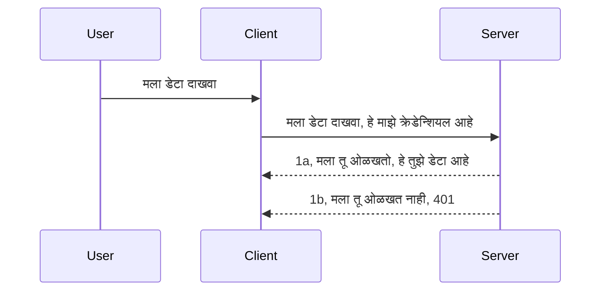

# साधी प्रमाणीकरण

MCP SDKs OAuth 2.1 चा वापर करण्यास समर्थन करतात, जे खरं तर एक गुंतागुंतीचा प्रकिया आहे ज्यामध्ये auth server, resource server, क्रेडेन्शियल पोस्ट करणे, कोड मिळवणे, ते कोड एक्सचेंज करून bearer टोकन मिळवणे, जोपर्यंत तुम्हाला शेवटी तुमचा resource डेटा मिळू शकतो असे संकल्पना समाविष्ट आहेत. जर तुम्ही OAuth चा वापर केला नसेल, जो अंमलात आणण्यासाठी छान आहे, तर एक प्राथमिक स्तराचा प्रमाणीकरणापासून सुरुवात करणे आणि नंतर अधिक उत्तम सुरक्षिततेकडे जाणे एक चांगली कल्पना आहे. म्हणूनच हा अध्याय अस्तित्वात आहे, तुम्हाला अधिक प्रगत प्रमाणीकरण कडे नेण्यासाठी.

## प्रमाणीकरण, आपल्याला काय म्हणायचे आहे?

Auth हा authentication आणि authorization या दोन गोष्टींचा संक्षिप्त रूप आहे. कल्पना अशी आहे की आपल्याला दोन गोष्टी कराव्या लागतात:

- **प्रमाणीकरण**, जे हा असा प्रक्रिया आहे ज्याने आपण कोणाला आपला घरात येण्याची परवानगी द्यायची आहे का ते ओळखतो, म्हणजे त्यांना "येथे" असण्याचा अधिकार आहे का, म्हणजे आमच्या resource server ला प्रवेश आहे जिथे आमचे MCP Server वैशिष्ट्ये राहतात.
- **अधिकृतता**, ही अशी प्रक्रिया आहे ज्याद्वारे तपासले जाते की वापरकर्त्याला त्या विशिष्ट संसाधनांसाठी प्रवेश मिळावा का जे त्या मागणी करत आहेत, उदाहरणार्थ ते आदेश किंवा उत्पादने किंवा त्यांना फक्त वाचनाचा अधिकार आहे पण हटवण्याचा नाही असा दुसरा उदाहरण.

## क्रेडेन्शियल्स: आपण सिस्टमला आपल्याबद्दल कसे सांगतो

ज्यादातर वेब डेव्हलपर्स सर्व्हरला क्रेडेन्शियल देण्याबाबत विचार करतात, सहसा एक गुपित जे सांगते की ते "Authentication" भागासाठी येथे येण्यास परवानगी आहे का. हा क्रेडेन्शियल सामान्यतः वापरकर्त्याचे नाव आणि पासवर्डचे base64 एन्कोडेड आवृत्ती किंवा विशिष्ट वापरकर्त्याला अनन्य ओळखणारा API की असतो.

हे "Authorization" असे नावाच्या हेडरद्वारे पाठवले जाते:

```json
{ "Authorization": "secret123" }
```

हे सहसा बेसिक प्रमाणीकरण म्हणून ओळखले जाते. संपूर्ण फ्लो कसा कार्य करतो ते खालीलप्रमाणे आहे:


आता आपण फ्लोच्या दृष्टीने कसे कार्य करते ते समजले, आपण ते कसे अमलात आणू शकतो? बरं, बहुतेक वेब सर्व्हरमध्ये `middleware` नावाची संकल्पना असते, ही एक कोडची तुकडी असते जी विनंतीचा भाग म्हणून चालते व क्रेडेन्शियल्स पडताळते, आणि जर क्रेडेन्शियल वैध असेल तर विनंतीला पुढे जाण्याची परवानगी देते. जर विनंतीमध्ये वैध क्रेडेन्शियल नसले तर तुम्हाला प्रमाणीकरण त्रुटी मिळते. चला पाहूया हे कसे अमलात आणता येते:

**Python**

```python
class AuthMiddleware(BaseHTTPMiddleware):
    async def dispatch(self, request, call_next):

        has_header = request.headers.get("Authorization")
        if not has_header:
            print("-> Missing Authorization header!")
            return Response(status_code=401, content="Unauthorized")

        if not valid_token(has_header):
            print("-> Invalid token!")
            return Response(status_code=403, content="Forbidden")

        print("Valid token, proceeding...")
       
        response = await call_next(request)
        # कोणतेही ग्राहक हेडर्स जोडणे किंवा प्रतिसादात कोणत्याही प्रकारे बदल करणे
        return response


starlette_app.add_middleware(CustomHeaderMiddleware)
```

इथे आपल्याला:

- `AuthMiddleware` नावाचा एक middleware तयार केला आहे ज्याचा `dispatch` मेथड वेब सर्व्हरने invoke केला जात आहे.
- त्या middleware ला वेब सर्व्हरमध्ये जोडले:

    ```python
    starlette_app.add_middleware(AuthMiddleware)
    ```

- प्रमाणीकरण हेडर उपलब्ध आहे का आणि पाठवलेले गुपित वैध आहे का ते तपासणारी पडताळणी लॉजिक लिहिली:

    ```python
    has_header = request.headers.get("Authorization")
    if not has_header:
        print("-> Missing Authorization header!")
        return Response(status_code=401, content="Unauthorized")

    if not valid_token(has_header):
        print("-> Invalid token!")
        return Response(status_code=403, content="Forbidden")
    ```

    जर गुपित उपलब्ध आणि मान्य असल्यास, आपण `call_next` कॉल करून विनंतीला पुढे जाण्याची परवानगी देतो आणि प्रतिसाद परत देतो.

    ```python
    response = await call_next(request)
    # कोणतेही ग्राहक हेडर जोडा किंवा प्रतिसादात काही प्रकारे बदल करा
    return response
    ```

हे कसे कार्य करते म्हणजे जर वेब विनंती सर्व्हरकडे केली गेली तर middleware invoke होईल आणि त्याच्या अंमलबजावणीवरून ती विनंती पुढे चालू होऊ देईल किंवा क्लायंटला परवानगी नाही हे सूचित करणारी त्रुटी परत करेल.

**TypeScript**

इथे आपण Express या लोकप्रिय फ्रेमवर्कसह middleware तयार करतो आणि विनंती MCP Server पर्यंत पोहोचण्यापूर्वी इंटरसेप्ट करतो. इथे त्यासाठीचा कोड आहे:

```typescript
function isValid(secret) {
    return secret === "secret123";
}

app.use((req, res, next) => {
    // 1. अधिकृतता हेडर आहे का?
    if(!req.headers["Authorization"]) {
        res.status(401).send('Unauthorized');
    }
    
    let token = req.headers["Authorization"];

    // 2. वैधता तपासा.
    if(!isValid(token)) {
        res.status(403).send('Forbidden');
    }

   
    console.log('Middleware executed');
    // 3. विनंती पाईपलाइनमधील पुढच्या टप्प्याकडे विनंती पाठवा.
    next();
});
```

या कोडमध्ये आपण:

1. प्रथम तपासतो की Authorization हेडर आहे का, नसेल तर 401 त्रुटी पाठवतो.
2. क्रेडेन्शियल/टोकन वैध आहे का ते तपासतो, नसेल तर 403 त्रुटी पाठवतो.
3. शेवटी विनंती pipeline मध्ये पुढे पाठवतो आणि मागितलेले resource परत करतो.

## व्यायाम: प्रमाणीकरण अमलात आणा

आपल्या ज्ञानाचा उपयोग करत या समजून ते अमलात आणण्याचा प्रयत्न करूया. योजना अशी आहे:

सर्व्हर

- वेब सर्व्हर आणि MCP instance तयार करा.
- सर्व्हरसाठी middleware अमलात आणा.

क्लायंट

- हेडरद्वारे क्रेडेन्शियलसह वेब विनंती पाठवा.

### -1- वेब सर्व्हर आणि MCP instance तयार करा

आपल्या पहिल्या टप्प्यात, आपल्याला वेब सर्व्हर instance आणि MCP Server तयार करायचा आहे.

**Python**

इथे आपण MCP server instance तयार करतो, starlette वेब app तयार करतो आणि uvicorn ने होस्ट करतो.

```python
# MCP सर्व्हर तयार करीत आहे

app = FastMCP(
    name="MCP Resource Server",
    instructions="Resource Server that validates tokens via Authorization Server introspection",
    host=settings["host"],
    port=settings["port"],
    debug=True
)

# starlette वेब अ‍ॅप तयार करीत आहे
starlette_app = app.streamable_http_app()

# uvicorn द्वारा अ‍ॅपची सेवा देत आहे
async def run(starlette_app):
    import uvicorn
    config = uvicorn.Config(
            starlette_app,
            host=app.settings.host,
            port=app.settings.port,
            log_level=app.settings.log_level.lower(),
        )
    server = uvicorn.Server(config)
    await server.serve()

run(starlette_app)
```

या कोडमध्ये आपण:

- MCP Server तयार केला.
- MCP Server पासून starlette वेब app तयार केला, `app.streamable_http_app()`.
- uvicorn वापरून वेब app होस्ट आणि सर्व्हर केला, `server.serve()`.

**TypeScript**

इथे आपण MCP Server instance तयार करतो.

```typescript
const server = new McpServer({
      name: "example-server",
      version: "1.0.0"
    });

    // ... सर्व्हर संसाधने, साधने, आणि प्रम्पट्स सेट करा ...
```

हा MCP Server निर्माण आपल्या POST /mcp मार्गनिर्देशात घडवला जाणार आहे, तर वर दिलेला कोड पुढीलप्रमाणे हलवूया:

```typescript
import express from "express";
import { randomUUID } from "node:crypto";
import { McpServer } from "@modelcontextprotocol/sdk/server/mcp.js";
import { StreamableHTTPServerTransport } from "@modelcontextprotocol/sdk/server/streamableHttp.js";
import { isInitializeRequest } from "@modelcontextprotocol/sdk/types.js"

const app = express();
app.use(express.json());

// सत्र आयडीने वाहतूक संग्रहित करण्यासाठी नकाशा
const transports: { [sessionId: string]: StreamableHTTPServerTransport } = {};

// क्लायंट-टू-सर्व्हर संवादासाठी POST विनंत्या हाताळा
app.post('/mcp', async (req, res) => {
  // विद्यमान सत्र आयडी तपासा
  const sessionId = req.headers['mcp-session-id'] as string | undefined;
  let transport: StreamableHTTPServerTransport;

  if (sessionId && transports[sessionId]) {
    // विद्यमान वाहतूक पुनरुक्त करा
    transport = transports[sessionId];
  } else if (!sessionId && isInitializeRequest(req.body)) {
    // नवीन प्रारंभिक विनंती
    transport = new StreamableHTTPServerTransport({
      sessionIdGenerator: () => randomUUID(),
      onsessioninitialized: (sessionId) => {
        // सत्र आयडीने वाहतूक संग्रहित करा
        transports[sessionId] = transport;
      },
      // मागील सुसंगततेसाठी डीएनएस रीबाइंडिंग संरक्षण डिफॉल्टने अक्षम आहे. तुम्ही हा सर्व्हर स्थानिकरित्या चालवत असाल, तर खात्री करा की:
      // सेट करणे:
      // enableDnsRebindingProtection: true,
      // allowedHosts: ['127.0.0.1'],
    });

    // बंद झाल्यावर वाहतूक साफ करा
    transport.onclose = () => {
      if (transport.sessionId) {
        delete transports[transport.sessionId];
      }
    };
    const server = new McpServer({
      name: "example-server",
      version: "1.0.0"
    });

    // ... सर्व्हर संसाधने, साधने, आणि प्रॉम्प्ट्स सेट करा ...

    // MCP सर्व्हरशी कनेक्ट करा
    await server.connect(transport);
  } else {
    // अवैध विनंती
    res.status(400).json({
      jsonrpc: '2.0',
      error: {
        code: -32000,
        message: 'Bad Request: No valid session ID provided',
      },
      id: null,
    });
    return;
  }

  // विनंती हाताळा
  await transport.handleRequest(req, res, req.body);
});

// GET आणि DELETE विनंत्यांसाठी पुनर्नवीनीकरण करण्यायोग्य हँडलर
const handleSessionRequest = async (req: express.Request, res: express.Response) => {
  const sessionId = req.headers['mcp-session-id'] as string | undefined;
  if (!sessionId || !transports[sessionId]) {
    res.status(400).send('Invalid or missing session ID');
    return;
  }
  
  const transport = transports[sessionId];
  await transport.handleRequest(req, res);
};

// SSE च्या माध्यमातून सर्व्हर-टू-क्लायंट सूचना साठी GET विनंत्या हाताळा
app.get('/mcp', handleSessionRequest);

// सत्र समाप्तीसाठी DELETE विनंत्या हाताळा
app.delete('/mcp', handleSessionRequest);

app.listen(3000);
```

आता तुम्ही पहात आहात की MCP Server तयार करणे `app.post("/mcp")` च्या आत हलवले गेले आहे.

चला पुढच्या टप्प्याकडे जाऊया, म्हणजे middleware तयार करण्याकडे जेणेकरून आपण येणारे क्रेडेन्शियल पडताळू शकू.

### -2- सर्व्हरसाठी middleware अमलात आणा

आता पुढे middleware भागाकडे जाऊया. इथे आपण असा middleware तयार करू जो `Authorization` हेडरमधील क्रेडेन्शियल शोधतो आणि पडताळणी करतो. जर ते स्वीकार्य असेल तर विनंती पुढे जाईल आणि हवी तशी क्रिया (उदाहरणार्थ, साधने यादी, संसाधन वाचणे किंवा क्लायंटने विनंती केलेल्या MCP फंक्शनॅलिटी) करू शकते.

**Python**

middleware तयार करण्यासाठी, आपल्याला `BaseHTTPMiddleware` पासून वारसाहक्क घेणारी एक वर्ग तयार करावी लागेल. येथे दोन महत्त्वाचे भाग आहेत:

- `request` विनंती, ज्यातून आपण हेडर माहिती वाचतो.
- `call_next` हा callback आपण कॉल करतो जर क्लायंटने आम्हाला मान्य असलेले क्रेडेन्शियल आणले असेल तर.

प्रथम, जर `Authorization` हेडर अनुपस्थित असेल तर त्याची हाताळणी करणे आवश्यक आहे:

```python
has_header = request.headers.get("Authorization")

# कोणताही हेडर नाही, 401 सह अपयशी करा, नाहीतर पुढे जा.
if not has_header:
    print("-> Missing Authorization header!")
    return Response(status_code=401, content="Unauthorized")
```

इथे आपण 401 unauthorized संदेश पाठवतो कारण क्लायंट प्रमाणीकरण अयशस्वी होत आहे.

नंतर, जर क्रेडेन्शियल सादर केले गेले, तर त्याची वैधता अशी तपासतो:

```python
 if not valid_token(has_header):
    print("-> Invalid token!")
    return Response(status_code=403, content="Forbidden")
```

वर 403 forbidden संदेश कसा पाठवतो ते पाहा. खाली संपूर्ण middleware आहे जो आपण वरील सर्व काही अमलात आणले आहे:

```python
class AuthMiddleware(BaseHTTPMiddleware):
    async def dispatch(self, request, call_next):

        has_header = request.headers.get("Authorization")
        if not has_header:
            print("-> Missing Authorization header!")
            return Response(status_code=401, content="Unauthorized")

        if not valid_token(has_header):
            print("-> Invalid token!")
            return Response(status_code=403, content="Forbidden")

        print("Valid token, proceeding...")
        print(f"-> Received {request.method} {request.url}")
        response = await call_next(request)
        response.headers['Custom'] = 'Example'
        return response

```

छान, पण `valid_token` फंक्शन काय? ते खाली आहे:

```python
# उत्पादनासाठी वापरू नका - सुधारणा करा !!
def valid_token(token: str) -> bool:
    # "Bearer " हा उपसर्ग काढा
    if token.startswith("Bearer "):
        token = token[7:]
        return token == "secret-token"
    return False
```

हे नक्कीच सुधारले जाऊ शकते.

महत्त्वाचे: तुम्ही कधीही अशा गुपितांचा कोडमध्ये समावेश करू नये. आदर्शतः, तुम्हाला तुलना करण्यासाठी मूल्य डेटास्रोत किंवा IDP (ओळख सेवा पुरवठादार) कडून मिळवले पाहिजे किंवा चांगले म्हणजे, IDP कडे पडताळणी करायला द्यावी.

**TypeScript**

Express वापरून हे अमलात आणण्यासाठी, आपल्याला `use` मेथड कॉल करावा लागेल जो middleware फंक्शन्स स्वीकारतो.

आपल्याला:

- `Authorization` प्रॉपर्टीतील क्रेडेन्शियल तपासण्यासाठी विनंती वेरियेबलशी संवाद साधणे आवश्यक आहे.
- क्रेडेन्शियल पडताळणी करणे, आणि जर वैध असेल तर विनंतीला पुढे जाण्याची परवानगी देणे आणि क्लायंटचा MCP विनंती योग्यरीत्या करणे (उदाहरणार्थ, साधने यादी, संसाधन वाचन किंवा MCP संबंधित काहीही).

येथे आपण तपासतो की `Authorization` हेडर आहे का आणि जर नाही, तर विनंती पुढे जाण्यापासून थांबवतो:

```typescript
if(!req.headers["authorization"]) {
    res.status(401).send('Unauthorized');
    return;
}
```

जर हेडर सुरुवातीला पाठवले गेले नाही तर तुम्हाला 401 त्रुटी मिळते.

नंतर आपण क्रेडेन्शियल वैध आहे का ते तपासतो, नाहीतर पुन्हा विनंती थांबवतो पण थोडक्या वेगळ्या संदेशासह:

```typescript
if(!isValid(token)) {
    res.status(403).send('Forbidden');
    return;
} 
```

याप्रमाणे तुम्हाला 403 त्रुटी मिळते.

इथे संपूर्ण कोड आहे:

```typescript
app.use((req, res, next) => {
    console.log('Request received:', req.method, req.url, req.headers);
    console.log('Headers:', req.headers["authorization"]);
    if(!req.headers["authorization"]) {
        res.status(401).send('Unauthorized');
        return;
    }
    
    let token = req.headers["authorization"];

    if(!isValid(token)) {
        res.status(403).send('Forbidden');
        return;
    }  

    console.log('Middleware executed');
    next();
});
```

आपण वेब सर्व्हर सेट केला आहे ज्यामध्ये क्लायंट कदाचित पाठवत असलेल्या क्रेडेन्शियलची पडताळणी करण्यासाठी middleware आहे. क्लायंट काय करत आहे?

### -3- हेडरद्वारे क्रेडेन्शियलसह वेब विनंती पाठवा

आपल्याला खात्री करावी लागेल की क्लायंट हेडरमध्ये क्रेडेन्शियल पाठवत आहे. आपण MCP क्लायंट वापरणार असल्यामुळे, ते कसे केले जाते ते शोधणे आवश्यक आहे.

**Python**

क्लायंटसाठी, आपल्याला अशी हेडर पाठवावी लागते:

```python
# मूल्य हार्डकोड करू नका, किमान ते पर्यावरण बदलनशक्य (environment variable) किंवा अधिक सुरक्षित संग्रहणात ठेवा
token = "secret-token"

async with streamablehttp_client(
        url = f"http://localhost:{port}/mcp",
        headers = {"Authorization": f"Bearer {token}"}
    ) as (
        read_stream,
        write_stream,
        session_callback,
    ):
        async with ClientSession(
            read_stream,
            write_stream
        ) as session:
            await session.initialize()
      
            # TODO, क्लायंटमध्ये काय करायचे आहे, उदा. साधने यादी करणे, साधने कॉल करणे इत्यादी.
```

कसे आपण `headers` प्रॉपर्टी भरणार हे पाहा, उदाहरणार्थ ` headers = {"Authorization": f"Bearer {token}"}`.

**TypeScript**

हे दोन टप्प्यांत सोडवता येईल:

1. आपला क्रेडेन्शियल वापरून कॉन्फिगरेशन ऑब्जेक्ट भरा.
2. कॉन्फिगरेशन ऑब्जेक्ट ट्रान्सपोर्टकडे पाठवा.

```typescript

// येथे दाखविल्याप्रमाणे मूल्य हार्डकोड करू नका. किमान ते एक पर्यावरण चल म्हणून ठेवा आणि काहीतरी dotenv सारखे वापरा (डेव्हलपमेंट मोडमध्ये).
let token = "secret123"

// क्लायंट ट्रान्सपोर्ट पर्याय ऑब्जेक्ट परिभाषित करा
let options: StreamableHTTPClientTransportOptions = {
  sessionId: sessionId,
  requestInit: {
    headers: {
      "Authorization": "secret123"
    }
  }
};

// पर्याय ऑब्जेक्ट ट्रान्सपोर्टला पास करा
async function main() {
   const transport = new StreamableHTTPClientTransport(
      new URL(serverUrl),
      options
   );
```

इथे तुम्ही पाहता कसे आपल्याला `options` ऑब्जेक्ट तयार करावे लागले आणि मग `requestInit` प्रॉपर्टी अंतर्गत आपल्या हेडर्स ठेवले.

महत्त्वाचे: आपण यापासून कसे सुधारू? सध्याच्या अंमलबजावणीमध्ये काही समस्या आहेत. प्रथम म्हणजे, अशा प्रकारे क्रेडेन्शियल पास करणे म्हणजे धोका आहे जोपर्यंत तुमच्याकडे किमान HTTPS नाही. त्या नंतरही, क्रेडेन्शियल चोरी होऊ शकते म्हणून तुम्हाला अशी प्रणाली हवी जेथे तुम्ही टोकन रद्द करू शकता आणि अतिरिक्त तपासणी करू शकता जसे की ते कुठून येत आहे, विनंती खूप वेळा होते का (बॉट सारखे वर्तन), एकंदर अनेक चिंता आहेत.

तरीही असे म्हणता येईल की, फारसे सोप्या API साठी जिथे तुम्हाला कोणताही तुमचा API authentication शिवाय कॉल करु नये, इथे आपण चांगले सुरुवात केली आहे.

हे सांगितल्यावर, चला सुरक्षा काहीशी वाढवू, JSON Web Token जेणेकरून ज्याला JWT किंवा "JOT" टोकन्स देखील म्हणतात, असा प्रमाणित स्वरूप वापरून.

## JSON वेब टोकन्स, JWT

तर, आपण सोप्या क्रेडेन्शियल्स पाठवण्यापासून सुधारणा करण्याचा प्रयत्न करतो आहोत. JWT कारण काय झटपट सुधारणा मिळतात?

- **सुरक्षा सुधारणा**. बेसिक ऑथमध्ये आपण वापरकर्तानाव आणि पासवर्ड base64 एन्कोडेड टोकन (किंवा API की) म्हणून पुन्हा पुन्हा पाठवतो ज्यामुळे धोका वाढतो. JWT मध्ये, आपण आपले वापरकर्तानाव आणि पासवर्ड पाठवतो आणि प्रत्येकीसाठी टोकन मिळतो आणि ते वेळ-सीमित असते म्हणजे ते एक्सपायर होते. JWT तुम्हाला भूमिकांनुसार, स्कोप्सनुसार आणि परवानग्यांनुसार सूक्ष्म नियंत्रण वापरण्यास देते.
- **स्टेटलेसनेस आणि स्केलेबिलिटी**. JWT हे स्व-संकलित असतात, ते सर्व वापरकर्ता माहिती ठेवतात आणि सर्व्हर-साइड सत्र संग्रहित करण्याची गरज समाप्त करतात. टोकन स्थानिकरित्या देखील पडताळता येऊ शकतो.
- **इंटरऑपरेबिलिटी आणि फेडरेशन**. JWT हे Open ID Connect चे केंद्र आहेत आणि एंटरआयडी, गुगल ओळख आणि Auth0 सारख्या प्रसिद्ध ओळख पुरवठादारांसह वापरले जातात. ते सिंगल साइन-ऑनसारख्या फिचर्सचीही अनुमती देतात आणि खूप काही जे त्यांना एंटरप्राइझ-ग्रेड बनवते.
- **मॉड्युलरिटी आणि लवचिकता**. JWT API गेटवे जसे की Azure API Management, NGINX आणि अधिक वापरता येतात. ते वापरकर्ता प्रमाणीकरण परिस्थिती आणि सर्व्हर-टू-सर्व्हिस संवादांसह नकली व्यक्ती आणि प्रतिनिधीकरण परिस्थिती पूर्ण करतात.
- **कार्यक्षमता आणि कॅशिंग**. JWT वेगळ्या केल्यानंतर कॅश होऊ शकतात जे पार्सिंगची गरज कमी करते. हे उच्च-ट्रॅफिक app साठी उपयोगी आहे कारण हे थ्रूपुट सुधारते आणि निवडलेल्या इन्फ्रास्ट्रक्चरवरील ओझे कमी करते.
- **प्रगत वैशिष्ट्ये**. हे introspection (सर्व्हरवर वैधता तपासणे) आणि रद्द करणे (टोकन अवैध करणे) देखील समर्थन करते.

ही सर्व फायदे घेऊन, आपण आपली अंमलबजावणी पुढील स्तरावर कशी नेऊ शकतो ते पाहूया.

## बेसिक ऑथ चे JWT मध्ये रूपांतर

तर, महत्त्वाच्या पातळीवर आपल्याला जे बदल करायचे आहेत ते:

- **JWT टोकन तयार करणे शिकणे** आणि ते क्लायंट कडून सर्व्हरकडे पाठवण्यास तयार करणे.
- **JWT टोकनचे पडताळणी करणे**, आणि जर वैध असेल तर क्लायंटला आपले संसाधन द्याणे.
- **टोकन सुरक्षित साठवण**. आपण टोकन कसे साठवतो.
- **मार्गांचे संरक्षण करणे**. आपल्याला मार्ग व विशिष्ट MCP वैशिष्ट्यांचे संरक्षण करायचे आहे.
- **रिफ्रेश टोकन्स जोडणे**. आपण लहान कालावधीचे टोकन तयार करणे आणि त्याचबरोबर रिफ्रेश टोकन्स (जे दीर्घकाळ टिकतात) जे टोकन संपल्यास नवीन टोकन मिळवण्यासाठी वापरता येतात हे सुनिश्चित करा. तसेच एक रिफ्रेश एंडपॉइंट आणि रोटेशन धोरण असावे.

### -1- JWT टोकन तयार करा

प्रथम, JWT टोकनमध्ये खालील भाग असतात:

- **हेडर**, वापरलेले अल्गोरिदम आणि टोकन प्रकार.
- **पेलोड**, क्लेम्स, जसे sub (वापरकर्ता किंवा संस्था ज्याचे प्रतिनिधित्व टोकन करते. प्रमाणीकरण परिस्थितीत हे सहसा userid असेल), exp (कधी टोकन एक्सपायर होईल), role (भूमिका).
- **सिग्नेचर**, गुपित किंवा खासगी कीने स्वाक्षरी केलेले.

यासाठी, आपण हेडर, पेलोड तयार करावे आणि एन्कोडेड टोकन बनवावे लागेल.

**Python**

```python

import jwt
import jwt
from jwt.exceptions import ExpiredSignatureError, InvalidTokenError
import datetime

# JWT साइन करण्यासाठी वापरलेली गुप्त की
secret_key = 'your-secret-key'

header = {
    "alg": "HS256",
    "typ": "JWT"
}

# वापरकर्त्याची माहिती आणि त्याचे दावे व कालबद्धता
payload = {
    "sub": "1234567890",               # विषय (वापरकर्ता आयडी)
    "name": "User Userson",                # सानुकूल दावा
    "admin": True,                     # सानुकूल दावा
    "iat": datetime.datetime.utcnow(),# जारी केलेले
    "exp": datetime.datetime.utcnow() + datetime.timedelta(hours=1)  # कालबद्धता
}

# एन्कोड करा
encoded_jwt = jwt.encode(payload, secret_key, algorithm="HS256", headers=header)
```

वरील कोडमध्ये आपण:

- HS256 अल्गोरिदम वापरून हेडर परिभाषित केला आणि प्रकार JWT दिला.
- पेलोड तयार केला ज्यात एक विषय किंवा वापरकर्ता आयडी, वापरकर्तानाव, भूमिका, जारी केलेला वेळ आणि एक्सपायर होण्याचा वेळ आहे, ज्यामुळे आपण आधी उल्लेख केलेली वेळ-सीमा अंमलात येते.

**TypeScript**

इथे आपल्याला काही अवलंबित्वे लागतील ज्यामुळे आपण JWT टोकन तयार करू शकू.

अवलंबित्वे

```sh

npm install jsonwebtoken
npm install --save-dev @types/jsonwebtoken
```

आता हे असल्यावर, चला हेडर, पेलोड तयार करू आणि त्यातून एन्कोडेड टोकन तयार करू.

```typescript
import jwt from 'jsonwebtoken';

const secretKey = 'your-secret-key'; // उत्पादनात env vars वापरा

// पेलोड निश्चित करा
const payload = {
  sub: '1234567890',
  name: 'User usersson',
  admin: true,
  iat: Math.floor(Date.now() / 1000), // जारी केले
  exp: Math.floor(Date.now() / 1000) + 60 * 60 // 1 तासानंतर कालबाह्य होईल
};

// हेडर निश्चित करा (ऐच्छिक, jsonwebtoken डिफॉल्ट सेट करते)
const header = {
  alg: 'HS256',
  typ: 'JWT'
};

// टोकन तयार करा
const token = jwt.sign(payload, secretKey, {
  algorithm: 'HS256',
  header: header
});

console.log('JWT:', token);
```

हे टोकन:

HS256 वापरून स्वाक्षरी केलेले
1 तासासाठी वैध
sub, name, admin, iat, आणि exp सारखे क्लेम्स समाविष्ट.

### -2- टोकन पडताळणी करा

आपल्याला टोकन पडताळणीसाठी देखील गरज आहे, ही गोष्ट सर्व्हरकडे करावी लागेल जेणेकरून क्लायंट जे पाठवत आहे ते खरेच वैध आहे याची खात्री करणे. अनेक तपासण्या कराव्या लागतील, ज्यामध्ये त्याची रचना आणि वैधता तपासणे समाविष्ट आहे. तुम्हाला इतर तपास२५णीसाठी प्रोत्साहन देखील दिले जाते जसे वापरकर्ता आपल्या सिस्टममध्ये आहे का आणि अधिक.

टोकन पडताळणीसाठी, आपल्याला ते डीकोड करावे लागेल जेणेकरून आपण त्याचे वाचन करू शकू आणि नंतर त्याची वैधता तपासू शकू:

**Python**

```python

# JWT डिकोड करा आणि सत्यापित करा
try:
    decoded = jwt.decode(token, secret_key, algorithms=["HS256"])
    print("✅ Token is valid.")
    print("Decoded claims:")
    for key, value in decoded.items():
        print(f"  {key}: {value}")
except ExpiredSignatureError:
    print("❌ Token has expired.")
except InvalidTokenError as e:
    print(f"❌ Invalid token: {e}")

```

या कोडमध्ये आपण `jwt.decode` कॉल करतो टोकन, गुपित की आणि निवडलेली अल्गोरिदम इनपुट म्हणून देऊन. पहा कशी आपण try-catch संरचना वापरली आहे कारण पडताळणी अपयशी झाल्यास त्रुटी निर्माण होते.

**TypeScript**

इथे आपण `jwt.verify` कॉल करतो ज्यामुळे आपण टोकन डीकोड केलेला स्वरूप मिळवतो जो पुढे विश्लेषण करू शकतो. जर हा कॉल अपयशी झाला तर याचा अर्थ टोकनची रचना चुकीची आहे किंवा ते आणखी वैध नाही.

```typescript

try {
  const decoded = jwt.verify(token, secretKey);
  console.log('Decoded Payload:', decoded);
} catch (err) {
  console.error('Token verification failed:', err);
}
```

टीप: पूर्वी म्हटल्याप्रमाणे, आपण अतिरिक्त तपासण्या कराव्यात जेणेकरून हे टोकन आपल्या सिस्टममधील वापरकर्त्यास सूचित करते आणि वापरकर्त्यास त्याचे हक्क आहेत याची खात्री करावी.
पुढे, चला भूमिका आधारित प्रवेश नियंत्रणाकडे पाहूया, ज्याला RBAC म्हणून देखील ओळखले जाते.

## भूमिका आधारित प्रवेश नियंत्रण जोडणे

तुम्हाला व्यक्त करायचे आहे की वेगवेगळ्या भूमिकांना वेगवेगळ्या परवानग्या आहेत. उदाहरणार्थ, आपण गृहित धरतो की एक अॅडमिन सर्व काही करू शकतो आणि एक सामान्य वापरकर्ता वाचन/लेखन करू शकतो आणि एक पाहुणा फक्त वाचन करू शकतो. त्यामुळे, येथे काही शक्य परवानगी स्तर आहेत:

- Admin.Write  
- User.Read  
- Guest.Read  

चला पाहूया की आपण असे नियंत्रण मिडलवेअरने कसे अंमलात आणू शकतो. मध्यवर्ती धारक वेगळ्या मार्गासाठी तसेच सर्व मार्गांसाठी जोडले जाऊ शकतात.

**Python**

```python
from starlette.middleware.base import BaseHTTPMiddleware
from starlette.responses import JSONResponse
import jwt

# सांकेतिक कोडमध्ये गुपित ठेवू नका, हे फक्त प्रदर्शनासाठी आहे. ते सुरक्षित ठिकाणाहून वाचा.
SECRET_KEY = "your-secret-key" # हे env व्हेरिएबलमध्ये ठेवा
REQUIRED_PERMISSION = "User.Read"

class JWTPermissionMiddleware(BaseHTTPMiddleware):
    async def dispatch(self, request, call_next):
        auth_header = request.headers.get("Authorization")
        if not auth_header or not auth_header.startswith("Bearer "):
            return JSONResponse({"error": "Missing or invalid Authorization header"}, status_code=401)

        token = auth_header.split(" ")[1]
        try:
            decoded = jwt.decode(token, SECRET_KEY, algorithms=["HS256"])
        except jwt.ExpiredSignatureError:
            return JSONResponse({"error": "Token expired"}, status_code=401)
        except jwt.InvalidTokenError:
            return JSONResponse({"error": "Invalid token"}, status_code=401)

        permissions = decoded.get("permissions", [])
        if REQUIRED_PERMISSION not in permissions:
            return JSONResponse({"error": "Permission denied"}, status_code=403)

        request.state.user = decoded
        return await call_next(request)


```
  
मिडलवेअर खालीलप्रमाणे जोडण्यासाठी काही वेगवेगळे मार्ग आहेत:

```python

# पर्याय 1: starlette अॅप तयार करताना मिडलवेअर जोडा
middleware = [
    Middleware(JWTPermissionMiddleware)
]

app = Starlette(routes=routes, middleware=middleware)

# पर्याय 2: starlette अॅप आधीच तयार झाल्यानंतर मिडलवेअर जोडा
starlette_app.add_middleware(JWTPermissionMiddleware)

# पर्याय 3: प्रत्येक मार्गासाठी मिडलवेअर जोडा
routes = [
    Route(
        "/mcp",
        endpoint=..., # हँडलर
        middleware=[Middleware(JWTPermissionMiddleware)]
    )
]
```
  
**TypeScript**

आपण `app.use` वापरू शकतो आणि एक मिडलवेअर जे सर्व विनंत्यांसाठी चालेल.

```typescript
app.use((req, res, next) => {
    console.log('Request received:', req.method, req.url, req.headers);
    console.log('Headers:', req.headers["authorization"]);

    // 1. तपासा की अधिकृतता हेडर पाठवले गेले आहे का

    if(!req.headers["authorization"]) {
        res.status(401).send('Unauthorized');
        return;
    }
    
    let token = req.headers["authorization"];

    // 2. तपासा की टोकन वैध आहे का
    if(!isValid(token)) {
        res.status(403).send('Forbidden');
        return;
    }  

    // 3. तपासा की टोकन वापरकर्ता आमच्या प्रणालीमध्ये अस्तित्वात आहे का
    if(!isExistingUser(token)) {
        res.status(403).send('Forbidden');
        console.log("User does not exist");
        return;
    }
    console.log("User exists");

    // 4. टोकनकडे योग्य परवानग्या असण्याची पडताळणी करा
    if(!hasScopes(token, ["User.Read"])){
        res.status(403).send('Forbidden - insufficient scopes');
    }

    console.log("User has required scopes");

    console.log('Middleware executed');
    next();
});

```
  
आम्ही मिडलवेअरला खालील कामे करण्याची आणि करणे आवश्यक आहे अशा गोष्टी येतात, मुख्यतः:

1. तपासा की प्राधिकरण शीर्षलेख उपस्थित आहे की नाही  
2. तपासा की टोकन वैध आहे का, आम्ही `isValid` कॉल करतो जे आम्ही लिहिलेली एक पद्धत आहे जी JWT टोकनची अखंडता आणि वैधता तपासते.  
3. वापरकर्ता आमच्या प्रणालीत अस्तित्वात आहे की नाही, हे तपासले पाहिजे.

   ```typescript
    // DB मधील वापरकर्ते
   const users = [
     "user1",
     "User usersson",
   ]

   function isExistingUser(token) {
     let decodedToken = verifyToken(token);

     // TODO, तपासा की वापरकर्ता DB मध्ये आहे का
     return users.includes(decodedToken?.name || "");
   }
   ```
  
वर आम्ही एक अतिशय सोपी `users` सूची तयार केली आहे, जी अर्थातच डेटाबेसमध्ये असावी.

4. याशिवाय, आम्हाला टोकनमध्ये योग्य परवानग्या आहेत का हेही तपासले पाहिजे.

   ```typescript
   if(!hasScopes(token, ["User.Read"])){
        res.status(403).send('Forbidden - insufficient scopes');
   }
   ```
  
वरील या मिडलवेअरच्या कोडमध्ये, आपण तपासतो की टोकनमध्ये User.Read परवानगी आहे की नाही, नसल्यास आम्ही 403 त्रुटी पाठवतो. खाली `hasScopes` सहाय्यक पद्धत आहे.

   ```typescript
   function hasScopes(scope: string, requiredScopes: string[]) {
     let decodedToken = verifyToken(scope);
    return requiredScopes.every(scope => decodedToken?.scopes.includes(scope));
  }  
   ```

Have a think which additional checks you should be doing, but these are the absolute minimum of checks you should be doing.

Using Express as a web framework is a common choice. There are helpers library when you use JWT so you can write less code.

- `express-jwt`, helper library that provides a middleware that helps decode your token.
- `express-jwt-permissions`, this provides a middleware `guard` that helps check if a certain permission is on the token.

Here's what these libraries can look like when used:

```typescript
const express = require('express');
const jwt = require('express-jwt');
const guard = require('express-jwt-permissions')();

const app = express();
const secretKey = 'your-secret-key'; // put this in env variable

// Decode JWT and attach to req.user
app.use(jwt({ secret: secretKey, algorithms: ['HS256'] }));

// Check for User.Read permission
app.use(guard.check('User.Read'));

// multiple permissions
// app.use(guard.check(['User.Read', 'Admin.Access']));

app.get('/protected', (req, res) => {
  res.json({ message: `Welcome ${req.user.name}` });
});

// Error handler
app.use((err, req, res, next) => {
  if (err.code === 'permission_denied') {
    return res.status(403).send('Forbidden');
  }
  next(err);
});

```
  
आता तुम्ही पाहिले की मिडलवेअर प्रमाणपत्रन आणि अधिकारासाठी कसे वापरले जाऊ शकते, पण MCP बद्दल काय, तरीही ते प्रमाणपत्रन करण्याचा मार्ग बदलते का? पुढील विभागात ते पाहूया.

### -3- MCP मध्ये RBAC जोडणे

तुम्ही आतापर्यंत पाहिले आहे की तुम्ही मिडलवेअरद्वारे RBAC कसे जोडू शकता, तथापि MCP साठी प्रत्येक MCP वैशिष्ट्यासाठी RBAC जोडणे सोपे नाही, तर आपण काय करतो? ठीक आहे, आपल्याला अशा प्रकारे कोड जोडावा लागतो जो या परिस्थितीत तपासतो की क्लायंटकडे विशिष्ट टूल कॉल करण्याचा अधिकार आहे का:

तुमच्याकडे प्रत्येक वैशिष्ट्यासाठी RBAC साध्य करण्यासाठी काही भिन्न निवडी आहेत, येथे काही आहेत:

- प्रत्येक टूल, स्रोत, प्रॉम्प्टसाठी तपासणी जोडा जिथे तुम्हाला परवानगी स्तर तपासायचा आहे.

   **python**

   ```python
   @tool()
   def delete_product(id: int):
      try:
          check_permissions(role="Admin.Write", request)
      catch:
        pass # क्लायंटला अधिकृतता मिळाली नाही, अधिकृतता त्रुटी उभे करा
   ```
  
   **typescript**

   ```typescript
   server.registerTool(
    "delete-product",
    {
      title: Delete a product",
      description: "Deletes a product",
      inputSchema: { id: z.number() }
    },
    async ({ id }) => {
      
      try {
        checkPermissions("Admin.Write", request);
        // करायचे आहे, ओळख उत्पादनसेवा आणि रिमोट एन्ट्रीला पाठवा
      } catch(Exception e) {
        console.log("Authorization error, you're not allowed");  
      }

      return {
        content: [{ type: "text", text: `Deletected product with id ${id}` }]
      };
    }
   );
   ```


- प्रगत सर्व्हर पद्धत आणि विनंती हाताळणारे वापरा ज्यामुळे तुम्हाला तपासणी करण्याच्या ठिकाणी कमी जाता येईल.

   **Python**

   ```python
   
   tool_permission = {
      "create_product": ["User.Write", "Admin.Write"],
      "delete_product": ["Admin.Write"]
   }

   def has_permission(user_permissions, required_permissions) -> bool:
      # user_permissions: वापरकर्त्याकडे असलेल्या परवानग्यांची यादी
      # required_permissions: साधनासाठी आवश्यक परवानग्यांची यादी
      return any(perm in user_permissions for perm in required_permissions)

   @server.call_tool()
   async def handle_call_tool(
     name: str, arguments: dict[str, str] | None
   ) -> list[types.TextContent]:
    # समजा request.user.permissions ही वापरकर्त्याच्या परवानग्यांची यादी आहे
     user_permissions = request.user.permissions
     required_permissions = tool_permission.get(name, [])
     if not has_permission(user_permissions, required_permissions):
        # त्रुटी उचला "तुमच्याकडे साधन {name} कॉल करण्याची परवानगी नाही"
        raise Exception(f"You don't have permission to call tool {name}")
     # पुढे चालू ठेवा आणि साधन कॉल करा
     # ...
   ```   
    

   **TypeScript**

   ```typescript
   function hasPermission(userPermissions: string[], requiredPermissions: string[]): boolean {
       if (!Array.isArray(userPermissions) || !Array.isArray(requiredPermissions)) return false;
       // वापरकर्त्याकडे किमान एक आवश्यक परवानगी असल्यास खरे परत करा
       
       return requiredPermissions.some(perm => userPermissions.includes(perm));
   }
  
   server.setRequestHandler(CallToolRequestSchema, async (request) => {
      const { params: { name } } = request;
  
      let permissions = request.user.permissions;
  
      if (!hasPermission(permissions, toolPermissions[name])) {
         return new Error(`You don't have permission to call ${name}`);
      }
  
      // पुढे चालू ठेवा..
   });
   ```
  
   लक्षात घ्या, तुम्हाला खात्री करावी लागेल की तुमचे मिडलवेअर मागणीच्या user गुणधर्माला डिकोड केलेले टोकन नियुक्त करते जेणेकरून वरील कोड सोपा बनतो.

### सारांश

आता आपण RBAC सामान्यतः आणि MCP साठी जोडण्याचा कसा विचार केला आहे, त्यामुळे आता तुम्ही स्वयंपूर्ण सुरक्षा अंमलात आणण्याचा प्रयत्न करा जेणेकरून तुम्ही तुमच्यासमोर प्रस्तुत केलेल्या संकल्पना समजल्या असल्याचे निश्चित करता येईल.

## असाइनमेंट 1: मूलभूत प्रमाणीकरण वापरून mcp सर्व्हर आणि mcp क्लायंट तयार करा

येथे तुम्ही कोणत्या प्रकारे हेडरद्वारे क्रेडेन्शियल पाठवायचे ते शिकलात.

## उपाय 1

[उपाय 1](./code/basic/README.md)

## असाइनमेंट 2: असाइनमेंट 1 मधील उपाय सुधारून JWT वापरा

प्रथम उपाय घ्या पण या वेळी, आपण त्यावर सुधारणा करूया.

मूलभूत प्रमाणीकरणाऐवजी, आपण JWT वापरूया.

## उपाय 2

[उपाय 2](./solution/jwt-solution/README.md)

## आव्हान

ज्या "MCP मध्ये RBAC जोडा" विभागात वर्णन केले आहे त्या प्रमाणे प्रत्येक टूलसाठी RBAC जोडा.

## सारांश

तुम्ही आशा आहे की या प्रकरणातून बरच काही शिकलात, एकूणच कोणतीही सुरक्षा नसल्यापासून, मूलभूत सुरक्षा, JWT आणि ते MCP मध्ये कसे जोडले जाऊ शकते.

आम्ही कस्टम JWT सह मजबूत पाया तयार केला आहे, पण विस्तार झाल्यामुळे आम्ही मानक-आधारित ओळख मॉडेलकडे जाणार आहोत. Entra किंवा Keycloak सारखे IdP स्वीकारल्याने आम्ही टोकन जारी करणे, सत्यापन, आणि जीवनचक्र व्यवस्थापन एक विश्वसनीय प्लॅटफॉर्मवर सोपवू शकतो — जे आपल्याला अ‍ॅप लॉजिक आणि वापरकर्ता अनुभवावर लक्ष केंद्रीत करण्यास मोकळं करतं.

त्यासाठी, आमच्याकडे आणखी एक [प्रगत प्रकरण Entra वर](../../05-AdvancedTopics/mcp-security-entra/README.md) आहे.

## पुढे काय

- पुढे: [MCP होस्ट्स सेट करणे](../12-mcp-hosts/README.md)

---

<!-- CO-OP TRANSLATOR DISCLAIMER START -->
**अस्वीकरण**:
हा दस्तऐवज AI अनुवाद सेवा [Co-op Translator](https://github.com/Azure/co-op-translator) वापरून अनुवादित केला आहे. आम्ही अचूकतेसाठी प्रयत्नशील आहोत, तरी कृपया लक्षात घ्या की स्वयंचलित अनुवादांमध्ये चुका किंवा अचूकतेच्या त्रुटी असू शकतात. मूळ दस्तऐवज त्याच्या मूळ भाषेत अधिकारप्राप्त स्रोत मानला जावा. महत्त्वाच्या माहितीसाठी व्यावसायिक मानव अनुवाद करण्याची शिफारस केली जाते. या अनुवादाच्या वापरातून उद्भवणाऱ्या कोणत्याही गैरसमजूं किंवा चुकीच्या अर्थव्यवस्थेसाठी आम्ही जबाबदार नाही आहोत.
<!-- CO-OP TRANSLATOR DISCLAIMER END -->