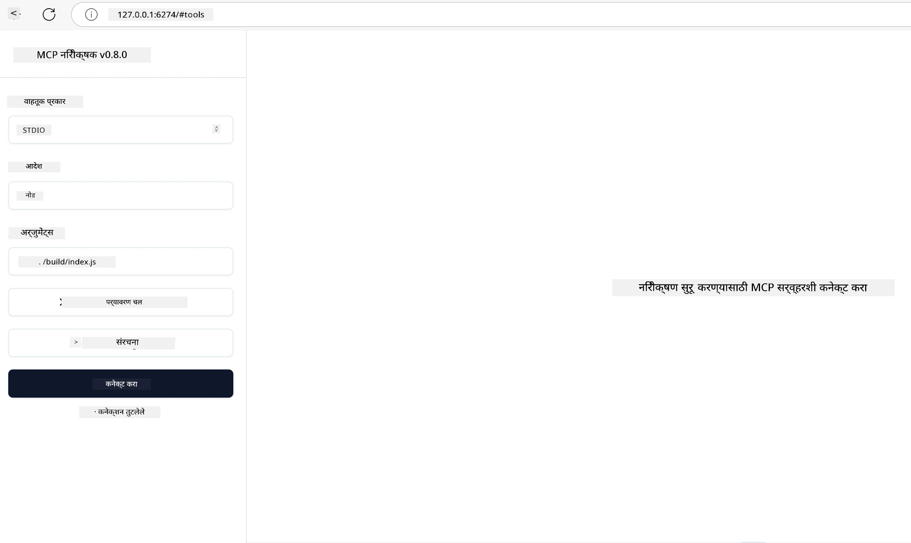

# प्रायोगिक अंमलबजावणी

[](https://youtu.be/vCN9-mKBDfQ)

_(या धड्याचा व्हिडिओ पाहण्यासाठी वरील प्रतिमा क्लिक करा)_

प्रायोगिक अंमलबजावणी म्हणजे मॉडेल संदर्भ प्रोटोकॉल (MCP) ची ताकद जिथे स्पष्ट होते तिथे. MCP मागील सिद्धांत आणि आर्किटेक्चर समजून ही महत्त्वाची आहे, पण खरी किंमत त्यावेळी दिसून येते जेव्हा तुम्ही या संकल्पनांचा वापर करून प्रत्यक्ष सोल्यूशन्स तयार करता, चाचणी करता आणि रिअल-वर्ल्ड समस्यांचे निराकरण करणाऱ्या उपाययोजना तैनात करता. हा प्रकरण वैचारिक ज्ञान आणि प्रत्यक्ष विकास यामध्ये पूल बांधतो, आणि तुम्हाला MCP-आधारित अ‍ॅप्लिकेशन्सला जीवनात आणण्याच्या प्रक्रियेत मार्गदर्शन करतो.

तुम्ही बुद्धिमान सहाय्यक विकसित करत असाल, व्यवसायाच्या कार्यप्रवाहांमध्ये AI समाकलित करत असाल किंवा डेटा प्रक्रियेकरिता सानुकूल साधने तयार करत असाल, MCP एक लवचिक पाया प्रदान करतो. याचा भाषा-स्वतंत्र डिझाइन आणि लोकप्रिय प्रोग्रामिंग भाषांसाठी अधिकृत SDKs अनेक प्रकारच्या विकासकांसाठी उपलब्ध करून देतात. या SDKs चा वापर करून तुम्ही पटकन प्रोटोटाइप तयार करू शकता, पुनरावृत्ती करू शकता आणि विविध प्लॅटफॉर्म व पर्यावरणांमध्ये तुमची सोल्यूशन्स विस्तारित करू शकता.

खालील विभागांमध्ये तुम्हाला प्रायोगिक उदाहरणे, नमुना कोड आणि तैनातीच्या धोरणांचा आढावा मिळेल जे C#, Java with Spring, TypeScript, JavaScript, आणि Python मध्ये MCP कसे अंमलात आणायचे हे दाखवतात. तसेच तुम्हाला तुमच्या MCP सर्व्हर्सचे डिबग आणि चाचणी कसे करायचे, API व्यवस्थापित कसे करायचे आणि Azure वापरून क्लाऊडवर सोल्यूशन्स तैनात कसे करायचे हे शिकायला मिळेल. हे प्रत्यक्षातील संसाधने तुमच्या शिक्षणाला वेग देण्यासाठी आणि तुम्हाला विश्वासाने मजबूत, उत्पादनासाठी तयार MCP अ‍ॅप्लिकेशन्स तयार करण्यास मदत करण्यासाठी डिझाइन केलेले आहेत.

## आढावा

हा धडा MCP अंमलबजावणीचे व्यावहारिक पैलू अनेक प्रोग्रामिंग भाषांमध्ये कसे वापरायचे यावर लक्ष केंद्रीत करतो. आपण C#, Java with Spring, TypeScript, JavaScript, आणि Python मध्ये MCP SDK चा वापर करून कसे मजबूत अ‍ॅप तयार करायचे, MCP सर्व्हर्सचे डिबग आणि चाचणी कशी करायची आणि पुनर्वापरयोग्य संसाधने, प्रॉम्प्ट्स आणि साधने कशी तयार करायची हे अभ्यास करू.

## शिका उद्दिष्टे

या धड्याच्या शेवटी, तुम्हाला पुढील गोष्टी करता येतील:

- विविध प्रोग्रामिंग भाषांमध्ये अधिकृत SDK चा वापर करून MCP सोल्यूशन्स अंमलात आणणे
- MCP सर्व्हर्सची प्रणालीबद्ध डिबग आणि चाचणी करणे
- सर्व्हर वैशिष्ट्ये (संसाधने, प्रॉम्प्ट्स आणि साधने) तयार करणे आणि वापरणे
- क्लिष्ट कार्यांसाठी प्रभावी MCP कार्यप्रवाह डिझाइन करणे
- कार्यक्षमता आणि विश्वासार्हतेसाठी MCP अंमलबजावणीचे ऑप्टिमायझेशन करणे

## अधिकृत SDK संसाधने

मॉडेल संदर्भ प्रोटोकॉल अनेक भाषांसाठी अधिकृत SDKs देतो ([MCP specification 2025-11-25](https://spec.modelcontextprotocol.io/specification/2025-11-25/) नुसार):

- [C# SDK](https://github.com/modelcontextprotocol/csharp-sdk)
- [Java with Spring SDK](https://github.com/modelcontextprotocol/java-sdk) **टीप:** यासाठी [Project Reactor](https://projectreactor.io) वर निर्भरता आवश्यक आहे. ([चर्चा इश्यू 246](https://github.com/orgs/modelcontextprotocol/discussions/246) पहा.)
- [TypeScript SDK](https://github.com/modelcontextprotocol/typescript-sdk)
- [Python SDK](https://github.com/modelcontextprotocol/python-sdk)
- [Kotlin SDK](https://github.com/modelcontextprotocol/kotlin-sdk)
- [Go SDK](https://github.com/modelcontextprotocol/go-sdk)

## MCP SDKs सह काम करणे

हा विभाग अनेक प्रोग्रामिंग भाषांमध्ये MCP अंमलबजावणीसाठी प्रायोगिक उदाहरणे देतो. तुम्हाला `samples` निर्देशिका मध्ये भाषानुसार व्यवस्थित केलेला नमुना कोड मिळेल.

### उपलब्ध नमुने

या संग्रहामध्ये खालील भाषांमध्ये [नमुना अंमलबजावणी](../../../04-PracticalImplementation/samples) आहे:

- [C#](./samples/csharp/README.md)
- [Java with Spring](./samples/java/containerapp/README.md)
- [TypeScript](./samples/typescript/README.md)
- [JavaScript](./samples/javascript/README.md)
- [Python](./samples/python/README.md)

प्रत्येक नमुना त्या विशिष्ट भाषा आणि परिसंस्थेसाठी MCP ची मुख्य संकल्पना आणि अंमलबजावणी नमुने दाखवतो.

### प्रायोगिक मार्गदर्शक

अतिरिक्त मार्गदर्शक प्रायोगिक MCP अंमलबजावणीसाठी:

- [पृष्ठीकरण आणि मोठ्या निकाल संच](./pagination/README.md) - साधने, संसाधने, आणि मोठ्या डेटासेटसाठी कर्सर-आधारित पृष्ठीकरण हाताळणे

## मुख्य सर्व्हर वैशिष्ट्ये

MCP सर्व्हर्स खालील कोणत्याही वैशिष्ट्यांचा समावेश करू शकतात:

### संसाधने

संसाधने वापरकर्त्यासाठी किंवा AI मॉडेलसाठी संदर्भ आणि डेटा प्रदान करतात:

- दस्तऐवज संच
- ज्ञानमूलक आधार
- संरचित डेटा स्त्रोत
- फाइल सिस्टिम

### प्रॉम्प्ट्स

प्रॉम्प्ट्स म्हणजे वापरकर्त्यांसाठी तयार केलेले साच्यांचे संदेश आणि कार्यप्रवाह:

- पूर्वनिर्धारित संभाषण टेम्पलेट्स
- मार्गदर्शित संवाद नमुने
- विशेष संवाद संरचना

### साधने

साधने म्हणजे AI मॉडेलसाठी कार्यान्वित करण्यासाठीच्या फंक्शन्स:

- डेटा प्रक्रिया साधने
- बाह्य API समाकलने
- गणनात्मक क्षमता
- शोध कार्यक्षमता

## नमुना अंमलबजावणी: C# अंमलबजावणी

अधिकृत C# SDK संग्रहामध्ये MCP चे वेगवेगळ्या पैलू दाखवणारी अनेक नमुना अंमलबजावण्या आहेत:

- **मूलभूत MCP क्लायंट:** MCP क्लायंट कसा तयार करायचा आणि साधने कशी कॉल करायची हे दाखवणारा सोपा उदाहरण
- **मूलभूत MCP सर्व्हर:** मूलभूत साधने नोंदणीसह साधा सर्व्हर अंमलबजावणी
- **प्रगत MCP सर्व्हर:** टूल नोंदणी, प्रमाणीकरण आणि त्रुटी प्रतिबंधनासहित पूर्ण वैशिष्ट्यांचा सर्व्हर
- **ASP.NET एकत्रीकरण:** ASP.NET Core सह एकत्रीकरण दर्शवणारी उदाहरणे
- **साधन अंमलबजावणी नमुने:** वेगवेगळ्या जटिलतेच्या स्तरांसह साधने अंमलबजावणीसाठी विविध नमुने

MCP C# SDK सध्या प्रीव्यू मध्ये आहे आणि API मध्ये बदल होऊ शकतात. SDK विकसित होत असल्यामुळे हा ब्लॉग सतत अद्यतनित करीत राहू.

### मुख्य वैशिष्ट्ये

- [C# MCP Nuget ModelContextProtocol](https://www.nuget.org/packages/ModelContextProtocol)
- तुमचा [पहिला MCP सर्व्हर तयार करा](https://devblogs.microsoft.com/dotnet/build-a-model-context-protocol-mcp-server-in-csharp/).

पूर्ण C# अंमलबजावणी नमुन्यांसाठी, अधिकृत C# SDK नमुन्यांच्या संग्रहाला भेट द्या: [https://github.com/modelcontextprotocol/csharp-sdk](https://github.com/modelcontextprotocol/csharp-sdk)

## नमुना अंमलबजावणी: Java with Spring अंमलबजावणी

Java with Spring SDK एंटरप्राइझ-ग्रेड वैशिष्ट्यांसह मजबूत MCP अंमलबजावणी पर्याय प्रदान करतो.

### मुख्य वैशिष्ट्ये

- Spring Framework सह एकत्रीकरण
- मजबूत टाइप सुरक्षा
- प्रतिसादक्षम प्रोग्रामिंग समर्थन
- सर्वसमावेशक त्रुटी हाताळणी

पूर्ण Java with Spring अंमलबजावणी नमुन्यासाठी, `samples` निर्देशिकेतील [Java with Spring नमुना](samples/java/containerapp/README.md) पहा.

## नमुना अंमलबजावणी: JavaScript अंमलबजावणी

JavaScript SDK कलाकुसरदार आणि लवचिक MCP अंमलबजावणीसाठी हलके आणि सोप्या दृष्टिकोनाचा वापर करतो.

### मुख्य वैशिष्ट्ये

- Node.js आणि ब्राउझर समर्थन
- वचन-आधारित API
- Express आणि इतर फ्रेमवर्कसह नित्य समाकलन
- स्ट्रीमिंगसाठी WebSocket समर्थन

पूर्ण JavaScript अंमलबजावणी नमुन्यासाठी, `samples` निर्देशिकेतील [JavaScript नमुना](samples/javascript/README.md) पहा.

## नमुना अंमलबजावणी: Python अंमलबजावणी

Python SDK अत्युत्तम ML फ्रेमवर्क समाकलनासहित Pythonic दृष्टिकोनाने MCP अंमलबजावणी देतो.

### मुख्य वैशिष्ट्ये

- asyncio सह Async/await समर्थन
- FastAPI एकत्रीकरण
- साधी साधने नोंदणी
- लोकप्रिय ML ग्रंथालयांसह मूळ एकत्रीकरण

पूर्ण Python अंमलबजावणी नमुन्यासाठी, `samples` निर्देशिकेतील [Python नमुना](samples/python/README.md) पहा.

## API व्यवस्थापन

Azure API व्यवस्थापन हे MCP सर्व्हर्ससाठी संरक्षण कसे करायचे याचा उत्तम उपाय आहे. कल्पना अशी की तुमच्या MCP सर्व्हरच्या समोर Azure API व्यवस्थापनाची एक उदाहरण ठेवा आणि ते खालीलसारख्या आवश्यक वैशिष्ट्ये हाताळेल:

- दर मर्यादा
- टोकन व्यवस्थापन
- निरीक्षण
- लोड संतुलन
- सुरक्षा

### Azure नमुना

खाली एक Azure नमुना आहे ज्यात तेच केले जाते, म्हणजे [MCP सर्व्हर तयार करणे आणि Azure API व्यवस्थापनाने सुरक्षित करणे](https://github.com/Azure-Samples/remote-mcp-apim-functions-python).

प्राधिकरण प्रवाह खालील प्रतिमेमध्ये कसा होतो ते पहा:


या प्रतिमेमध्ये खालील घडते:

- प्रमाणीकरण/अधिकार्यता Microsoft Entra वापरून केली जाते.
- Azure API व्यवस्थापन गेटवे म्हणून कार्य करते आणि धोरणांचा वापर करून ट्रॅफिकचे मार्गदर्शन आणि व्यवस्थापन करते.
- Azure Monitor पुढील विश्लेषणासाठी सर्व विनंत्यांची नोंद करतो.

#### प्राधिकरण प्रवाह

प्राधिकरण प्रवाह अधिक तपशीलाने पाहू या:


#### MCP प्राधिकरण तपशील

अधिक माहितीसाठी [MCP प्राधिकरण तपशील](https://spec.modelcontextprotocol.io/specification/2025-11-25/basic/authorization/) पहा

## रिमोट MCP सर्व्हर Azure वर तैनात करा

पूर्वी नमूद केलेला नमुना तैनात करू शकतो का पाहू:

1. रेपो क्लोन करा

    ```bash
    git clone https://github.com/Azure-Samples/remote-mcp-apim-functions-python.git
    cd remote-mcp-apim-functions-python
    ```

1. `Microsoft.App` संसाधन प्रदाता नोंदणी करा.

   - Azure CLI वापरत असल्यास, `az provider register --namespace Microsoft.App --wait` चालवा.
   - Azure PowerShell वापरत असल्यास, `Register-AzResourceProvider -ProviderNamespace Microsoft.App` चालवा. नंतर थोड्या वेळाने `(Get-AzResourceProvider -ProviderNamespace Microsoft.App).RegistrationState` चालवून नोंदणी पूर्ण झाली आहे का ते तपासा.

1. API व्यवस्थापन सेवा, फंक्शन अप (कोडसह) आणि इतर सर्व आवश्यक Azure संसाधने पुरवण्यासाठी हा [azd](https://aka.ms/azd) आदेश चालवा

    ```shell
    azd up
    ```

    हा आदेश Azure वर सर्व क्लाऊड संसाधने तैनात करेल

### MCP इंन्स्पेक्टरसह तुमचा सर्व्हर चाचणी करा

1. **नवीन टर्मिनल विंडो** मध्ये, MCP Inspector इंस्टॉल करा आणि चालवा

    ```shell
    npx @modelcontextprotocol/inspector
    ```

    तुम्हाला खालीलप्रमाणे इंटरफेस दिसेल:

    

1. CTRL सह क्लिक करून MCP Inspector वेब अ‍ॅप त्या URL वरून लोड करा (उदा. [http://127.0.0.1:6274/#resources](http://127.0.0.1:6274/#resources))
1. ट्रान्सपोर्ट प्रकार `SSE` ठेवा
1. तुमच्या चालू असलेल्या API व्यवस्थापन SSE एंडपॉइंटचा URL `azd up` नंतर दिसणारा वापरा आणि **Connect** करा:

    ```shell
    https://<apim-servicename-from-azd-output>.azure-api.net/mcp/sse
    ```

1. **साधने यादी बदला**. एका टूलवर क्लिक करा आणि **Tool चालवा**.

जर सर्व पावले व्यवस्थित पार पडली असतील तर तुम्ही आता MCP सर्व्हरला जोडलेले असाल आणि टूल कॉल करण्यात यशस्वी झालात.

## Azure साठी MCP सर्व्हर्स

[Remote-mcp-functions](https://github.com/Azure-Samples/remote-mcp-functions-dotnet): Python, C# .NET किंवा Node/TypeScript वापरून Azure Functions सह सानुकूल रिमोट MCP (Model Context Protocol) सर्व्हर्स तयार करण्यासाठी आणि तैनात करण्यासाठी जलद प्रारंभ टेम्पलेट्सचा संच.

नमुने विकसितकर्त्यांसाठी संपूर्ण सोल्यूशन प्रदान करतात जे:

- स्थानिकरित्या तयार करा आणि चालवा: स्थानिक मशीनवर MCP सर्व्हर विकसित आणि डिबग करा
- Azure वर तैनात करा: सोप्या `azd up` आदेशाने क्लाऊडवर सहज तैनात करा
- क्लायंटकडून कनेक्ट करा: विविध क्लायंट, जसे VS Code चे Copilot एजंट मोड आणि MCP Inspector टूल यांच्याकडून MCP सर्व्हरशी कनेक्ट करा

### मुख्य वैशिष्ट्ये

- डिझाइननुसार सुरक्षा: MCP सर्व्हर कीज आणि HTTPS वापरून सुरक्षित आहे
- प्रमाणीकरणासाठी पर्याय: API व्यवस्थापनेसह अंगभूत प्राधिकरण आणि/किंवा OAuth समर्थन
- नेटवर्क वेगळेपणा: Azure व्हर्च्युअल नेटवर्क्स (VNET) वापरून नेटवर्क वेगळेपणा
- सर्व्हरलेस आर्किटेक्चर: Azure Functions वापरून प्रमाणबद्ध, इव्हेंट-चालित अंमल
- स्थानिक विकास: व्यापक स्थानिक विकास आणि डिबगिंग समर्थन
- सोपी तैनाती: Azure साठी सुलभ तैनाती प्रक्रिया

संग्रहामध्ये सर्व आवश्यक कॉन्फिगरेशन फाइल्स, स्रोत कोड आणि इन्फ्रास्ट्रक्चर परिभाषा आहेत ज्यामुळे चवथ्या तयार उत्पादन-सज्ज MCP सर्व्हर अंमलबजावणीवर लगेच काम सुरू करता येते.

- [Azure Remote MCP Functions Python](https://github.com/Azure-Samples/remote-mcp-functions-python) - Python वापरून Azure Functions सह MCP चे नमुना अंमलबजावणी

- [Azure Remote MCP Functions .NET](https://github.com/Azure-Samples/remote-mcp-functions-dotnet) - C# .NET वापरून Azure Functions सह MCP चे नमुना अंमलबजावणी

- [Azure Remote MCP Functions Node/Typescript](https://github.com/Azure-Samples/remote-mcp-functions-typescript) - Node/TypeScript वापरून Azure Functions सह MCP चे नमुना अंमलबजावणी.

## महत्वाच्या गोष्टी

- MCP SDKs भाषा-विशिष्ट साधने प्रदान करतात ज्यामुळे मजबूत MCP सोल्यूशन्स तयार करता येतात
- डिबगिंग आणि चाचणी प्रक्रिया विश्वासार्ह MCP अ‍ॅप्ससाठी महत्वाची आहे
- पुनर्वापरयोग्य प्रॉम्प्ट टेम्पलेट्स एकसंध AI संवाद सक्षम करतात
- चांगल्या डिझाइन केलेल्या कार्यप्रवाहांनी अवघड कामांसाठी विविध साधने एकत्र काम करू शकतात
- MCP सोल्यूशन्सची अंमलबजावणी करताना सुरक्षा, कार्यक्षमता आणि त्रुटी हाताळणी यांचा विचार करणे गरजेचे आहे

## व्यायाम

तुमच्या कार्य क्षेत्रातील खऱ्या समस्येवर आधारित एक व्यावहारिक MCP कार्यप्रवाह डिझाइन करा:

1. या समस्येचे निराकरण करण्यासाठी 3-4 उपयुक्त साधने ओळखा
2. या साधनांचा परस्पर कसा वापर होतो हे दर्शवणारा कार्यप्रवाह आकृती तयार करा
3. तुमच्या आवडत्या भाषेमध्ये एका साधनाचा मूलभूत आवृत्ती अंमलात आणा
4. मॉडेलला प्रभावीपणे तुमची साधने वापरण्यास मदत करण्यासाठी एक प्रॉम्प्ट टेम्पलेट तयार करा

## अतिरिक्त संसाधने

---

## पुढे काय

पुढचे: [प्रगत विषय](../05-AdvancedTopics/README.md)

---

<!-- CO-OP TRANSLATOR DISCLAIMER START -->
**अस्वीकरण**:
हा दस्तऐवज AI भाषांतर सेवेसह [Co-op Translator](https://github.com/Azure/co-op-translator) वापरून भाषांतरित केला गेला आहे. आम्ही अचूकतेसाठी प्रयत्नशील असलो तरी, कृपया ध्यानात घ्या की स्वयंचलित भाषांतरांमध्ये चुका किंवा अपूर्णता असू शकते. मूळ दस्तऐवज त्याच्या स्थानिक भाषेत अधिकृत स्रोत मानला जावा. महत्त्वपूर्ण माहितीकरिता व्यावसायिक मानवी भाषांतराची शिफारस केली जाते. या भाषांतराचा वापर केल्यामुळे होणाऱ्या कोणत्याही गैरसमजुती किंवा चुकीच्या अर्थ लावण्याची जबाबदारी आम्ही घेत नाही.
<!-- CO-OP TRANSLATOR DISCLAIMER END -->