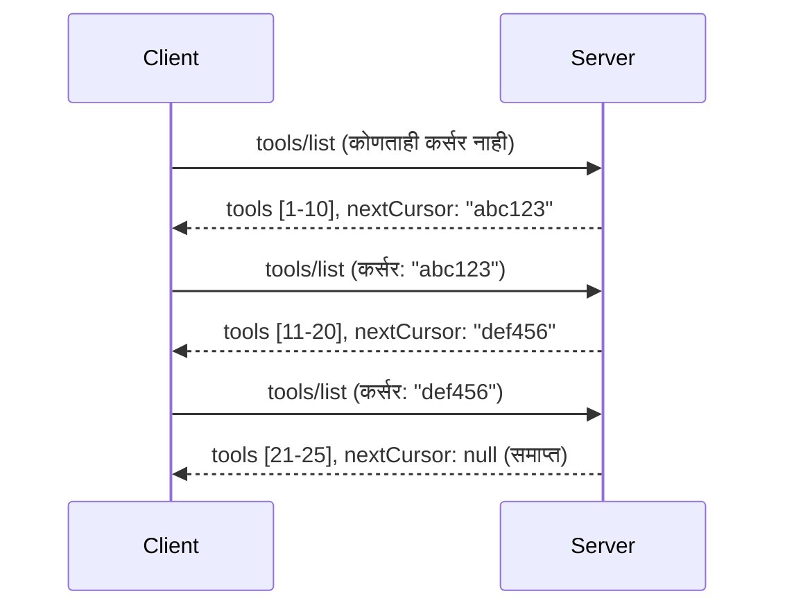

# MCP मध्ये पॅजिनेशन आणि मोठ्या परिणाम संच

जेव्हा तुमचा MCP सर्व्हर मोठ्या डेटासेटस हाताळतो - हजारो फायली, डेटाबेस नोंदी किंवा शोध परिणामांची यादी करताना - तुम्हाला मेमरी कार्यक्षमतेने व्यवस्थापित करण्यासाठी आणि प्रतिसाद देणारा वापरकर्ता अनुभव प्रदान करण्यासाठी पॅजिनेशनची आवश्यकता असते. हा मार्गदर्शक MCP मध्ये पॅजिनेशन कसे राबवायचे आणि वापरायचे यावर आहे.

## पॅजिनेशन का महत्त्वाचा आहे

पॅजिनेशनशिवाय, मोठे प्रतिसाद यामुळे होऊ शकतात:

- **मेमरी संपणा** - एकाच वेळी कोट्यवधी नोंदी लोड करणे
- **मंद प्रतिसाद वेळा** - वापरकर्ते सर्व डेटा लोड होईपर्यंत थांबतात
- **टाईमआउट चुका** - विनंत्या टाईमआउट मर्यादांपेक्षा जास्त होतात
- **कमकुवत AI कामगिरी** - LLMs मोठ्या संदर्भांसाठी संघर्ष करतात

MCP वापरते **कर्सर-आधारित पॅजिनेशन** जे परिणाम संचांमधून विश्वासार्ह, सातत्यपूर्ण पेजिंग करते.

---

## MCP पॅजिनेशन कसे कार्य करते

### कर्सर संकल्पना

एक **कर्सर** म्हणजे एक अस्पष्ट स्ट्रिंग जे परिणाम संचातील तुमची स्थिती दर्शवते. याला एका लांब पुस्तकातील ठेच्याचा ठसा समजून घ्या.


### MCP पद्धतीतील पॅजिनेशन

हे MCP पद्धती पॅजिनेशनला समर्थन देतात:

| पद्धत | परत करते | कर्सर समर्थन |
|--------|---------|----------------|
| `tools/list` | साधने परिभाषा | ✅ |
| `resources/list` | संसाधन परिभाषा | ✅ |
| `prompts/list` | प्रॉम्प्ट परिभाषा | ✅ |
| `resources/templates/list` | संसाधन टेम्पलेट्स | ✅ |

---

## सर्व्हर अंमलबजावणी

### Python (FastMCP)

```python
from mcp.server import Server
from mcp.types import Tool, ListToolsResult
import math

app = Server("paginated-server")

# अनुकरण केलेली मोठी डेटासेट
ALL_TOOLS = [
    Tool(name=f"tool_{i}", description=f"Tool number {i}", inputSchema={})
    for i in range(100)
]

PAGE_SIZE = 10

@app.list_tools()
async def list_tools(cursor: str | None = None) -> ListToolsResult:
    """List tools with pagination support."""
    
    # प्रारंभिक अनुक्रमणिका मिळवण्यासाठी कर्सर डीकोड करा
    start_index = 0
    if cursor:
        try:
            start_index = int(cursor)
        except ValueError:
            start_index = 0
    
    # निकालांची पृष्ठ मिळवा
    end_index = min(start_index + PAGE_SIZE, len(ALL_TOOLS))
    page_tools = ALL_TOOLS[start_index:end_index]
    
    # पुढचा कर्सर गणना करा
    next_cursor = None
    if end_index < len(ALL_TOOLS):
        next_cursor = str(end_index)
    
    return ListToolsResult(
        tools=page_tools,
        nextCursor=next_cursor
    )
```

### TypeScript

```typescript
import { Server } from "@modelcontextprotocol/sdk/server/index.js";
import { ListToolsResultSchema } from "@modelcontextprotocol/sdk/types.js";

const server = new Server({
  name: "paginated-server",
  version: "1.0.0"
});

// अनुकरण केलेला मोठा डेटासेट
const ALL_TOOLS = Array.from({ length: 100 }, (_, i) => ({
  name: `tool_${i}`,
  description: `Tool number ${i}`,
  inputSchema: { type: "object", properties: {} }
}));

const PAGE_SIZE = 10;

server.setRequestHandler(ListToolsResultSchema, async (request) => {
  // कर्सर डीकोड करा
  let startIndex = 0;
  if (request.params?.cursor) {
    startIndex = parseInt(request.params.cursor, 10) || 0;
  }
  
  // निकालांचे पृष्ठ मिळवा
  const endIndex = Math.min(startIndex + PAGE_SIZE, ALL_TOOLS.length);
  const pageTools = ALL_TOOLS.slice(startIndex, endIndex);
  
  // पुढील कर्सर काढा
  const nextCursor = endIndex < ALL_TOOLS.length ? String(endIndex) : undefined;
  
  return {
    tools: pageTools,
    nextCursor
  };
});
```

### Java (Spring MCP)

```java
@Service
public class PaginatedToolService {
    
    private static final int PAGE_SIZE = 10;
    private final List<Tool> allTools;
    
    public PaginatedToolService() {
        // मोठ्या डेटासेटची सुरुवात करा
        this.allTools = IntStream.range(0, 100)
            .mapToObj(i -> new Tool("tool_" + i, "Tool number " + i, Map.of()))
            .collect(Collectors.toList());
    }
    
    @McpMethod("tools/list")
    public ListToolsResult listTools(@Param("cursor") String cursor) {
        // कर्सर डीकोड करा
        int startIndex = 0;
        if (cursor != null && !cursor.isEmpty()) {
            try {
                startIndex = Integer.parseInt(cursor);
            } catch (NumberFormatException e) {
                startIndex = 0;
            }
        }
        
        // निकालांचा पृष्ठ मिळवा
        int endIndex = Math.min(startIndex + PAGE_SIZE, allTools.size());
        List<Tool> pageTools = allTools.subList(startIndex, endIndex);
        
        // पुढचा कर्सर गणना करा
        String nextCursor = endIndex < allTools.size() ? String.valueOf(endIndex) : null;
        
        return new ListToolsResult(pageTools, nextCursor);
    }
}
```

---

## क्लायंट अंमलबजावणी

### Python क्लायंट

```python
from mcp import ClientSession

async def get_all_tools(session: ClientSession) -> list:
    """Fetch all tools using pagination."""
    all_tools = []
    cursor = None
    
    while True:
        result = await session.list_tools(cursor=cursor)
        all_tools.extend(result.tools)
        
        if result.nextCursor is None:
            break
        cursor = result.nextCursor
    
    return all_tools

# वापर
async with client_session as session:
    tools = await get_all_tools(session)
    print(f"Found {len(tools)} tools")
```

### TypeScript क्लायंट

```typescript
import { Client } from "@modelcontextprotocol/sdk/client/index.js";

async function getAllTools(client: Client): Promise<Tool[]> {
  const allTools: Tool[] = [];
  let cursor: string | undefined = undefined;
  
  do {
    const result = await client.listTools({ cursor });
    allTools.push(...result.tools);
    cursor = result.nextCursor;
  } while (cursor);
  
  return allTools;
}

// वापर
const tools = await getAllTools(client);
console.log(`Found ${tools.length} tools`);
```

### लेझी लोडिंग पॅटर्न

अत्यंत मोठ्या डेटासेटसाठी, पृष्ठे मागणीवर लोड करा:

```python
class PaginatedToolIterator:
    """Lazily iterate through paginated tools."""
    
    def __init__(self, session: ClientSession):
        self.session = session
        self.cursor = None
        self.buffer = []
        self.exhausted = False
    
    async def __anext__(self):
        # बफर उपलब्ध असल्यास परत करा
        if self.buffer:
            return self.buffer.pop(0)
        
        # तपासा की आपण सर्व पृष्ठे संपवली आहेत का
        if self.exhausted:
            raise StopAsyncIteration
        
        # पुढील पृष्ठ मिळवा
        result = await self.session.list_tools(cursor=self.cursor)
        self.buffer = list(result.tools)
        self.cursor = result.nextCursor
        
        if self.cursor is None:
            self.exhausted = True
        
        if not self.buffer:
            raise StopAsyncIteration
        
        return self.buffer.pop(0)
    
    def __aiter__(self):
        return self

# वापर - मोठ्या डेटासेटसाठी मेमरी बचत करणारा
async for tool in PaginatedToolIterator(session):
    process_tool(tool)
```

---

## संसाधनांसाठी पॅजिनेशन

संसाधनांना बहुधा निर्देशिका किंवा मोठ्या डेटासेटसाठी पॅजिनेशनची गरज असते:

```python
from mcp.server import Server
from mcp.types import Resource, ListResourcesResult
import os

app = Server("file-server")

@app.list_resources()
async def list_resources(cursor: str | None = None) -> ListResourcesResult:
    """List files in directory with pagination."""
    
    directory = "/data/files"
    all_files = sorted(os.listdir(directory))
    
    # कर्सर डिकोड करा (फाइल निर्देशांक)
    start_index = int(cursor) if cursor else 0
    page_size = 20
    end_index = min(start_index + page_size, len(all_files))
    
    # या पानासाठी संसाधन यादी तयार करा
    resources = []
    for filename in all_files[start_index:end_index]:
        filepath = os.path.join(directory, filename)
        resources.append(Resource(
            uri=f"file://{filepath}",
            name=filename,
            mimeType="application/octet-stream"
        ))
    
    # पुढील कर्सर गणना करा
    next_cursor = str(end_index) if end_index < len(all_files) else None
    
    return ListResourcesResult(
        resources=resources,
        nextCursor=next_cursor
    )
```

---

## कर्सर डिझाइन धोरणे

### धोरण 1: निर्देशांक-आधारित (सोपं)

```python
# कर्सर म्हणजे फक्त अनुक्रमांक
cursor = "50"  # आयटम ५० पासून सुरू करा
```

**चांगले:** सोपे, स्टेटलेस  
**वाईट:** जर आयटम जोडले किंवा काढले तर परिणाम हलू शकतात

### धोरण 2: ID-आधारित (स्थिर)

```python
# कर्सर हा शेवटचा पाहिला आयडी आहे
cursor = "item_abc123"  # या आयटमनंतर सुरू करा
```

**चांगले:** आयटम बदलले तरी स्थिर राहतं  
**वाईट:** क्रमबद्ध ID आवश्यक

### धोरण 3: एन्कोड केलेले स्थिती (संकुल)

```python
import base64
import json

def encode_cursor(state: dict) -> str:
    return base64.b64encode(json.dumps(state).encode()).decode()

def decode_cursor(cursor: str) -> dict:
    return json.loads(base64.b64decode(cursor).decode())

# कर्सरमध्ये अनेक स्थिती क्षेत्रे आहेत
cursor = encode_cursor({
    "offset": 50,
    "filter": "active",
    "sort": "name"
})
```

**चांगले:** गुंतागुंतीची स्थिती एन्कोड करू शकते  
**वाईट:** अधिक जटिल, मोठे कर्सर स्ट्रिंग्ज

---

## सर्वोत्तम सराव

### 1. योग्य पृष्ठ आकार निवडा

```python
# डेटा आकार विचारात घ्या
PAGE_SIZE_SMALL_ITEMS = 100   # साधे मेटाडेटा
PAGE_SIZE_MEDIUM_ITEMS = 20   # अधिक समृद्ध वस्तू
PAGE_SIZE_LARGE_ITEMS = 5     # गुंतागुंतीची सामग्री
```

### 2. अवैध कर्सरसोबत समजूतदारपणे वागा

```python
@app.list_tools()
async def list_tools(cursor: str | None = None) -> ListToolsResult:
    try:
        start_index = int(cursor) if cursor else 0
        if start_index < 0 or start_index >= len(ALL_TOOLS):
            start_index = 0  # सुरुवातीला रीसेट करा
    except (ValueError, TypeError):
        start_index = 0  # अवैध कर्सर, नवीन तऱ्हेने सुरू करा
    # ...
```

### 3. एकूण संख्या समाविष्ट करा (ऐच्छिक)

```python
return ListToolsResult(
    tools=page_tools,
    nextCursor=next_cursor,
    # काही अंमलबजावणीत UI प्रगतीसाठी एकूण समाविष्ट असते
    _meta={"total": len(ALL_TOOLS)}
)
```

### 4. कडा केसेस तपासा

```python
async def test_pagination():
    # रिक्त निकाल संच
    result = await session.list_tools()
    assert result.tools == []
    assert result.nextCursor is None
    
    # एकल पृष्ठ
    result = await session.list_tools()
    assert len(result.tools) <= PAGE_SIZE
    
    # अवैध कर्सर
    result = await session.list_tools(cursor="invalid")
    assert result.tools  # पहिलं पृष्ठ परत करावं
```

---

## सामान्य चुका

### ❌ सर्व निकाल परत करून नंतर क्लायंट-साइड पॅजिनेशन करणे

```python
# खराब: सगळं मेमरीमध्ये लोड करतो
@app.list_tools()
async def list_tools() -> ListToolsResult:
    all_tools = load_all_tools()  # 1 दशलक्ष साधने!
    return ListToolsResult(tools=all_tools)
```

### ✅ डेटा स्रोतावरच पॅजिनेशन करा

```python
# चांगले: फक्त आवश्यक असलेलेच लोड करते
@app.list_tools()
async def list_tools(cursor: str | None = None) -> ListToolsResult:
    offset = int(cursor) if cursor else 0
    tools = await db.query_tools(offset=offset, limit=PAGE_SIZE)
    return ListToolsResult(tools=tools, nextCursor=...)
```

---

## पुढील काय आहे

- [Module 5.14 - Context Engineering](../../05-AdvancedTopics/mcp-contextengineering/README.md)
- [Module 8 - Best Practices](../../08-BestPractices/README.md)
- [3.8 - तुमच्या MCP सर्व्हरचे परीक्षण](../../03-GettingStarted/08-testing/README.md)

---

## अतिरिक्त संसाधने

- [MCP तपशील - पॅजिनेशन](https://spec.modelcontextprotocol.io/specification/2025-11-25/)
- [कर्सर-आधारित पॅजिनेशन स्पष्टीकरण](https://slack.engineering/evolving-api-pagination-at-slack/)
- [Python SDK पॅजिनेशन चाचण्या](https://github.com/modelcontextprotocol/python-sdk/blob/main/tests/client/test_list_methods_cursor.py)

---

<!-- CO-OP TRANSLATOR DISCLAIMER START -->
**सूचना**:
हा दस्तऐवज AI अनुवाद सेवा [Co-op Translator](https://github.com/Azure/co-op-translator) वापरून अनुवादित केला आहे. आम्ही अचूकतेसाठी प्रयत्न करतो, तरी कृपया लक्षात घ्या की स्वयंचलित अनुवादांमध्ये चुका किंवा अपवाक्ये असू शकतात. मूळ दस्तऐवज त्याच्या स्थानिक भाषेत अधिकृत स्रोत समजावा. महत्त्वाच्या माहितीकरिता व्यावसायिक मानवी अनुवाद शिफारसीय आहे. या अनुवादाच्या वापरामुळे उद्भवणाऱ्या कोणत्याही गैरसमजुतींसाठी किंवा कडवट अर्थाप्रमाणे जबाबदार आम्ही नाही.
<!-- CO-OP TRANSLATOR DISCLAIMER END -->