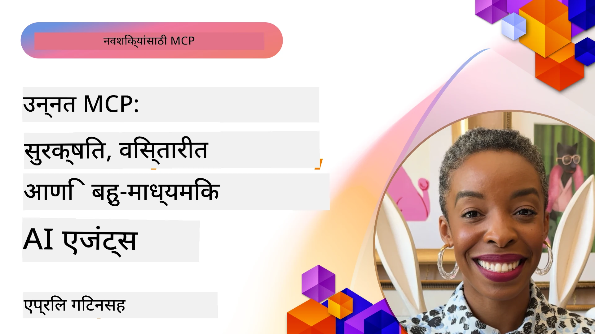

# MCP मधील प्रगत विषय

_(या धड्याचा व्हिडिओ पाहण्यासाठी वरील प्रतिमा क्लिक करा)_

हा प्रकरण Model Context Protocol (MCP) अंमलबजावणीमधील प्रगत विषयांचा एक सिरीज कव्हर करतो, ज्यात मल्टि-मोडल एकत्रीकरण, स्केलेबिलिटी, सुरक्षा सर्वोत्तम पद्धती आणि एंटरप्राइज एकत्रीकरण यांचा समावेश आहे. आधुनिक AI प्रणालींच्या मागण्या पूर्ण करण्यासाठी मजबूत आणि उत्पादन-तयार MCP अनुप्रयोग तयार करण्यासाठी हे विषय अत्यंत महत्त्वाचे आहेत.

## आढावा

हा धडा Model Context Protocol अंमलबजावणीतील प्रगत संकल्पनांचा अभ्यास करतो, ज्यावर मल्टि-मोडल एकत्रीकरण, स्केलेबिलिटी, सुरक्षा सर्वोत्तम पद्धती आणि एंटरप्राइज एकत्रीकरण यावर लक्ष केंद्रित केले आहे. एंटरप्राइज वातावरणात गुंतागुंतीच्या गरजा हाताळण्यासाठी उत्पादन-स्तरीय MCP अनुप्रयोग तयार करण्यासाठी हे विषय अत्यावश्यक आहेत.

## शिकण्याचे उद्दिष्टे

या धड्याच्या शेवटी, तुम्ही सक्षम असाल:

- MCP फ्रेमवर्कमध्ये मल्टि-मोडल क्षमता लागू करणे
- उच्च मागणीच्या परिस्थितीसाठी स्केलेबल MCP आर्किटेक्चर डिझाइन करणे
- MCP च्या सुरक्षा तत्त्वांशी सुसंगत सुरक्षा सर्वोत्तम पद्धती लागू करणे
- एंटरप्राइज AI प्रणाली आणि फ्रेमवर्कसह MCP चे एकत्रीकरण करणे
- उत्पादन वातावरणात कार्यक्षमता आणि विश्वासार्हता अनुकूलित करणे

## धडे आणि नमुना प्रकल्प

| लिंक | शीर्षक | वर्णन |
|------|--------|---------|
| [5.1 Integration with Azure](./mcp-integration/README.md) | Azure सह एकत्रीकरण | तुमच्या MCP सर्व्हरचे Azure वर एकत्रीकरण कसे करायचे ते शिका |
| [5.2 Multi modal sample](./mcp-multi-modality/README.md) | MCP मल्टि-मोडल नमुने | ऑडिओ, प्रतिमा आणि मल्टि-मोडल प्रतिसादांसाठी नमुने |
| [5.3 MCP OAuth2 sample](../../../05-AdvancedTopics/mcp-oauth2-demo) | MCP OAuth2 डेमो | OAuth2 सह MCP दर्शविणारा मिनिमल स्प्रिंग बूट अॅप, किवा Authorization आणि Resource Server म्हणून. सुरक्षित टोकन निर्गमन, संरक्षित एंडपॉइंट, Azure कंटेनर अॅप्सची तैनाती व API मॅनेजमेंट एकत्रीकरण दर्शवितो. |
| [5.4 Root Contexts](./mcp-root-contexts/README.md) | रूट संदर्भ | रूट संदर्भाबद्दल अधिक जाणून घ्या आणि त्यांची अंमलबजावणी कशी करावी ते शिका |
| [5.5 Routing](./mcp-routing/README.md) | राऊटिंग | वेगवेगळ्या प्रकारच्या राऊटिंगबद्दल शिका |
| [5.6 Sampling](./mcp-sampling/README.md) | सॅम्पलिंग | सॅम्पलिंग कसे करायचे ते शिका |
| [5.7 Scaling](./mcp-scaling/README.md) | स्केलिंग | स्केलिंगबद्दल शिका |
| [5.8 Security](./mcp-security/README.md) | सुरक्षा | तुमच्या MCP सर्व्हरला सुरक्षित करा |
| [5.9 Web Search sample](./web-search-mcp/README.md) | वेब सर्च MCP | Python MCP सर्व्हर आणि क्लायंट जो SerpAPI सह रिअल-टाइम वेब, बातम्या, उत्पादन शोध आणि प्रश्नोत्तरासाठी एकत्रित करतो. मल्टि-टूल ऑर्केस्ट्रेशन, बाह्य API एकत्रीकरण आणि विश्वासार्ह त्रुटी हाताळणी दर्शवितो. |
| [5.10 Realtime Streaming](./mcp-realtimestreaming/README.md) | स्ट्रिमिंग | रिअल-टाइम डेटा स्ट्रिमिंग आजच्या डेटा-चालित जगात अत्यावश्यक झाले आहे, जिथे व्यवसाय आणि अनुप्रयोगांना वेळेवर निर्णय घेण्यासाठी तत्काळ माहिती आवश्यक असते. |
| [5.11 Realtime Web Search](./mcp-realtimesearch/README.md) | वेब सर्च | रिअल-टाइम वेब सर्च कसे MCP ने AI मॉडेल्स, सर्च इंजिन्स आणि अनुप्रयोगांमध्ये संदर्भ व्यवस्थापनासाठी एक प्रमाणित दृष्टीकोन प्रदान करून परिवर्तित केला आहे. | 
| [5.12  Entra ID Authentication for Model Context Protocol Servers](./mcp-security-entra/README.md) | Entra ID प्रमाणीकरण | Microsoft Entra ID एक मजबूत क्लाउड-आधारित ओळख आणि प्रवेश व्यवस्थापन समाधान प्रदान करतो, जे सुनिश्चित करतो की फक्त अधिकृत वापरकर्ता आणि अनुप्रयोग तुमच्या MCP सर्व्हरशी संवाद साधू शकतात. |
| [5.13 Azure AI Foundry Agent Integration](./mcp-foundry-agent-integration/README.md) | Azure AI Foundry एकत्रीकरण | Model Context Protocol सर्व्हरना Azure AI Foundry एजंटसह कसे एकत्र करायचे ते शिका, ज्यामुळे स्टँडर्डाइज्ड बाह्य डेटा स्रोत कनेक्शन्ससह पॉवरफुल टूल ऑर्केस्ट्रेशन आणि एंटरप्राइज AI क्षमता सक्षम होतात. |
| [5.14 Context Engineering](./mcp-contextengineering/README.md) | संदर्भ अभियांत्रिकी | MCP सर्व्हरसाठी संदर्भ अभियांत्रिकी तंत्राचा भविष्यातील संधी, ज्यात संदर्भ अनुकूलन, गतिशील संदर्भ व्यवस्थापन, आणि MCP फ्रेमवर्कमध्ये कार्यक्षम प्रॉम्प्ट अभियांत्रिकीसाठी धोरणे यांचा समावेश आहे. |
| [5.15 MCP Custom Transport](./mcp-transport/README.md) | कस्टम ट्रान्सपोर्ट | विशेष MCP संवाद परिस्थितीसाठी कस्टम ट्रान्सपोर्ट मेकॅनिझम कसे लागू करायचे ते शिका. |
| [5.16 Protocol Features Deep Dive](./mcp-protocol-features/README.md) | प्रोटोकॉल वैशिष्ट्ये | प्रगत प्रोटोकॉल वैशिष्ट्ये जसे की प्रगती सूचना, विनंती रद्द करणे, संसाधन टेम्पलेट्स, आणि त्रुटी हाताळणी नमुने यांचे मालिकेनुसार मास्टर करा. |

> **MCP तपशील 2025-11-25 मध्ये नवीन**: या तपशिलात आता **Tasks** (प्रगती ट्रॅकिंगसह लांब चालणाऱ्या ऑपरेशन), **Tool Annotations** (सुरक्षेसाठी साधन वर्तनावरील मेटाडेटा), **URL Mode Elicitation** (क्लायंटकडून विशिष्ट URL सामग्रीची विनंती) आणि सुधारित **Roots** (वर्कस्पेस संदर्भ व्यवस्थापनासाठी) यांचा प्रयोगात्मक आधार समाविष्ट आहे. संपूर्ण तपशीलासाठी [MCP तपशील चेंजलॉग](https://spec.modelcontextprotocol.io/) पहा.

## अतिरिक्त संदर्भ

प्रगत MCP विषयांवरील सर्वात अद्ययावत माहितीसाठी खालील पहा:
- [MCP दस्तऐवज](https://modelcontextprotocol.io/)
- [MCP तपशील (2025-11-25)](https://spec.modelcontextprotocol.io/specification/2025-11-25/)
- [GitHub रिपॉझिटरी](https://github.com/modelcontextprotocol)
- [OWASP MCP टॉप 10](https://microsoft.github.io/mcp-azure-security-guide/mcp/) - सुरक्षा धोके आणि प्रतिबंध
- [MCP सुरक्षा शिखर कार्यशाळा (Sherpa)](https://azure-samples.github.io/sherpa/) - प्रत्यक्ष सुरक्षा प्रशिक्षण

## मुख्य मुद्दे

- मल्टि-मोडल MCP अंमलबजावण्या मजकूर प्रक्रिया पलीकडे AI क्षमता वाढवतात
- स्केलेबिलिटी एंटरप्राइज तैनातीसाठी आवश्यक आहे आणि क्षैतिज व उर्ध्वाधर दोन्ही स्केलिंगने हाताळता येऊ शकते
- सर्वसमावेशक सुरक्षा उपाय डेटा संरक्षण करतात आणि योग्य प्रवेश नियंत्रण सुनिश्चित करतात
- Azure OpenAI आणि Microsoft AI Foundry सारख्या प्लॅटफॉर्मसह एंटरप्राइज एकत्रीकरण MCP क्षमतांना वाढवते
- प्रगत MCP अंमलबजावण्या अनुकूलित आर्किटेक्चर्स आणि काळजीपूर्वक संसाधन व्यवस्थापनामुळे फायदेशीर ठरतात

## सराव

एक विशिष्ट वापरप्रकरणासाठी एंटरप्राइज-ग्रेड MCP अंमलबजावणी डिझाइन करा:

1. तुमच्या वापरप्रकरणासाठी मल्टि-मोडल गरजा ओळखा  
2. संवेदनशील डेटा संरक्षित करण्यासाठी सुरक्षा नियंत्रणांचे आराखडा तयार करा  
3. वेगवेगळ्या लोड हाताळण्यासाठी स्केलेबल आर्किटेक्चर डिझाइन करा  
4. एंटरप्राइज AI प्रणालींसह एकत्रीकरण बिंदूंच्या योजना तयार करा  
5. संभाव्य कार्यक्षमता अडचणी आणि प्रतिबंध धोरणे दस्तऐवजीकरण करा  

## अतिरिक्त संसाधने

- [Azure OpenAI दस्तऐवज](https://learn.microsoft.com/en-us/azure/ai-services/openai/)
- [Microsoft AI Foundry दस्तऐवज](https://learn.microsoft.com/en-us/ai-services/)

---

## पुढे काय

या मॉड्यूलमधील धडे [5.1 MCP Integration](./mcp-integration/README.md) पासून एक्सप्लोर करा

हा मॉड्यूल पूर्ण केल्यानंतर पुढे जा: [Module 6: Community Contributions](../06-CommunityContributions/README.md)

---

<!-- CO-OP TRANSLATOR DISCLAIMER START -->
**अस्वीकरण**:  
या दस्तऐवजाचे भाषांतर AI भाषांतर सेवा [Co-op Translator](https://github.com/Azure/co-op-translator) वापरून केले गेले आहे. आम्ही अचूकतेसाठी प्रयत्नशील असलो तरी, कृपया लक्षात घ्या की स्वयंचलित भाषांतरांमध्ये त्रुटी किंवा अचूकतेची कमतरता असू शकते. मूळ दस्तऐवज त्याच्या स्थानिक भाषेतच प्राधिकृत स्त्रोत मानला जावा. महत्त्वाच्या माहितीसाठी व्यावसायिक मानवी भाषांतर करणे शिफारसीय आहे. या भाषांतराच्या वापरामुळे उद्भवणाऱ्या कोणत्याही गैरसमजुती किंवा चुकीच्या अर्थलागी आम्ही जबाबदार नाही.
<!-- CO-OP TRANSLATOR DISCLAIMER END -->