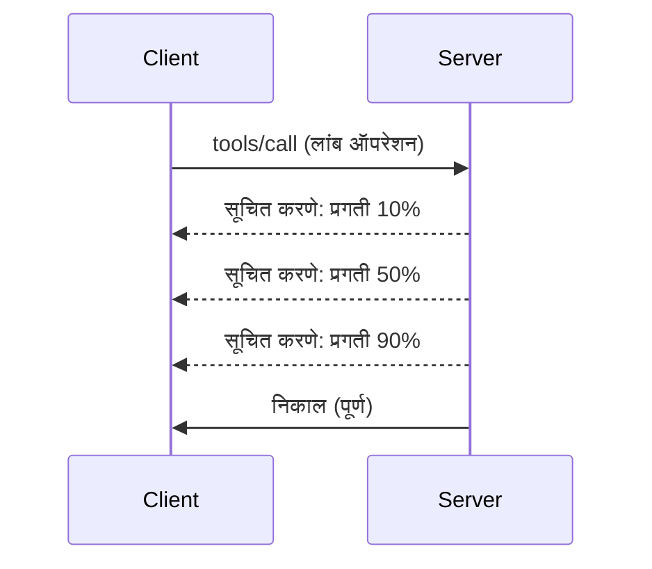

# MCP प्रोटोकॉल वैशिष्ट्ये सखोल आढावा

हा मार्गदर्शक मूलभूत टूल आणि संसाधन हाताळण्याच्या पलीकडे जाणाऱ्या प्रगत MCP प्रोटोकॉल वैशिष्ट्यांचे परीक्षण करतो. या वैशिष्ट्यांचे समज आपल्याला अधिक मजबूत, वापरकर्ता-अनुकूल आणि उत्पादन-तयार MCP सर्व्हर तयार करण्यात मदत करते.

## समाविष्ट वैशिष्ट्ये

1. **प्रगती सूचना** - दीर्घकाळ चालणाऱ्या क्रियांवर प्रगती नोंदवा
2. ** विनंती रद्द करणे** - क्लायंटना प्रवाहित विनंत्या रद्द करण्याची परवानगी देणे
3. **संसाधन टेम्पलेट्स** - पॅरामीटरसह डायनॅमिक संसाधन URI
4. **सर्व्हर जीवनचक्र घटना** - योग्य आरंभ आणि बंद
5. **लॉगिंग नियंत्रण** - सर्व्हर-साइड लॉगिंग कॉन्फिगरेशन
6. **त्रुटी हाताळणी नमुने** - सुसंगत त्रुटी प्रतिक्रिये

---

## 1. प्रगती सूचना

ज्या ऑपरेशन्सना वेळ लागतो (डेटा प्रक्रिया, फाइल डाउनलोड, API कॉल), प्रगती सूचना वापरकर्त्यांना माहिती ठेवतात.

### ते कसे कार्य करते


### Python अंमलबजावणी

```python
from mcp.server import Server, NotificationOptions
from mcp.types import ProgressNotification
import asyncio

app = Server("progress-server")

@app.tool()
async def process_large_file(file_path: str, ctx) -> str:
    """Process a large file with progress updates."""
    
    # प्रगती गणनेसाठी फाइलचा आकार मिळवा
    file_size = os.path.getsize(file_path)
    processed = 0
    
    with open(file_path, 'rb') as f:
        while chunk := f.read(8192):
            # खंड प्रक्रिया करा
            await process_chunk(chunk)
            processed += len(chunk)
            
            # प्रगतीची सूचना पाठवा
            progress = (processed / file_size) * 100
            await ctx.send_notification(
                ProgressNotification(
                    progressToken=ctx.request_id,
                    progress=progress,
                    total=100,
                    message=f"Processing: {progress:.1f}%"
                )
            )
    
    return f"Processed {file_size} bytes"

@app.tool()
async def batch_operation(items: list[str], ctx) -> str:
    """Process multiple items with progress."""
    
    results = []
    total = len(items)
    
    for i, item in enumerate(items):
        result = await process_item(item)
        results.append(result)
        
        # प्रत्येक आयटम नंतर प्रगतीची नोंद करा
        await ctx.send_notification(
            ProgressNotification(
                progressToken=ctx.request_id,
                progress=i + 1,
                total=total,
                message=f"Processed {i + 1}/{total}: {item}"
            )
        )
    
    return f"Completed {total} items"
```

### TypeScript अंमलबजावणी

```typescript
import { Server } from "@modelcontextprotocol/sdk/server/index.js";

server.setRequestHandler(CallToolSchema, async (request, extra) => {
  const { name, arguments: args } = request.params;
  
  if (name === "process_data") {
    const items = args.items as string[];
    const results = [];
    
    for (let i = 0; i < items.length; i++) {
      const result = await processItem(items[i]);
      results.push(result);
      
      // प्रगती सूचना पाठवा
      await extra.sendNotification({
        method: "notifications/progress",
        params: {
          progressToken: request.id,
          progress: i + 1,
          total: items.length,
          message: `Processing item ${i + 1}/${items.length}`
        }
      });
    }
    
    return { content: [{ type: "text", text: JSON.stringify(results) }] };
  }
});
```

### क्लायंट हाताळणी (Python)

```python
async def handle_progress(notification):
    """Handle progress notifications from server."""
    params = notification.params
    print(f"Progress: {params.progress}/{params.total} - {params.message}")

# नोंदणी हॅन्डलर
session.on_notification("notifications/progress", handle_progress)

# टूल कॉल करा (प्रगती अद्यतने हॅन्डलरद्वारे प्राप्त होतील)
result = await session.call_tool("process_large_file", {"file_path": "/data/large.csv"})
```

---

## 2. विनंती रद्द करणे

ज्या विनंत्या आता आवश्यक नाहीत किंवा फार वेळ घेत आहेत त्या क्लायंट्सना रद्द करण्याची परवानगी द्या.

### Python अंमलबजावणी

```python
from mcp.server import Server
from mcp.types import CancelledError
import asyncio

app = Server("cancellable-server")

@app.tool()
async def long_running_search(query: str, ctx) -> str:
    """Search that can be cancelled."""
    
    results = []
    
    try:
        for page in range(100):  # अनेक पानांमधून शोधा
            # रद्द करण्यासाठी विनंती केली गेली का हे तपासा
            if ctx.is_cancelled:
                raise CancelledError("Search cancelled by user")
            
            # पान शोधण्याचे अनुकरण करा
            page_results = await search_page(query, page)
            results.extend(page_results)
            
            # लहान विलंब रद्द करण्याच्या तपासणीस अनुमती देतो
            await asyncio.sleep(0.1)
            
    except CancelledError:
        # अपूर्ण निकाल परत करा
        return f"Cancelled. Found {len(results)} results before cancellation."
    
    return f"Found {len(results)} total results"

@app.tool()
async def download_file(url: str, ctx) -> str:
    """Download with cancellation support."""
    
    async with aiohttp.ClientSession() as session:
        async with session.get(url) as response:
            total_size = int(response.headers.get('content-length', 0))
            downloaded = 0
            chunks = []
            
            async for chunk in response.content.iter_chunked(8192):
                if ctx.is_cancelled:
                    return f"Download cancelled at {downloaded}/{total_size} bytes"
                
                chunks.append(chunk)
                downloaded += len(chunk)
            
            return f"Downloaded {downloaded} bytes"
```

### रद्दीकरण संदर्भ अंमलबजावणी

```python
class CancellableContext:
    """Context object that tracks cancellation state."""
    
    def __init__(self, request_id: str):
        self.request_id = request_id
        self._cancelled = asyncio.Event()
        self._cancel_reason = None
    
    @property
    def is_cancelled(self) -> bool:
        return self._cancelled.is_set()
    
    def cancel(self, reason: str = "Cancelled"):
        self._cancel_reason = reason
        self._cancelled.set()
    
    async def check_cancelled(self):
        """Raise if cancelled, otherwise continue."""
        if self.is_cancelled:
            raise CancelledError(self._cancel_reason)
    
    async def sleep_or_cancel(self, seconds: float):
        """Sleep that can be interrupted by cancellation."""
        try:
            await asyncio.wait_for(
                self._cancelled.wait(),
                timeout=seconds
            )
            raise CancelledError(self._cancel_reason)
        except asyncio.TimeoutError:
            pass  # सामान्य टाइमआउट, पुढे सुरु ठेवा
```

### क्लायंट-साइड रद्द करणे

```python
import asyncio

async def search_with_timeout(session, query, timeout=30):
    """Search with automatic cancellation on timeout."""
    
    task = asyncio.create_task(
        session.call_tool("long_running_search", {"query": query})
    )
    
    try:
        result = await asyncio.wait_for(task, timeout=timeout)
        return result
    except asyncio.TimeoutError:
        # विनंती रद्द करा
        await session.send_notification({
            "method": "notifications/cancelled",
            "params": {"requestId": task.request_id, "reason": "Timeout"}
        })
        return "Search timed out"
```

---

## 3. संसाधन टेम्पलेट्स

संसाधन टेम्पलेट्स पॅरामीटरसह डायनॅमिक URI बांधणीची परवानगी देतात, जी API आणि डेटाबेससाठी उपयुक्त आहे.

### टेम्पलेट्स निश्चित करणे

```python
from mcp.server import Server
from mcp.types import ResourceTemplate

app = Server("template-server")

@app.list_resource_templates()
async def list_templates() -> list[ResourceTemplate]:
    """Return available resource templates."""
    return [
        ResourceTemplate(
            uriTemplate="db://users/{user_id}",
            name="User Profile",
            description="Fetch user profile by ID",
            mimeType="application/json"
        ),
        ResourceTemplate(
            uriTemplate="api://weather/{city}/{date}",
            name="Weather Data",
            description="Historical weather for city and date",
            mimeType="application/json"
        ),
        ResourceTemplate(
            uriTemplate="file://{path}",
            name="File Content",
            description="Read file at given path",
            mimeType="text/plain"
        )
    ]

@app.read_resource()
async def read_resource(uri: str) -> str:
    """Read resource, expanding template parameters."""
    
    # पॅरामीटर्स काढण्यासाठी URI पार्स करा
    if uri.startswith("db://users/"):
        user_id = uri.split("/")[-1]
        return await fetch_user(user_id)
    
    elif uri.startswith("api://weather/"):
        parts = uri.replace("api://weather/", "").split("/")
        city, date = parts[0], parts[1]
        return await fetch_weather(city, date)
    
    elif uri.startswith("file://"):
        path = uri.replace("file://", "")
        return await read_file(path)
    
    raise ValueError(f"Unknown resource URI: {uri}")
```

### TypeScript अंमलबजावणी

```typescript
server.setRequestHandler(ListResourceTemplatesSchema, async () => {
  return {
    resourceTemplates: [
      {
        uriTemplate: "github://repos/{owner}/{repo}/issues/{issue_number}",
        name: "GitHub Issue",
        description: "Fetch a specific GitHub issue",
        mimeType: "application/json"
      },
      {
        uriTemplate: "db://tables/{table}/rows/{id}",
        name: "Database Row",
        description: "Fetch a row from a database table",
        mimeType: "application/json"
      }
    ]
  };
});

server.setRequestHandler(ReadResourceSchema, async (request) => {
  const uri = request.params.uri;
  
  // GitHub समस्या URI पार्स करा
  const githubMatch = uri.match(/^github:\/\/repos\/([^/]+)\/([^/]+)\/issues\/(\d+)$/);
  if (githubMatch) {
    const [_, owner, repo, issueNumber] = githubMatch;
    const issue = await fetchGitHubIssue(owner, repo, parseInt(issueNumber));
    return {
      contents: [{
        uri,
        mimeType: "application/json",
        text: JSON.stringify(issue, null, 2)
      }]
    };
  }
  
  throw new Error(`Unknown resource URI: ${uri}`);
});
```

---

## 4. सर्व्हर जीवनचक्र घटना

योग्य आरंभ आणि बंद करणे स्वच्छ संसाधन व्यवस्थापन सुनिश्चित करते.

### Python जीवनचक्र व्यवस्थापन

```python
from mcp.server import Server
from contextlib import asynccontextmanager

app = Server("lifecycle-server")

# सामायिक स्थिती
db_connection = None
cache = None

@asynccontextmanager
async def lifespan(server: Server):
    """Manage server lifecycle."""
    global db_connection, cache
    
    # सुरूवात
    print("🚀 Server starting...")
    db_connection = await create_database_connection()
    cache = await create_cache_client()
    print("✅ Resources initialized")
    
    yield  # सर्व्हर येथे चालतो
    
    # बंद करणे
    print("🛑 Server shutting down...")
    await db_connection.close()
    await cache.close()
    print("✅ Resources cleaned up")

app = Server("lifecycle-server", lifespan=lifespan)

@app.tool()
async def query_database(sql: str) -> str:
    """Use the shared database connection."""
    result = await db_connection.execute(sql)
    return str(result)
```

### TypeScript जीवनचक्र

```typescript
import { Server } from "@modelcontextprotocol/sdk/server/index.js";

class ManagedServer {
  private server: Server;
  private dbConnection: DatabaseConnection | null = null;
  
  constructor() {
    this.server = new Server({
      name: "lifecycle-server",
      version: "1.0.0"
    });
    
    this.setupHandlers();
  }
  
  async start() {
    // संसाधने प्रारंभ करा
    console.log("🚀 Server starting...");
    this.dbConnection = await createDatabaseConnection();
    console.log("✅ Database connected");
    
    // सर्व्हर सुरू करा
    await this.server.connect(transport);
  }
  
  async stop() {
    // संसाधने साफ करा
    console.log("🛑 Server shutting down...");
    if (this.dbConnection) {
      await this.dbConnection.close();
    }
    await this.server.close();
    console.log("✅ Cleanup complete");
  }
  
  private setupHandlers() {
    this.server.setRequestHandler(CallToolSchema, async (request) => {
      // हे.dbConnection सुरक्षितपणे वापरा
      // ...
    });
  }
}

// सौम्य बंदीकरणासह वापर
const server = new ManagedServer();

process.on('SIGINT', async () => {
  await server.stop();
  process.exit(0);
});

await server.start();
```

---

## 5. लॉगिंग नियंत्रण

MCP सर्व्हर-साइड लॉगिंग स्तरांना समर्थन देतो ज्यावर क्लायंट नियंत्रण करू शकतात.

### लॉगिंग स्तरांची अंमलबजावणी

```python
from mcp.server import Server
from mcp.types import LoggingLevel
import logging

app = Server("logging-server")

# MCP पातळ्या Python लॉगिंग पातळ्यांशी नकाशित करा
LEVEL_MAP = {
    LoggingLevel.DEBUG: logging.DEBUG,
    LoggingLevel.INFO: logging.INFO,
    LoggingLevel.WARNING: logging.WARNING,
    LoggingLevel.ERROR: logging.ERROR,
}

logger = logging.getLogger("mcp-server")

@app.set_logging_level()
async def set_logging_level(level: LoggingLevel) -> None:
    """Handle client request to change logging level."""
    python_level = LEVEL_MAP.get(level, logging.INFO)
    logger.setLevel(python_level)
    logger.info(f"Logging level set to {level}")

@app.tool()
async def debug_operation(data: str) -> str:
    """Tool with various logging levels."""
    logger.debug(f"Processing data: {data}")
    
    try:
        result = process(data)
        logger.info(f"Successfully processed: {result}")
        return result
    except Exception as e:
        logger.error(f"Processing failed: {e}")
        raise
```

### क्लायंटकडे लॉग संदेश पाठवणे

```python
@app.tool()
async def complex_operation(input: str, ctx) -> str:
    """Operation that logs to client."""
    
    # ग्राहकाला लॉग सूचना पाठवा
    await ctx.send_log(
        level="info",
        message=f"Starting complex operation with input: {input}"
    )
    
    # काम करा...
    result = await do_work(input)
    
    await ctx.send_log(
        level="debug",
        message=f"Operation complete, result size: {len(result)}"
    )
    
    return result
```

---

## 6. त्रुटी हाताळणी नमुने

सुसंगत त्रुटी हाताळणी डीबगिंग आणि वापरकर्ता अनुभव सुधारते.

### MCP त्रुटी कोड्स

```python
from mcp.types import McpError, ErrorCode

class ToolError(McpError):
    """Base class for tool errors."""
    pass

class ValidationError(ToolError):
    """Invalid input parameters."""
    def __init__(self, message: str):
        super().__init__(ErrorCode.INVALID_PARAMS, message)

class NotFoundError(ToolError):
    """Requested resource not found."""
    def __init__(self, resource: str):
        super().__init__(ErrorCode.INVALID_REQUEST, f"Not found: {resource}")

class PermissionError(ToolError):
    """Access denied."""
    def __init__(self, action: str):
        super().__init__(ErrorCode.INVALID_REQUEST, f"Permission denied: {action}")

class InternalError(ToolError):
    """Internal server error."""
    def __init__(self, message: str):
        super().__init__(ErrorCode.INTERNAL_ERROR, message)
```

### संरचित त्रुटी प्रतिक्रिया

```python
@app.tool()
async def safe_operation(input: str) -> str:
    """Tool with comprehensive error handling."""
    
    # इनपुटची पडताळणी करा
    if not input:
        raise ValidationError("Input cannot be empty")
    
    if len(input) > 10000:
        raise ValidationError(f"Input too large: {len(input)} chars (max 10000)")
    
    try:
        # परवानग्या तपासा
        if not await check_permission(input):
            raise PermissionError(f"read {input}")
        
        # ऑपरेशन करा
        result = await perform_operation(input)
        
        if result is None:
            raise NotFoundError(input)
        
        return result
        
    except ConnectionError as e:
        raise InternalError(f"Database connection failed: {e}")
    except TimeoutError as e:
        raise InternalError(f"Operation timed out: {e}")
    except Exception as e:
        # अनपेक्षित त्रुटी नोंदवा
        logger.exception(f"Unexpected error in safe_operation")
        raise InternalError(f"Unexpected error: {type(e).__name__}")
```

### TypeScript मधील त्रुटी हाताळणी

```typescript
import { McpError, ErrorCode } from "@modelcontextprotocol/sdk/types.js";

function validateInput(data: unknown): asserts data is ValidInput {
  if (typeof data !== "object" || data === null) {
    throw new McpError(
      ErrorCode.InvalidParams,
      "Input must be an object"
    );
  }
  // आणखी वैधता...
}

server.setRequestHandler(CallToolSchema, async (request) => {
  try {
    validateInput(request.params.arguments);
    
    const result = await performOperation(request.params.arguments);
    
    return {
      content: [{ type: "text", text: JSON.stringify(result) }]
    };
    
  } catch (error) {
    if (error instanceof McpError) {
      throw error;  // आधीच एक MCP त्रुटी
    }
    
    // इतर त्रुटी रूपांतरित करा
    if (error instanceof NotFoundError) {
      throw new McpError(ErrorCode.InvalidRequest, error.message);
    }
    
    // अज्ञात त्रुटी
    console.error("Unexpected error:", error);
    throw new McpError(
      ErrorCode.InternalError,
      "An unexpected error occurred"
    );
  }
});
```

---

## प्रायोगिक वैशिष्ट्ये (MCP 2025-11-25)

या वैशिष्ट्यांना स्पेसिफिकेशनमध्ये प्रायोगिक म्हणून चिन्हित केले आहे:

### कार्ये (दीर्घकाळ चालणाऱ्या ऑपरेशन्स)

```python
# कार्ये स्थितीसह दीर्घकालीन संचालनांचे ट्रॅकिंग करण्याची परवानगी देतात
@app.task()
async def training_task(model_id: str, data_path: str, ctx) -> str:
    """Long-running ML training task."""
    
    # कार्य सुरू झाले असल्याची नोंद करा
    await ctx.report_status("running", "Initializing training...")
    
    # प्रशिक्षण लूप
    for epoch in range(100):
        await train_epoch(model_id, data_path, epoch)
        await ctx.report_status(
            "running",
            f"Training epoch {epoch + 1}/100",
            progress=epoch + 1,
            total=100
        )
    
    await ctx.report_status("completed", "Training finished")
    return f"Model {model_id} trained successfully"
```

### टूल टिप्पण्या

```python
# अन्नोटेशन्स टूलच्या वर्तनाबद्दल मेटाडेटा पुरवतात
@app.tool(
    annotations={
        "destructive": False,      # डेटा सुधारित करत नाही
        "idempotent": True,        # पुन्हा प्रयत्न करणे सुरक्षित आहे
        "timeout_seconds": 30,     # अपेक्षित कमाल कालावधी
        "requires_approval": False # वापरकर्त्याची मंजुरी आवश्यक नाही
    }
)
async def safe_query(query: str) -> str:
    """A read-only database query tool."""
    return await execute_read_query(query)
```

---

## पुढे काय

- [मॉड्यूल 8 - सर्वोत्तम सराव](../../08-BestPractices/README.md)
- [5.14 - संदर्भ अभियांत्रिकी](../mcp-contextengineering/README.md)
- [MCP स्पेसिफिकेशन चेंज्लॉग](https://spec.modelcontextprotocol.io/)

---

## अतिरिक्त संसाधने

- [MCP स्पेसिफिकेशन 2025-11-25](https://spec.modelcontextprotocol.io/specification/2025-11-25/)
- [JSON-RPC 2.0 त्रुटी कोड](https://www.jsonrpc.org/specification#error_object)
- [Python SDK उदाहरणे](https://github.com/modelcontextprotocol/python-sdk/tree/main/examples)
- [TypeScript SDK उदाहरणे](https://github.com/modelcontextprotocol/typescript-sdk/tree/main/examples)

---

<!-- CO-OP TRANSLATOR DISCLAIMER START -->
**अस्वीकरण**:
हा दस्तऐवज AI अनुवाद सेवा [Co-op Translator](https://github.com/Azure/co-op-translator) वापरून अनुवादित केला आहे. आम्ही अचूकतेसाठी प्रयत्न करतो, तरी कृपया लक्षात घ्या की स्वयंचलित अनुवादांमध्ये चुका किंवा असमर्थता असू शकते. मूळ दस्तऐवज त्याच्या स्थानिक भाषेमध्ये अधिकृत स्त्रोत मानला जावा. महत्त्वाची माहिती असल्यास व्यावसायिक मानवी अनुवादाची शिफारस केली जाते. या अनुवादाच्या वापरामुळे उद्भवणाऱ्या कोणत्याही गैरसमजुती किंवा चुकांसाठी आम्ही जबाबदार नाही.
<!-- CO-OP TRANSLATOR DISCLAIMER END -->