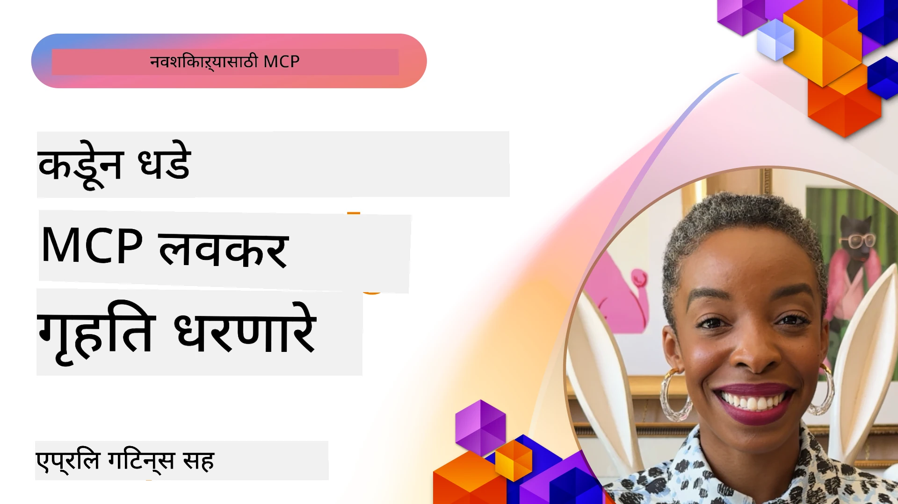

# 🌟 पूर्वगामी वापरकर्त्यांकडून धडे

[](https://youtu.be/jds7dSmNptE)

_(वरील प्रतिमा क्लिक करून या धड्याचा व्हिडिओ पहा)_

## 🎯 या मॉड्युलमध्ये काय समाविष्ट आहे

हा मॉड्युल प्रत्यक्ष संघटना आणि विकसक कसे Model Context Protocol (MCP) वापरून वास्तविक आव्हाने सोडवत आहेत आणि नवोन्मेषाला चालना देत आहेत याचा अभ्यास करतो. सविस्तर केस स्टडी, प्रॅक्टिकल प्रोजेक्ट्स आणि उपयोगी उदाहरणांद्वारे, तुम्हाला समजेल की MCP कसे सुरक्षित, स्केलेबल AI इंटिग्रेशन सक्षम करते जे भाषा मॉडेल, साधने आणि एंटरप्राइझ डेटा जोडते.

### 📚 MCP प्रत्यक्षात पाहा

तयार उत्पादन-सिद्ध साधनांवर या तत्त्वांचे अनुपालन कसे केले जाते ते पाहायचंय का? आमच्या [**10 Microsoft MCP सर्व्हर्स जे विकसकांच्या उत्पादकतेत बदल घडवून आणत आहेत**](microsoft-mcp-servers.md) पहा, ज्यात आज वापरासाठी उपलब्ध खरे Microsoft MCP सर्व्हर्स दाखवले आहेत.

## एक संक्षिप्त ओळख

हा धडा दर्शवितो की प्रारंभिक वापरकर्त्यांनी Model Context Protocol (MCP) कसा वापरून वास्तविक जगातील आव्हाने सोडवली आणि उद्योगांमध्ये नवोपक्रम कसा चालविला. सविस्तर केस स्टडीस व प्रयोगात्मक प्रकल्पांमधून, तुम्हाला दिसेल की MCP कसे प्रमाणित, सुरक्षित आणि स्केलेबल AI इंटिग्रेशन सक्षम करते—ज्यामुळे मोठे भाषा मॉडेल, साधने आणि एंटरप्राइझ डेटा एकत्रित फ्रेमवर्कमध्ये जोडले जातात. तुम्हाला MCP आधारित सोल्यूशन्स डिझाइन व तयार करण्याचा अनुभव मिळेल, सिद्ध अंमलबजावणी नमुने समजतील आणि उत्पादन वातावरणात MCP चा सर्वोत्तम वापर कसा करायचा हे शिकायला मिळेल. हा धडा नवीनतम प्रवाह, भविष्याच्या दिशांचा आढावा घेतो आणि मुक्त स्रोत साधनांसह तुम्हाला MCP तंत्रज्ञान व त्याच्या बदलत्या परिसरसह अपडेट राहण्यास मदत करतो.

## शिकण्याची उद्दिष्टे

- वेगवेगळ्या उद्योगांतील वास्तविक MCP अंमलबजावण्या विश्लेषित करा
- संपूर्ण MCP आधारित अनुप्रयोग डिझाइन आणि बनवा
- MCP तंत्रज्ञानातील नवीनतम प्रवाह आणि भविष्यातील दिशा शोधा
- वास्तविक विकास परिस्थितीत सर्वोत्तम पद्धती लागू करा

## वास्तविक MCP अंमलबजावण्या

### केस स्टडी १: एंटरप्राइझ ग्राहक समर्थन स्वयंचलितीकरण

एक बहुराष्ट्रीय कंपनीने त्यांच्या ग्राहक समर्थन प्रणालींमध्ये AI संवाद प्रमाणित करण्यासाठी MCP आधारित उपाय लागू केला. यामुळे त्यांनी:

- अनेक LLM पुरवठादारांसाठी एकसंध इंटरफेस तयार केला
- विभागांमधील सातत्यपूर्ण प्रॉम्प्ट व्यवस्थापन ठेवले
- मजबूत सुरक्षा व अनुपालन नियंत्रण स्थापित केले
- विशिष्ट गरजांनुसार वेगवेगळ्या AI मॉडेल्समध्ये सहज बदल केला

**तांत्रिक अंमलबजावणी:**

```python
# ग्राहक सहाय्यांसाठी Python MCP सर्व्हर अंमलबजावणी
import logging
import asyncio
from modelcontextprotocol import create_server, ServerConfig
from modelcontextprotocol.server import MCPServer
from modelcontextprotocol.transports import create_http_transport
from modelcontextprotocol.resources import ResourceDefinition
from modelcontextprotocol.prompts import PromptDefinition
from modelcontextprotocol.tool import ToolDefinition

# लॉगिंग कॉन्फिगर करा
logging.basicConfig(level=logging.INFO)

async def main():
    # सर्व्हर कॉन्फिगरेशन तयार करा
    config = ServerConfig(
        name="Enterprise Customer Support Server",
        version="1.0.0",
        description="MCP server for handling customer support inquiries"
    )
    
    # MCP सर्व्हर सुरू करा
    server = create_server(config)
    
    # ज्ञान आधार संसाधने नोंदणी करा
    server.resources.register(
        ResourceDefinition(
            name="customer_kb",
            description="Customer knowledge base documentation"
        ),
        lambda params: get_customer_documentation(params)
    )
    
    # प्रॉम्प्ट टेम्पलेट्स नोंदणी करा
    server.prompts.register(
        PromptDefinition(
            name="support_template",
            description="Templates for customer support responses"
        ),
        lambda params: get_support_templates(params)
    )
    
    # सहाय्य साधने नोंदणी करा
    server.tools.register(
        ToolDefinition(
            name="ticketing",
            description="Create and update support tickets"
        ),
        handle_ticketing_operations
    )
    
    # HTTP ट्रान्सपोर्टसह सर्व्हर सुरू करा
    transport = create_http_transport(port=8080)
    await server.run(transport)

if __name__ == "__main__":
    asyncio.run(main())
```
  
**परिणाम:** मॉडेल खर्चात 30% कपात, प्रतिसाद सातत्यात 45% सुधारणा, व जागतिक ऑपरेशन्समध्ये अनुपालन वाढ.

### केस स्टडी २: आरोग्य सेवा निदान सहाय्यक

एक आरोग्य सेवा प्रदाता विविध व विशिष्ट वैद्यकीय AI मॉडेल्स एकत्र करण्यासाठी MCP पायाभूत सुविधा तयार केली, तर संवेदनशील रुग्ण डेटा संरक्षित ठेवला:

- सामान्य व तज्ञ वैद्यकीय मॉडेल्समध्ये सहज स्विचिंग
- कडक गोपनीयता नियंत्रण व ऑडिट ट्रेल्स
- विद्यमान इलेक्ट्रॉनिक आरोग्य नोंदणी (EHR) प्रणालींसह एकत्रीकरण
- वैद्यकीय संज्ञांसाठी सातत्यपूर्ण प्रॉम्प्ट इंजिनिअरींग

**तांत्रिक अंमलबजावणी:**

```csharp
// C# MCP host application implementation in healthcare application
using Microsoft.Extensions.DependencyInjection;
using ModelContextProtocol.SDK.Client;
using ModelContextProtocol.SDK.Security;
using ModelContextProtocol.SDK.Resources;

public class DiagnosticAssistant
{
    private readonly MCPHostClient _mcpClient;
    private readonly PatientContext _patientContext;
    
    public DiagnosticAssistant(PatientContext patientContext)
    {
        _patientContext = patientContext;
        
        // Configure MCP client with healthcare-specific settings
        var clientOptions = new ClientOptions
        {
            Name = "Healthcare Diagnostic Assistant",
            Version = "1.0.0",
            Security = new SecurityOptions
            {
                Encryption = EncryptionLevel.Medical,
                AuditEnabled = true
            }
        };
        
        _mcpClient = new MCPHostClientBuilder()
            .WithOptions(clientOptions)
            .WithTransport(new HttpTransport("https://healthcare-mcp.example.org"))
            .WithAuthentication(new HIPAACompliantAuthProvider())
            .Build();
    }
    
    public async Task<DiagnosticSuggestion> GetDiagnosticAssistance(
        string symptoms, string patientHistory)
    {
        // Create request with appropriate resources and tool access
        var resourceRequest = new ResourceRequest
        {
            Name = "patient_records",
            Parameters = new Dictionary<string, object>
            {
                ["patientId"] = _patientContext.PatientId,
                ["requestingProvider"] = _patientContext.ProviderId
            }
        };
        
        // Request diagnostic assistance using appropriate prompt
        var response = await _mcpClient.SendPromptRequestAsync(
            promptName: "diagnostic_assistance",
            parameters: new Dictionary<string, object>
            {
                ["symptoms"] = symptoms,
                patientHistory = patientHistory,
                relevantGuidelines = _patientContext.GetRelevantGuidelines()
            });
            
        return DiagnosticSuggestion.FromMCPResponse(response);
    }
}
```
  
**परिणाम:** डॉक्टरांसाठी निदान सूचना सुधारल्या, HIPAA पालन पूर्ण राहिले, आणि प्रणालींदरम्यान संदर्भ स्विचिंगमध्ये लक्षणीय कपात.

### केस स्टडी ३: आर्थिक सेवा जोखीम विश्लेषण

एक आर्थिक संस्था वेगवेगळ्या विभागांसाठी जोखीम विश्लेषण प्रक्रियांची प्रमाणिकरण करण्यासाठी MCP वापरली:

- क्रेडिट रिस्क, फसवणूक शोध व गुंतवणूक जोखीम मॉडेलसाठी एकसंध इंटरफेस तयार केला
- कडक प्रवेश नियंत्रण व मॉडेल व्हर्जनिंग लागू केले
- सर्व AI शिफारसींनी ऑडिट करण्यायोग्य बनवले
- विविध प्रणालींवर डेटा स्वरूपात सातत्य राखले

**तांत्रिक अंमलबजावणी:**

```java
// आर्थिक जोखीम मूल्यांकनासाठी Java MCP सर्व्हर
import org.mcp.server.*;
import org.mcp.security.*;

public class FinancialRiskMCPServer {
    public static void main(String[] args) {
        // आर्थिक अनुपालन वैशिष्ट्यांसह MCP सर्व्हर तयार करा
        MCPServer server = new MCPServerBuilder()
            .withModelProviders(
                new ModelProvider("risk-assessment-primary", new AzureOpenAIProvider()),
                new ModelProvider("risk-assessment-audit", new LocalLlamaProvider())
            )
            .withPromptTemplateDirectory("./compliance/templates")
            .withAccessControls(new SOCCompliantAccessControl())
            .withDataEncryption(EncryptionStandard.FINANCIAL_GRADE)
            .withVersionControl(true)
            .withAuditLogging(new DatabaseAuditLogger())
            .build();
            
        server.addRequestValidator(new FinancialDataValidator());
        server.addResponseFilter(new PII_RedactionFilter());
        
        server.start(9000);
        
        System.out.println("Financial Risk MCP Server running on port 9000");
    }
}
```
  
**परिणाम:** नियमांचे पालन वाढले, मॉडेल तैनातीचा कालावधी 40% कमी झाला, विभागांतील जोखीम मूल्यांकनात सुधारणा.

### केस स्टडी ४: Microsoft Playwright MCP सर्व्हर ब्राउझर ऑटोमेशनसाठी

Microsoft ने Model Context Protocol द्वारे सुरक्षित व प्रमाणित ब्राउझर ऑटोमेशन सक्षम करण्यासाठी [Playwright MCP सर्व्हर](https://github.com/microsoft/playwright-mcp) विकसित केला. हा उत्पादन-तयार सर्व्हर AI एजंट्स आणि LLMs ना वेब ब्राउझरशी नियंत्रित, तपासणीयोग्य व विस्तार्य मार्गाने संवाद साधण्यास अनुमती देतो—स्वयंचलित वेब चाचणी, डेटा काढणी व संपूर्ण वर्कफ्लो यांसारख्या वापरासाठी सक्षम.

> **🎯 उत्पादनासाठी तयार साधन**
> 
> हा केस स्टडी वास्तविक MCP सर्व्हर दाखवतो जो तुम्ही आज वापरू शकता! Playwright MCP सर्व्हर आणि आणखी 9 उत्पादन-सिद्ध Microsoft MCP सर्व्हर्स बद्दल अधिक जाणून घ्या आमच्या [**Microsoft MCP Servers Guide**](microsoft-mcp-servers.md#8--playwright-mcp-server) मध्ये.

**मुख्य वैशिष्ट्ये:**  
- ब्राउझर ऑटोमेशन क्षमता (नेव्हिगेशन, फॉर्म भरणे, स्क्रीनशॉट घेणे इ.) MCP साधनांमध्ये उपलब्ध  
- परवानगीशिवाय क्रिया टाळण्यासाठी कडक प्रवेश नियंत्रण व सॅंडबॉक्सिंग अंमलात आणले  
- सर्व ब्राउझर संवादांसाठी सविस्तर ऑडिट लॉग उपलब्ध  
- Azure OpenAI आणि इतर LLM पुरवठादारांसह एजंट-चालित ऑटोमेशनसाठी एकत्रीकरण समर्थन  
- GitHub Copilot चे कोडिंग एजंट वेब ब्राउझिंग सक्षम

**तांत्रिक अंमलबजावणी:**

```typescript
// TypeScript: MCP सर्व्हरमध्ये Playwright ब्राउझर ऑटोमेशन साधने नोंदणीकृत करत आहे
import { createServer, ToolDefinition } from 'modelcontextprotocol';
import { launch } from 'playwright';

const server = createServer({
  name: 'Playwright MCP Server',
  version: '1.0.0',
  description: 'MCP server for browser automation using Playwright'
});

// URL कडे जाण्यासाठी आणि स्क्रीनशॉट कॅप्चर करण्यासाठी साधन नोंदवा
server.tools.register(
  new ToolDefinition({
    name: 'navigate_and_screenshot',
    description: 'Navigate to a URL and capture a screenshot',
    parameters: {
      url: { type: 'string', description: 'The URL to visit' }
    }
  }),
  async ({ url }) => {
    const browser = await launch();
    const page = await browser.newPage();
    await page.goto(url);
    const screenshot = await page.screenshot();
    await browser.close();
    return { screenshot };
  }
);

// MCP सर्व्हर सुरू करा
server.listen(8080);
```
  
**परिणाम:**

- AI एजंट्स आणि LLMs साठी सुरक्षित, प्रोग्रामॅटिक ब्राउझर ऑटोमेशन सक्षम केले  
- मॅन्युअल टेस्टिंग कमी केली व वेब अर्जांसाठी चाचणी कव्हरेज सुधारली  
- एंटरप्राइझ पर्यावरणात ब्राउझर-आधारित साधन एकत्रीकरणासाठी पुनर्वापरयोग्य व विस्तार्य फ्रेमवर्क पुरवला  
- GitHub Copilot च्या वेब ब्राउझिंग क्षमता शक्य केल्या

**संदर्भ:**  

- [Playwright MCP Server GitHub Repository](https://github.com/microsoft/playwright-mcp)  
- [Microsoft AI आणि ऑटोमेशन सोल्युशन्स](https://azure.microsoft.com/en-us/products/ai-services/)

### केस स्टडी ५: Azure MCP – एंटरप्राइझ-ग्रेड Model Context Protocol सेवा म्हणून

Azure MCP Server ([https://aka.ms/azmcp](https://aka.ms/azmcp)) हा Microsoft चा व्यवस्थापित, एंटरप्राइझ-ग्रेड Model Context Protocol अंमलबजावणी आहे, ज्यामध्ये MCP सर्व्हर क्षमतांचा स्केलेबल, सुरक्षित व अनुपालनीय क्लाउड सेवा स्वरूपात पुरवठा केला जातो. Azure MCP संस्थांना जलदपणे MCP सर्व्हर्सची स्थापन, व्यवस्थापन व Azure AI, डेटा व सुरक्षा सेवांशी एकत्रीकरण करण्यास अनुमती देतो, ज्यामुळे कार्यक्षमतेत बचत व AI स्वीकारण्याचा वेग वाढतो.

> **🎯 उत्पादनासाठी तयार साधन**
> 
> हा वास्तविक MCP सर्व्हर आहे जो तुम्ही आज वापरू शकता! Azure AI Foundry MCP Server बद्दल अधिक जाणून घ्या आमच्या [**Microsoft MCP Servers Guide**](microsoft-mcp-servers.md) मध्ये.

- पूर्णपणे व्यवस्थापित MCP सर्व्हर होस्टिंग ज्यात स्केलिंग, मॉनिटरिंग व सुरक्षा अंतर्भूत  
- Azure OpenAI, Azure AI Search व इतर Azure सेवा यांसह नैसर्गिक एकत्रीकरण  
- Microsoft Entra ID मार्फत एंटरप्राइझ प्रमाणीकरण व प्राधिकरण  
- सानुकूल साधने, प्रॉम्प्ट टेम्पलेट्स व संसाधन कनेक्टर्ससाठी समर्थन  
- एंटरप्राइझ सुरक्षा व नियमपालन आवश्यकतांशी अनुरूप

**तांत्रिक अंमलबजावणी:**

```yaml
# Example: Azure MCP server deployment configuration (YAML)
apiVersion: mcp.microsoft.com/v1
kind: McpServer
metadata:
  name: enterprise-mcp-server
spec:
  modelProviders:
    - name: azure-openai
      type: AzureOpenAI
      endpoint: https://<your-openai-resource>.openai.azure.com/
      apiKeySecret: <your-azure-keyvault-secret>
  tools:
    - name: document_search
      type: AzureAISearch
      endpoint: https://<your-search-resource>.search.windows.net/
      apiKeySecret: <your-azure-keyvault-secret>
  authentication:
    type: EntraID
    tenantId: <your-tenant-id>
  monitoring:
    enabled: true
    logAnalyticsWorkspace: <your-log-analytics-id>
```
  
**परिणाम:**  
- एंटरप्राइझ AI प्रकल्पांसाठी तयार व अनुपालनीय MCP सर्व्हर प्लॅटफॉर्म पुरवून वेळ वाचवली  
- LLMs, साधने व एंटरप्राइझ डेटास्रोतांचे सुलभ एकत्रीकरण साधले  
- MCP कार्यभारासाठी सुरक्षेची, निरीक्षणक्षमता व कार्यक्षमतेत सुधारणा केली  
- Azure SDK सर्वोत्तम पद्धती व सध्याच्या प्रमाणीकरण नमुन्यांसह कोड गुणवत्तेत वाढ  

**संदर्भ:**  
- [Azure MCP Documentation](https://aka.ms/azmcp)  
- [Azure MCP Server GitHub Repository](https://github.com/Azure/azure-mcp)  
- [Azure AI Services](https://azure.microsoft.com/en-us/products/ai-services/)  
- [Microsoft MCP Center](https://mcp.azure.com)

## केस स्टडी ६: NLWeb  
MCP (Model Context Protocol) हा Chatbots आणि AI सहाय्यकांना साधनांसोबत संवाद साधण्यासाठी उदयोन्मुख प्रोटोकॉल आहे. प्रत्येक NLWeb उदाहरण देखील एक MCP सर्व्हर आहे, जो मुख्य पद्धत, ask, समर्थित करतो, ज्याद्वारे वेबसाइटला नैसर्गिक भाषेत प्रश्न विचारता येतो. परतावा दिलेला प्रतिसाद schema.org हा व्यापकपणे वापरला जाणारा वेब डेटा वर्णन करणारा शब्दसंग्रह वापरतो. साध्या भाषेत, MCP ही NLWeb प्रमाणे आहे जशी Http आहे HTML साठी. NLWeb प्रोटोकॉल, Schema.org फॉरमॅट्स आणि नमुना कोड यांचा एकत्रित वापर करून वेबसाइट्सना जलदपणे या एंडपॉइंट्स तयार करण्यास मदत करतो, जे मानवी संवाद इंटरफेस आणि मशीनमधील नैसर्गिक एजंट-टू-एजंट संवादासाठी फायदेशीर आहे.

NLWeb दोन भिन्न घटकांपासून बनलेले आहे.  
- एक प्रोटोकॉल, अगदी सोपा सुरु करण्यासाठी, नैसर्गिक भाषेतील साइटशी संवाद साधण्यासाठी आणि एक स्वरूप, जे json आणि schema.org वापरून परतावा दिलेल्या उत्तरासाठी आहे. अधिक तपशीलांसाठी REST API ची माहिती पहा.  
- (1) ची सोपी अंमलबजावणी जी विद्यमान मार्कअपचा वापर करते, अशा साइटसाठी जी उत्पादने, पाककृती, आकर्षणे, पुनरावलोकने इत्यादी यांची यादी आहेत अशा स्वरूपात असू शकते. उपयोक्ता इंटरफेस विजेट्सच्या सेटसह, साइट्स त्यांच्या सामग्रीसाठी सहज संवादात्मक इंटरफेस पुरवू शकतात. Life of a chat query दस्तऐवजात याचे अधिक स्पष्टीकरण आहे.

**संदर्भ:**  
- [Azure MCP Documentation](https://aka.ms/azmcp)  
- [NLWeb](https://github.com/microsoft/NlWeb)

### केस स्टडी ७: Azure AI Foundry MCP Server – एंटरप्राइझ AI एजंट समाकलन

Azure AI Foundry MCP सर्व्हर्स दाखवतात की MCP कसा वापरून एंटरप्राइझ वातावरणात AI एजंट्स व वर्कफ्लोचे संयोजन व व्यवस्थापन करता येते. MCP आणि Azure AI Foundry च्या एकत्रीकरणाद्वारे, संस्था एजंट संवाद प्रमाणिकृत करू शकतात, Foundry च्या वर्कफ्लो व्यवस्थापनाचा वापर करू शकतात आणि सुरक्षित, स्केलेबल तैनाती सुनिश्चित करू शकतात.

> **🎯 उत्पादनासाठी तयार साधन**  
>  
> हा वास्तविक MCP सर्व्हर आहे जो तुम्ही आज वापरू शकता! Azure AI Foundry MCP Server बद्दल अधिक जाणून घ्या आमच्या [**Microsoft MCP Servers Guide**](microsoft-mcp-servers.md#9--azure-ai-foundry-mcp-server) मध्ये.

**मुख्य वैशिष्ट्ये:**  
- Azure च्या AI परिसरेत संपूर्ण प्रवेश, ज्यात मॉडेल कॅटलॉग व तैनाती व्यवस्थापन समाविष्ट  
- RAG अनुप्रयोगांसाठी Azure AI Search द्वारे ज्ञान सूचीबद्धीकरण  
- AI मॉडेल कार्यक्षमता व गुणवत्ता खात्रीसाठी मूल्यमापन साधने  
- Azure AI Foundry Catalog आणि Labs सोबत नवीन संशोधन मॉडेल्ससाठी एकत्रीकरण  
- उत्पादन परिस्थितीसाठी एजंट व्यवस्थापन आणि मूल्यांकन क्षमता

**परिणाम:**  
- जलद प्रोटोटायपिंग व AI एजंट वर्कफ्लोचे मजबूत मॉनिटरिंग  
- Azure AI सेवांसह परिपूर्ण एकत्रीकरण अगदी जटिल परिस्थितीसाठी  
- एजंट पाइपलाईन्स तयार करणे, तैनात करणे व निरीक्षण करण्यासाठी एकसंध इंटरफेस  
- एंटरप्राइझसाठी सुरक्षा, अनुपालन व कार्यक्षमतेत सुधारणा  
- जटिल एजंट-चालित प्रक्रियांवर नियंत्रण ठेवत AI स्वीकारण्यात वेग

**संदर्भ:**  
- [Azure AI Foundry MCP Server GitHub Repository](https://github.com/azure-ai-foundry/mcp-foundry)  
- [Azure AI एजंटसाठी MCP एकत्रीकरण (Microsoft Foundry ब्लॉग)](https://devblogs.microsoft.com/foundry/integrating-azure-ai-agents-mcp/)

### केस स्टडी ८: Foundry MCP Playground – प्रयोग आणि प्रोटोटायपिंग

Foundry MCP Playground MCP सर्व्हर्स आणि Azure AI Foundry एकत्रीकरणांसोबत प्रयोग करण्यासाठी तयार वापरासाठीचे वातावरण प्रदान करतो. विकसक Azure AI Foundry Catalog आणि Labs मधील साधनांचा वापर करून AI मॉडेल्स व एजंट वर्कफ्लो जलद प्रोटोटाइप, चाचणी व मूल्यमापन करू शकतात. हे प्लेग्राउंड सेटअप सुलभ करते, नमुना प्रकल्प पुरवते व सहकारी विकासाला समर्थन देते, ज्यामुळे न्यूनतम अडचणीसह सर्वोत्तम पद्धती व नवीन संकल्पनांचा शोध घेणे सोपे होते. जटिल पायाभूत सुविधा न वापरता कल्पना पडताळणी, प्रयोग सामायिकरण आणि शिकण्याचा वेग वाढविण्यासाठी संघांसाठी उपयुक्त आहे. प्रवेश बाधा कमी करून, हे MCP व Azure AI Foundry परिसरसाठी नवोपक्रम व समुदाय योगदानांना प्रोत्साहन देते.

**संदर्भ:**  

- [Foundry MCP Playground GitHub Repository](https://github.com/azure-ai-foundry/foundry-mcp-playground)

### केस स्टडी ९: Microsoft Learn Docs MCP Server – AI-चालित दस्तऐवजीकरण प्रवेश

Microsoft Learn Docs MCP Server हे क्लाउड-होस्टेड सेवा आहे ज्याद्वारे AI सहाय्यकांना Model Context Protocol द्वारे अधिकृत Microsoft दस्तऐवजीकरणाची वास्तविक वेळेत प्रवेश मिळतो. हा उत्पादन-तयार सर्व्हर Microsoft Learn परिसरसह जोडलेला आहे आणि सर्व अधिकृत Microsoft स्रोतांवर सेमॅंटिक शोध सक्षम करतो.

> **🎯 उत्पादनासाठी तयार साधन**  
>  
> हा वास्तविक MCP सर्व्हर आहे जो तुम्ही आज वापरू शकता! Microsoft Learn Docs MCP Server बद्दल अधिक जाणून घ्या आमच्या [**Microsoft MCP Servers Guide**](microsoft-mcp-servers.md#1--microsoft-learn-docs-mcp-server) मध्ये.

**मुख्य वैशिष्ट्ये:**  
- अधिकृत Microsoft, Azure व Microsoft 365 दस्तऐवजीकरणासाठी रिअल-टाइम प्रवेश  
- संदर्भ व हेतू समजणारी प्रगत सेमॅंटिक शोध क्षमता  
- Microsoft Learn सामग्री प्रकाशित होताच नेहमी अद्ययावत माहिती  
- Microsoft Learn, Azure आणि Microsoft 365 स्रोतांवर व्यापक कव्हरेज  
- लेखांच्या शीर्षकांसह व URL सह उच्च प्रतीच्या 10 सामग्री संचांची परतफेड

**महत्त्व का:**  
- Microsoft तंत्रज्ञानांसाठी "अद्ययावत AI ज्ञान" समस्या सोडवते  
- AI सहाय्यकांना नवीनतम .NET, C#, Azure व Microsoft 365 वैशिष्ट्यांचा प्रवेश सुनिश्चित करते  
- अचूक कोड जनरेशनसाठी प्राधिकारी व फर्स्ट-पार्टी माहिती पुरवते  
- जलद बदलणाऱ्या Microsoft तंत्रज्ञानासह काम करणाऱ्या विकसकांसाठी अपरिहार्य

**परिणाम:**  
- Microsoft तंत्रज्ञानासाठी AI-उत्पन्न कोडची अचूकता नाटकीयरीत्या सुधारली  
- वर्तमान दस्तऐवजीकरण व सर्वोत्तम पद्धती शोधण्यात वेळ वाचला  
- संदर्भ-समजण्यायोग्य दस्तऐवजीकरण पुनर्प्राप्तीसह विकसक उत्पादकता वाढली  
- IDE सोडल्याशिवाय विकास वर्कफ्लोसोबत तंतोतंत समाकलन

**संदर्भ:**  
- [Microsoft Learn Docs MCP Server GitHub Repository](https://github.com/MicrosoftDocs/mcp)  
- [Microsoft Learn Documentation](https://learn.microsoft.com/)

## प्रयोगात्मक प्रकल्प

### प्रकल्प १: मल्टी-प्रोव्हायडर MCP सर्व्हर तयार करा

**उद्दिष्ट:** असा MCP सर्व्हर तयार करणे जो विशिष्ट निकषांनुसार अनेक AI मॉडेल पुरवठादारांकडे विनंत्या रूट करू शकेल.

**अटी:**  

- कमीतकमी तीन वेगवेगळ्या मॉडेल पुरवठादारांना समर्थन द्या (उदा. OpenAI, Anthropic, स्थानिक मॉडेल)  
- विनंती मेटाडेटावर आधारित रूटिंग यंत्रणा लागू करा  
- पुरवठादारांच्या क्रेडेन्शियल्ससाठी कॉन्फिगरेशन सिस्टम तयार करा  
- कार्यक्षमता व खर्चासाठी कॅशिंग जोडा  
- वापर निरीक्षणासाठी सोपा डॅशबोर्ड तयार करा

**अंमलबजावणी पावले:**  

1. मूलभूत MCP सर्व्हर पायाभूत सुविधा तयार करा  
2. प्रत्येक AI मॉडेल सेवा साठी पुरवठादार अ‍ॅडॉप्टर्स अंमलात आणा  
3. विनंतीची वैशिष्ट्ये वापरून रूटिंग लॉजिक तयार करा  
4. वारंवार विनंत्यांसाठी कॅशिंग यंत्रणा जोडा  
5. निरीक्षण डॅशबोर्ड विकसित करा  
6. विविध विनंती नमुन्यांवर चाचणी करा

**तंत्रज्ञान:** तुमच्या पसंतीनुसार Python (.NET/Java/Python), कॅशिंगसाठी Redis, आणि डॅशबोर्डसाठी साधी वेब फ्रेमवर्क वापरा.

### प्रकल्प २: एंटरप्राइझ प्रॉम्प्ट व्यवस्थापन प्रणाली  

**उद्दिष्ट:** संघटनेभर प्रॉम्प्ट टेम्प्लेट्सचे व्यवस्थापन, आवृत्तीकरण आणि वितरण करण्यासाठी MCP-आधारित प्रणाली विकसित करा.

**अटी:**

- प्रॉम्प्ट टेम्प्लेट्ससाठी केंद्रीकृत संग्रह तयार करा
- आवृत्तीकरण आणि मंजुरी कार्यप्रवाह लागू करा
- नमुना इनपुटसह टेम्प्लेट चाचणी क्षमता तयार करा
- भूमिका-आधारित प्रवेश नियंत्रण विकसित करा
- टेम्प्लेट पुनर्प्राप्ती आणि वितरणासाठी API तयार करा

**अंमलबजावणी टप्पे:**

1. टेम्प्लेट संचयासाठी डेटाबेस स्कीमा डिझाइन करा
2. टेम्प्लेट CRUD ऑपरेशन्ससाठी कोर API तयार करा
3. आवृत्तीकरण प्रणाली लागू करा
4. मंजुरी कार्यप्रवाह तयार करा
5. चाचणी फ्रेमवर्क विकसित करा
6. व्यवस्थापनासाठी साधे वेब इंटरफेस तयार करा
7. MCP सर्व्हरशी एकत्रीकरण करा

**तंत्रज्ञान:** तुमच्या पसंतीनुसार बॅकएंड फ्रेमवर्क, SQL किंवा NoSQL डेटाबेस, आणि व्यवस्थापन इंटरफेससाठी फ्रंटेंड फ्रेमवर्क.

### प्रकल्प 3: MCP-आधारित सामग्री निर्माण प्लॅटफॉर्म

**उद्दिष्ट:** MCP वापरून वेगवेगळ्या सामग्री प्रकारांमध्ये सुसंगत निकाल देणारा सामग्री निर्माण प्लॅटफॉर्म तयार करा.

**अटी:**

- अनेक सामग्री स्वरूपांसाठी समर्थन (ब्लॉग पोस्ट, सोशल मीडिया, मार्केटिंग कॉपी)
- सानुकूलन पर्यायांसह टेम्प्लेट-आधारित निर्मिती लागू करा
- सामग्री पुनरावलोकन आणि अभिप्राय प्रणाली तयार करा
- सामग्री कार्यप्रदर्शन मेट्रिक्स ट्रॅक करा
- सामग्री आवृत्तीकरण आणि पुनरावृत्तीला समर्थन द्या

**अंमलबजावणी टप्पे:**

1. MCP क्लायंट इन्फ्रास्ट्रक्चर सेट अप करा
2. वेगवेगळ्या सामग्री प्रकारांसाठी टेम्प्लेट तयार करा
3. सामग्री निर्माण पाइपलाइन तयार करा
4. पुनरावलोकन प्रणाली लागू करा
5. मेट्रिक्स ट्रॅकिंग प्रणाली विकसित करा
6. टेम्प्लेट व्यवस्थापन आणि सामग्री निर्मितीसाठी वापरकर्ता इंटरफेस तयार करा

**तंत्रज्ञान:** तुमची आवडती प्रोग्रामिंग भाषा, वेब फ्रेमवर्क, आणि डेटाबेस सिस्टम.

## MCP तंत्रज्ञानासाठी भविष्यातील दिशा

### उदयोन्मुख ट्रेंड्स

1. **मल्टी-मॉडाल MCP**
   - प्रतिमा, ऑडिओ आणि व्हिडिओ मॉडेल्ससह संवाद मानकीकरणासाठी MCP विस्तार
   - क्रॉस-मॉडाल तर्कशक्ती क्षमता विकसित करणे
   - वेगवेगळ्या मोडालिटीजसाठी मानकीकृत प्रॉम्प्ट स्वरूपे

2. **फेडरेटेड MCP इन्फ्रास्ट्रक्चर**
   - संसाधने संघटनांमध्ये सामायिक करण्यासाठी वितरीत MCP नेटवर्क्स
   - सुरक्षित मॉडेल साझा करण्यासाठी मानकीकृत प्रोटोकॉल्स
   - गोपनीयता-संरक्षण गणना तंत्र

3. **MCP मार्केटप्लेस**
   - MCP टेम्प्लेट्स आणि प्लगइन्स सामायिकरण आणि आर्थिक उपयोजनासाठी इकोसिस्टम्स
   - गुणवत्ता हमी आणि प्रमाणन प्रक्रिया
   - मॉडेल मार्केटप्लेससह एकात्मिकरण

4. **एज कॉम्प्युटिंगसाठी MCP**
   - संसाधने मर्यादित एज डिव्हाईससाठी MCP मानकांचे रूपांतर
   - कमी बँडविड्थ पर्यावरणांसाठी अनुकूल प्रोटोकॉल्स
   - IoT इकोसिस्टमसाठी विशेष MCP अंमलबजावण्या

5. **नियामक चौकट**
   - नियामक अनुपालनासाठी MCP विस्तार विकसित करणे
   - मानकीकृत ऑडिट ट्रेल्स आणि स्पष्टीकरण इंटरफेस
   - उदयोन्मुख AI शासन चौकटांशी एकात्मिकरण

### मायक्रोसॉफ्टकडून MCP सोल्यूशन्स

मायक्रोसॉफ्ट आणि Azure ने विविध परिदृश्यांत MCP अंमलात आणण्यासाठी अनेक मुक्त स्रोत संग्रह विकसित केले आहेत:

#### Microsoft संस्था

1. [playwright-mcp](https://github.com/microsoft/playwright-mcp) - ब्राउझर ऑटोमेशन आणि चाचणीसाठी Playwright MCP सर्व्हर  
2. [files-mcp-server](https://github.com/microsoft/files-mcp-server) - स्थानिक चाचणी आणि समुदाय योगदानासाठी OneDrive MCP सर्व्हर अंमलबजावणी  
3. [NLWeb](https://github.com/microsoft/NlWeb) - AI वेबसाठी ओपन प्रोटोकॉल्स आणि साधनांचा संग्रह

#### Azure-Samples संस्था

1. [mcp](https://github.com/Azure-Samples/mcp) - Azure वर MCP सर्व्हर्स बांधण्यासाठी आणि एकत्रित करण्यासाठी नमुने, साधने आणि संसाधने  
2. [mcp-auth-servers](https://github.com/Azure-Samples/mcp-auth-servers) - सध्याच्या Model Context Protocol तपशीलासह प्रमाणीकरणाचे MCP सर्व्हर  
3. [remote-mcp-functions](https://github.com/Azure-Samples/remote-mcp-functions) - Azure Functions मधील Remote MCP सर्व्हर अंमलबजावण्या  
4. [remote-mcp-functions-python](https://github.com/Azure-Samples/remote-mcp-functions-python) - Azure Functions सह Python वापरून कस्टम Remote MCP सर्व्हर तयार करण्यासाठी क्विकस्टार्ट टेम्प्लेट  
5. [remote-mcp-functions-dotnet](https://github.com/Azure-Samples/remote-mcp-functions-dotnet) - .NET/C# सह Azure Functions वापरून कस्टम Remote MCP सर्व्हर बांधणीसाठी टेम्प्लेट  
6. [remote-mcp-functions-typescript](https://github.com/Azure-Samples/remote-mcp-functions-typescript) - TypeScript सह Azure Functions वापरून Remote MCP सर्व्हर अंमलबजावणीसाठी टेम्प्लेट  
7. [remote-mcp-apim-functions-python](https://github.com/Azure-Samples/remote-mcp-apim-functions-python) - Python वापरून Azure API Management द्वारे Remote MCP सर्व्हरशी कनेक्ट होणे  
8. [AI-Gateway](https://github.com/Azure-Samples/AI-Gateway) - MCP क्षमता असलेल्या APIM ❤️ AI प्रयोग, Azure OpenAI आणि AI Foundry सोबत एकत्रितकरण

हे संग्रह विविध प्रोग्रामिंग भाषा आणि Azure सेवा वापरून Model Context Protocol शी संबंधीत साधने, टेम्प्लेट्स, आणि संसाधनांची अंमलबजावण्या पुरवतात. हे मूलभूत सर्व्हर, प्रमाणीकरण, क्लाउड वितरण, आणि एंटरप्राइज एकत्रीकरणासह मोठ्या वापरकथा व्यापतात.

#### MCP संसाधने निर्देशिका

सर्वोच्च Microsoft MCP संग्रहातील [MCP Resources directory](https://github.com/microsoft/mcp/tree/main/Resources) मध्ये Model Context Protocol सर्व्हर्ससाठी नमुना संसाधने, प्रॉम्प्ट टेम्प्लेट्स आणि साधन व्याख्या एकत्रित केल्या आहेत. ही निर्देशिका विकसकांना MCP शी जलद प्रारंभ करण्यासाठी पुनर्वापर करता येणारे घटक आणि सर्वोत्तम पद्धतींचे उदाहरणे प्रदान करते:

- **प्रॉम्प्ट टेम्प्लेट्स:** सामान्य AI कामांसाठी आणि परिदृश्यांसाठी तयार वापरता येणारी प्रॉम्प्ट टेम्प्लेट्स, जे तुम्हाला तुमच्या MCP सर्व्हर अंमलबजावणीसाठी सानुकूल करता येतात.
- **साधन व्याख्या:** वेगवेगळ्या MCP सर्व्हर्समध्ये साधन समाकलिती आणि कॉलिंगसाठी मानकीकृत साधन स्कीमा आणि मेटाडेटा.
- **संसाधन नमुने:** MCP फ्रेमवर्कमध्ये डेटास्रोतानांशी, API, आणि बाह्य सेवांशी कनेक्ट करण्यासाठी उदाहरण संसाधन व्याख्या.
- **संदर्भ अंमलबजावण्या:** वास्तविक MCP प्रकल्पांमध्ये संसाधने, प्रॉम्प्ट, आणि साधने कशी रचना आणि आयोजन करायची याचे व्यवहार्य नमुने.

हे संसाधने विकासाचा वेग वाढवतात, मानकीकरणाला प्रोत्साहन देतात, आणि MCP-आधारित उपाय तयार करताना सर्वोत्तम पद्धतींचे पालन सुनिश्चित करतात.

#### MCP संसाधने निर्देशिका

- [MCP Resources (Sample Prompts, Tools, and Resource Definitions)](https://github.com/microsoft/mcp/tree/main/Resources)

### संशोधन संधी

- MCP फ्रेमवर्कमध्ये कार्यक्षम प्रॉम्प्ट ऑप्टिमायझेशन तंत्र
- मल्टी-टेनंट MCP वितरणांसाठी सुरक्षा मॉडेल्स
- वेगवेगळ्या MCP अंमलबजावणीत कामगिरीचे बेंचमार्किंग
- MCP सर्व्हर्ससाठी औपचारिक सत्यापन पद्धती

## निष्कर्ष

Model Context Protocol (MCP) हे सुसंगत, सुरक्षित, आणि इंटरऑपरेबल AI एकत्रीकरणासाठी वेगाने भविष्य घडवत आहे. या धड्यांमधील केस स्टडीज आणि प्रकल्पांमधून तुम्हाला दिसले की सुरुवातीच्या वापरकर्त्यांनी — ज्यामध्ये Microsoft आणि Azure यांचा समावेश आहे — वास्तविक आव्हाने सोडवण्यासाठी, AI स्वीकार वाढवण्यासाठी, आणि अनुपालन, सुरक्षा, व प्रमाणनीयता सुनिश्चित करण्यासाठी MCP कसा वापरला आहे. MCP चे माड्यूलर दृष्टिकोन संघटनांना मोठ्या भाषिक मॉडेल्स, साधने, आणि एंटरप्राइज डेटा एकत्रित, ऑडिटेबल फ्रेमवर्कमध्ये कनेक्ट करण्यास सक्षम करतो. MCP च्या विकासानुसार, समुदायात सक्रिय राहणे, मुक्त स्रोत संसाधने तपासणे, आणि सर्वोत्तम पद्धती लागू करणे, मजबूत आणि भविष्यास अनुकूल AI उपाय तयार करण्यासाठी महत्त्वाचे ठरेल.

## अतिरिक्त संसाधने

- [MCP Foundry GitHub Repository](https://github.com/azure-ai-foundry/mcp-foundry)  
- [Foundry MCP Playground](https://github.com/azure-ai-foundry/foundry-mcp-playground)  
- [Azure AI एजंट्स शी MCP चे एकत्रीकरण (Microsoft Foundry Blog)](https://devblogs.microsoft.com/foundry/integrating-azure-ai-agents-mcp/)  
- [MCP GitHub Repository (Microsoft)](https://github.com/microsoft/mcp)  
- [MCP Resources Directory (Sample Prompts, Tools, and Resource Definitions)](https://github.com/microsoft/mcp/tree/main/Resources)  
- [MCP Community & Documentation](https://modelcontextprotocol.io/introduction)  
- [MCP Specification (2025-11-25)](https://spec.modelcontextprotocol.io/specification/2025-11-25/)  
- [Azure MCP Documentation](https://aka.ms/azmcp)  
- [OWASP MCP Top 10](https://microsoft.github.io/mcp-azure-security-guide/mcp/) - सुरक्षा सर्वोत्तम पद्धती  
- [Playwright MCP Server GitHub Repository](https://github.com/microsoft/playwright-mcp)  
- [Files MCP Server (OneDrive)](https://github.com/microsoft/files-mcp-server)  
- [Azure-Samples MCP](https://github.com/Azure-Samples/mcp)  
- [MCP Auth Servers (Azure-Samples)](https://github.com/Azure-Samples/mcp-auth-servers)  
- [Remote MCP Functions (Azure-Samples)](https://github.com/Azure-Samples/remote-mcp-functions)  
- [Remote MCP Functions Python (Azure-Samples)](https://github.com/Azure-Samples/remote-mcp-functions-python)  
- [Remote MCP Functions .NET (Azure-Samples)](https://github.com/Azure-Samples/remote-mcp-functions-dotnet)  
- [Remote MCP Functions TypeScript (Azure-Samples)](https://github.com/Azure-Samples/remote-mcp-functions-typescript)  
- [Remote MCP APIM Functions Python (Azure-Samples)](https://github.com/Azure-Samples/remote-mcp-apim-functions-python)  
- [AI-Gateway (Azure-Samples)](https://github.com/Azure-Samples/AI-Gateway)  
- [Microsoft AI and Automation Solutions](https://azure.microsoft.com/en-us/products/ai-services/)

## सराव

1. एखादी केस स्टडी विश्लेषण करा आणि पर्यायी अंमलबजावणी पद्धत सुचवा.  
2. प्रकल्प कल्पनांपैकी एक निवडा आणि तपशीलवार तांत्रिक तपशील तयार करा.  
3. केस स्टडी मध्ये न समाविष्ट उद्योगाचे संशोधन करा आणि त्याच्या विशिष्ट आव्हानांवर MCP कसा उपाय करू शकतो हे मांड करा.  
4. भविष्यातील दिशांपैकी एक तपासा आणि त्याला समर्थन देणारा नवीन MCP विस्तार तयार करण्याचा संकल्प तयार करा.

## पुढे काय

अधिक शोधा: [Microsoft MCP Servers](./microsoft-mcp-servers.md)

सुरू ठेवा: [मॉड्यूल 8: सर्वोत्तम पद्धती](../08-BestPractices/README.md)

---

<!-- CO-OP TRANSLATOR DISCLAIMER START -->
**अस्वीकरण**:
हा दस्तऐवज AI भाषांतर सेवा [Co-op Translator](https://github.com/Azure/co-op-translator) चा वापर करून अनुवादित केला आहे. आम्ही अचूकतेसाठी प्रयत्न करतो, तरी कृपया लक्षात ठेवा की स्वयंचलित भाषांतरात चुका किंवा अचूकतेची कमतरता असू शकते. मूळ दस्तऐवज त्याच्या स्थानिक भाषेत अधिकृत स्रोत मानला जावा. महत्त्वाची माहिती असल्यास व्यावसायिक मानवी भाषांतरण करण्याची शिफारस केली जाते. या भाषांतराचा वापर केल्यामुळे उद्भवलेल्या कोणत्याही गैरसमजुती किंवा चुकीच्या अर्थप्राप्तीबाबत आम्ही जबाबदार नाही.
<!-- CO-OP TRANSLATOR DISCLAIMER END -->