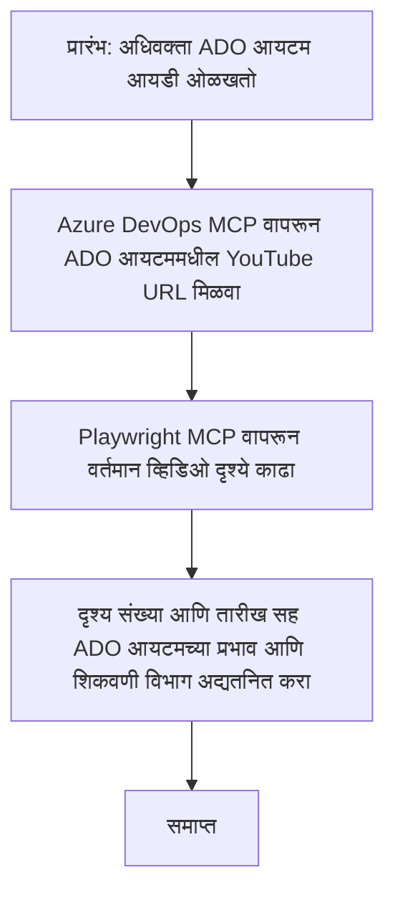

# केस स्टडी: MCP सह YouTube डेटावरून Azure DevOps आयटम अद्ययावत करणे

> **सावधगिरी:** YouTube सारख्या प्लॅटफॉर्मवरील डेटासह Azure DevOps आयटम अद्ययावत करण्याच्या प्रक्रियेस स्वयंचलित करण्यासाठी ऑनलाइन उपकरणे आणि अहवाल आधीपासूनच उपलब्ध आहेत. खालील परिदृश्य फक्त एक नमुना वापर प्रकरण म्हणून दिले आहे जे MCP उपकरणांना स्वयंचलीकरण आणि एकत्रीकरण कार्यांसाठी कसे लागू करता येते हे दर्शवते.

## अवलोकन

ही केस स्टडी दर्शविते की मॉडेल कॉन्टेक्स्ट प्रोटोकॉल (MCP) आणि त्याची उपकरणे कशी ऑनलाइन प्लॅटफॉर्म्समधून मिळालेली माहिती वापरून Azure DevOps (ADO) वर्क आयटम अद्ययावत करण्याच्या प्रक्रियेस स्वयंचलित करू शकतात. दिलेले परिदृश्य या उपकरणांच्या व्यापक क्षमतांपैकी एक उदाहरण आहे, जे अनेक समान स्वयंचलीकरण गरजांसाठी जुळवून घेता येऊ शकतात.

या उदाहरणात, एक अॅडव्होकेट ADO आयटमद्वारे ऑनलाइन सत्रांवर लक्ष ठेवतो, जिथे प्रत्येक आयटममध्ये YouTube व्हिडिओ URL असते. MCP उपकरणांचा उपयोग करून, अॅडव्होकेट ADO आयटम्सलाई नवीनतम व्हिडिओ मेट्रिक्ससह जसे की दृश्य संख्या, पुनरावृत्तीयोग्य आणि स्वयंचलित पद्धतीने कायम ठेवू शकतो. ही पद्धत अशा इतर वापराच्या प्रकरणांवरही लागू होऊ शकते जिथे ऑनलाइन स्रोतांची माहिती ADO किंवा इतर प्रणालींमध्ये समाकलित करणे आवश्यक असते.

## परिदृश्य

एक अॅडव्होकेट ऑनलाइन सत्रे आणि समुदायातील सहभागाचे प्रभाव ट्रॅक करण्यासाठी जबाबदार आहे. प्रत्येक सत्र 'DevRel' प्रोजेक्टमधील ADO वर्क आयटम म्हणून लॉग केले जाते, आणि वर्क आयटममध्ये YouTube व्हिडिओ URL साठी एक फील्ड असतो. सत्राच्या पोहोचवण्याच्या अचूक अहवालासाठी, अॅडव्होकेटला व्हिडिओ दृश्यांची सध्याची संख्या आणि ही माहिती घेतलेली तारीख ADO आयटममध्ये अद्ययावत करणे आवश्यक आहे.

## वापरलेली उपकरणे

- [Azure DevOps MCP](https://github.com/microsoft/azure-devops-mcp): MCP द्वारे ADO वर्क आयटम्सना प्रोग्रामॅटिक प्रवेश आणि अद्यतने सक्षम करते.
- [Playwright MCP](https://github.com/microsoft/playwright-mcp): YouTube व्हिडिओ आकडेवारीसारखी वेब पृष्ठांवरून लाईव्ह डेटा काढण्यासाठी ब्राउझर क्रिया स्वयंचलित करते.

## चरण-दर-चरण कार्यप्रवाह

1. **ADO आयटम ओळखा**: 'DevRel' प्रोजेक्टमधील ADO वर्क आयटम ID (उदा., 1234) पासून सुरू करा.
2. **YouTube URL प्राप्त करा**: Azure DevOps MCP उपकरणाचा वापर करून वर्क आयटममधून YouTube URL मिळवा.
3. **व्हिडिओ दृश्ये काढा**: Playwright MCP उपकरणाचा वापर करून YouTube URL वर जा आणि सध्याचे दृश्य मोजणी काढा.
4. **ADO आयटम अद्ययावत करा**: Azure DevOps MCP टूलचा वापर करून 'Impact and Learnings' विभागात नवीनतम दृश्य मोजणी आणि डेटाची नोंद करा.

## उदाहरण प्रॉम्प्ट

```bash
- Work with the ADO Item ID: 1234
- The project is '2025-Awesome'
- Get the YouTube URL for the ADO item
- Use Playwright to get the current views from the YouTube video
- Update the ADO item with the current video views and the updated date of the information
```

## Mermaid Flowchart


## तांत्रिक अंमलबजावणी

- **MCP ऑर्केस्ट्रेशन**: हा कार्यप्रवाह MCP सर्व्हरने यशस्वीपणे संघटित केला आहे, जो Azure DevOps MCP आणि Playwright MCP उपकरणांच्या वापराचे समन्वय करतो.
- **स्वयंचलीकरण**: प्रक्रिया मॅन्युअली चालवू शकतो किंवा नियमित अंतराने चालण्यासाठी निर्धारित करू शकतो जेणेकरून ADO आयटम्स अपडेट राहतील.
- **विस्तारक्षमते**: हाच नमुना ADO आयटम्सना इतर ऑनलाइन मेट्रिक्स (उदा., लाईक्स, टिप्पण्या) किंवा इतर प्लॅटफॉर्मवरून देखील अपडेट करण्यास वाढवला जाऊ शकतो.

## परिणाम आणि प्रभाव

- **कार्यक्षमता**: व्हिडिओ मेट्रिक्सची retrieval आणि अपडेट स्वयंचलित करून अॅडव्होकेटचा मॅन्युअल प्रयत्न कमी करतो.
- **अचूकता**: ADO आयटम्समध्ये ऑनलाइन स्रोतांतील ताजी माहिती असलेली खात्री करतो.
- **पुनरावृत्तीयोग्यता**: इतर डेटा स्रोत किंवा मेट्रिक्ससह समान परिस्थितीसाठी पुनर्वापरता येणारा कार्यप्रवाह उपलब्ध करतो.

## संदर्भ

- [Azure DevOps MCP](https://github.com/microsoft/azure-devops-mcp)
- [Playwright MCP](https://github.com/microsoft/playwright-mcp)
- [Model Context Protocol (MCP)](https://modelcontextprotocol.io/)

## पुढे काय

- परत: [Case Studies Overview](./README.md)
- पुढे: [Real-Time Documentation Retrieval with MCP](./docs-mcp/README.md)

---

<!-- CO-OP TRANSLATOR DISCLAIMER START -->
**अस्वीकरण**:  
हे दस्तऐवज AI अनुवाद सेवा [Co-op Translator](https://github.com/Azure/co-op-translator) वापरून अनुवादित केले आहे. आम्ही अचूकतेसाठी प्रयत्नशील आहोत, तरी कृपया लक्षात ठेवा की स्वयंचलित अनुवादांमध्ये चुका किंवा अचूकतेत चुक होऊ शकतात. मूळ दस्तऐवज त्याच्या स्थानिक भाषेत अधिकृत स्रोत म्हणून विचारात घ्यावा. महत्त्वपूर्ण माहितीसाठी व्यावसायिक मानवी अनुवाद करण्याची शिफारस केली जाते. या अनुवादाच्या वापरामुळे उद्भवणाऱ्या कोणत्याही गैरसमज किंवा चुकीच्या अर्थलागी आम्ही जबाबदार नाही.
<!-- CO-OP TRANSLATOR DISCLAIMER END -->