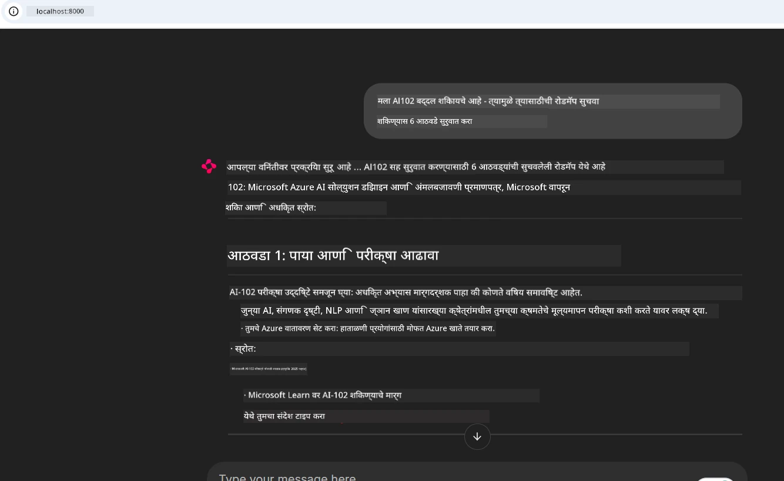
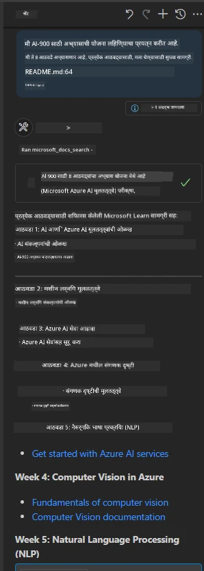

# केस स्टडी: क्लायंटकडून Microsoft Learn Docs MCP सर्व्हरशी कनेक्ट करणे

तुम्ही कधी दस्तऐवज साइट्स, Stack Overflow, आणि अनंत सर्च इंजिन टॅब्स यांच्यात झोपडी घालत असाल, तुमच्या कोडमधील समस्या सोडवण्याचा प्रयत्न करत असाल? कदाचित तुम्ही दस्तऐवजांसाठी दुसरा मॉनिटर ठेवता किंवा सतत तुमच्या IDE आणि ब्राउझरमध्ये अल्ट-टॅब करता असाल. जर तुम्ही दस्तऐवज थेट तुमच्या वर्कफ्लोमध्ये आणू शकत असाल—तुमच्या ऍप्स, IDE किंवा अगदी तुमच्या स्वतःच्या कस्टम टूल्समध्ये एकत्रित करून—तर ते कसं असेल? या केस स्टडीमध्ये, आपण बघू की क्लायंट ऍप्लिकेशनमधून थेट Microsoft Learn Docs MCP सर्व्हरशी कसं कनेक्ट करायचं.

## आढावा

आधुनिक विकास फक्त कोड लिहिण्यापुरताच मर्यादित नाही—ते योग्य वेळी योग्य माहिती मिळविण्याबाबत आहे. दस्तऐवज सर्वत्र आहेत, पण ते क्वचितच तुमच्याजवळ असतात जिथे त्याची सर्वाधिक गरज असते: तुमच्या साधनेत आणि वर्कफ्लोमध्ये. दस्तऐवज प्राप्ती थेट तुमच्या ऍप्लिकेशनमध्ये समाकलित करून, तुम्ही वेळ वाचवू शकता, संदर्भ बदलण्याचे टाळू शकता, आणि उत्पादकता वाढवू शकता. या विभागात, आम्ही दाखवू की क्लायंट कसा Microsoft Learn Docs MCP सर्व्हरशी कनेक्ट होतो, ज्यामुळे तुम्हाला रिअल-टाइम, संदर्भ-आधारित दस्तऐवज ऍक्सेस करता येतील, तुमच्या ऍपमधून बाहेर न जाता.

आपण कनेक्शन स्थापन करण्याचा, विनंती पाठवण्याचा, आणि स्ट्रीमिंग प्रतिसाद कार्यक्षमपणे हाताळण्याचा प्रक्रियेचा आढावा घेणार आहोत. हा दृष्टिकोन तुमचा वर्कफ्लो सुकर करतो तसेच अधिक बुद्धिमान, उपयुक्त डेव्हलपर टूल्स विकसित करण्याचा मार्ग खुला करतो.

## शिकण्याची उद्दिष्टे

हे करत आहोत का? कारण सर्वोत्तम डेव्हलपर अनुभव असे असतात जे त्रास कमी करतात. कल्पना करा अशी की तुमचा कोड एडिटर, चॅटबोट, किंवा वेब ऍप तुम्हाला Microsoft Learn येथील ताज्या सामग्रीचा वापर करून दस्तऐवज प्रश्नांची तत्काळ उत्तरे देतो. या अध्यायाच्या शेवटी, तुम्हाला कळेल कसे:

- दस्तऐवजासाठी MCP सर्व्हर-क्लायंट संवादाचे मूलतत्त्व समजून घेणे
- Microsoft Learn Docs MCP सर्व्हरशी कनेक्ट होण्यासाठी कन्सोल किंवा वेब ऍप्लिकेशन अंमलात आणणे
- रिअल-टाइम दस्तऐवज प्राप्तीसाठी स्ट्रीमिंग HTTP क्लायंटचा वापर करणे
- दस्तऐवज प्रतिसादांचे तुमच्या ऍप्लिकेशनमध्ये लॉगिंग आणि समजून घेणे

हे कौशल्य तुम्हाला प्रतिक्रिया देणाऱ्या नाही तर खरंच आंतरक्रियात्मक आणि संदर्भ-समजूतदार टूल्स तयार करण्यात मदत करेल.

## परिस्थिती 1 - रिअल-टाइम दस्तऐवज प्राप्ती MCP सह

या परिस्थितीत, आम्ही दाखवू की कसा क्लायंट Microsoft Learn Docs MCP सर्व्हरशी कनेक्ट होतो, ज्यामुळे तुम्हाला रिअल-टाइम, संदर्भ-आधारित दस्तऐवज मिळतात, तुमच्या ऍपमधून बाहेर न जाता.

हे प्रत्यक्षात आणूया. तुमचं काम आहे एक ऍप लिहिण्याचं जे Microsoft Learn Docs MCP सर्व्हरशी कनेक्ट होईल, `microsoft_docs_search` टूल कॉल करील, आणि स्ट्रीमिंग प्रतिसाद कन्सोलवर लॉग करील.

### हा दृष्टिकोन का?
कारण हे अधिक प्रगत समाकलने तयार करण्यासाठी पाया आहे—चाहे तुम्हाला चॅटबोट, IDE विस्तार, किंवा वेब डॅशबोर्ड तयार करायचा असो.

या परिस्थितीचा कोड आणि सूचनांपैकी [`solution`](./solution/README.md) फोल्डरमध्ये तुम्हाला सापडेल. ते पावले तुम्हाला कनेक्शन सेटअपमध्ये मार्गदर्शन करतात:
- अधिकृत MCP SDK आणि स्ट्रीमेबल HTTP क्लायंट वापरणे
- `microsoft_docs_search` टूलला क्वेरी पॅरामीटरसह कॉल करून दस्तऐवज प्राप्त करणे
- योग्य लॉगिंग आणि त्रुटी हाताळणी लागू करणे
- वापरकर्त्यांना एकाधिक शोध क्वेरी टाकण्यासाठी परस्परसंवादी कन्सोल इंटरफेस बनवणे

ही परिस्थिती दाखवते कसे:
- Docs MCP सर्व्हरशी कनेक्ट करायचे
- क्वेरी पाठवायची
- निकाल पार्स करायचे आणि मुद्रित करायचे

खाली दिलेल्या सोडवणुकीचे चालण्याचे उदाहरण काय दिसू शकते:

```
Prompt> What is Azure Key Vault?
Answer> Azure Key Vault is a cloud service for securely storing and accessing secrets. ...
```

खाली एक सूक्ष्म नमुना सोडवणूक आहे. पूर्ण कोड आणि तपशील सोल्यूशन फोल्डरमध्ये उपलब्ध आहेत.

<details>
<summary>Python</summary>

```python
import asyncio
from mcp.client.streamable_http import streamablehttp_client
from mcp import ClientSession

async def main():
    async with streamablehttp_client("https://learn.microsoft.com/api/mcp") as (read_stream, write_stream, _):
        async with ClientSession(read_stream, write_stream) as session:
            await session.initialize()
            result = await session.call_tool("microsoft_docs_search", {"query": "Azure Functions best practices"})
            print(result.content)

if __name__ == "__main__":
    asyncio.run(main())
```

- संपूर्ण अंमलबजावणी आणि लॉगिंगसाठी, [`scenario1.py`](../../../../09-CaseStudy/docs-mcp/solution/python/scenario1.py) पहा.
- स्थापनेसाठी आणि वापर सूचना [`README.md`](./solution/python/README.md) मध्ये पहा.
</details>

## परिस्थिती 2 - Docs MCP सह परस्परसंवादी अभ्यास योजना जनरेटर वेब ऍप

या परिस्थितीत, आपण डॉकuments MCP एका वेब विकास प्रकल्पात समाकलित करायला शिकाल. उद्दिष्ट आहे की वापरकर्ते Microsoft Learn दस्तऐवज थेट वेब इंटरफेसवर शोधू शकतील, ज्यामुळे दस्तऐवज त्वरीत तुमच्या ऍप किंवा साइटमध्ये उपलब्ध होतील.

तुम्ही बघाल कसे:
- वेब ऍप सेटअप करायचा
- Docs MCP सर्व्हरशी कनेक्ट करायचं
- वापरकर्त्यांचा इनपुट हाताळायचा आणि निकाल दाखवायचे

खाली दिलेल्या सोडवणुकीचे चालण्याचे उदाहरण काय दिसू शकते:

```
User> I want to learn about AI102 - so suggest the roadmap to get it started from learn for 6 weeks

Assistant> Here’s a detailed 6-week roadmap to start your preparation for the AI-102: Designing and Implementing a Microsoft Azure AI Solution certification, using official Microsoft resources and focusing on exam skills areas:

---
## Week 1: Introduction & Fundamentals
- **Understand the Exam**: Review the [AI-102 exam skills outline](https://learn.microsoft.com/en-us/credentials/certifications/exams/ai-102/).
- **Set up Azure**: Sign up for a free Azure account if you don't have one.
- **Learning Path**: [Introduction to Azure AI services](https://learn.microsoft.com/en-us/training/modules/intro-to-azure-ai/)
- **Focus**: Get familiar with Azure portal, AI capabilities, and necessary tools.

....more weeks of the roadmap...

Let me know if you want module-specific recommendations or need more customized weekly tasks!
```

खाली एक सूक्ष्म नमुना सोडवणूक आहे. पूर्ण कोड आणि तपशील सोल्यूशन फोल्डरमध्ये उपलब्ध आहेत.



<details>
<summary>Python (Chainlit)</summary>

Chainlit हा संवादात्मक AI वेब ऍप्स तयार करण्याचा फ्रेमवर्क आहे. हे संवादात्मक चॅटबॉट्स आणि सहाय्यक सहज तयार करण्यासाठी आहे जे MCP टूल्स कॉल करू शकतात आणि निकाल रिअल-टाइममध्ये दाखवू शकतात. हे वेगवान प्रोटोटायपिंग आणि वापरकर्ता-केंद्रित इंटरफेससाठी आदर्श आहे.

```python
import chainlit as cl
import requests

MCP_URL = "https://learn.microsoft.com/api/mcp"

@cl.on_message
def handle_message(message):
    query = {"question": message}
    response = requests.post(MCP_URL, json=query)
    if response.ok:
        result = response.json()
        cl.Message(content=result.get("answer", "No answer found.")).send()
    else:
        cl.Message(content="Error: " + response.text).send()
```

- संपूर्ण अंमलबजावणीसाठी [`scenario2.py`](../../../../09-CaseStudy/docs-mcp/solution/python/scenario2.py) पहा.
- सेटअप आणि चालवण्याच्या सूचना [`README.md`](./solution/python/README.md) मध्ये पहा.
</details>

## परिस्थिती 3: VS Code मध्ये MCP सर्व्हरसह इन-एडिटर दस्तऐवज

जर तुम्हाला Microsoft Learn Docs थेट तुमच्या VS Code मध्ये (ब्राउझर टॅब बदलण्याऐवजी) पाहिजे असतील, तर तुम्ही तुमच्या एडिटरमध्ये MCP सर्व्हर वापरू शकता. हे तुम्हाला या गोष्टी शक्य करेल:
- आपल्या कोडिंग वातावरणात राहून VS Code मध्ये दस्तऐवज शोधणे आणि वाचणे.
- दस्तऐवज संदर्भित करणे आणि तुमच्या README किंवा कोर्स फायलींमध्ये थेट दुवे घालणे.
- GitHub Copilot आणि MCP यांचा संयोजन वापरून एक अखंड, AI-शक्तीशाली दस्तऐवज वर्कफ्लो तयार करणे.

**तुम्हाला कसे शिकायला मिळेल:**
- आपल्या वर्कस्पेस रूटमध्ये वैध `.vscode/mcp.json` फाइल जोडणे (खालील उदाहरण पहा).
- MCP पॅनेल उघडणे किंवा VS Code मधील कमांड पॅलेट वापरून शोधणे आणि दस्तऐवज समाविष्ट करणे.
- काम करताना तुमच्या मार्कडाउन फायलींमध्ये थेट दस्तऐवज संदर्भित करणे.
- या वर्कफ्लोला GitHub Copilot सह एकत्रित करणे ज्यामुळे उत्पादकता वाढेल.

VS Code मध्ये MCP सर्व्हर कसा सेट करायचा याचे उदाहरण:

```json
{
  "servers": {
    "LearnDocsMCP": {
      "url": "https://learn.microsoft.com/api/mcp"
    }
  }
}
```

</details>

> स्क्रीनशॉट्स आणि टप्प्याटप्प्याने मार्गदर्शनासाठी [`README.md`](./solution/scenario3/README.md) पहा.



हा दृष्टिकोन तांत्रिक कोर्सेस तयार करणाऱ्यांसाठी, दस्तऐवज लिहिणाऱ्यांसाठी, किंवा वारंवार संदर्भ आवश्यक असलेल्या कोड विकासकर्त्यांसाठी आदर्श आहे.

## मुख्य मुद्दे

तुमच्या टूल्समध्ये थेट दस्तऐवज समाकलित करणे फक्त सुविधा नव्हे—ते उत्पादकतेसाठी क्रांतिकारी आहे. क्लायंटकडून Microsoft Learn Docs MCP सर्व्हरशी कनेक्ट करून, तुम्ही:

- तुमच्या कोड आणि दस्तऐवज यांच्यातील संदर्भ बदलणे टाळू शकता
- अद्ययावत, संदर्भ-आधारित दस्तऐवज रिअल-टाइममध्ये प्राप्त करू शकता
- अधिक हुशार, आंतरक्रियात्मक डेव्हलपर टूल्स तयार करू शकता

हे कौशल्य तुम्हाला केवळ कार्यक्षम नव्हे तर वापरायला आनंददायक सोल्यूशन्स तयार करण्यात मदत करेल.

## अतिरिक्त संसाधने

तुमची समज वाढवण्यासाठी, हे अधिकृत संसाधने तपासा:

- [Microsoft Learn Docs MCP Server (GitHub)](https://github.com/MicrosoftDocs/mcp)
- [Get started with Azure MCP Server (mcp-python)](https://learn.microsoft.com/en-us/azure/developer/azure-mcp-server/get-started#create-the-python-app)
- [What is the Azure MCP Server?](https://learn.microsoft.com/en-us/azure/developer/azure-mcp-server/)
- [Model Context Protocol (MCP) Introduction](https://modelcontextprotocol.io/introduction)
- [Add plugins from a MCP Server (Python)](https://learn.microsoft.com/en-us/semantic-kernel/concepts/plugins/adding-mcp-plugins)

## पुढील काय

- मागे: [Case Studies Overview](../README.md)
- पुढे: [Module 10: Streamlining AI Workflows with AI Toolkit](../../10-StreamliningAIWorkflowsBuildingAnMCPServerWithAIToolkit/README.md)

---

<!-- CO-OP TRANSLATOR DISCLAIMER START -->
**सूचना**:  
हा दस्तऐवज AI अनुवाद सेवेसह [Co-op Translator](https://github.com/Azure/co-op-translator) वापरून अनुवादित करण्यात आला आहे. आम्ही अचूकतेसाठी प्रयत्न करतो, तरी कृपया लक्षात ठेवा की स्वयंचलित अनुवादांमध्ये चुका किंवा अचूकतेच्या त्रुटी असू शकतात. मूळ दस्तऐवज त्याच्या स्थानिक भाषेत अधिकृत स्त्रोत मानला जावा. महत्त्वाच्या माहितीसाठी व्यावसायिक मानव अनुवाद शिफारस केला जातो. या अनुवादाचा वापर केल्यामुळे उद्भवलेल्या कोणत्याही गैरसमज किंवा चुकीच्या अर्थ लावणीसाठी आम्ही जबाबदार नाही.
<!-- CO-OP TRANSLATOR DISCLAIMER END -->