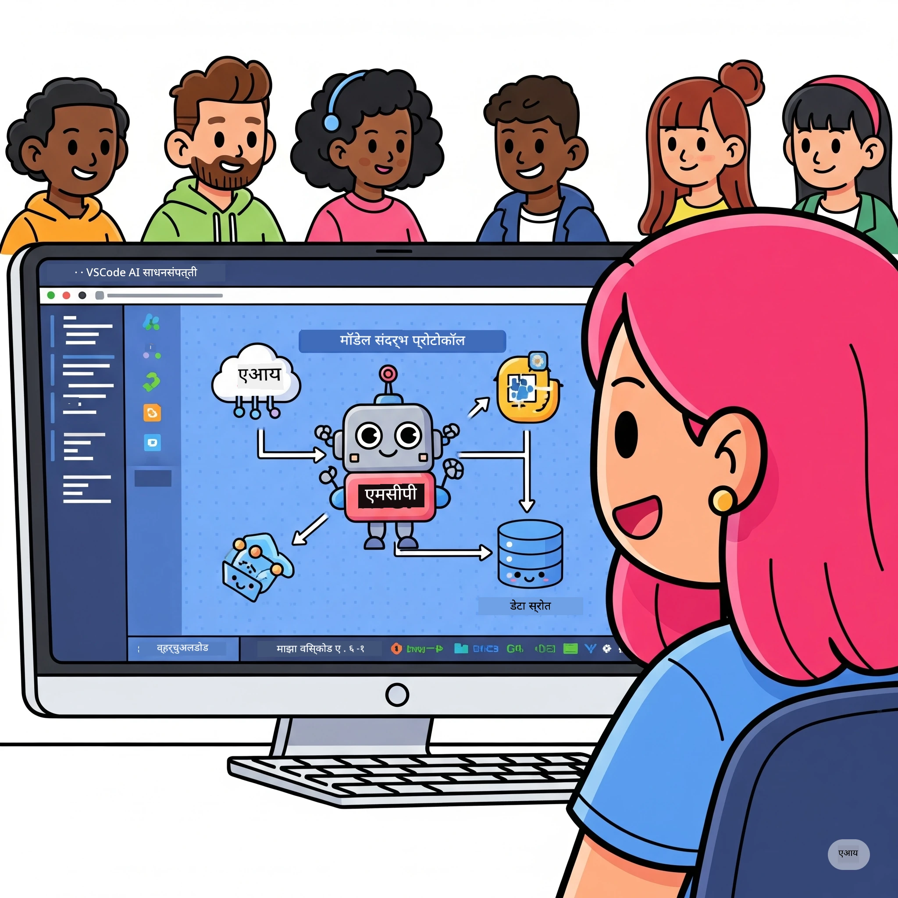
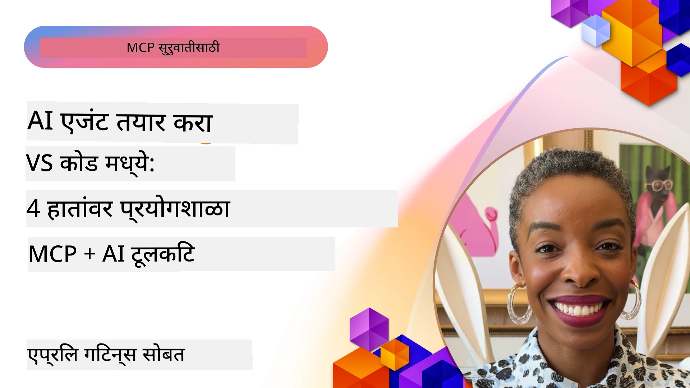

# एआय वर्कफ्लोज सुलभ करणे: AI Toolkit सह MCP सर्व्हर तयार करणे

## 🎯 विहंगावलोकन

_(हा धडा पाहण्यासाठी वरील चित्रावर क्लिक करा)_

**मॉडेल कंटेक्स्ट प्रोटोकॉल (MCP) वर्कशॉप** मध्ये आपले स्वागत आहे! ही सर्वसमावेशक हँड्स-ऑन वर्कशॉप दोन अत्याधुनिक तंत्रज्ञान एकत्र करून एआय अनुप्रयोग विकासात क्रांती घडवून आणते:

- **🔗 मॉडेल कंटेक्स्ट प्रोटोकॉल (MCP)**: सहज AI-टूल एकत्रीकरणासाठी एक खुले मानक
- **🛠️ Visual Studio Code साठी AI Toolkit (AITK)**: मायक्रोसॉफ्टचा शक्तिशाली AI विकास विस्तार

### 🎓 आपण काय शिकणार आहात

या वर्कशॉपच्या शेवटी, आपण बुद्धिमान अनुप्रयोग तयार करण्याची कला साध्य कराल जी AI मॉडेल्सना वास्तविक जगातील टूल्स आणि सेवा यांच्याशी जोडतात. स्वयंचलित चाचणीपासून कस्टम API एकत्रीकरणांपर्यंत, आपण व्यावहारिक कौशल्ये मिळवाल जी व्यवसायातील गुंतागुंतीच्या अडचणी सोडवण्यास मदत करतील.

## 🏗️ तंत्रज्ञान स्टॅक

### 🔌 मॉडेल कंटेक्स्ट प्रोटोकॉल (MCP)

MCP ही **"AI साठी USB-C"** आहे - एक सर्वसामान्य मानक जे AI मॉडेल्सना बाह्य टूल्स आणि डेटा स्रोतांशी जोडते.

**✨ मुख्य वैशिष्ट्ये:**

- 🔄 **मानकीकृत एकत्रीकरण**: AI-टूल कनेक्शन्स साठी सर्वसामान्य इंटरफेस
- 🏛️ **लवचिक आर्किटेक्चर**: stdio/SSE ट्रान्सपोर्टद्वारे स्थानिक आणि रिमोट सर्व्हर्स
- 🧰 **शक्तिशाली परिसंस्था**: टूल्स, प्रॉम्प्ट्स आणि संसाधने एका प्रोटोकॉलमध्ये
- 🔒 **एंटरप्राइज-तयार**: अंगभूत सुरक्षा आणि विश्वासार्हता

**🎯 MCP महत्त्वाचे का आहे:**
जसे USB-C केबलची गोंधळ टाळतो, तसे MCP एआय एकत्रीकरणांची गुंतागुंत कमी करते. एक प्रोटोकॉल, अनंत शक्यता.

### 🤖 Visual Studio Code साठी AI Toolkit (AITK)

मायक्रोसॉफ्टचा प्रमुख AI विकास विस्तार जो VS Code ला एआय शक्तिशाली केंद्रात रूपांतरित करतो.

**🚀 मुख्य क्षमता:**

- 📦 **मॉडेल कॅटलॉग**: Azure AI, GitHub, Hugging Face, Ollama येथून मॉडेल्सचा प्रवेश
- ⚡ **स्थानिक इनफरन्स**: ONNX-ऑप्टिमाइझ्ड CPU/GPU/NPU अंमलबजावणी
- 🏗️ **एजेंट बिल्डर**: MCP एकत्रीकरणासह Visual AI एजंट विकास
- 🎭 **मल्टी-मोडल**: मजकूर, दृष्टी, आणि संरचित आउटपुटचा आधार

**💡 विकासाचे फायदे:**

- झिरो-कॉनफिग मॉडेल तैनात करणे
- दृश्य प्रॉम्प्ट अभियांत्रण
- रिअल-टाइम चाचणी प्लेग्राउंड
- सुरळीत MCP सर्व्हर एकत्रीकरण

## 📚 शिकण्याचा प्रवास

### [🚀 मॉड्यूल 1: AI Toolkit मूलभूत माहिती](./lab1/README.md)

**कालावधी**: 15 मिनिटे

- 🛠️ VS Code साठी AI Toolkit स्थापित करा आणि कॉन्फिगर करा
- 🗂️ मॉडेल कॅटलॉग एक्सप्लोर करा (GitHub, ONNX, OpenAI, Anthropic, Google मधून 100+ मॉडेल्स)
- 🎮 रिअल-टाइम मॉडेल चाचणीसाठी Interactive Playground काबीज करा
- 🤖 Agent Builder वापरून आपला प्रथम AI एजंट तयार करा
- 📊 अंतर्गत मेट्रिक्स सह मॉडेल कार्यक्षमतेचे मूल्यांकन करा (F1, संबंधितता, सारख्या, सुसंगतता)
- ⚡ बॅच प्रक्रिया आणि मल्टी-मोडल समर्थन क्षमता शिका

**🎯 शिकण्याचा परिणाम**: AITK क्षमतेचा सखोल समज असलेला कार्यक्षम AI एजंट तयार करा

### [🌐 मॉड्यूल 2: MCP सह AI Toolkit मूलभूत माहिती](./lab2/README.md)

**कालावधी**: 20 मिनिटे

- 🧠 मॉडेल कंटेक्स्ट प्रोटोकॉल (MCP) चे आर्किटेक्चर आणि संकल्पना शिका
- 🌐 मायक्रोसॉफ्टच्या MCP सर्व्हर परिसंस्थेची माहिती घ्या
- 🤖 Playwright MCP सर्व्हर वापरून ब्राउझर ऑटोमेशन एजंट तयार करा
- 🔧 AI Toolkit Agent Builder सोबत MCP सर्व्हर्स एकत्र करा
- 📊 एजंट्समध्ये MCP टूल्स कॉन्फिगर आणि चाचणी करा
- 🚀 उत्पादनासाठी MCP चालित एजंट्स निर्यात आणि तैनात करा

**🎯 शिकण्याचा परिणाम**: बाह्य टूल्ससह सुपरचार्ज्ड AI एजंट MCP वापरून तैनात करा

### [🔧 मॉड्यूल 3: AI Toolkit सह प्रगत MCP विकास](./lab3/README.md)

**कालावधी**: 20 मिनिटे

- 💻 AI Toolkit वापरून कस्टम MCP सर्व्हर्स तयार करा
- 🐍 नवीनतम MCP Python SDK (v1.9.3) कॉन्फिगर आणि वापरा
- 🔍 डीबगिंगसाठी MCP Inspector सेटअप आणि वापर करा
- 🛠️ व्यावसायिक डीबगिंग वर्कफ्लोजसह Weather MCP Server तयार करा
- 🧪 Agent Builder आणि Inspector पर्यावरणांमध्ये MCP सर्व्हर डीबग करा

**🎯 शिकण्याचा परिणाम**: आधुनिक टूल्ससह कस्टम MCP सर्व्हर विकसित आणि डीबग करा

### [🐙 मॉड्यूल 4: व्यावहारिक MCP विकास - कस्टम GitHub क्लोन सर्व्हर](./lab4/README.md)

**कालावधी**: 30 मिनिटे

- 🏗️ विकास वर्कफ्लोजसाठी रिअल-वर्ल्ड GitHub क्लोन MCP सर्व्हर तयार करा
- 🔄 स्मार्ट रिपॉझिटरी क्लोनिंग नवीनता आणि त्रुटी हाताळणीसह लागू करा
- 📁 बुद्धिमान निर्देशिका व्यवस्थापन आणि VS Code एकत्रीकरण तयार करा
- 🤖 कस्टम MCP टूल्ससह GitHub Copilot एजंट मोड वापरा
- 🛡️ उत्पादन-तयार विश्वसनीयता आणि क्रॉस-प्लॅटफॉर्म सुसंगतता लागू करा

**🎯 शिकण्याचा परिणाम**: वास्तविक विकास वर्कफ्लोज सुलभ करणारा उत्पादन-तयार MCP सर्व्हर तैनात करा

## 💡 वास्तविक जगातील अनुप्रयोग आणि परिणाम

### 🏢 एंटरप्राइज वापर प्रकरणे

#### 🔄 DevOps ऑटोमेशन

आपल्या विकास वर्कफ्लोला बुद्धिमान स्वयंचलिततेने रुपांतरित करा:

- **स्मार्ट रिपॉझिटरी व्यवस्थापन**: AI-चालित कोड पुनरावलोकन आणि मर्ज निर्णय
- **बुद्धिमान CI/CD**: कोड बदलांवर आधारित स्वयंचलित पाईपलाइन ऑप्टिमायझेशन
- **इश्यू ट्रीयाज**: स्वयंचलित बग वर्गीकरण आणि नियुक्ती

#### 🧪 गुणवत्ता आश्वासन क्रांती

AI-चालित स्वयंचलिततेने चाचण्या उंचाव्या:

- **बुद्धिमान चाचणी निर्मिती**: स्वयंचलितपणे व्यापक चाचणी संच तयार करा
- **दृश्य पुनरावृत्ती चाचणी**: AI-चालित UI बदल ओळख
- **कामगिरी देखरेख**: सक्रिय समस्या ओळख आणि निराकरण

#### 📊 डेटा पाइपलाइन बुद्धिमत्ता

जास्त स्मार्ट डेटा प्रक्रिया वर्कफ्लोज तयार करा:

- **अनुकुल ETL प्रक्रिया**: स्व-ऑप्टिमाइझिंग डेटा रूपांतरण
- **विचित्रता शोध**: रिअल-टाइम डेटा गुणवत्ता देखरेख
- **बुद्धिमान मार्गदर्शन**: स्मार्ट डेटा फ्लो व्यवस्थापन

#### 🎧 ग्राहक अनुभव वाढवणे

असामान्य ग्राहक संवाद तयार करा:

- **संदर्भ-जाणणारे सहाय्य**: ग्राहक इतिहासाला प्रवेश असलेले AI एजंट्स
- **प्रोऐक्टिव समस्या निवारण**: भविष्यसूचक ग्राहक सेवा
- **मल्टी-चॅनेल एकत्रीकरण**: प्लॅटफॉर्मवर एकसंध AI अनुभव

## 🛠️ पूर्वअट आणि सेटअप

### 💻 प्रणाली गरजा

| घटक | गरज | टीपा |
|-----------|-------------|-------|
| **ऑपरेटिंग सिस्टम** | Windows 10+, macOS 10.15+, Linux | कोणतीही आधुनिक OS |
| **Visual Studio Code** | नवीनतम स्थिर आवृत्ती | AITK साठी आवश्यक |
| **Node.js** | v18.0+ आणि npm | MCP सर्व्हर विकासासाठी |
| **Python** | 3.10+ | Python MCP सर्व्हरंसाठी पर्यायी |
| **स्मृती** | किमान 8GB RAM | स्थानिक मॉडेलसाठी 16GB शिफारसीय |

### 🔧 विकास पर्यावरण

#### शिफारस केलेले VS Code विस्तार

- **AI Toolkit** (ms-windows-ai-studio.windows-ai-studio)
- **Python** (ms-python.python)
- **Python Debugger** (ms-python.debugpy)
- **GitHub Copilot** (GitHub.copilot) - पर्यायी पण उपयुक्त

#### पर्यायी टूल्स

- **uv**: आधुनिक Python पॅकेज व्यवस्थापक
- **MCP Inspector**: MCP सर्व्हरसाठी दृश्य डीबगिंग टूल
- **Playwright**: वेब ऑटोमेशन उदाहरणांसाठी

## 🎖️ शिकण्याची कौशल्ये आणि प्रमाणपत्र मार्ग

### 🏆 कौशल्य व्यवस्थापन यादी

हा वर्कशॉप पूर्ण करून, आपण खालील क्षेत्रांत पारंगत होाल:

#### 🎯 मुख्य कौशल्ये

- [ ] **MCP प्रोटोकॉल पारंगतता**: आर्किटेक्चर आणि अंमलबजावणी नमुन्यांची सखोल समज
- [ ] **AITK कौशल्य**: AI Toolkit चा त्वरित विकासासाठी तज्ज्ञस्तरीय वापर
- [ ] **कस्टम सर्व्हर विकास**: उत्पादनासाठी MCP सर्व्हर तयार, तैनात आणि देखभाल करा
- [ ] **टूल एकत्रीकरण उत्कृष्टता**: AI ला विद्यमान विकास वर्कफ्लोजशी सुरळीत जोडा
- [ ] **समस्या-निवारण अनुप्रयोग**: खऱ्या व्यवसायातील समस्यांकडे शिकलेल्या कौशल्याचा वापर

#### 🔧 तांत्रिक कौशल्ये

- [ ] VS Code मध्ये AI Toolkit सेटअप आणि कॉन्फिगर करा
- [ ] कस्टम MCP सर्व्हर डिझाइन आणि अंमलबजावणी करा
- [ ] MCP आर्किटेक्चरसह GitHub मॉडेल्स एकत्र करा
- [ ] Playwright वापरून स्वयंचलित चाचणी वर्कफ्लोज तयार करा
- [ ] उत्पादनासाठी AI एजंट तैनात करा
- [ ] MCP सर्व्हर कार्यक्षमतेचे डीबग आणि ऑप्टिमाइझ करा

#### 🚀 प्रगत क्षमता

- [ ] एंटरप्राइज-स्तरीय AI एकत्रीकरणांचे आर्किटेक्टिंग करा
- [ ] AI अनुप्रयोगांसाठी सुरक्षा सर्वोत्तम पद्धती वापरा
- [ ] स्केलेबल MCP सर्व्हर आर्किटेक्चर डिझाइन करा
- [ ] विशिष्ट क्षेत्रांसाठी कस्टम टूल चेन तयार करा
- [ ] AI-नेटिव्ह विकासात इतरांना मार्गदर्शन करा

## 📖 अतिरिक्त संसाधने

- [MCP स्पेसिफिकेशन (2025-11-25)](https://spec.modelcontextprotocol.io/specification/2025-11-25/)
- [AI Toolkit GitHub रिपॉझिटरी](https://github.com/microsoft/vscode-ai-toolkit)
- [नमुना MCP सर्व्हर्स संकलन](https://github.com/modelcontextprotocol/servers)
- [सर्वोत्तम पद्धती मार्गदर्शक](https://modelcontextprotocol.io/docs/best-practices)
- [OWASP MCP टॉप 10](https://microsoft.github.io/mcp-azure-security-guide/mcp/) - सुरक्षा सर्वोत्तम पद्धती

---

**🚀 आपल्या AI विकास वर्कफ्लोमध्ये क्रांती घडविण्यास सज्ज आहात?**

चला MCP आणि AI Toolkit सह बुद्धिमान अनुप्रयोगांच्या भविष्यातील निर्माण करूया!

## पुढे काय

सुरू ठेवा: [मॉड्यूल 11: MCP सर्व्हर हँड्स-ऑन लॅब्स](../11-MCPServerHandsOnLabs/README.md)

---

<!-- CO-OP TRANSLATOR DISCLAIMER START -->
**अस्वीकरण**:
हा कागदपत्र AI अनुवाद सेवा [Co-op Translator](https://github.com/Azure/co-op-translator) वापरून अनुवादित केले आहे. आम्ही अचूकतेसाठी प्रयत्न करतो, परंतु कृपया लक्षात घ्या की स्वयंचलित अनुवादांमध्ये चुका किंवा असमंजसता असू शकते. मूळ कागदपत्र त्याच्या स्थानिक भाषेत अधिकृत स्रोत मानले पाहिजे. महत्त्वाच्या माहितीसाठी व्यावसायिक मानव अनुवाद शिफारस केली जाते. या अनुवादाचा वापर करून झालेल्या कोणत्याही गैरसमज किंवा चुकीसाठी आम्ही जबाबदार नाही.
<!-- CO-OP TRANSLATOR DISCLAIMER END -->