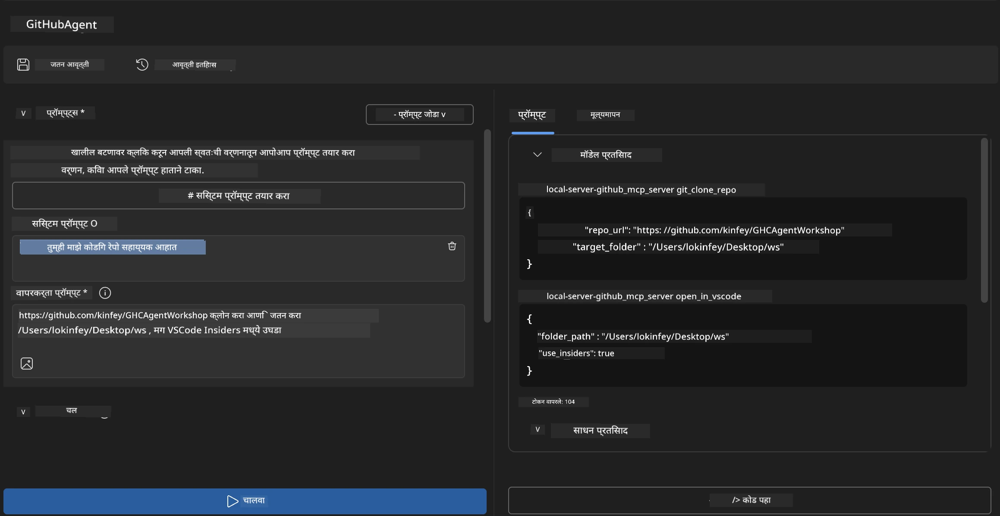
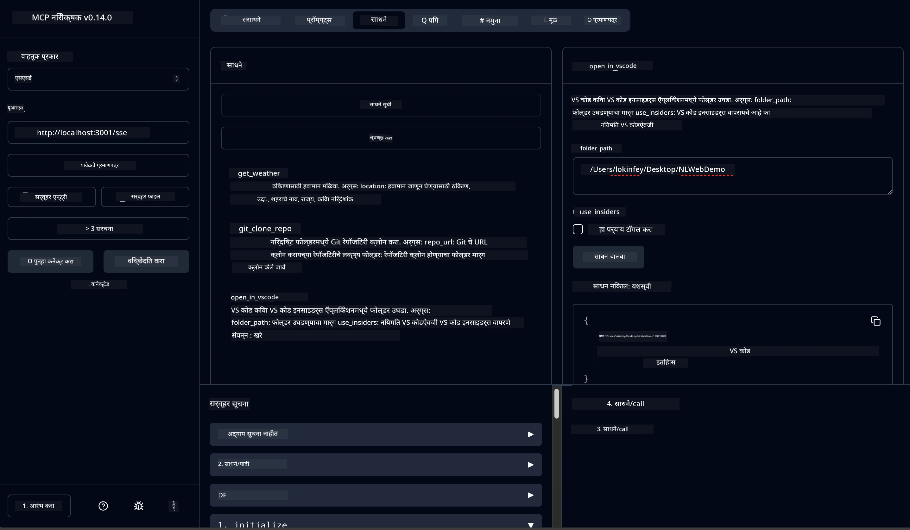

# 🐙 मॉड्यूल 4: व्यावहारिक MCP विकास - कस्टम GitHub क्लोन सर्व्हर


> **⚡ वेगवान सुरुवात:** फक्त 30 मिनिटांत GitHub रेपॉझिटरी क्लोनिंग आणि VS Code इंटिग्रेशन ऑटोमेट करणारा उत्पादनासाठी तयार MCP सर्व्हर तयार करा!

## 🎯 शिकण्याच्या उद्दिष्टे

या लॅबच्या शेवटी, तुम्हाला हे करता येईल:

- ✅ वास्तविक विकास कार्यप्रवाहांसाठी कस्टम MCP सर्व्हर तयार करा
- ✅ MCP द्वारे GitHub रेपॉझिटरी क्लोनिंग कार्यक्षमता अंमलात आणा
- ✅ कस्टम MCP सर्व्हर VS Code आणि Agent Builder सोबत इंटिग्रेट करा
- ✅ GitHub Copilot Agent Mode कस्टम MCP टूल्ससह वापरा
- ✅ उत्पादन वातावरणात कस्टम MCP सर्व्हर चाचणी व तैनात करा

## 📋 पूर्वअटी

- Labs 1-3 (MCP मूलतत्त्वे आणि प्रगत विकास) पूर्ण केलेले असणे
- GitHub Copilot सदस्यत्व ([मोफत साइनअप उपलब्ध](https://github.com/github-copilot/signup))
- AI Toolkit आणि GitHub Copilot एक्सटेंशन्ससह VS Code
- Git CLI इंस्टॉल व कॉन्फिगर केलेले

## 🏗️ प्रकल्पाचे आढावा

### **वास्तविक विकास आव्हान**
विकासक म्हणून, आम्ही अनेकदा GitHub वापरून रेपॉझिटरी क्लोन करतो आणि VS Code किंवा VS Code Insiders मध्ये उघडतो. हा मॅन्युअल प्रक्रिया खालीलप्रमाणे असतो:
1. टर्मिनल/कमांड प्रॉम्प्ट उघडणे
2. इच्छित डिरेक्टरी कडे नेव्हिगेट करणे
3. `git clone` कमांड चालवणे
4. क्लोन केलेल्या डिरेक्टरीमध्ये VS Code उघडणे

**आमचे MCP समाधान हे सर्व एका बुद्धिमान कमांडमध्ये रूपांतरित करते!**

### **तुम्ही काय तयार कराल**
एक **GitHub Clone MCP Server** (`git_mcp_server`) जो प्रदान करतो:

| वैशिष्ट्य | वर्णन | फायदा |
|---------|-------------|---------|
| 🔄 **स्मार्ट रेपॉझिटरी क्लोनिंग** | मान्यता सहित GitHub रेपॉझिटरीज क्लोन करा | ऑटोमेटेड त्रुटी तपासणी |
| 📁 **बुद्धिमान डिरेक्टरी व्यवस्थापन** | सुरक्षितपणे डिरेक्टरीज तपासा आणि तयार करा | ओव्हररायट होणे टाळते |
| 🚀 **क्रॉस-प्लॅटफॉर्म VS Code इंटिग्रेशन** | VS Code/Insiders मध्ये प्रोजेक्ट उघडा | अखंड कार्यप्रवाह संक्रमण |
| 🛡️ **मजबूत त्रुटी हाताळणी** | नेटवर्क, परवानग्या आणि पथ समस्यांवर हाताळणी करा | उत्पादनासाठी तयार विश्वसनीयता |

---

## 📖 टप्प्याटप्प्याने अंमलबजावणी

### टप्पा 1: Agent Builder मध्ये GitHub एजंट तयार करा

1. AI Toolkit एक्सटेंशनद्वारे **Agent Builder** सुरू करा
2. खालील कॉन्फिगरेशनसह **नवीन एजंट तयार करा:**
   ```
   Agent Name: GitHubAgent
   ```

3. **कस्टम MCP सर्व्हर प्रारंभ करा:**
   - **Tools** → **Add Tool** → **MCP Server** कडे जा
   - **"Create A new MCP Server"** निवडा
   - जास्तीत जास्त लवचिकतेसाठी **Python template** निवडा
   - **सर्व्हर नाव:** `git_mcp_server`

### टप्पा 2: GitHub Copilot Agent Mode कॉन्फिगर करा

1. VS Code मध्ये **GitHub Copilot** उघडा (Ctrl/Cmd + Shift + P → "GitHub Copilot: Open")
2. Copilot इंटरफेसमध्ये **Agent Model निवडा**
3. उन्नत विचार क्षमतेसाठी **Claude 3.7 model निवडा**
4. टूल प्रवेशासाठी **MCP इंटिग्रेशन सक्षम करा**

> **💡 प्रो टिप:** Claude 3.7 विकास कार्यप्रवाह व त्रुटी हाताळणी नमुन्यांची उत्कृष्ट समज प्रदान करतो.

### टप्पा 3: मुख्य MCP सर्व्हर कार्यक्षमता अंमलात आणा

**GitHub Copilot Agent Mode सोबत खालील सविस्तर प्रॉम्प्ट वापरा:**

```
Create two MCP tools with the following comprehensive requirements:

🔧 TOOL A: clone_repository
Requirements:
- Clone any GitHub repository to a specified local folder
- Return the absolute path of the successfully cloned project
- Implement comprehensive validation:
  ✓ Check if target directory already exists (return error if exists)
  ✓ Validate GitHub URL format (https://github.com/user/repo)
  ✓ Verify git command availability (prompt installation if missing)
  ✓ Handle network connectivity issues
  ✓ Provide clear error messages for all failure scenarios

🚀 TOOL B: open_in_vscode
Requirements:
- Open specified folder in VS Code or VS Code Insiders
- Cross-platform compatibility (Windows/Linux/macOS)
- Use direct application launch (not terminal commands)
- Auto-detect available VS Code installations
- Handle cases where VS Code is not installed
- Provide user-friendly error messages

Additional Requirements:
- Follow MCP 1.9.3 best practices
- Include proper type hints and documentation
- Implement logging for debugging purposes
- Add input validation for all parameters
- Include comprehensive error handling
```

### टप्पा 4: तुमचा MCP सर्व्हर चाचणी करा

#### 4a. Agent Builder मध्ये चाचणी

1. Agent Builder साठी **डिबग कॉन्फिगरेशन सुरू करा**
2. तुमच्या एजंटसाठी खालील सिस्टम प्रॉम्प्ट सेट करा:

```
SYSTEM_PROMPT:
You are my intelligent coding repository assistant. You help developers efficiently clone GitHub repositories and set up their development environment. Always provide clear feedback about operations and handle errors gracefully.
```

3. प्रत्यक्ष वापरकर्ता परिस्थितींमध्ये चाचणी करा:

```
USER_PROMPT EXAMPLES:

Scenario : Basic Clone and Open
"Clone {Your GitHub Repo link such as https://github.com/kinfey/GHCAgentWorkshop
 } and save to {The global path you specify}, then open it with VS Code Insiders"
```



**अपेक्षित निकाल:**
- ✅ योग्य पथासह यशस्वी क्लोनिंग
- ✅ स्वयंचलित VS Code सुरूवात
- ✅ अवैध परिस्थितीसाठी स्पष्ट त्रुटी संदेश
- ✅ काठाच्या प्रकरणांची योग्य हाताळणी

#### 4b. MCP Inspector मध्ये चाचणी



---


**🎉 अभिनंदन!** तुम्ही यशस्वीपणे एक व्यावहारिक, उत्पादनासाठी तयार MCP सर्व्हर तयार केला आहे जो वास्तविक विकास कार्यप्रवाह प्रश्न सोडवितो. तुमचा कस्टम GitHub क्लोन सर्व्हर MCP च्या सामर्थ्याचे प्रतिनिधित्व करतो जे विकासकांची उत्पादकता स्वयंचलित आणि सुधारित करते.

### 🏆 उपलब्धी अनलॉक झाली:
- ✅ **MCP विकासक** - कस्टम MCP सर्व्हर तयार केला
- ✅ **Workflow Automator** - विकास प्रक्रियांचा सुलभ करणारा
- ✅ **इंटिग्रेशन तज्ञ** - अनेक विकास टूल्स कनेक्ट केले
- ✅ **उत्पादनासाठी तयार** - तैनात करण्यायोग्य उपाय तयार केले

---

## 🎓 कार्यशाळा संपूर्ण: Model Context Protocol सह तुमचा प्रवास

**प्रिय कार्यशाळा सहभागी,**

Model Context Protocol कार्यशाळेच्या सर्व चार मॉड्युल्स पूर्ण केल्याबद्दल अभिनंदन! तुम्ही प्राथमिक AI Toolkit संकल्पना समजून घेण्यापासून उत्पादनासाठी तयार MCP सर्व्हर तयार करण्यापर्यंत एक लांबचा मार्ग पार केला आहे जे वास्तविक विकास आव्हाने सोडवतात.

### 🚀 तुमचा शिकण्याचा मार्ग सारांश:

**[मॉड्यूल 1](../lab1/README.md)**: तुम्ही AI Toolkit मूलतत्त्वे, मॉडेल चाचणी, आणि तुमचा पहिला AI एजंट तयार करणे सुरू केले.

**[मॉड्यूल 2](../lab2/README.md)**: तुम्हाला MCP आर्किटेक्चर समजले, Playwright MCP इंटीग्रेट केले, आणि तुमचा पहिला ब्राउझर ऑटोमेशन एजंट तयार केला.

**[मॉड्यूल 3](../lab3/README.md)**: तुम्ही Weather MCP सर्व्हरसह कस्टम MCP सर्व्हर विकासात प्रगती केली आणि डिबगिंग साधने शिकली.

**[मॉड्यूल 4](../lab4/README.md)**: आता तुम्ही GitHub रेपॉझिटरी कार्यप्रवाह स्वयंचलन टूल तयार करण्यासाठी सगळं लागू केले आहे.

### 🌟 तुम्ही काय प्रावीण्य मिळवलं:

- ✅ **AI Toolkit परिसंस्था**: मॉडेल, एजंट, आणि इंटीग्रेशन नमुने
- ✅ **MCP आर्किटेक्चर**: क्लायंट-सर्व्हर डिझाइन, ट्रान्सपोर्ट प्रोटोकॉल, आणि सुरक्षा
- ✅ **विकासक साधने**: Playground पासून Inspector पर्यंत उत्पादन तैनातीपर्यंत
- ✅ **कस्टम विकास**: तुमचे स्वतःचे MCP सर्व्हर तयार करणे, चाचणी आणि तैनात करणे
- ✅ **व्यावहारिक अनुप्रयोग**: AI सह वास्तविक कार्यप्रवाह आव्हाने सोडवणे

### 🔮 तुमचे पुढील पाऊल:

1. **तुमचे स्वतःचे MCP सर्व्हर तयार करा**: तुमचे अद्वितीय कार्यप्रवाह स्वयंचलित करा
2. **MCP समुदायात सहभागी व्हा**: तुमची निर्मिती शेअर करा आणि इतरांकडून शिका
3. **प्रगत इंटीग्रेशन Explore करा**: MCP सर्व्हर एंटरप्राइझ सिस्टम्सशी कनेक्ट करा
4. **ओपन सोर्समध्ये योगदान द्या**: MCP टूलिंग आणि डॉक्युमेंटेशन सुधारण्यास मदत करा

तुम्हाला लक्षात ठेवा, ही कार्यशाळा फक्त सुरुवात आहे. Model Context Protocol परिसंस्था जलद गतीने विकसित होत आहे, आणि तुम्ही आता AI-चालित विकास टूल्सच्या अग्रभागी आहात.

**शिकण्यासाठी व सहभागी राहण्यासाठी तुमचे आभार!**

आम्हाला आशा आहे की ही कार्यशाळा तुमच्या विकास प्रवासात AI टूल्स तयार करण्याच्या व वापरण्याच्या पध्दतीत नवीन कल्पना आणि बदल घडवेल.

**हॅपी कोडिंग!**

---

## पुढे काय आहे

मॉड्यूल 10 मधील सर्व लॅब्स पूर्ण केल्याबद्दल अभिनंदन!

- परतीचा दुवा: [Module 10 Overview](../README.md)
- पुढे जा: [Module 11: MCP Server Hands-On Labs](../../11-MCPServerHandsOnLabs/README.md)

---

<!-- CO-OP TRANSLATOR DISCLAIMER START -->
**अस्वीकरण**:
हा दस्तऐवज AI अनुवाद सेवा [Co-op Translator](https://github.com/Azure/co-op-translator) वापरून अनुवादित केला आहे. आम्ही अचूकतेसाठी प्रयत्न करतो, परंतु कृपया लक्षात घ्या की स्वयंचलित अनुवादांमध्ये चुका किंवा असत्यता असू शकतात. मूळ दस्तऐवज त्याच्या स्थानिक भाषेत अधिकृत स्रोत मानला जातो. महत्त्वाच्या माहितीसाठी व्यावसायिक मानवी अनुवादाचा सल्ला दिला जातो. या अनुवादाच्या वापरामुळे उद्भवणाऱ्या कोणत्याही गैरसमजुती किंवा चुकीच्या अर्थलाभासाठी आम्ही जबाबदार नाही.
<!-- CO-OP TRANSLATOR DISCLAIMER END -->