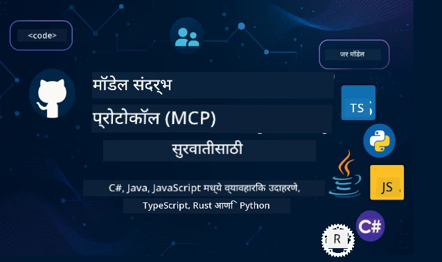

 

[](https://GitHub.com/microsoft/mcp-for-beginners/graphs/contributors)
[](https://GitHub.com/microsoft/mcp-for-beginners/issues)
[](https://GitHub.com/microsoft/mcp-for-beginners/pulls)
[](http://makeapullrequest.com)

[](https://GitHub.com/microsoft/mcp-for-beginners/watchers)
[](https://GitHub.com/microsoft/mcp-for-beginners/fork)
[](https://GitHub.com/microsoft/mcp-for-beginners/stargazers)


[](https://discord.gg/nTYy5BXMWG)

या संसाधनांचा वापर सुरू करण्यासाठी खालील पायऱ्या फॉलो करा:
1. **रिपॉझिटरी फोर्क करा**: क्लिक करा [](https://GitHub.com/microsoft/mcp-for-beginners/fork)
2. **रिपॉझिटरी क्लोन करा**: `git clone https://github.com/microsoft/mcp-for-beginners.git`
3. **जॉईन व्हा** [](https://discord.gg/nTYy5BXMWG)


### 🌐 बहुभाषिक समर्थन

#### GitHub Action द्वारे समर्थित (स्वयंचलित व नेहमी अद्ययावत)

<!-- CO-OP TRANSLATOR LANGUAGES TABLE START -->
[Arabic](../ar/README.md) | [Bengali](../bn/README.md) | [Bulgarian](../bg/README.md) | [Burmese (Myanmar)](../my/README.md) | [Chinese (Simplified)](../zh-CN/README.md) | [Chinese (Traditional, Hong Kong)](../zh-HK/README.md) | [Chinese (Traditional, Macau)](../zh-MO/README.md) | [Chinese (Traditional, Taiwan)](../zh-TW/README.md) | [Croatian](../hr/README.md) | [Czech](../cs/README.md) | [Danish](../da/README.md) | [Dutch](../nl/README.md) | [Estonian](../et/README.md) | [Finnish](../fi/README.md) | [French](../fr/README.md) | [German](../de/README.md) | [Greek](../el/README.md) | [Hebrew](../he/README.md) | [Hindi](../hi/README.md) | [Hungarian](../hu/README.md) | [Indonesian](../id/README.md) | [Italian](../it/README.md) | [Japanese](../ja/README.md) | [Kannada](../kn/README.md) | [Korean](../ko/README.md) | [Lithuanian](../lt/README.md) | [Malay](../ms/README.md) | [Malayalam](../ml/README.md) | [Marathi](./README.md) | [Nepali](../ne/README.md) | [Nigerian Pidgin](../pcm/README.md) | [Norwegian](../no/README.md) | [Persian (Farsi)](../fa/README.md) | [Polish](../pl/README.md) | [Portuguese (Brazil)](../pt-BR/README.md) | [Portuguese (Portugal)](../pt-PT/README.md) | [Punjabi (Gurmukhi)](../pa/README.md) | [Romanian](../ro/README.md) | [Russian](../ru/README.md) | [Serbian (Cyrillic)](../sr/README.md) | [Slovak](../sk/README.md) | [Slovenian](../sl/README.md) | [Spanish](../es/README.md) | [Swahili](../sw/README.md) | [Swedish](../sv/README.md) | [Tagalog (Filipino)](../tl/README.md) | [Tamil](../ta/README.md) | [Telugu](../te/README.md) | [Thai](../th/README.md) | [Turkish](../tr/README.md) | [Ukrainian](../uk/README.md) | [Urdu](../ur/README.md) | [Vietnamese](../vi/README.md)

> **स्थानिकपणे क्लोन करणे प्राधान्य द्यायचे का?**
>
> या रिपॉझिटरीमध्ये ५०+ भाषा अनुवाद समाविष्ट आहेत ज्यामुळे डाउनलोड साईज लक्षणीय वाढते. भाषांतरांशिवाय क्लोन करण्यासाठी sparse checkout वापरा:
>
> **Bash / macOS / Linux:**
> ```bash
> git clone --filter=blob:none --sparse https://github.com/microsoft/mcp-for-beginners.git
> cd mcp-for-beginners
> git sparse-checkout set --no-cone '/*' '!translations' '!translated_images'
> ```
>
> **CMD (Windows):**
> ```cmd
> git clone --filter=blob:none --sparse https://github.com/microsoft/mcp-for-beginners.git
> cd mcp-for-beginners
> git sparse-checkout set --no-cone "/*" "!translations" "!translated_images"
> ```
>
> तुम्हाला कोर्स पूर्ण करण्यासाठी आवश्यक असलेले सर्व काही खूप जलद डाउनलोडसह मिळेल.
<!-- CO-OP TRANSLATOR LANGUAGES TABLE END -->

# 🚀 मॉडेल कॉन्टेक्स्ट प्रोटोकॉल (MCP) सुरूवातीसाठी अभ्यासक्रम

## **C#, Java, JavaScript, Rust, Python, आणि TypeScript मध्ये हाताळणी कोड उदाहरणांसह MCP शिका**

## 🧠 मॉडेल कॉन्टेक्स्ट प्रोटोकॉल अभ्यासक्रमाचे सारांश
मॉडेल कॉन्टेक्स्ट प्रोटोकॉलच्या प्रवासात आपले स्वागत आहे! आपल्याला कधी विचार आला असेल की AI अनुप्रयोग वेगवेगळ्या साधने आणि सेवांशी कसे संवाद करतात, तर आपण सध्या एक सुंदर सोडवणूक शोधणार आहात जी विकसकांना बुद्धिमान प्रणाली तयार करण्याचा पद्धत बदलत आहे.

MCP ला AI अनुप्रयोगांसाठी एक सार्वत्रिक भाषांतरकार म्हणून विचार करा - जसं USB पोर्ट तुमच्या संगणकाला कोणतेही साधन जोडण्यास अनुमती देतो, तसंच MCP AI मॉडेल्सना कोणतीही साधने किंवा सेवा एकसंध पद्धतीने जोडण्याची सुविधा देते. तुम्ही तुमचा पहिला चॅटबॉट बनवत असाल किंवा क्लिष्ट AI कार्यप्रवाहावर काम करत असाल, MCP समजून घेतल्याने तुम्हाला अधिक सक्षम आणि लवचीक अनुप्रयोग तयार करण्याची शक्ती मिळेल.

हा अभ्यासक्रम तुमच्या शिकण्याच्या प्रवासासाठी संयम आणि काळजीने डिझाईन केला आहे. आपण आपणाला माहीत असलेल्या साध्या संकल्पना पासून सुरुवात करतो आणि तुमच्या आवडत्या प्रोग्रामिंग भाषेमध्ये हाताळणी सरावाच्या माध्यमातून आपली कौशल्ये हळूहळू वाढवत राहतो. प्रत्येक टप्प्यात स्पष्ट स्पष्टीकरणे, व्यावहारिक उदाहरणे, आणि भरपूर प्रोत्साहन दिले जातील.

हा प्रवास पूर्ण करताना, तुम्हाला स्वतःचे MCP सर्व्हर तयार करण्याची, ते लोकप्रिय AI प्लॅटफॉर्मशी एकत्र करण्याची, आणि AI विकासाच्या भविष्यात ही तंत्रज्ञान कशी नवीन रूप घेत आहे हे समजून घेण्याची आत्मविश्वास असेल. चला हा रोमांचक प्रवास एकत्र सुरू करूया!

### अधिकृत दस्तऐवज आणि तपशील 

हा अभ्यासक्रम **MCP तपशील 2025-11-25** (नवीनतम स्थिर आवृत्ती) शी सुसंगत आहे. MCP तपशील दिनांक-आधारित आवृत्तीकरण (YYYY-MM-DD स्वरूप) वापरतो जे प्रोटोकॉल आवृत्तीस स्पष्टपणे ट्रॅक करण्यासाठी आहे.

हे संसाधन तुमच्या समज वाढल्यानंतर अधिक मौल्यवान होतील, पण लगेच सर्व वाचण्याचा ताण घेऊ नका. तुमची आवड असलेल्या भागांपासून सुरुवात करा!
- 📘 [MCP दस्तऐवजीकरण](https://modelcontextprotocol.io/) – हे तुमचे मुख्य स्रोत आहे ज्यात पाऊल-दर-पाऊल ट्यूटोरियल आणि वापरकर्ता मार्गदर्शक आहेत. दस्तऐवज सुरुवातीसाठी लिहिलेले आहे, ज्यात स्पष्ट उदाहरणे आहेत ज्यांना तुम्ही स्वतःच्या गतीने अनुसरू शकता.
- 📜 [MCP तपशील](https://modelcontextprotocol.io/specification/2025-11-25) – हे तुमचे सर्वसमावेशक संदर्भ मॅन्युअल आहे. अभ्यासक्रमादरम्यान, तुम्ही मुख्य तपशील शोधायला आणि प्रगत वैशिष्ट्ये पाहायला परत येत राहाल.
- 📜 [MCP तपशील आवृत्तीकरण](https://modelcontextprotocol.io/specification/versioning) – यात प्रोटोकॉल आवृत्ती इतिहास आणि MCP कशी दिनांक-आधारित आवृत्तीकरण वापरते (YYYY-MM-DD स्वरूप) याची माहिती आहे.
- 🧑‍💻 [MCP GitHub रिपॉझिटरी](https://github.com/modelcontextprotocol) – येथे तुम्हाला SDKs, साधने, आणि अनेक प्रोग्रामिंग भाषांमधील कोड नमुने मिळतील. हे व्यावहारिक उदाहरणे आणि वापरासाठी तयार घटकांचे खजिना आहे.
- 🌐 [MCP समुदाय](https://github.com/orgs/modelcontextprotocol/discussions) – इथे तुम्ही सहकारी शिकणारे आणि अनुभवी विकसकांसोबत MCP विषयी चर्चा करू शकता. हा एक सहायक समुदाय आहे जिथे प्रश्न विचारले जातात आणि ज्ञान मुक्तपणे वाटले जाते.
  
## शिकण्याचे उद्दिष्ट

हा अभ्यासक्रम पूर्ण करताना, तुम्हाला तुमच्या नवीन कौशल्यांबद्दल आत्मविश्वास आणि उत्साह वाटेल. खालील गोष्टी तुम्ही साध्य कराल:

• **MCP मूलतत्त्वे समजून घ्या**: तुम्हाला Model Context Protocol काय आहे आणि कसे AI अनुप्रयोगांचे सहकार्य बदलते हे समजेल, सोप्या उदाहरणांनी आणि उपमा वापरून.

• **स्वतःचे पहिले MCP सर्व्हर तयार करा**: तुम्ही तुमची पसंतीची प्रोग्रामिंग भाषा वापरून कार्यरत MCP सर्व्हर तयार कराल, सुलभ उदाहरणांपासून हळूहळू अधिक कौशल्य विकसित करत.

• **AI मॉडेल्सना प्रत्यक्ष साधनांशी जोडा**: तुम्हाला AI मॉडेल्स आणि वास्तविक सेवांमधील अंतर कमी करायला शिकता येईल, ज्यामुळे तुमचे अनुप्रयोग अधिक शक्तिशाली होतील.

• **सुरक्षा सर्वोत्तम मार्गदर्शक तत्त्वे लागू करा**: तुम्हाला तुमच्या MCP अंमलबजावणी सुरक्षित ठेवण्याचा मार्ग समजेल, ज्यामुळे तुमचे अनुप्रयोग आणि वापरकर्ते सुरक्षित राहतील.

• **आश्वासकपणे वितरण करा**: तुम्हाला विकासापासून प्रॉडक्शनपर्यंत MCP प्रकल्प घेऊन जाण्याच्या व्यावहारिक वितरण धोरणांची माहिती मिळेल.

• **MCP समुदायात सहभागी व्हा**: तुम्ही वाढत असलेल्या विकसक समुदायाचा भाग व्हाल जे AI अनुप्रयोग विकासाचा भविष्य घडवत आहेत.

## आवश्यक पार्श्वभूमी

MCP च्या तपशीलांत उतरायला आधी, काही मूलभूत संकल्पनांशी तुमचं ओळख पटवून घेऊया. हे क्षेत्र तज्ञ नसल्यास चिंता करू नका – आपण जे काही जाणून घ्यायचे आहे त्याचं सखोल स्पष्टीकरण दिलं जाईल!

### प्रोटोकॉल समजून घेणे (मूलाधार)

प्रोटोकॉल म्हणजे संभाषणासाठी नियम असा समजून घ्या. जेव्हा तुम्ही मित्राला कॉल करता, तेव्हा तुम्ही "hello" म्हणता, बोलायला पालट घेतो, आणि शेवटी "goodbye" म्हणता. संगणक कार्यक्रमांना देखील प्रभावी संवाद साधण्यासाठी अशाच नियमांची गरज असते.

MCP हा प्रोटोकॉल आहे – मान्यताप्राप्त नियमांचा संच जो AI मॉडेल्स आणि अनुप्रयोगांना साधने व सेवांशी परिणामकारक "संभाषण" करण्यास मदत करतो. जसं संभाषण नियम माणुसकीला अधिक सुरळीत बनवतात तसा MCP AI अनुप्रयोग संवाद अधिक विश्वसनीय आणि शक्तिशाली बनवतो.

### क्लायंट-सर्व्हर नाते (कसे कार्यक्रम एकत्र काम करतात)

तुम्ही दररोज क्लायंट-सर्व्हर नात्याचा वापर करता! जेव्हा तुम्ही वेब ब्राउझर (क्लायंट) वापरून एखाद्या संकेतस्थळाला भेट देता, तेव्हा तुम्ही त्या संकेतस्थळाच्या वेब सर्व्हरशी जोडले जातात जो पृष्ठ सामग्री पाठवतो. ब्राउझर माहिती मागेल आणि सर्व्हर प्रतिसाद देईल.

MCP मध्ये देखील असाच संबंध आहे: AI मॉडेल्स क्लायंट म्हणून कारभार करतात जे माहिती किंवा क्रिया मागतात, तर MCP सर्व्हर त्या क्षमता पुरवतात. हे जणू एखादे सहाय्यक (सर्व्हर) आहे ज्याला AI विशिष्ट कार्य करण्यासाठी विचारू शकतो.

### मानकीकरण का महत्त्वाचे आहे (एकत्र योग्यरित्या काम करणे)

कल्पना करा की प्रत्येक कार निर्माता वेगळ्या आकाराचे इंधन पंप वापरतो - तर तुमच्याकडे प्रत्येक कारसाठी वेगळा अ‍ॅडॅप्टर असायला हवा! मानकीकरण म्हणजे सर्वांनी एकसंध मार्ग स्वीकारण्याची सहमती होय, ज्यामुळे गोष्टी सुरळीत काम करतात.

MCP AI अनुप्रयोगांसाठी हे मानकीकरण पुरवतो. प्रत्येक AI मॉडेलसाठी प्रत्येक साधनासाठी वेगळा कोड लिहण्याऐवजी, MCP त्यांना संवादासाठी सार्वत्रिक मार्ग पुरवतो. म्हणजे विकसक एकदाच साधने बनवू शकतात आणि ती बऱ्याच AI प्रणालींसोबत काम करतात.

## 🧭 तुमच्या शिकण्याचा मार्गाचा सारांश

तुमचा MCP प्रवास काळजीपूर्वक रचलेला आहे ज्यामुळे तुमचा आत्मविश्वास आणि कौशल्ये हळूहळू मजबूत होतील. प्रत्येक टप्पा नवीन संकल्पना सादर करतो आणि आधीच्या शिकवणुकीला बळकट करतो.

### 🌱 मूलाधार टप्पा: मूलतत्त्वे समजून घेणे (मॉड्यूल 0-2)

इथे तुमचा प्रवास सुरू होतो! आम्ही MCP संकल्पनांची ओळख करून देतो, परिचित उपमा आणि सोप्या उदाहरणांसह. तुम्हाला MCP काय आहे, त्याची गरज का आहे, आणि AI विकासाच्या व्यापक जगात याची जागा कशी आहे हे समजेल.

• **मॉड्यूल 0 - MCP परिचय**: आपण MCP काय आहे आणि आधुनिक AI अनुप्रयोगांसाठी ते का महत्त्वाचे आहे हे पाहणार आहोत. तुम्हाला प्रत्यक्ष उदाहरणांतून MCP कसे सामान्य समस्या सोडवते हे दिसेल.

• **मॉड्यूल 1 - मुख्य संकल्पना स्पष्टीकरण**: येथे तुम्ही MCP चे आवश्यक घटक शिकाल. आम्ही भरपूर उपमा आणि दृश्य उदाहरणे वापरून संकल्पना नैसर्गिक आणि समजण्यास सोप्या करतील.

• **मॉड्यूल 2 - MCP मध्ये सुरक्षा**: सुरक्षा भितीदायक वाटू शकते, पण आम्ही दाखवू की MCP मध्ये अंतर्भूत सुरक्षा वैशिष्ट्ये आहेत आणि सुरुवातीपासूनच अनुप्रयोगांचे संरक्षण करण्यासाठी सर्वोत्तम पद्धती शिकवू.

### 🔨 बांधणी टप्पा: तुमची पहिले अंमलबजावण्या तयार करणे (मॉड्यूल 3)

आता खरा मजा सुरू होतो! तुम्हाला प्रत्यक्ष MCP सर्व्हर व क्लायंट तयार करण्याचा अनुभव मिळेल. काळजी करू नका - आम्ही सोप्या उदाहरणांपासून सुरुवात करून प्रत्येक टप्प्यावर मार्गदर्शन करू.
हा मॉड्यूल अनेक हाताळणीची मार्गदर्शिका समाविष्ट करतो ज्यामुळे तुम्हाला तुमच्या आवडत्या प्रोग्रॅमिंग भाषेत सराव करता येतो. तुम्ही तुमचा पहिला सर्व्हर तयार कराल, त्याला जोडण्यासाठी क्लायंट तयार कराल, आणि VS Code सारख्या लोकप्रिय विकास साधनांसह इंटिग्रेटही कराल.

प्रत्येक मार्गदर्शिकेमध्ये संपूर्ण कोड उदाहरणे, समस्या सोडवण्याच्या टिपा आणि आम्ही खास डिझाइन निवडी का करतो याचे स्पष्टीकरण दिले आहे. या टप्प्याच्या शेवटी, तुमच्याकडे कार्यरत MCP अंमलबजावण्या असतील ज्याचा तुम्हाला अभिमान वाटेल!

### 🚀 वाढीचा टप्पा: प्रगत संकल्पना आणि वास्तविक-अर्थ वापर (मॉड्यूल 4-5)

मूलतत्त्वे पारंगत झाल्यावर, तुम्ही अधिक प्रगत MCP वैशिष्ट्ये शोधण्यासाठी तयार असाल. आम्ही व्यावहारिक अंमलबजावणी रणनीती, डीबगिंग तंत्रे, आणि मल्टी-मोडल AI एकत्रीकरणासारख्या प्रगत विषयांवर चर्चा करू.

तसेच, तुम्हाला उत्पादन वापरासाठी तुमच्या MCP अंमलबजावण्यांचे प्रमाण वाढवण्याचे आणि Azure सारख्या क्लाऊड प्लॅटफॉर्म्सशी समाकलित करण्याचे मार्गदर्शन दिले जाईल. हे मॉड्यूल्स तुम्हाला वास्तविक जगातल्या गरजा हाताळू शकणाऱ्या MCP सोल्यूशन्स तयार करण्यासाठी तयारी करतील.

### 🌟 प्रावीण्य टप्पा: समुदाय आणि विशेषज्ञता (मॉड्यूल 6-11)

अखेरीचा टप्पा MCP समुदायात सामील होण्यावर आणि तुम्हाला सर्वाधिक आवडत्या क्षेत्रांमध्ये विशेषज्ञता मिळवण्यावर लक्ष केंद्रित करतो. तुम्ही खुले स्रोत MCP प्रोजेक्ट्समध्ये कसे योगदान द्यायचे, प्रगत प्रमाणीकरण पद्धती कशा अंमलात आणायच्या, आणि संपूर्ण डेटाबेस-संयोजित सोल्यूशन्स कसे बनवायचे याबद्दल शिकाल.

मॉड्यूल 11 विशेष लक्ष देण्यासारखा आहे - हा PostgreSQL एकत्रीकरणासह उत्पादन-तयार MCP सर्व्हर तयार करण्याचा पूर्ण 13-लॅब्सचा हाताळणी शिक्षण मार्ग आहे. हा एक कॅपस्टोन प्रोजेक्टसारखा आहे जो तुम्ही शिकलात ते सर्व एकत्र आणतो!

### 📚 संपूर्ण अभ्यासक्रम रचना

| मॉड्यूल | विषय | वर्णन | लिंक |
|--------|-------|-------------|------|
| **मॉड्यूल 0-3: मूलतत्त्वे** | | | |
| 00 | MCP परिचय | मॉडल कंटेक्स्ट प्रोटोकॉलचा आढावा आणि AI पाइपलाइनमध्ये त्याचे महत्त्व | [Read more](./00-Introduction/README.md) |
| 01 | मूलभूत संकल्पना स्पष्ट | MCP च्या मूलभूत संकल्पनांचा सखोल अभ्यास | [Read more](./01-CoreConcepts/README.md) |
| 02 | MCP मधील सुरक्षा | सुरक्षा धोके आणि सर्वोत्तम पद्धती | [Read more](./02-Security/README.md) |
| 03 | MCP सह सुरुवात करणे | वातावरण सेटअप, मूलभूत सर्व्हर/क्लायंट, समाकलन | [Read more](./03-GettingStarted/README.md) |
| **मॉड्यूल 3: तुमचा पहिला सर्व्हर व क्लायंट तयार करणे** | | | |
| 3.1 | पहिला सर्व्हर | तुमचा पहिला MCP सर्व्हर तयार करा | [Guide](./03-GettingStarted/01-first-server/README.md) |
| 3.2 | पहिला क्लायंट | एक मूलभूत MCP क्लायंट विकसित करा | [Guide](./03-GettingStarted/02-client/README.md) |
| 3.3 | LLM सह क्लायंट | मोठ्या भाषा मॉडेल्सचे एकत्रीकरण करा | [Guide](./03-GettingStarted/03-llm-client/README.md) |
| 3.4 | VS Code समाकलन | VS Code मध्ये MCP सर्व्हर वापरा | [Guide](./03-GettingStarted/04-vscode/README.md) |
| 3.5 | stdio सर्व्हर | stdio ट्रान्सपोर्ट वापरून सर्व्हर तयार करा | [Guide](./03-GettingStarted/05-stdio-server/README.md) |
| 3.6 | HTTP स्ट्रीमिंग | MCP मध्ये HTTP स्ट्रीमिंग अंमलात आणा | [Guide](./03-GettingStarted/06-http-streaming/README.md) |
| 3.7 | AI टूलकिट | MCP सह AI टूलकिट वापरा | [Guide](./03-GettingStarted/07-aitk/README.md) |
| 3.8 | चाचणी | तुमच्या MCP सर्व्हरची चाचणी करा | [Guide](./03-GettingStarted/08-testing/README.md) |
| 3.9 | डिप्लॉयमेंट | उत्पादनासाठी MCP सर्व्हर डिप्लॉय करा | [Guide](./03-GettingStarted/09-deployment/README.md) |
| 3.10 | प्रगत सर्व्हर वापर | प्रगत वैशिष्ट्यांसाठी आणि सुधारीत आर्किटेक्चरसाठी प्रगत सर्व्हर वापरा | [Guide](./03-GettingStarted/10-advanced/README.md) |
| 3.11 | सोपी प्रमाणीकरण | सुरुवातीपासून प्रमाणीकरण आणि RBAC दाखवणं | [Guide](./03-GettingStarted/11-simple-auth/README.md) |
| 3.12 | MCP होस्ट्स | Claude Desktop, Cursor, Cline आणि इतर MCP होस्ट्सची संरचना करा | [Guide](./03-GettingStarted/12-mcp-hosts/README.md) |
| 3.13 | MCP इन्स्पेक्टर | इन्स्पेक्टर टूलने MCP सर्व्हर डीबग आणि चाचणी करा | [Guide](./03-GettingStarted/13-mcp-inspector/README.md) |
| **मॉड्यूल 4-5: व्यावहारिक आणि प्रगत** | | | |
| 04 | व्यावहारिक अंमलबजावणी | SDKs, डीबगिंग, चाचणी, पुनर्वापरयोग्य प्रॉम्प्ट टेम्पलेट्स | [Read more](./04-PracticalImplementation/README.md) |
| 4.1 | पृष्ठांकन | कर्सर आधारित पृष्ठांकनासह मोठे निकाल संच हाताळा | [Guide](./04-PracticalImplementation/pagination/README.md) |
| 05 | MCP मधील प्रगत विषय | मल्टी-मोडल AI, प्रमाण वाढवणे, एंटरप्राइज वापर | [Read more](./05-AdvancedTopics/README.md) |
| 5.1 | Azure समाकलन | Azure सह MCP समाकलन | [Guide](./05-AdvancedTopics/mcp-integration/README.md) |
| 5.2 | मल्टी-मोडॅलिटी | एकाधिक मोडॅलिटींच्या कामांसाठी | [Guide](./05-AdvancedTopics/mcp-multi-modality/README.md) |
| 5.3 | OAuth2 डेमो | OAuth2 प्रमाणीकरण अंमलात आणा | [Guide](./05-AdvancedTopics/mcp-oauth2-demo/README.md) |
| 5.4 | रूट कंटेक्स्ट | रूट कंटेक्स्ट समजून घेणे व अंमलबजावणी करणे | [Guide](./05-AdvancedTopics/mcp-root-contexts/README.md) |
| 5.5 | रूटिंग | MCP रूटिंग रणनीती | [Guide](./05-AdvancedTopics/mcp-routing/README.md) |
| 5.6 | सॅम्पलिंग | MCP मध्ये सॅम्पलिंग तंत्रे | [Guide](./05-AdvancedTopics/mcp-sampling/README.md) |
| 5.7 | प्रमाण वाढ | MCP अंमलबजावणा प्रमाणात वाढवा | [Guide](./05-AdvancedTopics/mcp-scaling/README.md) |
| 5.8 | सुरक्षा | प्रगत सुरक्षा विचार | [Guide](./05-AdvancedTopics/mcp-security/README.md) |
| 5.9 | वेब शोध | वेब शोध क्षमता अंमलात येणे | [Guide](./05-AdvancedTopics/web-search-mcp/README.md) |
| 5.10 | रिअलटाइम स्ट्रीमिंग | रिअलटाइम स्ट्रीमिंग फंक्शनॅलिटी तयार करा | [Guide](./05-AdvancedTopics/mcp-realtimestreaming/README.md) |
| 5.11 | रिअलटाइम शोध | रिअलटाइम शोध अंमलात आणा | [Guide](./05-AdvancedTopics/mcp-realtimesearch/README.md) |
| 5.12 | Entra ID प्रमाणीकरण | Microsoft Entra ID सह प्रमाणीकरण | [Guide](./05-AdvancedTopics/mcp-security-entra/README.md) |
| 5.13 | Foundry समाकलन | Azure AI Foundry सह समाकलन | [Guide](./05-AdvancedTopics/mcp-foundry-agent-integration/README.md) |
| 5.14 | कंटेक्स्ट अभियांत्रिकी | प्रभावी कंटेक्स्ट अभियांत्रिकी तंत्रे | [Guide](./05-AdvancedTopics/mcp-contextengineering/README.md) |
| 5.15 | MCP कस्टम ट्रान्सपोर्ट | कस्टम ट्रान्सपोर्ट अंमलबजावण्या | [Guide](./05-AdvancedTopics/mcp-transport/README.md) |
| 5.16 | प्रोटोकॉल वैशिष्ट्ये | प्रगती सूचना, रद्दीकरण, संसाधन टेम्पलेट्स | [Guide](./05-AdvancedTopics/mcp-protocol-features/README.md) |
| **मॉड्यूल 6-10: समुदाय व सर्वोत्तम पद्धती** | | | |
| 06 | समुदाय योगदान | MCP पर्यावरणात योगदान कसे द्यायचे | [Guide](./06-CommunityContributions/README.md) |
| 07 | प्रारंभिक अंगीकारलेले अनुभव | वास्तविक जगातील अंमलबजावणी कथा | [Guide](./07-LessonsfromEarlyAdoption/README.md) |
| 08 | MCP साठी सर्वोत्तम पद्धती | कामगिरी, दोष सहिष्णुता, लवचीकता | [Guide](./08-BestPractices/README.md) |
| 09 | MCP केस स्टडीज | व्यावहारिक अंमलबजावणी उदाहरणे | [Guide](./09-CaseStudy/README.md) |
| 10 | हाताळणी कार्यशाळा | AI टूलकिटसह MCP सर्व्हर तयार करणे | [Lab](./10-StreamliningAIWorkflowsBuildingAnMCPServerWithAIToolkit/README.md) |
| **मॉड्यूल 11: MCP सर्व्हर हाताळणी लॅब** | | | |
| 11 | MCP सर्व्हर डेटाबेस समाकलन | PostgreSQL समाकलनासाठी संपूर्ण 13-लॅब्सचा हाताळणी शिक्षण मार्ग | [Labs](./11-MCPServerHandsOnLabs/README.md) |
| 11.1 | परिचय | डेटाबेस समाकलनासह MCP चे आढावा आणि रिटेल ऍनालिटिक्स वापरप्रकरण | [Lab 00](./11-MCPServerHandsOnLabs/00-Introduction/README.md) |
| 11.2 | मुख्य आर्किटेक्चर | MCP सर्व्हर आर्किटेक्चर, डेटाबेस थर, आणि सुरक्षा पद्धती समजून घेणे | [Lab 01](./11-MCPServerHandsOnLabs/01-Architecture/README.md) |
| 11.3 | सुरक्षा व मल्टी-टेनेन्सी | रो लेव्हल सुरक्षा, प्रमाणीकरण, आणि मल्टी-टेनेन्ट डेटा प्रवेश | [Lab 02](./11-MCPServerHandsOnLabs/02-Security/README.md) |
| 11.4 | वातावरण सेटअप | विकास वातावरण सेटअप, डॉकर, Azure संसाधने | [Lab 03](./11-MCPServerHandsOnLabs/03-Setup/README.md) |
| 11.5 | डेटाबेस डिझाइन | PostgreSQL सेटअप, रिटेल स्कीमा डिझाइन, आणि नमुना डेटा | [Lab 04](./11-MCPServerHandsOnLabs/04-Database/README.md) |
| 11.6 | MCP सर्व्हर अंमलबजावणी | डेटाबेस समाकलनासह FastMCP सर्व्हर तयार करणे | [Lab 05](./11-MCPServerHandsOnLabs/05-MCP-Server/README.md) |
| 11.7 | साधन विकास | डेटाबेस क्वेरी साधने आणि स्कीमा इंट्रोस्पेक्शन तयार करणे | [Lab 06](./11-MCPServerHandsOnLabs/06-Tools/README.md) |
| 11.8 | सिमँटिक शोध | Azure OpenAI आणि pgvector सह व्हेक्टर एम्बेडिंग्ज अंमलात आणणे | [Lab 07](./11-MCPServerHandsOnLabs/07-Semantic-Search/README.md) |
| 11.9 | चाचणी व डीबगिंग | चाचणी रणनीती, डीबगिंग साधने, आणि प्रमाणीकरण दृष्टिकोन | [Lab 08](./11-MCPServerHandsOnLabs/08-Testing/README.md) |
| 11.10 | VS Code समाकलन | VS Code MCP समाकलन आणि AI चॅट वापराचे व्यवस्थापन | [Lab 09](./11-MCPServerHandsOnLabs/09-VS-Code/README.md) |
| 11.11 | डिप्लॉयमेंट रणनीती | डॉकर डिप्लॉयमेंट, Azure कंटेनर अ‍ॅप्स, आणि प्रमाण वाढवण्याचे विचार | [Lab 10](./11-MCPServerHandsOnLabs/10-Deployment/README.md) |
| 11.12 | देखरेख | अ‍ॅप्लिकेशन इन्सायट्स, लॉगिंग, कामगिरी देखरेख | [Lab 11](./11-MCPServerHandsOnLabs/11-Monitoring/README.md) |
| 11.13 | सर्वोत्तम पद्धती | कामगिरी सुधारणा, सुरक्षा कडक करणे, आणि उत्पादन टीप्स | [Lab 12](./11-MCPServerHandsOnLabs/12-Best-Practices/README.md) |

### 💻 नमुना कोड प्रोजेक्ट्स

MCP शिकण्याचा एक सर्वात रोमांचक भाग म्हणजे तुमच्या कोड कौशल्यांचा हळूहळू विकास होणे. आम्ही आमची कोड उदाहरणे सोप्या स्वरूपातून सुरुवात करून समज वाढल्यावर अधिक प्रगत बनविली आहेत. असा प्रकार म्हणजे - समजायला सोपा परंतु खरी MCP तत्त्वे दाखवणारा कोड, ज्यामुळे तुम्हाला फक्त हे कोड काय करते हेच नाही तर ह्याचा रचना का आहे आणि ती मोठ्या MCP अ‍ॅप्लिकेशन्समध्ये कशी बसते हे देखील समजेल.

#### प्राथमिक MCP कॅल्क्युलेटर नमुने

| भाषा | वर्णन | लिंक |
|----------|-------------|------|
| C# | MCP सर्व्हर उदाहरण | [View Code](./03-GettingStarted/samples/csharp/README.md) |
| Java | MCP कॅल्क्युलेटर | [View Code](./03-GettingStarted/samples/java/calculator/README.md) |
| JavaScript | MCP डेमो | [View Code](./03-GettingStarted/samples/javascript/README.md) |
| Python | MCP सर्व्हर | [View Code](../../03-GettingStarted/samples/python/mcp_calculator_server.py) |
| TypeScript | MCP उदाहरण | [View Code](./03-GettingStarted/samples/typescript/README.md) |
| Rust | MCP उदाहरण | [View Code](./03-GettingStarted/samples/rust/README.md) |

#### प्रगत MCP अंमलबजावण्या

| भाषा | वर्णन | लिंक |
|----------|-------------|------|
| C# | प्रगत नमुना | [View Code](./04-PracticalImplementation/samples/csharp/README.md) |
| Java with Spring | कंटेनर अ‍ॅप उदाहरण | [View Code](./04-PracticalImplementation/samples/java/containerapp/README.md) |
| JavaScript | प्रगत नमुना | [View Code](./04-PracticalImplementation/samples/javascript/README.md) |
| Python | गुंतागुंतीची अंमलबजावणी | [View Code](./04-PracticalImplementation/samples/python/README.md) |
| TypeScript | कंटेनर नमुना | [View Code](./04-PracticalImplementation/samples/typescript/README.md) |


## 🎯 MCP शिकण्यासाठी पूर्वअट

हा अभ्यासक्रम जास्तीत जास्त फायदा घेण्यासाठी, तुमच्याकडे असणे आवश्यक आहे:

- किमान एका प्रोग्रॅमिंग भाषेत, जसे C#, Java, JavaScript, Python किंवा TypeScript मध्ये प्राथमिक ज्ञान
- क्लायंट-सर्व्हर मॉडेल आणि API ची समज
- REST आणि HTTP संकल्पनांची ओळख
- (ऐच्छिक) AI/ML संकल्पनांचा पार्श्वभूमी

- आमच्या समुदाय चर्चा मध्ये सामील होऊन समर्थन मिळवणे

## 📚 अभ्यास मार्गदर्शिका व संसाधने

हा रिपॉझिटरी तुम्हाला प्रभावी मार्गदर्शन व शिकण्यासाठी अनेक संसाधने समाविष्ट करतो:

### अभ्यास मार्गदर्शिका
या रेपॉझिटरीमध्ये प्रभावीपणे नेव्हिगेट करण्यासाठी एक सर्वसमावेशक [अभ्यास मार्गदर्शिका](./study_guide.md) उपलब्ध आहे. हा दृष्य अभ्यासक्रम नकाशा दाखवतो की सर्व विषय कसे जोडलेले आहेत आणि नमुना प्रकल्प प्रभावीपणे कसे वापरायचे यावर मार्गदर्शन करतो. जर तुम्हाला मोठा चित्र पाहायला आवडत असेल तर हा विशेषतः दृष्य शिक्षार्थियांसाठी उपयुक्त आहे.

मार्गदर्शिकेत समाविष्ट आहे:
- सर्व विषयांची दृष्य अभ्यासक्रम नकाशा दर्शविते
- प्रत्येक रेपॉझिटरी भागाचा सविस्तर विभागन
- नमुना प्रकल्पांचा कसा वापर करायचा याबाबत मार्गदर्शन
- विविध कौशल्य स्तरांसाठी शिफारस केलेले शिकण्याचे मार्ग
- तुमच्या शिक्षण प्रवासास पूरक अतिरिक्त संसाधने

### चेंजलॉग

आम्ही अभ्यासक्रम साहित्यातील सर्व महत्त्वाच्या अद्यतने ट्रॅक करणारा एक सविस्तर [चेंजलॉग](./changelog.md) ठेवतो, त्यामुळे तुम्ही नवीन सुधारणा आणि जोडण्या यांबद्दल अद्ययावत राहू शकता.
- नवीन सामग्रीची भर
- संरचनेतील बदल
- वैशिष्ट्ये सुधारणा
- दस्तऐवजीकरण अद्यतने

## 🛠️ हा अभ्यासक्रम प्रभावीपणे कसा वापरायचा

या मार्गदर्शिकेतील प्रत्येक धडा समाविष्ट करतो:

1. MCP संकल्पनांचे स्पष्ट स्पष्टीकरण  
2. अनेक भाषांमध्ये थेट कोड उदाहरणे  
3. खऱ्या MCP अनुप्रयोगांच्या निर्मितीसाठी व्यायाम  
4. प्रगत शिक्षार्थींसाठी अतिरिक्त संसाधने

### C# वापरून MCP शिकूया - ट्युटोरियल सिरीज
मॉडेल कॉन्टेक्स्ट प्रोटोकॉल (MCP) विषयी शिकूया, एक अत्याधुनिक फ्रेमवर्क ज्याचे उद्दिष्ट AI मॉडेल्स आणि क्लायंट ऍप्लिकेशन्समधील संवादात मानकीकरण करणे आहे. या सुरुवातीच्या सत्राद्वारे, आम्ही तुम्हाला MCP ची ओळख करून देऊ आणि तुमचा पहिला MCP सर्व्हर कसा तयार करायचा ते मार्गदर्शन करू.
#### C#: [https://aka.ms/letslearnmcp-csharp](https://aka.ms/letslearnmcp-csharp)
#### Java: [https://aka.ms/letslearnmcp-java](https://aka.ms/letslearnmcp-java)
#### JavaScript: [https://aka.ms/letslearnmcp-javascript](https://aka.ms/letslearnmcp-javascript)
#### Python: [https://aka.ms/letslearnmcp-python](https://aka.ms/letslearnmcp-python)

## 🎓 तुमचा MCP प्रवास सुरु होतो

अभिनंदन! तुम्ही नुकताच एक रोमांचक प्रवासाचा पहिला टप्पा पार केलाय ज्यामुळे तुमच्या प्रोग्रामिंग क्षमतांचा विस्तार होईल आणि तुम्हाला AI विकासाच्या अग्रगण्य स्थितीशी जोडले जाईल.

### तुम्ही काय साध्य केले आहे

या परिचयाचा अभ्यास करून तुम्ही आधीच तुमचा MCP ज्ञानाचा पाया तयार करायला सुरुवात केली आहे. तुम्हाला MCP म्हणजे काय, ते का महत्त्वाचे आहे आणि हा अभ्यासक्रम तुमच्या शिकण्याच्या प्रवासासाठी कसा मदतीचा ठरेल याची समज आहे. हा एक मोठा यश आहे आणि या महत्त्वाच्या तंत्रज्ञानातील तुमच्या तज्ज्ञतेची सुरुवात आहे.

### पुढील साहस

जसे तुम्ही मॉड्यूल्स पार करता, लक्षात ठेवा की प्रत्येक तज्ञ कधीतरी नवशिक्या होता. सध्या क्लिष्ट वाटणाऱ्या संकल्पना सराव आणि अंमलबजावणी करताना सहज समजतील. प्रत्येक लहान टप्पा तुम्हाला शक्तिशाली कौशल्यांपर्यंत घेऊन जातो ज्याचा फायदा तुमच्या संपूर्ण विकास कारकीर्दीत होईल.

### तुमचे समर्थन नेटवर्क

तुम्ही एक अशा समुदायात सामील होत आहात जे MCP विषयी उत्साही शिक्षार्थी आणि तज्ञांनी भरलेले आहे आणि जे इतरांना यशस्वी होण्यास मदत करण्यास इच्छुक आहेत. तुम्ही कोडिंग आव्हानावर अडकले असाल किंवा एखादी नवीन संशोधन शेअर करायला उत्सुक असाल, समुदाय तुमच्या प्रवासाला सहकार्य करण्यासाठी इथे आहे.

जर तुम्हाला अडचण आली किंवा AI अॅप तयार करताना काही प्रश्न असतील, तर MCP विषयी चर्चांमध्ये सामील व्हा. हा एक पाठिंबा देणारा समुदाय आहे जिथे प्रश्नांना स्वागत आहे आणि ज्ञान मुक्तपणे शेअर केले जाते.

[](https://discord.gg/nTYy5BXMWG)

जर तुम्हाला उत्पादनाचे अभिप्राय द्यायचा असेल किंवा बांधणी करताना त्रुटींचा सामना होत असेल तर भेट द्या:

[](https://aka.ms/foundry/forum)

### सुरु करण्यासाठी तयार आहात का?

तुमचा MCP साहस आता सुरु होते! Module 0 वापरुन तुमचे पहिले MCP हाताळणी अनुभव घ्या, किंवा नमुना प्रकल्पांना पाहा आणि काय तयार करणार आहात ते बघा. लक्षात ठेवा - प्रत्येक तज्ञ अगदी तुमच्याच स्थितीतून सुरुवात केली आहे, आणि संयम व सरावाने तुम्ही काय साध्य करू शकता याने तुम्हाला आश्चर्य वाटेल.

मॉडेल कॉन्टेक्स्ट प्रोटोकॉल विकासाच्या जगात तुमचे स्वागत आहे. चला एकत्र काही आश्चर्यकारक तयार करूया!

## 🤝 शिक्षण समुदायात योगदान देणे

हा अभ्यासक्रम तुम्हासारख्या शिक्षार्थ्यांच्या योगदानाने अधिक बळकट होतो! तुम्ही टायपो दुरुस्त करत असाल, स्पष्ट स्पष्टीकरण सुचवत असाल किंवा नवीन उदाहरण जोडत असाल, तुमचे योगदान इतर नवशिक्यांना यशस्वी होण्यास मदत करते.

कोड नमुन्यांसाठी Microsoft Valued Professional [Shivam Goyal](https://www.linkedin.com/in/shivam2003/) यांचे आभार.

योगदान प्रक्रिया स्वागतार्ह आणि सहायक बनविण्यासाठी तयार केली आहे. बहुतेक योगदानांसाठी एक Contributor License Agreement (CLA) आवश्यक असतो, पण स्वयंचलित साधने तुम्हाला या प्रक्रियेत सहज मार्गदर्शन करतील.

## 📜 मुक्त स्रोत शिक्षण

हा संपूर्ण अभ्यासक्रम MIT [LICENSE](../../LICENSE) अंतर्गत उपलब्ध आहे, म्हणजे तुम्ही त्याचा स्वतंत्रपणे वापर, सुधारणा आणि शेअर करू शकता. हे आमच्या मिशनला आधार देते की MCP ज्ञान सर्व विकासकांपर्यंत पोहोचेल.
## 🤝 योगदान नियम

हा प्रोजेक्ट योगदान आणि सूचना स्वागत करतो. बहुतेक योगदानांसाठी तुम्हाला Contributor License Agreement (CLA) सहमत व्हावे लागते ज्यामध्ये तुम्ही हे घोषित करता की तुम्हाला तुमच्या योगदानाचा वापर करण्याचा अधिकार आहे आणि तुम्ही ते प्रदान करता. सविस्तर माहितीसाठी भेट द्या <https://cla.opensource.microsoft.com>.

जेंव्हा तुम्ही पुल विनंती सादर करता, CLA बॉट आपोआप तपासेल की तुमच्याकडे CLA आहे का आणि योग्य तो परतावा (जसे की, स्थिती तपासणी, टिप्पणी) देईल. फक्त बॉटच्या सूचनांचे पालन करा. तुम्हाला हा एकदाच सर्व रेपॉझिटरीवर करावा लागेल जी आमचा CLA वापरतात.

हा प्रोजेक्टने [Microsoft Open Source Code of Conduct](https://opensource.microsoft.com/codeofconduct/) स्वीकारला आहे.
अधिक माहितीसाठी पहा [Code of Conduct FAQ](https://opensource.microsoft.com/codeofconduct/faq/) किंवा
कोणत्याही अतिरिक्त प्रश्नांसाठी [opencode@microsoft.com](mailto:opencode@microsoft.com) यांच्याशी संपर्क करा.

---

*तुमचा MCP प्रवास सुरू करण्यासाठी तयार आहात का? [Module 00 - Introduction to MCP](./00-Introduction/README.md) पासून सुरुवात करा आणि मॉडेल कॉन्टेक्स्ट प्रोटोकॉल विकासाच्या जगात पहिले पाऊल टाका!*


## 🎒 इतर कोर्सेस
आमची टीम इतर कोर्सेस तयार करते! पाहा:

<!-- CO-OP TRANSLATOR OTHER COURSES START -->
### LangChain
[](https://aka.ms/langchain4j-for-beginners)
[](https://aka.ms/langchainjs-for-beginners?WT.mc_id=m365-94501-dwahlin)
[](https://github.com/microsoft/langchain-for-beginners?WT.mc_id=m365-94501-dwahlin)
---

### Azure / Edge / MCP / Agents
[](https://github.com/microsoft/AZD-for-beginners?WT.mc_id=academic-105485-koreyst)
[](https://github.com/microsoft/edgeai-for-beginners?WT.mc_id=academic-105485-koreyst)
[](https://github.com/microsoft/mcp-for-beginners?WT.mc_id=academic-105485-koreyst)
[](https://github.com/microsoft/ai-agents-for-beginners?WT.mc_id=academic-105485-koreyst)

---
 
### Generative AI Series
[](https://github.com/microsoft/generative-ai-for-beginners?WT.mc_id=academic-105485-koreyst)
[-9333EA?style=for-the-badge&labelColor=E5E7EB&color=9333EA)](https://github.com/microsoft/Generative-AI-for-beginners-dotnet?WT.mc_id=academic-105485-koreyst)
[-C084FC?style=for-the-badge&labelColor=E5E7EB&color=C084FC)](https://github.com/microsoft/generative-ai-for-beginners-java?WT.mc_id=academic-105485-koreyst)
[-E879F9?style=for-the-badge&labelColor=E5E7EB&color=E879F9)](https://github.com/microsoft/generative-ai-with-javascript?WT.mc_id=academic-105485-koreyst)

---
 
### Core Learning
[](https://aka.ms/ml-beginners?WT.mc_id=academic-105485-koreyst)
[](https://aka.ms/datascience-beginners?WT.mc_id=academic-105485-koreyst)
[](https://aka.ms/ai-beginners?WT.mc_id=academic-105485-koreyst)
[](https://github.com/microsoft/Security-101?WT.mc_id=academic-96948-sayoung)
[](https://aka.ms/webdev-beginners?WT.mc_id=academic-105485-koreyst)
[](https://aka.ms/iot-beginners?WT.mc_id=academic-105485-koreyst)
[](https://github.com/microsoft/xr-development-for-beginners?WT.mc_id=academic-105485-koreyst)

---
 
### Copilot Series
[](https://aka.ms/GitHubCopilotAI?WT.mc_id=academic-105485-koreyst)
[](https://github.com/microsoft/mastering-github-copilot-for-dotnet-csharp-developers?WT.mc_id=academic-105485-koreyst)
[](https://github.com/microsoft/CopilotAdventures?WT.mc_id=academic-105485-koreyst)
<!-- CO-OP TRANSLATOR OTHER COURSES END -->

---

<!-- CO-OP TRANSLATOR DISCLAIMER START -->
**सर्वसाधारण सूचना**:
हा दस्तऐवज AI भाषांतर सेवा [Co-op Translator](https://github.com/Azure/co-op-translator) चा वापर करून भाषांतरित केला आहे. आम्ही अचूकतेसाठी प्रयत्नशील असलो तरी, कृपया लक्षात ठेवा की स्वयंचलित भाषांतरांमध्ये चुका किंवा विसंगती असू शकतात. मूळ दस्तऐवज त्याच्या मूळ भाषेत अधिकृत स्रोत मानला जावा. महत्त्वाच्या माहितीकरिता व्यावसायिक मानवी भाषांतर शिफारस केली जाते. या भाषांतराच्या वापरामुळे उद्भवलेल्या कोणत्याही गैरसमजुती किंवा चुकीसाठी आम्ही जबाबदार नाही.
<!-- CO-OP TRANSLATOR DISCLAIMER END -->