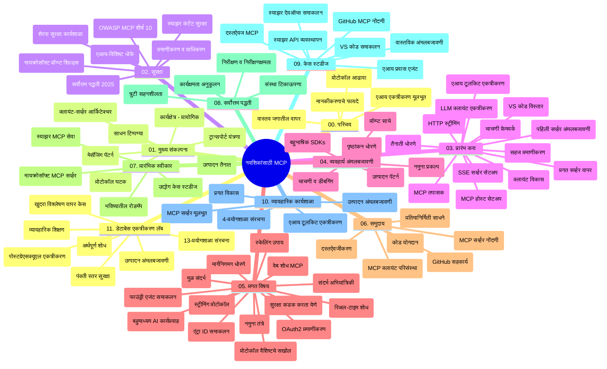

# नवशिकषांसाठी मॉडेल कॉन्टेक्स्ट प्रोटोकॉल (MCP) - अभ्यास मार्गदर्शिका

ही अभ्यास मार्गदर्शिका "नवशिकषांसाठी मॉडेल कॉन्टेक्स्ट प्रोटोकॉल (MCP)" अभ्यासक्रमासाठी रेपॉझिटरीची रचना आणि सामग्री याची माहिती देते. रेपॉझिटरी efficiently नेव्हिगेट करण्यासाठी आणि उपलब्ध संसाधनांचा पूर्णपणे लाभ घेण्यासाठी ही मार्गदर्शिका वापरा.

## रेपॉझिटरीचा आढावा

मॉडेल कॉन्टेक्स्ट प्रोटोकॉल (MCP) हा AI मॉडेल्स आणि क्लायंट ऍप्लिकेशन्समधील संवादासाठी एक मानकीकृत फ्रेमवर्क आहे. सुरुवातीला Anthropic द्वारा तयार करण्यात आलेले, MCP आता अधिक व्यापक MCP समुदायाद्वारे अधिकृत GitHub संघटनेमार्फत सांभाळले जाते. ही रेपॉझिटरी C#, Java, JavaScript, Python, आणि TypeScript मध्ये हाताळण्यायोग्य कोड उदाहरणांसह व्यापक अभ्यासक्रम प्रदान करते, जो AI विकसक, सिस्टिम आर्किटेक्ट्स, आणि सॉफ्टवेअर इंजिनियर्ससाठी डिझाइन केलेला आहे.

## दृश्य अभ्यासक्रम नकाशा

## रेपॉझिटरीची रचना

रेपॉझिटरी अकरा मुख्य विभागांमध्ये आयोजित केलेली आहे, प्रत्येक MCP च्या वेगवेगळ्या पैलूंवर लक्ष केंद्रित करते:

1. **परिचय (00-Introduction/)**
   - मॉडेल कॉन्टेक्स्ट प्रोटोकॉलचा आढावा
   - AI पाइपलाईन्समध्ये मानकीकरण का महत्वाचे आहे
   - व्यावहारिक वापर प्रकरणे आणि फायदे

2. **मूलभूत संकल्पना (01-CoreConcepts/)**
   - क्लायंट-सर्व्हर आर्किटेक्चर
   - मुख्य प्रोटोकॉल घटक
   - MCP मधील संदेश विनिमय नमुने

3. **सुरक्षा (02-Security/)**
   - MCP-आधारित सिस्टममधील सुरक्षा धोके
   - सुरक्षित अंमलबजावणीसाठी सर्वोत्तम पद्धती
   - प्रमाणीकरण आणि अधिकृतता रणनीती
   - **सर्वसमावेशक सुरक्षा दस्तऐवजीकरण**:
     - MCP सुरक्षा सर्वोत्तम पद्धती 2025
     - Azure कंटेंट सेफ्टी अंमलबजावणी मार्गदर्शक
     - MCP सुरक्षा नियंत्रण आणि तंत्र
     - MCP सर्वोत्तम पद्धती जलद संदर्भ
   - **महत्वाचे सुरक्षा विषय**:
     - प्रॉम्प्ट इंजेक्शन आणि टूल पॉयजनिंग हल्ले
     - सत्र हायजॅकिंग आणि गोंधळलेले डेप्युटी समस्या
     - टोकन पासथ्रू असुरक्षा
     - अत्यधिक परवानग्या आणि प्रवेश नियंत्रण
     - AI घटकांसाठी पुरवठा साखळी सुरक्षा
     - Microsoft प्रॉम्प्ट शील्ड्स एकत्रीकरण

4. **प्रारंभ करणे (03-GettingStarted/)**
   - वातावरण सेटअप आणि कॉन्फिगरेशन
   - मूलभूत MCP सर्व्हर आणि क्लायंट तयार करणे
   - विद्यमान अनुप्रयोगांसह समाकलन
   - या विभागात समाविष्ट आहेत:
     - पहिली सर्व्हर अंमलबजावणी
     - क्लायंट विकास
     - LLM क्लायंट समाकलन
     - VS Code समाकलन
     - सर्व्हर-सेंट इव्हेंट्स (SSE) सर्व्हर
     - प्रगत सर्व्हर वापर
     - HTTP स्ट्रीमिंग
     - AI टूलकिट समाकलन
     - परीक्षण रणनीती
     - तैनाती मार्गदर्शक सूचना

5. **व्यावहारिक अंमलबजावणी (04-PracticalImplementation/)**
   - विविध प्रोग्रामिंग भाषांमध्ये SDK वापरणे
   - डिबगिंग, परीक्षण, आणि प्रमाणीकरण तंत्र
   - पुन्हा वापरता येणाऱ्या प्रॉम्प्ट साच्यांची आणि कार्यप्रवाहांची निर्मिती
   - अंमलबजावणी उदाहरणांसह नमुना प्रकल्प

6. **प्रगत विषय (05-AdvancedTopics/)**
   - कॉन्टेक्स्ट अभियांत्रिकी तंत्र
   - फाउंड्री एजंट समाकलन
   - बहु-मॉडेल AI कार्यप्रवाह
   - OAuth2 प्रमाणीकरण डेमो
   - रिअल-टाइम शोध क्षमता
   - रिअल-टाइम स्ट्रीमिंग
   - मूळ कॉन्टेक्स्टची अंमलबजावणी
   - रूटिंग धोरणे
   - नमुना तंत्रे
   - स्केलिंग पद्धती
   - सुरक्षा विचार
   - Entra ID सुरक्षा समाकलन
   - वेब शोध समाकलन

7. **समुदायातील योगदान (06-CommunityContributions/)**
   - कोड आणि दस्तऐवजीकरण कसे योगदान द्यावे
   - GitHub द्वारे सहकार्य
   - समुदाय-चालित सुधारणा आणि अभिप्राय
   - विविध MCP क्लायंट वापरणे (Claude Desktop, Cline, VSCode)
   - इमेज जनरेशन सहित लोकप्रिय MCP सर्व्हरसोबत काम करणे

8. **लवकर अंगीकारानंतरचे धडे (07-LessonsfromEarlyAdoption/)**
   - रिअल-वर्ल्ड अंमलबजावणी आणि यशोगाथा
   - MCP-आधारित सोल्यूशन्सची निर्मिती व तैनाती
   - ट्रेंड्स आणि भविष्यातील रोडमॅप
   - **Microsoft MCP सर्व्हर मार्गदर्शक**: 10 उत्पादनासाठी तयार Microsoft MCP सर्व्हरचा सर्वसमावेशक मार्गदर्शक:
     - Microsoft Learn Docs MCP Server
     - Azure MCP Server (15+ विशेष कनेक्टर्स)
     - GitHub MCP Server
     - Azure DevOps MCP Server
     - MarkItDown MCP Server
     - SQL Server MCP Server
     - Playwright MCP Server
     - Dev Box MCP Server
     - Azure AI Foundry MCP Server
     - Microsoft 365 Agents Toolkit MCP Server

9. **सर्वोत्तम पद्धती (08-BestPractices/)**
   - कार्यक्षमता ट्यूनिंग आणि ऑप्टिमायझेशन
   - दोष-प्रतिरोधक MCP सिस्टम डिझाइन करणे
   - परीक्षण आणि लवचीकता रणनीती

10. **केस स्टडीज (09-CaseStudy/)**
    - **सात सर्वसमावेशक केस स्टडीज** जे MCP च्या विविध वापर प्रकरणांत क्षमता दर्शवितात:
    - **Azure AI ट्रॅव्हल एजंट्स**: Azure OpenAI आणि AI शोधासह बहु-एजंट आयोजितीकरण
    - **Azure DevOps समाकलन**: YouTube डेटावरून कार्यप्रवाह प्रक्रिया स्वयंचलित करणे
    - **रिअल-टाइम दस्तऐवजीकरण पुनर्प्राप्ती**: Python कन्सोल क्लायंटसह स्ट्रीमिंग HTTP
    - **इंटरॅक्टिव्ह अभ्यास योजना जनरेटर**: Chainlit वेब अॅपसह संवादात्मक AI
    - **इन-एडिटर दस्तऐवजीकरण**: VS Code आणि GitHub Copilot कार्यप्रवाह
    - **Azure API व्यवस्थापन**: एंटरप्राइझ API समाकलन आणि MCP सर्व्हर निर्मिती
    - **GitHub MCP रेजिस्ट्री**: पर्यावरण विकास आणि एजंटिक समाकलन प्लॅटफॉर्म
    - एंटरप्राइझ समाकलन, विकसक उत्पादकता, आणि पर्यावरण विकासासह अंमलबजावणी उदाहरणे

11. **हाताळणी कार्यशाळा (10-StreamliningAIWorkflowsBuildingAnMCPServerWithAIToolkit/)**
    - MCP व AI टूलकिट एकत्र करून सर्वसमावेशक हाताळणी कार्यशाळा
    - AI मॉडेल्स व रिअल-वर्ल्ड साधने जोडणाऱ्या बुद्धिमान अनुप्रयोगांची निर्मिती
    - मूलभूत, कस्टम सर्व्हर विकास, आणि उत्पादन तैनाती रणनीतींसह व्यावहारिक मॉड्यूल्स
    - **प्रयोगशाळा रचना**:
      - प्रयोगशाळा 1: MCP सर्व्हर मूलभूत गोष्टी
      - प्रयोगशाळा 2: प्रगत MCP सर्व्हर विकास
      - प्रयोगशाळा 3: AI टूलकिट समाकलन
      - प्रयोगशाळा 4: उत्पादन तैनाती आणि स्केलिंग
    - पायरी-दर-पायरी मार्गदर्शनासह प्रयोगशाळा-आधारित शिक्षण पद्धत

12. **MCP सर्व्हर डेटाबेस समाकलन प्रयोगशाळा (11-MCPServerHandsOnLabs/)**
    - PostgreSQL समाकलनासह उत्पादनासाठी तयार MCP सर्व्हर्स तयार करण्यासाठी **13-प्रयोगशाळांचा संपूर्ण शिक्षण मार्ग**
    - Zava Retail वापर प्रकरणासह प्रत्यक्ष किरकोळ विश्लेषण अंमलबजावणी
    - एंटरप्राइझ-ग्रेड पॅटर्न्स ज्यात Row Level Security (RLS), सैमान्य शोध (semantic search), आणि मल्टि-टेनंट डेटा प्रवेश यांचा समावेश
    - **पूर्ण प्रयोगशाळा रचना**:
      - **प्रयोगशाळा 00-03: पाया** - परिचय, आर्किटेक्चर, सुरक्षा, वातावरण सेटअप
      - **प्रयोगशाळा 04-06: MCP सर्व्हर बांधणी** - डेटाबेस डिझाइन, MCP सर्व्हर अंमलबजावणी, टूल विकास
      - **प्रयोगशाळा 07-09: प्रगत वैशिष्ट्ये** - सैमान्य शोध, परीक्षण व डिबगिंग, VS Code समाकलन
      - **प्रयोगशाळा 10-12: उत्पादन व सर्वोत्तम पद्धती** - तैनाती, देखरेख, ऑप्टिमायझेशन
    - **सांभाळलेले तंत्रज्ञान**: FastMCP फ्रेमवर्क, PostgreSQL, Azure OpenAI, Azure कंटेनर अॅप्स, अॅप्लिकेशन इनसाइट्स
    - **अर्जित परिणाम**: उत्पादनासाठी तयार MCP सर्व्हर्स, डेटाबेस समाकलन पॅटर्न्स, AI-चालित विश्लेषणे, एंटरप्राइझ सुरक्षा

## अतिरिक्त संसाधने

रेपॉझिटरीमध्ये समर्थनार्थ संसाधने आहेत:

- **प्रतिमा फोल्डर**: अभ्यासक्रमात वापरल्या जाणाऱ्या आकृत्या आणि चित्रे
- **भाषांतर**: दस्तऐवजीकरणाचे ऑटोमेटेड बहुभाषिक भाषांतर
- **अधिकृत MCP संसाधने**:
  - [MCP Documentation](https://modelcontextprotocol.io/)
  - [MCP Specification](https://spec.modelcontextprotocol.io/)
  - [MCP GitHub Repository](https://github.com/modelcontextprotocol)

## ही रेपॉझिटरी कशी वापरावी

1. **क्रमशः शिक्षण**: क्रमाने (00 ते 11) विभागांचे अनुसरण करा जेणेकरून रचना केलेले शिक्षण मिळेल.
2. **भाषानुसार लक्ष केंद्रित करा**: जर तुम्हाला एखाद्या विशिष्ट प्रोग्रामिंग भाषेत रस असेल, तर योग्य भाषेतील अंमलबजावणीसाठी नमुना फोल्डर शोधा.
3. **व्यावहारिक अंमलबजावणी**: "प्रारंभ करणे" विभागातून सुरू करा, वातावरण सेट करा आणि तुमचा पहिला MCP सर्व्हर व क्लायंट तयार करा.
4. **प्रगत शोधन**: मूलभूत गोष्टी समजल्यावर प्रगत विषयांत प्रवेश करा आणि तुमचे ज्ञान वाढवा.
5. **समुदाय सहभाग**: GitHub चर्चा आणि Discord चॅनेल्सद्वारे MCP समुदायात सहभागी व्हा, तज्ञ आणि सहविकसकांसोबत कनेक्ट व्हा.

## MCP क्लायंट्स आणि टूल्स

अभ्यासक्रमात विविध MCP क्लायंट्स आणि टूल्स समाविष्ट आहेत:

1. **अधिकृत क्लायंट्स**:
   - Visual Studio Code
   - MCP in Visual Studio Code
   - Claude Desktop
   - Claude in VSCode
   - Claude API

2. **समुदायाचे क्लायंट्स**:
   - Cline (टर्मिनल-आधारित)
   - Cursor (कोड संपादक)
   - ChatMCP
   - Windsurf

3. **MCP व्यवस्थापन टूल्स**:
   - MCP CLI
   - MCP Manager
   - MCP Linker
   - MCP Router

## लोकप्रिय MCP सर्व्हर्स

रेपॉझिटरीमध्ये विविध MCP सर्व्हर्सची ओळख करून दिली आहे, ज्यात:

1. **अधिकृत Microsoft MCP सर्व्हर्स**:
   - Microsoft Learn Docs MCP Server
   - Azure MCP Server (15+ विशेष कनेक्टर्स)
   - GitHub MCP Server
   - Azure DevOps MCP Server
   - MarkItDown MCP Server
   - SQL Server MCP Server
   - Playwright MCP Server
   - Dev Box MCP Server
   - Azure AI Foundry MCP Server
   - Microsoft 365 Agents Toolkit MCP Server

2. **अधिकृत संदर्भ सर्व्हर्स**:
   - Filesystem
   - Fetch
   - Memory
   - Sequential Thinking

3. **प्रतिमा निर्मिती**:
   - Azure OpenAI DALL-E 3
   - Stable Diffusion WebUI
   - Replicate

4. **विकास टूल्स**:
   - Git MCP
   - Terminal Control
   - Code Assistant

5. **विशेषीकृत सर्व्हर्स**:
   - Salesforce
   - Microsoft Teams
   - Jira & Confluence

## योगदान देणे

या रेपॉझिटरीला समुदायाकडून योगदानाचे स्वागत आहे. MCP पर्यावरणात प्रभावी योगदान देण्यासाठी मार्गदर्शनासाठी समुदाय योगदान विभाग पहा.

----

*ही अभ्यास मार्गदर्शिका शेवटची अद्यतने ५ फेब्रुवारी २०२६ रोजी केली गेलेली आहे, ज्यात नवीनतम MCP Specification 2025-11-25 प्रतिबिंबित करते आणि त्या तारखेपर्यंत रेपॉझिटरीचा आढावा प्रदान करते. या तारखेपुरती रेपॉझिटरी सामग्री अद्यतनित केली जाऊ शकते.*

---

<!-- CO-OP TRANSLATOR DISCLAIMER START -->
**सर्वसाधारण सूचना**:
हा दस्तऐवज AI भाषांतर सेवा [Co-op Translator](https://github.com/Azure/co-op-translator) वापरून अनुवादित केला आहे. आम्ही अचूकतेसाठी प्रयत्न करतो, तरी कृपया लक्षात घ्या की स्वयंचलित भाषांतरांमध्ये चुका किंवा असमर्थता असू शकते. मूळ दस्तऐवज त्याच्या मूळ भाषेत अधिकृत स्रोत मानल्या पाहिजे. महत्त्वाच्या माहितीसाठी व्यावसायिक मानवी भाषांतर करणं शिफारस केली जाते. या भाषांतराच्या वापरामुळे उद्भवणाऱ्या कोणत्याही गैरसमजुती किंवा चुकीच्या अर्थाचा आम्ही जबाबदार नाही.
<!-- CO-OP TRANSLATOR DISCLAIMER END -->