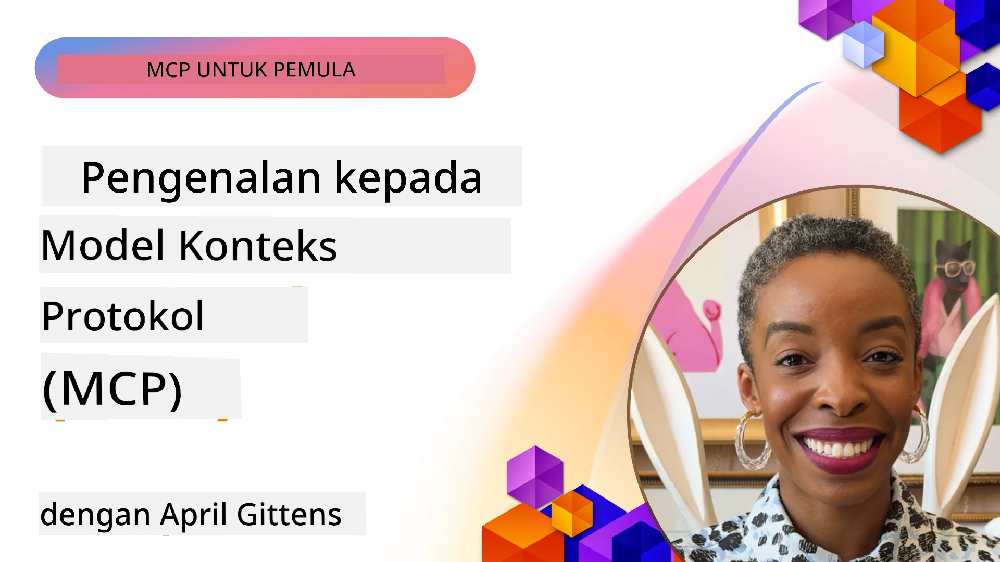
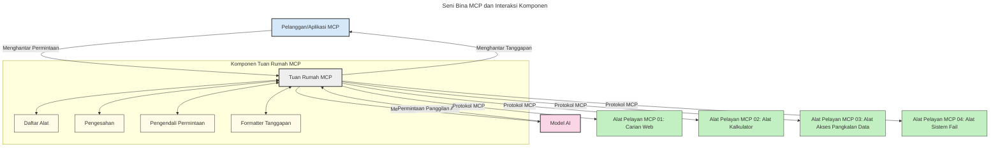

# Pengenalan kepada Protokol Konteks Model (MCP): Mengapa Ia Penting untuk Aplikasi AI Skala Besar

[](https://youtu.be/agBbdiOPLQA)

_(Klik pada imej di atas untuk menonton video pelajaran ini)_

Aplikasi AI generatif adalah satu perkembangan besar kerana ia selalunya membenarkan pengguna berinteraksi dengan aplikasi menggunakan arahan bahasa semula jadi. Namun, apabila lebih banyak masa dan sumber dilaburkan dalam aplikasi sedemikian, anda ingin memastikan anda boleh mengintegrasikan fungsi dan sumber dengan mudah supaya ia mudah dikembangkan, aplikasi anda boleh menyokong lebih dari satu model digunakan, dan mengendalikan pelbagai kerumitan model. Ringkasnya, membina aplikasi Gen AI mudah pada permulaan, tetapi apabila ia berkembang dan menjadi lebih kompleks, anda perlu mula menentukan seni bina dan kemungkinan anda perlu bergantung kepada standard untuk memastikan aplikasi anda dibina dengan cara yang konsisten. Di sinilah MCP datang untuk menyusun perkara dan menyediakan standard.

---

## **🔍 Apakah Protokol Konteks Model (MCP)?**

**Protokol Konteks Model (MCP)** adalah **antara muka terbuka dan standard** yang membenarkan Model Bahasa Besar (LLM) berinteraksi dengan lancar dengan alat luaran, API, dan sumber data. Ia menyediakan seni bina yang konsisten untuk meningkatkan fungsi model AI melampaui data latihan mereka, membolehkan sistem AI yang lebih pintar, boleh diskala, dan lebih responsif.

---

## **🎯 Mengapa Standardisasi dalam AI Penting**

Sebagai aplikasi AI generatif menjadi lebih kompleks, adalah penting untuk mengguna pakai standard yang memastikan **kebolehdaraban, keterluasan, penyelenggaraan,** dan **mengelakkan kekangan vendor**. MCP menangani keperluan ini dengan:

- Menyatukan integrasi model-alat
- Mengurangkan penyelesaian tersuai yang rapuh dan sekali guna
- Membolehkan pelbagai model dari vendor berbeza wujud dalam satu ekosistem

**Nota:** Walaupun MCP menggelarkan dirinya sebagai standard terbuka, tiada rancangan untuk menstandardkan MCP melalui badan standard sedia ada seperti IEEE, IETF, W3C, ISO, atau mana-mana badan standard lain.

---

## **📚 Objektif Pembelajaran**

Menjelang akhir artikel ini, anda akan dapat:

- Mentakrifkan **Protokol Konteks Model (MCP)** dan kes penggunaannya
- Memahami bagaimana MCP menstandardkan komunikasi model-ke-alat
- Mengenal pasti komponen teras seni bina MCP
- Meneroka aplikasi dunia nyata MCP dalam konteks perusahaan dan pembangunan

---

## **💡 Mengapa Protokol Konteks Model (MCP) Merupakan Pengubah Permainan**

### **🔗 MCP Menyelesaikan Pemecahan dalam Interaksi AI**

Sebelum MCP, integrasi model dengan alat memerlukan:

- Kod tersuai untuk setiap pasangan alat-model
- API tidak standard bagi setiap vendor
- Kerap gangguan akibat kemas kini
- Skalabiliti yang lemah dengan lebih banyak alat

### **✅ Manfaat Standardisasi MCP**

| **Manfaat**               | **Penerangan**                                                                 |
|---------------------------|--------------------------------------------------------------------------------|
| Kesenambungan             | LLM berfungsi dengan lancar bersama alat dari vendor berbeza                   |
| Konsistensi               | Tingkah laku seragam merentas platform dan alat                               |
| Kebolegunaan Semula       | Alat yang dibina sekali boleh digunakan merentas projek dan sistem            |
| Pembangunan Dipercepat    | Mengurangkan masa pembangunan dengan menggunakan antara muka standard dan plug-and-play |

---

## **🧱 Gambaran Keseluruhan Seni Bina MCP Tahap Tinggi**

MCP mengikuti model **pelanggan-pelayan**, di mana:

- **Hos MCP** menjalankan model AI
- **Klien MCP** memulakan permintaan
- **Pelayan MCP** menyampaikan konteks, alat, dan keupayaan

### **Komponen Utama:**

- **Sumber** – Data statik atau dinamik untuk model  
- **Arahan** – Alur kerja pradefinisi untuk penjanaan berpanduan  
- **Alat** – Fungsi boleh laksana seperti carian, pengiraan  
- **Pensampelan** – Tingkah laku agen melalui interaksi berulang
- **Elicitation** – Permintaan yang dimulakan pelayan untuk input pengguna
- **Roots** – Sempadan sistem fail untuk kawalan akses pelayan

### **Seni Bina Protokol:**

MCP menggunakan seni bina dua lapisan:
- **Lapisan Data**: Komunikasi berasaskan JSON-RPC 2.0 dengan pengurusan kitaran hayat dan primitif
- **Lapisan Pengangkutan**: STDIO (tempatan) dan HTTP boleh alir dengan SSE (jarak jauh) sebagai saluran komunikasi

---

## Bagaimana Pelayan MCP Berfungsi

Pelayan MCP beroperasi dengan cara berikut:

- **Aliran Permintaan**:
    1. Permintaan dimulakan oleh pengguna akhir atau perisian yang bertindak bagi pihak mereka.
    2. **Klien MCP** menghantar permintaan ke **Hos MCP**, yang menguruskan runtime Model AI.
    3. **Model AI** menerima arahan pengguna dan mungkin meminta akses ke alat luaran atau data melalui satu atau lebih panggilan alat.
    4. **Hos MCP**, bukan model secara langsung, berkomunikasi dengan **Pelayan MCP** yang sesuai menggunakan protokol standard.
- **Fungsi Hos MCP**:
    - **Daftar Alat**: Menyimpan katalog alat tersedia dan keupayaannya.
    - **Pengesahan**: Mengesahkan kebenaran untuk akses alat.
    - **Pengendali Permintaan**: Memproses permintaan alat masuk dari model.
    - **Pengaturbalik Respons**: Menstrukturkan output alat dalam format yang difahami model.
- **Pelaksanaan Pelayan MCP**:
    - **Hos MCP** menghala panggilan alat ke satu atau lebih **Pelayan MCP**, masing-masing mendedahkan fungsi khusus (contohnya, carian, pengiraan, kueri pangkalan data).
    - **Pelayan MCP** melaksanakan operasi mereka dan mengembalikan hasil kepada **Hos MCP** dalam format konsisten.
    - **Hos MCP** memformat dan menyampaikan hasil ini kepada **Model AI**.
- **Penyelesaian Respons**:
    - **Model AI** menggabungkan output alat ke dalam respons akhir.
    - **Hos MCP** menghantar respons ini balik ke **Klien MCP**, yang menyampaikannya kepada pengguna akhir atau perisian pemanggil.
    


## 👨‍💻 Cara Membina Pelayan MCP (Dengan Contoh)

Pelayan MCP membenarkan anda meluaskan keupayaan LLM dengan menyediakan data dan fungsi. 

Sedia untuk mencuba? Berikut adalah SDK khusus bahasa dan/atau tumpukan dengan contoh membuat pelayan MCP mudah dalam pelbagai bahasa/tumpukan:

- **Python SDK**: https://github.com/modelcontextprotocol/python-sdk

- **TypeScript SDK**: https://github.com/modelcontextprotocol/typescript-sdk

- **Java SDK**: https://github.com/modelcontextprotocol/java-sdk

- **C#/.NET SDK**: https://github.com/modelcontextprotocol/csharp-sdk


## 🌍 Kes Penggunaan Dunia Nyata untuk MCP

MCP membolehkan pelbagai aplikasi dengan meluaskan keupayaan AI:

| **Aplikasi**                | **Penerangan**                                                                 |
|-----------------------------|--------------------------------------------------------------------------------|
| Integrasi Data Perusahaan   | Sambungkan LLM ke pangkalan data, CRM, atau alat dalaman                        |
| Sistem AI Agenik            | Membolehkan ejen autonomi dengan akses alat dan alur kerja membuat keputusan   |
| Aplikasi Multi-modal        | Gabungkan teks, imej, dan alat audio dalam satu aplikasi AI bersatu            |
| Integrasi Data Masa Nyata   | Membawa data langsung ke interaksi AI untuk output yang lebih tepat dan terkini|


### 🧠 MCP = Standard Universal untuk Interaksi AI

Protokol Konteks Model (MCP) bertindak sebagai standard universal untuk interaksi AI, seperti bagaimana USB-C menstandardkan sambungan fizikal untuk peranti. Dalam dunia AI, MCP menyediakan antara muka konsisten, membolehkan model (klien) berintegrasi dengan lancar dengan alat luaran dan penyedia data (pelayan). Ini menghapuskan keperluan untuk pelbagai protokol tersuai untuk setiap API atau sumber data.

Di bawah MCP, alat yang serasi MCP (dirujuk sebagai pelayan MCP) mengikut satu standard bersatu. Pelayan ini boleh menyenaraikan alat atau tindakan yang mereka tawarkan dan melaksanakan tindakan tersebut apabila diminta oleh ejen AI. Platform ejen AI yang menyokong MCP mampu menemui alat tersedia dari pelayan dan memanggilnya melalui protokol standard ini.

### 💡 Memudahkan akses kepada pengetahuan

Selain menawarkan alat, MCP juga memudahkan akses kepada pengetahuan. Ia membolehkan aplikasi menyediakan konteks kepada model bahasa besar (LLM) dengan menghubungkannya ke pelbagai sumber data. Contohnya, pelayan MCP mungkin mewakili repositori dokumen sebuah syarikat, membolehkan ejen mendapatkan maklumat relevan atas permintaan. Pelayan lain boleh mengendalikan tindakan tertentu seperti menghantar emel atau mengemas kini rekod. Dari perspektif ejen, ini hanyalah alat yang boleh digunakan—beberapa alat mengembalikan data (konteks pengetahuan), manakala yang lain melakukan tindakan. MCP mengurus keduanya dengan cekap.

Ejen yang menyambung ke pelayan MCP secara automatik mempelajari keupayaan tersedia dan data yang boleh diakses melalui format standard. Standardisasi ini membolehkan ketersediaan alat secara dinamik. Contohnya, menambah pelayan MCP baru ke sistem ejen menjadikan fungsinya segera boleh digunakan tanpa memerlukan pengubahsuaian lanjut pada arahan ejen.

Integrasi yang lancar ini selaras dengan aliran yang digambarkan dalam rajah berikut, di mana pelayan menyediakan kedua-dua alat dan pengetahuan, memastikan kerjasama lancar merentas sistem. 

### 👉 Contoh: Penyelesaian Ejen Skala Besar

```mermaid
---
title: Penyelesaian Ejen Boleh Skala dengan MCP
description: Rajah yang menerangkan bagaimana pengguna berinteraksi dengan LLM yang disambungkan ke pelbagai pelayan MCP, dengan setiap pelayan menyediakan pengetahuan dan alat, mewujudkan seni bina sistem AI yang boleh diskalakan
---
graph TD
    User -->|Prompt| LLM
    LLM -->|Respons| User
    LLM -->|MCP| ServerA
    LLM -->|MCP| ServerB
    ServerA -->|Penyambung sejagat| ServerB
    ServerA --> KnowledgeA
    ServerA --> ToolsA
    ServerB --> KnowledgeB
    ServerB --> ToolsB

    subgraph Server A
        KnowledgeA[Pengetahuan]
        ToolsA[Alat]
    end

    subgraph Server B
        KnowledgeB[Pengetahuan]
        ToolsB[Alat]
    end
```Penghubung Universal membolehkan pelayan MCP berkomunikasi dan berkongsi keupayaan antara satu sama lain, membolehkan ServerA mendelegasikan tugasan kepada ServerB atau mengakses alat dan pengetahuannya. Ini mengfederasi alat dan data merentasi pelayan, menyokong seni bina ejen yang skala dan modular. Oleh kerana MCP menstandardkan pendedahan alat, ejen boleh menemui dan menghala permintaan antara pelayan secara dinamik tanpa integrasi keras kod.


Federasi alat dan pengetahuan: Alat dan data boleh diakses merentasi pelayan, membolehkan seni bina agen modular dan skala lebih besar.

### 🔄 Senario MCP Lanjutan dengan Integrasi LLM Sisi Klien

Selain seni bina asas MCP, terdapat senario lanjutan di mana kedua-dua klien dan pelayan mengandungi LLM, membolehkan interaksi yang lebih canggih. Dalam rajah berikut, **Aplikasi Klien** boleh menjadi IDE dengan beberapa alat MCP tersedia untuk digunakan oleh LLM:

```mermaid
---
title: Senario MCP Lanjutan dengan Integrasi LLM Pelanggan-Pelayan
description: Rajah urutan yang menunjukkan aliran interaksi terperinci antara pengguna, aplikasi pelanggan, LLM pelanggan, pelbagai pelayan MCP, dan LLM pelayan, menerangkan penemuan alat, interaksi pengguna, panggilan alat langsung, dan fasa perundingan ciri
---
sequenceDiagram
    autonumber
    actor User as 👤 Pengguna
    participant ClientApp as 🖥️ Aplikasi Pelanggan
    participant ClientLLM as 🧠 LLM Pelanggan
    participant Server1 as 🔧 Pelayan MCP 1
    participant Server2 as 📚 Pelayan MCP 2
    participant ServerLLM as 🤖 LLM Pelayan
    
    %% Discovery Phase
    rect rgb(220, 240, 255)
        Note over ClientApp, Server2: FASA PENEMUAN ALAT
        ClientApp->>+Server1: Minta alat/sumber yang tersedia
        Server1-->>-ClientApp: Pulangkan senarai alat (JSON)
        ClientApp->>+Server2: Minta alat/sumber yang tersedia
        Server2-->>-ClientApp: Pulangkan senarai alat (JSON)
        Note right of ClientApp: Simpan katalog alat<br/>gabungan secara tempatan
    end
    
    %% User Interaction
    rect rgb(255, 240, 220)
        Note over User, ClientLLM: FASA INTERAKSI PENGGUNA
        User->>+ClientApp: Masukkan arahan bahasa semula jadi
        ClientApp->>+ClientLLM: Hantar arahan + katalog alat
        ClientLLM->>-ClientLLM: Analisis arahan & pilih alat
    end
    
    %% Scenario A: Direct Tool Calling
    alt Panggilan Alat Langsung
        rect rgb(220, 255, 220)
            Note over ClientApp, Server1: SENARIO A: PANGGILAN ALAT LANGSUNG
            ClientLLM->>+ClientApp: Minta pelaksanaan alat
            ClientApp->>+Server1: Laksanakan alat tertentu
            Server1-->>-ClientApp: Pulangkan keputusan
            ClientApp->>+ClientLLM: Proses keputusan
            ClientLLM-->>-ClientApp: Hasilkan jawapan
            ClientApp-->>-User: Paparkan jawapan akhir
        end
    
    %% Scenario B: Feature Negotiation (VS Code style)
    else Perundingan Ciri (gaya VS Code)
        rect rgb(255, 220, 220)
            Note over ClientApp, ServerLLM: SENARIO B: PERUNDINGAN CIRI
            ClientLLM->>+ClientApp: Kenal pasti keupayaan diperlukan
            ClientApp->>+Server2: Runding ciri/keupayaan
            Server2->>+ServerLLM: Minta konteks tambahan
            ServerLLM-->>-Server2: Berikan konteks
            Server2-->>-ClientApp: Pulangkan ciri tersedia
            ClientApp->>+Server2: Panggil alat yang dirunding
            Server2-->>-ClientApp: Pulangkan keputusan
            ClientApp->>+ClientLLM: Proses keputusan
            ClientLLM-->>-ClientApp: Hasilkan jawapan
            ClientApp-->>-User: Paparkan jawapan akhir
        end
    end
```
## 🔐 Manfaat Praktikal MCP

Berikut adalah manfaat praktikal menggunakan MCP:

- **Kesegaran**: Model boleh mengakses maklumat terkini melampaui data latihan mereka
- **Perluasan Keupayaan**: Model boleh memanfaatkan alat khusus untuk tugas yang mereka tidak dilatih
- **Pengurangan Halusinasi**: Sumber data luaran menyediakan asas fakta
- **Privasi**: Data sensitif boleh kekal dalam persekitaran selamat dan tidak disematkan dalam arahan

## 📌 Perkara Penting

Berikut adalah perkara penting untuk menggunakan MCP:

- **MCP** menstandardkan cara model AI berinteraksi dengan alat dan data
- Menggalakkan **keterluasan, konsistensi, dan kesenambungan**
- MCP membantu **mengurangkan masa pembangunan, meningkatkan kebolehpercayaan, dan meluaskan keupayaan model**
- Seni bina pelanggan-pelayan **membolehkan aplikasi AI yang fleksibel dan boleh dikembangkan**

## 🧠 Latihan

Fikirkan tentang aplikasi AI yang anda berminat untuk bina.

- Alat atau data **luaran** apa yang boleh meningkatkan keupayaannya?
- Bagaimana MCP boleh menjadikan integrasi **lebih mudah dan boleh dipercayai?**

## Sumber Tambahan

- [Repositori MCP GitHub](https://github.com/modelcontextprotocol)


## Apa seterusnya

Seterusnya: [Bab 1: Konsep Teras](../01-CoreConcepts/README.md)

---

<!-- CO-OP TRANSLATOR DISCLAIMER START -->
**Penafian**:  
Dokumen ini telah diterjemahkan menggunakan perkhidmatan terjemahan AI [Co-op Translator](https://github.com/Azure/co-op-translator). Walaupun kami berusaha untuk ketepatan, harap maklum bahawa terjemahan automatik mungkin mengandungi kesilapan atau ketidaktepatan. Dokumen asal dalam bahasa asalnya hendaklah dianggap sebagai sumber yang sahih. Untuk maklumat penting, terjemahan oleh penterjemah profesional adalah disyorkan. Kami tidak bertanggungjawab atas sebarang salah faham atau salah tafsir yang timbul daripada penggunaan terjemahan ini.
<!-- CO-OP TRANSLATOR DISCLAIMER END -->