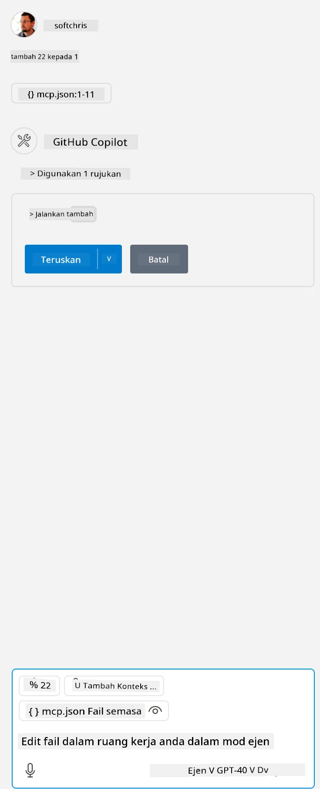

Ini bersamaan dengan menjalankan arahan seperti ini: `node build/index.js`.

- Tukar entri server ini supaya sesuai dengan lokasi fail server anda atau apa yang diperlukan untuk memulakan server anda bergantung pada runtime dan lokasi server yang anda pilih.

## Gunakan ciri-ciri dalam server

- Klik ikon `play`, setelah anda menambah *mcp.json* ke dalam folder *./vscode*,

    Perhatikan ikon alat berubah untuk menambah bilangan alat yang tersedia. Ikon alat terletak tepat di atas medan chat dalam GitHub Copilot.

## Jalankan alat

- Taip arahan dalam tetingkap chat anda yang sepadan dengan penerangan alat anda. Contohnya untuk mengaktifkan alat `add` taip sesuatu seperti "add 3 to 20".

    Anda sepatutnya melihat alat dipaparkan di atas kotak teks chat yang menunjukkan anda boleh memilih untuk menjalankan alat tersebut seperti dalam visual ini:

    

    Memilih alat tersebut sepatutnya menghasilkan keputusan nombor yang mengatakan "23" jika arahan anda seperti yang kami sebutkan sebelum ini.

**Penafian**:  
Dokumen ini telah diterjemahkan menggunakan perkhidmatan terjemahan AI [Co-op Translator](https://github.com/Azure/co-op-translator). Walaupun kami berusaha untuk ketepatan, sila ambil maklum bahawa terjemahan automatik mungkin mengandungi kesilapan atau ketidaktepatan. Dokumen asal dalam bahasa asalnya harus dianggap sebagai sumber yang sahih. Untuk maklumat penting, terjemahan profesional oleh manusia adalah disyorkan. Kami tidak bertanggungjawab atas sebarang salah faham atau salah tafsir yang timbul daripada penggunaan terjemahan ini.