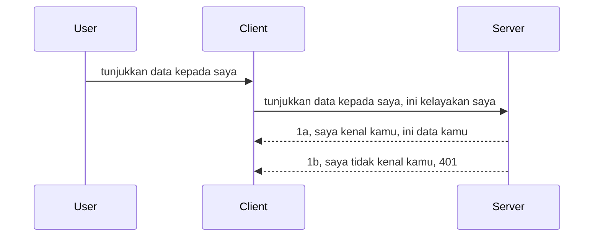

# Pengesahan mudah

SDK MCP menyokong penggunaan OAuth 2.1 yang sebenarnya adalah proses yang agak rumit melibatkan konsep seperti pelayan pengesahan, pelayan sumber, penghantaran kelayakan, mendapatkan kod, menukar kod untuk token pembawa sehingga anda akhirnya boleh mendapatkan data sumber anda. Jika anda tidak biasa dengan OAuth yang merupakan sesuatu yang baik untuk dilaksanakan, adalah idea yang baik untuk bermula dengan tahap asas pengesahan dan membina kepada keselamatan yang lebih baik dan lebih baik. Sebab itulah bab ini wujud, untuk membina anda kepada pengesahan yang lebih maju.

## Pengesahan, apa maksudnya?

Pengesahan adalah singkatan bagi pengesahan dan kebenaran. Idéanya adalah kita perlu melakukan dua perkara:

- **Pengesahan**, iaitu proses untuk mengetahui sama ada kita membenarkan seseorang memasuki rumah kita, bahawa mereka mempunyai hak untuk "di sini" iaitu mempunyai akses kepada pelayan sumber kita di mana ciri-ciri MCP Server hidup.
- **Kebenaran**, adalah proses mencari sama ada pengguna sepatutnya mempunyai akses kepada sumber tertentu yang mereka minta, sebagai contoh pesanan ini atau produk ini atau sama ada mereka dibenarkan membaca kandungan tetapi tidak memadam sebagai contoh lain.

## Kelayakan: bagaimana kita memberitahu sistem siapa kita

Baiklah, kebanyakan pembangun web mula berfikir dari segi menyediakan kelayakan kepada pelayan, biasanya rahsia yang mengatakan jika mereka dibenarkan berada di sini "Pengesahan". Kelayakan ini biasanya merupakan versi kod base64 bagi nama pengguna dan kata laluan atau kunci API yang mengecam pengguna tertentu secara unik.

Ini melibatkan penghantaran melalui header yang dipanggil "Authorization" seperti berikut:

```json
{ "Authorization": "secret123" }
```

Ini biasanya dirujuk sebagai pengesahan asas. Bagaimana aliran keseluruhannya berfungsi adalah seperti berikut:


Sekarang kita faham bagaimana ia berfungsi dari sudut aliran, bagaimana kita melaksanakannya? Baiklah, kebanyakan pelayan web mempunyai konsep yang dipanggil middleware, sepotong kod yang berjalan sebagai sebahagian daripada permintaan yang boleh mengesahkan kelayakan, dan jika kelayakan sah boleh membenarkan permintaan melepasi. Jika permintaan tidak mempunyai kelayakan sah maka anda akan mendapat ralat pengesahan. Mari kita lihat bagaimana ini boleh dilaksanakan:

**Python**

```python
class AuthMiddleware(BaseHTTPMiddleware):
    async def dispatch(self, request, call_next):

        has_header = request.headers.get("Authorization")
        if not has_header:
            print("-> Missing Authorization header!")
            return Response(status_code=401, content="Unauthorized")

        if not valid_token(has_header):
            print("-> Invalid token!")
            return Response(status_code=403, content="Forbidden")

        print("Valid token, proceeding...")
       
        response = await call_next(request)
        # tambah sebarang pengepala pelanggan atau buat perubahan dalam tindak balas dengan cara tertentu
        return response


starlette_app.add_middleware(CustomHeaderMiddleware)
```

Di sini kita ada:

- Membina middleware yang dipanggil `AuthMiddleware` di mana kaedah `dispatch`nya dipanggil oleh pelayan web.
- Menambah middleware kepada pelayan web:

    ```python
    starlette_app.add_middleware(AuthMiddleware)
    ```

- Menulis logik pengesahan yang memeriksa jika header Authorization wujud dan jika rahsia yang dihantar sah:

    ```python
    has_header = request.headers.get("Authorization")
    if not has_header:
        print("-> Missing Authorization header!")
        return Response(status_code=401, content="Unauthorized")

    if not valid_token(has_header):
        print("-> Invalid token!")
        return Response(status_code=403, content="Forbidden")
    ```

    jika rahsia wujud dan sah maka kita benarkan permintaan melepasi dengan memanggil `call_next` dan mengembalikan respons.

    ```python
    response = await call_next(request)
    # tambah sebarang tajuk pelanggan atau ubah dalam respons dengan cara tertentu
    return response
    ```

Cara ia berfungsi ialah jika permintaan web dibuat ke arah pelayan, middleware akan dipanggil dan dengan pelaksanaannya ia sama ada membenarkan permintaan melepasi atau akhirnya memberikan ralat yang menunjukkan klien tidak dibenarkan meneruskan.

**TypeScript**

Di sini kita cipta middleware dengan kerangka kerja popular Express dan mengganggu permintaan sebelum ia sampai ke MCP Server. Berikut adalah kod untuk itu:

```typescript
function isValid(secret) {
    return secret === "secret123";
}

app.use((req, res, next) => {
    // 1. Ada pengepala kebenaran?
    if(!req.headers["Authorization"]) {
        res.status(401).send('Unauthorized');
    }
    
    let token = req.headers["Authorization"];

    // 2. Semak kesahihan.
    if(!isValid(token)) {
        res.status(403).send('Forbidden');
    }

   
    console.log('Middleware executed');
    // 3. Hantar permintaan ke langkah seterusnya dalam saluran permintaan.
    next();
});
```

Dalam kod ini kita:

1. Semak jika header Authorization wujud, jika tidak, kita menghantar ralat 401.
2. Pastikan kelayakan/token sah, jika tidak, kita menghantar ralat 403.
3. Akhirnya meneruskan permintaan dalam saluran permintaan dan mengembalikan sumber yang diminta.

## Latihan: Laksanakan pengesahan

Mari kita ambil pengetahuan kita dan cuba melaksanakannya. Berikut adalah rancangan:

Pelayan

- Cipta pelayan web dan instans MCP.
- Laksanakan middleware untuk pelayan.

Klien

- Hantar permintaan web, dengan kelayakan, melalui header.

### -1- Cipta pelayan web dan instans MCP

Dalam langkah pertama kita, kita perlu mencipta instans pelayan web dan MCP Server.

**Python**

Di sini kita mencipta instans MCP server, mencipta aplikasi web starlette dan hoskan dengan uvicorn.

```python
# mencipta Pelayan MCP

app = FastMCP(
    name="MCP Resource Server",
    instructions="Resource Server that validates tokens via Authorization Server introspection",
    host=settings["host"],
    port=settings["port"],
    debug=True
)

# mencipta aplikasi web starlette
starlette_app = app.streamable_http_app()

# menyajikan aplikasi melalui uvicorn
async def run(starlette_app):
    import uvicorn
    config = uvicorn.Config(
            starlette_app,
            host=app.settings.host,
            port=app.settings.port,
            log_level=app.settings.log_level.lower(),
        )
    server = uvicorn.Server(config)
    await server.serve()

run(starlette_app)
```

Dalam kod ini kita:

- Cipta MCP Server.
- Bina aplikasi web starlette dari MCP Server, `app.streamable_http_app()`.
- Hos dan berikan aplikasi web menggunakan uvicorn `server.serve()`.

**TypeScript**

Di sini kita mencipta instans MCP Server.

```typescript
const server = new McpServer({
      name: "example-server",
      version: "1.0.0"
    });

    // ... menyediakan sumber pelayan, alat, dan arahan ...
```

Penciptaan MCP Server ini perlu berlaku dalam definisi laluan POST /mcp kita, jadi mari kita ambil kod di atas dan pindahkan seperti berikut:

```typescript
import express from "express";
import { randomUUID } from "node:crypto";
import { McpServer } from "@modelcontextprotocol/sdk/server/mcp.js";
import { StreamableHTTPServerTransport } from "@modelcontextprotocol/sdk/server/streamableHttp.js";
import { isInitializeRequest } from "@modelcontextprotocol/sdk/types.js"

const app = express();
app.use(express.json());

// Peta untuk menyimpan pengangkutan mengikut ID sesi
const transports: { [sessionId: string]: StreamableHTTPServerTransport } = {};

// Mengendalikan permintaan POST untuk komunikasi klien-ke-pelayan
app.post('/mcp', async (req, res) => {
  // Semak untuk ID sesi yang sedia ada
  const sessionId = req.headers['mcp-session-id'] as string | undefined;
  let transport: StreamableHTTPServerTransport;

  if (sessionId && transports[sessionId]) {
    // Guna semula pengangkutan yang sedia ada
    transport = transports[sessionId];
  } else if (!sessionId && isInitializeRequest(req.body)) {
    // Permintaan inisialisasi baru
    transport = new StreamableHTTPServerTransport({
      sessionIdGenerator: () => randomUUID(),
      onsessioninitialized: (sessionId) => {
        // Simpan pengangkutan mengikut ID sesi
        transports[sessionId] = transport;
      },
      // Perlindungan DNS rebinding dimatikan secara lalai untuk keserasian ke belakang. Jika anda menjalankan pelayan ini
      // secara tempatan, pastikan untuk menetapkan:
      // enableDnsRebindingProtection: true,
      // allowedHosts: ['127.0.0.1'],
    });

    // Bersihkan pengangkutan apabila ditutup
    transport.onclose = () => {
      if (transport.sessionId) {
        delete transports[transport.sessionId];
      }
    };
    const server = new McpServer({
      name: "example-server",
      version: "1.0.0"
    });

    // ... sediakan sumber pelayan, alat, dan arahan ...

    // Sambung ke pelayan MCP
    await server.connect(transport);
  } else {
    // Permintaan tidak sah
    res.status(400).json({
      jsonrpc: '2.0',
      error: {
        code: -32000,
        message: 'Bad Request: No valid session ID provided',
      },
      id: null,
    });
    return;
  }

  // Mengendalikan permintaan
  await transport.handleRequest(req, res, req.body);
});

// Pengendali boleh guna semula untuk permintaan GET dan DELETE
const handleSessionRequest = async (req: express.Request, res: express.Response) => {
  const sessionId = req.headers['mcp-session-id'] as string | undefined;
  if (!sessionId || !transports[sessionId]) {
    res.status(400).send('Invalid or missing session ID');
    return;
  }
  
  const transport = transports[sessionId];
  await transport.handleRequest(req, res);
};

// Mengendalikan permintaan GET untuk pemberitahuan pelayan-ke-klien melalui SSE
app.get('/mcp', handleSessionRequest);

// Mengendalikan permintaan DELETE untuk penamatan sesi
app.delete('/mcp', handleSessionRequest);

app.listen(3000);
```

Sekarang anda lihat bagaimana penciptaan MCP Server dipindahkan dalam `app.post("/mcp")`.

Mari kita teruskan ke langkah seterusnya mencipta middleware supaya kita boleh mengesahkan kelayakan yang masuk.

### -2- Laksanakan middleware untuk pelayan

Mari kita ke bahagian middleware seterusnya. Di sini kita akan mencipta middleware yang mencari kelayakan dalam header `Authorization` dan mengesahkannya. Jika boleh diterima maka permintaan akan bergerak untuk melakukan apa yang perlu (contohnya senaraikan alat, baca sumber atau apa-apa fungsi MCP yang klien minta).

**Python**

Untuk mencipta middleware, kita perlu mencipta kelas yang mewarisi dari `BaseHTTPMiddleware`. Ada dua bahagian menarik:

- Permintaan `request`, yang kita baca maklumat header daripadanya.
- `call_next` callback yang perlu kita panggil jika klien membawa kelayakan yang kita terima.

Mula-mula, kita perlu kendalikan kes jika header `Authorization` hilang:

```python
has_header = request.headers.get("Authorization")

# tiada pengepala, gagal dengan 401, jika tidak teruskan.
if not has_header:
    print("-> Missing Authorization header!")
    return Response(status_code=401, content="Unauthorized")
```

Di sini kita hantar mesej 401 tidak dibenarkan kerana klien gagal pengesahan.

Seterusnya, jika kelayakan dihantar, kita perlu periksa kesahihannya seperti berikut:

```python
 if not valid_token(has_header):
    print("-> Invalid token!")
    return Response(status_code=403, content="Forbidden")
```

Perhatikan bagaimana kita hantar mesej 403 dilarang di atas. Mari lihat middleware penuh di bawah yang melaksanakan semua yang kita sebutkan tadi:

```python
class AuthMiddleware(BaseHTTPMiddleware):
    async def dispatch(self, request, call_next):

        has_header = request.headers.get("Authorization")
        if not has_header:
            print("-> Missing Authorization header!")
            return Response(status_code=401, content="Unauthorized")

        if not valid_token(has_header):
            print("-> Invalid token!")
            return Response(status_code=403, content="Forbidden")

        print("Valid token, proceeding...")
        print(f"-> Received {request.method} {request.url}")
        response = await call_next(request)
        response.headers['Custom'] = 'Example'
        return response

```

Bagus, tapi bagaimana dengan fungsi `valid_token`? Ini di bawah:

```python
# JANGAN guna untuk produksi - perbaikannya !!
def valid_token(token: str) -> bool:
    # buang prefix "Bearer "
    if token.startswith("Bearer "):
        token = token[7:]
        return token == "secret-token"
    return False
```

Ini sudah tentu perlu diperbaiki.

PENTING: Anda tidak seharusnya pernah meletakkan rahsia seperti ini dalam kod. Anda sebaik-baiknya perlu mendapatkan nilai untuk dibandingkan dari sumber data atau dari IDP (penyedia perkhidmatan identiti) atau lebih baik biarkan IDP melakukan pengesahan.

**TypeScript**

Untuk melaksanakan ini dengan Express, kita perlu panggil kaedah `use` yang mengambil fungsi middleware.

Kita perlu:

- Berinteraksi dengan pemboleh ubah permintaan untuk memeriksa kelayakan yang dihantar dalam properti `Authorization`.
- Sahkan kelayakan, dan jika betul biarkan permintaan diteruskan dan biarkan permintaan MCP klien melakukan apa yang patut (contohnya senaraikan alat, baca sumber atau apapun yang berkaitan dengan MCP).

Di sini, kita semak jika header `Authorization` wujud dan jika tidak, kita hentikan permintaan daripada diteruskan:

```typescript
if(!req.headers["authorization"]) {
    res.status(401).send('Unauthorized');
    return;
}
```

Jika header tidak dihantar pada mulanya, anda mendapat 401.

Seterusnya, kita periksa jika kelayakan sah, jika tidak kita sekali lagi hentikan permintaan tapi dengan mesej berbeza sedikit:

```typescript
if(!isValid(token)) {
    res.status(403).send('Forbidden');
    return;
} 
```

Perhatikan sekarang anda dapat ralat 403.

Ini adalah kod penuh:

```typescript
app.use((req, res, next) => {
    console.log('Request received:', req.method, req.url, req.headers);
    console.log('Headers:', req.headers["authorization"]);
    if(!req.headers["authorization"]) {
        res.status(401).send('Unauthorized');
        return;
    }
    
    let token = req.headers["authorization"];

    if(!isValid(token)) {
        res.status(403).send('Forbidden');
        return;
    }  

    console.log('Middleware executed');
    next();
});
```

Kita telah tetapkan pelayan web untuk menerima middleware yang memeriksa kelayakan yang klien harapnya hantarkan kepada kita. Bagaimana pula dengan klien itu sendiri?

### -3- Hantar permintaan web dengan kelayakan melalui header

Kita perlu pastikan klien menghantar kelayakan melalui header. Oleh kerana kita akan menggunakan klien MCP untuk berbuat demikian, kita perlu tahu bagaimana ia dilakukan.

**Python**

Untuk klien, kita perlu hantar header dengan kelayakan seperti berikut:

```python
# JANGAN tetapkan nilai secara keras, simpan sekurang-kurangnya dalam pembolehubah persekitaran atau storan yang lebih selamat
token = "secret-token"

async with streamablehttp_client(
        url = f"http://localhost:{port}/mcp",
        headers = {"Authorization": f"Bearer {token}"}
    ) as (
        read_stream,
        write_stream,
        session_callback,
    ):
        async with ClientSession(
            read_stream,
            write_stream
        ) as session:
            await session.initialize()
      
            # TODO, apa yang anda mahu dilakukan di klien, contohnya senaraikan alat, panggil alat dan sebagainya.
```

Perhatikan bagaimana kita isi properti `headers` seperti ini ` headers = {"Authorization": f"Bearer {token}"}`.

**TypeScript**

Kita boleh selesaikan ini dalam dua langkah:

1. Isi objek konfigurasi dengan kelayakan kita.
2. Hantar objek konfigurasi kepada transport.

```typescript

// JANGAN keras kodkan nilai seperti yang ditunjukkan di sini. Sekurang-kurangnya jadikan ia sebagai pembolehubah persekitaran dan gunakan sesuatu seperti dotenv (dalam mod pembangunan).
let token = "secret123"

// tentukan objek pilihan pengangkutan klien
let options: StreamableHTTPClientTransportOptions = {
  sessionId: sessionId,
  requestInit: {
    headers: {
      "Authorization": "secret123"
    }
  }
};

// hantar objek pilihan kepada pengangkutan
async function main() {
   const transport = new StreamableHTTPClientTransport(
      new URL(serverUrl),
      options
   );
```

Di sini anda lihat di atas bagaimana kita perlu cipta objek `options` dan letakkan header kita di bawah properti `requestInit`.

PENTING: Bagaimana kita perbaiki dari sini? Baiklah, pelaksanaan sekarang ada beberapa masalah. Pertama, menghantar kelayakan seperti ini agak berisiko kecuali anda sekurang-kurangnya ada HTTPS. Walaupun begitu, kelayakan boleh dicuri jadi anda perlukan sistem di mana anda boleh cabut semula token dengan mudah dan menambah semakan tambahan seperti dari mana di dunia ia datang, adakah permintaan berlaku terlalu kerap (tingkah laku bot), pendek kata, ada banyak kebimbangan.

Namun harus dikatakan, untuk API yang sangat mudah di mana anda tidak mahu sesiapa memanggil API anda tanpa pengesahan dan apa yang kita ada di sini adalah permulaan yang baik.

Dengan itu, mari kita cuba menguatkan keselamatan sedikit dengan menggunakan format standard seperti JSON Web Token, juga dikenali sebagai JWT atau token "JOT".

## JSON Web Tokens, JWT

Jadi, kita cuba memperbaiki perkara daripada menghantar kelayakan yang sangat mudah. Apakah peningkatan segera yang kita dapat apabila mengguna JWT?

- **Peningkatan keselamatan**. Dalam pengesahan asas, anda hantar nama pengguna dan kata laluan sebagai token kod base64 (atau anda hantar kunci API) berulang kali yang meningkatkan risiko. Dengan JWT, anda hantar nama pengguna dan kata laluan dan dapatkan token sebagai balasan dan ia juga terikat masa bermakna ia akan tamat tempoh. JWT membolehkan anda menggunakan kawalan akses terperinci menggunakan peranan, skop dan kebenaran dengan mudah.
- **Tanpa status dan kebolehsesuaian**. JWT adalah sendiri, ia membawa semua maklumat pengguna dan menghapuskan keperluan penyimpanan sesi di pelayan. Token juga boleh disahkan secara tempatan.
- **Interoperabiliti dan persekutuan**. JWT adalah pusat Open ID Connect dan digunakan dengan penyedia identiti terkenal seperti Entra ID, Google Identity dan Auth0. Ia juga membolehkan penggunaan log masuk tunggal dan banyak lagi menjadikannya kelas perusahaan.
- **Modulariti dan kelenturan**. JWT juga boleh digunakan dengan API Gateway seperti Azure API Management, NGINX dan lain-lain. Ia juga menyokong senario pengesahan pengguna dan komunikasi pelayan-ke-perkhidmatan termasuk penyamaran dan delegasi.
- **Prestasi dan cache**. JWT boleh dicache selepas didekod yang mengurangkan keperluan untuk parsing. Ini membantu terutamanya dengan aplikasi trafik tinggi kerana ia meningkatkan aliran dan mengurangkan beban infrastruktur pilihan anda.
- **Ciri-ciri lanjutan**. Ia juga menyokong introspeksi (memeriksa kesahihan di pelayan) dan pencabutan (menjadikan token tidak sah).

Dengan semua manfaat ini, mari kita lihat bagaimana kita boleh bawa pelaksanaan kita ke tahap seterusnya.

## Menukar pengesahan asas ke JWT

Jadi, perubahan yang kita perlu lakukan secara garis besar adalah:

- **Belajar membina token JWT** dan sediakan ia untuk dihantar daripada klien ke pelayan.
- **Mengesahkan token JWT**, dan jika sah, biarkan klien mempunyai sumber kita.
- **Menyimpan token dengan selamat**. Bagaimana kita menyimpan token ini.
- **Melindungi laluan**. Kita perlu melindungi laluan, dalam kes kita, kita perlu melindungi laluan dan ciri MCP tertentu.
- **Tambah token segar semula**. Pastikan kita cipta token yang berjangka pendek tetapi token segar semula yang berjangka panjang boleh digunakan untuk mendapatkan token baru jika ia tamat tempoh. Juga pastikan ada titik akhir segar semula dan strategi putaran.

### -1- Membina token JWT

Pertama sekali, token JWT ada bahagian berikut:

- **header**, algoritma yang digunakan dan jenis token.
- **payload**, klaim, seperti sub (pengguna atau entiti yang token wakili. Dalam senario pengesahan biasanya id pengguna), exp (bila ia tamat tempoh) role (peranan)
- **signature**, ditandatangani dengan rahsia atau kunci peribadi.

Untuk ini, kita perlu bina header, payload dan token berkod.

**Python**

```python

import jwt
import jwt
from jwt.exceptions import ExpiredSignatureError, InvalidTokenError
import datetime

# Kunci rahsia yang digunakan untuk menandatangani JWT
secret_key = 'your-secret-key'

header = {
    "alg": "HS256",
    "typ": "JWT"
}

# maklumat pengguna dan tuntutan serta masa tamat tempohnya
payload = {
    "sub": "1234567890",               # Subjek (ID pengguna)
    "name": "User Userson",                # Tuntutan tersuai
    "admin": True,                     # Tuntutan tersuai
    "iat": datetime.datetime.utcnow(),# Dikeluarkan pada
    "exp": datetime.datetime.utcnow() + datetime.timedelta(hours=1)  # Tamat tempoh
}

# kodkan ia
encoded_jwt = jwt.encode(payload, secret_key, algorithm="HS256", headers=header)
```

Dalam kod di atas kita telah:

- Mentakrif header menggunakan HS256 sebagai algoritma dan jenis sebagai JWT.
- Membina payload yang mengandungi subjek atau id pengguna, nama pengguna, peranan, bila ia dikeluarkan dan bila ia dijangka tamat tempoh dengan itu melaksanakan aspek terikat masa yang kita sebut sebelumnya.

**TypeScript**

Di sini kita akan perlukan beberapa kebergantungan yang akan membantu kita membina token JWT.

Kebergantungan

```sh

npm install jsonwebtoken
npm install --save-dev @types/jsonwebtoken
```

Sekarang kita ada itu, mari cipta header, payload dan melalui itu cipta token berkod.

```typescript
import jwt from 'jsonwebtoken';

const secretKey = 'your-secret-key'; // Guna pembolehubah persekitaran dalam pengeluaran

// Tentukan muatan
const payload = {
  sub: '1234567890',
  name: 'User usersson',
  admin: true,
  iat: Math.floor(Date.now() / 1000), // Dikeluarkan pada
  exp: Math.floor(Date.now() / 1000) + 60 * 60 // Tamat dalam 1 jam
};

// Tentukan pengepala (pilihan, jsonwebtoken menetapkan lalai)
const header = {
  alg: 'HS256',
  typ: 'JWT'
};

// Cipta token
const token = jwt.sign(payload, secretKey, {
  algorithm: 'HS256',
  header: header
});

console.log('JWT:', token);
```

Token ini:

Ditandatangani menggunakan HS256
Sah selama 1 jam
Termasuk klaim seperti sub, name, admin, iat, dan exp.

### -2- Mengesahkan token

Kita juga perlu mengesahkan token, ini sesuatu yang perlu kita buat di pelayan untuk pastikan apa yang klien hantar kepada kita adalah sah. Ada banyak semakan yang perlu dilakukan di sini dari mengesahkan struktur sehingga kesahihannya. Anda juga digalakkan menambah semakan lain untuk tengok jika pengguna memang ada dalam sistem kita dan lain-lain.

Untuk mengesahkan token, kita perlu menyahkodnya supaya kita boleh membacanya dan kemudian mula memeriksa kesahihannya:

**Python**

```python

# Nyahkod dan sahkan JWT
try:
    decoded = jwt.decode(token, secret_key, algorithms=["HS256"])
    print("✅ Token is valid.")
    print("Decoded claims:")
    for key, value in decoded.items():
        print(f"  {key}: {value}")
except ExpiredSignatureError:
    print("❌ Token has expired.")
except InvalidTokenError as e:
    print(f"❌ Invalid token: {e}")

```

Dalam kod ini, kita panggil `jwt.decode` menggunakan token, kunci rahsia dan algoritma yang dipilih sebagai input. Perhatikan bagaimana kita gunakan konstruk try-catch kerana kegagalan pengesahan menyebabkan ralat dinaikkan.

**TypeScript**

Di sini kita perlu panggil `jwt.verify` untuk mendapatkan versi token yang sudah disahkod yang boleh kita analisis selanjutnya. Jika panggilan ini gagal, itu bermakna struktur token tidak betul atau ia sudah tidak sah.

```typescript

try {
  const decoded = jwt.verify(token, secretKey);
  console.log('Decoded Payload:', decoded);
} catch (err) {
  console.error('Token verification failed:', err);
}
```

CATATAN: seperti disebut sebelumnya, kita perlu melaksanakan semakan tambahan untuk pastikan token ini menunjukkan pengguna dalam sistem kita dan pastikan pengguna mempunyai hak yang ia dakwakan.
Seterusnya, mari kita lihat kawalan akses berasaskan peranan, juga dikenali sebagai RBAC.

## Menambah kawalan akses berasaskan peranan

Idenya adalah kita mahu menyatakan bahawa peranan yang berbeza mempunyai kebenaran yang berbeza. Contohnya, kita menganggap seorang pentadbir boleh melakukan segala-galanya dan pengguna biasa boleh membaca/menulis serta tetamu hanya boleh membaca sahaja. Oleh itu, berikut adalah beberapa tahap kebenaran yang mungkin:

- Admin.Write
- User.Read
- Guest.Read

Mari kita lihat bagaimana kita boleh melaksanakan kawalan sedemikian dengan middleware. Middleware boleh ditambah bagi setiap laluan serta untuk semua laluan.

**Python**

```python
from starlette.middleware.base import BaseHTTPMiddleware
from starlette.responses import JSONResponse
import jwt

# JANGAN letakkan rahsia dalam kod seperti ini, ini hanya untuk tujuan demonstrasi. Bacanya dari tempat yang selamat.
SECRET_KEY = "your-secret-key" # letakkan ini dalam pembolehubah persekitaran
REQUIRED_PERMISSION = "User.Read"

class JWTPermissionMiddleware(BaseHTTPMiddleware):
    async def dispatch(self, request, call_next):
        auth_header = request.headers.get("Authorization")
        if not auth_header or not auth_header.startswith("Bearer "):
            return JSONResponse({"error": "Missing or invalid Authorization header"}, status_code=401)

        token = auth_header.split(" ")[1]
        try:
            decoded = jwt.decode(token, SECRET_KEY, algorithms=["HS256"])
        except jwt.ExpiredSignatureError:
            return JSONResponse({"error": "Token expired"}, status_code=401)
        except jwt.InvalidTokenError:
            return JSONResponse({"error": "Invalid token"}, status_code=401)

        permissions = decoded.get("permissions", [])
        if REQUIRED_PERMISSION not in permissions:
            return JSONResponse({"error": "Permission denied"}, status_code=403)

        request.state.user = decoded
        return await call_next(request)


```

Terdapat beberapa cara berbeza untuk menambah middleware seperti berikut:

```python

# Alt 1: tambah middleware semasa membina aplikasi starlette
middleware = [
    Middleware(JWTPermissionMiddleware)
]

app = Starlette(routes=routes, middleware=middleware)

# Alt 2: tambah middleware selepas aplikasi starlette sudah dibina
starlette_app.add_middleware(JWTPermissionMiddleware)

# Alt 3: tambah middleware bagi setiap laluan
routes = [
    Route(
        "/mcp",
        endpoint=..., # pengendali
        middleware=[Middleware(JWTPermissionMiddleware)]
    )
]
```

**TypeScript**

Kita boleh menggunakan `app.use` dan middleware yang akan dijalankan untuk semua permintaan.

```typescript
app.use((req, res, next) => {
    console.log('Request received:', req.method, req.url, req.headers);
    console.log('Headers:', req.headers["authorization"]);

    // 1. Periksa jika header kebenaran telah dihantar

    if(!req.headers["authorization"]) {
        res.status(401).send('Unauthorized');
        return;
    }
    
    let token = req.headers["authorization"];

    // 2. Periksa jika token adalah sah
    if(!isValid(token)) {
        res.status(403).send('Forbidden');
        return;
    }  

    // 3. Periksa jika pengguna token wujud dalam sistem kami
    if(!isExistingUser(token)) {
        res.status(403).send('Forbidden');
        console.log("User does not exist");
        return;
    }
    console.log("User exists");

    // 4. Sahkan token mempunyai kebenaran yang betul
    if(!hasScopes(token, ["User.Read"])){
        res.status(403).send('Forbidden - insufficient scopes');
    }

    console.log("User has required scopes");

    console.log('Middleware executed');
    next();
});

```

Terdapat beberapa perkara yang kita boleh benarkan middleware kita lakukan dan middleware KITA PERLU lakukan, iaitu:

1. Periksa sama ada header kebenaran hadir
2. Periksa sama ada token sah, kita panggil `isValid` yang merupakan kaedah yang kita tulis untuk memeriksa integriti dan kesahihan token JWT.
3. Sahkan pengguna wujud dalam sistem kita, kita harus memeriksa ini.

   ```typescript
    // pengguna dalam DB
   const users = [
     "user1",
     "User usersson",
   ]

   function isExistingUser(token) {
     let decodedToken = verifyToken(token);

     // TODO, periksa jika pengguna wujud dalam DB
     return users.includes(decodedToken?.name || "");
   }
   ```

   Di atas, kita telah mencipta senarai `users` yang sangat mudah, yang sepatutnya berada dalam pangkalan data sudah tentu.

4. Selain itu, kita juga perlu memeriksa token mempunyai kebenaran yang betul.

   ```typescript
   if(!hasScopes(token, ["User.Read"])){
        res.status(403).send('Forbidden - insufficient scopes');
   }
   ```

   Dalam kod ini dari middleware, kita memeriksa bahawa token mengandungi kebenaran User.Read, jika tidak kita menghantar ralat 403. Berikut ialah kaedah pembantu `hasScopes`.

   ```typescript
   function hasScopes(scope: string, requiredScopes: string[]) {
     let decodedToken = verifyToken(scope);
    return requiredScopes.every(scope => decodedToken?.scopes.includes(scope));
  }
   ```

Have a think which additional checks you should be doing, but these are the absolute minimum of checks you should be doing.

Using Express as a web framework is a common choice. There are helpers library when you use JWT so you can write less code.

- `express-jwt`, helper library that provides a middleware that helps decode your token.
- `express-jwt-permissions`, this provides a middleware `guard` that helps check if a certain permission is on the token.

Here's what these libraries can look like when used:

```typescript
const express = require('express');
const jwt = require('express-jwt');
const guard = require('express-jwt-permissions')();

const app = express();
const secretKey = 'your-secret-key'; // put this in env variable

// Decode JWT and attach to req.user
app.use(jwt({ secret: secretKey, algorithms: ['HS256'] }));

// Check for User.Read permission
app.use(guard.check('User.Read'));

// multiple permissions
// app.use(guard.check(['User.Read', 'Admin.Access']));

app.get('/protected', (req, res) => {
  res.json({ message: `Welcome ${req.user.name}` });
});

// Error handler
app.use((err, req, res, next) => {
  if (err.code === 'permission_denied') {
    return res.status(403).send('Forbidden');
  }
  next(err);
});

```

Sekarang anda telah melihat bagaimana middleware boleh digunakan untuk pengesahan dan kebenaran, bagaimana pula dengan MCP, adakah ia mengubah cara kita melakukan pengesahan? Mari kita ketahui dalam bahagian seterusnya.

### -3- Tambah RBAC kepada MCP

Anda telah melihat setakat ini bagaimana anda boleh menambah RBAC melalui middleware, namun, untuk MCP tiada cara mudah untuk menambah RBAC bagi setiap ciri MCP, jadi apa yang kita lakukan? Baiklah, kita hanya perlu menambah kod seperti ini yang memeriksa dalam kes ini sama ada klien mempunyai hak untuk memanggil alat tertentu:

Anda mempunyai beberapa pilihan berbeza untuk mencapai RBAC mengikut ciri, berikut adalah beberapa:

- Tambah semakan bagi setiap alat, sumber, prompt di mana anda perlu memeriksa tahap kebenaran.

   **python**

   ```python
   @tool()
   def delete_product(id: int):
      try:
          check_permissions(role="Admin.Write", request)
      catch:
        pass # pelanggan gagal kebenaran, tingkatkan ralat kebenaran
   ```

   **typescript**

   ```typescript
   server.registerTool(
    "delete-product",
    {
      title: Delete a product",
      description: "Deletes a product",
      inputSchema: { id: z.number() }
    },
    async ({ id }) => {
      
      try {
        checkPermissions("Admin.Write", request);
        // buat, hantar id ke productService dan remote entry
      } catch(Exception e) {
        console.log("Authorization error, you're not allowed");  
      }

      return {
        content: [{ type: "text", text: `Deletected product with id ${id}` }]
      };
    }
   );
   ```


- Gunakan pendekatan pelayan lanjutan dan pengendali permintaan supaya anda dapat meminimumkan berapa banyak tempat yang anda perlu membuat semakan.

   **Python**

   ```python
   
   tool_permission = {
      "create_product": ["User.Write", "Admin.Write"],
      "delete_product": ["Admin.Write"]
   }

   def has_permission(user_permissions, required_permissions) -> bool:
      # user_permissions: senarai kebenaran yang pengguna ada
      # required_permissions: senarai kebenaran yang diperlukan untuk alat
      return any(perm in user_permissions for perm in required_permissions)

   @server.call_tool()
   async def handle_call_tool(
     name: str, arguments: dict[str, str] | None
   ) -> list[types.TextContent]:
    # Anggap request.user.permissions adalah senarai kebenaran untuk pengguna
     user_permissions = request.user.permissions
     required_permissions = tool_permission.get(name, [])
     if not has_permission(user_permissions, required_permissions):
        # Timpa ralat "Anda tidak mempunyai kebenaran untuk menggunakan alat {name}"
        raise Exception(f"You don't have permission to call tool {name}")
     # teruskan dan gunakan alat
     # ...
   ```   
   

   **TypeScript**

   ```typescript
   function hasPermission(userPermissions: string[], requiredPermissions: string[]): boolean {
       if (!Array.isArray(userPermissions) || !Array.isArray(requiredPermissions)) return false;
       // Pulangkan benar jika pengguna mempunyai sekurang-kurangnya satu kebenaran yang diperlukan
       
       return requiredPermissions.some(perm => userPermissions.includes(perm));
   }
  
   server.setRequestHandler(CallToolRequestSchema, async (request) => {
      const { params: { name } } = request;
  
      let permissions = request.user.permissions;
  
      if (!hasPermission(permissions, toolPermissions[name])) {
         return new Error(`You don't have permission to call ${name}`);
      }
  
      // teruskan..
   });
   ```

   Nota, anda perlu memastikan middleware anda menetapkan token yang telah disahkodkan pada sifat user permintaan supaya kod di atas menjadi mudah.

### Ringkasan

Kini setelah kita membincangkan bagaimana untuk menambah sokongan untuk RBAC secara umum dan khusus untuk MCP, sudah tiba masanya untuk mencuba melaksanakan keselamatan sendiri untuk memastikan anda faham konsep yang dibentangkan kepada anda.

## Tugasan 1: Bina pelayan mcp dan klien mcp menggunakan pengesahan asas

Di sini anda akan mengambil apa yang anda pelajari dari segi menghantar kelayakan melalui header.

## Penyelesaian 1

[Penyelesaian 1](./code/basic/README.md)

## Tugasan 2: Tingkatkan penyelesaian dari Tugasan 1 untuk menggunakan JWT

Ambil penyelesaian pertama tetapi kali ini, mari kita perbaiki.

Daripada menggunakan Basic Auth, mari kita gunakan JWT.

## Penyelesaian 2

[Penyelesaian 2](./solution/jwt-solution/README.md)

## Cabaran

Tambah RBAC bagi setiap alat seperti yang kami terangkan dalam bahagian "Tambah RBAC kepada MCP".

## Ringkasan

Anda diharapkan telah belajar banyak dalam bab ini, daripada tiada keselamatan langsung, keselamatan asas, sehingga JWT dan bagaimana ia boleh ditambah kepada MCP.

Kami telah membina asas yang kukuh dengan JWT tersuai, tetapi apabila kami berkembang, kami bergerak ke arah model identiti berasaskan piawaian. Mengguna pakai IdP seperti Entra atau Keycloak membolehkan kami memindahkan penerbitan token, pengesahan, dan pengurusan kitar hayat kepada platform yang dipercayai — membebaskan kami untuk memberi tumpuan kepada logik aplikasi dan pengalaman pengguna.

Untuk itu, kami mempunyai bab yang lebih [lanjutan mengenai Entra](../../05-AdvancedTopics/mcp-security-entra/README.md)

## Apa Seterusnya

- Seterusnya: [Menyiapkan Hos MCP](../12-mcp-hosts/README.md)

---

<!-- CO-OP TRANSLATOR DISCLAIMER START -->
**Penafian**:  
Dokumen ini telah diterjemahkan menggunakan perkhidmatan terjemahan AI [Co-op Translator](https://github.com/Azure/co-op-translator). Walaupun kami berusaha untuk mencapai ketepatan, sila maklum bahawa terjemahan automatik mungkin mengandungi kesilapan atau ketidaktepatan. Dokumen asal dalam bahasa asalnya harus dianggap sebagai sumber utama yang sahih. Untuk maklumat penting, disarankan menggunakan terjemahan profesional oleh manusia. Kami tidak bertanggungjawab atas sebarang salah faham atau salah tafsir yang timbul daripada penggunaan terjemahan ini.
<!-- CO-OP TRANSLATOR DISCLAIMER END -->