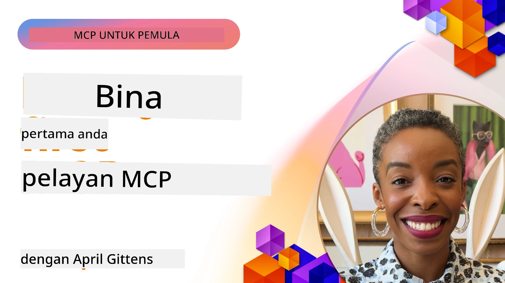

## Memulakan  

_(Klik imej di atas untuk melihat video pelajaran ini)_

Bahagian ini terdiri daripada beberapa pelajaran:

- **1 Pelayan pertama anda**, dalam pelajaran pertama ini, anda akan belajar cara membuat pelayan pertama anda dan memeriksanya dengan alat pemeriksa, cara yang berharga untuk menguji dan menyahpepijat pelayan anda, [ke pelajaran](01-first-server/README.md)

- **2 Pelanggan**, dalam pelajaran ini, anda akan belajar cara menulis pelanggan yang boleh menyambung ke pelayan anda, [ke pelajaran](02-client/README.md)

- **3 Pelanggan dengan LLM**, cara yang lebih baik menulis pelanggan adalah dengan menambah LLM supaya ia boleh "berunding" dengan pelayan anda tentang apa yang perlu dilakukan, [ke pelajaran](03-llm-client/README.md)

- **4 Menggunakan mod Agen GitHub Copilot pelayan dalam Visual Studio Code**. Di sini, kita melihat menjalankan Pelayan MCP kita dari dalam Visual Studio Code, [ke pelajaran](04-vscode/README.md)

- **5 Pelayan Pengangkutan stdio** pengangkutan stdio adalah piawaian yang disyorkan untuk komunikasi MCP pelayan-ke-pelanggan tempatan, menyediakan komunikasi berasaskan subproses yang selamat dengan pengasingan proses terbina dalam [ke pelajaran](05-stdio-server/README.md)

- **6 Penstriman HTTP dengan MCP (Streamable HTTP)**. Ketahui tentang pengangkutan penstriman HTTP moden (pendekatan yang disyorkan untuk pelayan MCP jauh menurut [Spesifikasi MCP 2025-11-25](https://spec.modelcontextprotocol.io/specification/2025-11-25/basic/transports/#streamable-http)), pemberitahuan kemajuan, dan cara melaksanakan pelayan dan pelanggan MCP masa nyata yang boleh diskala menggunakan Streamable HTTP. [ke pelajaran](06-http-streaming/README.md)

- **7 Menggunakan AI Toolkit untuk VSCode** untuk menggunakan dan menguji Pelanggan dan Pelayan MCP anda [ke pelajaran](07-aitk/README.md)

- **8 Pengujian**. Di sini kita akan menumpukan perhatian terutamanya pada bagaimana kita boleh menguji pelayan dan pelanggan kita dalam pelbagai cara, [ke pelajaran](08-testing/README.md)

- **9 Penyebaran**. Bab ini akan melihat pelbagai cara menyebarkan penyelesaian MCP anda, [ke pelajaran](09-deployment/README.md)

- **10 Penggunaan pelayan lanjutan**. Bab ini merangkumi penggunaan pelayan lanjutan, [ke pelajaran](./10-advanced/README.md)

- **11 Auth**. Bab ini merangkumi cara menambah pengesahan ringkas, dari Basic Auth ke penggunaan JWT dan RBAC. Anda digalakkan untuk bermula di sini dan kemudian melihat Topik Lanjutan dalam Bab 5 serta melakukan pengukuhan keselamatan tambahan melalui cadangan dalam Bab 2, [ke pelajaran](./11-simple-auth/README.md)

- **12 Hos MCP**. Konfigurasikan dan gunakan hos pelanggan MCP popular termasuk Claude Desktop, Cursor, Cline, dan Windsurf. Ketahui jenis pengangkutan dan cara menyelesaikan masalah, [ke pelajaran](./12-mcp-hosts/README.md)

- **13 Pemeriksa MCP**. Nyahpepijat dan uji pelayan MCP anda secara interaktif menggunakan alat Pemeriksa MCP. Pelajari cara menyelesaikan masalah alat, sumber, dan mesej protokol, [ke pelajaran](./13-mcp-inspector/README.md)

Protokol Konteks Model (MCP) adalah protokol terbuka yang menetapkan piawaian bagaimana aplikasi menyediakan konteks kepada LLM. Fikirkan MCP seperti port USB-C untuk aplikasi AI - ia menyediakan cara piawai untuk menyambungkan model AI ke pelbagai sumber data dan alat.

## Objektif Pembelajaran

Menjelang akhir pelajaran ini, anda akan dapat:

- Menyediakan persekitaran pembangunan untuk MCP dalam C#, Java, Python, TypeScript, dan JavaScript
- Membangun dan menyebarkan pelayan MCP asas dengan ciri tersuai (sumber, arahan, dan alat)
- Membuat aplikasi hos yang menyambung ke pelayan MCP
- Menguji dan menyahpepijat implementasi MCP
- Memahami cabaran penyediaan biasa dan penyelesaiannya
- Menyambungkan implementasi MCP anda ke perkhidmatan LLM yang popular

## Menyediakan Persekitaran MCP Anda

Sebelum anda mula bekerja dengan MCP, adalah penting untuk menyediakan persekitaran pembangunan anda dan memahami aliran kerja asas. Bahagian ini akan membimbing anda melalui langkah awal penyediaan untuk memastikan permulaan yang lancar dengan MCP.

### Prasyarat

Sebelum menyelami pembangunan MCP, pastikan anda mempunyai:

- **Persekitaran Pembangunan**: Untuk bahasa pilihan anda (C#, Java, Python, TypeScript, atau JavaScript)
- **IDE/Penyunting**: Visual Studio, Visual Studio Code, IntelliJ, Eclipse, PyCharm, atau mana-mana penyunting kod moden
- **Pengurus Pakej**: NuGet, Maven/Gradle, pip, atau npm/yarn
- **Kunci API**: Untuk mana-mana perkhidmatan AI yang anda rancangkan untuk digunakan dalam aplikasi hos anda

### SDK Rasmi

Dalam bab-bab akan datang anda akan melihat penyelesaian dibina menggunakan Python, TypeScript, Java dan .NET. Berikut adalah semua SDK yang disokong secara rasmi.

MCP menyediakan SDK rasmi untuk pelbagai bahasa (selaras dengan [Spesifikasi MCP 2025-11-25](https://spec.modelcontextprotocol.io/specification/2025-11-25/)):
- [SDK C#](https://github.com/modelcontextprotocol/csharp-sdk) - Diselenggara bersama Microsoft
- [SDK Java](https://github.com/modelcontextprotocol/java-sdk) - Diselenggara bersama Spring AI
- [SDK TypeScript](https://github.com/modelcontextprotocol/typescript-sdk) - Implementasi rasmi TypeScript
- [SDK Python](https://github.com/modelcontextprotocol/python-sdk) - Implementasi rasmi Python (FastMCP)
- [SDK Kotlin](https://github.com/modelcontextprotocol/kotlin-sdk) - Implementasi rasmi Kotlin
- [SDK Swift](https://github.com/modelcontextprotocol/swift-sdk) - Diselenggara bersama Loopwork AI
- [SDK Rust](https://github.com/modelcontextprotocol/rust-sdk) - Implementasi rasmi Rust
- [SDK Go](https://github.com/modelcontextprotocol/go-sdk) - Implementasi rasmi Go

## Perkara Penting

- Menyediakan persekitaran pembangunan MCP adalah mudah dengan SDK khusus bahasa
- Membina pelayan MCP melibatkan penciptaan dan pendaftaran alat dengan skema yang jelas
- Pelanggan MCP menyambung ke pelayan dan model untuk memanfaatkan keupayaan lanjutan
- Pengujian dan penyahpepijatan penting untuk implementasi MCP yang boleh dipercayai
- Pilihan penyebaran merangkumi pembangunan tempatan hingga penyelesaian berasaskan awan

## Amalan

Kami mempunyai set contoh yang melengkapkan latihan yang akan anda lihat dalam semua bab di bahagian ini. Selain itu setiap bab juga mempunyai latihan dan tugasan mereka sendiri

- [Kalkulator Java](./samples/java/calculator/README.md)
- [Kalkulator .Net](../../../03-GettingStarted/samples/csharp)
- [Kalkulator JavaScript](./samples/javascript/README.md)
- [Kalkulator TypeScript](./samples/typescript/README.md)
- [Kalkulator Python](../../../03-GettingStarted/samples/python)

## Sumber Tambahan

- [Membina Agen menggunakan Protokol Konteks Model di Azure](https://learn.microsoft.com/azure/developer/ai/intro-agents-mcp)
- [MCP Jauh dengan Azure Container Apps (Node.js/TypeScript/JavaScript)](https://learn.microsoft.com/samples/azure-samples/mcp-container-ts/mcp-container-ts/)
- [Agen OpenAI MCP .NET](https://learn.microsoft.com/samples/azure-samples/openai-mcp-agent-dotnet/openai-mcp-agent-dotnet/)

## Apa Seterusnya

Mula dengan pelajaran pertama: [Mencipta Pelayan MCP Pertama Anda](01-first-server/README.md)

Setelah anda menyelesaikan modul ini, teruskan ke: [Modul 4: Pelaksanaan Praktikal](../04-PracticalImplementation/README.md)

---

<!-- CO-OP TRANSLATOR DISCLAIMER START -->
**Penafian**:  
Dokumen ini telah diterjemahkan menggunakan perkhidmatan terjemahan AI [Co-op Translator](https://github.com/Azure/co-op-translator). Walaupun kami berusaha untuk ketepatan, sila maklum bahawa terjemahan automatik mungkin mengandungi kesilapan atau ketidaktepatan. Dokumen asal dalam bahasa asalnya hendaklah dianggap sebagai sumber yang sahih. Untuk maklumat yang kritikal, terjemahan profesional oleh manusia adalah disyorkan. Kami tidak bertanggungjawab atas sebarang salah faham atau salah tafsir yang timbul daripada penggunaan terjemahan ini.
<!-- CO-OP TRANSLATOR DISCLAIMER END -->