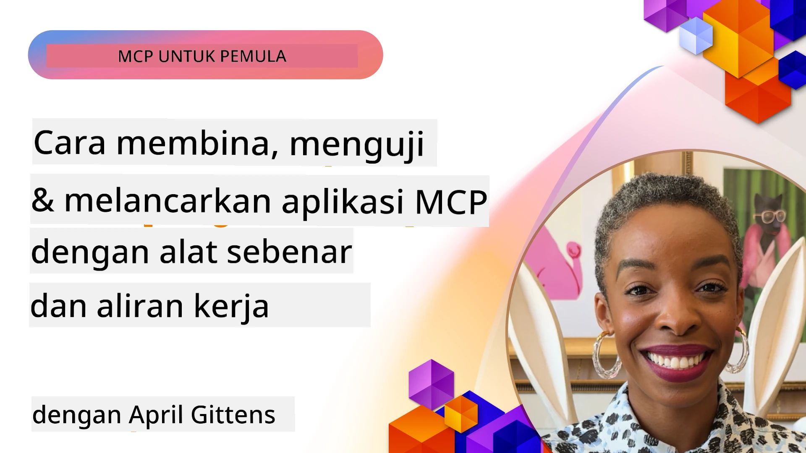
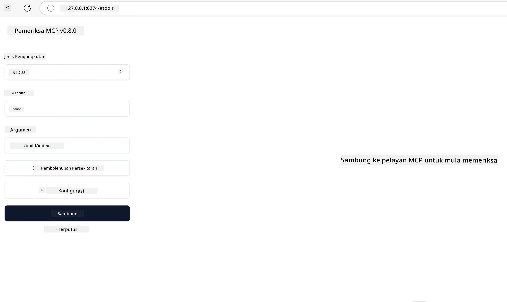

# Pelaksanaan Praktikal

[](https://youtu.be/vCN9-mKBDfQ)

_(Klik imej di atas untuk menonton video pelajaran ini)_

Pelaksanaan praktikal adalah di mana kekuatan Model Context Protocol (MCP) menjadi ketara. Walaupun memahami teori dan seni bina di sebalik MCP adalah penting, nilai sebenar muncul apabila anda menerapkan konsep ini untuk membina, menguji, dan mengedarkan penyelesaian yang menyelesaikan masalah dunia nyata. Bab ini menjembatani jurang antara pengetahuan konseptual dan pembangunan praktikal, membimbing anda melalui proses membawa aplikasi berasaskan MCP ke kehidupan sebenar.

Sama ada anda membangunkan pembantu pintar, mengintegrasikan AI ke dalam aliran kerja perniagaan, atau membina alat khusus untuk pemprosesan data, MCP menyediakan asas yang fleksibel. Reka bentuknya yang bebas bahasa dan SDK rasmi untuk bahasa pengaturcaraan popular membuatnya dapat diakses oleh pelbagai pembangun. Dengan memanfaatkan SDK ini, anda boleh dengan cepat membuat prototaip, mengulangi, dan menskala penyelesaian anda di pelbagai platform dan persekitaran.

Dalam seksyen berikut, anda akan menemui contoh praktikal, kod contoh, dan strategi pengedaran yang menunjukkan cara melaksanakan MCP dalam C#, Java dengan Spring, TypeScript, JavaScript, dan Python. Anda juga akan mempelajari cara menyahpepijat dan menguji pelayan MCP anda, menguruskan API, dan mengedarkan penyelesaian ke awan menggunakan Azure. Sumber praktikal ini direka untuk mempercepat pembelajaran anda dan membantu anda membina aplikasi MCP yang kukuh dan sedia produksi dengan yakin.

## Gambaran Keseluruhan

Pelajaran ini memberi tumpuan kepada aspek praktikal pelaksanaan MCP merentasi pelbagai bahasa pengaturcaraan. Kami akan meneroka cara menggunakan SDK MCP dalam C#, Java dengan Spring, TypeScript, JavaScript, dan Python untuk membina aplikasi yang kukuh, menyahpepijat dan menguji pelayan MCP, serta mencipta sumber, arahan (prompts), dan alat yang boleh digunakan semula.

## Objektif Pembelajaran

Menjelang akhir pelajaran ini, anda akan dapat:

- Melaksanakan penyelesaian MCP menggunakan SDK rasmi dalam pelbagai bahasa pengaturcaraan
- Menyahpepijat dan menguji pelayan MCP secara sistematik
- Mencipta dan menggunakan ciri pelayan (Sumber, Arahan, dan Alat)
- Mereka bentuk aliran kerja MCP yang berkesan untuk tugas kompleks
- Mengoptimumkan pelaksanaan MCP dari segi prestasi dan kebolehpercayaan

## Sumber SDK Rasmi

Model Context Protocol menawarkan SDK rasmi untuk pelbagai bahasa (selaras dengan [Spesifikasi MCP 2025-11-25](https://spec.modelcontextprotocol.io/specification/2025-11-25/)):

- [C# SDK](https://github.com/modelcontextprotocol/csharp-sdk)
- [Java dengan Spring SDK](https://github.com/modelcontextprotocol/java-sdk) **Nota:** memerlukan pergantungan pada [Project Reactor](https://projectreactor.io). (Lihat [isu perbincangan 246](https://github.com/orgs/modelcontextprotocol/discussions/246).)
- [TypeScript SDK](https://github.com/modelcontextprotocol/typescript-sdk)
- [Python SDK](https://github.com/modelcontextprotocol/python-sdk)
- [Kotlin SDK](https://github.com/modelcontextprotocol/kotlin-sdk)
- [Go SDK](https://github.com/modelcontextprotocol/go-sdk)

## Bekerja dengan SDK MCP

Bahagian ini menyediakan contoh praktikal pelaksanaan MCP merentasi pelbagai bahasa pengaturcaraan. Anda boleh mendapatkan kod contoh dalam direktori `samples` yang disusun mengikut bahasa.

### Sampel Tersedia

Repositori ini merangkumi [pelaksanaan sampel](../../../04-PracticalImplementation/samples) dalam bahasa berikut:

- [C#](./samples/csharp/README.md)
- [Java dengan Spring](./samples/java/containerapp/README.md)
- [TypeScript](./samples/typescript/README.md)
- [JavaScript](./samples/javascript/README.md)
- [Python](./samples/python/README.md)

Setiap sampel menunjukkan konsep utama MCP dan corak pelaksanaan untuk bahasa dan ekosistem tertentu.

### Panduan Praktikal

Panduan tambahan untuk pelaksanaan praktikal MCP:

- [Penomboran dan Set Keputusan Besar](./pagination/README.md) - Mengendalikan penomboran berasaskan kursor untuk alat, sumber, dan set data besar

## Ciri Teras Pelayan

Pelayan MCP boleh melaksanakan mana-mana gabungan ciri berikut:

### Sumber

Sumber menyediakan konteks dan data untuk digunakan oleh pengguna atau model AI:

- Repositori dokumen
- Pangkalan pengetahuan
- Sumber data berstruktur
- Sistem fail

### Arahan

Arahan ialah mesej templat dan aliran kerja untuk pengguna:

- Templat perbualan yang telah ditentukan
- Corak interaksi berpanduan
- Struktur dialog khusus

### Alat

Alat ialah fungsi untuk model AI laksanakan:

- Utiliti pemprosesan data
- Integrasi API luaran
- Kebolehan pengiraan
- Fungsi carian

## Pelaksanaan Sampel: Pelaksanaan C#

Repositori SDK rasmi C# mengandungi beberapa pelaksanaan sampel yang menunjukkan pelbagai aspek MCP:

- **Klien MCP Asas**: Contoh mudah menunjukkan cara membuat klien MCP dan memanggil alat
- **Pelayan MCP Asas**: Pelaksanaan pelayan minimum dengan pendaftaran alat asas
- **Pelayan MCP Lanjutan**: Pelayan dengan ciri lengkap, pendaftaran alat, pengesahan, dan pengendalian ralat
- **Integrasi ASP.NET**: Contoh menunjukkan integrasi dengan ASP.NET Core
- **Corak Pelaksanaan Alat**: Pelbagai corak untuk melaksanakan alat dengan tahap kerumitan berbeza

SDK MCP C# berada dalam pratonton dan API mungkin berubah. Kami akan sentiasa mengemas kini blog ini seiring evolusi SDK.

### Ciri Utama

- [ModelContextProtocol MCP C# Nuget](https://www.nuget.org/packages/ModelContextProtocol)
- Membangun [Pelayan MCP pertama anda](https://devblogs.microsoft.com/dotnet/build-a-model-context-protocol-mcp-server-in-csharp/).

Untuk sampel pelaksanaan C# lengkap, lawati [repositori sampel SDK C# rasmi](https://github.com/modelcontextprotocol/csharp-sdk)

## Pelaksanaan Sampel: Pelaksanaan Java dengan Spring

SDK Java dengan Spring menawarkan pilihan pelaksanaan MCP yang kukuh dengan ciri kelas perusahaan.

### Ciri Utama

- Integrasi Spring Framework
- Keselamatan jenis yang kukuh
- Sokongan pengaturcaraan reaktif
- Pengendalian ralat menyeluruh

Untuk sampel pelaksanaan Java dengan Spring lengkap, lihat [sampel Java dengan Spring](samples/java/containerapp/README.md) dalam direktori sampel.

## Pelaksanaan Sampel: Pelaksanaan JavaScript

SDK JavaScript menyediakan pendekatan ringan dan fleksibel untuk pelaksanaan MCP.

### Ciri Utama

- Sokongan Node.js dan pelayar
- API berasaskan janji (Promise)
- Integrasi mudah dengan Express dan rangka kerja lain
- Sokongan WebSocket untuk aliran data

Untuk sampel pelaksanaan JavaScript lengkap, lihat [sampel JavaScript](samples/javascript/README.md) dalam direktori sampel.

## Pelaksanaan Sampel: Pelaksanaan Python

SDK Python menawarkan pendekatan Pythonik untuk pelaksanaan MCP dengan integrasi rangka kerja ML yang cemerlang.

### Ciri Utama

- Sokongan async/await dengan asyncio
- Integrasi FastAPI``
- Pendaftaran alat mudah
- Integrasi asli dengan perpustakaan ML popular

Untuk sampel pelaksanaan Python lengkap, lihat [sampel Python](samples/python/README.md) dalam direktori sampel.

## Pengurusan API

Azure API Management adalah jawapan terbaik bagaimana kita boleh melindungi Pelayan MCP. Idea adalah untuk meletakkan satu instans Azure API Management di hadapan Pelayan MCP anda dan membiarkannya mengendalikan ciri yang mungkin anda mahukan seperti:

- had kadar
- pengurusan token
- pemantauan
- pengimbangan beban
- keselamatan

### Sampel Azure

Ini adalah Sampel Azure yang melakukan perkara itu, iaitu [mewujudkan Pelayan MCP dan melindunginya dengan Azure API Management](https://github.com/Azure-Samples/remote-mcp-apim-functions-python).

Lihat bagaimana aliran kebenaran berlaku dalam imej di bawah:


Dalam imej tersebut, perkara berikut berlaku:

- Pengesahan/Kebenaran berlaku menggunakan Microsoft Entra.
- Azure API Management bertindak sebagai pintu gerbang dan menggunakan polisi untuk mengarahkan dan mengurus trafik.
- Azure Monitor merekodkan semua permintaan untuk analisis lanjut.

#### Aliran kebenaran

Mari lihat aliran kebenaran dengan lebih terperinci:


#### Spesifikasi kebenaran MCP

Ketahui lebih lanjut tentang [spesifikasi Kebenaran MCP](https://spec.modelcontextprotocol.io/specification/2025-11-25/basic/authorization/)

## Mengedarkan Pelayan MCP Jauh ke Azure

Mari lihat jika kita boleh mengedarkan sampel yang disebut tadi:

1. Klon repositori

    ```bash
    git clone https://github.com/Azure-Samples/remote-mcp-apim-functions-python.git
    cd remote-mcp-apim-functions-python
    ```

1. Daftarkan penyedia sumber `Microsoft.App`.

   - Jika anda menggunakan Azure CLI, jalankan `az provider register --namespace Microsoft.App --wait`.
   - Jika anda menggunakan Azure PowerShell, jalankan `Register-AzResourceProvider -ProviderNamespace Microsoft.App`. Kemudian jalankan `(Get-AzResourceProvider -ProviderNamespace Microsoft.App).RegistrationState` selepas beberapa ketika untuk memeriksa sama ada pendaftaran selesai.

1. Jalankan arahan [azd](https://aka.ms/azd) ini untuk menyediakan perkhidmatan pengurusan API, aplikasi fungsi (bersama kod) dan semua sumber Azure lain yang diperlukan

    ```shell
    azd up
    ```

    Arahan ini sepatutnya mengedarkan semua sumber awan di Azure

### Menguji pelayan anda dengan MCP Inspector

1. Dalam **tetingkap terminal baru**, pasang dan jalankan MCP Inspector

    ```shell
    npx @modelcontextprotocol/inspector
    ```

    Anda sepatutnya melihat antaramuka serupa:

    

1. CTRL klik untuk memuatkan aplikasi web MCP Inspector dari URL yang dipaparkan oleh aplikasi (contoh [http://127.0.0.1:6274/#resources](http://127.0.0.1:6274/#resources))
1. Tetapkan jenis pengangkutan kepada `SSE`
1. Tetapkan URL kepada titik akhir SSE Pengurusan API yang sedang berjalan yang dipaparkan selepas `azd up` dan **Sambung**:

    ```shell
    https://<apim-servicename-from-azd-output>.azure-api.net/mcp/sse
    ```

1. **Senarai Alat**. Klik pada satu alat dan **Jalankan Alat**.

Jika semua langkah berjaya, anda kini harus disambungkan ke pelayan MCP dan dapat memanggil alat.

## Pelayan MCP untuk Azure

[Remote-mcp-functions](https://github.com/Azure-Samples/remote-mcp-functions-dotnet): Set repositori ini adalah templat permulaan pantas untuk membina dan mengedarkan pelayan MCP jauh khusus menggunakan Azure Functions dengan Python, C# .NET atau Node/TypeScript.

Sampel menyediakan penyelesaian lengkap yang membolehkan pembangun:

- Membina dan menjalankan secara tempatan: Membangun dan menyahpepijat pelayan MCP pada mesin tempatan
- Mengedarkan ke Azure: Mudah mengedarkan ke awan dengan arahan azd up yang ringkas
- Menyambung dari klien: Sambungkan ke pelayan MCP dari pelbagai klien termasuk mod ejen Copilot VS Code dan alat MCP Inspector

### Ciri Utama

- Keselamatan di reka bentuk: Pelayan MCP dilindungi menggunakan kunci dan HTTPS
- Pilihan pengesahan: Sokong OAuth menggunakan pengesahan terbina dalam dan/atau Pengurusan API
- Pengasingan rangkaian: Membenarkan pengasingan rangkaian menggunakan Azure Virtual Networks (VNET)
- Seni bina tanpa pelayan: Memanfaatkan Azure Functions untuk pelaksanaan berskala dan berasaskan acara
- Pembangunan tempatan: Sokongan pembangunan dan penyahpepijatan tempatan menyeluruh
- Pengedaran mudah: Proses pengedaran ke Azure yang dipermudahkan

Repositori ini merangkumi semua fail konfigurasi, kod sumber, dan definisi infrastruktur yang diperlukan untuk bermula dengan pelaksanaan pelayan MCP sedia produksi.

- [Azure Remote MCP Functions Python](https://github.com/Azure-Samples/remote-mcp-functions-python) - Pelaksanaan sampel MCP menggunakan Azure Functions dengan Python

- [Azure Remote MCP Functions .NET](https://github.com/Azure-Samples/remote-mcp-functions-dotnet) - Pelaksanaan sampel MCP menggunakan Azure Functions dengan C# .NET

- [Azure Remote MCP Functions Node/Typescript](https://github.com/Azure-Samples/remote-mcp-functions-typescript) - Pelaksanaan sampel MCP menggunakan Azure Functions dengan Node/TypeScript.

## Intipati Utama

- SDK MCP menyediakan alat khusus bahasa untuk melaksanakan penyelesaian MCP yang kukuh
- Proses penyahpepijatan dan pengujian adalah kritikal untuk aplikasi MCP yang boleh dipercayai
- Templat arahan boleh guna semula membolehkan interaksi AI yang konsisten
- Aliran kerja yang direka dengan baik dapat mengorkestrasi tugas kompleks menggunakan pelbagai alat
- Pelaksanaan penyelesaian MCP memerlukan pertimbangan keselamatan, prestasi, dan pengendalian ralat

## Latihan

Reka bentuk aliran kerja MCP praktikal yang menangani masalah dunia nyata dalam domain anda:

1. Kenal pasti 3-4 alat yang berguna untuk menyelesaikan masalah ini
2. Cipta rajah aliran kerja yang menunjukkan bagaimana alat ini berinteraksi
3. Laksanakan versi asas salah satu alat menggunakan bahasa pilihan anda
4. Cipta templat arahan yang membantu model menggunakan alat anda dengan berkesan

## Sumber Tambahan

---

## Apa Seterusnya

Seterusnya: [Topik Lanjutan](../05-AdvancedTopics/README.md)

---

<!-- CO-OP TRANSLATOR DISCLAIMER START -->
**Penafian**:
Dokumen ini telah diterjemahkan menggunakan perkhidmatan terjemahan AI [Co-op Translator](https://github.com/Azure/co-op-translator). Walaupun kami berusaha untuk ketepatan, sila ambil maklum bahawa terjemahan automatik mungkin mengandungi kesilapan atau ketidaktepatan. Dokumen asal dalam bahasa asalnya harus dianggap sebagai sumber yang sahih. Untuk maklumat penting, terjemahan profesional oleh manusia adalah disyorkan. Kami tidak bertanggungjawab atas sebarang salah faham atau salah tafsir yang timbul daripada penggunaan terjemahan ini.
<!-- CO-OP TRANSLATOR DISCLAIMER END -->