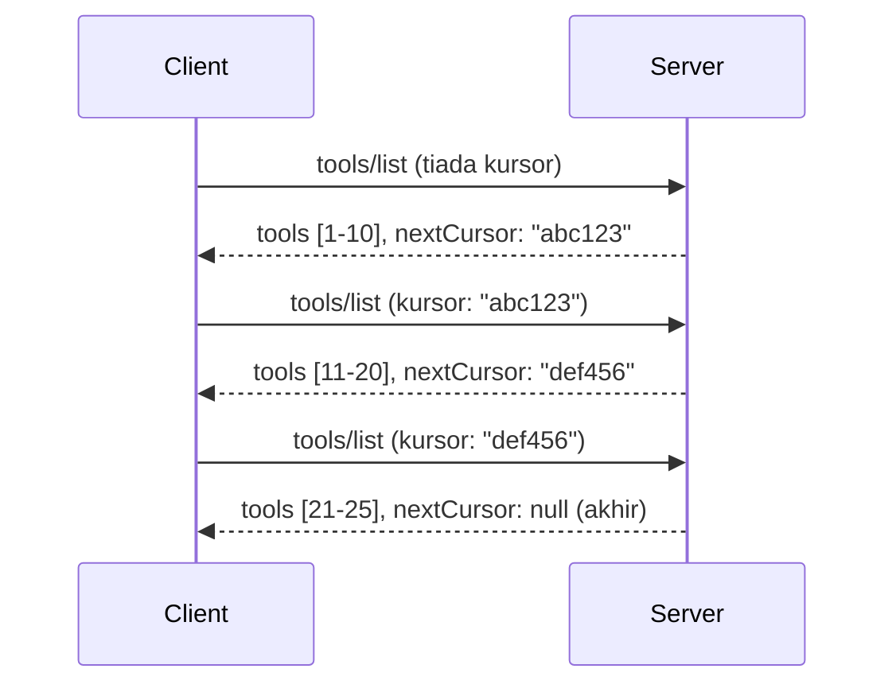

# Penomboran dan Set Keputusan Besar dalam MCP

Apabila pelayan MCP anda mengendalikan set data yang besar - sama ada menyenaraikan beribu-ribu fail, rekod pangkalan data, atau keputusan carian - anda memerlukan penomboran untuk mengurus memori secara cekap dan menyediakan pengalaman pengguna yang responsif. Panduan ini merangkumi cara melaksanakan dan menggunakan penomboran dalam MCP.

## Mengapa Penomboran Penting

Tanpa penomboran, maklum balas yang besar boleh menyebabkan:

- **Kekurangan memori** - Memuatkan jutaan rekod sekaligus
- **Masa tindak balas yang perlahan** - Pengguna menunggu semasa semua data dimuatkan
- **Ralat tamat masa** - Permintaan melebihi had tamat masa
- **Prestasi AI yang lemah** - LLM sukar mengendalikan konteks yang sangat besar

MCP menggunakan **penomboran berasaskan kursor** untuk penomboran yang boleh dipercayai dan konsisten melalui set keputusan.

---

## Bagaimana Penomboran MCP Berfungsi

### Konsep Kursor

Sebuah **kursor** ialah rentetan kabur yang menandakan kedudukan anda dalam set keputusan. Fikirkan ia seperti penanda buku dalam sebuah buku yang panjang.


### Penomboran dalam Kaedah MCP

Kaedah MCP berikut menyokong penomboran:

| Kaedah | Pulangan | Sokongan Kursor |
|--------|----------|-----------------|
| `tools/list` | Takrifan alat | ✅ |
| `resources/list` | Takrifan sumber | ✅ |
| `prompts/list` | Takrifan arahan | ✅ |
| `resources/templates/list` | Templat sumber | ✅ |

---

## Pelaksanaan Pelayan

### Python (FastMCP)

```python
from mcp.server import Server
from mcp.types import Tool, ListToolsResult
import math

app = Server("paginated-server")

# Set data besar yang disimulasikan
ALL_TOOLS = [
    Tool(name=f"tool_{i}", description=f"Tool number {i}", inputSchema={})
    for i in range(100)
]

PAGE_SIZE = 10

@app.list_tools()
async def list_tools(cursor: str | None = None) -> ListToolsResult:
    """List tools with pagination support."""
    
    # Nyahkod penuding untuk mendapatkan indeks permulaan
    start_index = 0
    if cursor:
        try:
            start_index = int(cursor)
        except ValueError:
            start_index = 0
    
    # Dapatkan halaman keputusan
    end_index = min(start_index + PAGE_SIZE, len(ALL_TOOLS))
    page_tools = ALL_TOOLS[start_index:end_index]
    
    # Kira penuding seterusnya
    next_cursor = None
    if end_index < len(ALL_TOOLS):
        next_cursor = str(end_index)
    
    return ListToolsResult(
        tools=page_tools,
        nextCursor=next_cursor
    )
```

### TypeScript

```typescript
import { Server } from "@modelcontextprotocol/sdk/server/index.js";
import { ListToolsResultSchema } from "@modelcontextprotocol/sdk/types.js";

const server = new Server({
  name: "paginated-server",
  version: "1.0.0"
});

// Set data besar yang disimulasikan
const ALL_TOOLS = Array.from({ length: 100 }, (_, i) => ({
  name: `tool_${i}`,
  description: `Tool number ${i}`,
  inputSchema: { type: "object", properties: {} }
}));

const PAGE_SIZE = 10;

server.setRequestHandler(ListToolsResultSchema, async (request) => {
  // Nyahkodkan kursor
  let startIndex = 0;
  if (request.params?.cursor) {
    startIndex = parseInt(request.params.cursor, 10) || 0;
  }
  
  // Dapatkan halaman keputusan
  const endIndex = Math.min(startIndex + PAGE_SIZE, ALL_TOOLS.length);
  const pageTools = ALL_TOOLS.slice(startIndex, endIndex);
  
  // Kira kursor seterusnya
  const nextCursor = endIndex < ALL_TOOLS.length ? String(endIndex) : undefined;
  
  return {
    tools: pageTools,
    nextCursor
  };
});
```

### Java (Spring MCP)

```java
@Service
public class PaginatedToolService {
    
    private static final int PAGE_SIZE = 10;
    private final List<Tool> allTools;
    
    public PaginatedToolService() {
        // Inisialisasi set data besar
        this.allTools = IntStream.range(0, 100)
            .mapToObj(i -> new Tool("tool_" + i, "Tool number " + i, Map.of()))
            .collect(Collectors.toList());
    }
    
    @McpMethod("tools/list")
    public ListToolsResult listTools(@Param("cursor") String cursor) {
        // Nyahkod kursor
        int startIndex = 0;
        if (cursor != null && !cursor.isEmpty()) {
            try {
                startIndex = Integer.parseInt(cursor);
            } catch (NumberFormatException e) {
                startIndex = 0;
            }
        }
        
        // Dapatkan halaman keputusan
        int endIndex = Math.min(startIndex + PAGE_SIZE, allTools.size());
        List<Tool> pageTools = allTools.subList(startIndex, endIndex);
        
        // Kira kursor seterusnya
        String nextCursor = endIndex < allTools.size() ? String.valueOf(endIndex) : null;
        
        return new ListToolsResult(pageTools, nextCursor);
    }
}
```

---

## Pelaksanaan Klien

### Klien Python

```python
from mcp import ClientSession

async def get_all_tools(session: ClientSession) -> list:
    """Fetch all tools using pagination."""
    all_tools = []
    cursor = None
    
    while True:
        result = await session.list_tools(cursor=cursor)
        all_tools.extend(result.tools)
        
        if result.nextCursor is None:
            break
        cursor = result.nextCursor
    
    return all_tools

# Penggunaan
async with client_session as session:
    tools = await get_all_tools(session)
    print(f"Found {len(tools)} tools")
```

### Klien TypeScript

```typescript
import { Client } from "@modelcontextprotocol/sdk/client/index.js";

async function getAllTools(client: Client): Promise<Tool[]> {
  const allTools: Tool[] = [];
  let cursor: string | undefined = undefined;
  
  do {
    const result = await client.listTools({ cursor });
    allTools.push(...result.tools);
    cursor = result.nextCursor;
  } while (cursor);
  
  return allTools;
}

// Penggunaan
const tools = await getAllTools(client);
console.log(`Found ${tools.length} tools`);
```

### Corak Pemuatan Malas

Untuk set data yang sangat besar, muatkan muka surat mengikut permintaan:

```python
class PaginatedToolIterator:
    """Lazily iterate through paginated tools."""
    
    def __init__(self, session: ClientSession):
        self.session = session
        self.cursor = None
        self.buffer = []
        self.exhausted = False
    
    async def __anext__(self):
        # Pulangkan dari penimbal jika ada
        if self.buffer:
            return self.buffer.pop(0)
        
        # Semak jika kita telah habiskan semua halaman
        if self.exhausted:
            raise StopAsyncIteration
        
        # Ambil halaman seterusnya
        result = await self.session.list_tools(cursor=self.cursor)
        self.buffer = list(result.tools)
        self.cursor = result.nextCursor
        
        if self.cursor is None:
            self.exhausted = True
        
        if not self.buffer:
            raise StopAsyncIteration
        
        return self.buffer.pop(0)
    
    def __aiter__(self):
        return self

# Penggunaan - cekap memori untuk set data besar
async for tool in PaginatedToolIterator(session):
    process_tool(tool)
```

---

## Penomboran untuk Sumber

Sumber sering memerlukan penomboran untuk direktori atau set data besar:

```python
from mcp.server import Server
from mcp.types import Resource, ListResourcesResult
import os

app = Server("file-server")

@app.list_resources()
async def list_resources(cursor: str | None = None) -> ListResourcesResult:
    """List files in directory with pagination."""
    
    directory = "/data/files"
    all_files = sorted(os.listdir(directory))
    
    # Nyahkod penunjuk (indeks fail)
    start_index = int(cursor) if cursor else 0
    page_size = 20
    end_index = min(start_index + page_size, len(all_files))
    
    # Cipta senarai sumber untuk halaman ini
    resources = []
    for filename in all_files[start_index:end_index]:
        filepath = os.path.join(directory, filename)
        resources.append(Resource(
            uri=f"file://{filepath}",
            name=filename,
            mimeType="application/octet-stream"
        ))
    
    # Kira penunjuk seterusnya
    next_cursor = str(end_index) if end_index < len(all_files) else None
    
    return ListResourcesResult(
        resources=resources,
        nextCursor=next_cursor
    )
```

---

## Strategi Reka Bentuk Kursor

### Strategi 1: Berasaskan Indeks (Ringkas)

```python
# Kursor hanyalah indeks
cursor = "50"  # Mula pada item 50
```

**Kelebihan:** Ringkas, tanpa keadaan  
**Kekurangan:** Keputusan boleh berubah jika item ditambah/dibuang

### Strategi 2: Berasaskan ID (Stabil)

```python
# Kursor adalah ID yang terakhir dilihat
cursor = "item_abc123"  # Mula selepas item ini
```

**Kelebihan:** Stabil walaupun item berubah  
**Kekurangan:** Memerlukan ID yang teratur

### Strategi 3: Keadaan Tersulitkan (Kompleks)

```python
import base64
import json

def encode_cursor(state: dict) -> str:
    return base64.b64encode(json.dumps(state).encode()).decode()

def decode_cursor(cursor: str) -> dict:
    return json.loads(base64.b64decode(cursor).decode())

# Penuding mengandungi berbilang medan status
cursor = encode_cursor({
    "offset": 50,
    "filter": "active",
    "sort": "name"
})
```

**Kelebihan:** Boleh menyulitkan keadaan yang kompleks  
**Kekurangan:** Lebih kompleks, rentetan kursor lebih besar

---

## Amalan Terbaik

### 1. Pilih Saiz Muka Surat yang Sesuai

```python
# Pertimbangkan saiz data
PAGE_SIZE_SMALL_ITEMS = 100   # Metadata mudah
PAGE_SIZE_MEDIUM_ITEMS = 20   # Objek yang lebih kaya
PAGE_SIZE_LARGE_ITEMS = 5     # Kandungan kompleks
```

### 2. Tangani Kursor Tidak Sah dengan Baik

```python
@app.list_tools()
async def list_tools(cursor: str | None = None) -> ListToolsResult:
    try:
        start_index = int(cursor) if cursor else 0
        if start_index < 0 or start_index >= len(ALL_TOOLS):
            start_index = 0  # Tetapkan semula ke permulaan
    except (ValueError, TypeError):
        start_index = 0  # Kursor tidak sah, mula semula
    # ...
```

### 3. Sertakan Jumlah Keseluruhan (Pilihan)

```python
return ListToolsResult(
    tools=page_tools,
    nextCursor=next_cursor,
    # Beberapa pelaksanaan termasuk jumlah untuk kemajuan UI
    _meta={"total": len(ALL_TOOLS)}
)
```

### 4. Uji Kes-kes Sempadan

```python
async def test_pagination():
    # Set hasil kosong
    result = await session.list_tools()
    assert result.tools == []
    assert result.nextCursor is None
    
    # Halaman tunggal
    result = await session.list_tools()
    assert len(result.tools) <= PAGE_SIZE
    
    # Penunjuk tidak sah
    result = await session.list_tools(cursor="invalid")
    assert result.tools  # Patut kembali halaman pertama
```

---

## Perangkap Biasa

### ❌ Memulangkan Semua Keputusan Kemudian Penomboran Di Pihak Klien

```python
# BURUK: Memuatkan semuanya ke dalam memori
@app.list_tools()
async def list_tools() -> ListToolsResult:
    all_tools = load_all_tools()  # 1 juta alat!
    return ListToolsResult(tools=all_tools)
```

### ✅ Penomboran di Sumber Data

```python
# BAIK: Hanya memuatkan apa yang diperlukan
@app.list_tools()
async def list_tools(cursor: str | None = None) -> ListToolsResult:
    offset = int(cursor) if cursor else 0
    tools = await db.query_tools(offset=offset, limit=PAGE_SIZE)
    return ListToolsResult(tools=tools, nextCursor=...)
```

---

## Apa Seterusnya

- [Modul 5.14 - Kejuruteraan Konteks](../../05-AdvancedTopics/mcp-contextengineering/README.md)
- [Modul 8 - Amalan Terbaik](../../08-BestPractices/README.md)
- [3.8 - Menguji Pelayan MCP Anda](../../03-GettingStarted/08-testing/README.md)

---

## Sumber Tambahan

- [Spesifikasi MCP - Penomboran](https://spec.modelcontextprotocol.io/specification/2025-11-25/)
- [Penjelasan Penomboran Berasaskan Kursor](https://slack.engineering/evolving-api-pagination-at-slack/)
- [Ujian penomboran SDK Python](https://github.com/modelcontextprotocol/python-sdk/blob/main/tests/client/test_list_methods_cursor.py)

---

<!-- CO-OP TRANSLATOR DISCLAIMER START -->
**Penafian**:  
Dokumen ini telah diterjemahkan menggunakan perkhidmatan terjemahan AI [Co-op Translator](https://github.com/Azure/co-op-translator). Walaupun kami berusaha untuk ketepatan, sila maklum bahawa terjemahan automatik mungkin mengandungi kesilapan atau ketidakakuratan. Dokumen asal dalam bahasa asalnya harus dianggap sebagai sumber yang sah. Untuk maklumat penting, disarankan menggunakan terjemahan profesional oleh manusia. Kami tidak bertanggungjawab terhadap sebarang salah faham atau tafsiran yang timbul daripada penggunaan terjemahan ini.
<!-- CO-OP TRANSLATOR DISCLAIMER END -->