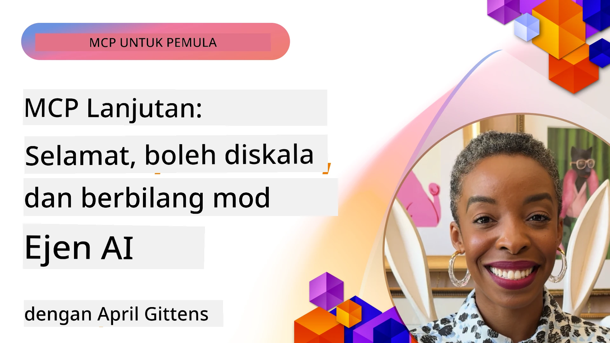

# Topik Lanjutan dalam MCP

_(Klik imej di atas untuk menonton video pelajaran ini)_

Bab ini merangkumi siri topik lanjutan dalam pelaksanaan Model Context Protocol (MCP), termasuk integrasi multi-modal, skalabiliti, amalan terbaik keselamatan, dan integrasi perusahaan. Topik-topik ini penting untuk membina aplikasi MCP yang kukuh dan sedia untuk pengeluaran yang dapat memenuhi tuntutan sistem AI moden.

## Gambaran Keseluruhan

Pelajaran ini meneroka konsep lanjutan dalam pelaksanaan Model Context Protocol, berfokus pada integrasi multi-modal, skalabiliti, amalan terbaik keselamatan, dan integrasi perusahaan. Topik-topik ini penting untuk membina aplikasi MCP gred produksi yang dapat mengendalikan keperluan kompleks dalam persekitaran perusahaan.

## Objektif Pembelajaran

Pada akhir pelajaran ini, anda akan dapat:

- Melaksanakan kebolehan multi-modal dalam rangka kerja MCP
- Mereka bentuk seni bina MCP yang skalabel untuk senario permintaan tinggi
- Mengaplikasi amalan terbaik keselamatan yang selaras dengan prinsip keselamatan MCP
- Mengintegrasikan MCP dengan sistem dan rangka kerja AI perusahaan
- Mengoptimumkan prestasi dan kebolehpercayaan dalam persekitaran produksi

## Pelajaran dan Projek contoh

| Pautan | Tajuk | Penerangan |
|------|-------|-------------|
| [5.1 Integrasi dengan Azure](./mcp-integration/README.md) | Integrasi dengan Azure | Pelajari cara mengintegrasi Server MCP anda di Azure |
| [5.2 Contoh multi modal](./mcp-multi-modality/README.md) | Contoh Multi modal MCP  | Contoh untuk audio, imej dan respons multi modal |
| [5.3 Contoh OAuth2 MCP](../../../05-AdvancedTopics/mcp-oauth2-demo) | Demo MCP OAuth2 | Aplikasi Spring Boot minimal menunjukkan OAuth2 dengan MCP, sebagai Authorization dan Resource Server. Memperlihatkan pengeluaran token yang selamat, titik akhir terlindung, pelaksanaan Azure Container Apps, dan integrasi Pengurusan API. |
| [5.4 Konteks Root](./mcp-root-contexts/README.md) | Konteks root  | Ketahui lebih lanjut tentang konteks root dan cara melaksanakannya |
| [5.5 Penjurusan](./mcp-routing/README.md) | Penjurusan | Pelajari jenis-jenis penjurusan yang berbeza |
| [5.6 Persampelan](./mcp-sampling/README.md) | Persampelan | Pelajari bagaimana bekerja dengan persampelan |
| [5.7 Penyesuaian Skala](./mcp-scaling/README.md) | Penyesuaian Skala  | Pelajari tentang penyesuaian skala |
| [5.8 Keselamatan](./mcp-security/README.md) | Keselamatan  | Amankan Server MCP anda |
| [5.9 Contoh Carian Web](./web-search-mcp/README.md) | Carian Web MCP | Pelayan dan klien MCP Python yang mengintegrasi dengan SerpAPI untuk carian web, berita, produk dan Q&A masa nyata. Memperlihatkan orkestrasi multi-alat, integrasi API luaran, dan pengendalian ralat yang kukuh. |
| [5.10 Penstriman Masa Nyata](./mcp-realtimestreaming/README.md) | Penstriman  | Penstriman data masa nyata telah menjadi penting dalam dunia berasaskan data hari ini, di mana perniagaan dan aplikasi memerlukan akses segera kepada maklumat untuk membuat keputusan tepat pada waktunya.|
| [5.11 Carian Web Masa Nyata](./mcp-realtimesearch/README.md) | Carian Web | Carian web masa nyata bagaimana MCP mengubah carian web masa nyata dengan menyediakan pendekatan standard untuk pengurusan konteks merentas model AI, enjin carian, dan aplikasi.| 
| [5.12 Pengesahan Entra ID bagi Pelayan Model Context Protocol](./mcp-security-entra/README.md) | Pengesahan Entra ID | Microsoft Entra ID menyediakan penyelesaian pengurusan identiti dan akses berasaskan awan yang mantap, membantu memastikan hanya pengguna dan aplikasi yang dibenarkan dapat berinteraksi dengan server MCP anda.|
| [5.13 Integrasi Ejen Azure AI Foundry](./mcp-foundry-agent-integration/README.md) | Integrasi Azure AI Foundry | Pelajari cara mengintegrasikan server Model Context Protocol dengan ejen Azure AI Foundry, membolehkan orkestrasi alat yang berkuasa dan kebolehan AI perusahaan dengan sambungan sumber data luaran yang standard.|
| [5.14 Kejuruteraan Konteks](./mcp-contextengineering/README.md) | Kejuruteraan Konteks | Peluang masa depan teknik kejuruteraan konteks untuk server MCP, termasuk pengoptimuman konteks, pengurusan konteks dinamik, dan strategi kejuruteraan arahan yang berkesan dalam rangka kerja MCP.|
| [5.15 Pengangkutan Tersuai MCP](./mcp-transport/README.md) | Pengangkutan Tersuai | Pelajari cara melaksanakan mekanisme pengangkutan tersuai untuk senario komunikasi MCP khas.|
| [5.16 Penyelaman Ciri Protokol](./mcp-protocol-features/README.md) | Ciri Protokol | Kuasai ciri protokol lanjutan termasuk pemberitahuan kemajuan, pembatalan permintaan, templat sumber, dan corak pengendalian ralat.|

> **Baru dalam Spesifikasi MCP 2025-11-25**: Spesifikasi kini termasuk sokongan eksperimental untuk **Tugas** (operasi jangka panjang dengan penjejakan kemajuan), **Anotasi Alat** (metadata tentang tingkah laku alat untuk keselamatan), **Pembentukan Mod URL** (meminta kandungan URL tertentu dari klien), dan **Roots** yang dipertingkatkan (untuk pengurusan konteks ruang kerja). Lihat [rekod perubahan Spesifikasi MCP](https://spec.modelcontextprotocol.io/) untuk maklumat penuh.

## Rujukan Tambahan

Untuk maklumat terkini mengenai topik lanjutan MCP, rujuk kepada:
- [Dokumentasi MCP](https://modelcontextprotocol.io/)
- [Spesifikasi MCP (2025-11-25)](https://spec.modelcontextprotocol.io/specification/2025-11-25/)
- [Repositori GitHub](https://github.com/modelcontextprotocol)
- [OWASP MCP Top 10](https://microsoft.github.io/mcp-azure-security-guide/mcp/) - Risiko keselamatan dan mitigasi
- [Bengkel Sidang Kemuncak Keselamatan MCP (Sherpa)](https://azure-samples.github.io/sherpa/) - Latihan keselamatan praktikal

## Perkara Penting

- Pelaksanaan MCP multi-modal memanjangkan kebolehan AI melebihi pemprosesan teks
- Skalabiliti penting untuk pelaksanaan perusahaan dan boleh ditangani melalui penyesuaian skala mendatar dan menegak
- Langkah keselamatan menyeluruh melindungi data dan memastikan kawalan akses yang betul
- Integrasi perusahaan dengan platform seperti Azure OpenAI dan Microsoft AI Foundry meningkatkan kebolehan MCP
- Pelaksanaan MCP lanjutan mendapat manfaat daripada seni bina yang dioptimumkan dan pengurusan sumber yang berhati-hati

## Latihan

Reka bentuk pelaksanaan MCP gred perusahaan untuk kes penggunaan tertentu:

1. Kenal pasti keperluan multi-modal untuk kes penggunaan anda
2. Gariskan kawalan keselamatan yang diperlukan untuk melindungi data sensitif
3. Reka bentuk seni bina yang skalabel yang dapat mengendalikan beban yang berubah-ubah
4. Rancang titik integrasi dengan sistem AI perusahaan
5. Dokumentasi potensi kesesakan prestasi dan strategi mitigasi

## Sumber Tambahan

- [Dokumentasi Azure OpenAI](https://learn.microsoft.com/en-us/azure/ai-services/openai/)
- [Dokumentasi Microsoft AI Foundry](https://learn.microsoft.com/en-us/ai-services/)

---

## Apa seterusnya

Terokai pelajaran dalam modul ini bermula dengan: [5.1 Integrasi MCP](./mcp-integration/README.md)

Setelah anda menamatkan modul ini, teruskan ke: [Modul 6: Sumbangan Komuniti](../06-CommunityContributions/README.md)

---

<!-- CO-OP TRANSLATOR DISCLAIMER START -->
**Penafian**:  
Dokumen ini telah diterjemahkan menggunakan perkhidmatan terjemahan AI [Co-op Translator](https://github.com/Azure/co-op-translator). Walaupun kami berusaha untuk mencapai ketepatan, sila ambil maklum bahawa terjemahan automatik mungkin mengandungi kesilapan atau ketidaktepatan. Dokumen asal dalam bahasa asalnya harus dianggap sebagai sumber yang sahih. Untuk maklumat kritikal, terjemahan profesional oleh manusia adalah disyorkan. Kami tidak bertanggungjawab terhadap sebarang salah faham atau salah tafsir yang timbul daripada penggunaan terjemahan ini.
<!-- CO-OP TRANSLATOR DISCLAIMER END -->