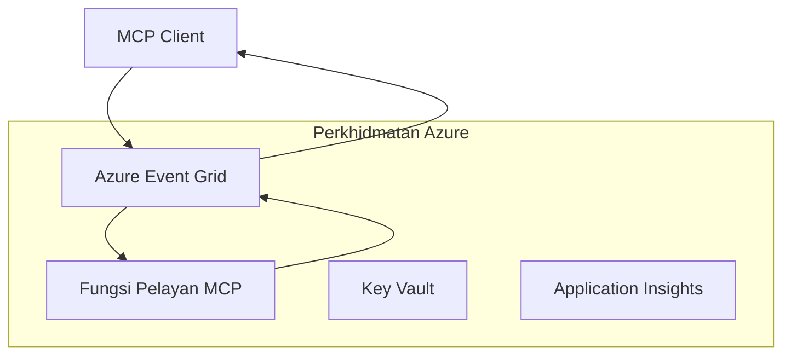
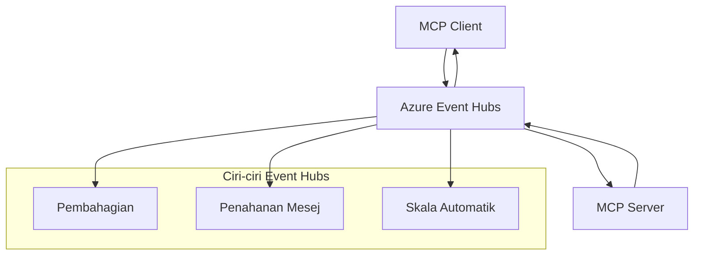

# MCP Pengangkutan Tersuai - Panduan Pelaksanaan Lanjutan

Protokol Konteks Model (MCP) menyediakan fleksibiliti dalam mekanisme pengangkutan, membenarkan pelaksanaan tersuai untuk persekitaran perusahaan khusus. Panduan lanjutan ini meneroka pelaksanaan pengangkutan tersuai menggunakan Azure Event Grid dan Azure Event Hubs sebagai contoh praktikal untuk membina penyelesaian MCP asli awan yang boleh diskalakan.

## Pengenalan

Walaupun pengangkutan standard MCP (stdio dan penstriman HTTP) memenuhi kebanyakan kes penggunaan, persekitaran perusahaan sering memerlukan mekanisme pengangkutan khusus untuk meningkatkan kebolehskalaan, kebolehpercayaan, dan integrasi dengan infrastruktur awan sedia ada. Pengangkutan tersuai membolehkan MCP memanfaatkan perkhidmatan pemesejan asli awan untuk komunikasi tak segerak, seni bina berasaskan acara, dan pemprosesan teragih.

Pelajaran ini meneroka pelaksanaan pengangkutan lanjutan berdasarkan spesifikasi MCP terkini (2025-11-25), perkhidmatan pemesejan Azure, dan corak integrasi perusahaan yang telah ditetapkan.

### **Senibina Pengangkutan MCP**

**Daripada Spesifikasi MCP (2025-11-25):**

- **Pengangkutan Standard**: stdio (disyorkan), penstriman HTTP (untuk senario jauh)
- **Pengangkutan Tersuai**: Mana-mana pengangkutan yang melaksanakan protokol pertukaran mesej MCP
- **Format Mesej**: JSON-RPC 2.0 dengan peluasan khusus MCP
- **Komunikasi Dua Hala**: Komunikasi dwi-arah penuh diperlukan untuk pemberitahuan dan respons

## Objektif Pembelajaran

Menjelang akhir pelajaran lanjutan ini, anda akan dapat:

- **Memahami Keperluan Pengangkutan Tersuai**: Melaksanakan protokol MCP ke atas mana-mana lapisan pengangkutan sambil mengekalkan pematuhan
- **Membina Pengangkutan Azure Event Grid**: Mewujudkan pelayan MCP berasaskan acara menggunakan Azure Event Grid untuk kebolehskalaan tanpa pelayan
- **Melaksanakan Pengangkutan Azure Event Hubs**: Mereka bentuk penyelesaian MCP berkelajuan tinggi menggunakan Azure Event Hubs untuk penstriman masa nyata
- **Mengaplikasi Corak Perusahaan**: Mengintegrasikan pengangkutan tersuai dengan infrastruktur Azure dan model keselamatan sedia ada
- **Mengendalikan Kebolehpercayaan Pengangkutan**: Melaksanakan ketahanan mesej, pengurutan, dan pengendalian ralat untuk senario perusahaan
- **Mengoptimumkan Prestasi**: Mereka bentuk penyelesaian pengangkutan untuk keperluan skala, kelewatan, dan kelajuan

## **Keperluan Pengangkutan**

### **Keperluan Teras daripada Spesifikasi MCP (2025-11-25):**

```yaml
Message Protocol:
  format: "JSON-RPC 2.0 with MCP extensions"
  bidirectional: "Full duplex communication required"
  ordering: "Message ordering must be preserved per session"
  
Transport Layer:
  reliability: "Transport MUST handle connection failures gracefully"
  security: "Transport MUST support secure communication"
  identification: "Each session MUST have unique identifier"
  
Custom Transport:
  compliance: "MUST implement complete MCP message exchange"
  extensibility: "MAY add transport-specific features"
  interoperability: "MUST maintain protocol compatibility"
```

## **Pelaksanaan Pengangkutan Azure Event Grid**

Azure Event Grid menyediakan perkhidmatan penghalaan acara tanpa pelayan yang sesuai untuk seni bina MCP berasaskan acara. Pelaksanaan ini menunjukkan cara membina sistem MCP yang boleh diskalakan dan longgar.

### **Gambaran Keseluruhan Senibina**


### **Pelaksanaan C# - Pengangkutan Event Grid**

```csharp
using Azure.Messaging.EventGrid;
using Microsoft.Extensions.Azure;
using System.Text.Json;

public class EventGridMcpTransport : IMcpTransport
{
    private readonly EventGridPublisherClient _publisher;
    private readonly string _topicEndpoint;
    private readonly string _clientId;
    
    public EventGridMcpTransport(string topicEndpoint, string accessKey, string clientId)
    {
        _publisher = new EventGridPublisherClient(
            new Uri(topicEndpoint), 
            new AzureKeyCredential(accessKey));
        _topicEndpoint = topicEndpoint;
        _clientId = clientId;
    }
    
    public async Task SendMessageAsync(McpMessage message)
    {
        var eventGridEvent = new EventGridEvent(
            subject: $"mcp/{_clientId}",
            eventType: "MCP.MessageReceived",
            dataVersion: "1.0",
            data: JsonSerializer.Serialize(message))
        {
            Id = Guid.NewGuid().ToString(),
            EventTime = DateTimeOffset.UtcNow
        };
        
        await _publisher.SendEventAsync(eventGridEvent);
    }
    
    public async Task<McpMessage> ReceiveMessageAsync(CancellationToken cancellationToken)
    {
        // Event Grid is push-based, so implement webhook receiver
        // This would typically be handled by Azure Functions trigger
        throw new NotImplementedException("Use EventGridTrigger in Azure Functions");
    }
}

// Azure Function for receiving Event Grid events
[FunctionName("McpEventGridReceiver")]
public async Task<IActionResult> HandleEventGridMessage(
    [EventGridTrigger] EventGridEvent eventGridEvent,
    ILogger log)
{
    try
    {
        var mcpMessage = JsonSerializer.Deserialize<McpMessage>(
            eventGridEvent.Data.ToString());
        
        // Process MCP message
        var response = await _mcpServer.ProcessMessageAsync(mcpMessage);
        
        // Send response back via Event Grid
        await _transport.SendMessageAsync(response);
        
        return new OkResult();
    }
    catch (Exception ex)
    {
        log.LogError(ex, "Error processing Event Grid MCP message");
        return new BadRequestResult();
    }
}
```

### **Pelaksanaan TypeScript - Pengangkutan Event Grid**

```typescript
import { EventGridPublisherClient, AzureKeyCredential } from "@azure/eventgrid";
import { McpTransport, McpMessage } from "./mcp-types";

export class EventGridMcpTransport implements McpTransport {
    private publisher: EventGridPublisherClient;
    private clientId: string;
    
    constructor(
        private topicEndpoint: string,
        private accessKey: string,
        clientId: string
    ) {
        this.publisher = new EventGridPublisherClient(
            topicEndpoint,
            new AzureKeyCredential(accessKey)
        );
        this.clientId = clientId;
    }
    
    async sendMessage(message: McpMessage): Promise<void> {
        const event = {
            id: crypto.randomUUID(),
            source: `mcp-client-${this.clientId}`,
            type: "MCP.MessageReceived",
            time: new Date(),
            data: message
        };
        
        await this.publisher.sendEvents([event]);
    }
    
    // Terima berasaskan acara melalui Azure Functions
    onMessage(handler: (message: McpMessage) => Promise<void>): void {
        // Pelaksanaan akan menggunakan pencetus Azure Functions Event Grid
        // Ini adalah antara muka konseptual untuk penerima webhook
    }
}

// Pelaksanaan Azure Functions
import { app, InvocationContext, EventGridEvent } from "@azure/functions";

app.eventGrid("mcpEventGridHandler", {
    handler: async (event: EventGridEvent, context: InvocationContext) => {
        try {
            const mcpMessage = event.data as McpMessage;
            
            // Proses mesej MCP
            const response = await mcpServer.processMessage(mcpMessage);
            
            // Hantar respons melalui Event Grid
            await transport.sendMessage(response);
            
        } catch (error) {
            context.error("Error processing MCP message:", error);
            throw error;
        }
    }
});
```

### **Pelaksanaan Python - Pengangkutan Event Grid**

```python
from azure.eventgrid import EventGridPublisherClient, EventGridEvent
from azure.core.credentials import AzureKeyCredential
import asyncio
import json
from typing import Callable, Optional
import uuid
from datetime import datetime

class EventGridMcpTransport:
    def __init__(self, topic_endpoint: str, access_key: str, client_id: str):
        self.client = EventGridPublisherClient(
            topic_endpoint, 
            AzureKeyCredential(access_key)
        )
        self.client_id = client_id
        self.message_handler: Optional[Callable] = None
    
    async def send_message(self, message: dict) -> None:
        """Send MCP message via Event Grid"""
        event = EventGridEvent(
            data=message,
            subject=f"mcp/{self.client_id}",
            event_type="MCP.MessageReceived",
            data_version="1.0"
        )
        
        await self.client.send(event)
    
    def on_message(self, handler: Callable[[dict], None]) -> None:
        """Register message handler for incoming events"""
        self.message_handler = handler

# Pelaksanaan Azure Functions
import azure.functions as func
import logging

def main(event: func.EventGridEvent) -> None:
    """Azure Functions Event Grid trigger for MCP messages"""
    try:
        # Mengurai mesej MCP dari acara Event Grid
        mcp_message = json.loads(event.get_body().decode('utf-8'))
        
        # Memproses mesej MCP
        response = process_mcp_message(mcp_message)
        
        # Hantar respons kembali melalui Event Grid
        # (Pelaksanaan akan mencipta klien Event Grid baru)
        
    except Exception as e:
        logging.error(f"Error processing MCP Event Grid message: {e}")
        raise
```

## **Pelaksanaan Pengangkutan Azure Event Hubs**

Azure Event Hubs menyediakan keupayaan penstriman masa nyata berkelajuan tinggi untuk senario MCP yang memerlukan kelewatan rendah dan jumlah mesej tinggi.

### **Gambaran Keseluruhan Senibina**


### **Pelaksanaan C# - Pengangkutan Event Hubs**

```csharp
using Azure.Messaging.EventHubs;
using Azure.Messaging.EventHubs.Producer;
using Azure.Messaging.EventHubs.Consumer;
using System.Text;

public class EventHubsMcpTransport : IMcpTransport, IDisposable
{
    private readonly EventHubProducerClient _producer;
    private readonly EventHubConsumerClient _consumer;
    private readonly string _consumerGroup;
    private readonly CancellationTokenSource _cancellationTokenSource;
    
    public EventHubsMcpTransport(
        string connectionString, 
        string eventHubName,
        string consumerGroup = "$Default")
    {
        _producer = new EventHubProducerClient(connectionString, eventHubName);
        _consumer = new EventHubConsumerClient(
            consumerGroup, 
            connectionString, 
            eventHubName);
        _consumerGroup = consumerGroup;
        _cancellationTokenSource = new CancellationTokenSource();
    }
    
    public async Task SendMessageAsync(McpMessage message)
    {
        var messageBody = JsonSerializer.Serialize(message);
        var eventData = new EventData(Encoding.UTF8.GetBytes(messageBody));
        
        // Add MCP-specific properties
        eventData.Properties.Add("MessageType", message.Method ?? "response");
        eventData.Properties.Add("MessageId", message.Id);
        eventData.Properties.Add("Timestamp", DateTimeOffset.UtcNow);
        
        await _producer.SendAsync(new[] { eventData });
    }
    
    public async Task StartReceivingAsync(
        Func<McpMessage, Task> messageHandler)
    {
        await foreach (PartitionEvent partitionEvent in _consumer.ReadEventsAsync(
            _cancellationTokenSource.Token))
        {
            try
            {
                var messageBody = Encoding.UTF8.GetString(
                    partitionEvent.Data.EventBody.ToArray());
                var mcpMessage = JsonSerializer.Deserialize<McpMessage>(messageBody);
                
                await messageHandler(mcpMessage);
            }
            catch (Exception ex)
            {
                // Handle deserialization or processing errors
                Console.WriteLine($"Error processing message: {ex.Message}");
            }
        }
    }
    
    public void Dispose()
    {
        _cancellationTokenSource?.Cancel();
        _producer?.DisposeAsync().AsTask().Wait();
        _consumer?.DisposeAsync().AsTask().Wait();
        _cancellationTokenSource?.Dispose();
    }
}
```

### **Pelaksanaan TypeScript - Pengangkutan Event Hubs**

```typescript
import { 
    EventHubProducerClient, 
    EventHubConsumerClient, 
    EventData 
} from "@azure/event-hubs";

export class EventHubsMcpTransport implements McpTransport {
    private producer: EventHubProducerClient;
    private consumer: EventHubConsumerClient;
    private isReceiving = false;
    
    constructor(
        private connectionString: string,
        private eventHubName: string,
        private consumerGroup: string = "$Default"
    ) {
        this.producer = new EventHubProducerClient(
            connectionString, 
            eventHubName
        );
        this.consumer = new EventHubConsumerClient(
            consumerGroup,
            connectionString,
            eventHubName
        );
    }
    
    async sendMessage(message: McpMessage): Promise<void> {
        const eventData: EventData = {
            body: JSON.stringify(message),
            properties: {
                messageType: message.method || "response",
                messageId: message.id,
                timestamp: new Date().toISOString()
            }
        };
        
        await this.producer.sendBatch([eventData]);
    }
    
    async startReceiving(
        messageHandler: (message: McpMessage) => Promise<void>
    ): Promise<void> {
        if (this.isReceiving) return;
        
        this.isReceiving = true;
        
        const subscription = this.consumer.subscribe({
            processEvents: async (events, context) => {
                for (const event of events) {
                    try {
                        const messageBody = event.body as string;
                        const mcpMessage: McpMessage = JSON.parse(messageBody);
                        
                        await messageHandler(mcpMessage);
                        
                        // Kemas kini titik semak untuk penghantaran sekurang-kurangnya sekali
                        await context.updateCheckpoint(event);
                    } catch (error) {
                        console.error("Error processing Event Hubs message:", error);
                    }
                }
            },
            processError: async (err, context) => {
                console.error("Event Hubs error:", err);
            }
        });
    }
    
    async close(): Promise<void> {
        this.isReceiving = false;
        await this.producer.close();
        await this.consumer.close();
    }
}
```

### **Pelaksanaan Python - Pengangkutan Event Hubs**

```python
from azure.eventhub import EventHubProducerClient, EventHubConsumerClient
from azure.eventhub import EventData
import json
import asyncio
from typing import Callable, Dict, Any
import logging

class EventHubsMcpTransport:
    def __init__(
        self, 
        connection_string: str, 
        eventhub_name: str,
        consumer_group: str = "$Default"
    ):
        self.producer = EventHubProducerClient.from_connection_string(
            connection_string, 
            eventhub_name=eventhub_name
        )
        self.consumer = EventHubConsumerClient.from_connection_string(
            connection_string,
            consumer_group=consumer_group,
            eventhub_name=eventhub_name
        )
        self.is_receiving = False
    
    async def send_message(self, message: Dict[str, Any]) -> None:
        """Send MCP message via Event Hubs"""
        event_data = EventData(json.dumps(message))
        
        # Tambah sifat khusus MCP
        event_data.properties = {
            "messageType": message.get("method", "response"),
            "messageId": message.get("id"),
            "timestamp": "2025-01-14T10:30:00Z"  # Gunakan cap masa sebenar
        }
        
        async with self.producer:
            event_data_batch = await self.producer.create_batch()
            event_data_batch.add(event_data)
            await self.producer.send_batch(event_data_batch)
    
    async def start_receiving(
        self, 
        message_handler: Callable[[Dict[str, Any]], None]
    ) -> None:
        """Start receiving MCP messages from Event Hubs"""
        if self.is_receiving:
            return
        
        self.is_receiving = True
        
        async with self.consumer:
            await self.consumer.receive(
                on_event=self._on_event_received(message_handler),
                starting_position="-1"  # Mula dari awal
            )
    
    def _on_event_received(self, handler: Callable):
        """Internal event handler wrapper"""
        async def handle_event(partition_context, event):
            try:
                # Huraikan mesej MCP dari acara Event Hubs
                message_body = event.body_as_str(encoding='UTF-8')
                mcp_message = json.loads(message_body)
                
                # Proses mesej MCP
                await handler(mcp_message)
                
                # Kemas kini titik semak untuk penghantaran sekurang-kurangnya sekali
                await partition_context.update_checkpoint(event)
                
            except Exception as e:
                logging.error(f"Error processing Event Hubs message: {e}")
        
        return handle_event
    
    async def close(self) -> None:
        """Clean up transport resources"""
        self.is_receiving = False
        await self.producer.close()
        await self.consumer.close()
```

## **Corak Pengangkutan Lanjutan**

### **Ketahanan dan Kebolehpercayaan Mesej**

```csharp
// Implementing message durability with retry logic
public class ReliableTransportWrapper : IMcpTransport
{
    private readonly IMcpTransport _innerTransport;
    private readonly RetryPolicy _retryPolicy;
    
    public async Task SendMessageAsync(McpMessage message)
    {
        await _retryPolicy.ExecuteAsync(async () =>
        {
            try
            {
                await _innerTransport.SendMessageAsync(message);
            }
            catch (TransportException ex) when (ex.IsRetryable)
            {
                // Log and retry
                throw;
            }
        });
    }
}
```

### **Integrasi Keselamatan Pengangkutan**

```csharp
// Integrating Azure Key Vault for transport security
public class SecureTransportFactory
{
    private readonly SecretClient _keyVaultClient;
    
    public async Task<IMcpTransport> CreateEventGridTransportAsync()
    {
        var accessKey = await _keyVaultClient.GetSecretAsync("EventGridAccessKey");
        var topicEndpoint = await _keyVaultClient.GetSecretAsync("EventGridTopic");
        
        return new EventGridMcpTransport(
            topicEndpoint.Value.Value,
            accessKey.Value.Value,
            Environment.MachineName
        );
    }
}
```

### **Pemantauan dan Kebolehlihatan Pengangkutan**

```csharp
// Adding telemetry to custom transports
public class ObservableTransport : IMcpTransport
{
    private readonly IMcpTransport _transport;
    private readonly ILogger _logger;
    private readonly TelemetryClient _telemetryClient;
    
    public async Task SendMessageAsync(McpMessage message)
    {
        using var activity = Activity.StartActivity("MCP.Transport.Send");
        activity?.SetTag("transport.type", "EventGrid");
        activity?.SetTag("message.method", message.Method);
        
        var stopwatch = Stopwatch.StartNew();
        
        try
        {
            await _transport.SendMessageAsync(message);
            
            _telemetryClient.TrackDependency(
                "EventGrid",
                "SendMessage",
                DateTime.UtcNow.Subtract(stopwatch.Elapsed),
                stopwatch.Elapsed,
                true
            );
        }
        catch (Exception ex)
        {
            _telemetryClient.TrackException(ex);
            throw;
        }
    }
}
```

## **Senario Integrasi Perusahaan**

### **Senario 1: Pemprosesan MCP Teragih**

Menggunakan Azure Event Grid untuk mengedarkan permintaan MCP merentasi pelbagai nod pemprosesan:

```yaml
Architecture:
  - MCP Client sends requests to Event Grid topic
  - Multiple Azure Functions subscribe to process different tool types
  - Results aggregated and returned via separate response topic
  
Benefits:
  - Horizontal scaling based on message volume
  - Fault tolerance through redundant processors
  - Cost optimization with serverless compute
```

### **Senario 2: Penstriman MCP Masa Nyata**

Menggunakan Azure Event Hubs untuk interaksi MCP berfrekuensi tinggi:

```yaml
Architecture:
  - MCP Client streams continuous requests via Event Hubs
  - Stream Analytics processes and routes messages
  - Multiple consumers handle different aspect of processing
  
Benefits:
  - Low latency for real-time scenarios
  - High throughput for batch processing
  - Built-in partitioning for parallel processing
```

### **Senario 3: Senibina Pengangkutan Hibrid**

Menggabungkan pelbagai pengangkutan untuk kes penggunaan berbeza:

```csharp
public class HybridMcpTransport : IMcpTransport
{
    private readonly IMcpTransport _realtimeTransport; // Event Hubs
    private readonly IMcpTransport _batchTransport;    // Event Grid
    private readonly IMcpTransport _fallbackTransport; // HTTP Streaming
    
    public async Task SendMessageAsync(McpMessage message)
    {
        // Route based on message characteristics
        var transport = message.Method switch
        {
            "tools/call" when IsRealtime(message) => _realtimeTransport,
            "resources/read" when IsBatch(message) => _batchTransport,
            _ => _fallbackTransport
        };
        
        await transport.SendMessageAsync(message);
    }
}
```

## **Pengoptimuman Prestasi**

### **Pengumpulan Mesej untuk Event Grid**

```csharp
public class BatchingEventGridTransport : IMcpTransport
{
    private readonly List<McpMessage> _messageBuffer = new();
    private readonly Timer _flushTimer;
    private const int MaxBatchSize = 100;
    
    public async Task SendMessageAsync(McpMessage message)
    {
        lock (_messageBuffer)
        {
            _messageBuffer.Add(message);
            
            if (_messageBuffer.Count >= MaxBatchSize)
            {
                _ = Task.Run(FlushMessages);
            }
        }
    }
    
    private async Task FlushMessages()
    {
        List<McpMessage> toSend;
        lock (_messageBuffer)
        {
            toSend = new List<McpMessage>(_messageBuffer);
            _messageBuffer.Clear();
        }
        
        if (toSend.Any())
        {
            var events = toSend.Select(CreateEventGridEvent);
            await _publisher.SendEventsAsync(events);
        }
    }
}
```

### **Strategi Pembahagian untuk Event Hubs**

```csharp
public class PartitionedEventHubsTransport : IMcpTransport
{
    public async Task SendMessageAsync(McpMessage message)
    {
        // Partition by client ID for session affinity
        var partitionKey = ExtractClientId(message);
        
        var eventData = new EventData(JsonSerializer.SerializeToUtf8Bytes(message))
        {
            PartitionKey = partitionKey
        };
        
        await _producer.SendAsync(new[] { eventData });
    }
}
```

## **Ujian Pengangkutan Tersuai**

### **Ujian Unit dengan Test Doubles**

```csharp
[Test]
public async Task EventGridTransport_SendMessage_PublishesCorrectEvent()
{
    // Arrange
    var mockPublisher = new Mock<EventGridPublisherClient>();
    var transport = new EventGridMcpTransport(mockPublisher.Object);
    var message = new McpMessage { Method = "tools/list", Id = "test-123" };
    
    // Act
    await transport.SendMessageAsync(message);
    
    // Assert
    mockPublisher.Verify(
        x => x.SendEventAsync(
            It.Is<EventGridEvent>(e => 
                e.EventType == "MCP.MessageReceived" &&
                e.Subject == "mcp/test-client"
            )
        ),
        Times.Once
    );
}
```

### **Ujian Integrasi dengan Azure Test Containers**

```csharp
[Test]
public async Task EventHubsTransport_IntegrationTest()
{
    // Using Testcontainers for integration testing
    var eventHubsContainer = new EventHubsContainer()
        .WithEventHub("test-hub");
    
    await eventHubsContainer.StartAsync();
    
    var transport = new EventHubsMcpTransport(
        eventHubsContainer.GetConnectionString(),
        "test-hub"
    );
    
    // Test message round-trip
    var sentMessage = new McpMessage { Method = "test", Id = "123" };
    McpMessage receivedMessage = null;
    
    await transport.StartReceivingAsync(msg => {
        receivedMessage = msg;
        return Task.CompletedTask;
    });
    
    await transport.SendMessageAsync(sentMessage);
    await Task.Delay(1000); // Allow for message processing
    
    Assert.That(receivedMessage?.Id, Is.EqualTo("123"));
}
```

## **Amalan Terbaik dan Garis Panduan**

### **Prinsip Reka Bentuk Pengangkutan**

1. **Idempotensi**: Pastikan pemprosesan mesej adalah idempotent untuk mengendalikan pendua
2. **Pengendalian Ralat**: Laksanakan pengendalian ralat menyeluruh dan antrian surat mati
3. **Pemantauan**: Tambah telemetri terperinci dan pemeriksaan kesihatan
4. **Keselamatan**: Gunakan identiti terurus dan akses keistimewaan minimum
5. **Prestasi**: Reka bentuk mengikut keperluan kelewatan dan kelajuan khusus anda

### **Cadangan Khusus Azure**

1. **Gunakan Identiti Terurus**: Elakkan rentetan sambungan dalam pengeluaran
2. **Laksanakan Pemutus Litar**: Lindungi daripada gangguan perkhidmatan Azure
3. **Pantau Kos**: Jejaki jumlah mesej dan kos pemprosesan
4. **Rancang untuk Skala**: Reka bentuk strategi pembahagian dan penskalaan awal
5. **Uji Secara Menyeluruh**: Gunakan Azure DevTest Labs untuk ujian menyeluruh

## **Kesimpulan**

Pengangkutan MCP tersuai membolehkan senario perusahaan yang berkuasa menggunakan perkhidmatan pemesejan Azure. Dengan melaksanakan pengangkutan Event Grid atau Event Hubs, anda boleh membina penyelesaian MCP yang boleh diskalakan dan boleh dipercayai yang berintegrasi dengan lancar dengan infrastruktur Azure sedia ada.

Contoh yang disediakan menunjukkan corak sedia produksi untuk melaksanakan pengangkutan tersuai sambil mengekalkan pematuhan protokol MCP dan amalan terbaik Azure.

## **Sumber Tambahan**

- [Spesifikasi MCP 2025-06-18](https://spec.modelcontextprotocol.io/specification/2025-06-18/)
- [Dokumentasi Azure Event Grid](https://docs.microsoft.com/azure/event-grid/)
- [Dokumentasi Azure Event Hubs](https://docs.microsoft.com/azure/event-hubs/)
- [Azure Functions Event Grid Trigger](https://docs.microsoft.com/azure/azure-functions/functions-bindings-event-grid)
- [Azure SDK untuk .NET](https://github.com/Azure/azure-sdk-for-net)
- [Azure SDK untuk TypeScript](https://github.com/Azure/azure-sdk-for-js)
- [Azure SDK untuk Python](https://github.com/Azure/azure-sdk-for-python)

---

> *Panduan ini memfokuskan pada corak pelaksanaan praktikal untuk sistem MCP produksi. Sentiasa sahkan pelaksanaan pengangkutan mengikut keperluan khusus anda dan had perkhidmatan Azure.*
> **Standard Semasa**: Panduan ini mencerminkan keperluan pengangkutan [Spesifikasi MCP 2025-06-18](https://spec.modelcontextprotocol.io/specification/2025-06-18/) dan corak pengangkutan lanjutan untuk persekitaran perusahaan.


## Apa Seterusnya
- [6. Sumbangan Komuniti](../../06-CommunityContributions/README.md)

---

<!-- CO-OP TRANSLATOR DISCLAIMER START -->
**Penafian**:  
Dokumen ini telah diterjemahkan menggunakan perkhidmatan terjemahan AI [Co-op Translator](https://github.com/Azure/co-op-translator). Walaupun kami berusaha untuk ketepatan, sila ambil maklum bahawa terjemahan automatik mungkin mengandungi kesilapan atau ketidaktepatan. Dokumen asal dalam bahasa asalnya harus dianggap sebagai sumber yang sahih. Untuk maklumat penting, terjemahan profesional oleh manusia adalah disyorkan. Kami tidak bertanggungjawab atas sebarang salah faham atau salah tafsir yang timbul daripada penggunaan terjemahan ini.
<!-- CO-OP TRANSLATOR DISCLAIMER END -->