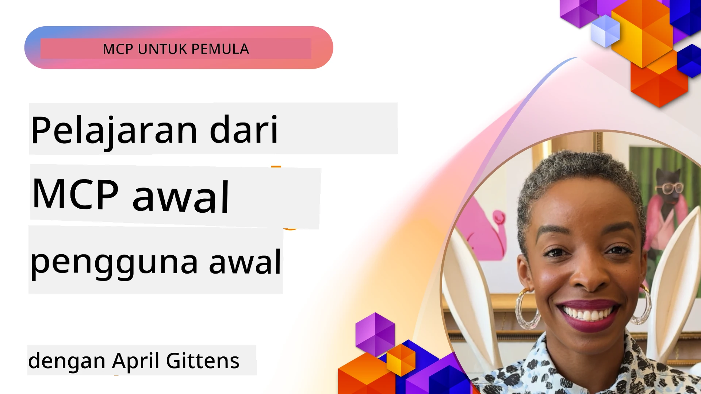

# 🌟 Pengajaran dari Pengguna Awal

[](https://youtu.be/jds7dSmNptE)

_(Klik imej di atas untuk menonton video pengajaran ini)_

## 🎯 Apa yang Modul Ini Liputi

Modul ini meneroka bagaimana organisasi sebenar dan pembangun menggunakan Protokol Konteks Model (MCP) untuk menyelesaikan cabaran sebenar dan memacu inovasi. Melalui kajian kes terperinci, projek amali, dan contoh praktikal, anda akan mendapati bagaimana MCP membolehkan integrasi AI yang selamat, boleh diskalakan yang menghubungkan model bahasa, alatan, dan data perusahaan.

### 📚 Lihat MCP dalam Tindakan

Ingin melihat prinsip-prinsip ini diaplikasikan pada alatan yang sedia untuk pengeluaran? Lihat [**10 Server MCP Microsoft yang Mengubah Produktiviti Pembangun**](microsoft-mcp-servers.md), yang memaparkan server MCP Microsoft sebenar yang boleh anda gunakan hari ini.

## Gambaran Keseluruhan

Pengajaran ini meneroka bagaimana pengguna awal telah menggunakan Protokol Konteks Model (MCP) untuk menyelesaikan cabaran dunia sebenar dan memacu inovasi merentasi pelbagai industri. Melalui kajian kes terperinci dan projek amali, anda akan melihat bagaimana MCP membolehkan integrasi AI yang distandardkan, selamat, dan boleh diskalakan—menghubungkan model bahasa besar, alatan, dan data perusahaan dalam satu kerangka yang bersatu. Anda akan mendapat pengalaman praktikal mereka bentuk dan membina penyelesaian berasaskan MCP, belajar daripada corak pelaksanaan terbukti, dan menemui amalan terbaik untuk menerapkan MCP dalam persekitaran pengeluaran. Pengajaran ini juga menyoroti trend baharu, arah masa depan, dan sumber open-source untuk membantu anda kekal di barisan hadapan teknologi MCP serta ekosistemnya yang berkembang.

## Objektif Pembelajaran

- Menganalisis pelaksanaan MCP dunia sebenar merentasi pelbagai industri  
- Mereka bentuk dan membina aplikasi lengkap berasaskan MCP  
- Meneroka trend muncul dan arah masa depan dalam teknologi MCP  
- Mengaplikasikan amalan terbaik dalam senario pembangunan sebenar  

## Pelaksanaan MCP Dunia Sebenar

### Kajian Kes 1: Automasi Sokongan Pelanggan Perusahaan

Sebuah syarikat multinasional melaksanakan penyelesaian berasaskan MCP untuk menstandardkan interaksi AI merentasi sistem sokongan pelanggan mereka. Ini membolehkan mereka untuk:

- Mewujudkan antara muka bersatu untuk pelbagai penyedia LLM  
- Mengekalkan pengurusan arahan seragam merentasi jabatan  
- Melaksanakan kawalan keselamatan dan pematuhan yang kukuh  
- Mudah bertukar antara model AI berbeza berdasarkan keperluan tertentu  

**Pelaksanaan Teknikal:**  

```python
# Pelaksanaan pelayan MCP Python untuk sokongan pelanggan
import logging
import asyncio
from modelcontextprotocol import create_server, ServerConfig
from modelcontextprotocol.server import MCPServer
from modelcontextprotocol.transports import create_http_transport
from modelcontextprotocol.resources import ResourceDefinition
from modelcontextprotocol.prompts import PromptDefinition
from modelcontextprotocol.tool import ToolDefinition

# Konfigurasikan log
logging.basicConfig(level=logging.INFO)

async def main():
    # Buat konfigurasi pelayan
    config = ServerConfig(
        name="Enterprise Customer Support Server",
        version="1.0.0",
        description="MCP server for handling customer support inquiries"
    )
    
    # Inisialisasi pelayan MCP
    server = create_server(config)
    
    # Daftarkan sumber pangkalan pengetahuan
    server.resources.register(
        ResourceDefinition(
            name="customer_kb",
            description="Customer knowledge base documentation"
        ),
        lambda params: get_customer_documentation(params)
    )
    
    # Daftarkan templat prompt
    server.prompts.register(
        PromptDefinition(
            name="support_template",
            description="Templates for customer support responses"
        ),
        lambda params: get_support_templates(params)
    )
    
    # Daftarkan alat sokongan
    server.tools.register(
        ToolDefinition(
            name="ticketing",
            description="Create and update support tickets"
        ),
        handle_ticketing_operations
    )
    
    # Mulakan pelayan dengan pengangkutan HTTP
    transport = create_http_transport(port=8080)
    await server.run(transport)

if __name__ == "__main__":
    asyncio.run(main())
```
  
**Keputusan:** Pengurangan kos model sebanyak 30%, peningkatan konsistensi respons sebanyak 45%, dan pematuhan dipertingkatkan merentasi operasi global.

### Kajian Kes 2: Pembantu Diagnosis Penjagaan Kesihatan

Sebuah penyedia penjagaan kesihatan membangunkan infrastruktur MCP untuk mengintegrasikan pelbagai model AI perubatan khusus sambil memastikan data pesakit sensitif kekal dilindungi:

- Pertukaran lancar antara model perubatan am dan pakar  
- Kawalan privasi ketat dan rekod audit  
- Integrasi dengan sistem Rekod Kesihatan Elektronik (EHR) sedia ada  
- Kejuruteraan arahan yang konsisten untuk terminologi perubatan  

**Pelaksanaan Teknikal:**  

```csharp
// C# MCP host application implementation in healthcare application
using Microsoft.Extensions.DependencyInjection;
using ModelContextProtocol.SDK.Client;
using ModelContextProtocol.SDK.Security;
using ModelContextProtocol.SDK.Resources;

public class DiagnosticAssistant
{
    private readonly MCPHostClient _mcpClient;
    private readonly PatientContext _patientContext;
    
    public DiagnosticAssistant(PatientContext patientContext)
    {
        _patientContext = patientContext;
        
        // Configure MCP client with healthcare-specific settings
        var clientOptions = new ClientOptions
        {
            Name = "Healthcare Diagnostic Assistant",
            Version = "1.0.0",
            Security = new SecurityOptions
            {
                Encryption = EncryptionLevel.Medical,
                AuditEnabled = true
            }
        };
        
        _mcpClient = new MCPHostClientBuilder()
            .WithOptions(clientOptions)
            .WithTransport(new HttpTransport("https://healthcare-mcp.example.org"))
            .WithAuthentication(new HIPAACompliantAuthProvider())
            .Build();
    }
    
    public async Task<DiagnosticSuggestion> GetDiagnosticAssistance(
        string symptoms, string patientHistory)
    {
        // Create request with appropriate resources and tool access
        var resourceRequest = new ResourceRequest
        {
            Name = "patient_records",
            Parameters = new Dictionary<string, object>
            {
                ["patientId"] = _patientContext.PatientId,
                ["requestingProvider"] = _patientContext.ProviderId
            }
        };
        
        // Request diagnostic assistance using appropriate prompt
        var response = await _mcpClient.SendPromptRequestAsync(
            promptName: "diagnostic_assistance",
            parameters: new Dictionary<string, object>
            {
                ["symptoms"] = symptoms,
                patientHistory = patientHistory,
                relevantGuidelines = _patientContext.GetRelevantGuidelines()
            });
            
        return DiagnosticSuggestion.FromMCPResponse(response);
    }
}
```
  
**Keputusan:** Cadangan diagnostik yang dipertingkatkan untuk doktor sambil mengekalkan pematuhan penuh HIPAA dan pengurangan ketara dalam pertukaran konteks antara sistem.

### Kajian Kes 3: Analisis Risiko Perkhidmatan Kewangan

Sebuah institusi kewangan melaksanakan MCP untuk menstandardkan proses analisis risikonya merentasi jabatan yang berbeza:

- Mewujudkan antara muka bersatu untuk model risiko kredit, pengesanan penipuan, dan risiko pelaburan  
- Melaksanakan kawalan akses ketat dan penversian model  
- Menjamin kebolehaudit semua cadangan AI  
- Mengekalkan pemformatan data konsisten merentasi sistem pelbagai  

**Pelaksanaan Teknikal:**  

```java
// Pelayan MCP Java untuk penilaian risiko kewangan
import org.mcp.server.*;
import org.mcp.security.*;

public class FinancialRiskMCPServer {
    public static void main(String[] args) {
        // Cipta pelayan MCP dengan ciri pematuhan kewangan
        MCPServer server = new MCPServerBuilder()
            .withModelProviders(
                new ModelProvider("risk-assessment-primary", new AzureOpenAIProvider()),
                new ModelProvider("risk-assessment-audit", new LocalLlamaProvider())
            )
            .withPromptTemplateDirectory("./compliance/templates")
            .withAccessControls(new SOCCompliantAccessControl())
            .withDataEncryption(EncryptionStandard.FINANCIAL_GRADE)
            .withVersionControl(true)
            .withAuditLogging(new DatabaseAuditLogger())
            .build();
            
        server.addRequestValidator(new FinancialDataValidator());
        server.addResponseFilter(new PII_RedactionFilter());
        
        server.start(9000);
        
        System.out.println("Financial Risk MCP Server running on port 9000");
    }
}
```
  
**Keputusan:** Pematuhan peraturan dipertingkatkan, kitaran pelaksanaan model 40% lebih pantas, dan konsistensi penilaian risiko ditambah baik merentasi jabatan.

### Kajian Kes 4: Microsoft Playwright MCP Server untuk Automasi Pelayar

Microsoft membangunkan [Playwright MCP server](https://github.com/microsoft/playwright-mcp) untuk membolehkan automasi pelayar yang selamat dan distandardkan melalui Protokol Konteks Model. Server sedia untuk pengeluaran ini membolehkan agen AI dan LLM berinteraksi dengan pelayar web dalam cara yang terkawal, boleh diaudit, dan boleh dikembangkan—membolehkan kes penggunaan seperti ujian web automatik, pengekstrakan data, dan aliran kerja hujung-ke-hujung.

> **🎯 Alat Sedia untuk Pengeluaran**  
>  
> Kajian kes ini memaparkan server MCP sebenar yang boleh anda gunakan hari ini! Ketahui lebih lanjut tentang Playwright MCP Server dan 9 server MCP Microsoft lain yang sedia untuk pengeluaran dalam [**Panduan Server MCP Microsoft**](microsoft-mcp-servers.md#8--playwright-mcp-server).

**Ciri Utama:**  
- Mendedahkan keupayaan automasi pelayar (navigasi, isian borang, tangkapan skrin, dsb.) sebagai alatan MCP  
- Melaksanakan kawalan akses ketat dan sandbox untuk mengelakkan tindakan tanpa kebenaran  
- Menyediakan rekod audit terperinci untuk semua interaksi pelayar  
- Menyokong integrasi dengan Azure OpenAI dan penyedia LLM lain untuk automasi dipacu agen  
- Menyokong keupayaan GitHub Copilot Coding Agent dengan pelayaran web  

**Pelaksanaan Teknikal:**  

```typescript
// TypeScript: Mendaftarkan alat automasi pelayar Playwright dalam pelayan MCP
import { createServer, ToolDefinition } from 'modelcontextprotocol';
import { launch } from 'playwright';

const server = createServer({
  name: 'Playwright MCP Server',
  version: '1.0.0',
  description: 'MCP server for browser automation using Playwright'
});

// Daftarkan alat untuk melayari URL dan menangkap tangkapan layar
server.tools.register(
  new ToolDefinition({
    name: 'navigate_and_screenshot',
    description: 'Navigate to a URL and capture a screenshot',
    parameters: {
      url: { type: 'string', description: 'The URL to visit' }
    }
  }),
  async ({ url }) => {
    const browser = await launch();
    const page = await browser.newPage();
    await page.goto(url);
    const screenshot = await page.screenshot();
    await browser.close();
    return { screenshot };
  }
);

// Mulakan pelayan MCP
server.listen(8080);
```
  
**Keputusan:**  

- Mengaktifkan automasi pelayar berprogram yang selamat untuk agen AI dan LLM  
- Mengurangkan usaha ujian manual dan menambah baik liputan ujian untuk aplikasi web  
- Menyediakan kerangka kerja boleh guna semula dan boleh dikembangkan untuk integrasi alat berasaskan pelayar dalam persekitaran perusahaan  
- Menyokong keupayaan pelayaran web GitHub Copilot  

**Rujukan:**  

- [Repositori GitHub Playwright MCP Server](https://github.com/microsoft/playwright-mcp)  
- [Penyelesaian AI dan Automasi Microsoft](https://azure.microsoft.com/en-us/products/ai-services/)

### Kajian Kes 5: Azure MCP – Protokol Konteks Model Tahap Perusahaan sebagai Perkhidmatan

Azure MCP Server ([https://aka.ms/azmcp](https://aka.ms/azmcp)) adalah pelaksanaan MCP tahap perusahaan yang diurus Microsoft, direka untuk menyediakan kemampuan server MCP yang boleh diskalakan, selamat, dan mematuhi piawaian sebagai perkhidmatan awan. Azure MCP membolehkan organisasi melancarkan, mengurus, dan mengintegrasikan server MCP dengan Azure AI, data, dan perkhidmatan keselamatan dengan cepat, mengurangkan beban operasi dan mempercepat penerapan AI.

> **🎯 Alat Sedia untuk Pengeluaran**  
>  
> Ini adalah server MCP sebenar yang boleh anda gunakan hari ini! Ketahui lebih lanjut tentang Azure AI Foundry MCP Server dalam [**Panduan Server MCP Microsoft**](microsoft-mcp-servers.md).

- Penghosan server MCP yang diurus sepenuhnya dengan skala, pemantauan, dan keselamatan terbina dalam  
- Integrasi asli dengan Azure OpenAI, Azure AI Search, dan perkhidmatan Azure lain  
- Pengesahan dan kebenaran perusahaan melalui Microsoft Entra ID  
- Sokongan untuk alat tersuai, templat arahan, dan penyambung sumber  
- Pematuhan dengan keperluan keselamatan dan peraturan perusahaan  

**Pelaksanaan Teknikal:**  

```yaml
# Example: Azure MCP server deployment configuration (YAML)
apiVersion: mcp.microsoft.com/v1
kind: McpServer
metadata:
  name: enterprise-mcp-server
spec:
  modelProviders:
    - name: azure-openai
      type: AzureOpenAI
      endpoint: https://<your-openai-resource>.openai.azure.com/
      apiKeySecret: <your-azure-keyvault-secret>
  tools:
    - name: document_search
      type: AzureAISearch
      endpoint: https://<your-search-resource>.search.windows.net/
      apiKeySecret: <your-azure-keyvault-secret>
  authentication:
    type: EntraID
    tenantId: <your-tenant-id>
  monitoring:
    enabled: true
    logAnalyticsWorkspace: <your-log-analytics-id>
```
  
**Keputusan:**  
- Mengurangkan masa kepada nilai untuk projek AI perusahaan dengan menyediakan platform server MCP yang sedia digunakan dan mematuhi piawaian  
- Memudahkan integrasi LLM, alatan, dan sumber data perusahaan  
- Meningkatkan keselamatan, keterlihatan, dan kecekapan operasi untuk beban kerja MCP  
- Memperbaiki kualiti kod dengan amalan terbaik Azure SDK dan corak pengesahan semasa  

**Rujukan:**  
- [Dokumentasi Azure MCP](https://aka.ms/azmcp)  
- [Repositori GitHub Azure MCP Server](https://github.com/Azure/azure-mcp)  
- [Perkhidmatan AI Azure](https://azure.microsoft.com/en-us/products/ai-services/)  
- [Pusat MCP Microsoft](https://mcp.azure.com)

## Kajian Kes 6: NLWeb  
MCP (Protokol Konteks Model) adalah protokol baru untuk Chatbot dan pembantu AI berinteraksi dengan alatan. Setiap contoh NLWeb juga merupakan server MCP, yang menyokong satu kaedah teras, ask, yang digunakan untuk bertanya soalan kepada laman web dalam bahasa semula jadi. Respons yang dikembalikan menggunakan schema.org, kosa kata yang banyak digunakan untuk menerangkan data web. Secara longgar, MCP adalah NLWeb seperti Http kepada HTML. NLWeb menggabungkan protokol, format Schema.org, dan kod contoh untuk membantu laman dengan cepat mewujudkan titik hujung ini, memberi manfaat kepada manusia melalui antara muka perbualan dan mesin melalui interaksi agen-ke-agen semula jadi.

Terdapat dua komponen berbeza bagi NLWeb.  
- Sebuah protokol, yang sangat mudah untuk bermula, untuk antara muka dengan laman dalam bahasa semula jadi dan format, menggunakan json dan schema.org untuk jawapan yang dikembalikan. Lihat dokumentasi API REST untuk maklumat lanjut.  
- Implementasi ringkas bagi (1) yang menggunakan markup sedia ada, untuk laman yang boleh diwakili sebagai senarai item (produk, resipi, tarikan, ulasan, dsb.). Bersama-sama dengan set widget antara muka pengguna, laman boleh dengan mudah menyediakan antara muka perbualan untuk kandungan mereka. Lihat dokumentasi Life of a chat query untuk maklumat lanjut tentang bagaimana ini berfungsi.

**Rujukan:**  
- [Dokumentasi Azure MCP](https://aka.ms/azmcp)  
- [NLWeb](https://github.com/microsoft/NlWeb)

### Kajian Kes 7: Azure AI Foundry MCP Server – Integrasi Agen AI Perusahaan

Server Azure AI Foundry MCP menunjukkan bagaimana MCP boleh digunakan untuk mengatur dan mengurus agen AI dan aliran kerja dalam persekitaran perusahaan. Dengan mengintegrasikan MCP dengan Azure AI Foundry, organisasi boleh menstandardkan interaksi agen, memanfaatkan pengurusan aliran kerja Foundry, dan memastikan pelaksanaan yang selamat dan boleh diskalakan.

> **🎯 Alat Sedia untuk Pengeluaran**  
>  
> Ini adalah server MCP sebenar yang boleh anda gunakan hari ini! Ketahui lebih lanjut tentang Azure AI Foundry MCP Server dalam [**Panduan Server MCP Microsoft**](microsoft-mcp-servers.md#9--azure-ai-foundry-mcp-server).

**Ciri Utama:**  
- Akses menyeluruh ke ekosistem AI Azure, termasuk katalog model dan pengurusan pelaksanaan  
- Pengindeksan pengetahuan dengan Azure AI Search untuk aplikasi RAG  
- Alat penilaian untuk prestasi model AI dan jaminan kualiti  
- Integrasi dengan Azure AI Foundry Catalog dan Labs untuk model penyelidikan terkini  
- Keupayaan pengurusan dan penilaian agen untuk senario pengeluaran  

**Keputusan:**  
- Prototip pantas dan pemantauan kukuh aliran kerja agen AI  
- Integrasi lancar dengan perkhidmatan AI Azure untuk senario maju  
- Antara muka bersatu untuk membina, melaksanakan, dan memantau saluran agen  
- Keselamatan, pematuhan, dan kecekapan operasi yang dipertingkatkan untuk perusahaan  
- Mempercepatkan penerimaan AI sambil mengekalkan kawalan ke atas proses dipacu agen yang kompleks  

**Rujukan:**  
- [Repositori GitHub Azure AI Foundry MCP Server](https://github.com/azure-ai-foundry/mcp-foundry)  
- [Mengintegrasikan Agen AI Azure dengan MCP (Blog Microsoft Foundry)](https://devblogs.microsoft.com/foundry/integrating-azure-ai-agents-mcp/)

### Kajian Kes 8: Foundry MCP Playground – Eksperimen dan Prototip

Foundry MCP Playground menawarkan persekitaran sedia guna untuk bereksperimen dengan server MCP dan integrasi Azure AI Foundry. Pembangun boleh dengan cepat membuat prototaip, menguji, dan menilai model AI serta aliran kerja agen menggunakan sumber dari Azure AI Foundry Catalog dan Labs. Playground menyederhanakan penetapan, menyediakan projek contoh, dan menyokong pembangunan kolaboratif, menjadikannya mudah untuk meneroka amalan terbaik dan senario baru dengan overhead minimum. Ia sangat berguna untuk pasukan yang ingin mengesahkan idea, berkongsi eksperimen, dan mempercepat pembelajaran tanpa keperluan infrastruktur kompleks. Dengan mengurangkan halangan penyertaan, playground membantu memupuk inovasi dan sumbangan komuniti dalam ekosistem MCP dan Azure AI Foundry.

**Rujukan:**  

- [Repositori GitHub Foundry MCP Playground](https://github.com/azure-ai-foundry/foundry-mcp-playground)

### Kajian Kes 9: Microsoft Learn Docs MCP Server – Akses Dokumentasi Berkuasa AI

Microsoft Learn Docs MCP Server adalah perkhidmatan hos awan yang menyediakan pembantu AI dengan akses masa nyata ke dokumentasi rasmi Microsoft melalui Protokol Konteks Model. Server sedia untuk pengeluaran ini menghubungkan kepada ekosistem Microsoft Learn yang komprehensif dan membolehkan carian semantik merentasi semua sumber rasmi Microsoft.

> **🎯 Alat Sedia untuk Pengeluaran**  
>  
> Ini adalah server MCP sebenar yang boleh anda gunakan hari ini! Ketahui lebih lanjut tentang Microsoft Learn Docs MCP Server dalam [**Panduan Server MCP Microsoft**](microsoft-mcp-servers.md#1--microsoft-learn-docs-mcp-server).

**Ciri Utama:**  
- Akses masa nyata ke dokumentasi rasmi Microsoft, dokumentasi Azure, dan dokumentasi Microsoft 365  
- Keupayaan carian semantik maju yang memahami konteks dan niat  
- Maklumat sentiasa dikemas kini selaras dengan penerbitan kandungan Microsoft Learn  
- Liputan komprehensif merentasi Microsoft Learn, dokumentasi Azure, dan sumber Microsoft 365  
- Mengembalikan sehingga 10 ketulan kandungan berkualiti tinggi dengan tajuk artikel dan URL  

**Mengapa Ia Kritikal:**  
- Menyelesaikan masalah "pengetahuan AI lapuk" untuk teknologi Microsoft  
- Memastikan pembantu AI mempunyai akses kepada ciri terkini .NET, C#, Azure, dan Microsoft 365  
- Menyediakan maklumat sahih pihak pertama untuk generasi kod yang tepat  
- Penting bagi pembangun yang menggunakan teknologi Microsoft yang berkembang pesat  

**Keputusan:**  
- Ketepatan kod AI yang dijana bertambah baik dengan ketara untuk teknologi Microsoft  
- Masa dicari untuk dokumentasi terkini dan amalan terbaik dikurangkan  
- Produktiviti pembangun dipertingkatkan dengan pengambilan dokumentasi berasaskan konteks  
- Integrasi lancar dengan aliran kerja pembangunan tanpa meninggalkan IDE  

**Rujukan:**  
- [Repositori GitHub Microsoft Learn Docs MCP Server](https://github.com/MicrosoftDocs/mcp)  
- [Dokumentasi Microsoft Learn](https://learn.microsoft.com/)

## Projek Amali

### Projek 1: Bina Server MCP Multi-Penyedia

**Objektif:** Mewujudkan server MCP yang boleh menghala permintaan ke pelbagai pembekal model AI berdasarkan kriteria tertentu.

**Keperluan:**  

- Menyokong sekurang-kurangnya tiga pembekal model berbeza (contoh: OpenAI, Anthropic, model tempatan)  
- Melaksanakan mekanisme penghalaan berdasarkan metadata permintaan  
- Membina sistem konfigurasi untuk mengurus kelayakan pembekal  
- Menambah penyimpanan cache untuk mengoptimumkan prestasi dan kos  
- Membangunkan papan pemuka mudah untuk memantau penggunaan  

**Langkah Pelaksanaan:**  

1. Sediakan infrastruktur asas server MCP  
2. Laksanakan penyesuai pembekal untuk setiap perkhidmatan model AI  
3. Bina logik penghalaan berdasarkan atribut permintaan  
4. Tambah mekanisme penyimpanan cache untuk permintaan kerap  
5. Bangunkan papan pemuka pemantauan  
6. Uji dengan pelbagai corak permintaan  

**Teknologi:** Pilih dari Python (.NET/Java/Python mengikut pilihan anda), Redis untuk caching, dan rangka kerja web mudah untuk papan pemuka.

### Projek 2: Sistem Pengurusan Arahan Perusahaan
**Objektif:** Membangunkan sistem berasaskan MCP untuk mengurus, versi, dan menyebarkan templat prompt di seluruh organisasi.

**Keperluan:**

- Cipta repositori terpusat untuk templat prompt
- Laksanakan versi dan aliran kerja kelulusan
- Bina keupayaan pengujian templat dengan input sampel
- Bangunkan kawalan akses berasaskan peranan
- Cipta API untuk pengambilan dan penyebaran templat

**Langkah Pelaksanaan:**

1. Reka skema pangkalan data untuk penyimpanan templat
2. Cipta API teras untuk operasi CRUD templat
3. Laksanakan sistem versi
4. Bina aliran kerja kelulusan
5. Bangunkan rangka kerja pengujian
6. Cipta antara muka web ringkas untuk pengurusan
7. Integrasi dengan pelayan MCP

**Teknologi:** Pilihan anda bagi rangka kerja backend, pangkalan data SQL atau NoSQL, dan rangka kerja frontend untuk antara muka pengurusan.

### Projek 3: Platform Penjanaan Kandungan Berasaskan MCP

**Objektif:** Bina platform penjanaan kandungan yang memanfaatkan MCP untuk menyediakan keputusan konsisten merentas pelbagai jenis kandungan.

**Keperluan:**

- Sokong pelbagai format kandungan (catatan blog, media sosial, salinan pemasaran)
- Laksanakan penjanaan berasaskan templat dengan pilihan pengubahsuaian
- Cipta sistem ulasan dan maklum balas kandungan
- Jejak metrik prestasi kandungan
- Sokong versi kandungan dan iterasi

**Langkah Pelaksanaan:**

1. Sediakan infrastruktur klien MCP
2. Cipta templat untuk pelbagai jenis kandungan
3. Bina saluran penjanaan kandungan
4. Laksanakan sistem ulasan
5. Bangunkan sistem penjejakan metrik
6. Cipta antara muka pengguna untuk pengurusan templat dan penjanaan kandungan

**Teknologi:** Bahasa pengaturcaraan pilihan anda, rangka kerja web, dan sistem pangkalan data.

## Arah Masa Depan Teknologi MCP

### Tren Berkembang

1. **MCP Multi-Mod Modaliti**
   - Pengembangan MCP untuk menstandardkan interaksi dengan model imej, audio, dan video
   - Pembangunan keupayaan penalaran rentas modaliti
   - Format prompt standard untuk pelbagai modaliti

2. **Infrastruktur MCP Berpersekutuan**
   - Rangkaian MCP diedarkan yang boleh berkongsi sumber merentasi organisasi
   - Protokol standard untuk perkongsian model yang selamat
   - Teknik pengiraan yang memelihara privasi

3. **Pasaran MCP**
   - Ekosistem untuk berkongsi dan memonetisasi templat MCP dan plugin
   - Proses jaminan kualiti dan pensijilan
   - Integrasi dengan pasaran model

4. **MCP untuk Pengkomputeran Tepi**
   - Penyesuaian piawaian MCP untuk peranti tepi dengan sumber terhad
   - Protokol dioptimumkan untuk persekitaran berlebar jalur rendah
   - Pelaksanaan MCP khas untuk ekosistem IoT

5. **Rangka Kerja Peraturan**
   - Pembangunan peluasan MCP untuk pematuhan peraturan
   - Laluan audit standard dan antara muka penjelasan
   - Integrasi dengan rangka kerja tadbir urus AI yang sedang berkembang

### Penyelesaian MCP dari Microsoft

Microsoft dan Azure telah membangunkan beberapa repositori sumber terbuka untuk membantu pembangun melaksanakan MCP dalam pelbagai senario:

#### Organisasi Microsoft

1. [playwright-mcp](https://github.com/microsoft/playwright-mcp) - Pelayan MCP Playwright untuk automasi dan pengujian pelayar
2. [files-mcp-server](https://github.com/microsoft/files-mcp-server) - Pelaksanaan pelayan MCP OneDrive untuk pengujian tempatan dan sumbangan komuniti
3. [NLWeb](https://github.com/microsoft/NlWeb) - NLWeb adalah koleksi protokol terbuka dan alat sumber terbuka yang berkaitan. Fokus utamanya adalah mewujudkan lapisan asas untuk Web AI

#### Organisasi Azure-Samples

1. [mcp](https://github.com/Azure-Samples/mcp) - Pautan ke sampel, alat, dan sumber untuk membina dan mengintegrasikan pelayan MCP di Azure menggunakan pelbagai bahasa
2. [mcp-auth-servers](https://github.com/Azure-Samples/mcp-auth-servers) - Pelayan MCP rujukan yang menunjukkan pengesahan dengan spesifikasi Protokol Konteks Model terkini
3. [remote-mcp-functions](https://github.com/Azure-Samples/remote-mcp-functions) - Laman pendaratan untuk pelaksanaan Pelayan MCP Jauh dalam Azure Functions dengan pautan ke repositori khusus bahasa
4. [remote-mcp-functions-python](https://github.com/Azure-Samples/remote-mcp-functions-python) - Templat mula cepat untuk membina dan menyebarkan pelayan MCP jauh khusus menggunakan Azure Functions dengan Python
5. [remote-mcp-functions-dotnet](https://github.com/Azure-Samples/remote-mcp-functions-dotnet) - Templat mula cepat untuk membina dan menyebarkan pelayan MCP jauh khusus menggunakan Azure Functions dengan .NET/C#
6. [remote-mcp-functions-typescript](https://github.com/Azure-Samples/remote-mcp-functions-typescript) - Templat mula cepat untuk membina dan menyebarkan pelayan MCP jauh khusus menggunakan Azure Functions dengan TypeScript
7. [remote-mcp-apim-functions-python](https://github.com/Azure-Samples/remote-mcp-apim-functions-python) - Pengurusan API Azure sebagai Gerbang AI ke Pelayan MCP Jauh menggunakan Python
8. [AI-Gateway](https://github.com/Azure-Samples/AI-Gateway) - Eksperimen APIM ❤️ AI termasuk keupayaan MCP, integrasi dengan Azure OpenAI dan AI Foundry

Repositori ini menyediakan pelbagai pelaksanaan, templat, dan sumber untuk bekerja dengan Protokol Konteks Model merentas pelbagai bahasa pengaturcaraan dan perkhidmatan Azure. Ia merangkumi pelbagai kes penggunaan daripada pelaksanaan pelayan asas hingga pengesahan, penyebaran awan, dan senario integrasi perusahaan.

#### Direktori Sumber MCP

Direktori [MCP Resources](https://github.com/microsoft/mcp/tree/main/Resources) dalam repositori rasmi MCP Microsoft menyediakan koleksi terpilih sumber sampel, templat prompt, dan definisi alat untuk digunakan dengan pelayan Protokol Konteks Model. Direktori ini direka untuk membantu pembangun memulakan dengan cepat menggunakan MCP dengan menawarkan blok binaan boleh guna semula dan contoh amalan terbaik untuk:

- **Templat Prompt:** Templat prompt siap guna untuk tugas dan senario AI umum, yang boleh disesuaikan untuk pelaksanaan pelayan MCP anda sendiri.
- **Definisi Alat:** Skema alat contoh dan metadata untuk menstandardkan integrasi dan panggilan alat merentasi pelayan MCP yang berbeza.
- **Sumber Sampel:** Definisi sumber contoh untuk menyambung kepada sumber data, API, dan perkhidmatan luaran dalam rangka kerja MCP.
- **Pelaksanaan Rujukan:** Sampel praktikal yang menunjukkan cara menyusun dan mengatur sumber, prompt, dan alat dalam projek MCP dunia sebenar.

Sumber ini mempercepat pembangunan, mempromosikan penyeragaman, dan membantu memastikan amalan terbaik ketika membina dan menyebarkan penyelesaian berasaskan MCP.

#### Direktori Sumber MCP

- [Sumber MCP (Prompt Contoh, Alat, dan Definisi Sumber)](https://github.com/microsoft/mcp/tree/main/Resources)

### Peluang Penyelidikan

- Teknik pengoptimuman prompt yang cekap dalam rangka kerja MCP
- Model keselamatan untuk penyebaran MCP berbilang penyewa
- Penanda aras prestasi merentasi pelbagai pelaksanaan MCP
- Kaedah pengesahan formal untuk pelayan MCP

## Kesimpulan

Protokol Konteks Model (MCP) sedang membentuk masa depan integrasi AI yang standard, selamat, dan interoperable merentasi industri. Melalui kajian kes dan projek praktikal dalam pelajaran ini, anda telah melihat bagaimana penerima awal—termasuk Microsoft dan Azure—memanfaatkan MCP untuk menyelesaikan cabaran dunia sebenar, mempercepat penerimaan AI, dan memastikan pematuhan, keselamatan, dan skalabiliti. Pendekatan modular MCP membolehkan organisasi menyambungkan model bahasa besar, alat, dan data perusahaan dalam rangka kerja yang bersatu dan boleh diaudit. Sebagai MCP terus berkembang, kekal terlibat dengan komuniti, meneroka sumber terbuka, dan menggunakan amalan terbaik akan menjadi kunci untuk membina penyelesaian AI yang kukuh dan sedia masa depan.

## Sumber Tambahan

- [Repositori GitHub MCP Foundry](https://github.com/azure-ai-foundry/mcp-foundry)
- [Foundry MCP Playground](https://github.com/azure-ai-foundry/foundry-mcp-playground)
- [Mengintegrasi Ejen Azure AI dengan MCP (Blog Microsoft Foundry)](https://devblogs.microsoft.com/foundry/integrating-azure-ai-agents-mcp/)
- [Repositori GitHub MCP (Microsoft)](https://github.com/microsoft/mcp)
- [Direktori Sumber MCP (Prompt Contoh, Alat, dan Definisi Sumber)](https://github.com/microsoft/mcp/tree/main/Resources)
- [Komuniti & Dokumentasi MCP](https://modelcontextprotocol.io/introduction)
- [Spesifikasi MCP (2025-11-25)](https://spec.modelcontextprotocol.io/specification/2025-11-25/)
- [Dokumentasi MCP Azure](https://aka.ms/azmcp)
- [OWASP MCP Top 10](https://microsoft.github.io/mcp-azure-security-guide/mcp/) - Amalan keselamatan terbaik
- [Repositori GitHub Pelayan Playwright MCP](https://github.com/microsoft/playwright-mcp)
- [Pelayan Files MCP (OneDrive)](https://github.com/microsoft/files-mcp-server)
- [Azure-Samples MCP](https://github.com/Azure-Samples/mcp)
- [Pelayan Auth MCP (Azure-Samples)](https://github.com/Azure-Samples/mcp-auth-servers)
- [Remote MCP Functions (Azure-Samples)](https://github.com/Azure-Samples/remote-mcp-functions)
- [Remote MCP Functions Python (Azure-Samples)](https://github.com/Azure-Samples/remote-mcp-functions-python)
- [Remote MCP Functions .NET (Azure-Samples)](https://github.com/Azure-Samples/remote-mcp-functions-dotnet)
- [Remote MCP Functions TypeScript (Azure-Samples)](https://github.com/Azure-Samples/remote-mcp-functions-typescript)
- [Remote MCP APIM Functions Python (Azure-Samples)](https://github.com/Azure-Samples/remote-mcp-apim-functions-python)
- [AI-Gateway (Azure-Samples)](https://github.com/Azure-Samples/AI-Gateway)
- [Penyelesaian AI dan Automasi Microsoft](https://azure.microsoft.com/en-us/products/ai-services/)

## Latihan

1. Analisis salah satu kajian kes dan cadangkan pendekatan pelaksanaan alternatif.
2. Pilih satu idea projek dan buat spesifikasi teknikal terperinci.
3. Selidik satu industri yang tidak diliputi dalam kajian kes dan gariskan bagaimana MCP boleh menangani cabaran khususnya.
4. Terokai salah satu arah masa depan dan cipta konsep untuk peluasan MCP baru bagi menyokongnya.

## Apa Seterusnya

Terokai lebih lanjut: [Pelayan MCP Microsoft](./microsoft-mcp-servers.md)

Teruskan ke: [Modul 8: Amalan Terbaik](../08-BestPractices/README.md)

---

<!-- CO-OP TRANSLATOR DISCLAIMER START -->
**Penafian**:  
Dokumen ini telah diterjemahkan menggunakan perkhidmatan penterjemahan AI [Co-op Translator](https://github.com/Azure/co-op-translator). Walaupun kami berusaha untuk ketepatan, sila ambil perhatian bahawa terjemahan automatik mungkin mengandungi kesilapan atau ketidaktepatan. Dokumen asal dalam bahasa asalnya perlu dianggap sebagai sumber yang sah. Untuk maklumat penting, penterjemahan profesional oleh manusia adalah disyorkan. Kami tidak bertanggungjawab atas sebarang salah faham atau salah tafsir yang timbul daripada penggunaan terjemahan ini.
<!-- CO-OP TRANSLATOR DISCLAIMER END -->