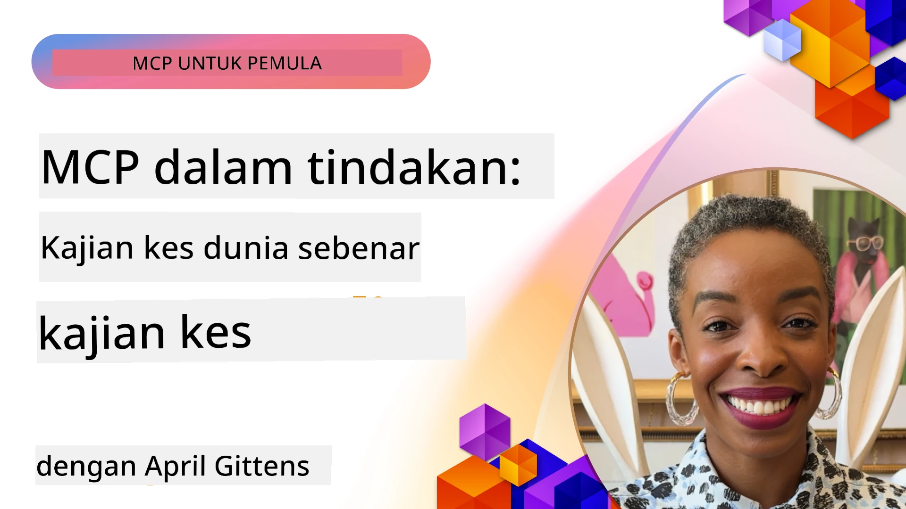

# MCP dalam Tindakan: Kajian Kes Dunia Sebenar

_(Klik imej di atas untuk menonton video pelajaran ini)_

Protokol Konteks Model (MCP) sedang mengubah cara aplikasi AI berinteraksi dengan data, alat, dan perkhidmatan. Bahagian ini mempersembahkan kajian kes dunia sebenar yang menunjukkan aplikasi praktikal MCP dalam pelbagai senario perusahaan.

## Gambaran Keseluruhan

Bahagian ini mempamerkan contoh konkrit pelaksanaan MCP, menyoroti bagaimana organisasi menggunakan protokol ini untuk menyelesaikan cabaran perniagaan yang kompleks. Dengan mengkaji kajian kes ini, anda akan mendapat wawasan tentang kepelbagaian, kebolehskalaan, dan manfaat praktikal MCP dalam senario dunia sebenar.

## Objektif Pembelajaran Utama

Dengan meneroka kajian kes ini, anda akan:

- Memahami bagaimana MCP boleh digunakan untuk menyelesaikan masalah perniagaan tertentu
- Mempelajari pelbagai corak integrasi dan pendekatan seni bina
- Mengenali amalan terbaik untuk melaksanakan MCP dalam persekitaran perusahaan
- Mendapatkan wawasan mengenai cabaran dan penyelesaian yang ditemui dalam pelaksanaan dunia sebenar
- Mengenal pasti peluang untuk menggunakan corak yang serupa dalam projek anda sendiri

## Kajian Kes Terpilih

### 1. [Ejen Perjalanan AI Azure – Pelaksanaan Rujukan](./travelagentsample.md)

Kajian kes ini mengkaji penyelesaian rujukan menyeluruh Microsoft yang menunjukkan cara membina aplikasi perancangan perjalanan berbilang ejen yang dipacu AI menggunakan MCP, Azure OpenAI, dan Azure AI Search. Projek ini mempamerkan:

- Orkestrasi berbilang ejen melalui MCP  
- Integrasi data perusahaan dengan Azure AI Search  
- Seni bina yang selamat dan boleh diskala menggunakan perkhidmatan Azure  
- Alat yang boleh dikembangkan dengan komponen MCP boleh guna semula  
- Pengalaman pengguna perbualan yang didayakan oleh Azure OpenAI  

Seni bina dan butiran pelaksanaan memberikan wawasan berharga tentang membina sistem berbilang ejen yang kompleks dengan MCP sebagai lapisan penyelarasan.

### 2. [Mengemas Kini Item Azure DevOps daripada Data YouTube](./UpdateADOItemsFromYT.md)

Kajian kes ini menunjukkan aplikasi praktikal MCP untuk mengautomasikan proses aliran kerja. Ia menunjukkan bagaimana alat MCP boleh digunakan untuk:

- Mengekstrak data daripada platform dalam talian (YouTube)  
- Mengemas kini item kerja dalam sistem Azure DevOps  
- Mewujudkan aliran kerja automasi berulang  
- Mengintegrasikan data merentasi sistem yang berbeza  

Contoh ini menggambarkan bagaimana pelaksanaan MCP yang agak mudah dapat memberikan peningkatan kecekapan yang ketara dengan mengautomasikan tugas rutin dan meningkatkan konsistensi data merentasi sistem.

### 3. [Pengambilan Dokumentasi Masa Nyata dengan MCP](./docs-mcp/README.md)

Kajian kes ini membimbing anda untuk menyambungkan klien konsol Python kepada pelayan Model Context Protocol (MCP) untuk mengambil dan merekod dokumentasi Microsoft yang kontekstual dan masa nyata. Anda akan belajar bagaimana untuk:

- Menyambung kepada pelayan MCP menggunakan klien Python dan SDK MCP rasmi  
- Menggunakan klien HTTP streaming untuk pengambilan data masa nyata yang cekap  
- Memanggil alat dokumentasi pada pelayan dan merekod respons terus ke konsol  
- Mengintegrasikan dokumentasi Microsoft terkini ke dalam aliran kerja tanpa meninggalkan terminal  

Bab ini termasuk tugasan praktikal, contoh kod yang berfungsi minimum, dan pautan kepada sumber tambahan untuk pembelajaran lebih mendalam. Lihat panduan penuh dan kod dalam bab yang dipautkan untuk memahami bagaimana MCP boleh mengubah akses dokumentasi dan produktiviti pembangun dalam persekitaran berasaskan konsol.

### 4. [Aplikasi Web Penjana Pelan Kajian Interaktif dengan MCP](./docs-mcp/README.md)

Kajian kes ini menunjukkan bagaimana membina aplikasi web interaktif menggunakan Chainlit dan Model Context Protocol (MCP) untuk menjana pelan kajian yang diperibadikan bagi mana-mana topik. Pengguna boleh menentukan subjek (seperti "pensijilan AI-900") dan tempoh kajian (contohnya, 8 minggu), dan aplikasi akan menyediakan pecahan mengikut minggu bagi kandungan yang disyorkan. Chainlit membolehkan antara muka sembang perbualan, menjadikan pengalaman lebih menarik dan adaptif.

- Aplikasi web perbualan didayakan oleh Chainlit  
- Permintaan yang dikawal pengguna untuk topik dan tempoh  
- Cadangan kandungan mengikut minggu menggunakan MCP  
- Respons masa nyata dan adaptif dalam antara muka sembang  

Projek ini menggambarkan bagaimana AI perbualan dan MCP boleh digabungkan untuk mencipta alat pendidikan dinamik yang dikawal pengguna dalam persekitaran web moden.

### 5. [Dokumen Dalam Penyunting dengan Pelayan MCP dalam VS Code](./docs-mcp/README.md)

Kajian kes ini menunjukkan bagaimana anda boleh membawa Microsoft Learn Docs terus ke persekitaran VS Code anda menggunakan pelayan MCP—tidak perlu bertukar tab penyemak imbas lagi! Anda akan melihat bagaimana untuk:

- Mencari dan membaca dokumen secara serta-merta dalam VS Code menggunakan panel MCP atau palet perintah  
- Merujuk dokumentasi dan memasukkan pautan terus ke dalam README atau fail markdown kursus anda  
- Menggunakan GitHub Copilot dan MCP bersama untuk aliran kerja dokumentasi dan kod yang lancar bertenaga AI  
- Mengesahkan dan mempertingkat dokumentasi anda dengan maklum balas masa nyata dan ketepatan sumber Microsoft  
- Mengintegrasikan MCP dengan aliran kerja GitHub untuk pengesahan dokumentasi berterusan  

Pelaksanaan merangkumi:

- Konfigurasi `.vscode/mcp.json` contoh untuk persediaan mudah  
- Panduan melalui tangkapan skrin pengalaman dalam penyunting  
- Petua untuk menggabungkan Copilot dan MCP bagi produktiviti maksimum  

Senario ini sesuai untuk penulis kursus, penulis dokumentasi, dan pembangun yang ingin kekal fokus dalam penyunting mereka semasa bekerja dengan dokumen, Copilot, dan alat pengesahan—semuanya didayakan oleh MCP.

### 6. [Penciptaan Pelayan MCP APIM](./apimsample.md)

Kajian kes ini memberikan panduan langkah demi langkah tentang cara mencipta pelayan MCP menggunakan Azure API Management (APIM). Ia merangkumi:

- Menyediakan pelayan MCP dalam Azure API Management  
- Mendedahkan operasi API sebagai alat MCP  
- Mengkonfigurasi dasar untuk penghadkan kadar dan keselamatan  
- Menguji pelayan MCP menggunakan Visual Studio Code dan GitHub Copilot  

Contoh ini menunjukkan bagaimana memanfaatkan keupayaan Azure untuk mencipta pelayan MCP yang kukuh yang boleh digunakan dalam pelbagai aplikasi, meningkatkan integrasi sistem AI dengan API perusahaan.

### 7. [Daftar MCP GitHub — Mempercepatkan Integrasi Agentik](https://github.com/mcp)

Kajian kes ini mengkaji bagaimana Daftar MCP GitHub, yang dilancarkan pada September 2025, menangani cabaran kritikal dalam ekosistem AI: penemuan dan penyebaran pelayan Model Context Protocol (MCP) yang terpecah-pecah.

#### Gambaran Keseluruhan  
**Daftar MCP** menyelesaikan masalah yang semakin membesar iaitu pelayan MCP yang berselerak di pelbagai repositori dan daftar, yang sebelum ini menyebabkan integrasi menjadi perlahan dan mudah berlaku kesilapan. Pelayan-pelayan ini membolehkan ejen AI berinteraksi dengan sistem luaran seperti API, pangkalan data, dan sumber dokumentasi.

#### Pernyataan Masalah  
Pembangun yang membina aliran kerja agentik menghadapi beberapa cabaran:  
- **Penemuan terhad** pelayan MCP di pelbagai platform  
- **Soalan persediaan berulang** yang berselerak di forum dan dokumentasi  
- **Risiko keselamatan** daripada sumber yang tidak disahkan dan tidak dipercayai  
- **Ketiadaan standardisasi** dalam kualiti dan keserasian pelayan  

#### Seni Bina Penyelesaian  
Daftar MCP GitHub memusatkan pelayan MCP yang dipercayai dengan ciri utama:  
- **Pemasangan satu klik** integrasi melalui VS Code untuk persediaan mudah  
- **Susunan signal-over-noise** berdasarkan bintang, aktiviti, dan pengesahan komuniti  
- **Integrasi langsung** dengan GitHub Copilot dan alat serasi MCP lain  
- **Model sumbangan terbuka** membolehkan komuniti dan rakan perusahaan menyumbang  

#### Impak Perniagaan  
Daftar ini telah memberikan penambahbaikan yang ketara:  
- **Penambahan pantas** untuk pembangun menggunakan alat seperti Microsoft Learn MCP Server, yang menstrimkan dokumentasi rasmi terus ke dalam ejen  
- **Produktiviti lebih baik** melalui pelayan khusus seperti `github-mcp-server`, yang membolehkan automasi GitHub dengan bahasa semula jadi (pembuatan PR, pelaksanaan semula CI, pengimbasan kod)  
- **Kepercayaan ekosistem lebih kukuh** menerusi senarai yang dikurasi dan standard konfigurasi yang telus  

#### Nilai Strategik  
Bagi pengamal yang mengkhusus dalam pengurusan kitaran hayat ejen dan aliran kerja yang boleh diulang, Daftar MCP menyediakan:  
- **Keupayaan penyebaran ejen modular** dengan komponen standard  
- **Saluran penilaian berasaskan daftar** untuk pengujian dan pengesahan konsisten  
- **Interoperabiliti merentasi alat** yang membolehkan integrasi lancar antara platform AI berbeza  

Kajian kes ini menunjukkan bahawa Daftar MCP bukan sekadar direktori—ia adalah platform asas untuk integrasi model berskala dan penyebaran sistem agentik dunia sebenar.

## Kesimpulan

Tujuh kajian kes menyeluruh ini menunjukkan kepelbagaian yang luar biasa dan aplikasi praktikal Protokol Konteks Model merentasi pelbagai senario dunia sebenar. Daripada sistem perancangan perjalanan pelbagai ejen yang kompleks dan pengurusan API perusahaan kepada aliran kerja dokumentasi yang mudah dan Daftar MCP GitHub yang revolusioner, contoh ini mempamerkan bagaimana MCP menyediakan cara standard, boleh diskala untuk menghubungkan sistem AI dengan alat, data, dan perkhidmatan yang mereka perlukan untuk menyampaikan nilai yang luar biasa.

Kajian kes merangkumi pelbagai dimensi pelaksanaan MCP:  
- **Integrasi Perusahaan**: Pengurusan API Azure dan automasi Azure DevOps  
- **Orkestrasi Berbilang Ejen**: Perancangan perjalanan dengan ejen AI yang diselaraskan  
- **Produktiviti Pembangun**: Integrasi VS Code dan akses dokumentasi masa nyata  
- **Pembangunan Ekosistem**: Daftar MCP GitHub sebagai platform asas  
- **Aplikasi Pendidikan**: Penjana pelan kajian interaktif dan antara muka perbualan  

Dengan mengkaji pelaksanaan ini, anda mendapat wawasan kritikal dalam:  
- **Corak seni bina** untuk skala dan kes penggunaan berbeza  
- **Strategi pelaksanaan** yang mengimbangi fungsi dengan kebolehselenggaraan  
- **Pertimbangan keselamatan dan kebolehskalaan** untuk pengeluaran  
- **Amalan terbaik** untuk pembangunan pelayan MCP dan integrasi klien  
- **Pemikiran ekosistem** untuk membina penyelesaian berkuasa AI yang saling berkaitan  

Contoh-contoh ini secara kolektif menunjukkan bahawa MCP bukan sekadar rangka kerja teori tetapi protokol matang yang siap digunakan untuk penyelesaian praktikal cabaran perniagaan kompleks. Sama ada anda membina alat automasi mudah atau sistem berbilang ejen yang sofistikated, corak dan pendekatan yang digambarkan di sini menyediakan asas kukuh untuk projek MCP anda sendiri.

## Sumber Tambahan

- [Repositori GitHub Ejen Perjalanan AI Azure](https://github.com/Azure-Samples/azure-ai-travel-agents)  
- [Alat MCP Azure DevOps](https://github.com/microsoft/azure-devops-mcp)  
- [Alat MCP Playwright](https://github.com/microsoft/playwright-mcp)  
- [Pelayan Dokumentasi MCP Microsoft](https://github.com/MicrosoftDocs/mcp)  
- [Daftar MCP GitHub — Mempercepatkan Integrasi Agentik](https://github.com/mcp)  
- [Contoh Komuniti MCP](https://github.com/microsoft/mcp)  

## Apa Seterusnya

- Sebelumnya: [Modul 8: Amalan Terbaik](../08-BestPractices/README.md)  
- Seterusnya: [Modul 10: Mempermudah Aliran Kerja AI: Membina Pelayan MCP dengan AI Toolkit](../10-StreamliningAIWorkflowsBuildingAnMCPServerWithAIToolkit/README.md)

---

<!-- CO-OP TRANSLATOR DISCLAIMER START -->
**Penafian**:
Dokumen ini telah diterjemahkan menggunakan perkhidmatan terjemahan AI [Co-op Translator](https://github.com/Azure/co-op-translator). Walaupun kami berusaha untuk ketepatan, sila ambil maklum bahawa terjemahan automatik mungkin mengandungi kesilapan atau ketidaktepatan. Dokumen asal dalam bahasa asalnya harus dianggap sebagai sumber utama yang sah. Untuk maklumat penting, disyorkan terjemahan profesional oleh manusia. Kami tidak bertanggungjawab atas sebarang salah faham atau tafsiran yang timbul daripada penggunaan terjemahan ini.
<!-- CO-OP TRANSLATOR DISCLAIMER END -->