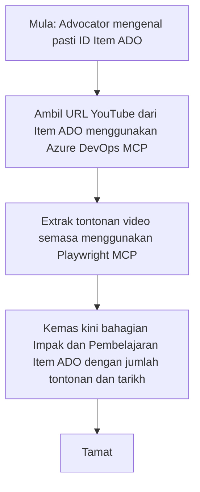

# Kajian Kes: Mengemas kini Item Azure DevOps dari Data YouTube dengan MCP

> **Penafian:** Terdapat alat dan laporan dalam talian yang boleh mengautomasikan proses mengemas kini item Azure DevOps dengan data dari platform seperti YouTube. Senario berikut disediakan semata-mata sebagai contoh kes penggunaan untuk menggambarkan bagaimana alat MCP boleh digunakan untuk automasi dan integrasi tugas.

## Gambaran Keseluruhan

Kajian kes ini menunjukkan satu contoh bagaimana Model Context Protocol (MCP) dan alat-alatnya boleh digunakan untuk mengautomasikan proses mengemas kini item kerja Azure DevOps (ADO) dengan maklumat yang diperoleh daripada platform dalam talian, seperti YouTube. Senario yang diterangkan adalah hanya satu ilustrasi daripada keupayaan lebih luas alat ini, yang boleh diadaptasi untuk banyak keperluan automasi yang serupa.

Dalam contoh ini, seorang Penyokong menjejak sesi dalam talian menggunakan item ADO, di mana setiap item termasuk URL video YouTube. Dengan memanfaatkan alat MCP, Penyokong boleh memastikan item ADO sentiasa dikemas kini dengan metrik video terkini, seperti bilangan tontonan, secara berulang dan automatik. Pendekatan ini boleh digeneralisasikan kepada kes penggunaan lain di mana maklumat dari sumber dalam talian perlu diintegrasi ke dalam ADO atau sistem lain.

## Senario

Seorang Penyokong bertanggungjawab untuk menjejak impak sesi dalam talian dan penglibatan komuniti. Setiap sesi direkod sebagai item kerja ADO dalam projek 'DevRel', dan item kerja itu mengandungi medan untuk URL video YouTube. Untuk melaporkan capaian sesi dengan tepat, Penyokong perlu mengemas kini item ADO dengan bilangan tontonan video semasa dan tarikh maklumat ini diperoleh.

## Alat Digunakan

- [Azure DevOps MCP](https://github.com/microsoft/azure-devops-mcp): Membolehkan akses dan kemas kini programatik kepada item kerja ADO melalui MCP.
- [Playwright MCP](https://github.com/microsoft/playwright-mcp): Mengautomasi tindakan pelayar untuk mengekstrak data langsung dari laman web, seperti statistik video YouTube.

## Aliran Kerja Langkah demi Langkah

1. **Kenal pasti Item ADO**: Mulakan dengan ID item kerja ADO (contoh, 1234) dalam projek 'DevRel'.
2. **Dapatkan URL YouTube**: Gunakan alat Azure DevOps MCP untuk mendapatkan URL YouTube dari item kerja.
3. **Ekstrak Bilangan Tontonan Video**: Gunakan alat Playwright MCP untuk melayari URL YouTube dan mengekstrak bilangan tontonan semasa.
4. **Kemas kini Item ADO**: Tulis bilangan tontonan terkini dan tarikh pengambilan data ke dalam seksyen 'Impact and Learnings' item kerja ADO menggunakan alat Azure DevOps MCP.

## Contoh Prompt

```bash
- Work with the ADO Item ID: 1234
- The project is '2025-Awesome'
- Get the YouTube URL for the ADO item
- Use Playwright to get the current views from the YouTube video
- Update the ADO item with the current video views and the updated date of the information
```

## Carta Alir Mermaid


## Pelaksanaan Teknikal

- **Pengurusan MCP**: Aliran kerja ini diaturkan oleh pelayan MCP, yang mengkoordinasi penggunaan kedua-dua alat Azure DevOps MCP dan Playwright MCP.
- **Automasi**: Proses boleh dicetus secara manual atau dijadualkan untuk dijalankan pada sela masa tetap bagi mengekalkan item ADO sentiasa dikemas kini.
- **Kebolehluasan**: Corak yang sama boleh diperluaskan untuk mengemas kini item ADO dengan metrik dalam talian lain (contoh, suka, komen) atau dari platform lain.

## Hasil dan Impak

- **Kecekapan**: Mengurangkan usaha manual bagi Penyokong dengan mengautomasikan pengambilan dan kemas kini metrik video.
- **Ketepatan**: Menjamin item ADO mencerminkan data terkini yang tersedia dari sumber dalam talian.
- **Pengulangan**: Menyediakan aliran kerja yang boleh digunakan semula untuk senario serupa yang melibatkan sumber data atau metrik lain.

## Rujukan

- [Azure DevOps MCP](https://github.com/microsoft/azure-devops-mcp)
- [Playwright MCP](https://github.com/microsoft/playwright-mcp)
- [Model Context Protocol (MCP)](https://modelcontextprotocol.io/)

## Apa Seterusnya

- Kembali ke: [Gambaran Keseluruhan Kajian Kes](./README.md)
- Seterusnya: [Pengambilan Dokumentasi Masa Nyata dengan MCP](./docs-mcp/README.md)

---

<!-- CO-OP TRANSLATOR DISCLAIMER START -->
**Penafian**:  
Dokumen ini telah diterjemahkan menggunakan perkhidmatan terjemahan AI [Co-op Translator](https://github.com/Azure/co-op-translator). Walaupun kami berusaha untuk ketepatan, sila maklum bahawa terjemahan automatik mungkin mengandungi kesilapan atau ketidaktepatan. Dokumen asal dalam bahasa asalnya harus dianggap sebagai sumber yang sahih. Untuk maklumat penting, terjemahan oleh profesional manusia adalah disyorkan. Kami tidak bertanggungjawab atas sebarang salah faham atau salah tafsir yang timbul daripada penggunaan terjemahan ini.
<!-- CO-OP TRANSLATOR DISCLAIMER END -->