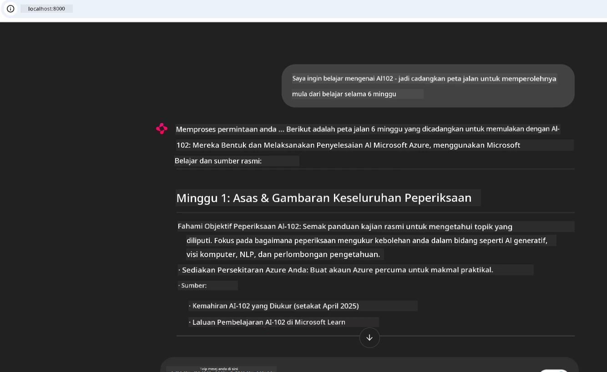

# Kajian Kes: Menyambung ke Pelayan Microsoft Learn Docs MCP dari Klien

Pernahkah anda mendapati diri anda terpaksa bertukar antara tapak dokumentasi, Stack Overflow, dan tab enjin carian yang tidak berkesudahan, sambil cuba menyelesaikan masalah dalam kod anda? Mungkin anda menyimpan monitor kedua hanya untuk dokumen, atau anda sentiasa alt-tab antara IDE dan pelayar. Bukankah lebih baik jika anda dapat membawa dokumentasi terus ke dalam aliran kerja anda—diintegrasikan ke dalam aplikasi anda, IDE, atau bahkan alat tersuai anda sendiri? Dalam kajian kes ini, kita akan meneroka bagaimana melakukan perkara itu dengan menyambung terus ke pelayan Microsoft Learn Docs MCP dari aplikasi klien anda sendiri.

## Gambaran Keseluruhan

Pembangunan moden bukan sahaja menulis kod—ia adalah tentang mendapatkan maklumat yang tepat pada masa yang tepat. Dokumentasi ada di mana-mana, tetapi jarang berada di tempat yang anda perlukan paling banyak: di dalam alat dan aliran kerja anda. Dengan mengintegrasikan pengambilan dokumentasi terus ke dalam aplikasi anda, anda boleh menjimatkan masa, mengurangkan pertukaran konteks, dan meningkatkan produktiviti. Dalam bahagian ini, kami akan tunjukkan cara menyambungkan klien ke pelayan Microsoft Learn Docs MCP, supaya anda boleh mengakses dokumentasi masa nyata yang peka konteks tanpa meninggalkan aplikasi anda.

Kami akan melalui proses membina sambungan, menghantar permintaan, dan mengendalikan respons penstriman dengan cekap. Pendekatan ini bukan sahaja mempermudah aliran kerja anda tetapi juga membuka peluang untuk membina alat pembangun yang lebih pintar dan membantu.

## Objektif Pembelajaran

Mengapa kita melakukan ini? Kerana pengalaman pembangun terbaik adalah yang menghilangkan halangan. Bayangkan dunia di mana penyunting kod, chatbot, atau aplikasi web anda boleh menjawab soalan dokumentasi dengan serta-merta, menggunakan kandungan terkini dari Microsoft Learn. Menjelang akhir bab ini, anda akan tahu bagaimana untuk:

- Memahami asas komunikasi pelayan-klien MCP untuk dokumentasi
- Melaksanakan aplikasi konsol atau web untuk menyambung ke pelayan Microsoft Learn Docs MCP
- Menggunakan klien HTTP penstriman untuk pengambilan dokumentasi masa nyata
- Merekod dan mentafsir respons dokumentasi dalam aplikasi anda

Anda akan melihat bagaimana kemahiran ini boleh membantu anda membina alat yang bukan sahaja responsif, tetapi benar-benar interaktif dan peka konteks.

## Senario 1 - Pengambilan Dokumentasi Masa Nyata dengan MCP

Dalam senario ini, kami akan tunjukkan cara menyambungkan klien ke pelayan Microsoft Learn Docs MCP, supaya anda boleh mengakses dokumentasi masa nyata yang peka konteks tanpa meninggalkan aplikasi anda.

Mari kita praktikkan. Tugasan anda adalah untuk menulis aplikasi yang menyambung ke pelayan Microsoft Learn Docs MCP, memanggil alat `microsoft_docs_search`, dan merekod respons penstriman ke konsol.

### Mengapa pendekatan ini?
Kerana ia adalah asas untuk membina integrasi yang lebih maju—sama ada anda mahu mengendalikan chatbot, sambungan IDE, atau papan pemuka web.

Anda akan dapati kod dan arahan untuk senario ini dalam folder [`solution`](./solution/README.md) dalam kajian kes ini. Langkah-langkah akan memandu anda melalui penyediaan sambungan:
- Gunakan SDK MCP rasmi dan klien HTTP yang boleh dipestream untuk sambungan
- Panggil alat `microsoft_docs_search` dengan parameter carian untuk mendapatkan dokumentasi
- Laksanakan pencatatan dan pengendalian ralat yang betul
- Buat antara muka konsol interaktif supaya pengguna boleh memasukkan banyak pertanyaan carian

Senario ini menunjukkan bagaimana untuk:
- Menyambung ke pelayan Docs MCP
- Menghantar pertanyaan
- Menguraikan dan mencetak hasil

Ini adalah contoh bagaimana penyelesaian dijalankan:

```
Prompt> What is Azure Key Vault?
Answer> Azure Key Vault is a cloud service for securely storing and accessing secrets. ...
```

Di bawah adalah penyelesaian contoh minimal. Kod penuh dan butiran tersedia dalam folder penyelesaian.

<details>
<summary>Python</summary>

```python
import asyncio
from mcp.client.streamable_http import streamablehttp_client
from mcp import ClientSession

async def main():
    async with streamablehttp_client("https://learn.microsoft.com/api/mcp") as (read_stream, write_stream, _):
        async with ClientSession(read_stream, write_stream) as session:
            await session.initialize()
            result = await session.call_tool("microsoft_docs_search", {"query": "Azure Functions best practices"})
            print(result.content)

if __name__ == "__main__":
    asyncio.run(main())
```

- Untuk implementasi lengkap dan pencatatan, lihat [`scenario1.py`](../../../../09-CaseStudy/docs-mcp/solution/python/scenario1.py).
- Untuk arahan pemasangan dan penggunaan, lihat fail [`README.md`](./solution/python/README.md) dalam folder yang sama.
</details>


## Senario 2 - Aplikasi Web Penjana Pelan Kajian Interaktif dengan MCP

Dalam senario ini, anda akan belajar cara mengintegrasikan Docs MCP ke dalam projek pembangunan web. Matlamatnya adalah untuk membolehkan pengguna mencari dokumentasi Microsoft Learn terus dari antara muka web, menjadikan dokumentasi boleh diakses serta-merta dalam aplikasi atau tapak anda.

Anda akan lihat bagaimana untuk:
- Menyediakan aplikasi web
- Menyambung ke pelayan Docs MCP
- Mengendalikan input pengguna dan memaparkan hasil

Ini adalah contoh bagaimana penyelesaian dijalankan:

```
User> I want to learn about AI102 - so suggest the roadmap to get it started from learn for 6 weeks

Assistant> Here’s a detailed 6-week roadmap to start your preparation for the AI-102: Designing and Implementing a Microsoft Azure AI Solution certification, using official Microsoft resources and focusing on exam skills areas:

---
## Week 1: Introduction & Fundamentals
- **Understand the Exam**: Review the [AI-102 exam skills outline](https://learn.microsoft.com/en-us/credentials/certifications/exams/ai-102/).
- **Set up Azure**: Sign up for a free Azure account if you don't have one.
- **Learning Path**: [Introduction to Azure AI services](https://learn.microsoft.com/en-us/training/modules/intro-to-azure-ai/)
- **Focus**: Get familiar with Azure portal, AI capabilities, and necessary tools.

....more weeks of the roadmap...

Let me know if you want module-specific recommendations or need more customized weekly tasks!
```

Di bawah adalah penyelesaian contoh minimal. Kod penuh dan butiran tersedia dalam folder penyelesaian.



<details>
<summary>Python (Chainlit)</summary>

Chainlit adalah rangka kerja untuk membina aplikasi web AI perbualan. Ia memudahkan penciptaan chatbot interaktif dan pembantu yang boleh memanggil alat MCP dan memaparkan hasil masa nyata. Ia sesuai untuk prototaip pantas dan antara muka mesra pengguna.

```python
import chainlit as cl
import requests

MCP_URL = "https://learn.microsoft.com/api/mcp"

@cl.on_message
def handle_message(message):
    query = {"question": message}
    response = requests.post(MCP_URL, json=query)
    if response.ok:
        result = response.json()
        cl.Message(content=result.get("answer", "No answer found.")).send()
    else:
        cl.Message(content="Error: " + response.text).send()
```

- Untuk implementasi lengkap, lihat [`scenario2.py`](../../../../09-CaseStudy/docs-mcp/solution/python/scenario2.py).
- Untuk arahan penyediaan dan menjalankan, lihat [`README.md`](./solution/python/README.md).
</details>


## Senario 3: Dokumentasi Dalam Penyunting dengan Pelayan MCP dalam VS Code

Jika anda ingin mendapatkan Microsoft Learn Docs terus dalam VS Code anda (daripada bertukar tab pelayar), anda boleh menggunakan pelayan MCP dalam penyunting anda. Ini membolehkan anda:
- Mencari dan membaca dokumen dalam VS Code tanpa meninggalkan persekitaran pengkodan anda.
- Merujuk dokumentasi dan menyisip pautan terus ke README atau fail kursus anda.
- Menggabungkan GitHub Copilot dan MCP bersama untuk aliran kerja dokumentasi berkuasa AI yang lancar.

**Anda akan belajar bagaimana untuk:**
- Menambah fail `.vscode/mcp.json` yang sah di akar ruang kerja anda (lihat contoh di bawah).
- Membuka panel MCP atau menggunakan palet perintah dalam VS Code untuk mencari dan menyisip dokumen.
- Merujuk dokumentasi terus dalam fail markdown semasa anda bekerja.
- Menggabungkan aliran kerja ini dengan GitHub Copilot untuk produktiviti yang lebih tinggi.

Berikut adalah contoh bagaimana untuk menyediakan pelayan MCP dalam VS Code:

```json
{
  "servers": {
    "LearnDocsMCP": {
      "url": "https://learn.microsoft.com/api/mcp"
    }
  }
}
```

</details>

> Untuk panduan terperinci dengan tangkapan layar dan panduan langkah demi langkah, lihat [`README.md`](./solution/scenario3/README.md).


Pendekatan ini sesuai untuk sesiapa yang membina kursus teknikal, menulis dokumentasi, atau membangunkan kod dengan keperluan rujukan yang kerap.

## Penjelasan Utama

Mengintegrasikan dokumentasi terus ke dalam alat anda bukan sekadar kemudahan—ia adalah perubahan besar untuk produktiviti. Dengan menyambung ke pelayan Microsoft Learn Docs MCP dari klien anda, anda boleh:

- Menghapuskan pertukaran konteks antara kod dan dokumentasi anda
- Mendapatkan dokumen terkini dan peka konteks secara masa nyata
- Membina alat pembangun yang lebih pintar dan interaktif

Kemahiran ini akan membantu anda mencipta penyelesaian yang bukan sahaja cekap, tetapi juga menyeronokkan untuk digunakan.

## Sumber Tambahan

Untuk mendalami pemahaman anda, terokai sumber rasmi berikut:

- [Microsoft Learn Docs MCP Server (GitHub)](https://github.com/MicrosoftDocs/mcp)
- [Mulakan dengan Azure MCP Server (mcp-python)](https://learn.microsoft.com/en-us/azure/developer/azure-mcp-server/get-started#create-the-python-app)
- [Apa itu Azure MCP Server?](https://learn.microsoft.com/en-us/azure/developer/azure-mcp-server/)
- [Pengenalan Protokol Konteks Model (MCP)](https://modelcontextprotocol.io/introduction)
- [Tambah plugin dari Pelayan MCP (Python)](https://learn.microsoft.com/en-us/semantic-kernel/concepts/plugins/adding-mcp-plugins)

## Apa Yang Seterusnya

- Kembali ke: [Gambaran Keseluruhan Kajian Kes](../README.md)
- Teruskan ke: [Modul 10: Melancarkan Aliran Kerja AI dengan AI Toolkit](../../10-StreamliningAIWorkflowsBuildingAnMCPServerWithAIToolkit/README.md)

---

<!-- CO-OP TRANSLATOR DISCLAIMER START -->
**Penafian**:  
Dokumen ini telah diterjemahkan menggunakan perkhidmatan terjemahan AI [Co-op Translator](https://github.com/Azure/co-op-translator). Walaupun kami berusaha untuk ketepatan, sila ambil maklum bahawa terjemahan automatik mungkin mengandungi kesilapan atau ketidaktepatan. Dokumen asal dalam bahasa asalnya hendaklah dianggap sebagai sumber yang sahih. Untuk maklumat kritikal, terjemahan profesional oleh manusia adalah disyorkan. Kami tidak bertanggungjawab atas sebarang salah faham atau salah tafsir yang timbul daripada penggunaan terjemahan ini.
<!-- CO-OP TRANSLATOR DISCLAIMER END -->