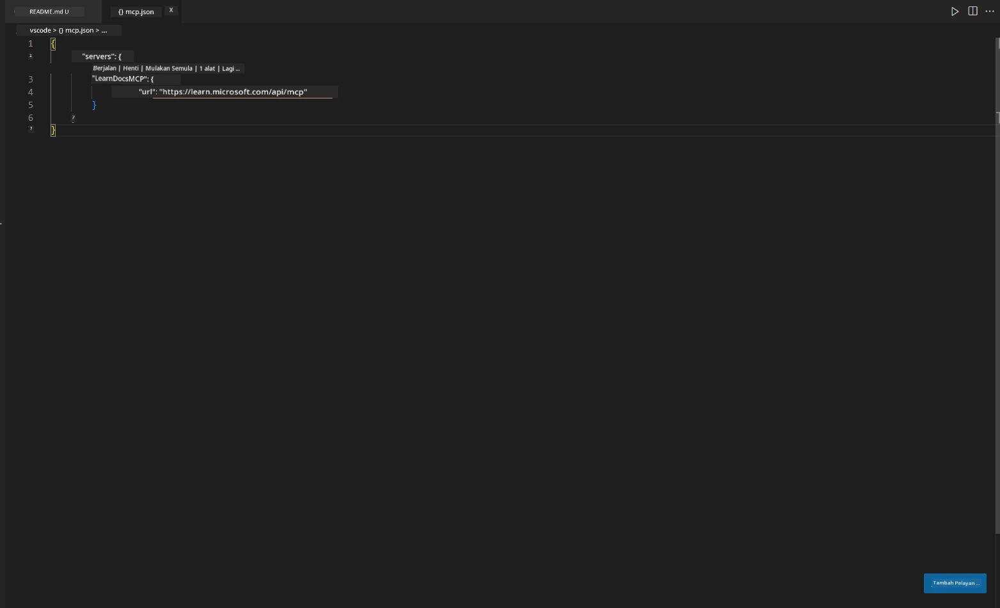
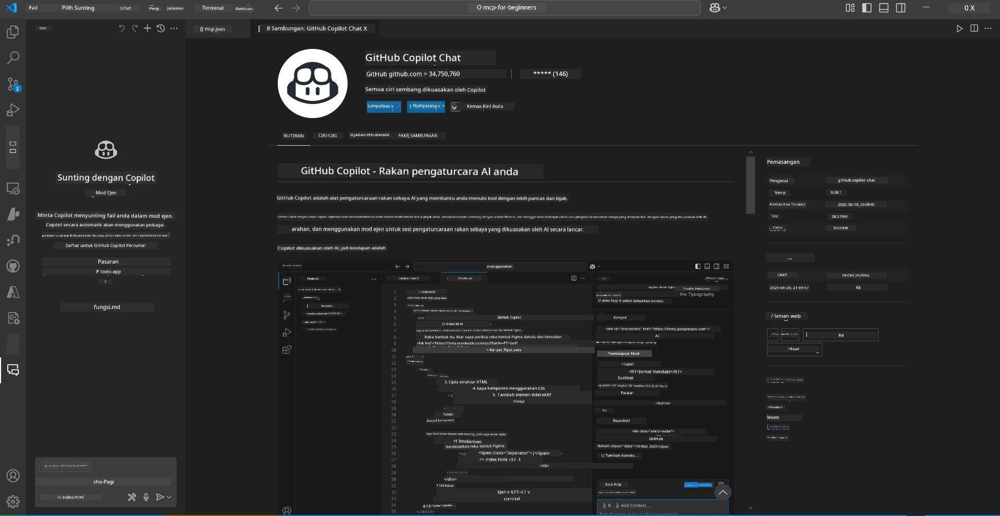
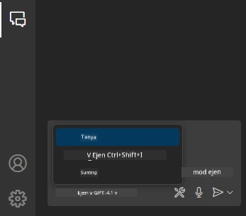
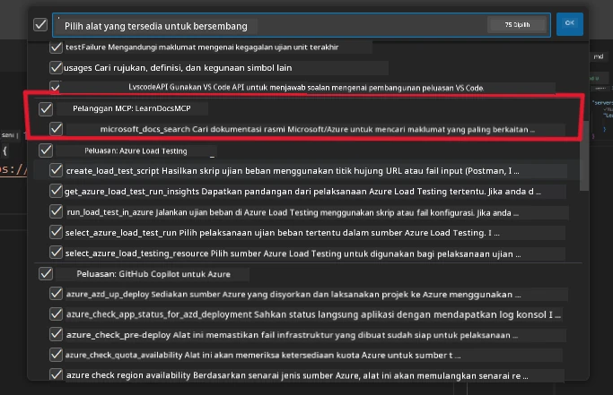
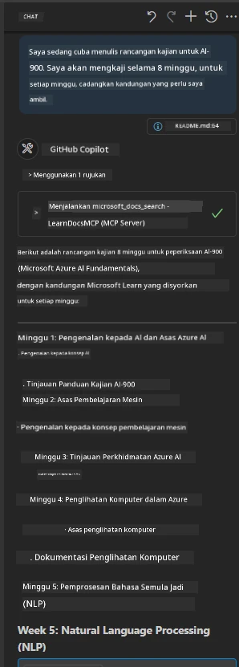
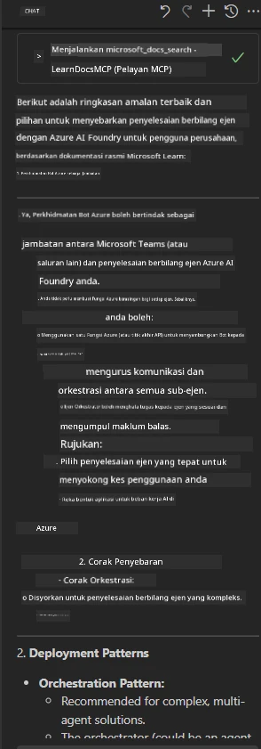

# Senario 3: Dokumen Dalam Editor dengan MCP Server dalam VS Code

## Gambaran Keseluruhan

Dalam senario ini, anda akan belajar cara membawa Microsoft Learn Docs terus ke dalam persekitaran Visual Studio Code anda menggunakan server MCP. Daripada sentiasa bertukar tab pelayar untuk mencari dokumentasi, anda boleh mengakses, mencari, dan merujuk dokumen rasmi terus di dalam editor anda. Pendekatan ini memudahkan aliran kerja anda, mengekalkan fokus, dan membolehkan integrasi lancar dengan alat seperti GitHub Copilot.

- Cari dan baca dokumen dalam VS Code tanpa meninggalkan persekitaran pengkodan anda.
- Rujuk dokumentasi dan masukkan pautan terus ke dalam fail README atau fail kursus anda.
- Gunakan GitHub Copilot dan MCP bersama-sama untuk aliran kerja dokumentasi berkuasa AI yang lancar.

## Objektif Pembelajaran

Menjelang akhir bab ini, anda akan memahami cara menyediakan dan menggunakan server MCP dalam VS Code untuk meningkatkan aliran kerja dokumentasi dan pembangunan anda. Anda akan dapat:

- Konfigurasikan ruang kerja anda untuk menggunakan server MCP bagi pencarian dokumentasi.
- Cari dan masukkan dokumentasi terus dari dalam VS Code.
- Gabungkan kuasa GitHub Copilot dan MCP untuk aliran kerja yang lebih produktif dan dipertingkatkan AI.

Kemahiran ini akan membantu anda kekal fokus, meningkatkan kualiti dokumentasi, dan meningkatkan produktiviti anda sebagai pembangun atau penulis teknikal.

## Penyelesaian

Untuk mencapai akses dokumentasi dalam editor, anda akan mengikuti beberapa langkah yang mengintegrasikan server MCP dengan VS Code dan GitHub Copilot. Penyelesaian ini sesuai untuk penulis kursus, penulis dokumentasi, dan pembangun yang ingin mengekalkan fokus dalam editor semasa bekerja dengan dokumen dan Copilot.

- Tambah pautan rujukan dengan cepat ke README semasa menulis dokumentasi kursus atau projek.
- Gunakan Copilot untuk menjana kod dan MCP untuk mencari serta memetik dokumen yang relevan dengan segera.
- Kekal fokus dalam editor anda dan tingkatkan produktiviti.

### Panduan Langkah demi Langkah

Untuk memulakan, ikut langkah-langkah berikut. Untuk setiap langkah, anda boleh menambah tangkapan skrin dari folder aset untuk menggambarkan proses secara visual.

1. **Tambah konfigurasi MCP:**
   Di akar projek anda, buat fail `.vscode/mcp.json` dan tambah konfigurasi berikut:
   ```json
   {
     "servers": {
       "LearnDocsMCP": {
         "url": "https://learn.microsoft.com/api/mcp"
       }
     }
   }
   ```
   Konfigurasi ini memberitahu VS Code cara untuk berhubung dengan [`Microsoft Learn Docs MCP server`](https://github.com/MicrosoftDocs/mcp).
   
   
    
2. **Buka panel GitHub Copilot Chat:**
   Jika anda belum memasang sambungan GitHub Copilot, pergi ke paparan Extensions dalam VS Code dan pasang ia. Anda boleh muat turun terus dari [Visual Studio Code Marketplace](https://marketplace.visualstudio.com/items?itemName=GitHub.copilot-chat). Kemudian, buka panel Copilot Chat dari bar sisi.

   

3. **Aktifkan mod agen dan sahkan alat:**
   Dalam panel Copilot Chat, aktifkan mod agen.

   

   Selepas mengaktifkan mod agen, sahkan bahawa server MCP disenaraikan sebagai salah satu alat yang tersedia. Ini memastikan agen Copilot boleh mengakses server dokumentasi untuk mendapatkan maklumat yang relevan.
   
   
4. **Mulakan sembang baru dan beri arahan kepada agen:**
   Buka sembang baru dalam panel Copilot Chat. Anda kini boleh memberi arahan kepada agen dengan soalan dokumentasi anda. Agen akan menggunakan server MCP untuk mendapatkan dan memaparkan dokumentasi Microsoft Learn yang relevan terus dalam editor anda.

   - *"Saya sedang cuba menulis pelan pembelajaran untuk topik X. Saya akan belajar selama 8 minggu, untuk setiap minggu, cadangkan kandungan yang patut saya ambil."*

   

5. **Pertanyaan Langsung:**

   > Mari kita ambil pertanyaan langsung dari bahagian [#get-help](https://discord.gg/D6cRhjHWSC) dalam Azure AI Foundry Discord ([lihat mesej asal](https://discord.com/channels/1113626258182504448/1385498306720829572)):
   
   *"Saya sedang mencari jawapan tentang cara untuk melaksanakan penyelesaian multi-agen dengan agen AI yang dibangunkan di Azure AI Foundry. Saya lihat tiada kaedah pelaksanaan langsung, seperti saluran Copilot Studio. Jadi, apakah cara berbeza untuk melakukan pelaksanaan ini supaya pengguna perusahaan boleh berinteraksi dan menyelesaikan tugasan?
Terdapat banyak artikel/blog yang mengatakan kita boleh menggunakan perkhidmatan Azure Bot untuk melakukan kerja ini yang boleh bertindak sebagai jambatan antara MS Teams dan Agen Azure AI Foundry, adakah ini akan berfungsi jika saya menyediakan bot Azure yang berhubung dengan Orchestrator Agent di Azure AI Foundry melalui fungsi Azure untuk melakukan orkestrasi atau saya perlu membuat fungsi Azure untuk setiap agen AI yang merupakan sebahagian daripada penyelesaian multi-agen untuk melakukan orkestrasi di rangka kerja Bot? Sebarang cadangan lain amat dialu-alukan.
"*

   

   Agen akan membalas dengan pautan dokumentasi dan ringkasan yang relevan, yang kemudian boleh anda masukkan terus ke dalam fail markdown anda atau gunakan sebagai rujukan dalam kod anda.
   
### Contoh Pertanyaan

Berikut adalah beberapa contoh pertanyaan yang boleh anda cuba. Pertanyaan ini akan menunjukkan bagaimana server MCP dan Copilot boleh bekerjasama untuk menyediakan dokumentasi serta rujukan yang segera dan berasaskan konteks tanpa meninggalkan VS Code:

- "Tunjukkan cara menggunakan pencetus Azure Functions."
- "Masukkan pautan ke dokumentasi rasmi untuk Azure Key Vault."
- "Apakah amalan terbaik untuk mengamankan sumber Azure?"
- "Cari panduan permulaan untuk perkhidmatan Azure AI."

Pertanyaan ini akan menunjukkan bagaimana server MCP dan Copilot boleh bekerjasama untuk menyediakan dokumentasi serta rujukan yang segera dan berasaskan konteks tanpa meninggalkan VS Code.

---

**Penafian**:  
Dokumen ini telah diterjemahkan menggunakan perkhidmatan terjemahan AI [Co-op Translator](https://github.com/Azure/co-op-translator). Walaupun kami berusaha untuk ketepatan, sila ambil maklum bahawa terjemahan automatik mungkin mengandungi kesilapan atau ketidaktepatan. Dokumen asal dalam bahasa asalnya harus dianggap sebagai sumber yang sahih. Untuk maklumat penting, terjemahan profesional oleh manusia adalah disyorkan. Kami tidak bertanggungjawab atas sebarang salah faham atau salah tafsir yang timbul daripada penggunaan terjemahan ini.