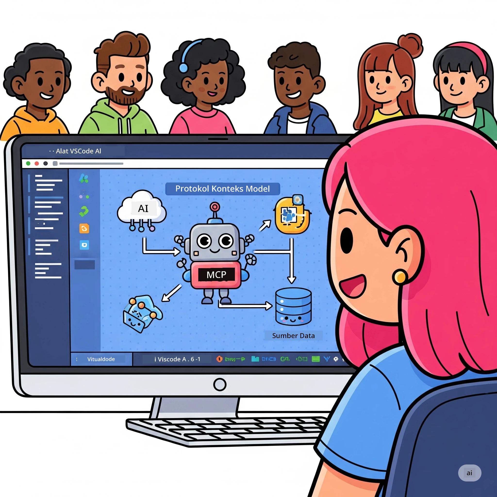
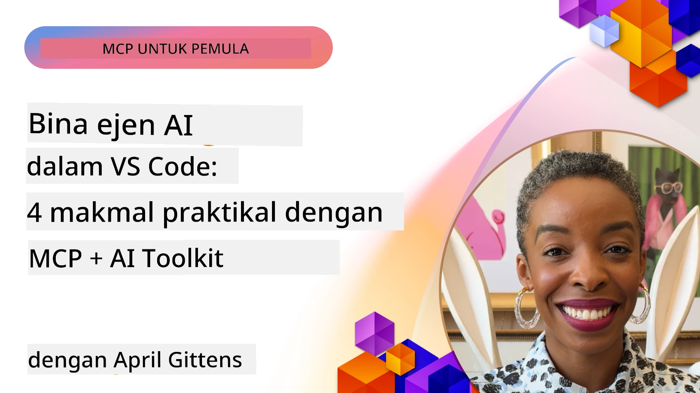

# Memperkemas Aliran Kerja AI: Membina Pelayan MCP dengan AI Toolkit

## 🎯  Gambaran Keseluruhan

_(Klik imej di atas untuk menonton video pelajaran ini)_

Selamat datang ke **Model Context Protocol (MCP) Workshop**! Bengkel praktikal menyeluruh ini menggabungkan dua teknologi tercanggih untuk merevolusikan pembangunan aplikasi AI:

- **🔗 Model Context Protocol (MCP)**: Standard terbuka untuk integrasi alat AI yang lancar
- **🛠️ AI Toolkit untuk Visual Studio Code (AITK)**: Sambungan pembangunan AI yang mantap dari Microsoft

### 🎓 Apa Yang Akan Anda Pelajari

Menjelang akhir bengkel ini, anda akan menguasai seni membina aplikasi pintar yang menghubungkan model AI dengan alat dan perkhidmatan dunia sebenar. Dari ujian automatik ke integrasi API tersuai, anda akan memperoleh kemahiran praktikal untuk menyelesaikan cabaran perniagaan yang kompleks.

## 🏗️ Tumpuan Teknologi

### 🔌 Model Context Protocol (MCP)

MCP adalah **"USB-C untuk AI"** - standard universal yang menghubungkan model AI ke alat dan sumber data luaran.

**✨ Ciri Utama:**

- 🔄 **Integrasi Standard**: Antara muka universal untuk sambungan alat AI
- 🏛️ **Senibina Fleksibel**: Pelayan tempatan & jauh melalui pemindahan stdio/SSE
- 🧰 **Ekosistem Kaya**: Alat, arahan, dan sumber dalam satu protokol
- 🔒 **Sedia Perusahaan**: Keselamatan dan kebolehpercayaan terbina dalam

**🎯 Kenapa MCP Penting:**
Seperti USB-C menghapuskan kekacauan kabel, MCP menghapuskan kerumitan integrasi AI. Satu protokol, kemungkinan tanpa had.

### 🤖 AI Toolkit untuk Visual Studio Code (AITK)

Sambungan pembangunan AI utama Microsoft yang mengubah VS Code menjadi kuasa AI.

**🚀 Keupayaan Teras:**

- 📦 **Katalog Model**: Akses model dari Azure AI, GitHub, Hugging Face, Ollama
- ⚡ **Inferens Tempatan**: Pelaksanaan CPU/GPU/NPU dioptimumkan ONNX
- 🏗️ **Pembina Ejen**: Pembangunan ejen AI visual dengan integrasi MCP
- 🎭 **Multi-Modal**: Sokongan teks, penglihatan, dan output berstruktur

**💡 Manfaat Pembangunan:**

- Pelaksanaan model tanpa konfigurasi
- Kejuruteraan arahan visual
- Kawasan ujian masa sebenar
- Integrasi pelayan MCP yang lancar

## 📚 Perjalanan Pembelajaran

### [🚀 Modul 1: Asas AI Toolkit](./lab1/README.md)

**Tempoh**: 15 minit

- 🛠️ Pasang dan konfigurasikan AI Toolkit untuk VS Code
- 🗂️ Terokai Katalog Model (100+ model dari GitHub, ONNX, OpenAI, Anthropic, Google)
- 🎮 Kuasai Interactive Playground untuk ujian model masa nyata
- 🤖 Bina ejen AI pertama anda dengan Agent Builder
- 📊 Nilai prestasi model dengan metrik terbina dalam (F1, relevansi, persamaan, koheren)
- ⚡ Pelajari pemprosesan berjangka dan sokongan multi-modal

**🎯 Hasil Pembelajaran**: Cipta ejen AI berfungsi dengan kefahaman menyeluruh tentang keupayaan AITK

### [🌐 Modul 2: MCP dengan Asas AI Toolkit](./lab2/README.md)

**Tempoh**: 20 minit

- 🧠 Kuasai senibina dan konsep Model Context Protocol (MCP)
- 🌐 Terokai ekosistem pelayan MCP Microsoft
- 🤖 Bina ejen automasi pelayar menggunakan pelayan MCP Playwright
- 🔧 Integrasi pelayan MCP dengan Agent Builder AI Toolkit
- 📊 Konfigurasikan dan uji alat MCP dalam ejen anda
- 🚀 Eksport dan laksanakan ejen diperkasa MCP untuk penggunaan produksi

**🎯 Hasil Pembelajaran**: Melaksanakan ejen AI diperkasa dengan alat luar melalui MCP

### [🔧 Modul 3: Pembangunan MCP Lanjutan dengan AI Toolkit](./lab3/README.md)

**Tempoh**: 20 minit

- 💻 Cipta pelayan MCP tersuai menggunakan AI Toolkit
- 🐍 Konfigurasikan dan gunakan SDK Python MCP terkini (v1.9.3)
- 🔍 Sediakan dan gunakan MCP Inspector untuk debugging
- 🛠️ Bina Pelayan MCP Cuaca dengan aliran kerja debugging profesional
- 🧪 Debug pelayan MCP dalam persekitaran Agent Builder dan Inspector

**🎯 Hasil Pembelajaran**: Bangunkan dan debug pelayan MCP tersuai dengan alat moden

### [🐙 Modul 4: Pembangunan MCP Praktikal - Pelayan Klon GitHub Tersuai](./lab4/README.md)

**Tempoh**: 30 minit

- 🏗️ Bina Pelayan MCP Klon GitHub dunia sebenar untuk aliran kerja pembangunan
- 🔄 Laksanakan klon repositori pintar dengan pengesahan dan pengendalian kesilapan
- 📁 Cipta pengurusan direktori bijak dan integrasi VS Code
- 🤖 Gunakan Mod Ejen GitHub Copilot dengan alat MCP tersuai
- 🛡️ Gunakan kebolehpercayaan sedia produksi dan keserasian merentas platform

**🎯 Hasil Pembelajaran**: Deploy pelayan MCP sedia produksi yang memperkemas aliran kerja pembangunan sebenar

## 💡 Aplikasi & Impak Dunia Sebenar

### 🏢 Kes Penggunaan Perusahaan

#### 🔄 Automasi DevOps

Transformasikan aliran kerja pembangunan anda dengan automasi pintar:

- **Pengurusan Repositori Pintar**: Semakan kod dan keputusan penggabungan dipacu AI
- **CI/CD Pintar**: Pengoptimasian saluran automatik berdasarkan perubahan kod
- **Triage Isu**: Klasifikasi dan tugasan bug automatik

#### 🧪 Revolusi Jaminan Kualiti

Tingkatkan ujian dengan automasi dipacu AI:

- **Penjanaan Ujian Pintar**: Cipta suite ujian menyeluruh secara automatik
- **Ujian Regresi Visual**: Pengesanan perubahan UI dipacu AI
- **Pemantauan Prestasi**: Pengenalpastian dan penyelesaian isu secara proaktif

#### 📊 Kecerdasan Jalur Data

Bina aliran kerja pemprosesan data yang lebih pintar:

- **Proses ETL Adaptif**: Transformasi data yang mengoptimum sendiri
- **Pengesanan Anomali**: Pemantauan kualiti data masa nyata
- **Penghalaan Pintar**: Pengurusan aliran data pintar

#### 🎧 Peningkatan Pengalaman Pelanggan

Cipta interaksi pelanggan yang luar biasa:

- **Sokongan Sadar Konteks**: Ejen AI dengan akses ke sejarah pelanggan
- **Penyelesaian Isu Proaktif**: Perkhidmatan pelanggan prediktif
- **Integrasi Multi-Saluran**: Pengalaman AI bersatu merentas platform

## 🛠️ Prasyarat & Persediaan

### 💻 Keperluan Sistem

| Komponen | Keperluan | Nota |
|-----------|-------------|-------|
| **Sistem Operasi** | Windows 10+, macOS 10.15+, Linux | Mana-mana OS moden |
| **Visual Studio Code** | Versi stabil terkini | Diperlukan untuk AITK |
| **Node.js** | v18.0+ dan npm | Untuk pembangunan pelayan MCP |
| **Python** | 3.10+ | Pilihan untuk pelayan MCP Python |
| **Memori** | Minimum 8GB RAM | 16GB disarankan untuk model tempatan |

### 🔧 Persekitaran Pembangunan

#### Sambungan VS Code Disyorkan

- **AI Toolkit** (ms-windows-ai-studio.windows-ai-studio)
- **Python** (ms-python.python)
- **Python Debugger** (ms-python.debugpy)
- **GitHub Copilot** (GitHub.copilot) - Pilihan tapi membantu

#### Alat Pilihan

- **uv**: Pengurus pakej Python moden
- **MCP Inspector**: Alat debugging visual untuk pelayan MCP
- **Playwright**: Untuk contoh automasi web

## 🎖️ Hasil Pembelajaran & Laluan Pensijilan

### 🏆 Senarai Semak Penguasaan Kemahiran

Dengan menamatkan bengkel ini, anda akan mencapai penguasaan dalam:

#### 🎯 Kompetensi Teras

- [ ] **Penguasaan Protokol MCP**: Kefahaman mendalam tentang senibina dan corak pelaksanaan
- [ ] **Kemahiran AITK**: Penggunaan tahap pakar AI Toolkit untuk pembangunan pantas
- [ ] **Pembangunan Pelayan Tersuai**: Membangun, melaksanakan, dan menyelenggara pelayan MCP produksi
- [ ] **Kecemerlangan Integrasi Alat**: Sambungkan AI secara lancar dengan aliran kerja pembangunan sedia ada
- [ ] **Aplikasi Penyelesaian Masalah**: Terap kemahiran yang dipelajari kepada cabaran perniagaan sebenar

#### 🔧 Kemahiran Teknikal

- [ ] Sediakan dan konfigurasikan AI Toolkit dalam VS Code
- [ ] Reka bentuk dan laksanakan pelayan MCP tersuai
- [ ] Integrasikan Model GitHub dengan senibina MCP
- [ ] Bina aliran kerja ujian automatik dengan Playwright
- [ ] Laksanakan ejen AI untuk penggunaan produksi
- [ ] Debug dan optimakan prestasi pelayan MCP

#### 🚀 Keupayaan Lanjutan

- [ ] Reka senibina integrasi AI berskala perusahaan
- [ ] Laksanakan amalan keselamatan terbaik untuk aplikasi AI
- [ ] Reka senibina pelayan MCP yang boleh diskalakan
- [ ] Cipta rantaian alat tersuai untuk domain khusus
- [ ] Bimbing orang lain dalam pembangunan asli AI

## 📖 Sumber Tambahan

- [Spesifikasi MCP (2025-11-25)](https://spec.modelcontextprotocol.io/specification/2025-11-25/)
- [Repositori GitHub AI Toolkit](https://github.com/microsoft/vscode-ai-toolkit)
- [Koleksi Pelayan MCP Contoh](https://github.com/modelcontextprotocol/servers)
- [Panduan Amalan Terbaik](https://modelcontextprotocol.io/docs/best-practices)
- [OWASP MCP Top 10](https://microsoft.github.io/mcp-azure-security-guide/mcp/) - Amalan keselamatan terbaik

---

**🚀 Sedia untuk merevolusikan aliran kerja pembangunan AI anda?**

Mari bina masa depan aplikasi pintar bersama MCP dan AI Toolkit!

## Apa Seterusnya

Teruskan ke: [Modul 11: Makmal Praktikal Pelayan MCP](../11-MCPServerHandsOnLabs/README.md)

---

<!-- CO-OP TRANSLATOR DISCLAIMER START -->
**Penafian**:  
Dokumen ini telah diterjemahkan menggunakan perkhidmatan terjemahan AI [Co-op Translator](https://github.com/Azure/co-op-translator). Walaupun kami berusaha untuk ketepatan, sila ambil perhatian bahawa terjemahan automatik mungkin mengandungi kesilapan atau ketidaktepatan. Dokumen asal dalam bahasa asalnya harus dianggap sebagai sumber yang sahih. Untuk maklumat penting, terjemahan profesional oleh penterjemah manusia adalah disyorkan. Kami tidak bertanggungjawab atas sebarang salah faham atau salah tafsir yang timbul daripada penggunaan terjemahan ini.
<!-- CO-OP TRANSLATOR DISCLAIMER END -->