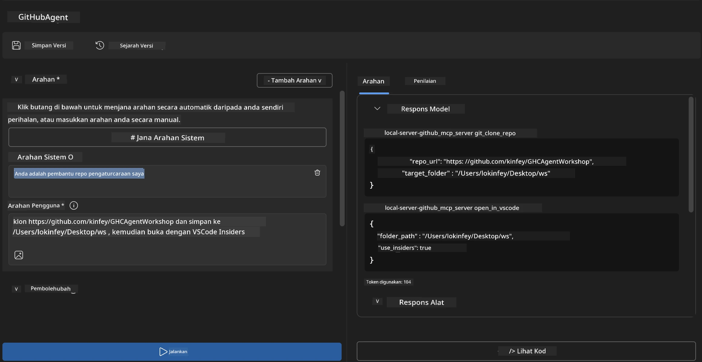
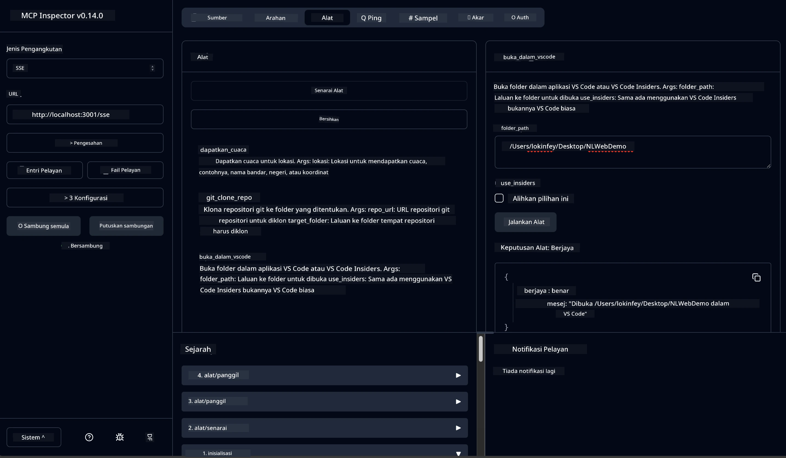

# 🐙 Modul 4: Pembangunan MCP Praktikal - Pelayan Klon GitHub Tersuai


> **⚡ Mula Pantas:** Bina pelayan MCP sedia produksi yang mengautomasikan pengklonan repositori GitHub dan integrasi VS Code dalam masa 30 minit sahaja!

## 🎯 Objektif Pembelajaran

Menjelang akhir makmal ini, anda akan mampu:

- ✅ Membuat pelayan MCP tersuai untuk aliran kerja pembangunan dunia sebenar
- ✅ Melaksanakan fungsi pengklonan repositori GitHub melalui MCP
- ✅ Mengintegrasi pelayan MCP tersuai dengan VS Code dan Pembina Agen
- ✅ Menggunakan Mod Agen GitHub Copilot dengan alat MCP tersuai
- ✅ Menguji dan melancarkan pelayan MCP tersuai dalam persekitaran pengeluaran

## 📋 Prasyarat

- Penyelesaian Makmal 1-3 (asas MCP dan pembangunan lanjutan)
- Langganan GitHub Copilot ([pendaftaran percuma tersedia](https://github.com/github-copilot/signup))
- VS Code dengan set alat AI dan sambungan GitHub Copilot
- Git CLI dipasang dan dikonfigurasi

## 🏗️ Gambaran Projek

### **Cabaran Pembangunan Dunia Sebenar**
Sebagai pembangun, kami kerap menggunakan GitHub untuk mengklon repositori dan membukanya dalam VS Code atau VS Code Insiders. Proses manual ini melibatkan:
1. Membuka terminal/command prompt
2. Menavigasi ke direktori yang diingini
3. Menjalankan arahan `git clone`
4. Membuka VS Code dalam direktori yang diklon

**Penyelesaian MCP kami menyederhanakan ini menjadi satu arahan pintar sahaja!**

### **Apa yang Akan Anda Bina**
Sebuah **Pelayan MCP Klon GitHub** (`git_mcp_server`) yang menyediakan:

| Ciri | Penerangan | Manfaat |
|---------|-------------|---------|
| 🔄 **Pengklonan Repositori Pintar** | Mengklon repositori GitHub dengan pengesahan | Semakan ralat automatik |
| 📁 **Pengurusan Direktori Pintar** | Memeriksa dan membuat direktori dengan selamat | Mencegah penimpaan |
| 🚀 **Integrasi VS Code Rentas Platform** | Membuka projek dalam VS Code/Insiders | Peralihan aliran kerja lancar |
| 🛡️ **Pengendalian Ralat Mantap** | Mengendalikan isu rangkaian, kebenaran, dan laluan | Kebolehpercayaan sedia produksi |

---

## 📖 Pelaksanaan Langkah Demi Langkah

### Langkah 1: Buat Agen GitHub dalam Pembina Agen

1. **Lancarkan Pembina Agen** melalui sambungan AI Toolkit
2. **Buat agen baru** dengan konfigurasi berikut:
   ```
   Agent Name: GitHubAgent
   ```

3. **Mulakan pelayan MCP tersuai:**
   - Navigasi ke **Alat** → **Tambah Alat** → **Pelayan MCP**
   - Pilih **"Buat Pelayan MCP baru"**
   - Pilih **templat Python** untuk fleksibiliti maksimum
   - **Nama Pelayan:** `git_mcp_server`

### Langkah 2: Konfigurasikan Mod Agen GitHub Copilot

1. **Buka GitHub Copilot** dalam VS Code (Ctrl/Cmd + Shift + P → "GitHub Copilot: Open")
2. **Pilih Model Agen** dalam antara muka Copilot
3. **Pilih model Claude 3.7** untuk keupayaan penaakulan yang dipertingkatkan
4. **Dayakan integrasi MCP** untuk akses alat

> **💡 Tip Pro:** Claude 3.7 menawarkan kefahaman unggul tentang aliran kerja pembangunan dan corak pengendalian ralat.

### Langkah 3: Laksanakan Fungsi Teras Pelayan MCP

**Gunakan arahan terperinci berikut dengan Mod Agen GitHub Copilot:**

```
Create two MCP tools with the following comprehensive requirements:

🔧 TOOL A: clone_repository
Requirements:
- Clone any GitHub repository to a specified local folder
- Return the absolute path of the successfully cloned project
- Implement comprehensive validation:
  ✓ Check if target directory already exists (return error if exists)
  ✓ Validate GitHub URL format (https://github.com/user/repo)
  ✓ Verify git command availability (prompt installation if missing)
  ✓ Handle network connectivity issues
  ✓ Provide clear error messages for all failure scenarios

🚀 TOOL B: open_in_vscode
Requirements:
- Open specified folder in VS Code or VS Code Insiders
- Cross-platform compatibility (Windows/Linux/macOS)
- Use direct application launch (not terminal commands)
- Auto-detect available VS Code installations
- Handle cases where VS Code is not installed
- Provide user-friendly error messages

Additional Requirements:
- Follow MCP 1.9.3 best practices
- Include proper type hints and documentation
- Implement logging for debugging purposes
- Add input validation for all parameters
- Include comprehensive error handling
```

### Langkah 4: Uji Pelayan MCP Anda

#### 4a. Uji dalam Pembina Agen

1. **Lancarkan konfigurasi nyahpepijat** untuk Pembina Agen
2. **Konfigurasikan agen anda dengan arahan sistem ini:**

```
SYSTEM_PROMPT:
You are my intelligent coding repository assistant. You help developers efficiently clone GitHub repositories and set up their development environment. Always provide clear feedback about operations and handle errors gracefully.
```

3. **Uji dengan senario pengguna nyata:**

```
USER_PROMPT EXAMPLES:

Scenario : Basic Clone and Open
"Clone {Your GitHub Repo link such as https://github.com/kinfey/GHCAgentWorkshop
 } and save to {The global path you specify}, then open it with VS Code Insiders"
```



**Keputusan Dijangka:**
- ✅ Pengklonan berjaya dengan pengesahan laluan
- ✅ Pelancaran VS Code automatik
- ✅ Mesej ralat jelas untuk senario tidak sah
- ✅ Pengendalian kes sempadan secara betul

#### 4b. Uji dalam Pemeriksa MCP



---

**🎉 Tahniah!** Anda telah berjaya membina pelayan MCP praktikal dan sedia produksi yang menyelesaikan cabaran aliran kerja pembangunan sebenar. Pelayan klon GitHub tersuai anda menunjukkan kuasa MCP untuk mengautomasikan dan meningkatkan produktiviti pembangun.

### 🏆 Pencapaian Dibuka:
- ✅ **Pembangun MCP** - Membina pelayan MCP tersuai
- ✅ **Pengautomatan Aliran Kerja** - Memudahkan proses pembangunan  
- ✅ **Pakar Integrasi** - Menghubungkan pelbagai alat pembangunan
- ✅ **Sedia Produksi** - Membangun penyelesaian untuk dikerahkan

---

## 🎓 Penyelesaian Bengkel: Perjalanan Anda dengan Protokol Konteks Model

**Peserta Bengkel yang Dihargai,**

Tahniah kerana menyiapkan semua empat modul bengkel Protokol Konteks Model! Anda telah melalui banyak perkara dari memahami konsep asas AI Toolkit kepada membina pelayan MCP sedia produksi yang menyelesaikan cabaran pembangunan dunia sebenar.

### 🚀 Ulang Kaji Laluan Pembelajaran Anda:

**[Modul 1](../lab1/README.md)**: Anda bermula dengan meneroka asas AI Toolkit, ujian model, dan membuat agen AI pertama anda.

**[Modul 2](../lab2/README.md)**: Anda belajar seni bina MCP, mengintegrasikan Playwright MCP, dan membina agen automasi pelayar pertama anda.

**[Modul 3](../lab3/README.md)**: Anda maju ke pembangunan pelayan MCP tersuai dengan pelayan MCP Cuaca dan menguasai alat nyahpepijat.

**[Modul 4](../lab4/README.md)**: Kini anda telah menerapkan semuanya untuk mencipta alat automasi aliran kerja repositori GitHub yang praktikal.

### 🌟 Apa yang Anda Kuasai:

- ✅ **Eko Sistem AI Toolkit**: Model, agen, dan corak integrasi
- ✅ **Seni Bina MCP**: Reka bentuk klien-pelayan, protokol pengangkutan, dan keselamatan
- ✅ **Alat Pembangun**: Dari Playground ke Inspector ke penghantaran produksi
- ✅ **Pembangunan Tersuai**: Membina, menguji, dan melancarkan pelayan MCP anda sendiri
- ✅ **Aplikasi Praktikal**: Menyelesaikan cabaran aliran kerja dunia sebenar dengan AI

### 🔮 Langkah Seterusnya Anda:

1. **Bina Pelayan MCP Anda Sendiri**: Gunakan kemahiran ini untuk mengautomasikan aliran kerja unik anda
2. **Sertai Komuniti MCP**: Kongsi ciptaan anda dan belajar dari orang lain
3. **Terokai Integrasi Lanjutan**: Hubungkan pelayan MCP ke sistem perusahaan
4. **Sumbang kepada Sumber Terbuka**: Bantu memperbaiki alat dan dokumentasi MCP

Ingat, bengkel ini hanyalah permulaan. Eko sistem Protokol Konteks Model berkembang pesat, dan anda kini bersedia berada di barisan hadapan alat pembangunan berkuasa AI.

**Terima kasih atas penyertaan dan dedikasi anda untuk belajar!**

Kami harap bengkel ini telah mencetuskan idea yang akan mengubah cara anda membina dan berinteraksi dengan alat AI dalam perjalanan pembangunan anda.

**Selamat mengod!**

---

## Apa Seterusnya

Tahniah kerana telah menyelesaikan semua makmal dalam Modul 10!

- Kembali ke: [Ikhtisar Modul 10](../README.md)
- Teruskan ke: [Modul 11: Makmal Hands-On Pelayan MCP](../../11-MCPServerHandsOnLabs/README.md)

---

<!-- CO-OP TRANSLATOR DISCLAIMER START -->
**Penafian**:
Dokumen ini telah diterjemahkan menggunakan perkhidmatan terjemahan AI [Co-op Translator](https://github.com/Azure/co-op-translator). Walaupun kami berusaha untuk ketepatan, sila ambil maklum bahawa terjemahan automatik mungkin mengandungi kesilapan atau ketidaktepatan. Dokumen asal dalam bahasa asalnya hendaklah dianggap sebagai sumber yang sahih. Untuk maklumat penting, terjemahan manusia profesional adalah disyorkan. Kami tidak bertanggungjawab terhadap sebarang salah faham atau tafsiran yang salah yang timbul daripada penggunaan terjemahan ini.
<!-- CO-OP TRANSLATOR DISCLAIMER END -->