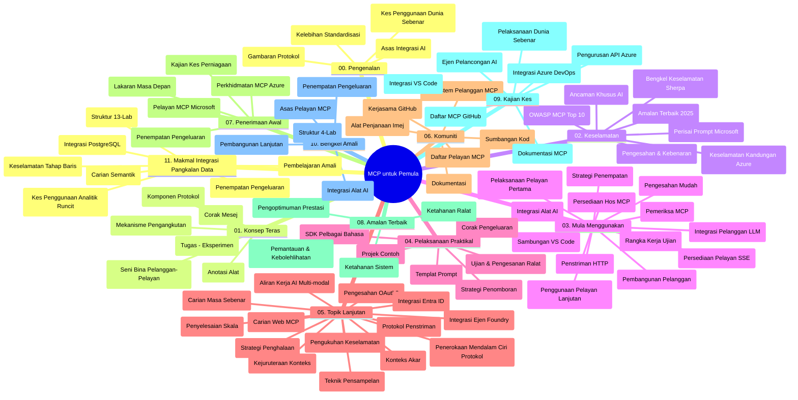

# Model Context Protocol (MCP) untuk Pemula - Panduan Kajian

Panduan kajian ini memberikan gambaran keseluruhan mengenai struktur dan kandungan repositori untuk kurikulum "Model Context Protocol (MCP) untuk Pemula". Gunakan panduan ini untuk menavigasi repositori dengan cekap dan memanfaatkan sumber yang tersedia dengan sebaik mungkin.

## Gambaran Keseluruhan Repositori

Model Context Protocol (MCP) adalah rangka kerja standard bagi interaksi antara model AI dan aplikasi klien. Pada mulanya dibuat oleh Anthropic, MCP kini dikendalikan oleh komuniti MCP yang lebih luas melalui organisasi rasmi GitHub. Repositori ini menyediakan kurikulum lengkap dengan contoh kod praktikal dalam C#, Java, JavaScript, Python, dan TypeScript, yang direka untuk pemaju AI, arkitek sistem, dan jurutera perisian.

## Peta Kurikulum Visual

## Struktur Repositori

Repositori disusun dalam sebelas bahagian utama, setiap satu memberi fokus kepada aspek berbeza MCP:

1. **Pengenalan (00-Introduction/)**
   - Gambaran Model Context Protocol
   - Mengapa pensijilan penting dalam saluran AI
   - Kes penggunaan praktikal dan manfaatnya

2. **Konsep Teras (01-CoreConcepts/)**
   - Seni bina klien-pelayan
   - Komponen utama protokol
   - Corak penghantaran mesej dalam MCP

3. **Keselamatan (02-Security/)**
   - Ancaman keselamatan dalam sistem berasaskan MCP
   - Amalan terbaik untuk menjamin pelaksanaan
   - Strategi pengesahan dan kebenaran
   - **Dokumentasi Keselamatan Komprehensif**:
     - Amalan Terbaik Keselamatan MCP 2025
     - Panduan Pelaksanaan Keselamatan Kandungan Azure
     - Kawalan dan Teknik Keselamatan MCP
     - Rujukan Pantas Amalan Terbaik MCP
   - **Topik Utama Keselamatan**:
     - Serangan suntikan arahan (prompt injection) dan keracunan alat
     - Perampasan sesi dan masalah wakil keliru
     - Kelemahan penghantaran token
     - Kebenaran berlebihan dan kawalan akses
     - Keselamatan rantaian bekalan untuk komponen AI
     - Integrasi Microsoft Prompt Shields

4. **Memulakan (03-GettingStarted/)**
   - Persediaan dan konfigurasi persekitaran
   - Membina pelayan dan klien MCP asas
   - Integrasi dengan aplikasi sedia ada
   - Merangkumi bahagian untuk:
     - Pelaksanaan pelayan pertama
     - Pembangunan klien
     - Integrasi klien LLM
     - Integrasi VS Code
     - Pelayan Server-Sent Events (SSE)
     - Penggunaan pelayan lanjutan
     - Penstriman HTTP
     - Integrasi AI Toolkit
     - Strategi ujian
     - Garis panduan pengedaran

5. **Pelaksanaan Praktikal (04-PracticalImplementation/)**
   - Penggunaan SDK dalam pelbagai bahasa pengaturcaraan
   - Kaedah pengesanan ralat, ujian dan pengesahan
   - Penyediaan templat arahan dan aliran kerja yang boleh digunakan semula
   - Projek contoh dengan contoh pelaksanaan

6. **Topik Lanjutan (05-AdvancedTopics/)**
   - Teknik kejuruteraan konteks
   - Integrasi ejen Foundry
   - Aliran kerja AI berbilang mod
   - Demo pengesahan OAuth2
   - Keupayaan carian masa nyata
   - Penstriman masa nyata
   - Pelaksanaan konteks akar
   - Strategi perutean
   - Teknik pensampelan
   - Pendekatan penskalaan
   - Pertimbangan keselamatan
   - Integrasi keselamatan Entra ID
   - Integrasi carian web

7. **Sumbangan Komuniti (06-CommunityContributions/)**
   - Cara menyumbang kod dan dokumentasi
   - Bekerjasama melalui GitHub
   - Penambahbaikan dan maklum balas yang dipacu oleh komuniti
   - Menggunakan pelbagai klien MCP (Claude Desktop, Cline, VSCode)
   - Bekerjasama dengan pelayan MCP popular termasuk penjanaan imej

8. **Pengajaran daripada Penerimaan Awal (07-LessonsfromEarlyAdoption/)**
   - Pelaksanaan dunia sebenar dan kisah kejayaan
   - Membangun dan menyebarkan penyelesaian berasaskan MCP
   - Tren dan peta jalan masa depan
   - **Panduan Pelayan MCP Microsoft**: Panduan komprehensif untuk 10 pelayan MCP Microsoft sedia produksi termasuk:
     - Pelayan MCP Microsoft Learn Docs
     - Pelayan MCP Azure (15+ penyambung khusus)
     - Pelayan MCP GitHub
     - Pelayan MCP Azure DevOps
     - Pelayan MCP MarkItDown
     - Pelayan MCP SQL Server
     - Pelayan MCP Playwright
     - Pelayan MCP Dev Box
     - Pelayan MCP Azure AI Foundry
     - Pelayan MCP Microsoft 365 Agents Toolkit

9. **Amalan Terbaik (08-BestPractices/)**
   - Penalaan dan pengoptimuman prestasi
   - Reka bentuk sistem MCP tahan ralat
   - Strategi ujian dan ketahanan

10. **Kajian Kes (09-CaseStudy/)**
    - **Tujuh kajian kes komprehensif** menunjukkan kebolehlenturan MCP dalam pelbagai senario:
    - **Ejen Perjalanan AI Azure**: Orkestrasi ejen berbilang dengan Azure OpenAI dan AI Search
    - **Integrasi Azure DevOps**: Automasi proses aliran kerja dengan kemas kini data YouTube
    - **Pemulihan Dokumentasi Masa Nyata**: Klien konsol Python dengan penstriman HTTP
    - **Penjana Pelan Kajian Interaktif**: Aplikasi web Chainlit dengan AI perbualan
    - **Dokumentasi Dalam Editor**: Integrasi VS Code dengan aliran kerja GitHub Copilot
    - **Pengurusan API Azure**: Integrasi API perusahaan dengan penciptaan pelayan MCP
    - **Daftar MCP GitHub**: Pembangunan ekosistem dan platform integrasi ejenik
    - Contoh pelaksanaan merangkumi integrasi perusahaan, produktiviti pembangun, dan pembangunan ekosistem

11. **Bengkel Praktikal (10-StreamliningAIWorkflowsBuildingAnMCPServerWithAIToolkit/)**
    - Bengkel praktikal lengkap menggabungkan MCP dengan AI Toolkit
    - Membangun aplikasi pintar menghubungkan model AI dengan alat dunia sebenar
    - Modul praktikal meliputi asas, pembangunan pelayan tersuai, dan strategi pengedaran produksi
    - **Struktur Lab**:
      - Lab 1: Asas Pelayan MCP
      - Lab 2: Pembangunan Pelayan MCP Lanjutan
      - Lab 3: Integrasi AI Toolkit
      - Lab 4: Pengedaran dan Penskalaan Produksi
    - Pendekatan pembelajaran berasaskan lab dengan arahan langkah demi langkah

12. **Lab Integrasi Pangkalan Data Pelayan MCP (11-MCPServerHandsOnLabs/)**
    - **Jalan pembelajaran 13 lab komprehensif** untuk membina pelayan MCP sedia produksi dengan integrasi PostgreSQL
    - **Pelaksanaan analitik runcit dunia sebenar** menggunakan kes penggunaan Zava Retail
    - **Corak gred perusahaan** termasuk Keselamatan Tahap Baris (RLS), carian semantik, dan akses data penyewa berganda
    - **Struktur Lab Lengkap**:
      - **Lab 00-03: Asas** - Pengenalan, Seni Bina, Keselamatan, Persediaan Persekitaran
      - **Lab 04-06: Membina Pelayan MCP** - Reka Bentuk Pangkalan Data, Pelaksanaan Pelayan MCP, Pembangunan Alat
      - **Lab 07-09: Ciri Lanjutan** - Carian Semantik, Ujian & Pengesanan Ralat, Integrasi VS Code
      - **Lab 10-12: Produksi & Amalan Terbaik** - Pengedaran, Pemantauan, Pengoptimuman
    - **Teknologi Termasuk**: Rangka kerja FastMCP, PostgreSQL, Azure OpenAI, Azure Container Apps, Application Insights
    - **Hasil Pembelajaran**: Pelayan MCP sedia produksi, corak integrasi pangkalan data, analitik berkuasa AI, keselamatan perusahaan

## Sumber Tambahan

Repositori termasuk sumber sokongan:

- **Folder Imej**: Mengandungi diagram dan ilustrasi yang digunakan sepanjang kurikulum
- **Terjemahan**: Sokongan pelbagai bahasa dengan terjemahan automatik dokumentasi
- **Sumber Rasmi MCP**:
  - [Dokumentasi MCP](https://modelcontextprotocol.io/)
  - [Spesifikasi MCP](https://spec.modelcontextprotocol.io/)
  - [Repositori MCP GitHub](https://github.com/modelcontextprotocol)

## Cara Menggunakan Repositori Ini

1. **Pembelajaran Berturutan**: Ikuti bab mengikut urutan (00 hingga 11) untuk pengalaman pembelajaran yang teratur.
2. **Fokus Bahasa Tertentu**: Jika berminat dengan bahasa pengaturcaraan tertentu, terokai direktori sampel untuk pelaksanaan dalam bahasa pilihan anda.
3. **Pelaksanaan Praktikal**: Mula dengan bahagian "Memulakan" untuk menyediakan persekitaran dan membina pelayan serta klien MCP pertama anda.
4. **Eksplorasi Lanjutan**: Setelah selesa dengan asas, terokai topik lanjutan untuk mengembangkan pengetahuan anda.
5. **Penglibatan Komuniti**: Sertai komuniti MCP melalui perbincangan GitHub dan saluran Discord untuk berhubung dengan pakar dan pembangun lain.

## Klien dan Alat MCP

Kurikulum meliputi pelbagai klien dan alat MCP:

1. **Klien Rasmi**:
   - Visual Studio Code
   - MCP dalam Visual Studio Code
   - Claude Desktop
   - Claude dalam VSCode
   - Claude API

2. **Klien Komuniti**:
   - Cline (terminal)
   - Cursor (penyunting kod)
   - ChatMCP
   - Windsurf

3. **Alat Pengurusan MCP**:
   - MCP CLI
   - MCP Manager
   - MCP Linker
   - MCP Router

## Pelayan MCP Popular

Repositori memperkenalkan pelbagai pelayan MCP, termasuk:

1. **Pelayan MCP Microsoft Rasmi**:
   - Pelayan MCP Microsoft Learn Docs
   - Pelayan MCP Azure (15+ penyambung khusus)
   - Pelayan MCP GitHub
   - Pelayan MCP Azure DevOps
   - Pelayan MCP MarkItDown
   - Pelayan MCP SQL Server
   - Pelayan MCP Playwright
   - Pelayan MCP Dev Box
   - Pelayan MCP Azure AI Foundry
   - Pelayan MCP Microsoft 365 Agents Toolkit

2. **Pelayan Rujukan Rasmi**:
   - Sistem Fail
   - Fetch
   - Memori
   - Pemikiran Berurutan

3. **Penjanaan Imej**:
   - Azure OpenAI DALL-E 3
   - Stable Diffusion WebUI
   - Replicate

4. **Alat Pembangunan**:
   - Git MCP
   - Kawalan Terminal
   - Pembantu Kod

5. **Pelayan Khusus**:
   - Salesforce
   - Microsoft Teams
   - Jira & Confluence

## Penyumbangan

Repositori ini mengalu-alukan sumbangan dari komuniti. Lihat bahagian Sumbangan Komuniti untuk panduan bagaimana untuk menyumbang dengan berkesan kepada ekosistem MCP.

----

*Panduan kajian ini dikemas kini terakhir pada 5 Februari 2026, mencerminkan Spesifikasi MCP terkini 2025-11-25 dan menyediakan gambaran keseluruhan repositori sehingga tarikh itu. Kandungan repositori mungkin dikemas kini selepas tarikh ini.*

---

<!-- CO-OP TRANSLATOR DISCLAIMER START -->
**Penafian**:
Dokumen ini telah diterjemahkan menggunakan perkhidmatan terjemahan AI [Co-op Translator](https://github.com/Azure/co-op-translator). Walaupun kami berusaha untuk ketepatan, sila ambil perhatian bahawa terjemahan automatik mungkin mengandungi kesilapan atau ketidaktepatan. Dokumen asal dalam bahasa asalnya harus dianggap sebagai sumber yang sahih. Untuk maklumat penting, terjemahan profesional oleh manusia adalah disyorkan. Kami tidak bertanggungjawab atas sebarang salah faham atau salah tafsir yang timbul daripada penggunaan terjemahan ini.
<!-- CO-OP TRANSLATOR DISCLAIMER END -->