# Model Context Protocol (MCP) ကိုမိတ်ဆက်ခြင်း။ အကြီးစား AI လျှောက်လွှာများအတွက် အရေးပါမှု

[](https://youtu.be/agBbdiOPLQA)

_(ဒီသင်ခန်းစာ ဗီဒီယိုကိုကြည့်ရန် အပေါ်ဓာတ်ပုံကိုနှိပ်ပါ)_

Generative AI လျှောက်လွှာများသည် သဘာဝဘာသာစကားပရုဂျမ့်များဖြင့် အသုံးပြုသူများအား အက်ပ်နှင့် အဆက်အသွယ်တည်ဆောက်ရန် ထိုက်တန်သော ဖြေရှင်းချက်တစ်ခုဖြစ်သည်။ သို့သော် ဤလိုအပ်ချက်များအပေါ် နောက်ထပ်အချိန်နှင့် အရင်းအမြစ်များ ရွှေ့ကြောင်းသုံးခဲ့သောအခါ၊ သင်သည် လွယ်ကူစွာ ပေါင်းစည်းနိုင်သော လုပ်ဆောင်ချက်များနှင့် အရင်းအမြစ်များကို တိုးချဲ့နိုင်မည့်နည်းလမ်းအဖြစ် သေချာစေနိုင်ရန်လိုအပ်သည်၊ သင်၏အက်ပ်သည် မော်ဒယ်တစ်ခုထက်ပို၍ အသုံးပြုနိုင်မည်ဖြစ်ပြီး မော်ဒယ်ပေါင်းများစွာရှိသော အခြေခံစွမ်းဆောင်ချက်များကို ကောင်းမွန်စွာ ကိုင်တွယ်နိုင်သည်။ အကျဉ်းချုပ်အားဖြင့် Gen AI အက်ပ်များသည် ပထမတစ်ကြိမ် မတည်ဆောက်ရခက်ခဲပါ၊ သို့သော် ၎င်းများသည် တိုးတက်လာပြီး ပိုမိုရှုပ်ထွေးလာသည့်အခါ၊ သင်သည် စနစ်တစ်ခုဖြစ်သည့် မော်ဒယ်ကိုသတ်မှတ်ရန် စတင်ရန်လိုအပ်ကာ ၎င်းတို့သည် တည်ဆောက်ချက်တစ်ခုအတိုင်း သေချာဆောင်ရွက်ရန် စံပြတစ်ခုအပေါ် ယုံကြည်မှုပေးရန် လိုအပ်နိုင်သည်။ ဒီကိစ္စမှာ MCP သည် အရာအားလုံးကို စည်းမှတ်ပေးပြီး စံပြတစ်ခုကို ပေးအပ်ပေးသည်။

---

## **🔍 Model Context Protocol (MCP) ဆိုတာဘာလဲ?**

**Model Context Protocol (MCP)** သည် **ဖွင့်လွှင့်ထားပြီး စံပြဖြစ်သော အင်တာဖေ့စ်ဖြစ်ပြီး** အကြီးစားဘာသာစကားမော်ဒယ်များ (LLMs) အား အပြင်工具များ၊ API များနှင့် ဒေတာရင်းမြစ်များနှင့် တိကျစွာ အဆက်အသွယ်တောင် ပေးနိုင်စေသည်။ ၎င်းသည် AI မော်ဒယ်တို့၏ သင်ကြားမှုဒေတာအပြင် မော်ဒယ်စွမ်းဆောင်ရည်များ ကိုတိုးခွန်အားပေးနိုင်ရန် တည်ဆောက်မှုတစ်ခုကို ပေးသည်။ ထို့ကြောင့် အထက်တန်း AI စနစ်များကို ပိုမို ကြိမ်ရွတ်နိုင်ပြီး တုံ့ပြန်မှု မြန်ဆန်လျှင်မြန်လာစေသည်။

---

## **🎯 AI တွင် စံပြခြင်းကဘာကြောင့် အရေးကြီးသလဲ**

Generative AI လျှောက်လွှာများ ပိုမိုရှုပ်ထွေးလာသည်နှင့်အမျှ၊ **တိုးချဲ့နိုင်မှု၊ တိုးတက်နိုင်မှု၊ ပြုပြင်ထိန်းသိမ်းနိုင်မှု** နှင့် **Vendor Lock-in ကိုရှောင်ရှားခြင်း** အနေဖြင့် စံနည်းများကို လက်ခံအသုံးပြုခြင်းသည် အရေးကြီးသည်။ MCP သည် ဒီလိုလိုအပ်ချက်များကို ဖြေရှင်းပေးသည်-

- မော်ဒယ်နှင့် Tools ပေါင်းစည်းမှု တစ်ခုတည်းဖြစ်စေရန်
- ချပ်ဆဲသော တစ်ခါတည်းဖြေရှင်းချက်များကို လျှော့ချပေးရန်
- Vendor များစွာမှ မော်ဒယ်များကို တစ်ခုတည်းသော ပတ်ဝန်းကျင်တွင် နှစ်ဖက်သုံးနိုင်ရန်

**မှတ်ချက်။** MCP သည် ဖွင့်လှစ်စံနှင့်လည်း အမည်ပေးထားသော်လည်း IEEE, IETF, W3C, ISO သို့မဟုတ် အခြားအဖွဲ့အစည်းများမှ စံပြအဖြစ် လက်ခံရန် အစီအစဉ်မရှိပါ။

---

## **📚 သင်ယူနိုင်မည့်ရည်ရွယ်ချက်များ**

ဤဆောင်းပါးအဆုံးသတ်သည်အချိန်တွင်၊ သင်တို့အနေဖြင့် -

- **Model Context Protocol (MCP)** နှင့် ၎င်း၏ အသုံးပြုမှုပုံစံများကို မှတ်သားနိုင်မည်။
- MCP သည် မော်ဒယ်-မှ-ကိရိယာ ဆက်သွယ်မှုကို မည်သို့ စံပြအဖြစ် သတ်မှတ်ထားသည်ကို နားလည်နိုင်မည်။
- MCP ၏ အခြေခံဖွဲ့စည်းပုံ အစိတ်အပိုင်းများကို သတ်မှတ်နိုင်မည်။
- စီးပွားရေးနှင့် ဖွံ့ဖြိုးတိုးတက်မှု စဉ်ဆက်များ၌ MCP ၏ အကောင်အထည်ဖော်ထားသော လုပ်ငန်းများကို ရှာဖွေတင်ပြနိုင်မည်။

---

## **💡 Model Context Protocol (MCP) သည် အကောင်းဆုံးကစားသမားဖြစ်ရန်ဘာကြောင့် ဖြစ်သည်**

### **🔗 MCP သည် AI ဆက်ဆံရေးတွင် သီးခြားခြားနားမှုကို ဖြေရှင်းသည်**

MCP မတည်ထောင်မီ မော်ဒယ်နှင့် Tools ကို ပေါင်းစည်းရာတွင် ဖြစ်ပေါ်ခဲ့သည်-

- တစ်ခုချင်းစီ နဲ့ Tool-Model အစုံကွဲ ထူးခြားတဲ့ ကိုယ်ပိုင်ကုဒ်များ။
- Vendor တစ်ဦးချင်း API များ မစံပြ။
- အဆက်မပြတ် ပြောင်းလဲမှုများကြောင့် မရပ်တန့်ခြင်းများ။
- ကိရိယာများ ပိုမိုလာသည့်အခါ ပိုမို မတည်ငြိမ်မှု။

### **✅ MCP စံပြခြင်း၏ အကျိုးကျေးဇူးများ**

| **အကျိုးကျေးဇူး**      | **ဖော်ပြချက်**                                                                |
|--------------------------|--------------------------------------------------------------------------------|
| Interoperability         | LLM များသည် Vendor များအနှံ့ကိရိယာများနှင့် တိကျစွာ ဆက်သွယ်နိုင်သည်                |
| တည်ငြိမ်မှု             | ပလတ်ဖောင်းများနှင့် ကိရိယာများပေါ်တွင် ညီညွတ်သော သဘောထားရှိသည်                    |
| ထပ်မံအသုံးပြုနိုင်မှု    | တစ်ကြိမ်တည်ဆောက်ထားသော ကိရိယာများသည် စီမံကိန်းများနှင့် စနစ်များတွင် အသုံးပြုနိုင်သည် |
| ဖွံ့ဖြိုးတိုးတက်မှု မြန်ဆန်ခြင်း | စံပြ၊ ပြင်ဆင်လွယ်ကူတဲ့ အင်တာဖေ့စ်များကို အသုံးပြု၍ ဖွံ့ဖြိုးမှု အချိန်လျှော့ချပေးသည်  |

---

## **🧱 MCP Architecture အဆင့်မြင့် အနှစ်ချုပ်**

MCP သည် **Client-Server မော်ဒယ်**ကို လိုက်နာသည်၊

- **MCP Hosts** သည် AI မော်ဒယ်များကို စီမံခန့်ခွဲသည်
- **MCP Clients** သည် Request များ စတင်ပို့သည်
- **MCP Servers** သည် context, tool များနှင့် စွမ်းဆောင်ရည်များ ဖောက်ပြန်ပေးသည်

### **အဓိကအစိတ်အပိုင်းများ**

- **Resources** – မော်ဒယ်များအတွက် စတိတ်တစ်ခုမှ ဒေတာများ  
- **Prompts** – ကြိုတင် သတ်မှတ်ထားသော workflow များဖြင့် ဦးဆောင်ထုတ်လုပ်ခြင်း  
- **Tools** – ရှာဖွေမှု၊ တွက်ချက်မှု ကဲ့သို့ ဆောင်ရွက်နိုင်သည့် လုပ်ဆောင်ချက်များ  
- **Sampling** – ထပ်တလဲလဲဆက်သွယ်မှုများဖြင့် အေးဂျင့်အပြုအမူ  
- **Elicitation** – အသုံးပြုသူ ကောက်ခံချက်များအတွက် Server မှ တောင်းဆိုမှု  
- **Roots** – Server ၏ ဖိုင်စနစ် အကန့်အသတ်များအတွက်

### **Protocol Architecture**

MCP သည် နှစ်လွှာ Architecture ကို အသုံးပြုသည် -

- **Data Layer**: JSON-RPC 2.0 အခြေခံ၍ ဆက်သွယ်မှုနှင့် lifecycle စီမံခန့်ခွဲမှုနှင့် primitives များ
- **Transport Layer**: STDIO (တည်နေရာရှိ) နှင့် Streamable HTTP နဲ့ SSE (အဝေး) ဆက်သွယ်မှု ချန်နယ်များ

---

## MCP Servers မည်သို့ လုပ်ဆောင်သနည်း

MCP servers ကို အောက်ပါနည်းဖြင့် လည်ပတ်သည်-

- **Request Flow**:
    1. ပြီးဆုံးအသုံးပြုသူ သို့မဟုတ် ၎င်း၏ နောက်ခံမှ ဆော့ဖ်ဝဲမှ တစ်ဆင့် တောင်းဆိုမှု တစ်ခု စတင်သည်။
    2. **MCP Client** မှ တောင်းဆိုမှုကို **MCP Host** သို့ ပေးပို့သည်။ ထို **MCP Host** သည် AI Model runtime ကို စီမံခန့်ခွဲသည်။
    3. **AI Model** သည် အသုံးပြုသူ ပရမ်းပိုးကို လက်ခံပြီး အပြင်ကိရိယာများ သို့မဟုတ် ဒေတာများ သို့ အရာတစ်ခုထက်ပိုသော tool call များအား တောင်းဆိုနိုင်သည်။
    4. **MCP Host** သည် မော်ဒယ်ကိုတိတိကျကျ မဟုတ်ဘဲ စံပြ protocol ကိုအသုံးပြုကာ သင့်လျော်သည့် **MCP Server(s)** များနှင့် ဆက်သွယ်သည်။
- **MCP Host ၏ လုပ်ဆောင်ချက်များ**:
    - **Tool Registry**: အသုံးပြုနိုင်သည့် ကိရိယာများနှင့် ၎င်း၏ စွမ်းဆောင်ရည်များ ပြန်လည်အစီအစဉ်တင်ထားသည်။
    - **Authentication**: ကိရိယာသို့ ဝင်ရောက်ခွင့်များ ထိရောက်စွာ စစ်ဆေးသည်။
    - **Request Handler**: မော်ဒယ်မှ လာသော ကိရိယာတောင်းဆိုမှုများကို ဆောင်ရွက်သည်။
    - **Response Formatter**: မော်ဒယ်နားလည်နိုင်သည့် ပုံစံဖြင့် ကိရိယာထုတ်ကုန်များ တည်ဆောက်သည်။
- **MCP Server အကောင်အထည်ဖော်ခြင်း**:
    - **MCP Host** မှ ဆက်သွယ်မှုကို တစ်ခု သို့မဟုတ် များစွာသော **MCP Server** များသို့ စီစဉ်ပေးသည်။ ၎င်းတို့သည် ရှာဖွေမှု၊ တွက်ချက်မှု၊ ဒေတာခေါ်ယူမှု အစရှိသည့် အထူးပြုလုပ်ဆောင်ချက်များ ပေးစွမ်းသည်။
    - **MCP Servers** များသည် လုပ်ငန်းဆောင်တာများကို လုပ်ဆောင်ပြီး ရလဒ်များကို **MCP Host** သို့ တိတိကျကျ ပြန်လည်ပေးပို့သည်။
    - **MCP Host** သည် ရလဒ်များကို ပုံစံတစ်ခုအလျောက် ဖော်ပြပြီး **AI Model** သို့ ပို့ပေးသည်။
- **တုံ့ပြန်ချက် ပြီးမြောက်မှု**:
    - **AI Model** သည် ကိရိယာထုတ်ကုန်များကို နောက်ဆုံးတုံ့ပြန်ချက်ထဲသို့ ပေါင်းစပ်သည်။
    - **MCP Host** သည် အဆိုပါ တုံ့ပြန်ချက်ကို **MCP Client** သို့ပို့သည်။ ၎င်းသည် နောက်ဆုံးအသုံးပြုသူ သို့မဟုတ် ခေါ်ယူသူ ဆော့ဖ်ဝဲသို့ ပေးပို့သည်။

```mermaid
---
title: MCP ဖွဲ့စည်းတည်ဆောက်မှုနှင့် အစိတ်အပိုင်းများအကြား ပေါင်းသင်းမှုများ
description: MCP တွင် အစိတ်အပိုင်းများ၏ လည်ပတ်မှုများကို ပြသသော ပုံကြမ်း။
---
graph TD
    Client[MCP Client/Application] -->|တောင်းဆိုမှု ပေးပို့သည်| H[MCP Host]
    H -->|ခေါ်ယူသည်| A[AI မော်ဒယ်]
    A -->|ကိရိယာ ခေါ်ဆိုမှု တောင်းဆိုမှု| H
    H -->|MCP ပရိုတိုကော| T1[MCP စာ сервер ကိရိယာ ၀၁: ဝက်ဘ် ရှာဖွေမှု]
    H -->|MCP ပရိုတိုကော| T2[MCP စာ сервер ကိရိယာ ၀၂: ကိန်းဂဏန်းတွက်စက် ကိရိယာ]
    H -->|MCP ပရိုတိုကော| T3[MCP စာ сервер ကိရိယာ ၀၃: ဒေတာဘေ့စ် ဆက်သွယ်မှု ကိရိယာ]
    H -->|MCP ပရိုတိုကော| T4[MCP စာ сервер ကိရိယာ ၀၄: ဖိုင်စနစ် ကိရိယာ]
    H -->|တုံ့ပြန်မှု ပေးပို့သည်| Client

    subgraph "MCP Host အစိတ်အပိုင်းများ"
        H
        G[ကိရိယာ မှတ်ပုံတင်စာရင်း]
        I[အတည်ပြုမှု]
        J[တောင်းဆိုမှု ကိုင်တွယ်သူ]
        K[တုံ့ပြန်မှု ပုံဖော်သူ]
    end

    H <--> G
    H <--> I
    H <--> J
    H <--> K

    style A fill:#f9d5e5,stroke:#333,stroke-width:2px
    style H fill:#eeeeee,stroke:#333,stroke-width:2px
    style Client fill:#d5e8f9,stroke:#333,stroke-width:2px
    style G fill:#fffbe6,stroke:#333,stroke-width:1px
    style I fill:#fffbe6,stroke:#333,stroke-width:1px
    style J fill:#fffbe6,stroke:#333,stroke-width:1px
    style K fill:#fffbe6,stroke:#333,stroke-width:1px
    style T1 fill:#c2f0c2,stroke:#333,stroke-width:1px
    style T2 fill:#c2f0c2,stroke:#333,stroke-width:1px
    style T3 fill:#c2f0c2,stroke:#333,stroke-width:1px
    style T4 fill:#c2f0c2,stroke:#333,stroke-width:1px
```
    


## 👨‍💻 MCP Server ဖန်တီးနည်း (ဥပမာများနှင့်အတူ)

MCP servers သည် LLM ၏ စွမ်းဆောင်ရည်ကို ဒေတာနှင့် လုပ်ဆောင်နိုင်စွမ်း ပေးခြင်းဖြင့် တိုးချဲ့ရန် ခွင့်ပြုသည်။

စမ်းသပ်လိုပါက ဤနေရာတွင် မတူညီသော ဘာသာစကားနှင့်/သို့ stack များအတွက် အသုံးပြုနိုင်သော SDK များနှင့် MCP servers တည်ဆောက်ခြင်းအတွက် ဥပမာများပါရှိသည်-

- **Python SDK**: https://github.com/modelcontextprotocol/python-sdk

- **TypeScript SDK**: https://github.com/modelcontextprotocol/typescript-sdk

- **Java SDK**: https://github.com/modelcontextprotocol/java-sdk

- **C#/.NET SDK**: https://github.com/modelcontextprotocol/csharp-sdk


## 🌍 MCP ၏ လက်တွေ့အသုံးချမှုများ

MCP သည် AI စွမ်းဆောင်ရည်ကို တိုးချဲ့ခြင်းဖြင့် အမျိုးမျိုးသော လျှောက်လွှာများကို အတည်ပြုနိုင်သည်-

| **လျှောက်လွှာ**           | **ဖော်ပြချက်**                                                                |
|------------------------------|--------------------------------------------------------------------------------|
| စီးပွားရေး ဒေတာ ပေါင်းစည်းမှု  | LLM များကို ဒေတာဘေ့စ်များ၊ CRM များ သို့မဟုတ် အတွင်းပိုင်း ကိရိယာများနှင့် ချိတ်ဆက်ခြင်း     |
| Agentic AI စနစ်များ          | ကိရိယာ ဝင်ရောက်ခွင့်နှင့် ဆုံးဖြတ်ချက်လုပ်ခြင်း workflow များနှင့် အလိုအလျောက် လုပ်ဆောင်သူများ ဖွင့်လှစ်ခြင်း  |
| မျိုးစုံမီဒီယာ လျှောက်လွှာများ | စာသား၊ ပုံ၊ အသံ ကိရိယာများကို တစ်စည်းတည်း AI အက်ပ် တွင် ပေါင်းစပ်ခြင်း                    |
| အချိန်နီးကပ် ဒေတာ ပေါင်းစည်းမှု    | AI ဆက်သွယ်မှုများသို့ လက်ရှိ၊ မှန်ကန်သော ဒေတာ ပေးပို့နိုင်စေရန် အသက်ဝင်သော ဒေတာ ပေါင်းစည်းမှု    |


### 🧠 MCP = AI ဆက်ဆံရေးအတွက် အထွေထွေအဆင့်ကြီးစံ

Model Context Protocol (MCP) သည် USB-C ကဲ့သို့ ဆက်သွယ်မှုပစ္စည်းများအတွက် စံပြဖြစ်သည့် အနေဖြင့် AI ဆက်ဆံရေးအတွက် စံပြတစ်ခုအဖြစ် လုပ်ဆောင်သည်။ AI ကမ္ဘာတွင် MCP သည် တူညီစွာ ချိတ်ဆက်မှုအင်တာဖေ့စ် ပေးကာ မော်ဒယ်များ (Client များ) နှင့် အပြင်ကိရိယာများနှင့် ဒေတာပေးသွင်းသူများ (Server များ) တို့ကို ချိတ်ဆက်ပေးသည်။ ၎င်းသည် API သို့မဟုတ် ဒေတာရင်းမြစ်တစ်ခုချင်းစီအတွက် မတူညီသော ကိုယ်ပိုင် Protocol များ လိုအပ်မှုကို ရှိချက်ပျောက်စေသည်။

MCP အသေးစိတ်နေရာတွင် MCP ကိုက်ညီသော Tool (MCP server ဟုခေါ်သည်) သည် စံတစ်ခုအတိုင်းလိုက်နာရုံဖြင့် တိကျသော စံပြအဖြစ် လုပ်ဆောင်သည်။ ၎င်းတို့သည် လက်ခံပေးနိုင်သည့် tool များသို့မဟုတ် လုပ်ဆောင်ချက်များကို စာရင်းပေးရန်နှင့် AI အေးဂျင့်မှ တောင်းဆိုသောအခါ လုပ်ဆောင်ရန် တာဝန်ယူသည်။ MCP ကို ထောက်ပံ့သော AI အေးဂျင့် ပလက်ဖောင်းများသည် Server များမှ ရနိုင်သည့် ကိရိယာများကို ရှာဖွေနိုင်ပြီး အဆိုပါ စံပြ Protocol ဖြင့် စီမံနိုင်သည်။

### 💡 သိမြင်မှုထောက်ပံ့မှု ပေးသည်

Tool များ တင်မကပဲ MCP သည် သိပ္ပံနယ်ပယ်များမှ သိမ်းဆည်းထားသည့် ဒေတာများသို့လည်း အတူတကွ ချိတ်ဆက်မှုပေးသည်။ ၎င်းသည် လျှင်မြန်ပြီး အတိအကျသော စွမ်းဆောင်မှုရှိသည့် LLM များအား သတ်မှတ်ထားသော ဒေတာရင်းမြစ်များနှင့် ချိတ်ဆက်ပေးနိုင်ခြင်းဖြစ်သည်။ ဥပမာအားဖြင့်၊ MCP server တစ်ခုသည် ကုမ္ပဏီ၏စာရွက်စာတမ်း အစီအစဉ်ကို ကိုယ်စားပြုနိုင်ပြီး အေးဂျင့်များ သက်ဆိုင်သော သတင်းအချက်အလက်များကို တောင်းဆိုနိုင်သည်။ Server တစ်ခုမှာ အီးမေးလ်ပို့ခြင်း သို့မဟုတ် မှတ်တမ်းပြင်ဆင်ခြင်း ကဲ့သို့သော တိကျသော လုပ်ဆောင်ချက်များကို တာဝန်ယူနိုင်သည်။ အေးဂျင့် အမြင်မှ စကားပြောရလျှင် ၎င်းတို့သည် အသုံးပြုနိုင်သည့် မျိုးစုံသော ကိရိယာများ ဖြစ်သည်။ တချို့ကိရိယာများသည် ဒေတာ (သိပ္ပံနယ်ပယ်) ကို ပြန်လည်ပေးဆောင်ပြီး တချို့ကိရိယာများမှာ လုပ်ဆောင်ချက်များကို ဆောင်ရွက်သည်။ MCP သည် နှစ်မျိုးလုံးကို ထိရောက်စွာ စီမံခန့်ခွဲပေးသည်။

Agent တစ်ခုသည် MCP server တစ်ခုနှင့် ချိတ်ဆက်သောအခါ ၎င်း၏ လုပ်ဆောင်နိုင်သည့် စွမ်းဆောင်ရည်များနှင့် ရယူနိုင်သော ဒေတာ များကို သာမန်ပုံစံတူ သိရှိသည်။ ၎င်းသည် ကိရိယာများ ရရှိနိုင်မှုကို အလိုအလျောက် ပံ့ပိုးပေးသည်။ ဥပမာအနေဖြင့် Agent ၏ စနစ်သို့ MCP server အသစ် တစ်ခု ထည့်သွင်းသည်နှင့် ထို Server ၏ လုပ်ဆောင်ချက်များကို agent က အသုံးပြုနိုင်သည့် အချိန်ခြားမရှိဘဲ တိုးမြှင့်နိုင်သည်။

ဤပေါင်းစည်းမှုသည် အောက်ပါ စာရင်းဇယားတွင်ဖော်ပြထားသည့် လမ်းကြောင်းနှင့် ကိုက်ညီပြီး Server များမှ ကိရိယာများနှင့် သိပ္ပံနယ်ပယ်များ အသုံးပြုသူများအတွက် ပူးပေါင်းဆောင်ရွက်မှု အကောင်းဆုံး ဖြည့်ဆည်းပေးသည်။

### 👉 ဥပမာ: တိုးချဲ့နိုင်သော Agent ဖြေရှင်းချက်

```mermaid
---
title: MCP နှင့်အတူ တိုးချဲ့နိုင်သော Agent ဖြေရှင်းချက်
description: အသုံးပြုသူက မျိုးစုံရှိ MCP ဆာဗာများနှင့် ချိတ်ဆက်ထားသော LLM နှင့် မည်သို့ အပြန်အလှန် ဆက်သွယ်သလဲ၊ ဆာဗာတစ်ခုချင်းစီသည် သိပ္ပံနှင့် ကိရိယာများကို ပံ့ပိုးပေးမှုရှိပြီး တိုးချဲ့နိုင်သော AI စနစ် တည်ဆောက်ပုံကို ဖော်ပြထားသည့် ပုံစံ
---
graph TD
    User -->|Prompt| LLM
    LLM -->|Response| User
    LLM -->|MCP| ServerA
    LLM -->|MCP| ServerB
    ServerA -->|Universal connector| ServerB
    ServerA --> KnowledgeA
    ServerA --> ToolsA
    ServerB --> KnowledgeB
    ServerB --> ToolsB

    subgraph Server A
        KnowledgeA[အသိပညာ]
        ToolsA[ကိရိယာများ]
    end

    subgraph Server B
        KnowledgeB[အသိပညာ]
        ToolsB[ကိရိယာများ]
    end
```Universal Connector သည် MCP Server များအကြား ဆက်သွယ်ဆောင်ရွက်နှင့် စွမ်းဆောင်ရည်များ ဝေမျှမှုကို ခွင့်ပြုကာ Server A သည် Server B သို့ တာဝန်ခွဲဝေကြောင်းလုပ်ငန်းများ ပြုလုပ်ရန် သို့မဟုတ် ၎င်း၏ ကိရိယာများနှင့် သိပ္ပံနယ်ပယ်များကို အသုံးပြုနိုင်ပါသည်။ ၎င်းသည် Server များအလွန်မှာ Tools နှင့် ဒေတာများကို ပူးပေါင်းသုံးနိုင်၍ တိုးချဲ့စေသော Agent စနစ်များ၏ အစိတ်အပိုင်းများကို ပံ့ပိုးသည်။ MCP သည် ကိရိယာ ထုတ်ဖော်မှုများကို စံပြထားသောကြောင့် Agent များသည် Server များအကြား တောင်းဆိုမှုများကို တိုးချဲ့စွာ ရှာဖွေ၍ လမ်းကြောင်းပြုလုပ်နိုင်ပြီး တိုက်ရိုက်သော ပေါင်းစည်းမှု မလိုအပ်။

ကိရိယာနှင့် သိပ္ပံနယ်ပယ် တစ်ခုတည်းမှ Server များအလွန် ရယူနိုင်သည့်အတွက် ပိုမို တိုးချဲ့နိုင်သော Agent စနစ်များ ဖွဲ့စည်းမှုကို အထောက်အကူပြုသည်။

### 🔄 Client-Side LLM နှင့် Advanced MCP သုံးမျိုးမြင်ကွင်းများ

MCP အခြေခံဖွဲ့စည်းပုံသက်သက်သာမက Client နှင့် Server နှစ်ဖက်လုံးတွင် LLM များပါဝင်သော လက်တွေ့အသုံးချမှု ရှိနိုင်ပြီး ထိုကဲ့သို့ လှုပ်ရှားမှုများသည် ပိုမိုတိုးတက်သော ဆက်ဆံရေးများ ဖန်တီးနိုင်သည်။ အောက်ပါဇယားတွင် **Client App** သည် LLM ဂရုတစိုက် အသုံးပြုနိုင်သည့် MCP Tools များ အများအပြား ပါဝင်သည့် IDE တစ်ခု ဖြစ်နိုင်သည်။

```mermaid
---
title: Client-Server LLM ပေါင်းစပ်မှုနှင့် အဆင့်မြင့် MCP အခြေအနေများ
description: အသုံးပြုသူ၊ Client အက်ပလီကေးရှင်း၊ Client LLM၊ မျိုးစုံ MCP ဆာဗာများ နှင့် ဆာဗာ LLM တို့ အကြား အသေးစိတ် ဆက်သွယ်မှု လှုပ်ရှားမှုစဉ်ကိုပြသသည့် စဉ်ဆက်မီဒီယာဇယား။ ကိရိယာ ရှာဖွေမှု၊ အသုံးပြုသူ ဆက်သွယ်မှု၊ တိုက်ရိုက် ကိရိယာခေါ်ယူမှု နှင့် လုပ်ဆောင်ချက် ဆွေးနွေးမှု အဆင့်များကို ဖော်ပြသည်။
---
sequenceDiagram
    autonumber
    actor User as 👤 အသုံးပြုသူ
    participant ClientApp as 🖥️ Client အက်ပ်
    participant ClientLLM as 🧠 Client LLM
    participant Server1 as 🔧 MCP ဆာဗာ ၁
    participant Server2 as 📚 MCP ဆာဗာ ၂
    participant ServerLLM as 🤖 ဆာဗာ LLM
    
    %% Discovery Phase
    rect rgb(220, 240, 255)
        Note over ClientApp, Server2: ကိရိယာ ရှာဖွေရေး အဆင့်
        ClientApp->>+Server1: အသုံးပြုနိုင်သော ကိရိယာများ/အရင်းအမြစ်များ တောင်းဆိုသည်
        Server1-->>-ClientApp: ကိရိယာ စာရင်း (JSON) ပြန်ပေးပို့သည်
        ClientApp->>+Server2: အသုံးပြုနိုင်သော ကိရိယာများ/အရင်းအမြစ်များ တောင်းဆိုသည်
        Server2-->>-ClientApp: ကိရိယာ စာရင်း (JSON) ပြန်ပေးပို့သည်
        Note right of ClientApp: ပေါင်းစပ်ထားသော ကိရိယာ<br/>ညွှန်ကြားစာမျက်နှာကို ဒေတာသိုလှောင်သည်
    end
    
    %% User Interaction
    rect rgb(255, 240, 220)
        Note over User, ClientLLM: အသုံးပြုသူ ဆက်သွယ်မှု အဆင့်
        User->>+ClientApp: သဘာဝဘာသာစကား အမိန့်ထည့်သည်
        ClientApp->>+ClientLLM: အမိန့်နှင့် ကိရိယာညွှန်ကြားစာမျက်နှာ ပေးပို့သည်
        ClientLLM->>-ClientLLM: အမိန့်ကို ခွဲခြမ်းစိတ်ဖြာပြီး ကိရိယာများ ရွေးချယ်သည်
    end
    
    %% Scenario A: Direct Tool Calling
    alt တိုက်ရိုက် ကိရိယာခေါ်ယူခြင်း
        rect rgb(220, 255, 220)
            Note over ClientApp, Server1: အခြေအနေ A: တိုက်ရိုက် ကိရိယာ ခေါ်ယူခြင်း
            ClientLLM->>+ClientApp: ကိရိယာ အကောင်အထည်ဖော်ရန် တောင်းဆိုသည်
            ClientApp->>+Server1: သတ်မှတ်ထားသော ကိရိယာ ကို အကောင်အထည်ဖော်သည်
            Server1-->>-ClientApp: ရလဒ်များ ပြန်ပို့်သည်
            ClientApp->>+ClientLLM: ရလဒ်များ ကို လုပ်ဆောင်သည်
            ClientLLM-->>-ClientApp: တုံ့ပြန်ချက် ထုတ်ပေးသည်
            ClientApp-->>-User: အဆုံးသတ်ဖြေကြားချက် ပြသသည်
        end
    
    %% Scenario B: Feature Negotiation (VS Code style)
    else လုပ်ဆောင်ချက် ဆွေးနွေးခြင်း (VS Code စတိုင်)
        rect rgb(255, 220, 220)
            Note over ClientApp, ServerLLM: အခြေအနေ B: လုပ်ဆောင်ချက် ဆွေးနွေးခြင်း
            ClientLLM->>+ClientApp: လိုအပ်သော စွမ်းဆောင်ရည်များ သတ်မှတ်သည်
            ClientApp->>+Server2: လုပ်ဆောင်ချက်/စွမ်းဆောင်ရည် များ ဆွေးနွေးသည်
            Server2->>+ServerLLM: ပိုမိုသော နယ်ပယ် ဒေတာ တောင်းဆိုသည်
            ServerLLM-->>-Server2: နယ်ပယ်ဒေတာ ပေးပို့သည်
            Server2-->>-ClientApp: ရရှိနိုင်သော လုပ်ဆောင်ချက်များ ပြန်ပေးသည်
            ClientApp->>+Server2: ဆွေးနွေးပြီး ကိရိယာများ ခေါ်ယူသည်
            Server2-->>-ClientApp: ရလဒ်များ ပြန်ပို့်သည်
            ClientApp->>+ClientLLM: ရလဒ်များ ကို လုပ်ဆောင်သည်
            ClientLLM-->>-ClientApp: တုံ့ပြန်ချက် ထုတ်ပေးသည်
            ClientApp-->>-User: အဆုံးသတ်ဖြေကြားချက် ပြသသည်
        end
    end
```
## 🔐 MCP အသုံးချခြင်းမှ ရရှိနိုင်သည့် လုပ်ရပ်

MCP ကို အသုံးပြုခြင်းဖြင့် ရရှိနိုင်သည့် လုပ်ရပ်များမှာ-

- **အသစ်တင်ခြင်း**: မော်ဒယ်များသည် သင်ကြားမှုဒေတာကို ကျော်လွန်ကာ လက်ရှိအချက်အလက်များကို ရယူနိုင်ခြင်း။
- **စွမ်းရည်တိုးချဲ့မှု**: မသင်ကြားရသည့် တာဝန်များအတွက် အထူးပြု ကိရိယာများကို အသုံးချနိုင်ခြင်း။
- **အမြင်ထုတ်လွှတ်မှု လျှော့ချခြင်း**: ဘာသာရပ်ဆိုင်ရာ သက်သေအချက်အလက်များ ဖြင့် ကျယ်ပြန့်သော ဒေတာရင်းမြစ်များ ဖြင့် ထောက်ခံပေးခြင်း။
- **ကိုယ်ရေးအချက်အလက် လုံခြုံမှု**: အရေးကြီးသော ဒေတာများကို Prompt များတွင် မထည့်ဘဲ လုံခြုံသော ပတ်ဝန်းကျင်ထဲတွင် ထိန်းသိမ်းထားနိုင်ခြင်း။

## 📌 အရေးကြီးသည့် မှတ်ချက်များ

MCP အသုံးပြုရာတွင် အချက်အလက် အရေးကြီးများမှာ -

- **MCP** သည် AI မော်ဒယ်များနှင့် ကိရိယာများ၊ ဒေတာများ ဆက်သွယ်မှုကို စံပြတစ်ခုဖြစ်စေသည်။
- **တိုးချဲ့နိုင်မှု၊ တည်ငြိမ်မှုနှင့် အပြန်အလှန် ဆက်သွယ်မှု** တို့အားမြှင့်တင်သည်။
- MCP သည် **ဖွံ့ဖြိုးမှုအချိန် လျော့ချပေး၍ ယုံကြည်စိတ်ချရမှု တိုးတက်စေပြီး မော်ဒယ် စွမ်းဆောင်ရည်တွေ တိုးချဲ့ပေးသည်။**
- Client-Server Architecture မှ **ကားလမ်းပျော်များသော၊ တိုးချဲ့နိုင်သော AI လျှောက်လွှာများ ဖန်တီးနိုင်ရန်** ခွင့်ပြုသည်။

## 🧠 လေ့ကျင့်ခန်း

သင်စိတ်ဝင်စားသော AI လျှောက်လွှာကို စဉ်းစားပါ။

- ၎င်း၏ စွမ်းဆောင်ရည်တိုးပွားစေရန် ဘယ် **အပြင်工具များ သို့မဟုတ် ဒေတာများ** ကို အသုံးပြုနိုင်မလဲ?
- MCP သည် ပေါင်းစည်းမှုကို မည်သို့ **လွယ်ကူပြီး ယုံကြည်စိတ်ချရစေမလဲ**?

## ထပ်ဆောင်း ကုန်ကျစရိတ်

- [MCP GitHub Repository](https://github.com/modelcontextprotocol)


## နောက်တစ်ခါ

အောက်တိုင်းသို့ ဆက်လက်ဖတ်ရှုပါ - [အခန်း ၁: အခြေခံအကြိမ်ရင်概念](../01-CoreConcepts/README.md)

---

<!-- CO-OP TRANSLATOR DISCLAIMER START -->
**အဖွဲ့ဝင်ခံချက်**  
ဤစာရွက်စာတမ်းကို AI ဘာသာပြန်ဝန်ဆောင်မှုဖြစ်သော [Co-op Translator](https://github.com/Azure/co-op-translator) ကို အသုံးပြု၍ ဘာသာပြန်ထားပါသည်။ မှန်ကန်မှုရှိရန် ကျွန်ုပ်တို့ ကြိုးပမ်းသော်လည်း အလိုအလျောက် ဘာသာပြန်ခြင်းဖြင့် အမှားများ သို့မဟုတ် မှားယွင်းချက်များပါဝင်နိုင်ခြင်းကို သတိပြုပါရန် လိုအပ်ပါသည်။ မူရင်းစာရွက်စာတမ်းသည် မိမိဘာသာစကားဖြင့် ရှိသော စာရွက်စာတမ်းကိုသာ တရားဝင် အရင်းအမြစ်အဖြစ်သတ်မှတ်သင့်ပါသည်။ အရေးပါတဲ့ သတင်းအချက်အလက်များအတွက် နည်းပညာကျွမ်းကျင်သော လူ့ဘာသာပြန်ကို အသုံးပြုရန် အကြံပြုပါသည်။ ဤဘာသာပြန်မှတ်တမ်းကို အသုံးပြုရာမှ ဖြစ်ပေါ်လာနိုင်သော နားလည်မမှန်ခြင်းများ သို့မဟုတ် မှားယွင်းနက်နဲစိတ်ဖြစ်မှုများအတွက် ကျွန်ုပ်တို့ တာဝန်မယူပါ။
<!-- CO-OP TRANSLATOR DISCLAIMER END -->