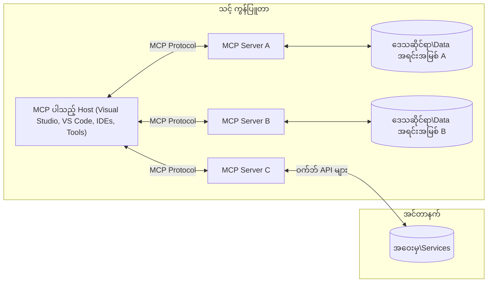

# MCP အခြေခံအယူအဆများ: AI ပေါင်းစည်းမှုအတွက် Model Context Protocol ကို ကျွမ်းကျင် စွာအသုံးပြုခြင်း

[](https://youtu.be/earDzWGtE84)

_(ဤသင်ခန်းစာ၏ ဗီဒီယိုကို ကြည့်ရန် အပေါ်ယံ ပုံကို နှိပ်ပါ)_

[Model Context Protocol (MCP)](https://github.com/modelcontextprotocol) သည် လူကြီးမင်း၏ ဘူတာကြီးဘာသာစကားမော်ဒယ်များ (LLMs) နှင့် ပြင်ပကိရိယာများ၊ အပလီကေးရှင်းများ၊ ဒေတာရင်းမြစ်များအကြား ဆက်သွယ်မှုကို အကောင်းဆုံး ပြုလုပ်ပေးသော စံနှုန်းတကျ သေချာပြီး အင်အားအပြည့်အ၀ ရှိတဲ့ ဖွဲ့စည်းပုံတစ်ခုဖြစ်သည်။  
ဤလမ်းညွှန်စာရွက်တွင် MCP ၏ အခြေခံအယူအဆများကို လေ့လာသွားပါမည်။ ဆာဗာ-ကလိုင်း အင်္ဂါရပ်များ၊ မရှိမဖြစ်လိုအပ်သော အစိတ်အပိုင်းများ၊ ဆက်သွယ်ရေးနည်းပညာများနှင့် အကောင်အထည်ဖော်မှုဆိုင်ရာ အကောင်းဆုံးနည်းလမ်းများကို သင်ယူနိုင်ပါသည်။

- **ရိုးရိုးရှင်းရှင်း အသုံးပြုသူသဘောတူခြင်း**: ဒေတာအသုံးပြုမှုနှင့် လုပ်ငန်းဆောင်ရွက်မှုအားလုံးအတွက် အသုံးပြုသူ၏ ထိုးသားသဘောတူချက်လိုအပ်ပါသည်။ အသုံးပြုသူများသည် ရရှိမည့်ဒေတာနှင့် လုပ်ဆောင်မည့် လျောက်လွှာများကိုသေချာပေါက် နားလည်ပြီး ခွင့်ပြုချက်များကို လက်စွဲထိန်းချုပ်နိုင်ရမည်။

- **ဒေတာကိုယ်ပိုင်လုံခြုံမှုကာကွယ်ချက်**: အသုံးပြုသူဒေတာကို ရိုးရိုးရှင်းရှင်း သဘောတူခြင်းဖြင့်သာထုတ်ဖော်နိုင်ပြီး၊ သင့်တော်သော လုံခြုံရေး ထိန်းချုပ်မှုများဖြင့် တစ်ခုလုံးကြားဆက်ဆံရေးမှ လုံခြုံစေပါသည်။ မလိုလားအပ်သော ဒေတာပို့ဆောင်မှုများကို တားဆီးကာ ကိုယ်ပိုင်လုံခြုံရေးနယ်နိမိတ်များကို အတင်းအကျပ် ထိန်းသိမ်းရမည်။

- **ကိရိယာသုံးစွဲပုံလုံခြုံမှု**: ကိရိယာတိုင်း ဖိတ်ခေါ်ရန် အသုံးပြုသူရဲ့ သဘောတူချက် လိုအပ်ပြီး ကိရိယာ၏ လုပ်ဆောင်ချက်၊ ပမာဏများ နှင့် ထိခိုက်မှုများကို ရှင်းရှင်းလင်းလင်း နားလည်ထားရမည်။ မလိုလားအပ် သို့မဟုတ် ဆိုးဝါးသော လုပ်ဆောင်မှုများမှ ကာကွယ်ရန် လုံခြုံရေးနယ်နိမိတ်များရှိရမည်။

- **သယ်ယူပို့ဆောင်မှုအဆင့် လုံခြုံရေး**: ဆက်သွယ်မှုလမ်းကြောင်းအားလုံးတွင် သင့်တော်သော စုံစမ်းအသုံးအဆောင်နှင့် အတည်ပြုမှု နည်းပညာများကို အသုံးပြုရမည်။ ရွေ့လျားဆက်သွယ်မှုများတွင်လည်း လုံခြုံသော သယ်ယူပို့ဆောင်မှု ပရိုတိုကိုင်းများ၊ သက်ဆိုင်ရာ အကောင့် စီမံခန့်ခွဲမှုများကို တပ်ဆင်ရမည်။

#### အကောင်အထည်ဖော်မှု လမ်းညွန်ချက်များ

- **ခွင့်ပြုချက် စီမံခန့်ခွဲမှု**: အသုံးပြုသူများအား အတိအကျ မှန်ကန်သော ခွင့်ပြုချက်များဖြင့် ဆာဗာများ၊ ကိရိယာများ၊ အရင်းအမြစ်များကို ထိန်းချုပ်ခွင့်ရှိစေရန် စနစ်တကျ ခွင့်ပြုချက်စနစ်များကို အကောင်အထည်ဖော်ပါ  
- **အတည်ပြုခြင်းနှင့် ခွင့်ပြုခြင်း**: အကောင့်လုံခြုံမှုနည်းလမ်းများ (OAuth, API keys) အသုံးပြုပြီး သက်တမ်းကုန်ဆုံးမှုနှင့် တိုကင်စီမံခန့်ခွဲမှုကို မွန်ကန်စွာဆောင်ရွက်ပါ  
- **Input အတည်ပြုခြင်း**: တိုက်ရိုက် တွက်ချက်၍ တိုက်ရိုက်ထည့်သွင်းဂဏန်းများကို တိကျသေချာ စစ်ဆေးပြီး ထိခိုက်မှု ကာကွယ်ခြင်းများ ဆောင်ရွက်ပါ  
- **စာရင်းသွင်းမှတ်တမ်းများ**: လုံခြုံရေး စစ်ဆေးခြင်းနှင့် လိုက်နာမှုအတွက် လုပ်ဆောင်မှုအားလုံးကို လိပ်စာမရှိ ကြည့်ရှုနိုင်စေရန် စနစ်တကျ လုပ်ဆောင်ပါ

## အကျဉ်းချုပ်

ဤသင်ခန်းစာသည် Model Context Protocol (MCP) ၏ အခြေခံဖွဲ့စည်းပုံနှင့် အစိတ်အပိုင်းများကို လေ့လာသွားမည်ဖြစ်သည်။ MCP ၏ ဆာဗာ-ကလိုင်း ဖွဲ့စည်းပုံ၊ မရှိမဖြစ်လိုအပ်သည့် အစိတ်အပိုင်းများ၊ နှင့် ဆက်သွယ်မှု နည်းစနစ်များကို သင်ယူလိမ့်မည်။

## အဓိကသင်ယူရမည့် ရည်ရွယ်ချက်များ

ဤသင်ခန်းစာ အပြီးတွင် လူကြီးမင်းသည် -

- MCP ၏ ဆာဗာ-ကလိုင်း ဖွဲ့စည်းပုံကို နားလည်နိုင်မည်။
- Hosts, Clients,နှင့် Servers တို့၏ အခန်းကဏ္ဍများနှင့် တာဝန်များအား ဖော်ထုတ်သိရှိနိုင်မည်။
- MCP ကို စွမ်းဆောင်မှု အလွယ်တကူ ပေါင်းစည်းနိုင်သော အင်္ဂါရပ်များ သဘောပေါက်နိုင်မည်။
- MCP စနစ်တွင် သတင်းအချက်အလက် များ ပြောင်းလဲထွက်သွားသည်ကို နားလည်နိုင်မည်။
- .NET, Java, Python နှင့် JavaScript အပြင် အခြား ဘာသာပြန်ဉပမာများမှတဆင့် လေ့ကျင့်မှု ရယူနိုင်မည်။

## MCP ဖွဲ့စည်းပုံ: နက်နက်ရှိုင်းရှိုင်း ကြည့်ခြင်း

MCP စနစ်သည် ဆာဗာ-ကလိုင်း မော်ဒယ်ပေါ်တွင် ဖွဲ့စည်း ထားသည်။ ၎င်းသည် AI အပလီကေးရှင်းများအား ကိရိယာများ၊ ဒေတာဘေ့စ်များ၊ API များ၌ ထိထိရောက်ရောက် ဆက်သွယ်နိုင်ရန် အသုံးပြုသည်။ အခုဖော်ပြမည့် အစိတ်အပိုင်းများသည် MCP ဖွဲ့စည်းပုံ၏ အခြေခံပါဝင်သည့် အစိတ်အပိုင်းများဖြစ်သည်။

MCP သည် ဆာဗာများနှင့် ချိတ်ဆက်ထားသည့် ကလိုင်းများဖြင့် ဖွဲ့စည်းပုံတည်ထားသော ဆာဗာ-ကလိုင်း ဖွဲ့စည်းပုံကို လိုက်နာသည် -


- **MCP Hosts**: VSCode, Claude Desktop, IDE များ သို့မဟုတ် MCP မှတဆင့် ဒေတာတွက်ကြည့်လိုသော AI ကိရိယာများ
- **MCP Clients**: ဆာဗာနှင့် ၁:၁ ချိတ်ဆက်မှုကို ထိန်းသိမ်းထားသည့် ပရိုတိုကော client များ
- **MCP Servers**: Model Context Protocol စံသတ်မှတ်ချက်နဲ့ သက်ဆိုင်ရာ လုပ်ဆောင်ချက်များ ဖော်ပြသည့် အလင်းပေါ့ပရိုဂရမ်များ
- **ဒေသခံဒေတာရင်းမြစ်များ**: MCP ဆာဗာများမှ လုံခြုံစွာ ဝင်ရောက်အသုံးပြုနိုင်သော ကွန်ပျူတာဖိုင်များ၊ ဒေတာဘေ့စ်များ၊ ဝန်ဆောင်မှုများ
- **ဝေးလံ့ဝန်းနယ်ဝန်ဆောင်မှုများ**: MCP ဆာဗာများမှ API များအားအသုံးပြု၍ ချိတ်ဆက်နိုင်သော အင်တာနက်ပေါ်ရှိ ပြင်ပစနစ်များ။

MCP Protocol သည် တိုးတက်လျက်ရှိသော စံနှုန်းအသစ်ဖြစ်ပြီး ခုချိန်တွင် Version **2025-11-25** ဖြစ်ပါသည်။ နောက်ဆုံးပြီးဆုံးထားသော [protocol အချက်အလက်များ](https://modelcontextprotocol.io/specification/2025-11-25/) ကို ကြည့်ရှုနိုင်ပါသည်။

### ၁။ Hosts

Model Context Protocol (MCP) တွင် **Hosts** ဆိုသည်မှာ အသုံးပြုသူများ ယူဆောင်ဆက်သွယ်သော မူလ အင်တာဖေ့စ် တစ်ခုအဖြစ် တည်ရှိသော AI အပလီကေးရှင်းများဖြစ်သည်။ Hosts သည် MCP ဆာဗာများနှင့် ချိတ်ဆက်ထားသည့် MCP clients ကို တစ်ဆင့်ချင်း စီမံထိန်းချုပ်ကာ စီစဉ်ပေးသည်။ Host များအဖြစ် -

- **AI Applications**: Claude Desktop, Visual Studio Code, Claude Code
- **ဖွံ့ဖြိုးဆဲ ပတ်ဝန်းကျင်များ**: MCP ပေါင်းစည်းပြီး IDE များနှင့် ကုဒ်ရေးသားသူများ
- **စိတ်ကြိုက် အပလီကေးရှင်းများ**: သီးသန့် AI ကိုယ်စားလှယ်များ၊ ကိရိယာများ

**Hosts** သည် AI မော်ဒယ်များဆိုင်ရာ ဆက်သွယ်မှု စီမံကိန်းများကို စီမံရာ များဖြစ်သည်။ သူတို့သည် -

- **AI မော်ဒယ်များ ချိတ်ဆက်စီမံခြင်း**: LLM များနှင့် လက်တွေ့ ဆက်သွယ်ကာ ဖြေဆိုချက်များထုတ်ပေးခြင်းနှင့် AI လည်ပတ်မှုများကို စီမံခြင်း  
- **Client ချိတ်ဆက်မှု စီမံမှု**: MCP ဆာဗာတိုင်းအတွက် MCP client တစ်ခုခြင်းဖြင့် ဖန်တီးထိန်းသိမ်းခြင်း  
- **အသုံးပြုသူအင်တာဖေ့စ် ထိန်းချုပ်မှု**: စကားဝိုင်းစနစ်၊ အသုံးပြုသူ ဆက်သွယ်မှုများ၊ ဖြေဆိုချက်ပြသမှုများကို ကိုင်တွယ်ခြင်း  
- **လုံခြုံရေး ထိန်းချုပ်မှု**: ခွင့်ပြုချက်များ၊ လုံခြုံရေး ကန့်သတ်ချက်များ၊ အတည်ပြုခြင်းများ ထိန်းသိမ်းခြင်း  
- **အသုံးပြုသူ သဘောတူချက် ကိုင်တွယ်ခြင်း**: ဒေတာမျှဝေမှုနှင့် ကိရိယာ လည်ပတ်မှုအတွက် အသုံးပြုသူ၏ ခွင့်ပြုချက် ကိုင်တွယ်မှု

### ၂။ Clients

**Clients** သည် Hosts နှင့် MCP ဆာဗာများအကြား တစ်ခုချင်းဆက်သွယ်မှုကို ထိန်းသိမ်းထားသော အဓိက အစိတ်အပိုင်းများဖြစ်သည်။ MCP client တစ်ခုစီကို Host မှ MCP ဆာဗာတစ်ခုစီနှင့် ချိတ်ဆက်ရန် ဖန်တီးသည်။ Client များစွာဖြင့် Host များသည် ဆာဗာများစွာနှင့် လက်ကားချိတ်ဆက်နိုင်သည်။

**Clients** သည် Host အပလီကေးရှင်း၏ ချိတ်ဆက်မှုအစိတ်အပိုင်းများဖြစ်သည်။ သူတို့သည် -

- **ပရိုတိုကော ဆက်သွယ်မှု**: JSON-RPC 2.0 စံနှုန်းဖြင့် ဆာဗာကို prompt များနှင့် လမ်းညွှန်ချက်များ ပေးပို့ခြင်း  
- **စွမ်းဆောင်ရည် ညှိနှိုင်းမှု**: စတင်ရာတွင် ဆာဗာနှင့် ပရိုတိုကော ဗားရှင်းနှင့် အင်္ဂါရပ်များကို ညှိနှိုင်းခြင်း  
- **ကိရိယာ လည်ပတ်ချက် စီမံခန့်ခွဲမှု**: မော်ဒယ်များမှ တောင်းဆိုသော ကိရိယာလုပ်စဉ်များကို စီမံခြင်းနှင့် ဖြေချွန်ချက်များ ပြန်လည် ဆန်းစစ်ခြင်း  
- **ရက်စက်ကြား နောက်ဆုံးသတင်းများ လက်ခံခြင်း**: ဆာဗာများမှ အသိပေးချက်များနှင့် အချိန်နှင့်တပြေးညီ အပ်ဒိတ်များကို ကိုင်တွယ်ခြင်း  
- **ဖြေဆိုချက်များ ကိုင်တွယ်ခြင်း**: ဆာဗာဖြစ်စဉ်များမှထွက်သော ဖြေဆိုချက်များကို ဖော်ပြရန် စနစ်တကျ ကောင်းမွန်စွာ ဆင်ခြင်သုံးသပ်ခြင်း

### ၃။ Servers

**Servers** သည် MCP clients များအား စွမ်းဆောင်ရည်၊ ကိရိယာများနှင့် ဖွံ့ဖြိုးမှုအဆင့်အတန်းများ ပေးသော ပရိုဂရမ်များဖြစ်သည်။ Server များသည် ဒေသခံ (Host နှင့်တူ ကွန်ပျူတာအပေါ်) သို့မဟုတ် ဝေးလံသော ပလက်ဖောင်းများတွင်လည်း လည်ပတ်နိုင်ပြီး client ၏ တောင်းဆိုမှုများကို လက်ခံဆောင်ရွက်ပေးကာ ဖွဲ့စည်းတကျ ဖြေရှင်းချက်များ ထုတ်ပေးပါသည်။ Server များသည် Model Context Protocol သတ်မှတ်ချက်အတိုင်း အသေးစိတ်လုပ်ဆောင်ချက်များကို ဖော်ပြသည်။

**Servers** သည် ပံ့ပိုးမှုများနှင့် စွမ်းဆောင်ရည်များ ပေးသော ဝန်ဆောင်မှုများဖြစ်သည်။ သူတို့သည် -

- **အင်္ဂါရပ် မှတ်ပုံတင်ခြင်း**: ချိတ်ဆက် client များသို့ ရရှိနိုင်သော အရင်းအမြစ်များ၊ prompt များ၊ ကိရိယာများ စသဖြင့် အခြေခံပစ္စည်းများကို မှတ်ပုံတင်ပေးခြင်း  
- **တောင်းဆိုမှု လက်ခံ ဆောင်ရွက်ခြင်း**: ကိရိယာအသုံးပြုမှု၊ အရင်းအမြစ်များ တောင်းခံမှုနှင့် prompt များကို လက်ခံ ကူးပြောင်းခြင်း  
- **Context ပံ့ပိုးခြင်း**: မော်ဒယ်များ၏ ပြန်လည်ဖြေကြားမှုကို မြှင့်တင်ရန် အခြေအနေ၊ သတင်းအချက်အလက်များ ပေးသွင်းခြင်း  
- **အခြေအနေ စီမံခန့်ခွဲမှု**: session အခြေအနေ ထိန်းသိမ်းကာ အခြေအနေရှိသော ဆက်ဆံမှုများကို ကိုင်တွယ်ခြင်း  
- **ရက်စက်ကြား အသိပေးချက်များ**: စွမ်းဆောင်ရည် ပြောင်းလဲမှုများနှင့် အပ်ဒိတ်များကို ချိတ်ဆက်ထားသော client များသို့ ပို့ပေးခြင်း

Servers များကို မည်သူမဆို ဖန်တီးနိုင်ပြီး အထူးပြု လုပ်ဆောင်ချက်များ ဖြင့် မော်ဒယ်စွမ်းဆောင်ရည်များကို တိုးချဲ့နိုင်သည်။ ဒေသခံနှင့် ဝေးလံတင်သွင်းမှု စနစ်များကို နှစ်မျိုးလုံး ထောက်ပံ့ပေးပါသည်။

### ၄။ Server Primitives

Model Context Protocol (MCP) နှင့် ပတ်သက်သည့် Servers များသည် Clients, Hosts နှင့် ဘာသာစကား မော်ဒယ်များကြား ထိရောက်သော ဆက်သွယ်မှုအတွက် အခြေခံပစ္စည်းဖြစ်သော **primitives** သုံးမျိုးကို ပံ့ပိုးပေးသည်။ ဤ primitives များသည် ပရိုတိုကော မှတဆင့် ရရှိနိုင်သည့် context သတင်းအချက်အလက်များနှင့် လုပ်ဆောင်ချက်အမျိုးအစားများကို သတ်မှတ်သည်။

MCP servers သည် အောက်ပါ၃ မျိုး core primitives များအနက် တစ်ခု သို့မဟုတ် ပေါင်းစပ်၍ ဖော်ပြနိုင်သည် -

#### Resources

**Resources** သည် AI အပလီကေးရှင်းများအား context သတင်းအချက်အလက်များ ပံ့ပိုးပေးသော ဒေတာရင်းမြစ်များဖြစ်သည်။ ၎င်းများသည် မော်ဒယ်နားလည်မှုနှင့် ဆုံးဖြတ်ချက် လုပ်နိုင်မှု တိုးတက်စေရန် မှတ်တမ်းတစ်ခုသို့ မျှော်မှန်းထားချက်ရှိသော အချက်အလက်များ ဖြစ်နိုင်သည် -

- **Contextual Data**: AI မော်ဒယ်အတွက် ဖွဲ့စည်းထားသော သတင်းအချက်အလက်များနှင့် အခြေအနေများ  
- **Knowledge Bases**: စာရွက်စာတမ်းများ၊ ဆောင်းပါးများ၊ လက်စွဲစာအုပ်များနှင့် သုတေသနစာတမ်းများ  
- **ဒေသခံ ဒေတာများ**: ဖိုင်များ၊ ဒေတာဘေ့စ်များနှင့် ဒေသခံစနစ်သတင်းအချက်အလက်များ  
- **ပြင်ပ ဒေတာ**: API တုံ့ပြန်ချက်များ၊ ဝက်ဘ်ဝန်ဆောင်မှုများနှင့် ဝေးလံစနစ် ဒေတာများ  
- **ပြောင်းလဲလျင်မြန်သော အကြောင်းအရာများ**: ပြင်ပဖြစ်ရပ်များအပေါ်မူတည်ပြီး အချိန်နှင့်တပြေးညီပြောင်းလဲသည့် ဒေတာများ

Resources များကို URI များဖြင့် အညွှန်းပြုထားပြီး `resources/list` နှင့် `resources/read` နည်းလမ်းများဖြင့် ရှာဖွေ၍ ထုတ်ယူနိုင်ပါသည်။

```text
file://documents/project-spec.md
database://production/users/schema
api://weather/current
```

#### Prompts

**Prompts** သည် ဘာသာစကား မော်ဒယ်များနှင့် ဆက်သွယ်မှုအတွက် ပြန်ပုံဖော် အသုံးပြုနိုင်သော စံနမူနာများဖြစ်သည်။ ၎င်းတို့သည် interaction ပုံစံများနှင့် workflow များကို စံပြသတ်မှတ်ပေး၍ လမ်းညွှန်ပေးနိုင်သည်။

- **နမူနာ အခြေပြု ဆက်သွယ်မှုများ**: ကြိုတင်ဖော်ပြထားသော စကားများနှင့် စတင်စကားပြောချက်များ  
- **Workflow Templates**: စံသတ်မှတ်ထားသော common task များအတွက် လုပ်ငန်းစဉ်များ  
- **အနည်းငယ်ပုံပြင် ဥပမာများ**: မော်ဒယ်သင်ကြားမှုအတွက် ဥပမာပုံစံများ  
- **စနစ်ချုပ် Prompts**: မော်ဒယ်အမူအရာနှင့် context ကို သတ်မှတ်ပေးသည့် အခြေခံ prompts  
- **ပြောင်းလဲနိုင်သော နမူနာများ**: အထူးအခြေအနေများအလိုက် parameter များပြောင်းလဲ၍ အသုံးပြုနိုင်သည့် prompts

Prompts များတွင် အရပြောင်းနိုင်မှု ရှိပြီး `prompts/list` သော်လည်းကောင်း၊ `prompts/get` နည်းလမ်းဖြင့် ရှာဖွေနိုင်ပါသည်။

```markdown
Generate a {{task_type}} for {{product}} targeting {{audience}} with the following requirements: {{requirements}}
```

#### Tools

**Tools** သည် AI မော်ဒယ်များမှ တည်ထောက်၍ လုပ်ဆောင်ရမည့် အထူးလုပ်ငန်းများကို ကျင့်သုံးနိုင်သော အကောင်အရင်းများ ဖြစ်သည်။ MCP စနစ်တွင် Tools တွင် ကြိယာများ ဖြစ်ပုံတွေ့ ရပြီး မော်ဒယ်များအနေဖြင့် ပြင်ပစနစ်များနှင့် ဆက်သွယ်နိုင်စေသည်။

- **အကောင်အထည်လက်တွေ့လုပ်ငန်းများ**: မော်ဒယ်များက ပုံမှန်တောင်းဆိုချက်များနှင့် parameters ဖြင့် ခေါ်ယူ၍ လုပ်ဆောင်နိုင်သော လုပ်ငန်းများ  
- **ပြင်ပစနစ်ပေါင်းစည်းမှု**: API ခေါ်ဆိုမှုများ၊ ဒေတာစုံစမ်းမှုများ၊ ဖိုင် လုပ်ဆောင်မှုများ၊ တွက်ချက်မှုများ  
- **ထူးခြားသောကိုယ်ပိုင်အမည်များ**: Tools တစ်ခုချင်းစီမှာ အမည်၊ ဖေါ်ပြချက် နှင့် parameter schema သာမက တိကျမှန်ကန်သော အချက်အလက်ရှိသည်  
- **ဖွဲ့စည်းတကျ I/O**: Tool များသည် စစ်ထုတ်ထားသော parameters ကို လက်ခံပြီး ဖွဲ့စည်းတကျ နှင့် အမျိုးအစားသတ်မှတ်ထားသော အကြောင်းအရာများ ပြန်ပေးသည်  
- **လက်တွေ့ လုပ်ဆောင်မှု စွမ်းရည်များ**: မော်ဒယ်အား လုပ်ဆောင်ချက်များ ဆောင်ရွက် စစ်ဆေးခြင်း နှင့် အသက်ဝင် ဒေတာ ရယူခွင့် ပြုပါသည်

Tools များကို parameter အတည်ပြုခြင်းအတွက် JSON Schema ဖြင့် သတ်မှတ်ထားပြီး `tools/list` မှ ရှာဖွေ ပြီး `tools/call` ဖြင့် လုပ်ဆောင်နိုင်ပါသည်။ Tools များတွင် UI ပိုမိုကောင်းမွန်စေရန် အပိုဆောင်း metadata အနေဖြင့် **အိုင်ကွန်များ** ပါဝင်နိုင်သည်။

**Tool Annotations**: Tools များသည် လမ်းညွှန်ချက် တစ်ချို့ (ဥပမာ `readOnlyHint`, `destructiveHint`) ထောက်ခံသည်။ ၎င်းတို့သည် tool သည် ဖတ်ရန်သာဖြစ်ပါသည်၊ မဟုတ်ပါက ဖျက်ဆီးမှုရှိနိုင်သည်ကို ဖော်ပြကာ client များအနေဖြင့် သတိပေး သို့မဟုတ် သေချာစွာ ချဉ်းကပ်ရန် ကူညီပေးသည်။

Tool သတ်မှတ်ချက် ဥပမာ -

```typescript
server.tool(
  "search_products", 
  {
    query: z.string().describe("Search query for products"),
    category: z.string().optional().describe("Product category filter"),
    max_results: z.number().default(10).describe("Maximum results to return")
  }, 
  async (params) => {
    // ရှာဖွေချက်ကို အကောင်အထည်ဖော်ပြီး ဖွဲ့စည်းထားသော ရလဒ်များကို ပြန်လည်ပေးပါ။
    return await productService.search(params);
  }
);
```

## Client Primitives

Model Context Protocol (MCP) တွင် **clients** များသည် Hosts တွင် ပိုမိုစွမ်းဆောင်ရည်မြင့်ပြီး server များမှ အပိုအင်္ဂါရပ် တောင်းမြှောက်ခွင့် ရရှိအောင် အောက်ပါ client-side primitives များကို ဖော်ပြနိုင်သည်။ ၎င်းတို့သည် servers များကို AI မော်ဒယ် စွမ်းရည်များနှင့် အသုံးပြုသူ ဆက်သွယ်မှုများကို ရယူရန် ခွင့်ပြုသည်။

### Sampling

**Sampling** သည် servers များအား client ၏ AI အသုံးပြုမှုမှ ဘာသာစကား မော်ဒယ် ဖြည့်စွက်ချက်များ မျှဝေရန် ခွင့်ပြုသည်။ ၎င်းသည် servers များကို မော်ဒယ် ကိုယ်တိုင် မပါဘဲ LLM စွမ်းဆောင်ရည်ကို အသုံးပြုရသည့် နည်းလမ်းဖြစ်သည်။

- **မော်ဒယ် မပေါင်းစည်းခြင်း**: Server များသည် LLM SDK မပါဘဲ မော်ဒယ်အား ရယူရန် တောင်းဆိုနိုင်သည်  
- **Server မူတည် AI အား ထောက်ပံ့ခြင်း**: Server များသည် client ၏ AI မော်ဒယ်ကို အသုံးပြုပြီး မိမိအလိုအလျောက် အကြောင်းအရာ ဖန်တီးနိုင်သည်  
- **နောက်ဆက်တွဲ LLM ဆက်သွယ်မှုများ**: Server များအနေဖြင့် အားနည်းချက်များကူညီရန် AI ဒီဇိုင်းနည်းပညာ အသုံးပြုနိုင်သည်  
- **ပြောင်းလဲနိုင်သော အကြောင်းအရာ ဖန်တီးမှု**: Servers သည် host ၏ မော်ဒယ်ကို အသုံးပြု၍ Contextual responses များ ဖန်တီးနိုင်ခြင်း  
- **Tool ခေါ်ဆိုမှု ထောက်ပံ့မှု**: Servers များသည် `tools` နှင့် `toolChoice` parameters ကေန client မော်ဒယ်များကို sampling အတွင်း ကိရိယာပြုလုပ်ခွင့် ပေးနိုင်သည်

Sampling ကို `sampling/complete` method ကို အသုံးပြု၍ စတင်ပြုလုပ်သည်။

### Roots

**Roots** သည် clients များမှ servers များအား ဖိုင်စနစ် အဆောက်အအုံ ခြံနယ်နိမိတ်များကို ပံ့ပိုးကာ servers များအနေဖြင့် မည်သည့် directory များနှင့် ဖိုင်များကို ဝင်ရောက်ခွင့်ရှိသည်ကို နားလည်ရစေသည်။

- **ဖိုင်စနစ် နယ်နိမိတ်**: Servers များ၏ လည်ပတ်ခွင့် ရှိသည့် ဖိုင်စနစ် အပိုင်းများသတ်မှတ်ပေးခြင်း  
- **ခွင့်ပြုချက် ထိန်းချုပ်မှု**: Servers များအနေဖြင့် မည်သည့် directory နှင့် ဖိုင်များကို ရယူခွင့်ရှိသည် နားလည်ရန်  
- **ပြောင်းလဲမှုကွဲပြားမှုများအတွက် အသိပေးမှု**: Roots အဆိုပါ စာရင်းပြောင်းလဲသည့်အခါ client များမှ servers များအား အသိပေးနိုင်မှု  
- **URI အခြေခံ အသိအမှတ်ပြုခြင်း**: Roots များသည် `file://` URI များအသုံးပြုပြီး directory နှင့် ဖိုင်များကို သတ်မှတ်သည်

Roots များကို `roots/list` method ဖြင့် ရှာဖွေပြီး Roots ပြောင်းလဲစဉ် `notifications/roots/list_changed` ထုတ်ပေးသည်။

### Elicitation

**Elicitation** သည် servers များအား client ၏ အင်တာဖေ့စ်မှတဆင့် အသုံးပြုသူထံမှ အပိုဆောင်း သတင်းအချက်အလက် သို့မဟုတ် သဘောတူချက် ရယူရန် အကူအညီဖြစ်စေသည်။

- **အသုံးပြုသူ ထည့်သွင်းချက် တောင်းဆိုမှုများ**: ကိရိယာ လုပ်ဆောင်မှုအတွက် လိုအပ်သည့် အပိုဆောင်း အချက်အလက်များ မေးမြန်းခြင်း  
- **သဘောတူချက် ကိရိယာများ**: ထိခိုက်မှုရှိသော လုပ်ငန်းများအတွက် အသုံးပြုသူ၏ ခွင့်ပြုချက် အတည်ပြုမှု တောင်းဆိုခြင်း  
- **အကွက်တိတိ Workflow များ**: အဆင့်ဆင့် အသုံးပြုသူ မေးမြန်းမှုများ ဖန်တီးပေးခြင်း  
- **ပြောင်းလဲနိုင်သော Parameter စုဆောင်းခြင်း**: ကိရိယာ လည်ပတ်မှုအတွင်း လိုအပ်သော parameter များကို စုဆောင်းခြင်း

Elicitation ကို `elicitation/request` method ဖြင့် client interface မှတဆင့် အသုံးပြုသူ input ကို စုဆောင်းသည်။

**URL Mode Elicitation**: Servers များသည် အပြင်ဘက် ဝက်ဘ်စာမျက်နှာများသို့ အသုံးပြုသူများကို ဦးတည်ပို့ရန်အတွက် URL-based အင်တာဖေ့စ် အသုံးပြုမှုကိုလည်း တောင်းဆိုနိုင်ပါသည်။ ၎င်းသည် အတည်ပြုမှု၊ မှတ်ပုံတင်ခြင်း၊ ဒေတာထည့်သွင်းမှုများအတွက် အသုံးပြုနိုင်သည်။

### Logging

**Logging** သည် servers များမှ client များသို့ အတိအကျ ဖော်ပြထားသော log မက်ဆေ့များ ပို့ပေး၍ မှားယွင်းချက်ရှာဖွေရေး၊ စောင့်ကြည့်မှုနှင့် လည်ပတ်မှုမြင်သာမှုများ ဖန်တီးပေးသည်။

- **မှားယွင်းချက်ရှာဖွေရေး ထောက်ခံမှု**: လိုအပ်သလို လုပ်ဆောင်မှု ဖော်ပြချက် အသေးစိတ် log မက်ဆေ့များ ပေးပို့ခြင်း  
- **အလုပ်လုပ်ဆောင်မှု စောင့်ကြည့်ခြင်း**: အခြေအနေတင်ပြချက်များ၊ ဖော်ပြချက်များကို client သို့ ပေးပို့ခြင်း  
- **အမှားကြေညာချက်များ**: အမှားအမျိုးမျိုး အကြောင်းအရာနှင့် ရှာဖွေရေးသတင်းအချက်အလက်များ ပေးပို့ခြင်း  
- **စစ်ဆေးခြင်း မှတ်တမ်းများ**: Server လုပ်ဆောင်ချက်များနှင့် ဆုံးဖြတ်ချက်များအား အတိအကျ မှတ်တမ်းတင်ခြင်း

Logging မက်ဆေ့များကို client များသို့ ပို့ပေးကာ server လုပ်ငန်းစဉ်များ တွေ့ကြုံရသည့် အခြေအနေ များကို ဖော်ပြပေးသည်။

## MCP တွင် သတင်းအချက်အလက် များ ပြောင်းလဲမှု နည်း

Model Context Protocol (MCP) သည် hosts, clients, servers, နှင့် မော်ဒယ်များအကြား သတင်းအချက်အလက် များ ပြောင်းလဲမှုကို စနစ်တကျ သတ်မှတ်ထားသည်။ ထိုသဘာဝသည် user တောင်းဆိုချက်များ လုပ်ငန်းစဉ်ပုံစံနှင့် ပြင်ပကိရိယာများနှင့် ဒေတာများ မော်ဒယ် ဖြေဆိုချက်တွင် ပေါင်းစည်းသွားစေရန် အရေးကြီးသည်။

- **Host မှ ချိတ်ဆက်မှု စတင်ခြင်း**  
  Host အပလီကေးရှင်း (ဥပမာ IDE သို့မဟုတ် စကားဝိုင်း အင်တာဖေ့စ်) သည် MCP ဆာဗာနှင့် ပုံမှန်အားဖြင့် STDIO, WebSocket သို့မဟုတ် အခြား သယ်ယူပို့ဆောင်မှုနည်းလမ်းတစ်ခုဖြင့် ချိတ်ဆက်မှု တည်ဆောက်သည်။

- **စွမ်းဆောင်ရည် ညှိနှိုင်းခြင်း**  
  Client နှင့် Server နှစ်ဖက် လက်ခံရရှိနိုင်သည့် အင်္ဂါရပ်များ၊ ကိရိယာများ၊ အရင်းအမြစ်များနှင့် ပရိုတိုကော ဗားရှင်းများ အကြောင်း ပြန်လည် မျှဝေပြီး ဆွေးနွေး တက်သည်။

- **အသုံးပြုသူ တောင်းဆိုချက်**  
  အသုံးပြုသူသည် Host နှင့် ထိတွေ့ဆက်ဆံ (ဥပမာ prompt တစ်ခု၊ အမိန့်တစ်ခု ထည့်သွင်းခြင်း) ပြီး Host သည် ထို input ကို client သို့ လွှဲပြောင်းသည်။

- **ဒေတာအရင်းအမြစ် သို့မဟုတ် ကိရိယာ အသုံးပြုမှု**  
  - Client သည် ဆာဗာထံမှ ပိုမိုအချက်အလက် သို့မဟုတ် အရင်းအမြစ်များ (ဖိုင်များ၊ ဒေတာဘေ့စ် မှတ်တမ်းများ၊ Knowledge Base ဆောင်းပါးများ) ကို တောင်းဆိုနိုင်သည်၊ မော်ဒယ်နားလည်မှုအား မြှင့်တင်ဖို့  
  - မော်ဒယ်က ကိရိယာ တစ်ခုကို မဖိတ်ခေါ်မီ (ဥပမာ ဒေတာ ရယူရန်၊ တွက်ချက်မှု ပြုရန် သို့မဟုတ် API ခေါ်ရန်) Client က ဆာဗာ ထံသို့ ကိရိယာ ခေါ်ဆိုမှု တောင်းဆိုချက်ပေးပို့သည်။ ထိုတွင် tool အမည်နှင့် parameter များ ပါဝင်သည်။

- **ဆာဗာ လုပ်ဆောင်ချက်**  

ဆာဗာသည် ရင်းမြစ် သို့မဟုတ် ကိရိယာ တောင်းဆိုမှုကို လက်ခံပြီး လိုအပ်သော လုပ်ဆောင်ချက်များ (Function တစ်ခု လည်ပတ်ခြင်း၊ ဒေတာဘေ့စ် မေးခွန်းထုတ်ခြင်း သို့မဟုတ် ဖိုင် ရယူခြင်းစသည်) ကို အကောင်အထည်ဖော်ပြီး၊ ရလာဒ်များကို ဖောင်းဖောင်းချိန်နည်းဖြင့် client ထံ ပြန်ပေးပို့သည်။

- **ဖြေကြားချက် ဖန်တီးခြင်း**  
  Client သည် ဆာဗာ၏ ဖြေကြားချက်များ (ရင်းမြစ်ဒေတာ၊ ကိရိယာထုတ်လုပ်မှု စသည်) ကို ongoing model interaction ထဲသို့ ပေါင်းစပ်သုံးစွဲသည်။ ဒီ model သည် ထိုသတင်းအချက်အလက်များကို အသုံးပြု၍ အပြည့်အစုံရှိပြီး context ကျဆုံးသော ဖြေကြားချက် တစ်ခု ဖန်တီးပေးသည်။

- **ရလဒ် ပြသခြင်း**  
  Host သည် client မှ နောက်ဆုံး ထုတ်လွှင့်ချက် ကို လက်ခံပြီး အသုံးပြုသူဆီသို့ တင်ပြပေးသည်။ ပုံမှန်အားဖြင့် model ရေးဆွဲထားသော စာသား နှင့် ကိရိယာများကို ပြေးဆွဲ မည်သို့လုပ်ထားသည်ဆိုသော ရလဒ်များကိုလည်း ပါဝင်စေသည်။

ဤစနစ် သွင်ပြင်ထားမှုကြောင့် MCP သည် မိုဒယ်များကို အပြင်က ကိရိယာများ နှင့် ဒေတာ အရင်းအမြစ်များနှင့် အလွယ်တကူ ချိတ်ဆက်ပြီး လွန်စွာ တိုးတက်သော interactive နှင့် context-aware AI အပလီကေးရှင်းများကို ပံ့ပိုးနိုင်သည်။

## Protocol Architecture & Layers

MCP သည် အပြည့်အစုံသော ဆက်သွယ်မှု မဟာဗျူဟာကို ပံ့ပိုးပေးသည့် နှစ်ခုခွဲသော စာရင်းပုံစံ အဆင့်များပါရှိသည်။

### Data Layer

**Data Layer** သည် MCP protocol ၏ အခြေခံအဖြစ် **JSON-RPC 2.0** ကို အသုံးပြု၍ core MCP protocol ကို အကောင်အထည်ဖော်သည်။ ဤအဆင့်သည် စာတိုက်ဖွဲ့စည်းမှု၊ အဓိပ္ပါယ်နားလည်မှုနှင့် လူမှုဆက်ဆံရေး ပုံစံများကို သတ်မှတ်သည်။

#### အဓိက အစိတ်အပိုင်းများ

- **JSON-RPC 2.0 Protocol**: စာတိုက်လွှဲပြောင်းမှုများကို method calls, responses, notifications တို့အတွက် ပုံမှန် JSON-RPC 2.0 ပုံစံဖြင့် အသုံးပြုသည်။
- **Lifecycle Management**: Client နှင့် server များကြား ဆက်သွယ်မှု စတင်ခြင်း၊ စွမ်းဆောင်ရည်ညှိနှိုင်းခြင်း နှင့် ဆက်သွယ်မှုအဆက်အမြဲ ပိတ်သိမ်းခြင်းကို ကိုင်တွယ်စီမံသည်။
- **Server Primitives**: Server များသည် ကိရိယာများ၊ ရင်းမြစ်များ၊ နှင့် prompts များမှတဆင့် အခြေခံလုပ်ဆောင်ချက်များ ပံ့ပိုးပေးနိုင်သည်။
- **Client Primitives**: Server များသည် LLM sampling မေးမြန်းခွင့်၊ user input ဖော်ထုတ်ခြင်းနှင့် လော့ဂ်စာတိုက်များပို့ခြင်းတို့ကို client ထံ တောင်းဆိုနိုင်သည်။
- **Real-time Notifications**: Polling မလိုအပ်ပဲ dynamic update များအတွက် asynchronous notifications များအား ထောက်ပံ့ပေးသည်။

#### အဓိက အင်္ဂါရပ်များ

- **Protocol Version Negotiation**: YYYY-MM-DD ပုံစံ၏ နေ့စွဲနှင့်အတူ ဗားရှင်းကို သတ်မှတ်နိုင်မည်။
- **Capability Discovery**: မိမိ အသုံးပြုသူနှင့် ဆာဗာသို့ စတင်ဆက်သွယ်ချိန်တွင် ထောက်ပံ့သည့် လက္ခဏာများကို သပ်ရပ်ညှိနှိုင်းသည်။
- **Stateful Sessions**: မတူညီသည့် အကျဉ်းချုပ်ဆက်သွယ်မှုများအတွင်း အခြေအနေကို ထိန်းသိမ်းပေးကာ context continuity ရရှိစေသည်။

### Transport Layer

**Transport Layer** သည် MCP ပါဝင်သူများအကြား ဆက်သွယ်ရန် စနစ်များ၊ စာတိုက်ဖွဲ့စည်းမှုနှင့် အထောက်အပံ့ ပြုခြင်းတို့ကို စီမံခန့်ခွဲသည်။

#### ထောက်ပံ့ထားသော အလွယ်တကြောင်း ပူးတွဲ စနစ်များ

1. **STDIO Transport**:
   - တိုက်ရိုက်လုပ်ငန်းစဉ်များအတွက် standard input/output စနစ်များကို အသုံးပြုသည်။
   - တစ်စက်တွင် လုပ်ငန်းစဉ်များ များဆက်တိုက်လည်ပတ်ရာတွင် network overhead မရှိသော optimal စနစ်ဖြစ်သည်။
   - ဒေသန္တရ MCP ဆာဗာလုပ်ငန်းအတွက် အများအားဖြင့် အသုံးဝင်သည်။

2. **Streamable HTTP Transport**:
   - Client မှ server သို့ HTTP POST မက်ဆေ့ချ်များကိုအသုံးပြုသည်။
   - ဆာဗာမှ client ဆီသို့ server-sent events (SSE) ကို ရွေးချယ်အသုံးပြု၍ streaming ထောက်ပံ့ခံနိုင်သည်။
   - အကွာအဝေး ဆာဗာ များကို နက်ဝပ်ကွန်ယက်ဖြင့် ဆက်သွယ်နိုင်သည်။
   - HTTP authentication (bearer tokens, API keys, custom headers) ကို ထောက်ပံ့သည်။
   - MCP သည် secure token-based authentication အတွက် OAuth ကို အကြံပြုသည်။

#### Transport Abstraction:

Transport layer သည် data layer မှ ဆက်သွယ်မှု အသေးစိတ်များကို abstraction ပြုလုပ်ထား၍ မည်သည့် transport mechanism ဖြစ်ဖြစ် JSON-RPC 2.0 စာတိုက်ပုံစံ တစ်ခုတည်းဖြင့် အသုံးပြုနိုင်သည်။ ထို abstraction ဖြင့် application များသည် local နှင့် remote server များအကြား လွယ်ကူစွာ ပြောင်းလဲ အသုံးပြုနိုင်သည်။

### ဘေးကင်းမှု ဆိုင်ရာ အကြံပြုချက်များ

MCP ကို လုံခြုံသော၊ ယုံကြည်စိတ်ချရသော နှင့် ဘေးကင်းသော ချိတ်ဆက်မှုများအတွက် အောက်ပါ အရေးကြီးသော လုံခြုံရေး 원칙များနှင့် မကျြပုံးစွာလိုက်နာရမည်။

- **အသုံးပြုသူ သဘောတူညီချက်နှင့် ထိန်းချုပ်မှု**: အသုံးပြုသူသည် ဒေတာ အသုံးပြုခြင်း သို့မဟုတ် လုပ်ဆောင်ချက်များ လုပ်ဆောင်ခြင်းမပြုမီ သတိပြုဆောင်ရွက်ရန် သေချာပေးရမည်။ ထိန်းချုပ်မှုများမှာ မည်သည့်ဒေတာများ မျှဝေမည်နှင့် ဘယ်လုပ်ဆောင်ချက်ကို ခွင့်ပြုမည်ကို ထိန်းချုပ်နိုင်မည်ဖြစ်ကာ လက်ခံရာမှာ အသုံးပြုသူအတွက် ရိုးရှင်းပြတ်သားသော interface များ ရှိရမည်။

- **ဒေတာ ကိုယ်ရေးကာကွယ်မှု**: အသုံးပြုသူဒေတာသည် သဘောတူညီချက် ရရှိပြီးမှသာ ဖော်ပြသင့်ပြီး၊ သင့်တော်သော access control များဖြင့် ကာကွယ်ထားရမည်။ MCP implementation များသည် ပင်မတားပန်ခြင်းမဟုတ်သော ဒေတာ ပို့ဆောင်မှုများကို ကာကွယ်ရန်နှင့် မည်သည့်ဆက်သွယ်မှုဖြင့် မှPrivacy မပျက်စီးစေရန် ဂရုပြုရမည်။

- **ကိရိယာ လုံခြုံမှု**: ကိရိယာကို အသုံးပြုရန် မတိုင်မီ အသုံးပြုသူ၏ သဘောတူညီချက် လိုအပ်သည်။ အသုံးပြုသူသည် နောက်ခံ function များကို နားလည်စေရမည်ဖြင့် ဆက်တင်၍ မတော်တဆ သို့မဟုတ် ဘေးအန္တရာယ်ဖြစ်သည့် ကိရိယာ လည်ပတ်မှု မဖြစ်အောင် လုံခြုံစည်းကမ်းများ ပြည့်စုံစွာ ထားရှိရမည်။

ဤ လုံခြုံရေး 원칙များကို လိုက်နာခြင်းအားဖြင့် MCP သည် အသုံးပြုသူ ယုံကြည်မှု၊ ကိုယ်ရေးရာဇဝင် ကာကွယ်မှု နှင့် လုံခြုံမှုများကို မည်သည့် protocol လုပ်ဆောင်ချက်မဆို ထိန်းသိမ်းပေးနိုင်ကာ အင်အားကြီးသော AI ပေါင်းစပ်မှုများကိုလည်း ချိတ်ဆက်ပေးနိုင်ပါသည်။

## Code Examples: Key Components

အောက်တွင် MCP ဆာဗာ အစိတ်အပိုင်းများနှင့် ကိရိယာများ ပြုလုပ်ပုံကို လူကြိုက်များသော programming ဘာသာစကားအချို့ဖြင့် ဥပမာ ပြထားသည်။

### .NET ဥပမာ: ကိရိယာများနှင့် ရိုးရှင်း MCP Server တည်ဆောက်ခြင်း

ဒီမှာ ကိရိယာများကို သတ်မှတ် သွင်းသည့်၊ တောင်းဆိုမှုကို ကိုင်တွယ် သည့် နည္းလမ်းများကို မျှဝေသည့် .NET ကုဒ် ဥပမာ ဖြစ်သည်။ ဒါက Model Context Protocol ကို အသုံးပြု၍ ဆာဗာချိတ်ဆက်ခြင်းကိုလည်း ပြသသည်။

```csharp
using System;
using System.Threading.Tasks;
using ModelContextProtocol.Server;
using ModelContextProtocol.Server.Transport;
using ModelContextProtocol.Server.Tools;

public class WeatherServer
{
    public static async Task Main(string[] args)
    {
        // Create an MCP server
        var server = new McpServer(
            name: "Weather MCP Server",
            version: "1.0.0"
        );
        
        // Register our custom weather tool
        server.AddTool<string, WeatherData>("weatherTool", 
            description: "Gets current weather for a location",
            execute: async (location) => {
                // Call weather API (simplified)
                var weatherData = await GetWeatherDataAsync(location);
                return weatherData;
            });
        
        // Connect the server using stdio transport
        var transport = new StdioServerTransport();
        await server.ConnectAsync(transport);
        
        Console.WriteLine("Weather MCP Server started");
        
        // Keep the server running until process is terminated
        await Task.Delay(-1);
    }
    
    private static async Task<WeatherData> GetWeatherDataAsync(string location)
    {
        // This would normally call a weather API
        // Simplified for demonstration
        await Task.Delay(100); // Simulate API call
        return new WeatherData { 
            Temperature = 72.5,
            Conditions = "Sunny",
            Location = location
        };
    }
}

public class WeatherData
{
    public double Temperature { get; set; }
    public string Conditions { get; set; }
    public string Location { get; set; }
}
```

### Java ဥပမာ: MCP Server အစိတ်အပိုင်းများ

ဒီဥပမာမှာ .NET ဥပမာအတိုင်း MCPဆာဗာနှင့် ကိရိယာ စာရင်းသွင်းခြင်းကို Java သုံး၍ ပြုလုပ်ထားသည်။

```java
import io.modelcontextprotocol.server.McpServer;
import io.modelcontextprotocol.server.McpToolDefinition;
import io.modelcontextprotocol.server.transport.StdioServerTransport;
import io.modelcontextprotocol.server.tool.ToolExecutionContext;
import io.modelcontextprotocol.server.tool.ToolResponse;

public class WeatherMcpServer {
    public static void main(String[] args) throws Exception {
        // MCP ဆာဗာတစ်ခု ဖန်တီးပါ
        McpServer server = McpServer.builder()
            .name("Weather MCP Server")
            .version("1.0.0")
            .build();
            
        // မိုးလေဝသကိရိယာတစ်ခု စာရင်းသွင်းပါ
        server.registerTool(McpToolDefinition.builder("weatherTool")
            .description("Gets current weather for a location")
            .parameter("location", String.class)
            .execute((ToolExecutionContext ctx) -> {
                String location = ctx.getParameter("location", String.class);
                
                // မိုးလေဝသ ဒေတာထုတ်ယူပါ (ရိုးရှင်းစွာ)
                WeatherData data = getWeatherData(location);
                
                // ဖော်မတ်လုပ်ထားသော တုံ့ပြန်ချက် ပြန်ပေးပါ
                return ToolResponse.content(
                    String.format("Temperature: %.1f°F, Conditions: %s, Location: %s", 
                    data.getTemperature(), 
                    data.getConditions(), 
                    data.getLocation())
                );
            })
            .build());
        
        // stdio ပို့ဆောင်မှုဖြင့် ဆာဗာချိတ်ဆက်ပါ
        try (StdioServerTransport transport = new StdioServerTransport()) {
            server.connect(transport);
            System.out.println("Weather MCP Server started");
            // လုပ်ငန်းစဉ် မရပ်တန့်သည်ထိ ဆာဗာကို ဆက်လက်ပြေးမြောက်စေပါ
            Thread.currentThread().join();
        }
    }
    
    private static WeatherData getWeatherData(String location) {
        // ထုတ်လုပ်မှုတွင် မိုးလေဝသ API ကို ခေါ်ယူပါမည်
        // ဥပမာရည်ရွယ်ချက်အတွက် ရိုးရှင်းစေထားပါသည်
        return new WeatherData(72.5, "Sunny", location);
    }
}

class WeatherData {
    private double temperature;
    private String conditions;
    private String location;
    
    public WeatherData(double temperature, String conditions, String location) {
        this.temperature = temperature;
        this.conditions = conditions;
        this.location = location;
    }
    
    public double getTemperature() {
        return temperature;
    }
    
    public String getConditions() {
        return conditions;
    }
    
    public String getLocation() {
        return location;
    }
}
```

### Python ဥပမာ: MCP Server တည်ဆောက်ခြင်း

ဒီဥပမာကို fastmcp ကြိုတင် Install လုပ်ထားရန် လိုအပ်ပါသည်။

```python
pip install fastmcp
```
Code Sample:

```python
#!/usr/bin/env python3
import asyncio
from fastmcp import FastMCP
from fastmcp.transports.stdio import serve_stdio

# FastMCP ဆာဗာတစ်ခု ဖန်တီးပါ
mcp = FastMCP(
    name="Weather MCP Server",
    version="1.0.0"
)

@mcp.tool()
def get_weather(location: str) -> dict:
    """Gets current weather for a location."""
    return {
        "temperature": 72.5,
        "conditions": "Sunny",
        "location": location
    }

# အတန်းကို အသုံးပြုသော နည်းလမ်း အခြားတစ်ခု
class WeatherTools:
    @mcp.tool()
    def forecast(self, location: str, days: int = 1) -> dict:
        """Gets weather forecast for a location for the specified number of days."""
        return {
            "location": location,
            "forecast": [
                {"day": i+1, "temperature": 70 + i, "conditions": "Partly Cloudy"}
                for i in range(days)
            ]
        }

# အတန်း tools များ မှတ်ပုံတင်ပါ
weather_tools = WeatherTools()

# ဆာဗာကို စတင်ပါ
if __name__ == "__main__":
    asyncio.run(serve_stdio(mcp))
```

### JavaScript ဥပမာ: MCP Server တည်ဆောက်ခြင်း

အောက်က ဥပမာသည် JavaScript နဲ့ MCP server တစ်ခုတည်ဆောက်ခြင်းနှင့် မိုးလေဝသဆိုင်ရာ ကိရိယာ နှစ်ခု စာရင်းသွင်းပုံ ကို ပြသထားသည်။

```javascript
// တရားဝင် Model Context Protocol SDK ကို အသုံးပြုခြင်း
import { McpServer } from "@modelcontextprotocol/sdk/server/mcp.js";
import { StdioServerTransport } from "@modelcontextprotocol/sdk/server/stdio.js";
import { z } from "zod"; // ပါရာမီတာ သက်ဆိုင်မှုကို စစ်ဆေးရန်

// MCP ဆာဗာတစ်ခု ဖန်တီးပါ
const server = new McpServer({
  name: "Weather MCP Server",
  version: "1.0.0"
});

// မိုးလေဝသကိရိယာတစ်ခု သတ်မှတ်ပါ
server.tool(
  "weatherTool",
  {
    location: z.string().describe("The location to get weather for")
  },
  async ({ location }) => {
    // ယင်းသည် ပုံမှန်အားဖြင့် မိုးလေဝသ API ကို ခေါ်သုံးပါလိမ့်မည်
    // ပြသရန် လွယ်ကူစေသော ပုံစံ
    const weatherData = await getWeatherData(location);
    
    return {
      content: [
        { 
          type: "text", 
          text: `Temperature: ${weatherData.temperature}°F, Conditions: ${weatherData.conditions}, Location: ${weatherData.location}` 
        }
      ]
    };
  }
);

// မိုးလေဝသခန့်မှန်းကိရိယာ တစ်ခု သတ်မှတ်ပါ
server.tool(
  "forecastTool",
  {
    location: z.string(),
    days: z.number().default(3).describe("Number of days for forecast")
  },
  async ({ location, days }) => {
    // ယင်းသည် ပုံမှန်အားဖြင့် မိုးလေဝသ API ကို ခေါ်သုံးပါလိမ့်မည်
    // ပြသရန် လွယ်ကူစေသော ပုံစံ
    const forecast = await getForecastData(location, days);
    
    return {
      content: [
        { 
          type: "text", 
          text: `${days}-day forecast for ${location}: ${JSON.stringify(forecast)}` 
        }
      ]
    };
  }
);

// ကူညီဆောင်ရွက်ချက်များ
async function getWeatherData(location) {
  // API ခေါ်ဆိုမှု အတိုကောက် ဖန်တီးခြင်း
  return {
    temperature: 72.5,
    conditions: "Sunny",
    location: location
  };
}

async function getForecastData(location, days) {
  // API ခေါ်ဆိုမှု အတိုကောက် ဖန်တီးခြင်း
  return Array.from({ length: days }, (_, i) => ({
    day: i + 1,
    temperature: 70 + Math.floor(Math.random() * 10),
    conditions: i % 2 === 0 ? "Sunny" : "Partly Cloudy"
  }));
}

// stdio သယ်ယူပို့ဆောင်မှု အသုံးပြု၍ ဆာဗာကို ဆက်သွယ်ပါ
const transport = new StdioServerTransport();
server.connect(transport).catch(console.error);

console.log("Weather MCP Server started");
```

ဒီ JavaScript ဥပမာမှာ MCP client တစ်ခုတည်ဆောက်၍ ဆာဗာချိတ်ဆက်၊ prompt တစ်ခု ပေးပို့ခြင်းနဲ့ ကိရိယာ အသုံးပြုမှု များကို ပါဝင်စေခြင်းအထိ ဖြစ်စဉ်တင်ပြထားသည်။

## Security and Authorization

MCP တွင် Security နှင့် Authorization ကို ကိုင်တွယ်မှုများအတွက် အောက်ပါ အယူအဆများနှင့် စနစ်များ ပါဝင်ထားသည်။

1. **ကိရိယာ ခွင့်ပြုချက် ထိန်းချုပ်မှု**  
  Client များသည် မူလတန်း မော်ဒယ် အသုံးပြုခွင့်ရှိသော ကိရိယာများကို သတ်မှတ်နိုင်သည်။ ထိုကိရိယာများသာ အသုံးပြုခွင့်ရရှိမှုရှိပါကသာ သုံးနိုင်ပြီး မတော်တဆ သို့မဟုတ် ဘေးကင်းခြင်းမရှိသော လုပ်ဆောင်ချက်များ ဖြစ်ပေါ်ခြင်းကို ကာကွယ်သည်။ ခွင့်ပြုချက်များကို အသုံးပြုသူ စိတ်ကြိုက်၊ အဖွဲ့အစည်း မူဝါဒများ၊ သို့မဟုတ် အလုပ်လုပ်နည်းသဘောအရ ပြောင်းလဲသွားနိုင်သည်။

2. **Authentication**  
  Server များသည် ကိရိယာများ၊ ရင်းမြစ်များ သို့မဟုတ် အလယ်အလတ် လုပ်ဆောင်မှုများသို့ ဝင်ရောက်ခွင့် တောင်းခံရန် authentication လုပ်ဆောင်နိုင်သည်။ API keys, OAuth tokens သို ့မဟုတ် အခြား authentication စနစ်များ ပါဝင်နိုင်သည်။ မှန်ကန်သော authentication ဖြင့် ယုံကြည်စိတ်ချရသော client များနှင့်အသုံးပြုသူများသာ ဆာဗာမှ ရနိုင်သော စွမ်းဆောင်ရည်များကို ခေါ်ယူနိုင်သည်။

3. **စစ်ဆေးခြင်း (Validation)**  
  ကိရိယာခေါ်ယူရာ parameter များအားလုံးကို စစ်ဆေးချက်များထားရှိသည်။ ကိရိယာတိုင်းသည် parameter များအတွက် မျှော်မှန်းထားသော data အမျိုးအစားများ၊ format များနှင့် ကန့်သတ်ချက်များ သတ်မှတ်သည်။ ဆာဗာ၌ ရောက်ရှိလာသော တောင်းဆိုချက်များကို လေးနက်စွာ စစ်ဆေးကာ မမှန်ကန်သော ဒေတာ သို့မဟုတ် မကောင်းသော input များနဲ့ ကိရိယာ လုပ်ဆောင်မှုများ မရောက်ပျက်စီးရန် ကာကွယ်သည်။

4. **နှုန်းထား ကန့်သတ်ခြင်း (Rate Limiting)**  
  ကိရိယာခေါ်ယူခြင်း သို့မဟုတ် ရင်းမြစ်များအသုံးပြုမှု များ၏ အလွန်အကျွံ အသုံးပြုမှုများကို တားဆီးကာ စားသုံးမှုကို တန်းတူညီမျှဖြစ်အောင် MCP ဆာဗာများ၌ rate limiting များ ထိန်းသိမ်းနိုင်သည်။ ၎င်းကို အသုံးပြုသူအလိုက်၊ session အလိုက် သို့မဟုတ် global ကိုယ်စား ပြု၍ တားဆီးကာ service ျပစ်မှားမှု သို့မဟုတ် ဝန်ဆောင်မှု ဝင်မည့် လျော်ကြေးချိုးမှု မဖြစ်အောင် ကာကွယ်နိုင်သည်။

ဤစနစ်များ ပေါင်းစပ်အသုံးပြုခြင်းအားဖြင့် MCP သည် ဘာသာစကား မော်ဒယ်များကို အပြင်ဘက် ကိရိယာများနှင့် ဒေတာ ရင်းမြစ်များဖြင့် လုံခြုံစိတ်ချရစွာပေါင်းစည်းနိုင်ပြီး အသုံးပြုသူ တိုင်းနှင့် developer များကို အသုံးခွင့်နှင့် အသုံးပြုပုံကို တိတိကျကျ ထိန်းချုပ်ခွင့် ပေးစွမ်းသည်။

## Protocol Messages & Communication Flow

MCP ဆက်သွယ်မှုတွင် **JSON-RPC 2.0** စာတိုက်များကို အသုံးပြုကာ host, client နှင့် server များအကြား သေချာချိတ်ဆက်မှုများရရှိစေရန် ကြောင်းအတိုင်းကနေ ဖေါ်ပြထားသည်။ protocol သည် လုပ်ငန်းတစ်မျိုးချင်းစီအတွက် သတ်မှတ်ထားသော message ပုံစံများ ပါဝင်သည်။

### အဓိက Message အမျိုးအစားများ

#### **Initialization Messages**
- **`initialize` Request**: ဆက်သွယ်မှု စတင်ပြီး protocol ဗားရှင်းနှင့် စွမ်းဆောင်ရည်များ ညှိနှိုင်းသည်။
- **`initialize` Response**: ထောက်ပံ့သည့် features နှင့် server အချက်အလက်များကို အတည်ပြုသည်။
- **`notifications/initialized`**: စတင်မှု ပြီးဆုံးပြီး session ပြင်ဆင်စွာ ရရှိလိုက်သည်ဟု သတိပေးသည်။

#### **Discovery Messages**
- **`tools/list` Request**: ဆာဗာတွင် ရနိုင်သော ကိရိယာများကို ရှာဖွေသည်။
- **`resources/list` Request**: ရနိုင်သော ရင်းမြစ်များ (ဒေတာ အရင်းအမြစ်) ကို စာရင်းဆွဲသည်။
- **`prompts/list` Request**: ရနိုင်သော prompt ပုံစံများကို ရယူသည်။

#### **Execution Messages**  
- **`tools/call` Request**: သတ်မှတ်ထားသော ကိရိယာကို parameter ဖြင့် လည်ပတ်စေနိုင်သည်။
- **`resources/read` Request**: သတ်မှတ်ထားသော ရင်းမြစ်မှ အကြောင်းအရာကို ရယူသည်။
- **`prompts/get` Request**: option parameter များနှင့် ညီ၍ prompt ပုံစံ တစ်ခုကို ရယူသည်။

#### **Client-side Messages**
- **`sampling/complete` Request**: server မှ client ထံ LLM အချက်အလက် အပြီးသတ် အ၍ တောင်းဆိုခြင်း။
- **`elicitation/request`**: server မှ client အင်တာဖေ့(စ်)ဖြင့် အသုံးပြုသူ input ရယူရန် တောင်းဆိုခြင်း။
- **Logging Messages**: server မှ client သို့ စနစ်တကျ ပုံဖော်ထားသော log မက်ဆေ့ချ်များ ပို့ခြင်း။

#### **Notification Messages**
- **`notifications/tools/list_changed`**: server မှ client ကို ကိရိယာစာရင်း ပြောင်းလဲမှု သတိပေးခြင်း။
- **`notifications/resources/list_changed`**: server မှ client ကို ရင်းမြစ်စာရင်း ပြောင်းလဲမှု သတိပေးခြင်း။
- **`notifications/prompts/list_changed`**: server မှ client ကို prompt စာရင်းပြောင်းလဲမှု သတိပေးခြင်း။

### Message ဖွဲ့စည်းမှု

MCP message များသည် JSON-RPC 2.0 ပုံစံကိုလိုက်နာကာ 
- **Request Messages**: `id`, `method`, နှင့် ရွေးချယ်၍ အသုံးပြုနိုင်သော `params` ပါဝင်သည်။
- **Response Messages**: `id` နှင့် `result` သို့မဟုတ် `error` တစ်ခု ပါရှိသည်။
- **Notification Messages**: `method` နှင့် ရွေးချယ်၍ အသုံးပြုနိုင်သော `params` ပါဝင်သည်။ ( `id` မပါ၊ response မလိုအပ်ပါ)

ဤပုံမှန်ဆက်သွယ်မှုသည် ယုံကြည်စိတ်ချရသော၊ trace ပြုလုပ်ရလွယ်ကူသော နှင့် အကျိုးစီးပွား ပိုမိုကျယ်ပြန့်သော လုပ်ဆောင်ချက်များကို ချိတ်ဆက်ပေးသည်။ ဥပမာ real-time update များ၊ ကိရိယာ ချိတ်ဆက်ခြင်းများ နှင့် error ကိုင်တွယ်မှုများ။

### Tasks (Experimental)

**Tasks** သည် MCP တောင်းဆိုမှုများအတွက် အချိန်ရှည် အလုပ်လည်ပတ်မှု များအတွက် deferred result ရယူခြင်းနှင့် status tracking ကို ပံ့ပိုးပေးသည့် အစမ်းမဲ့ feature ဖြစ်သည်။

- **အချိန်ရှည် လုပ်ဆောင်ချက်များ**: စျေးကွက်တန်ဖိုးမြင့် computation များ၊ workflow automation နှင့် batch processing များကို စောင့်ကြည့်ပေးသည်။
- **Deferred Results**: task status ကို poll ခြင်းဖြင့် ရလဒ်များကို လုပ်ဆောင်ချက် ပြီးသောအခါ ရယူပေးသည်။
- **Status Tracking**: Task တစ်ခု၏ လုပ်ငန်းအဆင့်များကို သတ်မှတ်ထားသော lifecycle states ဖြင့် မျှော်မံစောင့်ကြည့်နိုင်သည်။
- **Multi-Step Operations**: အဆင့်တစ်ခုပေါ်မတိုင်မီ လုပ်ငန်းစဥ် များ ရှိသော complex workflows များကို ထောက်ပံ့သည်။

Tasks သည် MCP standard request များအား asynchronous execution အနေဖြင့် လုပ်ဆောင်ရန် wrapper များပေးသည်။

## Key Takeaways

- **Architecture**: MCP သည် host များမှ server သို့ client connection များအား စီမံသည့် client-server architecture ကို အသုံးပြုသည်။
- **Participants**: ecosystem တွင် hosts (AI applications), clients (protocol connectors), servers (capability providers) ပါဝင်သည်။
- **Transport Mechanisms**: ဆက်သွယ်မှုအတွက် STDIO (ပဒေသာရပ်နီး) နှင့် Streamable HTTP (SSE ပါရင်) အသုံးပြုသည်။
- **Core Primitives**: Server များသည် tools (function များ), resources (ဒေတာရင်းမြစ်များ) နှင့် prompts (ပုံစံများ) ကို ဖော်ပြသည်။
- **Client Primitives**: Server များသည် LLM sampling, user input (elicitation), roots (filesystem boundary), logging မှ client များအား တောင်းဆိုနိုင်သည်။
- **Experimental Features**: Tasks တွင် အချိန်ရှည် လုပ်ဆောင်မှုများအတွက် စနစ်များ ပါဝင်သည်။
- **Protocol Foundation**: JSON-RPC 2.0 ပေါ်တွင် တည်ဆောက်ထားပြီး date-based versioning (ယခင်ဗားရှင်း 2025-11-25) ပါဝင်သည်။
- **Real-time Capabilities**: Dynamic update များနှင့် real-time synchronization များအတွက် notifications ထောက်ပံ့ထားသည်။
- **Security First**: တိုက်ရိုက် အသုံးပြုသူ သဘောတူညီချက်၊ ကိုယ်ရေး ကာကွယ်မှုနှင့် လုံခြုံထားသော သယ်ယူပို့ဆောင်မှုများ အထူးအာရုံစိုက်ပါသည်။

## Exercise

သင်၏ domain နှင့် သင့်လက်အောက်တွင် အသုံးဝင်မည့် ရိုးရှင်း MCP tool တစ်ခု ဒီဇိုင်းရေးဆွဲပါ။ သတ်မှတ်ချက်များဖြစ်ရမည့်အရာများမှာ -

1. ကိရိယာ၏ အမည်
2. လက်ခံရမည့် parameter များ
3. ထုတ်ပေးမည့် output
4. အသုံးပြုသူပြဿနာများကို ဖြေရှင်းရန် model သည် ကိရိယာကို မည်သို့ အသုံးပြုမည်

---

## What's next

Next: [Chapter 2: Security](../02-Security/README.md)

---

<!-- CO-OP TRANSLATOR DISCLAIMER START -->
**စာကြောင်းမှတ်ချက်**  
ဤစာရွက်စာတမ်းကို AI ဘာသာပြန်ဝန်ဆောင်မှု [Co-op Translator](https://github.com/Azure/co-op-translator) အသုံးပြု၍ ဘာသာပြန်ထားပါသည်။ မှန်ကန်မှုအတွက် ကြိုးစားနေသော်လည်း အလိုအလျောက် ဘာသာပြန်ခြင်းတွင် အမှားများ သို့မဟုတ် မမှန်ကန်မှုများ ရှိနိုင်ကြောင်း သတိပေးအပ်ပါသည်။ မူလစာရွက်စာတမ်းကို မူလဘာသာဖြင့်သာ တိကျသည့် မူရင်းအရင်းအမြစ်အဖြစ် ယူဆရမည်ဖြစ်သည်။ အရေးကြီးသော သတင်းအချက်အလက်များအတွက် ကြံ့ခိုင်သည့် လူ့ဘာသာပြန်ဝန်ဆောင်မှုကို အသုံးပြုရန် သတိပေးအပ်ပါသည်။ ဤဘာသာပြန်ချက် အသုံးပြုခြင်းကြောင့် ဖြစ်ပေါ်လာသည့် နားလည်မှုမွားယွင်းမှုများအတွက် ကိစ္စအရ ပြစ်တင်ခြင်း မရှိပါ။
<!-- CO-OP TRANSLATOR DISCLAIMER END -->