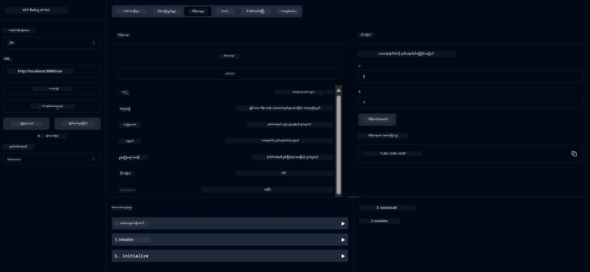
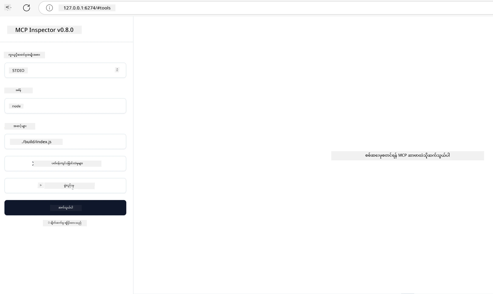
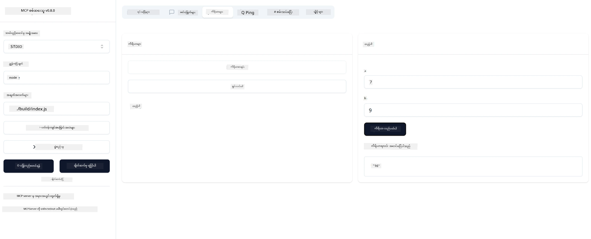

# MCP ဖြင့် စတင်ခြင်း

Model Context Protocol (MCP) နှင့် ပထမဆုံးခြေလှမ်းများသို့ ကြိုဆိုပါသည်! သင်သည် MCP အသစ်ဖြစ်စေ သို့မဟုတ် သင်၏ နားလည်မှုကို ပိုမိုနက်ရှိုင်းစေရန် ကြိုးစားနေသူဖြစ်စေ၊ ဤလမ်းညွှန်သည် အရေးကြီးသော စတင်ပြင်ဆင်ခြင်းနှင့် ဖွံ့ဖြိုးတိုးတက်မှု လုပ်ငန်းစဉ်များကို လမ်းညွှန်ပေးမည်ဖြစ်သည်။ MCP သည် AI မော်ဒယ်များနှင့် အက်ပလီကေးရှင်းများအကြား အဆင်ပြေစွာ ပေါင်းစည်းနိုင်စေသည့် နည်းလမ်းကို ရှာဖွေတွေ့ရှိပြီး MCP အား အခြေခံ၍ ဖြေရှင်းချက်များ တည်ဆောက်ခြင်းနှင့် စမ်းသပ်ခြင်းအတွက် သင့်ပတ်ဝန်းကျင်ကို မည်သို့ အမြန်ပြင်ဆင်ရမည်ကို သင်လေ့လာမည်ဖြစ်သည်။

> TLDR; AI အက်ပလီကေးရှင်းများ တည်ဆောက်ပါက သင်သည် သင့် LLM (အကြီးစားဘာသာစကားမော်ဒယ်) တွင် ကိရိယာများနှင့် အခြားအရင်းအမြစ်များ ထည့်သွင်းနိုင်ကြောင်း သိရှိပြီးဖြစ်သည်။ သို့သော် ထိုကိရိယာများနှင့် အရင်းအမြစ်များကို ဆာဗာပေါ်တွင်ထားပါက၊ အက်ပလီကေးရှင်းနှင့် ဆာဗာ၏ စွမ်းဆောင်ရည်များကို LLM ပါ/မပါသော မည်သည့် client မဆို အသုံးပြုနိုင်သည်။

## အနှစ်ချုပ်

ဤသင်ခန်းစာသည် MCP ပတ်ဝန်းကျင်များကို ပြင်ဆင်ခြင်းနှင့် ပထမဆုံး MCP အက်ပလီကေးရှင်းများ တည်ဆောက်ခြင်းအတွက် လက်တွေ့လမ်းညွှန်ချက်များ ပေးသည်။ သင်သည် လိုအပ်သော ကိရိယာများနှင့် ဖရိမ်ဝတ်များကို ပြင်ဆင်ခြင်း၊ အခြေခံ MCP ဆာဗာများ တည်ဆောက်ခြင်း၊ ဟိုစ့်အက်ပလီကေးရှင်းများ ဖန်တီးခြင်းနှင့် သင့်အကောင်အထည်ဖော်မှုများကို စမ်းသပ်ခြင်းကို လေ့လာမည်ဖြစ်သည်။

Model Context Protocol (MCP) သည် အက်ပလီကေးရှင်းများမှ LLM များအား context ပေးပို့ပုံကို စံပြုထားသည့် ဖွင့်လှစ်ထားသော protocol တစ်ခုဖြစ်သည်။ MCP ကို AI အက်ပလီကေးရှင်းများအတွက် USB-C ပေါက်တစ်ခုလို ထင်မြင်နိုင်သည် - AI မော်ဒယ်များကို အမျိုးမျိုးသော ဒေတာရင်းမြစ်များနှင့် ကိရိယာများနှင့် ချိတ်ဆက်ရန် စံပြုနည်းလမ်းတစ်ခု ပေးသည်။

## သင်ယူရမည့် ရည်မှန်းချက်များ

ဤသင်ခန်းစာအဆုံးသတ်သည်အထိ သင်သည်:

- C#, Java, Python, TypeScript, နှင့် Rust တွင် MCP ဖွံ့ဖြိုးရေး ပတ်ဝန်းကျင်များ ပြင်ဆင်နိုင်မည်
- စိတ်ကြိုက် လက္ခဏာများ (အရင်းအမြစ်များ၊ prompt များ၊ ကိရိယာများ) ပါရှိသည့် အခြေခံ MCP ဆာဗာများ တည်ဆောက်ပြီး ထုတ်လုပ်နိုင်မည်
- MCP ဆာဗာများနှင့် ချိတ်ဆက်သည့် ဟိုစ့်အက်ပလီကေးရှင်းများ ဖန်တီးနိုင်မည်
- MCP အကောင်အထည်ဖော်မှုများကို စမ်းသပ်ပြီး အမှားရှာဖွေ ပြင်ဆင်နိုင်မည်

## သင့် MCP ပတ်ဝန်းကျင် ပြင်ဆင်ခြင်း

MCP နှင့် အလုပ်လုပ်ရန် စတင်မတိုင်မီ သင့်ဖွံ့ဖြိုးရေး ပတ်ဝန်းကျင်ကို ပြင်ဆင်ခြင်းနှင့် အခြေခံ လုပ်ငန်းစဉ်ကို နားလည်ထားခြင်း အရေးကြီးသည်။ ဤအပိုင်းသည် MCP နှင့် အဆင်ပြေစွာ စတင်နိုင်ရန် မူလပြင်ဆင်ခြင်း လုပ်ငန်းစဉ်များကို လမ်းညွှန်ပေးမည်ဖြစ်သည်။

### လိုအပ်ချက်များ

MCP ဖွံ့ဖြိုးရေးကို စတင်မလုပ်မီ အောက်ပါအချက်များရှိရန် သေချာပါစေ-

- **ဖွံ့ဖြိုးရေး ပတ်ဝန်းကျင်**: သင်ရွေးချယ်ထားသော ဘာသာစကား (C#, Java, Python, TypeScript, သို့မဟုတ် Rust)
- **IDE/Editor**: Visual Studio, Visual Studio Code, IntelliJ, Eclipse, PyCharm, သို့မဟုတ် မည်သည့်ခေတ်မီ ကုဒ်တည်းဖြတ်ကိရိယာမဆို
- **Package Managers**: NuGet, Maven/Gradle, pip, npm/yarn, သို့မဟုတ် Cargo
- **API Keys**: သင့်ဟိုစ့်အက်ပလီကေးရှင်းများတွင် အသုံးပြုရန် စီစဉ်ထားသော AI ဝန်ဆောင်မှုများအတွက်

## အခြေခံ MCP ဆာဗာ ဖွဲ့စည်းပုံ

MCP ဆာဗာသည် ပုံမှန်အားဖြင့် အောက်ပါအချက်များ ပါဝင်သည်-

- **ဆာဗာ ဖွဲ့စည်းမှု**: ပေါက်၊ အတည်ပြုခြင်းနှင့် အခြား ဆက်တင်များ ပြင်ဆင်ခြင်း
- **အရင်းအမြစ်များ**: LLM များအတွက် ရရှိနိုင်သော ဒေတာနှင့် context များ
- **ကိရိယာများ**: မော်ဒယ်များ အသုံးပြုနိုင်သော လုပ်ဆောင်ချက်များ
- **prompt များ**: စာသား ဖန်တီးခြင်း သို့မဟုတ် ဖွဲ့စည်းခြင်းအတွက် ပုံစံများ

TypeScript တွင် ရိုးရှင်းစွာ ဖော်ပြထားသော ဥပမာမှာ-

```typescript
import { McpServer, ResourceTemplate } from "@modelcontextprotocol/sdk/server/mcp.js";
import { StdioServerTransport } from "@modelcontextprotocol/sdk/server/stdio.js";
import { z } from "zod";

// MCP ဆာဗာတစ်ခု ဖန်တီးပါ
const server = new McpServer({
  name: "Demo",
  version: "1.0.0"
});

// ပေါင်းထည့်ခြင်းကိရိယာတစ်ခု ထည့်ပါ
server.tool("add",
  { a: z.number(), b: z.number() },
  async ({ a, b }) => ({
    content: [{ type: "text", text: String(a + b) }]
  })
);

// လှုပ်ရှားနိုင်သော ကြိုဆိုမှု အရင်းအမြစ်တစ်ခု ထည့်ပါ
server.resource(
  "file",
  // 'list' ပါရာမီတာသည် အရင်းအမြစ်သည် ရနိုင်သော ဖိုင်များကို မည်သို့ စာရင်းပြုစုမည်ကို ထိန်းချုပ်သည်။ undefined သတ်မှတ်ခြင်းဖြင့် ဤအရင်းအမြစ်အတွက် စာရင်းပြုစုခြင်းကို ပိတ်ပင်သည်။
  new ResourceTemplate("file://{path}", { list: undefined }),
  async (uri, { path }) => ({
    contents: [{
      uri: uri.href,
      text: `File, ${path}!`
    }]
  })
);

// ဖိုင်အကြောင်းအရာများကို ဖတ်ရှုသော ဖိုင်အရင်းအမြစ်တစ်ခု ထည့်ပါ
server.resource(
  "file",
  new ResourceTemplate("file://{path}", { list: undefined }),
  async (uri, { path }) => {
    let text;
    try {
      text = await fs.readFile(path, "utf8");
    } catch (err) {
      text = `Error reading file: ${err.message}`;
    }
    return {
      contents: [{
        uri: uri.href,
        text
      }]
    };
  }
);

server.prompt(
  "review-code",
  { code: z.string() },
  ({ code }) => ({
    messages: [{
      role: "user",
      content: {
        type: "text",
        text: `Please review this code:\n\n${code}`
      }
    }]
  })
);

// stdin တွင် မက်ဆေ့ခ်ျများ လက်ခံခြင်းနှင့် stdout တွင် မက်ဆေ့ခ်ျများ ပို့ခြင်း စတင်ပါ။
const transport = new StdioServerTransport();
await server.connect(transport);
```

အထက်ပါကုဒ်တွင်-

- MCP TypeScript SDK မှ လိုအပ်သော class များကို import လုပ်သည်။
- MCP ဆာဗာအသစ်တစ်ခု ဖန်တီးပြီး ဖွဲ့စည်းသည်။
- handler function ပါရှိသည့် စိတ်ကြိုက် tool (`calculator`) တစ်ခုကို မှတ်ပုံတင်သည်။
- MCP request များကို နားထောင်ရန် ဆာဗာကို စတင်သည်။

## စမ်းသပ်ခြင်းနှင့် အမှားရှာဖွေခြင်း

MCP ဆာဗာကို စမ်းသပ်ရန် စတင်မလုပ်မီ၊ ရရှိနိုင်သော ကိရိယာများနှင့် အမှားရှာဖွေခြင်းအတွက် အကောင်းဆုံး လုပ်ထုံးလုပ်နည်းများကို နားလည်ထားခြင်း အရေးကြီးသည်။ ထိရောက်သော စမ်းသပ်မှုသည် သင့်ဆာဗာသည် မျှော်မှန်းသည့်အတိုင်း လုပ်ဆောင်နေကြောင်း သေချာစေပြီး ပြဿနာများကို အမြန်ရှာဖွေ ပြင်ဆင်နိုင်စေသည်။ အောက်ပါအပိုင်းတွင် MCP အကောင်အထည်ဖော်မှုကို အတည်ပြုရန် အကြံပြုထားသော နည်းလမ်းများကို ဖော်ပြထားသည်။

MCP သည် သင့်ဆာဗာများကို စမ်းသပ်ရန်နှင့် အမှားရှာဖွေရန် ကိရိယာများ ပံ့ပိုးပေးသည်-

- **Inspector tool**၊ ဤ ဂရပ်ဖစ်အင်တာဖေ့စ်သည် သင့်ဆာဗာနှင့် ချိတ်ဆက်ပြီး ကိရိယာများ၊ prompt များနှင့် အရင်းအမြစ်များကို စမ်းသပ်နိုင်စေသည်။
- **curl**၊ curl ကဲ့သို့သော command line ကိရိယာ သို့မဟုတ် HTTP command များ ဖန်တီးပြီး လည်ပတ်နိုင်သည့် client များဖြင့် ဆာဗာနှင့် ချိတ်ဆက်နိုင်သည်။

### MCP Inspector အသုံးပြုခြင်း

[MCP Inspector](https://github.com/modelcontextprotocol/inspector) သည် သင့်အား အောက်ပါအရာများတွင် ကူညီပေးသည့် မြင်သာသော စမ်းသပ်ကိရိယာဖြစ်သည်-

1. **ဆာဗာ စွမ်းဆောင်ရည်များ ရှာဖွေခြင်း**: ရရှိနိုင်သော အရင်းအမြစ်များ၊ ကိရိယာများနှင့် prompt များကို အလိုအလျောက် ရှာဖွေသည်
2. **ကိရိယာ လုပ်ဆောင်မှု စမ်းသပ်ခြင်း**: မတူညီသော ပါရာမီတာများကို စမ်းသပ်ပြီး တုံ့ပြန်ချက်များကို တိုက်ရိုက် ကြည့်ရှုနိုင်သည်
3. **ဆာဗာ Metadata ကြည့်ရှုခြင်း**: ဆာဗာအချက်အလက်များ၊ schema များနှင့် ဖွဲ့စည်းမှုများကို စစ်ဆေးသည်

```bash
# ဥပမာ TypeScript, MCP Inspector ကို 설치 နှင့် လည်ပတ်ခြင်း
npx @modelcontextprotocol/inspector node build/index.js
```

အထက်ပါ command များကို လည်ပတ်စဉ် MCP Inspector သည် သင့် browser တွင် ဒေသခံ web interface တစ်ခုကို စတင်ဖွင့်လှစ်မည်ဖြစ်သည်။ သင့်မှတ်ပုံတင်ထားသော MCP ဆာဗာများ၊ ၎င်းတို့ရရှိနိုင်သော ကိရိယာများ၊ အရင်းအမြစ်များနှင့် prompt များကို ပြသသည့် dashboard ကို ကြည့်ရှုနိုင်မည်ဖြစ်သည်။ ဤအင်တာဖေ့စ်သည် ကိရိယာ လုပ်ဆောင်မှုကို အပြန်အလှန် စမ်းသပ်ခြင်း၊ ဆာဗာ metadata ကို စစ်ဆေးခြင်းနှင့် တုံ့ပြန်ချက်များကို တိုက်ရိုက် ကြည့်ရှုခြင်းတို့ကို လွယ်ကူစွာ ပြုလုပ်နိုင်စေပြီး MCP ဆာဗာ အကောင်အထည်ဖော်မှုများကို အတည်ပြုခြင်းနှင့် အမှားရှာဖွေရေးကို ပိုမိုလွယ်ကူစေသည်။

ဤသည်မှာ ၎င်း၏ မျက်နှာပြင်ပုံရိပ်တစ်ခုဖြစ်သည်-


## ပုံမှန် ပြင်ဆင်မှု ပြဿနာများနှင့် ဖြေရှင်းနည်းများ

| ပြဿနာ | ဖြစ်နိုင်သော ဖြေရှင်းနည်း |
|-------|-------------------|
| ချိတ်ဆက်မှု ပယ်ချခြင်း | ဆာဗာ လည်ပတ်နေမှုနှင့် ပေါက်မှန်ကန်မှု စစ်ဆေးပါ |
| ကိရိယာ လုပ်ဆောင်မှု အမှားများ | ပါရာမီတာ စစ်ဆေးမှုနှင့် အမှားကိုင်တွယ်မှု ပြန်လည်သုံးသပ်ပါ |
| အတည်ပြုမှု မအောင်မြင်ခြင်း | API key များနှင့် ခွင့်ပြုချက်များ စစ်ဆေးပါ |
| Schema စစ်ဆေးမှု အမှားများ | ပါရာမီတာများသည် သတ်မှတ်ထားသော schema နှင့် ကိုက်ညီမှုရှိစေရန် သေချာပါစေ |
| ဆာဗာ မစတင်နိုင်ခြင်း | ပေါက်ပွင့်မှု တိုက်ခိုက်မှုများ သို့မဟုတ် လိုအပ်သော အခြေခံပစ္စည်းများ မရှိမှု စစ်ဆေးပါ |
| CORS အမှားများ | cross-origin request များအတွက် သင့်တော်သော CORS header များ ပြင်ဆင်ပါ |
| အတည်ပြုမှု ပြဿနာများ | token တရားဝင်မှုနှင့် ခွင့်ပြုချက်များ စစ်ဆေးပါ |

## ဒေသခံ ဖွံ့ဖြိုးရေး

ဒေသခံ ဖွံ့ဖြိုးရေးနှင့် စမ်းသပ်မှုအတွက် MCP ဆာဗာများကို သင့်ကွန်ပျူတာပေါ်တွင် တိုက်ရိုက် လည်ပတ်နိုင်သည်-

1. **ဆာဗာ လုပ်ငန်းစဉ် စတင်ခြင်း**: သင့် MCP ဆာဗာ အက်ပလီကေးရှင်းကို လည်ပတ်ပါ
2. **ကွန်ယက် ပြင်ဆင်ခြင်း**: ဆာဗာသည် မျှော်မှန်းထားသော ပေါက်တွင် ရရှိနိုင်မှုရှိစေရန် သေချာပါစေ
3. **client များ ချိတ်ဆက်ခြင်း**: `http://localhost:3000` ကဲ့သို့ ဒေသခံ ချိတ်ဆက်မှု URL များ အသုံးပြုပါ

```bash
# ဥပမာ - TypeScript MCP ဆာဗာကို ဒေသတွင်းတွင် ပြေးဆွဲခြင်း
npm run start
# ဆာဗာကို http://localhost:3000 တွင် ပြေးဆွဲနေသည်
```

## ပထမဆုံး MCP ဆာဗာ တည်ဆောက်ခြင်း

ကျွန်ုပ်တို့သည် ယခင်သင်ခန်းစာတွင် [Core concepts](/01-CoreConcepts/README.md) ကို လေ့လာပြီးဖြစ်သည်၊ ယခု သင်ယူထားသော အသိပညာကို လက်တွေ့အသုံးချရန် အချိန်ရောက်ပါပြီ။

### ဆာဗာသည် မည်သည့်အရာများ ပြုလုပ်နိုင်သနည်း

ကုဒ်ရေးသားခြင်း စတင်မလုပ်မီ ဆာဗာသည် မည်သည့်အရာများ ပြုလုပ်နိုင်သည်ကို ပြန်လည် သတိပေးလိုသည်-

MCP ဆာဗာသည် ဥပမာအားဖြင့်-

- ဒေသခံ ဖိုင်များနှင့် ဒေတာဘေ့စ်များကို ဝင်ရောက်ကြည့်ရှုနိုင်သည်
- ဝေးလံသော API များနှင့် ချိတ်ဆက်နိုင်သည်
- တွက်ချက်မှုများ ပြုလုပ်နိုင်သည်
- အခြားကိရိယာများနှင့် ဝန်ဆောင်မှုများနှင့် ပေါင်းစည်းနိုင်သည်
- အသုံးပြုသူနှင့် ဆက်သွယ်ရန် အသုံးပြုသူအင်တာဖေ့စ် ပေးနိုင်သည်

ကောင်းပါပြီ၊ ယခု ကျွန်ုပ်တို့ ဘာများ ပြုလုပ်နိုင်သည်ကို သိရှိသွားပြီဖြစ်သောကြောင့် ကုဒ်ရေးသားခြင်း စတင်ကြရအောင်။

## လေ့ကျင့်ခန်း: ဆာဗာ ဖန်တီးခြင်း

ဆာဗာတစ်ခု ဖန်တီးရန် အောက်ပါအဆင့်များကို လိုက်နာရမည်-

- MCP SDK ကို ထည့်သွင်းပါ။
- ပရောဂျက်တစ်ခု ဖန်တီးပြီး ပရောဂျက် ဖွဲ့စည်းပုံကို ပြင်ဆင်ပါ။
- ဆာဗာကုဒ်ကို ရေးသားပါ။
- ဆာဗာကို စမ်းသပ်ပါ။

### -1- ပရောဂျက် ဖန်တီးခြင်း

#### TypeScript

```sh
# ပရောဂျက်ဖိုလ်ဒါကိုဖန်တီးပြီး npm ပရောဂျက်ကိုစတင်ပါ။
mkdir calculator-server
cd calculator-server
npm init -y
```

#### Python

```sh
# ပရောဂျက်ဖိုလ်ဒါ ဖန်တီးပါ
mkdir calculator-server
cd calculator-server
# Visual Studio Code တွင် ဖိုလ်ဒါကို ဖွင့်ပါ - မတူညီသော IDE အသုံးပြုနေပါက ဒီအဆင့်ကို ကျော်ပါ
code .
```

#### .NET

```sh
dotnet new console -n McpCalculatorServer
cd McpCalculatorServer
```

#### Java

Java အတွက် Spring Boot ပရောဂျက် တစ်ခု ဖန်တီးပါ-

```bash
curl https://start.spring.io/starter.zip \
  -d dependencies=web \
  -d javaVersion=21 \
  -d type=maven-project \
  -d groupId=com.example \
  -d artifactId=calculator-server \
  -d name=McpServer \
  -d packageName=com.microsoft.mcp.sample.server \
  -o calculator-server.zip
```

zip ဖိုင်ကို ဖြုတ်ပါ-

```bash
unzip calculator-server.zip -d calculator-server
cd calculator-server
# မလိုအပ်သော စမ်းသပ်မှုကို ရွေးချယ်ဖျက်ပစ်နိုင်သည်
rm -rf src/test/java
```

*pom.xml* ဖိုင်တွင် အောက်ပါ ပြည့်စုံသော ဖွဲ့စည်းမှုကို ထည့်သွင်းပါ-

```xml
<?xml version="1.0" encoding="UTF-8"?>
<project xmlns="http://maven.apache.org/POM/4.0.0"
    xmlns:xsi="http://www.w3.org/2001/XMLSchema-instance"
    xsi:schemaLocation="http://maven.apache.org/POM/4.0.0 http://maven.apache.org/xsd/maven-4.0.0.xsd">
    <modelVersion>4.0.0</modelVersion>
    
    <!-- Spring Boot parent for dependency management -->
    <parent>
        <groupId>org.springframework.boot</groupId>
        <artifactId>spring-boot-starter-parent</artifactId>
        <version>3.5.0</version>
        <relativePath />
    </parent>

    <!-- Project coordinates -->
    <groupId>com.example</groupId>
    <artifactId>calculator-server</artifactId>
    <version>0.0.1-SNAPSHOT</version>
    <name>Calculator Server</name>
    <description>Basic calculator MCP service for beginners</description>

    <!-- Properties -->
    <properties>
        <java.version>21</java.version>
        <maven.compiler.source>21</maven.compiler.source>
        <maven.compiler.target>21</maven.compiler.target>
    </properties>

    <!-- Spring AI BOM for version management -->
    <dependencyManagement>
        <dependencies>
            <dependency>
                <groupId>org.springframework.ai</groupId>
                <artifactId>spring-ai-bom</artifactId>
                <version>1.0.0-SNAPSHOT</version>
                <type>pom</type>
                <scope>import</scope>
            </dependency>
        </dependencies>
    </dependencyManagement>

    <!-- Dependencies -->
    <dependencies>
        <dependency>
            <groupId>org.springframework.ai</groupId>
            <artifactId>spring-ai-starter-mcp-server-webflux</artifactId>
        </dependency>
        <dependency>
            <groupId>org.springframework.boot</groupId>
            <artifactId>spring-boot-starter-actuator</artifactId>
        </dependency>
        <dependency>
         <groupId>org.springframework.boot</groupId>
         <artifactId>spring-boot-starter-test</artifactId>
         <scope>test</scope>
      </dependency>
    </dependencies>

    <!-- Build configuration -->
    <build>
        <plugins>
            <plugin>
                <groupId>org.springframework.boot</groupId>
                <artifactId>spring-boot-maven-plugin</artifactId>
            </plugin>
            <plugin>
                <groupId>org.apache.maven.plugins</groupId>
                <artifactId>maven-compiler-plugin</artifactId>
                <configuration>
                    <release>21</release>
                </configuration>
            </plugin>
        </plugins>
    </build>

    <!-- Repositories for Spring AI snapshots -->
    <repositories>
        <repository>
            <id>spring-milestones</id>
            <name>Spring Milestones</name>
            <url>https://repo.spring.io/milestone</url>
            <snapshots>
                <enabled>false</enabled>
            </snapshots>
        </repository>
        <repository>
            <id>spring-snapshots</id>
            <name>Spring Snapshots</name>
            <url>https://repo.spring.io/snapshot</url>
            <releases>
                <enabled>false</enabled>
            </releases>
        </repository>
    </repositories>
</project>
```

#### Rust

```sh
mkdir calculator-server
cd calculator-server
cargo init
```

### -2- အခြေခံပစ္စည်းများ ထည့်သွင်းခြင်း

ပရောဂျက် ဖန်တီးပြီးနောက် အောက်ပါအတိုင်း အခြေခံပစ္စည်းများ ထည့်သွင်းပါ-

#### TypeScript

```sh
# မတင်ထားသေးပါက TypeScript ကို ကမ္ဘာလုံးဆိုင်ရာ တပ်ဆင်ပါ
npm install typescript -g

# MCP SDK နှင့် schema အတည်ပြုမှုအတွက် Zod ကို တပ်ဆင်ပါ
npm install @modelcontextprotocol/sdk zod
npm install -D @types/node typescript
```

#### Python

```sh
# အတုပတ်ဝန်းကျင်တစ်ခုဖန်တီးပြီးလိုအပ်သောအရာများကိုတပ်ဆင်ပါ
python -m venv venv
venv\Scripts\activate
pip install "mcp[cli]"
```

#### Java

```bash
cd calculator-server
./mvnw clean install -DskipTests
```

#### Rust

```sh
cargo add rmcp --features server,transport-io
cargo add serde
cargo add tokio --features rt-multi-thread
```

### -3- ပရောဂျက် ဖိုင်များ ဖန်တီးခြင်း

#### TypeScript

*package.json* ဖိုင်ကို ဖွင့်ပြီး ဆာဗာကို တည်ဆောက်၍ လည်ပတ်နိုင်ရန် အောက်ပါအတိုင်း အကြောင်းအရာကို အစားထိုးပါ-

```json
{
  "name": "calculator-server",
  "version": "1.0.0",
  "main": "index.js",
  "type": "module",
  "scripts": {
    "build": "tsc",
    "start": "npm run build && node ./build/index.js",
  },
  "keywords": [],
  "author": "",
  "license": "ISC",
  "description": "A simple calculator server using Model Context Protocol",
  "dependencies": {
    "@modelcontextprotocol/sdk": "^1.16.0",
    "zod": "^3.25.76"
  },
  "devDependencies": {
    "@types/node": "^24.0.14",
    "typescript": "^5.8.3"
  }
}
```

*tsconfig.json* ဖိုင်ကို အောက်ပါအတိုင်း ဖန်တီးပါ-

```json
{
  "compilerOptions": {
    "target": "ES2022",
    "module": "Node16",
    "moduleResolution": "Node16",
    "outDir": "./build",
    "rootDir": "./src",
    "strict": true,
    "esModuleInterop": true,
    "skipLibCheck": true,
    "forceConsistentCasingInFileNames": true
  },
  "include": ["src/**/*"],
  "exclude": ["node_modules"]
}
```

သင့်ရင်းမြစ်ကုဒ်အတွက် ဖိုလ်ဒါတစ်ခု ဖန်တီးပါ-

```sh
mkdir src
touch src/index.ts
```

#### Python

*server.py* ဖိုင် တစ်ခု ဖန်တီးပါ-

```sh
touch server.py
```

#### .NET

လိုအပ်သော NuGet package များ ထည့်သွင်းပါ-

```sh
dotnet add package ModelContextProtocol --prerelease
dotnet add package Microsoft.Extensions.Hosting
```

#### Java

Java Spring Boot ပရောဂျက်များအတွက် ပရောဂျက် ဖွဲ့စည်းမှုကို အလိုအလျောက် ဖန်တီးပေးသည်။

#### Rust

Rust အတွက် `cargo init` ကို လည်ပတ်သောအခါ *src/main.rs* ဖိုင်ကို အလိုအလျောက် ဖန်တီးပေးသည်။ ဖိုင်ကို ဖွင့်ပြီး ပုံမှန်ကုဒ်ကို ဖျက်ပါ။

### -4- ဆာဗာကုဒ် ရေးသားခြင်း

#### TypeScript

*index.ts* ဖိုင် တစ်
`Command` ကွက်လပ်မှာ `python` ကို သတ်မှတ်ပေးပြီး `Arguments` အဖြစ် `server.py` ကို သတ်မှတ်ပေးဖို့ သေချာစေပါ။ ဒါက စကရစ်ပတ်ကို မှန်ကန်စွာ လည်ပတ်စေပါလိမ့်မယ်။

#### .NET

သင့် project ဖိုလ်ဒါထဲမှာ ရှိနေကြောင်း သေချာပါစေ။

```sh
cd McpCalculatorServer
npx @modelcontextprotocol/inspector dotnet run
```

#### Java

သင့် calculator server လည်ပတ်နေကြောင်း သေချာပါစေ
ပြီးရင် inspector ကို လည်ပတ်ပါ။

```cmd
npx @modelcontextprotocol/inspector
```

inspector web interface မှာ -

1. "SSE" ကို transport type အဖြစ် ရွေးချယ်ပါ
2. URL ကို `http://localhost:8080/sse` အဖြစ် သတ်မှတ်ပါ
3. "Connect" ကို နှိပ်ပါ



**သင်ဟာ server နဲ့ ချိတ်ဆက်ပြီးဖြစ်ပါပြီ**
**Java server စမ်းသပ်ခြင်း အပိုင်း ပြီးဆုံးပါပြီ**

နောက်တစ်ပိုင်းမှာ server နဲ့ ဆက်သွယ်ခြင်းအကြောင်း ဖြစ်ပါတယ်။

အောက်ပါ user interface ကို တွေ့ရပါမယ် -



1. Connect ခလုတ်ကို နှိပ်ပြီး server နဲ့ ချိတ်ဆက်ပါ
  ချိတ်ဆက်ပြီးရင် အောက်ပါအတိုင်း ပြပါလိမ့်မယ် -

  

1. "Tools" နှင့် "listTools" ကို ရွေးချယ်ပါ၊ "Add" ကို မြင်ရပါမယ်၊ "Add" ကို ရွေးပြီး parameter တန်ဖိုးများ ဖြည့်ပါ။

  အောက်ပါ တုံ့ပြန်ချက်ကို မြင်ရပါမယ်၊ "add" tool မှ ရလာသော ရလဒ်ဖြစ်ပါတယ် -

  

ဂုဏ်ယူပါတယ်၊ သင်၏ ပထမဆုံး server ကို ဖန်တီးပြီး လည်ပတ်နိုင်ခဲ့ပါပြီ!

#### Rust

Rust server ကို MCP Inspector CLI ဖြင့် လည်ပတ်ရန် အောက်ပါ command ကို အသုံးပြုပါ -

```sh
npx @modelcontextprotocol/inspector cargo run --cli --method tools/call --tool-name add --tool-arg a=1 b=2
```

### တရားဝင် SDK များ

MCP သည် ဘာသာစကားအမျိုးမျိုးအတွက် တရားဝင် SDK များကို ပံ့ပိုးပေးသည် -

- [C# SDK](https://github.com/modelcontextprotocol/csharp-sdk) - Microsoft နှင့် ပူးပေါင်းထိန်းသိမ်းထားသည်
- [Java SDK](https://github.com/modelcontextprotocol/java-sdk) - Spring AI နှင့် ပူးပေါင်းထိန်းသိမ်းထားသည်
- [TypeScript SDK](https://github.com/modelcontextprotocol/typescript-sdk) - တရားဝင် TypeScript အကောင်အထည်ဖော်မှု
- [Python SDK](https://github.com/modelcontextprotocol/python-sdk) - တရားဝင် Python အကောင်အထည်ဖော်မှု
- [Kotlin SDK](https://github.com/modelcontextprotocol/kotlin-sdk) - တရားဝင် Kotlin အကောင်အထည်ဖော်မှု
- [Swift SDK](https://github.com/modelcontextprotocol/swift-sdk) - Loopwork AI နှင့် ပူးပေါင်းထိန်းသိမ်းထားသည်
- [Rust SDK](https://github.com/modelcontextprotocol/rust-sdk) - တရားဝင် Rust အကောင်အထည်ဖော်မှု

## အဓိက သင်ခန်းစာများ

- MCP ဖွံ့ဖြိုးရေး ပတ်ဝန်းကျင် တည်ဆောက်ခြင်းသည် ဘာသာစကားအလိုက် SDK များဖြင့် လွယ်ကူသည်
- MCP server များ တည်ဆောက်ရာတွင် tool များ ဖန်တီးပြီး schema များနှင့် မှတ်ပုံတင်ရသည်
- စမ်းသပ်ခြင်းနှင့် အမှားရှာဖွေရေးသည် MCP အကောင်အထည်ဖော်မှုများအတွက် အရေးကြီးသည်

## နမူနာများ

- [Java Calculator](../samples/java/calculator/README.md)
- [.Net Calculator](../../../../03-GettingStarted/samples/csharp)
- [JavaScript Calculator](../samples/javascript/README.md)
- [TypeScript Calculator](../samples/typescript/README.md)
- [Python Calculator](../../../../03-GettingStarted/samples/python)
- [Rust Calculator](../../../../03-GettingStarted/samples/rust)

## လုပ်ငန်းတာဝန်

သင်နှစ်သက်ရာ tool တစ်ခုဖြင့် ရိုးရှင်းသော MCP server တစ်ခု ဖန်တီးပါ -

1. သင်နှစ်သက်ရာ ဘာသာစကား (.NET, Java, Python, TypeScript, သို့မဟုတ် Rust) ဖြင့် tool ကို အကောင်အထည်ဖော်ပါ။
2. input parameter များနှင့် return value များ သတ်မှတ်ပါ။
3. inspector tool ကို လည်ပတ်စေပြီး server သည် မှန်ကန်စွာ လည်ပတ်နေကြောင်း သေချာစေပါ။
4. input မျိုးစုံဖြင့် အကောင်အထည်ဖော်မှုကို စမ်းသပ်ပါ။

## ဖြေရှင်းချက်

[Solution](./solution/README.md)

## အပိုဆောင်း အရင်းအမြစ်များ

- [Azure တွင် Model Context Protocol အသုံးပြု၍ Agent များ တည်ဆောက်ခြင်း](https://learn.microsoft.com/azure/developer/ai/intro-agents-mcp)
- [Azure Container Apps (Node.js/TypeScript/JavaScript) ဖြင့် Remote MCP](https://learn.microsoft.com/samples/azure-samples/mcp-container-ts/mcp-container-ts/)
- [.NET OpenAI MCP Agent](https://learn.microsoft.com/samples/azure-samples/openai-mcp-agent-dotnet/openai-mcp-agent-dotnet/)

## နောက်တစ်ဆင့်

နောက်တစ်ဆင့်: [MCP Clients ဖြင့် စတင်ခြင်း](../02-client/README.md)

---

<!-- CO-OP TRANSLATOR DISCLAIMER START -->
**အကြောင်းကြားချက်**  
ဤစာတမ်းကို AI ဘာသာပြန်ဝန်ဆောင်မှု [Co-op Translator](https://github.com/Azure/co-op-translator) ဖြင့် ဘာသာပြန်ထားပါသည်။ ကျွန်ုပ်တို့သည် တိကျမှန်ကန်မှုအတွက် ကြိုးစားနေသော်လည်း၊ အလိုအလျောက် ဘာသာပြန်ခြင်းတွင် အမှားများ သို့မဟုတ် မှားယွင်းချက်များ ပါဝင်နိုင်ကြောင်း သတိပြုပါရန် မေတ္တာရပ်ခံအပ်ပါသည်။ မူရင်းစာတမ်းကို မိမိဘာသာစကားဖြင့်သာ တရားဝင်အချက်အလက်အဖြစ် ယူဆသင့်ပါသည်။ အရေးကြီးသော အချက်အလက်များအတွက် လူ့ဘာသာပြန်ပညာရှင်မှ ဘာသာပြန်ခြင်းကို အကြံပြုပါသည်။ ဤဘာသာပြန်ချက်ကို အသုံးပြုရာမှ ဖြစ်ပေါ်လာနိုင်သည့် နားလည်မှုမှားယွင်းမှုများအတွက် ကျွန်ုပ်တို့သည် တာဝန်မယူပါ။
<!-- CO-OP TRANSLATOR DISCLAIMER END -->