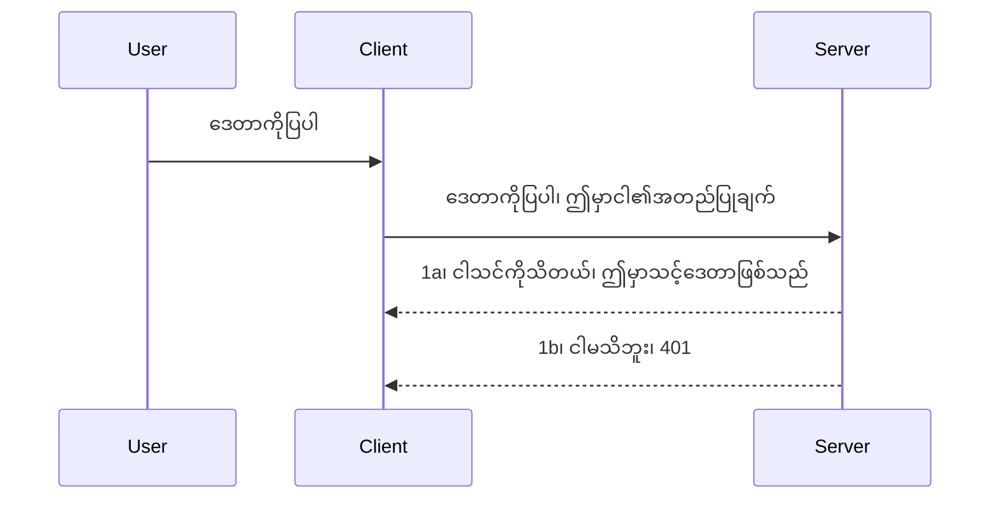

# တိုတောင်းသော အတည်ပြုခြင်း

MCP SDK များသည် OAuth 2.1 ကို အသုံးပြုနိုင်မှုကို ထောက်ပံ့ပေးပြီး ၎င်းသည် auth server၊ resource server၊ ကော်ဒ်တောင်းပိုสต์ခြင်း၊ ကော်ဒ်ရယူခြင်း၊ bearer token အစားထိုးခြင်း နှင့် နောက်ဆုံးတွင် resource data ရယူနိုင်ခြင်းကဲ့သို့သော အတွေးအခေါ်များ ပါဝင်သော အဆင့်မြင့်ဖြစ်စဉ်တစ်ခုဖြစ်သည်။ OAuth ကို အသုံးမပြုဖူးသူများအတွက် ပြုပြင်အသုံးပြုရန်ကောင်းသော အရာဖြစ်သောကြောင့် နည်းသောအဆင့် auth တစ်ခုနဲ့ စပြီး ပိုမိုကောင်းမွန်သော လုံခြုံရေးဆိုင်ရာများထိ ဖွဲ့စည်းသင့်ပါသည်။ ဒီအကြောင်းကြောင့် ဤအခန်းသည် တိုးတက်သော auth ဘက်သို့ ရှေ့ဆက်ဖွံ့ဖြိုးစေရန် ရည်ရွယ်ပါသည်။

## Auth ဆိုသည်မှာ ဘာကို ဆိုလိုသနည်း?

Auth ဆိုသည်မှာ authentication နှင့် authorization ကို အတိုကွေ brevitate လုပ်မှုဖြစ်သည်။ အကြောင်းကတော့ နေရာဝင်ခွင့်ယူရန် နှစ်ခု ပြုလုပ်ရန် လိုအပ်သည်။

- **Authentication**, ဆိုသည်မှာ မည်သူတစ်ယောက်ကို ကျွန်ုပ်တို့အိမ်ထဲသို့ ဝင်ခွင့်ပြုမလား၊ သူသည် "ဒီမှာ" ဖြစ်ခွင့်ရှိသည်ဟု သတ်မှတ်ခြင်းဖြစ်ပြီး ၎င်းသည် MCP Server အင်္ဂါရပ်များ အများဆုံးအားသိမ်းဆည်းထားသည့် resource server ကို ဝင်ရောက်ခွင့် ရှိမရှိကို သတ်မှတ်ခြင်းဖြစ်သည်။
- **Authorization**, ဆိုသည်မှာ အသုံးပြုသူ ထို မေးမြန်းထားသည့် အထူး resource များ၊ ဥပမာ မော်ဒယ်အမိန့်များ သို့မဟုတ် ထုတ်ကုန်များကို ဝင်ရောက်လိုသူဖြစ်သနည်း၊ မှတ်စု ဖတ်ရန်သာခွင့်ရှိရန် သို့မဟုတ် ဖျက်ရန်ခွင့် မရှိသည့် အခြေအနေကိုသိရန်ဖြစ်သည်။

## အသုံးပြုသူအချက်အလက်များ - စနစ်ကို မည်သို့ မိမိကိုယ်ကို ပြသသည်နည်း

အများဆုံး web developer များသည် ဆာဗာထဲသို့ လက်မှတ်ဖြစ်သည့် secret တစ်ခု ပေးပို့၍ သူတို့ဒီမှာ ရှိခွင့်ရှိကြောင်း "Authentication" အသေးစားအတိုင်း သတ်မှတ်ခွင့်ရှိကြောင်း စဉ်းစားလေ့ရှိကြသည်။ ၎င်း credential သည် အများအားဖြင့် username နှင့် password ကို base64 encode လုပ်ထားသော version သို့မဟုတ် user တစ်ဦးစီကို ထူးခြားစွာ သတ်မှတ်သော API key ဖြစ်သည်။

ထိုအား "Authorization" ဟူသော header ဖြင့် ပို့သည်-

```json
{ "Authorization": "secret123" }
```

ဤကို မူရင်းအဖြစ် basic authentication ဟု ခေါ်ဆိုကြသည်။ အလုပ်လုပ်ပုံ စနစ်သည် အောက်ပါအတိုင်းဖြစ်သည်-


အခု flow အနေနှင့် ဘယ်လိုအလုပ်လုပ်သနည်းဆိုတာနားမလည်သွားတာကြောင့် ဘယ်လို အကောင်အထည်ဖော်မည်နည်း?  အများဆုံး web server များတွင် middleware ဟုခေါ်သော အစိတ်အပိုင်းတစ်ခု ပါဝင်ပြီး ၎င်းသည် request တစ်ခု၏ အစိတ်အပိုင်းအဖြစ် လည်ပတ်သည်။ credential ကို စစ်ဆေးပြီး ကြောင်း သဘောမတူပါက auth error ပြန်ပေးသည်။ ထိုအတိုင်း အကောင်အထည်ဖော်ပုံကို ကြည့်ရအောင်-

**Python**

```python
class AuthMiddleware(BaseHTTPMiddleware):
    async def dispatch(self, request, call_next):

        has_header = request.headers.get("Authorization")
        if not has_header:
            print("-> Missing Authorization header!")
            return Response(status_code=401, content="Unauthorized")

        if not valid_token(has_header):
            print("-> Invalid token!")
            return Response(status_code=403, content="Forbidden")

        print("Valid token, proceeding...")
       
        response = await call_next(request)
        # ဖောက်သည်ထုတ်ကုန်ခေါင်းစီးများကိုထည့်သွင်း သို့မဟုတ် တုံ့ပြန်မှုအတွက်မည်သည့်ပုံစံဖြင့်မဆို ပြောင်းလဲမှုများပြုလုပ်ပါ။
        return response


starlette_app.add_middleware(CustomHeaderMiddleware)
```

ဒီမှာ-

- `AuthMiddleware` အမည်ရ middleware တစ်ခု ဖန်တီးထားသည်။ ၎င်း၏ `dispatch` method ကို web server မှ ခေါ်သုံးသည်။
- middleware ကို web server သို့ ထည့်သွင်းထားသည်-

    ```python
    starlette_app.add_middleware(AuthMiddleware)
    ```

- Authorization header ရှိ/မရှိ စစ်ဆေးပြီး secret ကို သတ်မှတ်ထားသည့် secret နဲ့ကိုက်ညီမှုရှိ/မရှိ စစ်ဆေးသည့် validation logic ရေးသားထားသည်-

    ```python
    has_header = request.headers.get("Authorization")
    if not has_header:
        print("-> Missing Authorization header!")
        return Response(status_code=401, content="Unauthorized")

    if not valid_token(has_header):
        print("-> Invalid token!")
        return Response(status_code=403, content="Forbidden")
    ```

    secret ရှိပြီး သတ်မှတ်ထားသည့် secret ဖြစ်ပါက `call_next` ကို ခေါ်၍ အဆိုပါ request ကို ခွင့်ပြုကာ တုံ့ပြန်ချက်အား ပြန်ပေးသည်-

    ```python
    response = await call_next(request)
    # customer headers များ ထည့်သွင်းခြင်း သို့မဟုတ် တုံ့ပြန်မှုတွင် အချို့ ပြောင်းလဲမှုများ ပြုလုပ်ခြင်း
    return response
    ```

နည်းစနစ်အရ web request တစ်ခုကို ဆာဗာထံ ပေးပို့မည်ဆို middleware ကို ခေါ်ထုတ်မည်ဖြစ်ပြီး ထို middleware ရဲ့ကိစ္စအရ request ကို အတည်ပြုပြီး ခွင့်ပြုမည် သို့မဟုတ် မခွင့်ပြုဘဲ error ပြန်ပေးမည် ဖြစ်သည်။

**TypeScript**

Express ဆိုသော လူအများသိတဲ့ framework သုံး၍ middleware တစ်ခု ဖန်တီးပြီး MCP Server ကို ရောက်ခင် request ကို ဖမ်းဆီးမည်။ အောက်က code ကို ကြည့်ပါ-

```typescript
function isValid(secret) {
    return secret === "secret123";
}

app.use((req, res, next) => {
    // ၁။ အာဏာပိုင်ခေါင်းစဉ် ရှိပါသလား။
    if(!req.headers["Authorization"]) {
        res.status(401).send('Unauthorized');
    }
    
    let token = req.headers["Authorization"];

    // ၂။ တရားဝင်မှုကို စစ်ဆေးပါ။
    if(!isValid(token)) {
        res.status(403).send('Forbidden');
    }

   
    console.log('Middleware executed');
    // ၃။ တောင်းဆိုမှုကို တောင်းဆိုခြင်း လမ်းကြောင်းရှိ နောက်ထပ်အဆင့်သို့ ဖြတ်သန်းပေးသည်။
    next();
});
```

ဒီ code မှာ-

1. Authorization header ရှိမရှိ စစ်ဆေးပြီး မရှိပါက 401 error ပေးပို့သည်။
2. credential/token မှန်ကန်မှုရှိမရှိ စစ်ဆေးပြီး မရှိပါက 403 error ပေးပို့သည်။
3. နောက်ဆုံးမှာ request pipeline ဆက်လက်ပြီး client ၏ resource ကို return ပြန်ပေးသည်။

## လေ့ကျင့်ခန်း - Authentication ကို အကောင်အထည်ဖော်ပါ

ကျွန်ုပ်တို့ရရှိထားသော ဗဟုသုတဖြင့် authentication ကို တိုက်ရိုက်လက်တွေ့ကျကျဆောင်ရွက်ကြည့်မည်။ စီမံကိန်းမှာ-

Server

- web server နဲ့ MCP instance တစ်ခု ဖန်တီးပါ။
- Server အတွက် middleware တစ်ခု အကောင်အထည်ဖော်ပါ။

Client

- ဝက်ဘ် request တစ်ခု credential ပါသော header ဖြင့် ပေးပို့ပါ။

### -1- Web server နဲ့ MCP instance တည်ဆောက်ခြင်း

ပထမအဆင့်တွင် web server instance နှင့် MCP Server တည်ဆောက်ရမည်။

**Python**

MCP server instance ဖန်တီးကာ starlette web app တစ်ခု ဖန်တီးပြီး uvicorn ဖြင့် မှုဆောင်သည်။

```python
# MCP ဆာဗာ ဖန်တီးခြင်း

app = FastMCP(
    name="MCP Resource Server",
    instructions="Resource Server that validates tokens via Authorization Server introspection",
    host=settings["host"],
    port=settings["port"],
    debug=True
)

# starlette ဝက်ဘ်အက်ပ် ဖန်တီးခြင်း
starlette_app = app.streamable_http_app()

# uvicorn မှတဆင့် app ကို ဆာဗ်ပြုခြင်း
async def run(starlette_app):
    import uvicorn
    config = uvicorn.Config(
            starlette_app,
            host=app.settings.host,
            port=app.settings.port,
            log_level=app.settings.log_level.lower(),
        )
    server = uvicorn.Server(config)
    await server.serve()

run(starlette_app)
```

ညွှန်ပြချက်မှာ-

- MCP Server ဖန်တီးသည်။
- MCP Server မှ `app.streamable_http_app()` ဖြင့် starlette web app တည်ဆောက်သည်။
- uvicorn သုံး၍ web app ကို သုံးစွဲသူထံ အလှည့်ကျ ချိတ်ဆက်ပေးသည်။

**TypeScript**

MCP Server instance အား ဖန်တီးသည်-

```typescript
const server = new McpServer({
      name: "example-server",
      version: "1.0.0"
    });

    // ... ဆာဗာရင်းမြစ်များ၊ ကိရိယာများနှင့် ကမ်းလှမ်းချက်များကို တပ်ဆင်ပါ ...
```

MCP Server ဖန်တီးရမည့်အချိန်သည် POST /mcp route သတ်မှတ်များတွင် ဖြစ်ရမည်၊ ထို့ကြောင့် အထက်ပါ code ကို အောက်ပါအတိုင်းမော်ရွယ်ပြောင်းလဲထားသည်-

```typescript
import express from "express";
import { randomUUID } from "node:crypto";
import { McpServer } from "@modelcontextprotocol/sdk/server/mcp.js";
import { StreamableHTTPServerTransport } from "@modelcontextprotocol/sdk/server/streamableHttp.js";
import { isInitializeRequest } from "@modelcontextprotocol/sdk/types.js"

const app = express();
app.use(express.json());

// session ID ဖြင့် သယ်ယူပို့ဆောင်မှုများ သိမ်းဆည်းရန် မြေပုံ
const transports: { [sessionId: string]: StreamableHTTPServerTransport } = {};

// client မှ server ဆီသို့ ဆက်သွယ်မှု POST တောင်းဆိုမှုများ ကို ကိုင်တွယ်မည်
app.post('/mcp', async (req, res) => {
  // ရှိပြီးသား session ID ကို စစ်ဆေးမည်
  const sessionId = req.headers['mcp-session-id'] as string | undefined;
  let transport: StreamableHTTPServerTransport;

  if (sessionId && transports[sessionId]) {
    // ရှိပြီးသား သယ်ယူပို့ဆောင်မှုကို ထပ်မံသုံးမည်
    transport = transports[sessionId];
  } else if (!sessionId && isInitializeRequest(req.body)) {
    // အသစ် စတင်တောင်းဆိုမှု
    transport = new StreamableHTTPServerTransport({
      sessionIdGenerator: () => randomUUID(),
      onsessioninitialized: (sessionId) => {
        // session ID ဖြင့် သယ်ယူပို့ဆောင်မှု သိမ်းဆည်းမည်
        transports[sessionId] = transport;
      },
      // DNS rebinding ကာကွယ်မှုကို မိုးရေတွက်အသုံးပြုမှုအတွက် ပုံမှန်အားဖြင့် ပိတ်ထားသည်။ သင်သည် ဒီ server ကို
      // ဒေသတွင်းတွင် အသုံးပြုလျှင် အောက်ပါအတိုင်း သတ်မှတ်ထားရမည်။
      // enableDnsRebindingProtection: true,
      // allowedHosts: ['127.0.0.1'],
    });

    // ပိတ်ပြီးသည့်အခါ သယ်ယူပို့ဆောင်မှုကို ကြည့်ရှု သန့်ရှင်းရေးလုပ်ဆောင်မည်
    transport.onclose = () => {
      if (transport.sessionId) {
        delete transports[transport.sessionId];
      }
    };
    const server = new McpServer({
      name: "example-server",
      version: "1.0.0"
    });

    // ... server အရင်းအမြစ်များ၊ ကိရိယာများနှင့် အကြောင်းကြားချက်များ ကို စီစဉ်တည်ဆောက်မည် ...

    // MCP server နှင့် ချိတ်ဆက်မည်
    await server.connect(transport);
  } else {
    // တောင်းဆိုမှု မမှန်ကန်ပါ
    res.status(400).json({
      jsonrpc: '2.0',
      error: {
        code: -32000,
        message: 'Bad Request: No valid session ID provided',
      },
      id: null,
    });
    return;
  }

  // တောင်းဆိုမှုကို ကိုင်တွယ်မည်
  await transport.handleRequest(req, res, req.body);
});

// GET နှင့် DELETE တောင်းဆိုမှုများအတွက် ပြန်လည်အသုံးပြုနိုင်သော ကိုင်တွယ်သူ
const handleSessionRequest = async (req: express.Request, res: express.Response) => {
  const sessionId = req.headers['mcp-session-id'] as string | undefined;
  if (!sessionId || !transports[sessionId]) {
    res.status(400).send('Invalid or missing session ID');
    return;
  }
  
  const transport = transports[sessionId];
  await transport.handleRequest(req, res);
};

// server မှ client သို့ SSE များဖြင့် အသိပေးချက်များပို့ရန် GET တောင်းဆိုမှုများကို ကိုင်တွယ်မည်
app.get('/mcp', handleSessionRequest);

// session ပိတ်ရန် DELETE တောင်းဆိုမှုများကို ကိုင်တွယ်မည်
app.delete('/mcp', handleSessionRequest);

app.listen(3000);
```

ယခု MCP Server ဖန်တီးမှုသည် `app.post("/mcp")` အတွင်းသို့ ရွှေ့ထားကြောင်း မြင်ရပါသည်။

Middleware ဖန်တီးပြီး incoming credential ကို စစ်ဆေးမည့် နောက်ကာလသို့ ဆက်သွားကြစို့။

### -2- Server အတွက် middleware ဖန်တီးခြင်း

Middleware ကို စိတ်ဝင်စားဖွယ်လေ့လာကြပါစို့။ ၎င်းမှာ Authorization header ထဲတွင် credential ရှာဖွေပြီး တရားဝင်တယ်လို့ သိရပါက အဆိုပါ request သည် client များ မလိုအပ်သည့် လုပ်ဆောင်ချက်များ (ဥပမာ tools အရပ် အသုံးပြုခြင်း၊ resource ဖတ်ရှုခြင်း သို့မဟုတ် MCP အခြား function များ) ဆောင်ရွက်ရန် ရွေ့လျားနိုင်စေနိုင်သည်။

**Python**

middleware ဖန်တီးရန် `BaseHTTPMiddleware` မှ ဆက်ခံထားသော class တစ်ခု ဖန်တီးရမည်။ အစိတ်အပိုင်းတစ်ခုနှစ်ခုမှာ-

- `request` ဆိုသည်မှာ header အချက်အလက်များ ဖတ်နိုင်သော request။
- `call_next` ဟာ client ယခုကိုင်ထားတဲ့ credential သင်လက်ခံရုံဖြင့် ခေါ်ရန် callback ဖြစ်သည်။

ပထမဆုံး, `Authorization` header မရှိပါက ထိန်းချုပ်မှုလိုအပ်သည်-

```python
has_header = request.headers.get("Authorization")

# မူလခေါင်းစဉ်မရှိပါ၊ ၄၀၁ ဖြင့် မအောင်မြင်ပါ၊ မဟုတ်ပါက ရှေ့ဆက်ပါ။
if not has_header:
    print("-> Missing Authorization header!")
    return Response(status_code=401, content="Unauthorized")
```

ယခုမှာ client စစ်ဆေးမှု မအောင်မြင်သည့်အတွက် 401 unauthorized message ပြန်ပေးသည်။

နောက်တစ်ခုမှာ credential ပေးပို့ထားပါက ၎င်း၏ သက်တမ်းတန်ခြင်းကို စစ်ဆေးမည်-

```python
 if not valid_token(has_header):
    print("-> Invalid token!")
    return Response(status_code=403, content="Forbidden")
```

အထက်တွင် 403 forbidden message ပေးပို့သည်ကို တွေ့ရသည်။ အောက်တွင် ဒီလိုဆိုင်ရာလုံးဝ middleware ကို ဖော်ပြထားသည်-

```python
class AuthMiddleware(BaseHTTPMiddleware):
    async def dispatch(self, request, call_next):

        has_header = request.headers.get("Authorization")
        if not has_header:
            print("-> Missing Authorization header!")
            return Response(status_code=401, content="Unauthorized")

        if not valid_token(has_header):
            print("-> Invalid token!")
            return Response(status_code=403, content="Forbidden")

        print("Valid token, proceeding...")
        print(f"-> Received {request.method} {request.url}")
        response = await call_next(request)
        response.headers['Custom'] = 'Example'
        return response

```

ကောင်းပြီ၊ ကောင်းကောင်းအလုပ်လုပ်နေတဲ့ `valid_token` function က ဘယ်လိုနေလဲ? အောက်မှာပါ-

```python
# ထုတ်လုပ်မှုအတွက် မသုံးပါနှင့် - ပိုမိုတိုးတက်အောင်လုပ်ပါ !!
def valid_token(token: str) -> bool:
    # "Bearer " အရှေ့နံပါတ်ကို ဖယ်ရှားပါ
    if token.startswith("Bearer "):
        token = token[7:]
        return token == "secret-token"
    return False
```

တကယ်တော့ ဒီ function ပိုကောင်းအောင် အဆင့်မြှင့်ရမည်။

အရေးကြီး: ဒီသိုင်း secret ကို code ထဲမှာ မထည့်သင့်ပါ။ အကောင်းဆုံးတော့ ဒေတာအရင်းမြစ် သို့မဟုတ် IDP (identity service provider) မှ ထုတ်ယူပြီး ယူဆောင်သင့်သည်။ ဒါမှတစ်ပါး IDP ကို စစ်ဆေးမှုပေးရန် လက်ခံအားပေးသင့်သည်။

**TypeScript**

Express တွင် မည်သို့ အကောင်အထည်ဖော်မည်ဆိုတော့ `use` method ကို အသုံးပြု၍ middleware မှာပါဝင်သော function များကို ခေါ်ယူကြသည်။

- request variable နှင့် ဆက်သွယ်၍ `Authorization` property တွင် credential ရှိ/မရှိ ကြည့်မည်။
- credential မှန်ကန်ပါက request ခွင့်ပြုကာ client MCP request ကို ဆက်လက်ပြုလုပ်စေမည်။

ဤမှာ `Authorization` header မပြင်ချိန် ရှိ/မရှိ စစ်ဆေးပြီး မရှိမဖြစ် request ကို ရပ်ထားပါ-

```typescript
if(!req.headers["authorization"]) {
    res.status(401).send('Unauthorized');
    return;
}
```

Header မပေးလျှင် 401 error ပြန်ပေးသည်။

နောက်တစ်ခုမှာ credential ကိုသက်ဝင်မှုရှိမရှိ စစ်ဆေးပြီး မရှိလျှင် 403 error ဖြင့် request ချုပ်ဆိုသည်-

```typescript
if(!isValid(token)) {
    res.status(403).send('Forbidden');
    return;
} 
```

ယခုမှာ 403 error ပြန်ပေးသည်။

ဒီဟာလုံးဝ code ပါ-

```typescript
app.use((req, res, next) => {
    console.log('Request received:', req.method, req.url, req.headers);
    console.log('Headers:', req.headers["authorization"]);
    if(!req.headers["authorization"]) {
        res.status(401).send('Unauthorized');
        return;
    }
    
    let token = req.headers["authorization"];

    if(!isValid(token)) {
        res.status(403).send('Forbidden');
        return;
    }  

    console.log('Middleware executed');
    next();
});
```

middleware ဖြင့် client ၏ credential ကို စစ်ဆေးမှာ ဖြစ်သည်။ အသုံးပြုသူက ဘယ်လိုကိုယ့်ကိုယ်ကိုသိအောင်လဲ?

### -3- credential ပါသော header ဖြင့် ဝက်ဘ် request ပို့ပါ

client မှ header ပို့သည်မှာ credential ပါမဲ့နည်း။

**Python**

client အတွက် header ထဲ credential ထည့်ပေးရန်-

```python
# တန်ဖိုးကို တိုက်ရိုက် မစီးတင်ပါနဲ့၊ အနည်းဆုံး ပတ်ဝန်းကျင်အပြောင်းအလဲ တူရေတွက်ထားသော ကိရိယာ သို့မဟုတ် ပိုလုံခြုံသော သိမ်းဆည်းရာတွင်ထားပါ။
token = "secret-token"

async with streamablehttp_client(
        url = f"http://localhost:{port}/mcp",
        headers = {"Authorization": f"Bearer {token}"}
    ) as (
        read_stream,
        write_stream,
        session_callback,
    ):
        async with ClientSession(
            read_stream,
            write_stream
        ) as session:
            await session.initialize()
      
            # TODO, ကြိုဆိုသောအရာများကို client တွင် ပြုလုပ်လိုသည်၊ ဥပမာ ကိရိယာစာရင်းပြရန်၊ ကိရိယာများကို ခေါ်ရန် စသည်ဖြင့်။
```

headers property ကို ဒီလိုဖြည့်သည် ` headers = {"Authorization": f"Bearer {token}"}`။

**TypeScript**

၂ခန်းခွဲဖြင့် ဖြေရှင်းကြမယ်-

1. configuration object ထဲ credential ထည့်ပါ။
2. transport ထံ configuration object ဖြည့်စွက်ပေးပါ။

```typescript

// ဒီမှာပြထားသလို တန်ဖိုးကို တင်းကျပ်ပြီး ထည့်မထားပါနဲ့။ အနည်းဆုံး ဒါကို env variable အနေနဲ့ ထားမယ်၊ dev mode မှာ dotenv လို tool ကို အသုံးပြုပါ။
let token = "secret123"

// client transport option object ကို သတ်မှတ်ပါ
let options: StreamableHTTPClientTransportOptions = {
  sessionId: sessionId,
  requestInit: {
    headers: {
      "Authorization": "secret123"
    }
  }
};

// options object ကို transport ထဲကို ပေးပို့ပါ
async function main() {
   const transport = new StreamableHTTPClientTransport(
      new URL(serverUrl),
      options
   );
```

အထက်ပါ code တွင် `options` object ဖန်တီးပြီး `requestInit` property အောက် header များ ထည့်ထားသည်။

အရေးကြီး- နောက်တိုးတက်စေရန် ဘာလုပ်ကြမလဲ? လက်ရှိနည်းပညာသည် အမောဆုံးချက်များ ရှိသည်။ ပထမဦးဆုံး credential အမျိုးအစားဖြစ်လို့ HTTPS မဖြစ်ပါက အလွန်ရမ်းမြောက်သော ဖြစ်နိုင်ချေနှင့် ညီမျှမှုရှိသည်။ ထို့အပြင် credential ပြန်ဆုတ်ခြင်း နှင့် အပိုစစ်ဆေးခြင်းတွေ (တကမ္ဘာလုံးကဘယ်နေရာကလာသလဲ၊ bot တိုပုံစံ ဆက်တိုက်လာပါသလား) လိုတဲ့ စနစ်တွေလည်း လိုအပ်သည်။

သို့သော်လည်း၊ လုံးဝရိုးရှင်းသော API များအတွက် အတည်မပြုဘဲ API ကိုခေါ်ဆိုရန် ပြုမထားနိုင်သောအခါ ဒီနည်းလမ်းက စတင်ရန်ကောင်းသည်။

ဒါဆို security ပိုကောင်းအောင် JSON Web Token (JWT) သို့မဟုတ် "JOT" token အမျိုးအစားအသုံးပြုကြမယ်။

## JSON Web Tokens, JWT

ဆိုလိုတာက၊ credential ရိုးရှင်းလင်းဆင်းဖြစ်တာမှ တိုးတက်စေတယ်။

- **Security တိုးတက်မှုများ**။ Basic auth မှာ username နှင့် password ကို base64 encode token အဖြစ်ကြိုးစားပို့တာဖြစ်ပြီး risks များတက်သည်။ JWT မှာ username နှင့် password ပေးပြီး token ပြန်လည်ရယူပြီး အချိန်ကန့်သတ်ထားသည်။ roles၊ scopes နှင့် permissions ဖြင့် access များကို ထိန်းချုပ်နိုင်သည်။
- **Statelessness နှင့် Scalability**။ JWT များတွင် user အချက်အလက် များကို ကိုယ်တိုင် ထိန်းသိမ်းသည့် token ဖြစ်ပြီး server-side session ကိုသိမ်းဆည်းရန် လိုအပ်မှု မရှိသောကြောင့် လွယ်ကူပြီး စွမ်းဆောင်ရည်မြင့်စေသည်။
- **Interoperability နှင့် federation**။ JWT သည် Open ID Connect အလယ်ကနေ အင်တာဖေ့စ်ပေါ်တွင် အသုံးပြုပြီး Entra ID၊ Google Identity နှင့် Auth0 ကဲ့သို့သော အသိအမှတ်ပြု identity providers များနှင့် တပ်ဆင်နိုင်သည်။ Single Sign-On နှင့် ကုမ္ပဏီအဆင့် ဆုံးဖြတ်ချက်များ လိုက်နာရန် အဆင့်မြှင့်ပေးသည်။
- **Modularity နှင့် flexibility**။ Azure API Management၊ NGINX တို့ကဲ့သို့သော API Gateway များတွင်လည်း အသုံးပြုနိုင်ပြီး server-to-service ဆက်သွယ်မှု၊ impersonation နှင့် delegation scenarios များကို ထောက်ပံ့သည်။
- **Performance နှင့် caching**။ JWT ကို မျှဝေထားပြီး ပြန်လည်အသုံးပြုနိုင်သည့် caching ပါဝင်ခြင်းကြောင့် parsing လုပ်ငန်းများ လျော့နည်းစေသည်။ ၎င်းသည် အမြန်နှုန်းရှိသော app များတွင် သုံးရုံကောင်းစေသည်။
- **အဆင့်မြင့် features**။ introspection (server ပေါ်တွင် validity စစ်ဆေးခြင်း) နှင့် revocation (token မမှန်တော့ခြင်း) ကိုပါ ကူညီပေးသည်။

ဤအားလုံးနှင့် အတူ ကျွန်ုပ်တို့ အကောင်အထည်ဖော်မှုကို နောက်တစ်ဆင့် တိုးမြှင့်ကြည့်မယ်။

## Basic auth မှ JWT သို့ ပြောင်းလဲခြင်း

မိုဃ်းထဲမှ ယေဘုယျပြုပြင်ချင်တာတွေက-

- **JWT token ဖန်တီးနည်း သင်ယူရန်**။ client မှ server သို့ ပို့ရန် ရှိရမည့် token ဖြစ်လာရန် ဖန်တီးရန်။
- **JWT token ကိုစစ်ဆေးရန်**။စစ်မှန်သော်လည်း client သို့ access ခွင့်ပြုရန်။
- **Token သိမ်းဆည်းမှု လုံခြုံရေး**။ token မိမိမှာသိမ်းဆည်းသည့်နည်း။
- **Route များကို ကာကွယ်မှု**။ နေရာနှင့် MCP အင်္ဂါရပ်များလည်း ကာကွယ်ရန်။
- **Refresh tokens ကိစ္စများ ထည့်သွင်းပါ**။ Token များအချိန်တိုတောင်းစွာ သတ်မှတ်ပြီး နောက်ထပ် Token အသစ်ရရန် refresh tokens နှင့် refresh endpoint တွေကို ရေးဆွဲပြီး rotation strategy လုပ်ပါ။

### -1- JWT token ဖန်တီးခြင်း

JWT token အပိုင်းများမှာ-

- **header**၊ algorithm နှင့် token အမျိုးအစား။
- **payload**၊ claims (ဥပမာ sub: user ကို သတ်မှတ်ခြင်း၊ exp: သက်တမ်းကုန်ဆုံးချိန်, role )
- **signature**၊ secret key သို့မဟုတ် private key ဖြင့် လက်မှတ်ထိုးခြင်း။

header၊ payload နှင့် encoded token ဖန်တီးရမည်။

**Python**

```python

import jwt
import jwt
from jwt.exceptions import ExpiredSignatureError, InvalidTokenError
import datetime

# JWT ကိုအတည်ပြုရန် အသုံးပြုသော လျှို့ဝှက် key
secret_key = 'your-secret-key'

header = {
    "alg": "HS256",
    "typ": "JWT"
}

# အသုံးပြုသူ အချက်အလက်များ၊ ထာဝရမဟုတ်သော အချက်အလက်များနှင့် သက်တမ်းကုန်ဆုံးချိန်
payload = {
    "sub": "1234567890",               # အကြောင်းအရာ (အသုံးပြုသူ ID)
    "name": "User Userson",                # စိတ်ကြိုက် ဖော်ပြချက်
    "admin": True,                     # စိတ်ကြိုက် ဖော်ပြချက်
    "iat": datetime.datetime.utcnow(),# ထုတ်ပေးချိန်
    "exp": datetime.datetime.utcnow() + datetime.timedelta(hours=1)  # သက်တမ်းကုန်ဆုံးချိန်
}

# အကွက်ကုဒ်ပြုလုပ်ရန်
encoded_jwt = jwt.encode(payload, secret_key, algorithm="HS256", headers=header)
```

အထက်ပါကုဒ်တွင်-

- HS256 algorithm အသုံးပြုပြီး JWT အမျိုးအစား header သတ်မှတ်ထားသည်။
- payload တွင် subject/user id၊ username၊ role၊ စတင်ချိန်နှင့် သက်တမ်းကုန်ဆုံးချိန် ထည့်သွင်းထားသည်။

**TypeScript**

JWT token ဖန်တီးရန် dependency များလိုအပ်သည်-

```sh

npm install jsonwebtoken
npm install --save-dev @types/jsonwebtoken
```

အဲဒါနဲ့ header payload ကို ဖန်တီးကတ်၊ encoded token ဖန်တီးပါ-

```typescript
import jwt from 'jsonwebtoken';

const secretKey = 'your-secret-key'; // ထုတ်လုပ်မှုတွင် env var များကိုသုံးပါ

// payload ကို သတ်မှတ်ပါ
const payload = {
  sub: '1234567890',
  name: 'User usersson',
  admin: true,
  iat: Math.floor(Date.now() / 1000), // ထုတ်ပေးသည့်အချိန်
  exp: Math.floor(Date.now() / 1000) + 60 * 60 // ၁ နာရီတွင် သက်တမ်းကုန်ပါမည်
};

// header ကို သတ်မှတ်ပါ (အလိုအလျောက်ဖြင့် jsonwebtoken သတ်မှတ်သည်)
const header = {
  alg: 'HS256',
  typ: 'JWT'
};

// token ကို ဖန်တီးပါ
const token = jwt.sign(payload, secretKey, {
  algorithm: 'HS256',
  header: header
});

console.log('JWT:', token);
```

token က-

HS256 ဖြင့် လက်မှတ်ထိုးထားသည်
1 နာရီအတွင်း သက်တမ်းရှိသည်
sub, name, admin, iat, exp ကဲ့သို့သော claims ပါဝင်သည်။

### -2- Token ကို စစ်ဆေးခြင်း

Server ပေါ်တွင် client ပေးပို့သည့် token သေချာတည်နိုင်မှုကိုစစ်ဆေးရမည်။ token ၏ ဖွဲ့စည်းပုံ၊ သက်တမ်းစစ်ဆေးမှု၊ အသုံးပြုသူရှိမရှိ စသည် ဖော်ပြထားသည့် စစ်ဆေးမှုဝါရွက်များပါသင့်သည်။

token ကို ဖတ်ရှုနိုင်ရန် decode လုပ်ရန် လိုသည်-

**Python**

```python

# JWT ကို ဒီကုတ်လုပ်ပြီး စစ်ဆေးပါ။
try:
    decoded = jwt.decode(token, secret_key, algorithms=["HS256"])
    print("✅ Token is valid.")
    print("Decoded claims:")
    for key, value in decoded.items():
        print(f"  {key}: {value}")
except ExpiredSignatureError:
    print("❌ Token has expired.")
except InvalidTokenError as e:
    print(f"❌ Invalid token: {e}")

```

ဤကုဒ်တွင် `jwt.decode` ကို token၊ secret key နှင့် algorithm အား input အဖြစ် အသုံးပြုသည်။ try-catch ဖြင့် error ဖြစ်တယ်ဆိုရင် ဆုံးဖြတ်သည်။

**TypeScript**

`jwt.verify` ကိုခေါ်သုံးပြီး token decode ဖြစ်ကို သုံးသပ်စစ်ဆေးသည်။ fail ဖြစ်ရင် token ဖော်ဆောင်မှုမမှန်ကို သေချာသည်။

```typescript

try {
  const decoded = jwt.verify(token, secretKey);
  console.log('Decoded Payload:', decoded);
} catch (err) {
  console.error('Token verification failed:', err);
}
```

မှတ်ချက်။ အတိအကျစစ်ဆေးရန်အတွက် token သည် အသုံးပြုသူ သတ်မှတ်သူဟုတ်ခြင်းနှင့် အသုံးပြုခွင့်ရှိမှု များကို ထပ်မံစစ်ဆေးသင့်သည်။
နောက်တစ်ခုမှာတော့ role based access control (RBAC) ကိုကြည့်ရအောင်။

## Role based access control ထည့်သွင်းခြင်း

စိတ်ကူးမှာကတော့ အမျိုးမျိုးသော roles တွေဟာ permission များကွဲပြားကြောင်းဖော်ပြချင်တာပါ။ ဥပမာ၊ admin သည် အားလုံးကိုလုပ်နိုင်သည်၊ normal user က ဖတ်/ရေးနိုင်ပြီး guest က မဖတ်နိုင်ဘူးဆိုတာယူဆထားပါတယ်။ ဒါကြောင့် အောက်ပါ permission များရှိနိုင်ပါတယ်-

- Admin.Write 
- User.Read
- Guest.Read

Middleware အသုံးပြုပြီး ဒီလို control ကို မည်သို့ အသုံးပြုနိုင်သည်ကို ကြည့်ရအောင်။ Middleware များကို route တစ်ခုခြင်းချင်းစီအတွက် သို့မဟုတ် route အားလုံးအတွက် ထည့်နိုင်ပါသည်။

**Python**

```python
from starlette.middleware.base import BaseHTTPMiddleware
from starlette.responses import JSONResponse
import jwt

# ကိုယ့်ဂုဏ်ရည်အတွက်သာ အသုံးပြုတာဖြစ်ပြီး၊ လျှို့ဝှက်ချက်ကို ကုဒ်ထဲမှာ မထားပါနဲ့၊ ဘေးကင်းတဲ့နေရာကနေ ဖတ်ပါ။
SECRET_KEY = "your-secret-key" # ဒါကို env variable မှာ ထည့်ပါ။
REQUIRED_PERMISSION = "User.Read"

class JWTPermissionMiddleware(BaseHTTPMiddleware):
    async def dispatch(self, request, call_next):
        auth_header = request.headers.get("Authorization")
        if not auth_header or not auth_header.startswith("Bearer "):
            return JSONResponse({"error": "Missing or invalid Authorization header"}, status_code=401)

        token = auth_header.split(" ")[1]
        try:
            decoded = jwt.decode(token, SECRET_KEY, algorithms=["HS256"])
        except jwt.ExpiredSignatureError:
            return JSONResponse({"error": "Token expired"}, status_code=401)
        except jwt.InvalidTokenError:
            return JSONResponse({"error": "Invalid token"}, status_code=401)

        permissions = decoded.get("permissions", [])
        if REQUIRED_PERMISSION not in permissions:
            return JSONResponse({"error": "Permission denied"}, status_code=403)

        request.state.user = decoded
        return await call_next(request)


```

middleware ထည့်သွင်းနိုင်ပုံ မျိုးစုံ:

```python

# Alt 1: starlette အက်ပ်ကို တည်ဆောက်စဉ် middleware ထည့်ပါ
middleware = [
    Middleware(JWTPermissionMiddleware)
]

app = Starlette(routes=routes, middleware=middleware)

# Alt 2: starlette အက်ပ်ကို ပြည့်စုံပြီးပါက middleware ထည့်ပါ
starlette_app.add_middleware(JWTPermissionMiddleware)

# Alt 3: လမ်းကြောင်းအလိုက် middleware ထည့်ပါ
routes = [
    Route(
        "/mcp",
        endpoint=..., # handler (စီမံခန့်ခွဲသူ)
        middleware=[Middleware(JWTPermissionMiddleware)]
    )
]
```

**TypeScript**

`app.use` နဲ့ middleware တစ်ခုကို အားလုံးသော requests အတွက် run ဖြစ်အောင် အသုံးပြုနိုင်ပါတယ်။ 

```typescript
app.use((req, res, next) => {
    console.log('Request received:', req.method, req.url, req.headers);
    console.log('Headers:', req.headers["authorization"]);

    // 1. အတည်ပြုခွင့်ခေါင်းစဉ်ပို့ထားပြီလားစစ်ဆေးပါ

    if(!req.headers["authorization"]) {
        res.status(401).send('Unauthorized');
        return;
    }
    
    let token = req.headers["authorization"];

    // 2. token မှန်ကန်မှုကိုစစ်ဆေးပါ
    if(!isValid(token)) {
        res.status(403).send('Forbidden');
        return;
    }  

    // 3. token အသုံးပြုသူသည် ကျွန်ုပ်တို့စနစ်တွင်ရှိပြီလားစစ်ဆေးပါ
    if(!isExistingUser(token)) {
        res.status(403).send('Forbidden');
        console.log("User does not exist");
        return;
    }
    console.log("User exists");

    // 4. token သည် မှန်ကန်သောခွင့်ပြုချက်များရှိကြောင်းအတည်ပြုပါ
    if(!hasScopes(token, ["User.Read"])){
        res.status(403).send('Forbidden - insufficient scopes');
    }

    console.log("User has required scopes");

    console.log('Middleware executed');
    next();
});

```

middleware က ဆောင်ရွက်ရမယ့်အချက်အလက်များရှိပြီး၊ middleware က စရမယ့်အလုပ်တွေကတော့-

1. authorization header ရှိ/မရှိ စစ်ဆေးခြင်း
2. token တရားဝင်မှုစစ်ဆေးခြင်း၊ `isValid` ဆိုတဲ့ JWT token ရဲ့ integrity နဲ့ validity ကိုစစ်တဲ့ method ကိုခေါ်ပါတယ်။
3. user က ကျွန်ုပ်တို့စနစ်ထဲမှာ ရှိ/မရှိ စစ်ဆေးရမယ်။

   ```typescript
    // DB ထဲရှိ အသုံးပြုသူများ
   const users = [
     "user1",
     "User usersson",
   ]

   function isExistingUser(token) {
     let decodedToken = verifyToken(token);

     // TODO၊ အသုံးပြုသူသည် DB မှာ ရှိ/မရှိ စစ်ဆေးရန်
     return users.includes(decodedToken?.name || "");
   }
   ```

   အထက်မှာ သင့်ငယ်လေး `users` စာရင်းကို ဖန်တီးထားပြီး၊ ဒေတာဘေ့စ်မှာရှိရမယ်။

4. ထပ်ပြီး token မှာ သင့်တော်တဲ့ permission များရှိ/မရှိ စစ်ဆေးရမည်။

   ```typescript
   if(!hasScopes(token, ["User.Read"])){
        res.status(403).send('Forbidden - insufficient scopes');
   }
   ```

   middleware ကုဒ်မှာ token မှာ User.Read permission ရှိ/မရှိစစ်ပြီး မရှိရင် 403 error ပို့ပါတယ်။ အောက်မှာ `hasScopes` helper method ပါ။

   ```typescript
   function hasScopes(scope: string, requiredScopes: string[]) {
     let decodedToken = verifyToken(scope);
    return requiredScopes.every(scope => decodedToken?.scopes.includes(scope));
  }
   ```

Have a think which additional checks you should be doing, but these are the absolute minimum of checks you should be doing.

Using Express as a web framework is a common choice. There are helpers library when you use JWT so you can write less code.

- `express-jwt`, helper library that provides a middleware that helps decode your token.
- `express-jwt-permissions`, this provides a middleware `guard` that helps check if a certain permission is on the token.

Here's what these libraries can look like when used:

```typescript
const express = require('express');
const jwt = require('express-jwt');
const guard = require('express-jwt-permissions')();

const app = express();
const secretKey = 'your-secret-key'; // put this in env variable

// Decode JWT and attach to req.user
app.use(jwt({ secret: secretKey, algorithms: ['HS256'] }));

// Check for User.Read permission
app.use(guard.check('User.Read'));

// multiple permissions
// app.use(guard.check(['User.Read', 'Admin.Access']));

app.get('/protected', (req, res) => {
  res.json({ message: `Welcome ${req.user.name}` });
});

// Error handler
app.use((err, req, res, next) => {
  if (err.code === 'permission_denied') {
    return res.status(403).send('Forbidden');
  }
  next(err);
});

```

middleware ကို authentication နဲ့ authorization အတွက် ဘယ်လိုသုံးနိုင်သလဲ ပြပြီးပါပြီ၊ MCP တွင်လဲ auth မည်သို့ပြောင်းလဲသလဲ? နောက်ပိုင်းမှာ စူးစမ်းကြည့်ရအောင်။

### -3- MCP ကို RBAC ထည့်သွင်းခြင်း

middleware မှတဆင့် RBAC ထည့်သွင်းနည်း ကို ကြည့်သွားပြီး၊ MCP အတွက်တော့ per MCP feature RBAC ထည့်ရန် လွယ်ကူတဲ့နည်းမရှိပါ၊ ငါတို့ဘာလုပ်မလဲ? ကလေးတစ်ယောက် ရှိတဲ့ မတည့်မှုကို စစ်ဆေးတဲ့ ပုံစံအတိုင်း ရှိ ထောက်ပံ့ခြင်း:

per feature RBAC လုပ်နည်းများစွာ ရှိပါတယ်၊ ဤအချို့မှာ-

- သင်စစ်ဆေးချင်တဲ့ tool, resource, prompt တစ်ခုချင်းစီအတွက် permission ကိုစစ်ခြင်း။

   **python**

   ```python
   @tool()
   def delete_product(id: int):
      try:
          check_permissions(role="Admin.Write", request)
      catch:
        pass # client သည် ခွင့်ပြုချက်မအောင်မြင်ခဲ့ပါ၊ ခွင့်ပြုချက် အမှားတစ်ခုကို မြှင့်တင်ပါ။
   ```

   **typescript**

   ```typescript
   server.registerTool(
    "delete-product",
    {
      title: Delete a product",
      description: "Deletes a product",
      inputSchema: { id: z.number() }
    },
    async ({ id }) => {
      
      try {
        checkPermissions("Admin.Write", request);
        // လုပ်ရန်၊ productService နှင့် remote entry သို့ ID ပို့ပါ။
      } catch(Exception e) {
        console.log("Authorization error, you're not allowed");  
      }

      return {
        content: [{ type: "text", text: `Deletected product with id ${id}` }]
      };
    }
   );
   ```


- အဆင့်မြင့် server နည်းလမ်းနှင့် request handler များကို အသုံးပြုပြီး စစ်ဆေးမှု နေရာများကို လျော့ချခြင်း။

   **Python**

   ```python
   
   tool_permission = {
      "create_product": ["User.Write", "Admin.Write"],
      "delete_product": ["Admin.Write"]
   }

   def has_permission(user_permissions, required_permissions) -> bool:
      # user_permissions: အသုံးပြုသူတွင်ရှိသော ခွင့်ပြုချက်များစာရင်း
      # required_permissions: ကိရိယာအတွက် လိုအပ်သော ခွင့်ပြုချက်များစာရင်း
      return any(perm in user_permissions for perm in required_permissions)

   @server.call_tool()
   async def handle_call_tool(
     name: str, arguments: dict[str, str] | None
   ) -> list[types.TextContent]:
    # request.user.permissions သည် အသုံးပြုသူ၏ ခွင့်ပြုချက်များစာရင်းဟု ယူဆပါ
     user_permissions = request.user.permissions
     required_permissions = tool_permission.get(name, [])
     if not has_permission(user_permissions, required_permissions):
        # "သင်တွင် ကိရိယာ {name} ကို ခေါ်ရန် ခွင့်မရှိပါ" ဟု အမှားထုတ်ပါ
        raise Exception(f"You don't have permission to call tool {name}")
     # ဆက်လုပ်ပြီး ကိရိယာကို ခေါ်ပါ
     # ...
   ```   
   

   **TypeScript**

   ```typescript
   function hasPermission(userPermissions: string[], requiredPermissions: string[]): boolean {
       if (!Array.isArray(userPermissions) || !Array.isArray(requiredPermissions)) return false;
       // အသုံးပြုသူတွင် လိုအပ်သော ခွင့်ပြုချက် အနည်းဆုံးတစ်ခုရှိပါက true ကို ပြန်ပေးပါ
       
       return requiredPermissions.some(perm => userPermissions.includes(perm));
   }
  
   server.setRequestHandler(CallToolRequestSchema, async (request) => {
      const { params: { name } } = request;
  
      let permissions = request.user.permissions;
  
      if (!hasPermission(permissions, toolPermissions[name])) {
         return new Error(`You don't have permission to call ${name}`);
      }
  
      // ဆက်လုပ်ပါ..
   });
   ```

   မှတ်ချက် - middleware မှ decoded token ကို request ၏ user property ထဲသို့ ထည့်သွင်းထားသည့်အတွက် အထက်ပါ ကုဒ်များကို ရိုးရှင်းစေရန်လိုအပ်ပါသည်။

### အကျဉ်းချုပ်

RBAC ကို အများပြည်သူအတွက်နဲ့ MCP အတွက် ထည့်သွင်းနည်းကို ဆွေးနွေးပြီးနောက်၊ မိမိတိုင် အကာအကွယ်ကို တည်ဆောက်ကြည့်ရန် အချိန်ဖြစ်ပြီ၊ ခေါင်းစဉ်များကို လုံးဝနားလည်ကြောင်း သေချာစေရန်ဖြစ်သည်။

## Assignment 1: basic authentication သုံးပြီး mcp server နဲ့ mcp client တည်ဆောက်ပါ

ဒီမှာ သင်ယူခဲ့တဲ့ credential များကို header မှတဆင့် ပို့ခြင်းနည်းကို သုံးပါမည်။

## Solution 1

[Solution 1](./code/basic/README.md)

## Assignment 2: Assignment 1 မှာ JWT အသုံးပြု၍ solution တိုးတက်စေပါ

ပထမဆုံး solution ကို ယူပြီး ဒီတစ်ကြိမ် ပိုမိုကောင်းမွန်စေကြမယ်။

Basic Auth  မသုံးဘဲ JWT သုံးကြမယ်။

## Solution 2

[Solution 2](./solution/jwt-solution/README.md)

## စိန်ခေါ်မှု

ပိုင်း "Add RBAC to MCP" မှာဖော်ပြထားသော tool တစ်ခုချင်းစီအတွက် RBAC ထည့်သွင်းပါ။

## အကျဉ်းချုပ်

ဒီခန်းမှာ security မရှိခြင်း၊ basic security ကနေ JWT နှင့် MCP တွင်မည်လိုပေါင်းစပ်အသုံးပြုမှုအထိ သင်ယူနိုင်ခဲ့ပါတယ်။

custom JWT များဖြင့် အခြေခံကိုသေချာတည်ဆောက်ပြီးနောက်၊ ကျွန်ုပ်တို့ အဆင့်တက်လိုက်တော့ မူဝါဒတကျ identity မော်ဒယ်သို့ ရွှေ့ပြောင်းနေပြီဖြစ်သည်။ Entra သို့မဟုတ် Keycloak ကဲ့သို့ IdP တစ်ခုကို ကျော်လွှားအသုံးပြုပြီး token ထုတ်ပေးခြင်း၊ စစ်ဆေးမှုနှင့် အသက်တာစီမံခန့်ခွဲမှု ကို ယုံကြည်စိတ်ချရသော ပလက်ဖောင်းနှင့် စီမံကျရေးနိုင်သည် - app logic နှင့် အသုံးပြုသူအတွေ့အကြုံ ပေါ်တွင် ဦးချိုင်းနိုင်စေပါသည်။

အဲ့ဒါအတွက် ကျွန်ုပ်တို့မှာ ပိုခက်ခဲသော [Entra အကြောင်းခန်း](../../05-AdvancedTopics/mcp-security-entra/README.md) ရှိသည်။

## နောက်တစ်ချက်

- နောက်တစ်ခု: [MCP Hosts ကို စီစဉ်ခြင်း](../12-mcp-hosts/README.md)

---

<!-- CO-OP TRANSLATOR DISCLAIMER START -->
**အကြံပြုချက်**  
ဤစာတမ်းကို AI ဘာသာပြန်ဝန်ဆောင်မှုဖြစ်သည့် [Co-op Translator](https://github.com/Azure/co-op-translator) ဖြင့်ဘာသာပြန်ထားပါသည်။ တိကျမှန်ကန်မှုအတွက်ကြိုးစားသော်လည်း၊ အလိုအလျောက်ဘာသာပြန်မှုများတွင် အမှားများ သို့မဟုတ် မှန်ကန်မှုနည်းပါဝင်နိုင်ကြောင်း သတိပြုရန်လိုအပ်ပါသည်။ မူရင်းစာတမ်းကို မူလဘာသာဖြင့် သက္ကရာဇ်အရင်းအမြစ်အဖြစ် သတ်မှတ်ရပါမည်။ အရေးကြီးသော သတင်းအချက်အလက်များအတွက် လူအလုပ်သမားဘာသာပြန်ဝန်ဆောင်မှုကို အသုံးပြုရန် အကြံပြုပါသည်။ ဤဘာသာပြန်မှုကို အသုံးပြုခြင်းကြောင့် ဖြစ်ပေါ်သည့် မဖြစ်မနေ အမှားသိမြင်မှုများအတွက် ကျွန်ုပ်တို့ တာဝန်မခံပါ။
<!-- CO-OP TRANSLATOR DISCLAIMER END -->