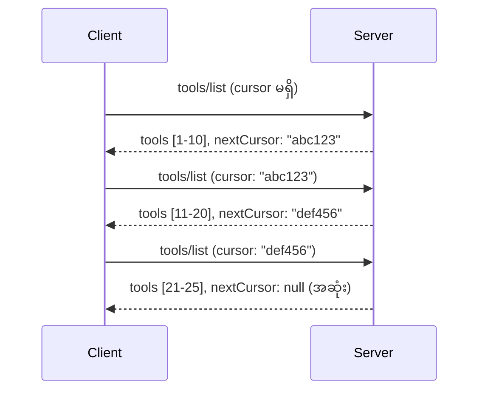

# MCP တွင် စာမျက်နှာခွဲခြင်းနှင့် ကြီးမားသော ရလဒ် အစုများ

သင့် MCP ဆာဗာသည် ဒေတာစုကြီးများကို ကိုင်တွယ်ရာတွင် - ဖိုင် သန်းများ, ဒေတာသိုလှောင်မှတ်တမ်းများ သို့မဟုတ် ရှာဖွေမှု ရလဒ်များကို စာရင်းပြုစုခြင်းဖြစ်စေ - သင်သည် မှတ်ဉာဏ်ကို ထိရောက်စွာ စီမံရန် နှင့် အသုံးပြုသူ အတွေ့အကြုံများကို ဖြေရှင်းနိုင်ရန် စာမျက်နှာခွဲခြင်း လိုအပ်ပါသည်။ ဤလမ်းညွှန်စာမျက်နှာသည် MCP တွင် စာမျက်နှာခွဲခြင်းကို မည်သို့ အကောင်အထည်ဖော်ရမည်နှင့် အသုံးပြုနိုင်မည်ကို ဖော်ပြပါသည်။

## စာမျက်နှာခွဲခြင်း၏ အရေးပါမှု

စာမျက်နှာခွဲခြင်းမပါရှိလျှင် ကြီးမားသော တုံ့ပြန်ချက်များကြောင့်:

- **မှတ်ဉာဏ် ထုတ်လွှတ်ခြင်း** - တပြိုင်နက်တည်း သန်းကျော်သောမှတ်တမ်းများအား လုပ်ဆောင်ခြင်း
- **တုံ့ပြန်ချက် နှေးကွေးခြင်း** - အသုံးပြုသူများသည် အချက်အလက်အားလုံး စုစည်းမှုအတွက် စောင့်ဆိုင်းရခြင်း
- **အချိန် ကုန်ဆုံးမှု အမှားများ** - တောင်းဆိုချက်များသည် အချိန် ကန့်သတ်ချက် ကျော်လွန်ခြင်း
- **AI အရည်အသွေး နည်းပါးခြင်း** - LLM များသည် ကြီးမားသော အကြောင်းအရာများနှင့် အားနည်းခြင်း

MCP သည် ရလဒ်အစုများကို ယုံကြည်ရရှိစေပြီး တပြတ်တည်း ပြတ်သားစွာ စီမံနိုင်ရန် **cursor-based pagination** ကို အသုံးပြုသည်။

---

## MCP Pagination လုပ်ငန်းပုံစံ

### Cursor အယူအဆ

**cursor** သည် ရလဒ်အစုထဲတွင် သင့်နေရာကို သရုပ်ဖော်သော မမြင်သာသော စာကြောင်းတစ်ကြောင်းဖြစ်သည်။ များသော စာအုပ်ကြီးတစ်အုပ်တွင် bookmarks တစ်ခုလို ထင်နိုင်သည်။


### MCP နည်းလမ်းများတွင် Pagination

အောက်ပါ MCP နည်းလမ်းများသည် စာမျက်နှာခွဲခြင်းကို ထောက်ပံ့ပါသည် -

| နည်းလမ်း | ပြန်လည် ပေးပို့သည် | Cursor ထောက်ပံ့မှု |
|--------|---------|----------------|
| `tools/list` | ကိရိယာ သတ်မှတ်ချက်များ | ✅ |
| `resources/list` | အရင်းအမြစ် သတ်မှတ်ချက်များ | ✅ |
| `prompts/list` | ပြောဆိုချက် သတ်မှတ်ချက်များ | ✅ |
| `resources/templates/list` | အရင်းအမြစ် စတင်မောင်းနှင်မှု | ✅ |

---

## ဆာဗာ အကောင်အထည်ဖော်ခြင်း

### Python (FastMCP)

```python
from mcp.server import Server
from mcp.types import Tool, ListToolsResult
import math

app = Server("paginated-server")

# စမ်းသပ်ထားသော အကြမ်းဖွဲ့ဒေတာစု
ALL_TOOLS = [
    Tool(name=f"tool_{i}", description=f"Tool number {i}", inputSchema={})
    for i in range(100)
]

PAGE_SIZE = 10

@app.list_tools()
async def list_tools(cursor: str | None = None) -> ListToolsResult:
    """List tools with pagination support."""
    
    # စတင်ရာ အညွှန်းရရန် ကာရ်ဆာကို ပြန်လည်ဖေါ်ထုတ်သည်
    start_index = 0
    if cursor:
        try:
            start_index = int(cursor)
        except ValueError:
            start_index = 0
    
    # ရလဒ်များ၏ စာမျက်နှာရယူသည်
    end_index = min(start_index + PAGE_SIZE, len(ALL_TOOLS))
    page_tools = ALL_TOOLS[start_index:end_index]
    
    # နောက်ထပ် ကာရ်ဆာတွက်ချက်သည်
    next_cursor = None
    if end_index < len(ALL_TOOLS):
        next_cursor = str(end_index)
    
    return ListToolsResult(
        tools=page_tools,
        nextCursor=next_cursor
    )
```

### TypeScript

```typescript
import { Server } from "@modelcontextprotocol/sdk/server/index.js";
import { ListToolsResultSchema } from "@modelcontextprotocol/sdk/types.js";

const server = new Server({
  name: "paginated-server",
  version: "1.0.0"
});

// ကြီးမားသော ဒေတာစုရပ်တူကူးစက်မှု
const ALL_TOOLS = Array.from({ length: 100 }, (_, i) => ({
  name: `tool_${i}`,
  description: `Tool number ${i}`,
  inputSchema: { type: "object", properties: {} }
}));

const PAGE_SIZE = 10;

server.setRequestHandler(ListToolsResultSchema, async (request) => {
  // ကူးစက်ပြေးလမ်းညွှန်ကို ဖြေဆိုပါ
  let startIndex = 0;
  if (request.params?.cursor) {
    startIndex = parseInt(request.params.cursor, 10) || 0;
  }
  
  // ရလဒ်စာမျက်နှာကို ရယူပါ
  const endIndex = Math.min(startIndex + PAGE_SIZE, ALL_TOOLS.length);
  const pageTools = ALL_TOOLS.slice(startIndex, endIndex);
  
  // နောက်တစ်ခုကူးစက်ပြေးလမ်းညွှန်ကို တွက်ချက်ပါ
  const nextCursor = endIndex < ALL_TOOLS.length ? String(endIndex) : undefined;
  
  return {
    tools: pageTools,
    nextCursor
  };
});
```

### Java (Spring MCP)

```java
@Service
public class PaginatedToolService {
    
    private static final int PAGE_SIZE = 10;
    private final List<Tool> allTools;
    
    public PaginatedToolService() {
        // အကြီးစားဒေတာစုစည်းမှုကို စတင်တည်ဆောက်ပါ
        this.allTools = IntStream.range(0, 100)
            .mapToObj(i -> new Tool("tool_" + i, "Tool number " + i, Map.of()))
            .collect(Collectors.toList());
    }
    
    @McpMethod("tools/list")
    public ListToolsResult listTools(@Param("cursor") String cursor) {
        // ကရိုက်ဆာကို ပြန်လည်ကုဒ်ဖြေပါ
        int startIndex = 0;
        if (cursor != null && !cursor.isEmpty()) {
            try {
                startIndex = Integer.parseInt(cursor);
            } catch (NumberFormatException e) {
                startIndex = 0;
            }
        }
        
        // ရလဒ်စာမျက်နှာတစ်ခုယူပါ
        int endIndex = Math.min(startIndex + PAGE_SIZE, allTools.size());
        List<Tool> pageTools = allTools.subList(startIndex, endIndex);
        
        // နောက်ထပ်ကရိုက်ဆာကိုတွက်ချက်ပါ
        String nextCursor = endIndex < allTools.size() ? String.valueOf(endIndex) : null;
        
        return new ListToolsResult(pageTools, nextCursor);
    }
}
```

---

## ကလိုင်း အကောင်အထည်ဖော်ခြင်း

### Python Client

```python
from mcp import ClientSession

async def get_all_tools(session: ClientSession) -> list:
    """Fetch all tools using pagination."""
    all_tools = []
    cursor = None
    
    while True:
        result = await session.list_tools(cursor=cursor)
        all_tools.extend(result.tools)
        
        if result.nextCursor is None:
            break
        cursor = result.nextCursor
    
    return all_tools

# အသုံးပြုမှု
async with client_session as session:
    tools = await get_all_tools(session)
    print(f"Found {len(tools)} tools")
```

### TypeScript Client

```typescript
import { Client } from "@modelcontextprotocol/sdk/client/index.js";

async function getAllTools(client: Client): Promise<Tool[]> {
  const allTools: Tool[] = [];
  let cursor: string | undefined = undefined;
  
  do {
    const result = await client.listTools({ cursor });
    allTools.push(...result.tools);
    cursor = result.nextCursor;
  } while (cursor);
  
  return allTools;
}

// အသုံးပြုမှု
const tools = await getAllTools(client);
console.log(`Found ${tools.length} tools`);
```

### Lazy Loading စံနမူနာ

အလွန်ကြီးမားသော ဒေတာစုများအတွက် စာမျက်နှာများကို လိုအပ်သလို โหลดဆွဲပါ -

```python
class PaginatedToolIterator:
    """Lazily iterate through paginated tools."""
    
    def __init__(self, session: ClientSession):
        self.session = session
        self.cursor = None
        self.buffer = []
        self.exhausted = False
    
    async def __anext__(self):
        # ရရှိနိုင်လျှင် buffer မှ ပြန်ပေးပါ
        if self.buffer:
            return self.buffer.pop(0)
        
        # စာမျက်နှာအားလုံးကို သုံးပြီးဖြစ်သည်ကို စစ်ဆေးပါ
        if self.exhausted:
            raise StopAsyncIteration
        
        # နောက်စာမျက်နှာကို ဦးတည်ဆွဲယူပါ
        result = await self.session.list_tools(cursor=self.cursor)
        self.buffer = list(result.tools)
        self.cursor = result.nextCursor
        
        if self.cursor is None:
            self.exhausted = True
        
        if not self.buffer:
            raise StopAsyncIteration
        
        return self.buffer.pop(0)
    
    def __aiter__(self):
        return self

# အသုံးပြုမှု - ကြီးမားသော ဒေတာများအတွက် မွတ်တုတ်မှန်ကန်သော မှတ်ဉာဏ် အသုံးပြုမှု
async for tool in PaginatedToolIterator(session):
    process_tool(tool)
```

---

## အရင်းအမြစ်များအတွက် Pagination

အရင်းအမြစ်များသည် ဖိုဒါများ သို့မဟုတ် ကြီးမားသော ဒေတာစုများအတွက် စာမျက်နှာခွဲခြင်း လိုအပ်သည် -

```python
from mcp.server import Server
from mcp.types import Resource, ListResourcesResult
import os

app = Server("file-server")

@app.list_resources()
async def list_resources(cursor: str | None = None) -> ListResourcesResult:
    """List files in directory with pagination."""
    
    directory = "/data/files"
    all_files = sorted(os.listdir(directory))
    
    # ဒက္ကုတ်ကာဆာ (ဖိုင်အညွှန်း)
    start_index = int(cursor) if cursor else 0
    page_size = 20
    end_index = min(start_index + page_size, len(all_files))
    
    # ဒီစာမျက်နှာအတွက် အရင်းအမြစ်စာရင်း ဖန်တီးပါ
    resources = []
    for filename in all_files[start_index:end_index]:
        filepath = os.path.join(directory, filename)
        resources.append(Resource(
            uri=f"file://{filepath}",
            name=filename,
            mimeType="application/octet-stream"
        ))
    
    # နောက်ထပ်ကာဆာ ခန့်မှန်းချက်လုပ်ပါ
    next_cursor = str(end_index) if end_index < len(all_files) else None
    
    return ListResourcesResult(
        resources=resources,
        nextCursor=next_cursor
    )
```

---

## Cursor ဒီဇိုင်း မျိုးစုံ

### မျိုးစုံ ၁: အညွှန်းအခြေခံ (ရိုးရှင်း)

```python
# Cursor သည် အညွှန်းအမှတ်သာ ဖြစ်သည်
cursor = "50"  # ပစ္စည်း ၅၀ မှစတင်ပါ
```

**အားသာချက်များ** - ရိုးရှင်းပြီး အစီအစဉ်မရှိ
**အားနည်းချက်များ** - အချက်အလက် ထည့်/ဖယ်ရှားမူများဖြင့် ရလဒ်လှုပ်ရှားနိုင်သည်

### မျိုးစုံ ၂: ID အခြေခံ (တည်ငြိမ်)

```python
# Cursor သည် နောက်ဆုံးမြင်ခဲ့သော ID ဖြစ်သည်
cursor = "item_abc123"  # ဤအရာ၏နောက်မှ စတင်ပါ
```

**အားသာချက်များ** - အချက်အလက် ပြောင်းလဲသော်လည်း တည်ငြိမ်စေသည်
**အားနည်းချက်များ** - အမှတ်စဉ်လိုအပ်သည်

### မျိုးစုံ ၃: ကုဒ်ပြုထားသော အခြေအနေ (ရှုပ်ထွေး)

```python
import base64
import json

def encode_cursor(state: dict) -> str:
    return base64.b64encode(json.dumps(state).encode()).decode()

def decode_cursor(cursor: str) -> dict:
    return json.loads(base64.b64decode(cursor).decode())

# ကာဆာတွင် အခြေအနေကွင်းများ ဘာသာရပ်များစွာ ပါဝင်သည်။
cursor = encode_cursor({
    "offset": 50,
    "filter": "active",
    "sort": "name"
})
```

**အားသာချက်များ** - ရှုပ်ထွေးသော အခြေအနေနှင့်ကိုက်ညီစေရန် ကုဒ်ပြုနိုင်သည်
**အားနည်းချက်များ** - နည်းလမ်းရှုပ်ထွေး၍ cursor စာကြောင်းများ ကြီးမားသည်

---

## အသိပညာများ

### ၁။ မှတ်သားသင့်သော စာမျက်နှာ အရွယ်အစားများ ရွေးချယ်ပါ

```python
# ဒေတာအရွယ်အစားကိုစဉ်းစားပါ
PAGE_SIZE_SMALL_ITEMS = 100   # ရိုးရှင်းသော မီတာဒေတာ
PAGE_SIZE_MEDIUM_ITEMS = 20   # ပိုပြီး ကြွယ်ဝသော ပစ္စည်းများ
PAGE_SIZE_LARGE_ITEMS = 5     # စ_complex_သော အကြောင်းအရာ
```

### ၂။ မမှန်ကန်သည့် Cursor များကို ဂရုတစိုက် ကိုင်တွယ်ပါ

```python
@app.list_tools()
async def list_tools(cursor: str | None = None) -> ListToolsResult:
    try:
        start_index = int(cursor) if cursor else 0
        if start_index < 0 or start_index >= len(ALL_TOOLS):
            start_index = 0  # မူလအခြေအနေသို့ ပြန်သတ်မှတ်ရန်
    except (ValueError, TypeError):
        start_index = 0  # မှားယွင်းသော ကာဆာ၊ အသစ်စတင်ပါ
    # ...
```

### ၃။ စုစုပေါင်း မှတ်ချက် ထည့်သွင်းခြင်း (ရွေးချယ်သည်)

```python
return ListToolsResult(
    tools=page_tools,
    nextCursor=next_cursor,
    # UI တိုးတက်မှုများအတွက် စုစုပေါင်းကိုတစ်ချို့ အကောင်အထည်ဖော်မှုများတွင် ထည့်သွင်းထားသည်။
    _meta={"total": len(ALL_TOOLS)}
)
```

### ၄။ အချက်အလက် အကန့်အသတ်များ စမ်းသပ်ပါ

```python
async def test_pagination():
    # ရလဒ်အလွတ်
    result = await session.list_tools()
    assert result.tools == []
    assert result.nextCursor is None
    
    # တစ်မျက်နှာစာ
    result = await session.list_tools()
    assert len(result.tools) <= PAGE_SIZE
    
    # မမှန်ကန်သော cursor
    result = await session.list_tools(cursor="invalid")
    assert result.tools  # ပထမမျက်နှာစာကို ပြန်ပေးသင့်သည်
```

---

## ခဏတာ အမှားများ

### ❌ အားလုံးသော ရလဒ်များကို ပြန်ပေးပြီးနောက် Client ဖြင့် စာမျက်နှာခွဲခြင်း

```python
# မကောင်းပါ: အရာအားလုံးကို မျောမှိုင်းထဲသို့ load လုပ်သည်
@app.list_tools()
async def list_tools() -> ListToolsResult:
    all_tools = load_all_tools()  # ၁ သန်းကိရိယာများ!
    return ListToolsResult(tools=all_tools)
```

### ✅ ဒေတာ အရင်းအမြစ်တွင် စာမျက်နှာခွဲခြင်း

```python
# ကောင်းရုံပဲ လိုအပ်တာကိုသာ ခဲ႔ယူတယ်
@app.list_tools()
async def list_tools(cursor: str | None = None) -> ListToolsResult:
    offset = int(cursor) if cursor else 0
    tools = await db.query_tools(offset=offset, limit=PAGE_SIZE)
    return ListToolsResult(tools=tools, nextCursor=...)
```

---

## နောက်တကြိမ် မည်သည်ကို

- [Module 5.14 - Context Engineering](../../05-AdvancedTopics/mcp-contextengineering/README.md)
- [Module 8 - Best Practices](../../08-BestPractices/README.md)
- [3.8 - Testing Your MCP Server](../../03-GettingStarted/08-testing/README.md)

---

## အပိုဆောင်း အရင်းအမြစ်များ

- [MCP Specification - Pagination](https://spec.modelcontextprotocol.io/specification/2025-11-25/)
- [Cursor-Based Pagination Explained](https://slack.engineering/evolving-api-pagination-at-slack/)
- [Python SDK pagination tests](https://github.com/modelcontextprotocol/python-sdk/blob/main/tests/client/test_list_methods_cursor.py)

---

<!-- CO-OP TRANSLATOR DISCLAIMER START -->
**ဖြည်းဖြည်းအကြောင်းကြားချက်**  
ဤစာတမ်းကို AI ဘာသာပြန်ဝန်ဆောင်မှု [Co-op Translator](https://github.com/Azure/co-op-translator) အသုံးပြု၍ ဘာသာပြန်ထားပါသည်။ ကျွန်ုပ်တို့သည် တိကျမှန်ကန်မှုအတွက် ကြိုးပမ်းပေမယ့်၊ အလိုအလျောက်ဘာသာပြန်ချက်များတွင် အမှားများ သို့မဟုတ် မှားယွင်းမှုများ ပါဝင်နိုင်ကြောင်း သတိပြုပါရန် တိုက်တွန်းအပ်ပါသည်။ မူလစာတမ်းသည် မူရင်းဘာသာစကားဖြင့် ရေးသားထားသော လက်မှတ်ပြု စာရွက်စာတမ်းအဖြစ် သတ်မှတ်ဆက်ဆံသင့်ပါသည်။ အရေးကြီးသည့် အချက်အလက်များအတွက် ပညာရှင် လူသား ဘာသာပြန်ခြင်းကို အကြံပြုပါသည်။ ဤဘာသာပြန်ချက် အသုံးပြုမှုကြောင့် ဖြစ်ပေါ်လာနိုင်သည့် မေးခွန်းများ သို့မဟုတ် မမှန်ကန်မှုများအတွက် ကျွန်ုပ်တို့ တာဝန်မယူပါ။
<!-- CO-OP TRANSLATOR DISCLAIMER END -->