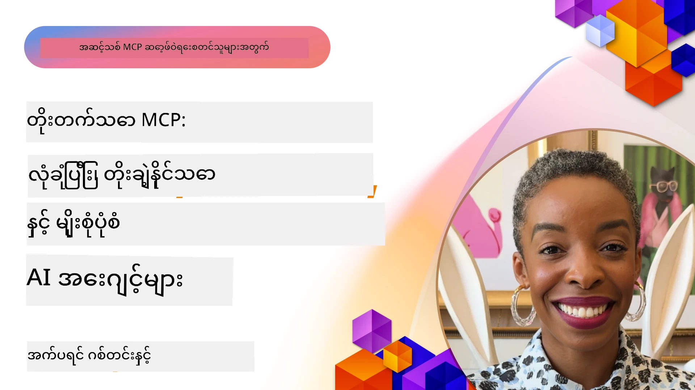

# MCP တွင် အဆင့်မြင့် ခေါင်းစဉ်များ

_(ဤသင်ခန်းစာ၏ ဗီဒီယိုကို ကြည့်ရန် အပေါ်ဖော်ပြထားသော ပုံကို နှိပ်ပါ)_

ဤအခန်းတွင် Model Context Protocol (MCP) ကို အကောင်အထည်ဖော်ရာတွင် အသုံးပြုသည့် အဆင့်မြင့်ခေါင်းစဉ်များဖြစ်သည့် မျိုးစုံပုံစံပေါင်းစည်းခြင်း၊ တိုးချဲ့နိုင်မှု၊ လုံခြုံရေးကျင့်သုံးပုံနှင့် စီးပွားရေးလုပ်ငန်း ပေါင်းစည်းမှုတို့ကို ရှင်းလင်းဖော်ပြထားပြီး၊ ယခုခေတ် AI စနစ်များ၏ တောင်းဆိုချက်များကိုဖြည့်ဆည်းနိုင်သည့် များပြားပြီး ထုတ်ကုန်အသုံးပြုနိုင်သော MCP အက်ပ်လီကေးရှင်းများ တည်ဆောက်ရာတွင် အရေးပါသည်။

## အနှစ်ချုပ်

ဤသင်ခန်းစာတွင် Model Context Protocol ကို အကောင်အထည်ဖော်ရာတွင် အဆင့်မြင့်အယူအဆများဖြစ်သည့် မျိုးစုံပုံစံပေါင်းစည်းခြင်း၊ တိုးချဲ့နိုင်မှု၊ လုံခြုံရေးကျင့်သုံးပုံနှင့် စီးပွားရေး စနစ်တွင် ပေါင်းစည်းခြင်းတို့ကို ဆွေးနွေးပါသည်။ ဤခေါင်းစဉ်များသည် စီးပွားရေးပတ်ဝန်းကျင်၌ ရှုပ်ထွေးသော တောင်းဆိုချက်များကို ကိုင်တွယ်နိုင်သော ထုတ်လုပ်မှုအဆင့် MCP အက်ပ်များ တည်ဆောက်ရာတွင် အဓိကဖြစ်ပါသည်။

## သင်ယူရမည့် ရည်ရွယ်ချက်များ

ဤသင်ခန်းစာပြီးဆုံးသောအခါ သင်သည် အောက်ပါအရာများကို ပြုလုပ်နိုင်မည်ဖြစ်သည်။

- MCP ဖ্রေဝပ်များတွင် မျိုးစုံပုံစံစွမ်းရည်များ ထည့်သွင်းဆောင်ရွက်နိုင်ခြင်း  
- လိုအပ်ချက်အများအပြားရှိသော အခြေအနေများအတွက် MCP အတွက် တိုးချဲ့နိုင်သော အသွင်အပြင်ဒီဇိုင်းဆွဲနိုင်ခြင်း  
- MCP ၏ လုံခြုံရေး နိယာမများနှင့် ကိုက်ညီသော လုံခြုံရေး ကျင့်သုံးမှုများ အကောင်အထည်ဖော်နိုင်ခြင်း  
- MCP ကို စီးပွားရေး AI စနစ်များနှင့် ဖရိမ်ဝက်များတွင် ပေါင်းစည်းနိုင်ခြင်း  
- ထုတ်လုပ်မှု ပတ်ဝန်းကျင်များတွင် သုံးစွဲမှုစွမ်းဆောင်ရည်နှင့် ယုံကြည်စိတ်ချရမှု တိုးတက်မှု ရရှိစေရန် အသုံးပြုနိုင်ခြင်း

## သင်ခန်းစာများနှင့် ဥပမာပရောဂျက်များ

| Link | ခေါင်းစဉ် | ဖော်ပြချက် |
|------|-------|-------------|
| [5.1 Integration with Azure](./mcp-integration/README.md) | Azure နှင့် ပေါင်းစည်းခြင်း | Azure ပေါ်တွင် သင့် MCP Server ကို ပေါင်းစည်းပုံ သင်ယူပါ |
| [5.2 Multi modal sample](./mcp-multi-modality/README.md) | MCP မျိုးစုံပုံစံ နမူနာများ | အသံ၊ ပုံနှင့် မျိုးစုံပုံစံ ဖြေကြားမှုများအတွက် နမူနာများ |
| [5.3 MCP OAuth2 sample](../../../05-AdvancedTopics/mcp-oauth2-demo) | MCP OAuth2 နမူနာ | MCP နှင့် OAuth2 ကို အသုံးပြုသည့် နမူနာ Spring Boot app အနည်းငယ်။ Authorization နှင့် Resource Server အဖြစ် လုပ်ဆောင်မှုရရှိစေရန် မြင့်မားသော လုံခြုံရေး token ထုတ်ပေးခြင်း၊ ကာကွယ်ထားသော endpoints များ၊ Azure Container Apps ဖြန့်ချိခြင်းနှင့် API Management ပေါင်းစည်းခြင်းကို ပြသသည်။ |
| [5.4 Root Contexts](./mcp-root-contexts/README.md) | Root contexts | Root context ဆိုတာ နှင့် ၎င်းတို့ကို ပြုလုပ်ဆောင်ရွက်နည်း သင်ယူပါ |
| [5.5 Routing](./mcp-routing/README.md) | Routing | routing အမျိုးအစားများကို သင်ယူပါ |
| [5.6 Sampling](./mcp-sampling/README.md) | Sampling | Sampling နှင့် ဆက်စပ်ကိစ္စများ သင်ယူပါ |
| [5.7 Scaling](./mcp-scaling/README.md) | Scaling | တိုးချဲ့နည်းလမ်းများ သင်ယူပါ |
| [5.8 Security](./mcp-security/README.md) | လုံခြုံရေး | သင့် MCP Server ကို လုံခြုံစေပါ |
| [5.9 Web Search sample](./web-search-mcp/README.md) | Web Search MCP | SerpAPI ဖြင့် ပေါင်းစည်းထားသည့် Python MCP server နှင့် client။ အချိန်မှီ ဝက်ဘ်၊ သတင်း၊ ထုတ်ကုန်ရှာဖွေမှုနှင့် Q&A အတွက် multi-tool စနစ်၊ အပြင် API ပေါင်းစည်းမှုနှင့် ပြဿနာရှင်းလင်းမှုအား ပြသသည်။ |
| [5.10 Realtime Streaming](./mcp-realtimestreaming/README.md) | Streaming | အချိန်နှင့် တပြိုင်နက် ဒေတာအသွားအလာသည် ယနေ့ခေတ် ဒေတာအခြေပြု ကမ္ဘာတွင် လုပ်ငန်းများနှင့် အက်ပ်များအတွက် ချက်ချင်း အသိပေးမှုလိုအပ်သည်။ |
| [5.11 Realtime Web Search](./mcp-realtimesearch/README.md) | Web Search | MCP သည် အချိန်နှင့် တပြိုင်နက် ဝက်ဘ်ရှာဖွေမှုအား AI မော်ဒယ်များ၊ ရှာဖွေများနှင့် အက်ပ်များ အကြား context စီမံခန့်ခွဲမှုအတွက် စံပြ နည်းလမ်းဖြင့် အကောင်းဆုံးပြောင်းလဲသည်။ |
| [5.12  Entra ID Authentication for Model Context Protocol Servers](./mcp-security-entra/README.md) | Entra ID Authentication | Microsoft Entra ID သည် cloud-based မှန်ကန်သော အိုင်ဒင်တစ်ဖိုင်နှင့် ဝင်ခွင့်စီမံခန့်ခွဲမှု ဖြေရှင်းချက်ဖြစ်ပြီး သင့် MCP server နှင့် သာ လက်ခံထားသော အသုံးပြုသူများနှင့် အက်ပ်များသာ ပူးပေါင်းဆောင်ရွက်နိုင်စေရန် ကူညီပေးသည်။ |
| [5.13 Azure AI Foundry Agent Integration](./mcp-foundry-agent-integration/README.md) | Azure AI Foundry Integration | Model Context Protocol server များကို Azure AI Foundry agents နှင့် ပေါင်းစည်းခြင်း၊ စံပြ ပြင်ပဒေတာရင်းမြစ်များနှင့် ဆက်သွယ်ခြင်းဖြင့် စီးပွားရေး AI အင်အားများနှင့် ကိရိယာ စနစ်အသုံးပြုမှု ပါဝင်စေရန် ဖြန့်ချိခြင်း။ |
| [5.14 Context Engineering](./mcp-contextengineering/README.md) | Context Engineering | MCP server များအတွက် context အပေါ် ဘာသာရပ်များ၏ အနာဂတ် အခွင့်အလမ်းများ၊ context တိုးတက်မြှင့်တင်မှု၊ dynamic context စီမံခန့်ခွဲမှုနှင့် MCP ဖရိမ်ဝတ်အတွင်း prompt engineering အကျိုးရှိစေမှု မဟာဗျူဟာများ။ |
| [5.15 MCP Custom Transport](./mcp-transport/README.md) | Custom Transport | စိတ်ကြိုက် MCP ဆက်သွယ်ရေး နည်းလမ်းများကို အကောင်အထည်ဖော်နည်း သင်ယူပါ။ |
| [5.16 Protocol Features Deep Dive](./mcp-protocol-features/README.md) | Protocol Features | ရှေ့ဆက် ထပ်တိုးလုပ်ဆောင်မှုများအနေနှင့် progress အသိပေးမှုများ၊ စာရင်းပယ်ဖျက်ခြင်း, resource template များနှင့် error ကိုင်တွယ်မှု စနစ်များကို ကျွမ်းကျင်ပါ။ |

> **MCP စံပြ 2025-11-25 မှ အသစ်ထည့်သွင်းချက်**: စံပြတွင် **Tasks** (တိုးတက်နေသော အလုပ်များနှင့် progress ကို လိုက်လံကြည့်ရှုနိုင်ခြင်း), **Tool Annotations** (လုံခြုံရေးအတွက် ကိရိယာအပြုအမူ metadata), **URL Mode Elicitation** (ဖောက်သည်မှ တိကျသော URL အကြောင်းအရာတောင်းဆိုခြင်း) နှင့် အမြင့်တင်ထားသော **Roots** (အလုပ်ရုံ context စီမံခန့်ခွဲမှု) စသည့် စမ်းသပ်ဆန်းစစ်မှုများ ထည့်သွင်းထားပါသည်။ အသေးစိတ်အချက်အလက်များအတွက် [MCP စံပြပြုပြင်မှုမှတ်တမ်း](https://spec.modelcontextprotocol.io/) ကို ကြည့်ပါ။

## ထပ်ဆောင်း ကိုးကားများ

အဆင့်မြင့် MCP ခေါင်းစဉ်များအတွက် နောက်ဆုံးရ သတင်းအချက်အလက်များကို အောက်ပါနေရာများမှ ရယူပါ။  
- [MCP စာတမ်း](https://modelcontextprotocol.io/)  
- [MCP စံပြ (2025-11-25)](https://spec.modelcontextprotocol.io/specification/2025-11-25/)  
- [GitHub ​Repository](https://github.com/modelcontextprotocol)  
- [OWASP MCP ထိပ်တန်း ၁၀](https://microsoft.github.io/mcp-azure-security-guide/mcp/) - လုံခြုံရေး ပြစ်မှုများနှင့် ကာကွယ်ရေး  
- [MCP လုံခြုံရေး စစ်ဆေးရေး စက်ရုံ (Sherpa)](https://azure-samples.github.io/sherpa/) - လက်တွေ့ လုံခြုံရေး သင်တန်း

## အဓိက လက်ခံမှုများ

- မျိုးစုံပုံစံ MCP အသုံးပြုမှုသည် စာအာရုံ ပိုင်းကို ကျော်၍ AI စွမ်းရည်များ တိုးတက်စေသည်  
- တိုးချဲ့နိုင်မှုသည် စီးပွားရေးအသုံးပြုမှုအတွက် အရေးပါပြီး လိမ့်သည် မျှမျှညီညွတ်စွာ တိုးချဲ့မှုနှင့် စတုရန်းတိုးချဲ့မှုဖြင့် ဖြေရှင်းနိုင်သည်  
- ပြည်ဆိုင်ရာလုံခြုံရေးကာကွယ်မှုများသည် ဒေတာကို ကာကွယ်ပေးပြီး မှန်ကန်သော ဝင်ရောက်မှု စီမံခန့်ခွဲမှုကို အာမခံပေးသည်  
- Azure OpenAI နှင့် Microsoft AI Foundry ကဲ့သို့ စီးပွားရေး ဗဟိုပြု ပလက်ဖောင်းများဖြင့် ပေါင်းစည်းမှုက MCP ၏ စွမ်းရည်များကို မြှင့်တင်ပေးသည်  
- အဆင့်မြင့် MCP အကောင်အထည်ဖော်မှုများသည် ထိရောက်သော ဒီဇိုင်းများနှင့် အရင်းအမြစ် စနစ်တကျ စီမံခန့်ခွဲမှုတို့မှ အကျိုးခံစားသည်

## လေ့ကျင့်ခန်း

သတ်မှတ်ထားသည့် အသုံးပြုမှုအတွက် စီးပွားရေးအဆင့် MCP အကောင်အထည်ဖော်မှုကို ဒီဇိုင်းဆွဲပါ။

1. သင့်အသုံးပြုမှုအတွက် မျိုးစုံပုံစံလိုအပ်ချက်များကို ဖော်ထုတ်ပါ  
2. အလျှာမြင့် ဒေတာကို ကာကွယ်ရန် လုံခြုံရေး စီမံချက်များအား ကိုယ်စားပြုပါ  
3. မတည့်မညီသော လုပ်ငန်းချိန်များကို ကိုင်တွယ်နိုင်သော တိုးချဲ့နိုင်သော ဒီဇိုင်းစနစ်တစ်ခု ချမှတ်ပါ  
4. စီးပွားရေး AI စနစ်များနှင့်ပေါင်းစည်းရန် အချက်လက်များ ရေးဆွဲပါ  
5. လုပ်ဆောင်မှုခွဲခြမ်းစိတ်ဖြာချက်နှင့် ရှင်းပြုချက် မဟာဗျူဟာများကို စာရွက်စနစ်တက်တမ်းပြုစုပါ

## ထပ်ဆောင်း အရင်းအမြစ်များ

- [Azure OpenAI စာတမ်း](https://learn.microsoft.com/en-us/azure/ai-services/openai/)  
- [Microsoft AI Foundry စာတမ်း](https://learn.microsoft.com/en-us/ai-services/)  

---

## နောက်တစ်ခုဘာလဲ

ဤမော်ဂျူးမှ သင်ခန်းစာများကို [5.1 MCP Integration](./mcp-integration/README.md) မှ စတင်လေ့လာပါ

ဤမော်ဂျူးပြီးဆုံးသွားပါက၊ [Module 6: Community Contributions](../06-CommunityContributions/README.md) ဆက်လက် လေ့လာပါ။

---

<!-- CO-OP TRANSLATOR DISCLAIMER START -->
**ကန့်သတ်ချက်**  
ဤစာတမ်းကို AI ဘာသာပြန်ဝန်ဆောင်မှုဖြစ်သည့် [Co-op Translator](https://github.com/Azure/co-op-translator) အသုံးပြုကာ ဘာသာပြန်ထားပါသည်။ ကျွန်ုပ်တို့သည် တိကျမှန်ကန်မှုအတွက် ကြိုးစားနေသော်လည်း အလိုအလျောက်ဘာသာပြန်ခြင်းကြောင့် အမှားများ သို့မဟုတ် မမှန်ကန်မှုများ ပေါ်ပေါက်နိုင်ကြောင်း သတိပြုပါရန်။ မူရင်းစာတမ်းကို သဘာဝဘာသာ ဖြင့် ရရှိသည့် စာတမ်း ဖြစ်သည့်အတွက် အထောက်အထားအရင်းအမြစ်အဖြစ် သတ်မှတ်စဉ်းစားသင့်ပါသည်။ အရေးကြီးသော သတင်းအချက်အလက်များအတွက် လူ့ပရော်ဖက်ရှင်နယ် ဘာသာပြန်ခြင်းကို အကြံပြုပါသည်။ ဤဘာသာပြန်ချက်ကို အသုံးပြုမှုမှ ဖြစ်ပေါ်သော နားမလည်မှုများ သို့မဟုတ် မှားယွင်းစိတ်ဖြင့် ကျွန်ုပ်တို့ အကြောင်းပြချက်မရှိပါ။
<!-- CO-OP TRANSLATOR DISCLAIMER END -->