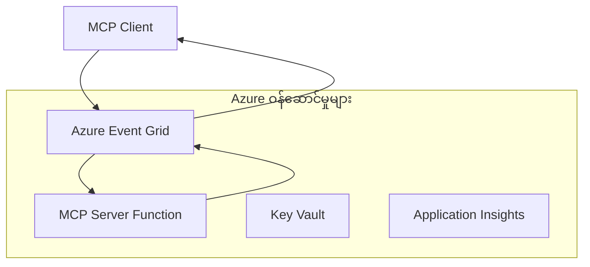
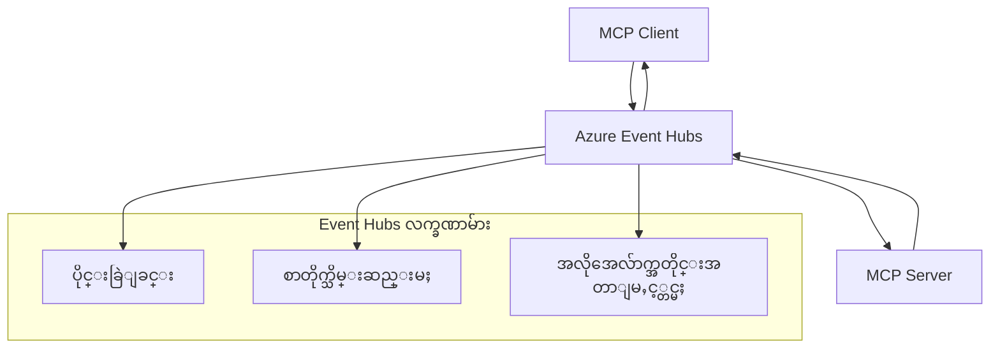

# MCP စိတ်ကြိုက် သယ်ယူပို့ဆောင်မှုများ - အဆင့်မြင့် အကောင်အထည်ဖော်ခြင်း လမ်းညွှန်

Model Context Protocol (MCP) သည် သယ်ယူပို့ဆောင်မှု မက်ခန်းနစ်များတွင် လွတ်လပ်မှုကို ပေးပြီး၊ အထူးပြုလုပ်ထားသော စီးပွားရေးပတ်ဝန်းကျင်များအတွက် စိတ်ကြိုက် အကောင်အထည်ဖော်မှုများကို ခွင့်ပြုသည်။ ဤအဆင့်မြင့် လမ်းညွှန်သည် Azure Event Grid နှင့် Azure Event Hubs ကို အသုံးပြု၍ စိတ်ကြိုက် သယ်ယူပို့ဆောင်မှု အကောင်အထည်ဖော်မှုများကို လေ့လာပြီး၊ တိုးချဲ့နိုင်သော၊ မိုးကောင်းကင်-ဒေသခံ MCP ဖြေရှင်းချက်များ တည်ဆောက်ရန် လက်တွေ့ ဥပမာများအဖြစ် ဖော်ပြသည်။

## နိဒါန်း

MCP ၏ စံသတ်မှတ်ထားသော သယ်ယူပို့ဆောင်မှုများ (stdio နှင့် HTTP streaming) သည် အများဆုံး အသုံးပြုမှုများအတွက် သင့်တော်သော်လည်း၊ စီးပွားရေးပတ်ဝန်းကျင်များတွင် တိုးချဲ့နိုင်မှု၊ ယုံကြည်စိတ်ချရမှုနှင့် ရှိပြီးသား မိုးကောင်းကင် အခြေခံအဆောက်အအုံနှင့် ပေါင်းစပ်မှုများအတွက် အထူးပြု သယ်ယူပို့ဆောင်မှု မက်ခန်းနစ်များ လိုအပ်သည်။ စိတ်ကြိုက် သယ်ယူပို့ဆောင်မှုများက MCP ကို မိုးကောင်းကင်-ဒေသခံ မက်ဆေ့ခ်ျ ဝန်ဆောင်မှုများနှင့် အချိန်မတူညီသော ဆက်သွယ်မှု၊ ဖြစ်ရပ်အခြေပြု စနစ်များနှင့် ဖြန့်ဝေထားသော အလုပ်လုပ်ဆောင်မှုများအတွက် အသုံးပြုနိုင်စေသည်။

ဤသင်ခန်းစာတွင် MCP ၏ နောက်ဆုံးထုတ်ပြန်ချက် (2025-11-25), Azure မက်ဆေ့ခ်ျ ဝန်ဆောင်မှုများနှင့် စီးပွားရေး ပေါင်းစပ်မှု ပုံစံများအပေါ် အခြေခံ၍ အဆင့်မြင့် သယ်ယူပို့ဆောင်မှု အကောင်အထည်ဖော်မှုများကို လေ့လာမည်။

### **MCP သယ်ယူပို့ဆောင်မှု ဖွဲ့စည်းပုံ**

**MCP သတ်မှတ်ချက် (2025-11-25) မှ:**

- **စံသတ်မှတ် သယ်ယူပို့ဆောင်မှုများ**: stdio (အကြံပြု), HTTP streaming (အဝေးမှ ဆက်သွယ်မှုများအတွက်)
- **စိတ်ကြိုက် သယ်ယူပို့ဆောင်မှုများ**: MCP မက်ဆေ့ခ်ျ လဲလှယ်မှု မက်ခန်းနစ်ကို အကောင်အထည်ဖော်သော သယ်ယူပို့ဆောင်မှု များအားလုံး
- **မက်ဆေ့ခ်ျ ပုံစံ**: MCP အထူးချဲ့ထွင်ချက်များပါဝင်သည့် JSON-RPC 2.0
- **နှစ်ဖက်ဆက်သွယ်မှု**: အသိပေးချက်များနှင့် တုံ့ပြန်ချက်များအတွက် ပြည့်စုံသော နှစ်ဖက်ဆက်သွယ်မှု လိုအပ်သည်

## သင်ယူရမည့် ရည်မှန်းချက်များ

ဤအဆင့်မြင့် သင်ခန်းစာ၏ အဆုံးတွင် သင်သည် အောက်ပါအရာများကို လုပ်ဆောင်နိုင်မည်ဖြစ်သည်-

- **စိတ်ကြိုက် သယ်ယူပို့ဆောင်မှု လိုအပ်ချက်များကို နားလည်ခြင်း**: MCP မက်ခန်းနစ်ကို သယ်ယူပို့ဆောင်မှု အလွှာ မည်သည့်အပေါ်မဆို အကောင်အထည်ဖော်နိုင်ပြီး လိုက်နာမှုကို ထိန်းသိမ်းခြင်း
- **Azure Event Grid သယ်ယူပို့ဆောင်မှု တည်ဆောက်ခြင်း**: Serverless တိုးချဲ့နိုင်သော MCP ဆာဗာများကို Azure Event Grid အသုံးပြု၍ ဖန်တီးခြင်း
- **Azure Event Hubs သယ်ယူပို့ဆောင်မှု အကောင်အထည်ဖော်ခြင်း**: အချိန်နှင့်တပြေးညီ စီးဆင်းမှုအတွက် Azure Event Hubs အသုံးပြု၍ MCP ဖြေရှင်းချက်များ ဒီဇိုင်းဆွဲခြင်း
- **စီးပွားရေး ပုံစံများကို အသုံးချခြင်း**: စိတ်ကြိုက် သယ်ယူပို့ဆောင်မှုများကို ရှိပြီးသား Azure အခြေခံအဆောက်အအုံနှင့် လုံခြုံရေး မော်ဒယ်များနှင့် ပေါင်းစပ်ခြင်း
- **သယ်ယူပို့ဆောင်မှု ယုံကြည်စိတ်ချရမှု ကိုင်တွယ်ခြင်း**: စီးပွားရေးအခြေအနေများအတွက် မက်ဆေ့ခ်ျ တည်တံ့မှု၊ အစီအစဉ်နှင့် အမှား ကိုင်တွယ်မှုများ အကောင်အထည်ဖော်ခြင်း
- **စွမ်းဆောင်ရည် တိုးတက်စေရေး**: တိုးချဲ့နိုင်မှု၊ နောက်ကျမှုနှင့် စီးဆင်းမှု လိုအပ်ချက်များအတွက် သယ်ယူပို့ဆောင်မှု ဖြေရှင်းချက်များ ဒီဇိုင်းဆွဲခြင်း

## **သယ်ယူပို့ဆောင်မှု လိုအပ်ချက်များ**

### **MCP သတ်မှတ်ချက် (2025-11-25) မှ အဓိက လိုအပ်ချက်များ:**

```yaml
Message Protocol:
  format: "JSON-RPC 2.0 with MCP extensions"
  bidirectional: "Full duplex communication required"
  ordering: "Message ordering must be preserved per session"
  
Transport Layer:
  reliability: "Transport MUST handle connection failures gracefully"
  security: "Transport MUST support secure communication"
  identification: "Each session MUST have unique identifier"
  
Custom Transport:
  compliance: "MUST implement complete MCP message exchange"
  extensibility: "MAY add transport-specific features"
  interoperability: "MUST maintain protocol compatibility"
```

## **Azure Event Grid သယ်ယူပို့ဆောင်မှု အကောင်အထည်ဖော်ခြင်း**

Azure Event Grid သည် serverless ဖြစ်သော ဖြစ်ရပ်လမ်းညွှန် ဝန်ဆောင်မှုဖြစ်ပြီး ဖြစ်ရပ်အခြေပြု MCP ဖွဲ့စည်းပုံများအတွက် သင့်တော်သည်။ ဤအကောင်အထည်ဖော်မှုသည် တိုးချဲ့နိုင်ပြီး ချိတ်ဆက်မှုနည်းသော MCP စနစ်များ တည်ဆောက်နည်းကို ပြသသည်။

### **ဖွဲ့စည်းပုံ အနှစ်ချုပ်**


### **C# အကောင်အထည်ဖော်မှု - Event Grid သယ်ယူပို့ဆောင်မှု**

```csharp
using Azure.Messaging.EventGrid;
using Microsoft.Extensions.Azure;
using System.Text.Json;

public class EventGridMcpTransport : IMcpTransport
{
    private readonly EventGridPublisherClient _publisher;
    private readonly string _topicEndpoint;
    private readonly string _clientId;
    
    public EventGridMcpTransport(string topicEndpoint, string accessKey, string clientId)
    {
        _publisher = new EventGridPublisherClient(
            new Uri(topicEndpoint), 
            new AzureKeyCredential(accessKey));
        _topicEndpoint = topicEndpoint;
        _clientId = clientId;
    }
    
    public async Task SendMessageAsync(McpMessage message)
    {
        var eventGridEvent = new EventGridEvent(
            subject: $"mcp/{_clientId}",
            eventType: "MCP.MessageReceived",
            dataVersion: "1.0",
            data: JsonSerializer.Serialize(message))
        {
            Id = Guid.NewGuid().ToString(),
            EventTime = DateTimeOffset.UtcNow
        };
        
        await _publisher.SendEventAsync(eventGridEvent);
    }
    
    public async Task<McpMessage> ReceiveMessageAsync(CancellationToken cancellationToken)
    {
        // Event Grid is push-based, so implement webhook receiver
        // This would typically be handled by Azure Functions trigger
        throw new NotImplementedException("Use EventGridTrigger in Azure Functions");
    }
}

// Azure Function for receiving Event Grid events
[FunctionName("McpEventGridReceiver")]
public async Task<IActionResult> HandleEventGridMessage(
    [EventGridTrigger] EventGridEvent eventGridEvent,
    ILogger log)
{
    try
    {
        var mcpMessage = JsonSerializer.Deserialize<McpMessage>(
            eventGridEvent.Data.ToString());
        
        // Process MCP message
        var response = await _mcpServer.ProcessMessageAsync(mcpMessage);
        
        // Send response back via Event Grid
        await _transport.SendMessageAsync(response);
        
        return new OkResult();
    }
    catch (Exception ex)
    {
        log.LogError(ex, "Error processing Event Grid MCP message");
        return new BadRequestResult();
    }
}
```

### **TypeScript အကောင်အထည်ဖော်မှု - Event Grid သယ်ယူပို့ဆောင်မှု**

```typescript
import { EventGridPublisherClient, AzureKeyCredential } from "@azure/eventgrid";
import { McpTransport, McpMessage } from "./mcp-types";

export class EventGridMcpTransport implements McpTransport {
    private publisher: EventGridPublisherClient;
    private clientId: string;
    
    constructor(
        private topicEndpoint: string,
        private accessKey: string,
        clientId: string
    ) {
        this.publisher = new EventGridPublisherClient(
            topicEndpoint,
            new AzureKeyCredential(accessKey)
        );
        this.clientId = clientId;
    }
    
    async sendMessage(message: McpMessage): Promise<void> {
        const event = {
            id: crypto.randomUUID(),
            source: `mcp-client-${this.clientId}`,
            type: "MCP.MessageReceived",
            time: new Date(),
            data: message
        };
        
        await this.publisher.sendEvents([event]);
    }
    
    // Azure Functions မှတဆင့် အဖြစ်အပျက်အခြေပြု လက်ခံခြင်း
    onMessage(handler: (message: McpMessage) => Promise<void>): void {
        // အကောင်အထည်ဖော်မှုတွင် Azure Functions Event Grid trigger ကို အသုံးပြုမည်
        // ၎င်းသည် webhook လက်ခံသူအတွက် အယူအဆ အင်တာဖေ့စ်ဖြစ်သည်
    }
}

// Azure Functions အကောင်အထည်ဖော်မှု
import { app, InvocationContext, EventGridEvent } from "@azure/functions";

app.eventGrid("mcpEventGridHandler", {
    handler: async (event: EventGridEvent, context: InvocationContext) => {
        try {
            const mcpMessage = event.data as McpMessage;
            
            // MCP စာတိုက်ကို ပြုလုပ်ဆောင်ရွက်ပါ
            const response = await mcpServer.processMessage(mcpMessage);
            
            // Event Grid မှတဆင့် တုံ့ပြန်ချက် ပို့ပါ
            await transport.sendMessage(response);
            
        } catch (error) {
            context.error("Error processing MCP message:", error);
            throw error;
        }
    }
});
```

### **Python အကောင်အထည်ဖော်မှု - Event Grid သယ်ယူပို့ဆောင်မှု**

```python
from azure.eventgrid import EventGridPublisherClient, EventGridEvent
from azure.core.credentials import AzureKeyCredential
import asyncio
import json
from typing import Callable, Optional
import uuid
from datetime import datetime

class EventGridMcpTransport:
    def __init__(self, topic_endpoint: str, access_key: str, client_id: str):
        self.client = EventGridPublisherClient(
            topic_endpoint, 
            AzureKeyCredential(access_key)
        )
        self.client_id = client_id
        self.message_handler: Optional[Callable] = None
    
    async def send_message(self, message: dict) -> None:
        """Send MCP message via Event Grid"""
        event = EventGridEvent(
            data=message,
            subject=f"mcp/{self.client_id}",
            event_type="MCP.MessageReceived",
            data_version="1.0"
        )
        
        await self.client.send(event)
    
    def on_message(self, handler: Callable[[dict], None]) -> None:
        """Register message handler for incoming events"""
        self.message_handler = handler

# Azure Functions အကောင်အထည်ဖော်ခြင်း
import azure.functions as func
import logging

def main(event: func.EventGridEvent) -> None:
    """Azure Functions Event Grid trigger for MCP messages"""
    try:
        # Event Grid အဖြစ်မှ MCP စာတိုက်ကို ဖော်ထုတ်ခြင်း
        mcp_message = json.loads(event.get_body().decode('utf-8'))
        
        # MCP စာတိုက်ကို လုပ်ဆောင်ခြင်း
        response = process_mcp_message(mcp_message)
        
        # Event Grid မှတဆင့် ပြန်လည်တုံ့ပြန်ချက် ပို့ခြင်း
        # (အကောင်အထည်ဖော်မှုသည် အသစ်သော Event Grid client ကို ဖန်တီးမည်)
        
    except Exception as e:
        logging.error(f"Error processing MCP Event Grid message: {e}")
        raise
```

## **Azure Event Hubs သယ်ယူပို့ဆောင်မှု အကောင်အထည်ဖော်ခြင်း**

Azure Event Hubs သည် နိမ့်သော နောက်ကျမှုနှင့် မက်ဆေ့ခ်ျ အရေအတွက် များသော MCP အခြေအနေများအတွက် မြင့်မားသော စီးဆင်းမှုနှင့် အချိန်နှင့်တပြေးညီ စီးဆင်းမှု စွမ်းဆောင်ရည်များ ပေးသည်။

### **ဖွဲ့စည်းပုံ အနှစ်ချုပ်**


### **C# အကောင်အထည်ဖော်မှု - Event Hubs သယ်ယူပို့ဆောင်မှု**

```csharp
using Azure.Messaging.EventHubs;
using Azure.Messaging.EventHubs.Producer;
using Azure.Messaging.EventHubs.Consumer;
using System.Text;

public class EventHubsMcpTransport : IMcpTransport, IDisposable
{
    private readonly EventHubProducerClient _producer;
    private readonly EventHubConsumerClient _consumer;
    private readonly string _consumerGroup;
    private readonly CancellationTokenSource _cancellationTokenSource;
    
    public EventHubsMcpTransport(
        string connectionString, 
        string eventHubName,
        string consumerGroup = "$Default")
    {
        _producer = new EventHubProducerClient(connectionString, eventHubName);
        _consumer = new EventHubConsumerClient(
            consumerGroup, 
            connectionString, 
            eventHubName);
        _consumerGroup = consumerGroup;
        _cancellationTokenSource = new CancellationTokenSource();
    }
    
    public async Task SendMessageAsync(McpMessage message)
    {
        var messageBody = JsonSerializer.Serialize(message);
        var eventData = new EventData(Encoding.UTF8.GetBytes(messageBody));
        
        // Add MCP-specific properties
        eventData.Properties.Add("MessageType", message.Method ?? "response");
        eventData.Properties.Add("MessageId", message.Id);
        eventData.Properties.Add("Timestamp", DateTimeOffset.UtcNow);
        
        await _producer.SendAsync(new[] { eventData });
    }
    
    public async Task StartReceivingAsync(
        Func<McpMessage, Task> messageHandler)
    {
        await foreach (PartitionEvent partitionEvent in _consumer.ReadEventsAsync(
            _cancellationTokenSource.Token))
        {
            try
            {
                var messageBody = Encoding.UTF8.GetString(
                    partitionEvent.Data.EventBody.ToArray());
                var mcpMessage = JsonSerializer.Deserialize<McpMessage>(messageBody);
                
                await messageHandler(mcpMessage);
            }
            catch (Exception ex)
            {
                // Handle deserialization or processing errors
                Console.WriteLine($"Error processing message: {ex.Message}");
            }
        }
    }
    
    public void Dispose()
    {
        _cancellationTokenSource?.Cancel();
        _producer?.DisposeAsync().AsTask().Wait();
        _consumer?.DisposeAsync().AsTask().Wait();
        _cancellationTokenSource?.Dispose();
    }
}
```

### **TypeScript အကောင်အထည်ဖော်မှု - Event Hubs သယ်ယူပို့ဆောင်မှု**

```typescript
import { 
    EventHubProducerClient, 
    EventHubConsumerClient, 
    EventData 
} from "@azure/event-hubs";

export class EventHubsMcpTransport implements McpTransport {
    private producer: EventHubProducerClient;
    private consumer: EventHubConsumerClient;
    private isReceiving = false;
    
    constructor(
        private connectionString: string,
        private eventHubName: string,
        private consumerGroup: string = "$Default"
    ) {
        this.producer = new EventHubProducerClient(
            connectionString, 
            eventHubName
        );
        this.consumer = new EventHubConsumerClient(
            consumerGroup,
            connectionString,
            eventHubName
        );
    }
    
    async sendMessage(message: McpMessage): Promise<void> {
        const eventData: EventData = {
            body: JSON.stringify(message),
            properties: {
                messageType: message.method || "response",
                messageId: message.id,
                timestamp: new Date().toISOString()
            }
        };
        
        await this.producer.sendBatch([eventData]);
    }
    
    async startReceiving(
        messageHandler: (message: McpMessage) => Promise<void>
    ): Promise<void> {
        if (this.isReceiving) return;
        
        this.isReceiving = true;
        
        const subscription = this.consumer.subscribe({
            processEvents: async (events, context) => {
                for (const event of events) {
                    try {
                        const messageBody = event.body as string;
                        const mcpMessage: McpMessage = JSON.parse(messageBody);
                        
                        await messageHandler(mcpMessage);
                        
                        // အနည်းဆုံးတစ်ကြိမ်ပို့ဆောင်မှုအတွက် checkpoint ကိုအပ်ဒိတ်လုပ်ပါ
                        await context.updateCheckpoint(event);
                    } catch (error) {
                        console.error("Error processing Event Hubs message:", error);
                    }
                }
            },
            processError: async (err, context) => {
                console.error("Event Hubs error:", err);
            }
        });
    }
    
    async close(): Promise<void> {
        this.isReceiving = false;
        await this.producer.close();
        await this.consumer.close();
    }
}
```

### **Python အကောင်အထည်ဖော်မှု - Event Hubs သယ်ယူပို့ဆောင်မှု**

```python
from azure.eventhub import EventHubProducerClient, EventHubConsumerClient
from azure.eventhub import EventData
import json
import asyncio
from typing import Callable, Dict, Any
import logging

class EventHubsMcpTransport:
    def __init__(
        self, 
        connection_string: str, 
        eventhub_name: str,
        consumer_group: str = "$Default"
    ):
        self.producer = EventHubProducerClient.from_connection_string(
            connection_string, 
            eventhub_name=eventhub_name
        )
        self.consumer = EventHubConsumerClient.from_connection_string(
            connection_string,
            consumer_group=consumer_group,
            eventhub_name=eventhub_name
        )
        self.is_receiving = False
    
    async def send_message(self, message: Dict[str, Any]) -> None:
        """Send MCP message via Event Hubs"""
        event_data = EventData(json.dumps(message))
        
        # MCP-အထူးပိုင်ဆိုင်မှုများ ထည့်ပါ
        event_data.properties = {
            "messageType": message.get("method", "response"),
            "messageId": message.get("id"),
            "timestamp": "2025-01-14T10:30:00Z"  # အမှန်တကယ် အချိန်တံဆိပ်ကို အသုံးပြုပါ
        }
        
        async with self.producer:
            event_data_batch = await self.producer.create_batch()
            event_data_batch.add(event_data)
            await self.producer.send_batch(event_data_batch)
    
    async def start_receiving(
        self, 
        message_handler: Callable[[Dict[str, Any]], None]
    ) -> None:
        """Start receiving MCP messages from Event Hubs"""
        if self.is_receiving:
            return
        
        self.is_receiving = True
        
        async with self.consumer:
            await self.consumer.receive(
                on_event=self._on_event_received(message_handler),
                starting_position="-1"  # အစမှ စတင်ပါ
            )
    
    def _on_event_received(self, handler: Callable):
        """Internal event handler wrapper"""
        async def handle_event(partition_context, event):
            try:
                # Event Hubs ဖြစ်ရပ်မှ MCP စာတိုက်ကို ဖော်ထုတ်ပါ
                message_body = event.body_as_str(encoding='UTF-8')
                mcp_message = json.loads(message_body)
                
                # MCP စာတိုက်ကို ပြုလုပ်ဆောင်ရွက်ပါ
                await handler(mcp_message)
                
                # အနည်းဆုံးတစ်ကြိမ် ပို့ဆောင်မှုအတွက် checkpoint ကို အပ်ဒိတ်လုပ်ပါ
                await partition_context.update_checkpoint(event)
                
            except Exception as e:
                logging.error(f"Error processing Event Hubs message: {e}")
        
        return handle_event
    
    async def close(self) -> None:
        """Clean up transport resources"""
        self.is_receiving = False
        await self.producer.close()
        await self.consumer.close()
```

## **အဆင့်မြင့် သယ်ယူပို့ဆောင်မှု ပုံစံများ**

### **မက်ဆေ့ခ်ျ တည်တံ့မှုနှင့် ယုံကြည်စိတ်ချရမှု**

```csharp
// Implementing message durability with retry logic
public class ReliableTransportWrapper : IMcpTransport
{
    private readonly IMcpTransport _innerTransport;
    private readonly RetryPolicy _retryPolicy;
    
    public async Task SendMessageAsync(McpMessage message)
    {
        await _retryPolicy.ExecuteAsync(async () =>
        {
            try
            {
                await _innerTransport.SendMessageAsync(message);
            }
            catch (TransportException ex) when (ex.IsRetryable)
            {
                // Log and retry
                throw;
            }
        });
    }
}
```

### **သယ်ယူပို့ဆောင်မှု လုံခြုံရေး ပေါင်းစပ်မှု**

```csharp
// Integrating Azure Key Vault for transport security
public class SecureTransportFactory
{
    private readonly SecretClient _keyVaultClient;
    
    public async Task<IMcpTransport> CreateEventGridTransportAsync()
    {
        var accessKey = await _keyVaultClient.GetSecretAsync("EventGridAccessKey");
        var topicEndpoint = await _keyVaultClient.GetSecretAsync("EventGridTopic");
        
        return new EventGridMcpTransport(
            topicEndpoint.Value.Value,
            accessKey.Value.Value,
            Environment.MachineName
        );
    }
}
```

### **သယ်ယူပို့ဆောင်မှု စောင့်ကြည့်မှုနှင့် တွေ့ရှိနိုင်မှု**

```csharp
// Adding telemetry to custom transports
public class ObservableTransport : IMcpTransport
{
    private readonly IMcpTransport _transport;
    private readonly ILogger _logger;
    private readonly TelemetryClient _telemetryClient;
    
    public async Task SendMessageAsync(McpMessage message)
    {
        using var activity = Activity.StartActivity("MCP.Transport.Send");
        activity?.SetTag("transport.type", "EventGrid");
        activity?.SetTag("message.method", message.Method);
        
        var stopwatch = Stopwatch.StartNew();
        
        try
        {
            await _transport.SendMessageAsync(message);
            
            _telemetryClient.TrackDependency(
                "EventGrid",
                "SendMessage",
                DateTime.UtcNow.Subtract(stopwatch.Elapsed),
                stopwatch.Elapsed,
                true
            );
        }
        catch (Exception ex)
        {
            _telemetryClient.TrackException(ex);
            throw;
        }
    }
}
```

## **စီးပွားရေး ပေါင်းစပ်မှု အခြေအနေများ**

### **အခြေအနေ ၁: MCP ဖြန့်ဝေမှု လုပ်ငန်းစဉ်**

MCP တောင်းဆိုမှုများကို အလုပ်လုပ်ဆောင်မှု node များစွာသို့ ဖြန့်ဝေရာတွင် Azure Event Grid အသုံးပြုခြင်း-

```yaml
Architecture:
  - MCP Client sends requests to Event Grid topic
  - Multiple Azure Functions subscribe to process different tool types
  - Results aggregated and returned via separate response topic
  
Benefits:
  - Horizontal scaling based on message volume
  - Fault tolerance through redundant processors
  - Cost optimization with serverless compute
```

### **အခြေအနေ ၂: အချိန်နှင့်တပြေးညီ MCP စီးဆင်းမှု**

မြင့်မားသော အကြိမ်ရေ MCP ဆက်သွယ်မှုများအတွက် Azure Event Hubs အသုံးပြုခြင်း-

```yaml
Architecture:
  - MCP Client streams continuous requests via Event Hubs
  - Stream Analytics processes and routes messages
  - Multiple consumers handle different aspect of processing
  
Benefits:
  - Low latency for real-time scenarios
  - High throughput for batch processing
  - Built-in partitioning for parallel processing
```

### **အခြေအနေ ၃: ဟိုက်ဘရစ် သယ်ယူပို့ဆောင်မှု ဖွဲ့စည်းပုံ**

အသုံးပြုမှု မတူညီသည့် သယ်ယူပို့ဆောင်မှု များကို ပေါင်းစပ်ခြင်း-

```csharp
public class HybridMcpTransport : IMcpTransport
{
    private readonly IMcpTransport _realtimeTransport; // Event Hubs
    private readonly IMcpTransport _batchTransport;    // Event Grid
    private readonly IMcpTransport _fallbackTransport; // HTTP Streaming
    
    public async Task SendMessageAsync(McpMessage message)
    {
        // Route based on message characteristics
        var transport = message.Method switch
        {
            "tools/call" when IsRealtime(message) => _realtimeTransport,
            "resources/read" when IsBatch(message) => _batchTransport,
            _ => _fallbackTransport
        };
        
        await transport.SendMessageAsync(message);
    }
}
```

## **စွမ်းဆောင်ရည် တိုးတက်စေရေး**

### **Event Grid အတွက် မက်ဆေ့ခ်ျ အစုလိုက်**

```csharp
public class BatchingEventGridTransport : IMcpTransport
{
    private readonly List<McpMessage> _messageBuffer = new();
    private readonly Timer _flushTimer;
    private const int MaxBatchSize = 100;
    
    public async Task SendMessageAsync(McpMessage message)
    {
        lock (_messageBuffer)
        {
            _messageBuffer.Add(message);
            
            if (_messageBuffer.Count >= MaxBatchSize)
            {
                _ = Task.Run(FlushMessages);
            }
        }
    }
    
    private async Task FlushMessages()
    {
        List<McpMessage> toSend;
        lock (_messageBuffer)
        {
            toSend = new List<McpMessage>(_messageBuffer);
            _messageBuffer.Clear();
        }
        
        if (toSend.Any())
        {
            var events = toSend.Select(CreateEventGridEvent);
            await _publisher.SendEventsAsync(events);
        }
    }
}
```

### **Event Hubs အတွက် အပိုင်းခွဲမှု မဟာဗျူဟာ**

```csharp
public class PartitionedEventHubsTransport : IMcpTransport
{
    public async Task SendMessageAsync(McpMessage message)
    {
        // Partition by client ID for session affinity
        var partitionKey = ExtractClientId(message);
        
        var eventData = new EventData(JsonSerializer.SerializeToUtf8Bytes(message))
        {
            PartitionKey = partitionKey
        };
        
        await _producer.SendAsync(new[] { eventData });
    }
}
```

## **စိတ်ကြိုက် သယ်ယူပို့ဆောင်မှု စမ်းသပ်ခြင်း**

### **Test Doubles ဖြင့် ယူနစ် စမ်းသပ်ခြင်း**

```csharp
[Test]
public async Task EventGridTransport_SendMessage_PublishesCorrectEvent()
{
    // Arrange
    var mockPublisher = new Mock<EventGridPublisherClient>();
    var transport = new EventGridMcpTransport(mockPublisher.Object);
    var message = new McpMessage { Method = "tools/list", Id = "test-123" };
    
    // Act
    await transport.SendMessageAsync(message);
    
    // Assert
    mockPublisher.Verify(
        x => x.SendEventAsync(
            It.Is<EventGridEvent>(e => 
                e.EventType == "MCP.MessageReceived" &&
                e.Subject == "mcp/test-client"
            )
        ),
        Times.Once
    );
}
```

### **Azure Test Containers ဖြင့် ပေါင်းစပ် စမ်းသပ်ခြင်း**

```csharp
[Test]
public async Task EventHubsTransport_IntegrationTest()
{
    // Using Testcontainers for integration testing
    var eventHubsContainer = new EventHubsContainer()
        .WithEventHub("test-hub");
    
    await eventHubsContainer.StartAsync();
    
    var transport = new EventHubsMcpTransport(
        eventHubsContainer.GetConnectionString(),
        "test-hub"
    );
    
    // Test message round-trip
    var sentMessage = new McpMessage { Method = "test", Id = "123" };
    McpMessage receivedMessage = null;
    
    await transport.StartReceivingAsync(msg => {
        receivedMessage = msg;
        return Task.CompletedTask;
    });
    
    await transport.SendMessageAsync(sentMessage);
    await Task.Delay(1000); // Allow for message processing
    
    Assert.That(receivedMessage?.Id, Is.EqualTo("123"));
}
```

## **အကောင်းဆုံး လေ့လာမှုနည်းလမ်းများနှင့် လမ်းညွှန်ချက်များ**

### **သယ်ယူပို့ဆောင်မှု ဒီဇိုင်း အခြေခံ 원칙များ**

1. **Idempotency**: မက်ဆေ့ခ်ျများကို ထပ်မံ လက်ခံမှုများကို ကိုင်တွယ်နိုင်ရန် idempotent ဖြစ်စေရန် သေချာစေပါ
2. **အမှား ကိုင်တွယ်မှု**: အပြည့်အစုံ အမှား ကိုင်တွယ်မှုနှင့် dead letter queue များ အကောင်အထည်ဖော်ပါ
3. **စောင့်ကြည့်မှု**: အသေးစိတ် telemetry နှင့် ကျန်းမာရေး စစ်ဆေးမှုများ ထည့်သွင်းပါ
4. **လုံခြုံရေး**: managed identities နှင့် အနည်းဆုံး အခွင့်အရေး ဝင်ရောက်ခွင့် အသုံးပြုပါ
5. **စွမ်းဆောင်ရည်**: သင့်လိုအပ်ချက်များအတွက် နောက်ကျမှုနှင့် စီးဆင်းမှု ဒီဇိုင်းဆွဲပါ

### **Azure အထူးအကြံပြုချက်များ**

1. **Managed Identity အသုံးပြုပါ**: ထုတ်လုပ်မှုတွင် connection string မသုံးပါနှင့်
2. **Circuit Breakers အကောင်အထည်ဖော်ပါ**: Azure ဝန်ဆောင်မှု ပျက်ကွက်မှုများမှ ကာကွယ်ပါ
3. **ကုန်ကျစရိတ် စောင့်ကြည့်ပါ**: မက်ဆေ့ခ်ျ အရေအတွက်နှင့် လုပ်ငန်းစရိတ်များကို မှတ်တမ်းတင်ပါ
4. **တိုးချဲ့မှု အတွက် စီမံကိန်းရေးဆွဲပါ**: အပိုင်းခွဲခြင်းနှင့် တိုးချဲ့မှု မဟာဗျူဟာများကို မကြာခဏ စီစဉ်ပါ
5. **စမ်းသပ်မှု ပြည့်စုံစွာ ပြုလုပ်ပါ**: Azure DevTest Labs ကို အသုံးပြု၍ စမ်းသပ်မှု ပြုလုပ်ပါ

## **နိဂုံးချုပ်**

စိတ်ကြိုက် MCP သယ်ယူပို့ဆောင်မှုများက Azure ၏ မက်ဆေ့ခ်ျ ဝန်ဆောင်မှုများကို အသုံးပြု၍ စွမ်းအားကြီးသော စီးပွားရေး အခြေအနေများကို ချဲ့ထွင်နိုင်စေသည်။ Event Grid သို့မဟုတ် Event Hubs သယ်ယူပို့ဆောင်မှုများကို အကောင်အထည်ဖော်ခြင်းဖြင့် တိုးချဲ့နိုင်ပြီး ယုံကြည်စိတ်ချရသော MCP ဖြေရှင်းချက်များကို ရှိပြီးသား Azure အခြေခံအဆောက်အအုံနှင့် ချိတ်ဆက်နိုင်သည်။

ပေးထားသော ဥပမာများသည် MCP မက်ခန်းနစ်လိုက်နာမှုနှင့် Azure ၏ အကောင်းဆုံး လေ့လာမှုများကို ထိန်းသိမ်းကာ စိတ်ကြိုက် သယ်ယူပို့ဆောင်မှုများ အကောင်အထည်ဖော်ရာတွင် ထုတ်လုပ်မှုအဆင်သင့် ပုံစံများကို ပြသသည်။

## **အပိုဆောင်း အရင်းအမြစ်များ**

- [MCP Specification 2025-06-18](https://spec.modelcontextprotocol.io/specification/2025-06-18/)
- [Azure Event Grid Documentation](https://docs.microsoft.com/azure/event-grid/)
- [Azure Event Hubs Documentation](https://docs.microsoft.com/azure/event-hubs/)
- [Azure Functions Event Grid Trigger](https://docs.microsoft.com/azure/azure-functions/functions-bindings-event-grid)
- [Azure SDK for .NET](https://github.com/Azure/azure-sdk-for-net)
- [Azure SDK for TypeScript](https://github.com/Azure/azure-sdk-for-js)
- [Azure SDK for Python](https://github.com/Azure/azure-sdk-for-python)

---

> *ဤလမ်းညွှန်သည် ထုတ်လုပ်မှု MCP စနစ်များအတွက် လက်တွေ့ အကောင်အထည်ဖော်မှု ပုံစံများကို အာရုံစိုက်ထားသည်။ သယ်ယူပို့ဆောင်မှု အကောင်အထည်ဖော်မှုများကို သင့်လိုအပ်ချက်များနှင့် Azure ဝန်ဆောင်မှု ကန့်သတ်ချက်များနှင့် အမြဲစစ်ဆေးပါ။*
> **လက်ရှိ စံသတ်မှတ်ချက်**: ဤလမ်းညွှန်သည် [MCP Specification 2025-06-18](https://spec.modelcontextprotocol.io/specification/2025-06-18/) ၏ သယ်ယူပို့ဆောင်မှု လိုအပ်ချက်များနှင့် စီးပွားရေး ပတ်ဝန်းကျင်အတွက် အဆင့်မြင့် သယ်ယူပို့ဆောင်မှု ပုံစံများကို ပြသသည်။


## နောက်တစ်ဆင့်
- [6. Community Contributions](../../06-CommunityContributions/README.md)

---

<!-- CO-OP TRANSLATOR DISCLAIMER START -->
**အကြောင်းကြားချက်**  
ဤစာတမ်းကို AI ဘာသာပြန်ဝန်ဆောင်မှု [Co-op Translator](https://github.com/Azure/co-op-translator) ဖြင့် ဘာသာပြန်ထားပါသည်။ ကျွန်ုပ်တို့သည် တိကျမှန်ကန်မှုအတွက် ကြိုးစားသော်လည်း အလိုအလျောက် ဘာသာပြန်ခြင်းတွင် အမှားများ သို့မဟုတ် မှားယွင်းချက်များ ပါဝင်နိုင်ကြောင်း သတိပြုပါရန် မေတ္တာရပ်ခံအပ်ပါသည်။ မူရင်းစာတမ်းကို မိမိဘာသာစကားဖြင့်သာ တရားဝင်အရင်းအမြစ်အဖြစ် ယူဆသင့်ပါသည်။ အရေးကြီးသော အချက်အလက်များအတွက် လူ့ဘာသာပြန်သူမှ တာဝန်ယူ၍ ဘာသာပြန်ခြင်းကို အကြံပြုပါသည်။ ဤဘာသာပြန်ချက်ကို အသုံးပြုရာမှ ဖြစ်ပေါ်လာနိုင်သည့် နားလည်မှုမှားယွင်းမှုများအတွက် ကျွန်ုပ်တို့သည် တာဝန်မယူပါ။
<!-- CO-OP TRANSLATOR DISCLAIMER END -->