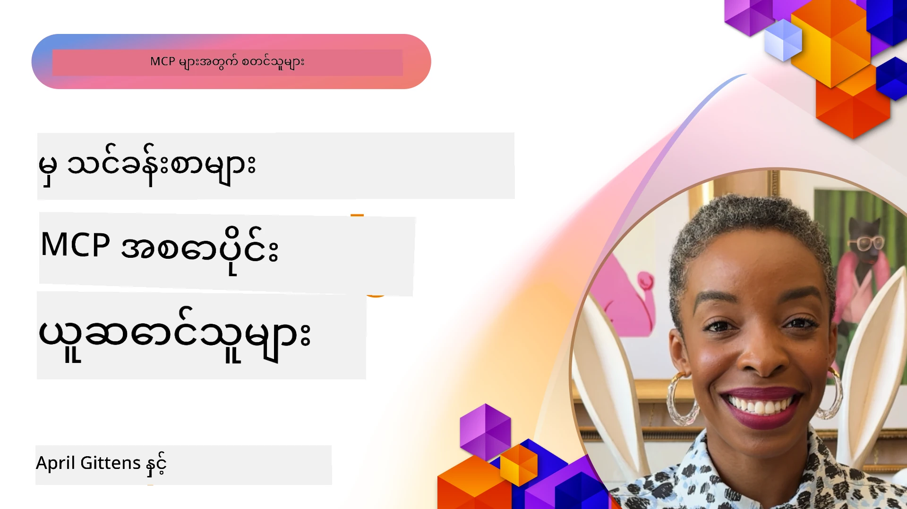

# 🌟 စတင်အသုံးပြုသူများထံမှ သင်ခန်းစာများ

[](https://youtu.be/jds7dSmNptE)

_(ဒီသင်ခန်းစာ၏ ဗီဒီယိုကို ကြည့်ရန် အထက်တွင် ရွေးချယ်ပါ)_

## 🎯 ဤမော်ဒယ်တွင် ပါဝင်သော အကြောင်းအရာများ

ဤမော်ဒယ်သည် Model Context Protocol (MCP) ကို အသုံးပြုကာ အမှန်တကယ်ဖြစ်ပေါ်နေသော အွန်လိုင်းစိန်ခေါ်မှုများကို ဖြေရှင်းလိုသော အဖွဲ့အစည်းများနှင့် ဖန်တီးသူများ က အဖြေရှာသည့် နည်းလမ်းများကို ရှာဖွေသည်။ အသေးစိတ် အခန်းကဏ္ဍ လေ့လာမှုများ၊ လက်တွေ့လုပ်ငန်းစဉ်များနှင့် အတော်လေး နမူနာများက segítsséggel MCP သည် ဘာသာစကား မော်ဒယ်များ၊ ကိရိယာများနှင့် စက်မှုဝန်ဆောင်မှု ဒေတာများကို ဆက်သွယ်ပေးသည့်လုံခြုံစိတ်ချရ နှင့် တိုးတက်စီးပွားမှုကောင်းမွန်ရေး AI ပေါင်းစည်းမှုအား မည်ကဲ့သို့ အေကြာင်းအားဖြည့်ပေးတတ်သည်ကို ရှာဖွေတွေ့ရှိပါမည်။

### 📚 MCP သုံးခြင်းကို ကြည့်ရှုရန်

ဤနည်းဗေဒများကို ထုတ်လုပ်မှုအသုံးပြုကိရိယာများတွင် အကောင်အထည်ဖော်ထားသောကို စိတ်ဝင်စားပါသလား? ကျွန်ုပ်တို့၏ [**Developer Productivity ပြောင်းလဲပေးနေသော Microsoft MCP ဆာဗာ ၁၀ ခု**](microsoft-mcp-servers.md) ကို တိုက်ရိုက်ကြည့်ရှုနိုင်ပါသည်။

## အကျဉ်း

ဤသင်ခန်းစာသည် စတင်အသုံးပြုသူများ က Model Context Protocol (MCP) ကို အသုံးပြုကာ စက်မှုလုပ်ငန်းများအတွင်း အမှန်တကယ် ဖြစ်ပေါ်နေသော စိန်ခေါ်မှုများအား ဖြေရှင်း၊ တိုးတက်မှု လုပ်ဆောင်ကာ စီးပွားရေး လုပ်ငန်းများအတွင်း ဖော်ထုတ်မှုနှင့် ဖန်တီးမှုများ ပြုလုပ်သည့်နည်းလမ်းများကို လေ့လာသည်။ အသေးစိတ် အခန်းကဏ္ဍများနှင့် လက်တွေ့လုပ်ငန်းများမှတဆင့် MCP သည် စံအတိုင်းအတာရှိ၊ လုံခြုံပြီး၊ တိုးတက်စေရန် အသုံးပြုနိုင်သော AI ပေါင်းစည်းမှုကို မည်ကဲ့သို့ ဖန်တီးနိုင်သည်ကို တွေ့ရမည်ဖြစ်ပြီး၊ ဘယ်လို MCP အခြေခံဖြေရှင်းချက်များကို ဒီဇိုင်းရေးဆွဲ၍ တည်ဆောက်ရမည်လဲ၊ MCP ကို ထုတ်လုပ်မှုတွင် ထည့်သွင်းအသုံးပြုရာတွင် ထုတ်ပြန်သုံးစွဲနည်းများ၊ အကောင်းဆုံး လုပ်ဆောင်မှု နည်းလမ်းများကို လေ့လာနားလည်မည်ဖြစ်သည်။ အတူတကွ MCP နည်းပညာ၏ တိုးတက်နေသည့် ယန္တရားနှင့် ဖွံ့ဖြိုးနေသော စနစ်များအတွက် ခေတ်ကြီးလာနေသော ရည်မှန်းချက်များ၊ အနာဂတ် ဦးတည်ချက်များနှင့် အများအတွက် လူသုံးမှတ် ပစ္စည်းများကိုလည်း တင်ပြထားသည်။

## သင်ယူရမည့် ရည်ရွယ်ချက်များ

- စက်မှုလုပ်ငန်းအမျိုးမျိုးရှိ ဖြစ်ပေါ်နေသော MCP အကောင်အထည်ဖော်မှုများကို စိစစ်ခွဲခြမ်းသည်။
- MCP အခြေခံ အပြည့်အစုံဖြေရှင်းချက်များ ဒီဇိုင်းရေးဆွဲကာ တည်ဆောက်သည့်အတွေ့အကြုံရရှိသည်။
- MCP နည်းပညာတွင် ထွက်ပေါ်လာနေသော စီးတန်းများနှင့် အနာဂတ် ဦးတည်ချက်များကို သိရှိသည်။
- အမှန်တကယ် ဖန်တီးမှုအခြေအနေများတွင် အကောင်းဆုံး လုပ်ဆောင်မှုများကို အကောင်အထည်ဖော်အသုံးချသည်။

## အမှန်တကယ် ဖြစ်ပေါ်နေသော MCP အကောင်အထည်ဖော်မှုများ

### အခန်းကဏ္ဍ ၁: စီးပွားရေး ဖောက်သည် ထောက်ခံမှု အလိုအလျောက်စနစ်

တစ်နိုင်ငံကြီး ပေါင်းစည်းထားသည့် ကုမ္ပဏီတစ်ခုသည် MCP အခြေခံ ဖြေရှင်းချက်တစ်ခုကို ဖောက်သည်ထောက်ခံမှု စနစ်ပေါ်တွင် စံမြောက်စေစေရန် အသုံးပြုခဲ့သည်။ ၎င်းတို့အား အောက်ပါအရာများသာ ရရှိစေခဲ့သည်-

- LLM ပံ့ပိုးသူ များစွာအတွက် ပြန်လည် တနေ့တည်း အသုံးပြုနိုင်သော အင်တာဖေ့စ် တစ်ခု ဖန်တီးရန်
- ဌာနခွဲများအတွင်း သုံးဆောင်မှု စနစ်တကျ ထိန်းသိမ်းခြင်း
- လုံခြုံရေးနှင့် အညီအမခံစနစ်များကို ခိုင်မာစွာ တပ်ဆင်ခြင်း
- လိုအပ်ချက်အရ မော်ဒယ်များရှုထောင့်ပြောင်းရွှေ့နိုင်စေရန် လွယ်ကူစေရန်

**နည်းပညာ အကောင်အထည်ဖော်မှု:**

```python
# ဖောက်သည်ပံ့ပိုးမှုအတွက် Python MCP ဆာဗာအကောင်အထည်ဖော်ခြင်း
import logging
import asyncio
from modelcontextprotocol import create_server, ServerConfig
from modelcontextprotocol.server import MCPServer
from modelcontextprotocol.transports import create_http_transport
from modelcontextprotocol.resources import ResourceDefinition
from modelcontextprotocol.prompts import PromptDefinition
from modelcontextprotocol.tool import ToolDefinition

# မှတ်တမ်းတင်ခြင်းကို ပြင်ဆင်ပါ
logging.basicConfig(level=logging.INFO)

async def main():
    # ဆာဗာဖွဲ့စည်းမှုကို ဖန်တီးပါ
    config = ServerConfig(
        name="Enterprise Customer Support Server",
        version="1.0.0",
        description="MCP server for handling customer support inquiries"
    )
    
    # MCP ဆာဗာကို စတင် initialize အုပ်ချုပ်ပါ
    server = create_server(config)
    
    # သတင်းအချက်အလက်ဗေဒအရင်းအမြစ်များကို မှတ်ပုံတင်ပါ
    server.resources.register(
        ResourceDefinition(
            name="customer_kb",
            description="Customer knowledge base documentation"
        ),
        lambda params: get_customer_documentation(params)
    )
    
    # Prompt နမူနာများကို မှတ်ပုံတင်ပါ
    server.prompts.register(
        PromptDefinition(
            name="support_template",
            description="Templates for customer support responses"
        ),
        lambda params: get_support_templates(params)
    )
    
    # ပံ့ပိုးမှုကိရိယာများကို မှတ်ပုံတင်ပါ
    server.tools.register(
        ToolDefinition(
            name="ticketing",
            description="Create and update support tickets"
        ),
        handle_ticketing_operations
    )
    
    # HTTP ပို့ဆောင်မှုဖြင့် ဆာဗာကို စတင်ပါ
    transport = create_http_transport(port=8080)
    await server.run(transport)

if __name__ == "__main__":
    asyncio.run(main())
```
  
**ရလဒ်များ:** မော်ဒယ်ကုန်ကျစရိတ် ၃၀% လျော့ချပိတျ၊ အဖြေ consistency ၄၅% တိုးတက်လာပြီ၊ ကမ္ဘာလုံးဆိုင်ရာ လုပ်ငန်းကဏ္ဍများတွင် အညီအမခံ စနစ်များ ပိုမိုကောင်းမွန်လာသည်။

### အခန်းကဏ္ဍ ၂: ကျန်းမာရေး ရောဂါ ရှာဖွေရေး အကူအညီ

ကျန်းမာရေး ဝန်ဆောင်မှု ပံ့ပိုးသူတစ်ဦးသည် MCP ပေါ်တွင် ဂရုစိုက်ထားသည့် လူနာ-sensitive ဒေတာများကို ကာကွယ်ထားခြင်းဖြင့် တယ်လ်နာပညာ အနုညာတကျ ဒေသခံ AI မော်ဒယ်များ ပေါင်းစည်းထည့်သွင်းရန် အခြေခံ အဆောက်အဦးတည်ဆောက်ခဲ့သည်-

- လူနာทั่วไปနှင့် တော့တက် ကမ်းလှမ်းရေးဆိုင်ရာ ကျွမ်းကျင်သူ မော်ဒယ်များကို ချောမွေ့စွာ ပြောင်းရွှေ့နိုင်ခြင်း
- သေချာသော ကိုယ်ရေးရာ ကာကွယ်ရေး စစ်ဆေးမှုနှင့် စနစ်
- ရှိပြီးသား မူးယစ် EHR စနစ်များနှင့် ပေါင်းစည်းခြင်း
- ဆေးပညာ ဝေါဟာရအတွက် တိကျသော prompt အင်ဂျင်နီယာလုပ်ခြင်း

**နည်းပညာ အကောင်အထည်ဖော်မှု:**

```csharp
// C# MCP host application implementation in healthcare application
using Microsoft.Extensions.DependencyInjection;
using ModelContextProtocol.SDK.Client;
using ModelContextProtocol.SDK.Security;
using ModelContextProtocol.SDK.Resources;

public class DiagnosticAssistant
{
    private readonly MCPHostClient _mcpClient;
    private readonly PatientContext _patientContext;
    
    public DiagnosticAssistant(PatientContext patientContext)
    {
        _patientContext = patientContext;
        
        // Configure MCP client with healthcare-specific settings
        var clientOptions = new ClientOptions
        {
            Name = "Healthcare Diagnostic Assistant",
            Version = "1.0.0",
            Security = new SecurityOptions
            {
                Encryption = EncryptionLevel.Medical,
                AuditEnabled = true
            }
        };
        
        _mcpClient = new MCPHostClientBuilder()
            .WithOptions(clientOptions)
            .WithTransport(new HttpTransport("https://healthcare-mcp.example.org"))
            .WithAuthentication(new HIPAACompliantAuthProvider())
            .Build();
    }
    
    public async Task<DiagnosticSuggestion> GetDiagnosticAssistance(
        string symptoms, string patientHistory)
    {
        // Create request with appropriate resources and tool access
        var resourceRequest = new ResourceRequest
        {
            Name = "patient_records",
            Parameters = new Dictionary<string, object>
            {
                ["patientId"] = _patientContext.PatientId,
                ["requestingProvider"] = _patientContext.ProviderId
            }
        };
        
        // Request diagnostic assistance using appropriate prompt
        var response = await _mcpClient.SendPromptRequestAsync(
            promptName: "diagnostic_assistance",
            parameters: new Dictionary<string, object>
            {
                ["symptoms"] = symptoms,
                patientHistory = patientHistory,
                relevantGuidelines = _patientContext.GetRelevantGuidelines()
            });
            
        return DiagnosticSuggestion.FromMCPResponse(response);
    }
}
```
  
**ရလဒ်များ:** ဆရာ၀န်များအတွက် ရောဂါရှာဖွေရေး အကြံပြုချက်များ တိုးတက်လာပြီး HIPAA စည်းမျဉ်းစည်းကမ်း မပြတ်ဖောက်ထွင်းဘဲ ပြုလုပ်နိုင်ခဲ့သည်။ စနစ်များအကြား context-switching လျော့နည်းလာသည်။

### အခန်းကဏ္ဍ ၃: ဘဏ္ဍာရေး ဝန်ဆောင်မှု အန္တရာယ်နှိမ်နင်းခြင်း

ဘဏ်တစ်ခုသည် အန္တရာယ် ခြုံငုံခွဲခံမှုကို ဌာနခွဲအလိုက် MCP ဖြင့် စနစ်တကျ ပြုလုပ်ရန် ကြိုးစားခဲ့သည်-

- ခရက်ဒစ်အန္တရာယ်၊ ခရမ်းလွှာရှာဖွေမှု နှင့် ရင်းနှီးမြှုပ်နှံမှု အန္တရာယ် မော်ဒယ်များ အတွက် တရားဝင် interface တစ်ခု ဖန်တီးခဲ့သည်
- တင်းကြပ်သော လက်လှမ်း မရမည့် စနစ်နှင့် မော်ဒယ် ဗားရှင်း များ ထိန်းသိမ်းခဲ့သည်
- AI အကြံပြုချက်များအားလုံး အလားအလာ စစ်ဆေးနိုင်စေရန် စနစ်တကျ ဖန်တီးခဲ့သည်
- စနစ်သုံးစွဲရလွယ်ကူစေရန် ဒေတာ ဖော်မတ်ကို ယှဉ်တွဲထားသည်

**နည်းပညာ အကောင်အထည်ဖော်မှု:**

```java
// ငွေကြေးဆိုင်ရာအန္တရာယ်အကဲဖြတ်ခြင်းအတွက် Java MCP ဆာဗာ
import org.mcp.server.*;
import org.mcp.security.*;

public class FinancialRiskMCPServer {
    public static void main(String[] args) {
        // ငွေကြေးလိုက်နာမှု လက္ခဏာများနှင့် MCP ဆာဗာ ဖန်တီးပါ
        MCPServer server = new MCPServerBuilder()
            .withModelProviders(
                new ModelProvider("risk-assessment-primary", new AzureOpenAIProvider()),
                new ModelProvider("risk-assessment-audit", new LocalLlamaProvider())
            )
            .withPromptTemplateDirectory("./compliance/templates")
            .withAccessControls(new SOCCompliantAccessControl())
            .withDataEncryption(EncryptionStandard.FINANCIAL_GRADE)
            .withVersionControl(true)
            .withAuditLogging(new DatabaseAuditLogger())
            .build();
            
        server.addRequestValidator(new FinancialDataValidator());
        server.addResponseFilter(new PII_RedactionFilter());
        
        server.start(9000);
        
        System.out.println("Financial Risk MCP Server running on port 9000");
    }
}
```
  
**ရလဒ်များ:** စည်းရုံးနည်း စနစ်ပိုမိုကောင်းမွန်လာပြီး မော်ဒယ် deployment လည်ပတ်မှု ၄၀% လျင်မြန်လာပြီး၊ သဘောတူညီချက်မှန်ကန်မှု များ တိုးတက်လာသည်။

### အခန်းကဏ္ဍ ၄: Microsoft Playwright MCP Server နှင့် Browser Automation

Microsoft သည် [Playwright MCP server](https://github.com/microsoft/playwright-mcp) ကို Model Context Protocol ဖြင့် browser အလိုအလျော့လုပ်ငန်း စနစ် ခိုင်မာစွာ၊ နည်းစနစ်တကျ ထိန်းချုပ်နိုင်ရန် ဖန်တီးခဲ့သည်။ ၎င်း server တွင် AI ကိုယ်စားလှယ်များနှင့် LLM များကို web browser နှင့် ထိတွေ့ဆက်စပ်နိုင်စေရန် စနစ်တကျ စမ်းသပ်လမ်းကြောင်းတွေရနိုင်ပြီး၊ automated web testing, data extraction, end-to-end workflows တို့အတွက် အသုံးပြုနိုင်သည်။

> **🎯 ထုတ်လုပ်မှု အသုံးပြုနိုင်သော ကိရိယာ**  
> 
> ဤအခန်းကဏ္ဍတွင် သင်ကြည့်ရှုနိုင်သည့် MCP server ကို ယနေ့မှတည်း တိုက်ရိုက် အသုံးပြုနိုင်ပါသည်။ Playwright MCP Server နှင့် အခြား Microsoft MCP servers ၉ ခုအကြောင်းကို ကျွန်ုပ်တို့၏ [**Microsoft MCP Servers Guide**](microsoft-mcp-servers.md#8--playwright-mcp-server) တွင် အသေးစိတ် ရယူနိုင်ပါသည်။

**အဓိက လက္ခဏာများ**  
- Browser automation (navigation, form filling, screenshot capture, စသည်) များကို MCP tools အဖြစ် ထုတ်ဖော်ပြသသည်  
- တရားမဝင် ဝင်ရောက်ဆောင်ရွက်မှုများ မဖြစ်ပေါ်စေရန် စနစ်တကျ လက်လှမ်းမရ နည်းလမ်းများ ထည့်သွင်းထားသည်  
- Browser တွင်ဖြစ်ပေါ်သော လုပ်ဆောင်ချက်များအား လမ်းကြောင်းမှတ်တမ်းများ ထုတ်ပြန်သည်  
- Azure OpenAI နှင့် အခြား LLM ပံ့ပိုးသူများနှင့် Agent-driven automation များ ပေါင်းစပ်စနစ်  
- GitHub Copilot ၏ Coding Agent ကို Web browsing စွမ်းဆောင်ရည်ဖြင့် ပံ့ပိုးထားသည်

**နည်းပညာ အကောင်အထည်ဖော်မှု:**

```typescript
// TypeScript: MCP ဆာဗာတွင် Playwright browser အော်တိုမိတ်စနစ်ကိရိယာများကို မှတ်ပုံတင်ခြင်း
import { createServer, ToolDefinition } from 'modelcontextprotocol';
import { launch } from 'playwright';

const server = createServer({
  name: 'Playwright MCP Server',
  version: '1.0.0',
  description: 'MCP server for browser automation using Playwright'
});

// URL သို့သွားရောက်ပြီး screenshot ရိုက်ကူးရန် ကိရိယာတစ်ခုကို မှတ်ပုံတင်ပါ
server.tools.register(
  new ToolDefinition({
    name: 'navigate_and_screenshot',
    description: 'Navigate to a URL and capture a screenshot',
    parameters: {
      url: { type: 'string', description: 'The URL to visit' }
    }
  }),
  async ({ url }) => {
    const browser = await launch();
    const page = await browser.newPage();
    await page.goto(url);
    const screenshot = await page.screenshot();
    await browser.close();
    return { screenshot };
  }
);

// MCP ဆာဗာကို စတင်ပါ။
server.listen(8080);
```
  
**ရလဒ်များ:**  
- AI ကိုယ်စားလှယ်များနှင့် LLM များအတွက် လုံခြုံစိတ်ချရသော browser automation ကို ရရှိစေခဲ့သည်  
- Manual testing လုပ်အားကို လျော့နည်းစေပြီး Web applications များအတွက် စမ်းသပ်မှု အကျယ်ပြန့်မှု တိုးမြှင့်ခဲ့သည်  
- Enterprise ပတ်ဝန်းကျင်တွင် browser-based tool ပေါင်းစည်းမှုများ အတွက် ပြန်အသုံးပြုနိုင်ပြီး တိုးချဲ့နိုင်သော သဘောတူညီချက်ကို ပံ့ပိုးပေးခဲ့သည်  
- GitHub Copilot ၏ web browsing စွမ်းအားများကို အားဖြည့်ပေးခဲ့သည်

**ကိုးကားချက်များ:**  
- [Playwright MCP Server GitHub Repository](https://github.com/microsoft/playwright-mcp)  
- [Microsoft AI နှင့် Automation ဖြေရှင်းချက်များ](https://azure.microsoft.com/en-us/products/ai-services/)

### အခန်းကဏ္ဍ ၅: Azure MCP – စီးပွားရေးအဆင့်ရှိ Model Context Protocol ကို ဝန်ဆောင်မှုအဖြစ်

Azure MCP Server ([https://aka.ms/azmcp](https://aka.ms/azmcp)) သည် Microsoft ၏ Model Context Protocol ၏ စီးပွားရေးအဆင့်ရှိ စီမံခန့်ခွဲမှု ပူးပေါင်းမှုဖြစ်ပြီး၊ scalable, secure နှင့် ကုန်သွယ်မှုအညီအမျဉ်းလုပ်ဆောင်နိုင်သော MCP server ကို cloud ဝန်ဆောင်မှုအဖြစ် ပေးဆောင်သည်။ Azure MCP သည် အဖွဲ့အစည်းများအတွက် MCP sever များကို Azure AI, ဒေတာ နှင့် လုံခြုံရေး ဝန်ဆောင်မှုများနှင့် အလျင်အမြန် ပေါင်းစည်း၍ စီမံခန့်ခွဲနိုင်ပြီး AI အသုံးပြုမှုကို မြန်ဆန်စေသည်။

> **🎯 ထုတ်လုပ်မှု အသုံးပြုနိုင်သော ကိရိယာ**  
> 
> ယခုလို တင်ပြထားသော MCP server ကို ယနေ့မှတည်းတင်အသုံးပြုနိုင်ပါသည်။ Azure AI Foundry MCP Server အကြောင်းကို ကျွန်ုပ်တို့၏ [**Microsoft MCP Servers Guide**](microsoft-mcp-servers.md) မှ တက်ကြွစွာ လေ့လာနိုင်ပါသည်။

- MCP server hosting ကို အပြည့်အဝ စီမံခန့်ခွဲပြီး scaling, monitoring, security ပါဝင်ပေးခြင်း  
- Azure OpenAI, Azure AI Search နှင့် အခြား Azure ဝန်ဆောင်မှုများနှင့် သဘာဝပေါင်းစည်းမှု  
- Microsoft Entra ID ဖြင့် စီးပွားရေးအဆင့် အတည်ပြုခြင်းနှင့် ခွင့်ပြုမှု စီမံခြင်း  
- စိတ်ကြိုက် ကိရိယာများ၊ prompt templates နှင့် resource connector များ ပါဝင်နိုင်ခြင်း  
- စီးပွားရေး လုံခြုံရေးနှင့် စည်းမျဉ်းစည်းကမ်းလိုက်နာမှု ကျေနပ်မှု

**နည်းပညာ အကောင်အထည်ဖော်မှု:**

```yaml
# Example: Azure MCP server deployment configuration (YAML)
apiVersion: mcp.microsoft.com/v1
kind: McpServer
metadata:
  name: enterprise-mcp-server
spec:
  modelProviders:
    - name: azure-openai
      type: AzureOpenAI
      endpoint: https://<your-openai-resource>.openai.azure.com/
      apiKeySecret: <your-azure-keyvault-secret>
  tools:
    - name: document_search
      type: AzureAISearch
      endpoint: https://<your-search-resource>.search.windows.net/
      apiKeySecret: <your-azure-keyvault-secret>
  authentication:
    type: EntraID
    tenantId: <your-tenant-id>
  monitoring:
    enabled: true
    logAnalyticsWorkspace: <your-log-analytics-id>
```
  
**ရလဒ်များ:**  
- စီးပွားရေး AI စီမံကိန်းများအတွက် အချိန်နှင့် တန်ဖိုး ပိုမိုမြန်ဆန်စေသော MCP server စနစ် အသုံးပြုခွင့်  
- LLM များ၊ ကိရိယာများနှင့် စက်မှုဒေတာ အရင်းအမြစ်များ ပေါင်းစည်းမှု လွယ်ကူစေသည်  
- MCP အလုပ်များအတွက် လုံခြုံရေး၊ စောင့်ကြည့်မှုနှင့် လုပ်ငန်းစွမ်းဆောင်ရည် မြှင့်တင်တင်စားမှု  
- Azure SDK ၏ အကောင်းဆုံး လုပ်ထုံးလုပ်နည်းများနှင့် လက်ရှိ အတည်ပြု နမူနာများ ဖြင့် ကုဒ်အရည်အသွေး တိုးတက်စေသည်

**ကိုးကားချက်များ:**  
- [Azure MCP စာတမ်းများ](https://aka.ms/azmcp)  
- [Azure MCP Server GitHub Repository](https://github.com/Azure/azure-mcp)  
- [Azure AI ဝန်ဆောင်မှုများ](https://azure.microsoft.com/en-us/products/ai-services/)  
- [Microsoft MCP စင်တာ](https://mcp.azure.com)

## အခန်းကဏ္ဍ ၆: NLWeb  
MCP (Model Context Protocol) သည် Chatbot များနှင့် AI အကူအညီများကို ကိရိယာများနှင့် ဆက်သွယ်နိုင်စေရန် အနာဂတ် protocol ဖြစ်သည်။ မည်သည့် NLWeb instance နှင့်၎င်းရှိလည်း MCP server ဖြစ်ပြီး၊ အဓိကနည်းလမ်းတစ်ခုဖြစ်သည့် ask ကို ကြောက်ရွံ့ထားသည်။ အဆိုပါနည်းလမ်းဖြင့် ဝက်ဘ်ဆိုက်ကို သဘာဝဘာသာစကား ဖြင့် မေးမြန်းနိုင်သည်။ ပြန်လာသော အဖြေသည် schema.org ကို အသုံးပြု၍ ဇာတိဘာသာဖြင့် ဖော်ပြထားသော ဝက်ဘ်ဒေတာကို ဖော်ပြသည်။ ဒိုးမက် MCP သည် NLWeb ကို Http သို့ HTML များကဲ့သို့ သရုပ်ပြနိုင်သည်။ NLWeb သည် protocol များ၊ schema.org ဖတ်မာများနှင့် နမူနာကုဒ်များ ပေါင်းစပ်ကာ ခုနစ်များနေရာမှ အချက်အလက်များကို အလွယ်တကူ ဖန်တီးနိုင်သည်။ ၎င်းအတွက် လူ့အသုံးပြုမှုအချက်အလက်များနှင့် တို့အတွက် သဘာဝဘာသာ စကားပြောဆိုမှု ကိရိယာများနှင့် မျှဝေသည်။

NLWebတွင် အစိတ်အပိုင်းနှစ်ခုရှိသည်-  
- ပထမဆုံးမှာ ဝက်ဘ်ဆိုက်နှင့် သဘာဝဘာသာစကား ဖြင့် ဆက်သွယ်ရန် အလွန်ရိုးရှင်းသော protocol တစ်ခုဖြစ်သည်။ ပြန်လာသော ဖြေချက်အတွက် json နှင့် schema.org ကို အသုံးပြုသော format ပါဝင်သည်။ REST API အကျဉ်းဝင်စာတမ်းကို ကြည့်ရန်။  
- ဒုတိယမှာ (1) ကို အခြေခံ၍ ရိုးရှင်းစွာ အသုံးပြုဆောင်ရွက်ထားသော အကောင်အထည်ဖြစ်ပြီး၊ ဝက်ဘ်ဆိုက်ကို ကုန်ပစ္စည်းများ၊ မုန့်စာရင်းများ၊ ဆွဲဆောင်မှုများ၊ သုံးသပ်ချက်များ စသည်ဖြင့် အချက်အလက်စာရင်းများအဖြစ် သိမ်းဆည်းထားနိုင်သည့် စနစ်ဖြစ်သည်။ ပရိုဂရမ်မင်းတည်ဆောက်မှုအတွက် UI widget များပါဝင်ပြီး စိတ်ကြိုက် စကားပြော ဆက်သွယ်မှုများကို လွယ်ကူစွာ ပံ့ပိုးပေးနိုင်သည်။ Chat query ပြုလုပ်ခြင်း လုပ်ငန်းစဉ်ကို ပိုမိုကြည့်ရန်။

**ကိုးကားချက်များ:**  
- [Azure MCP စာတမ်းများ](https://aka.ms/azmcp)  
- [NLWeb](https://github.com/microsoft/NlWeb)

### အခန်းကဏ္ဍ ၇: Azure AI Foundry MCP Server – စီးပွားရေး AI ကိုယ်စားလှယ် ပေါင်းစည်းခြင်း

Azure AI Foundry MCP servers များသည် MCP ကို အသုံးပြုပြီး AI ကိုယ်စားလှယ်များနှင့် လုပ်ငန်းစဉ်များကို စီမံခန့်ခွဲမှု စနစ်တကျလုပ်ဆောင်သည့်နည်းလမ်းများကို ပြသသည်။ Azure AI Foundry နှင့် MCP ပေါင်းစည်းကာ အဖွဲ့အစည်းများအား ကိုယ်စားလှယ်ဆက်သွယ်မှု စနစ်တကျပြုလုပ်ခြင်း၊ Foundry ၏ workflow စီမံပုံအကျိုးအမြတ် ခံစားမှုနှင့် ထိန်းချုပ်သည့် ပုံစံများ ထပ်တိုးဖော်ဆောင်နိုင်သည်။

> **🎯 ထုတ်လုပ်မှု အသုံးပြုနိုင်သော ကိရိယာ**  
> 
> ယခု MCP server ကို ယနေ့မှတည်း အသုံးပြုနိုင်ပါသည်။ Azure AI Foundry MCP Server ကို ကျွန်ုပ်တို့၏ [**Microsoft MCP Servers Guide**](microsoft-mcp-servers.md#9--azure-ai-foundry-mcp-server) မှာ စုံစမ်းလေ့လာနိုင်သည်။

**အဓိက လက္ခဏာများ**  
- Azure ၏ AI စနစ်များသို့ လုံးဝ လက်လှမ်းမဲ့ ဝင်ရောက်စေခြင်း (မော်ဒယ် katalog များ၊ deployment စီမံခန့်ခွဲမှု)  
- Azure AI Search နှင့် RAG အတွက် အသိပညာ စုဆောင်းမှု  
- AI မော်ဒယ် စွမ်းဆောင်ရည်နှင့် အရည်အသွေးစစ်ဆေးမှုကိရိယာများ  
- Azure AI Foundry Catalog နှင့် Labs ၏ အသစ်စွန်းသော သုတေသနမော်ဒယ်များ ပေါင်းစည်းမှု  
- ထုတ်လုပ်မှု အခြေအနေများအတွက် ကိုယ်စားလှယ်စီမံခန့်ခွဲခြင်းနှင့် စစ်ဆေးခြင်း စွမ်းရည်

**ရလဒ်များ**  
- AI ကိုယ်စားလှယ် လုပ်ငန်းစဉ်များ မြန်ဆန်စွာ မူလတင် ပြုလုပ်နိုင်မှုနှင့် တာဝန်ထမ်းဆောင်မှုကို စနစ်တကျ စောင့်ကြည့်နိုင်မှု  
- Azure AI ဝန်ဆောင်မှုများနှင့် ချောမွေ့စွာ ပေါင်းစည်းရန် အတွက် လွယ်ကူမှု  
- ကိုယ်စားလှယ်လမ်းကြောင်းများ တည်ဆောက်ခြင်း၊ ထုတ်လုပ်ခြင်းနှင့် စောင့်ကြည့်ခြင်းအတွက် တနေ့တည်း အင်တာဖေ့စ်  
- စီးပွားရေးအဆင့် လုံခြုံရေး၊ ကုန်ကျစရိတ်နှင့် လုပ်ငန်းကျင့်သုံးမှု တိုးတက်လာမှု  
- ချိန်ဆကာ AI ပြီးမြောက်မှုကို အမြန်ဆုံး ရရှိစေခြင်းနှင့် ဆောက်လုပ်မှု စီမံအတွင်း အဆင်ပြေမှု

**ကိုးကားချက်များ:**  
- [Azure AI Foundry MCP Server GitHub Repository](https://github.com/azure-ai-foundry/mcp-foundry)  
- [Azure AI ကို MCP ဖြင့် ပေါင်းစည်းခြင်း (Microsoft Foundry Blog)](https://devblogs.microsoft.com/foundry/integrating-azure-ai-agents-mcp/)

### အခန်းကဏ္ဍ ၈: Foundry MCP Playground – စမ်းသပ်ခြင်းနှင့် ပရိုတိုတိုက်

Foundry MCP Playground သည် MCP server များနှင့် Azure AI Foundry ပေါင်းစည်းမှုများအတွက် စမ်းသပ် ဝန်ဆောင်မှုပေးရာ ပတ်ဝန်းကျင်ဖြစ်သည်။ ဖန်တီးသူများကို အမြန်ကူးပြောင်းနိုင်သော ပရိုတိုတိုက်၊ စမ်းသပ်မှုနှင့် AI မော်ဒယ်များ၊ ကိုယ်စားလှယ် လုပ်ငန်းစဉ်များ စစ်ဆေးမှုများ ပြုလုပ်နိုင်ရန် ပါဝင်သည်။ Playgrond သည် စီမံနှင့် ညှိနှိုင်းဖျော်ဖြေမှု လုပ်ငန်းစဉ်များကို လွယ်ကူပြီး အကြံပြုချက်များ၊ စမ်းသပ်မှုများ မျှဝေရန်နှင့် သင်ယူမှုကို တိုက်ရိုက်မြန်ဆန်စေသည်။ ပိုမိုလွယ်ကူသော ပတ်ဝန်းကျင်ကြောင့် MCP နည်းပညာနှင့် Azure AI Foundry ရပ်တည်မှုများ အဆင့်မြှင့်သွားသည်။

**ကိုးကားချက်များ:**  

- [Foundry MCP Playground GitHub Repository](https://github.com/azure-ai-foundry/foundry-mcp-playground)

### အခန်းကဏ္ဍ ၉: Microsoft Learn Docs MCP Server – AI ထောက်ပံ့မှုမြင့် စာတမ်းများ ဝင်ရောက်ကြည့်ရှုခြင်း

Microsoft Learn Docs MCP Server သည် Model Context Protocol ကို အသုံးပြုကာ AI အကူအညီများအား တိတိကျကျ Microsoft ၏ တရားဝင် စာရွက်စာတမ်းများကို အချိန်နှင့် တပြေးညီ ရရှိလာစေသော cloud အခြေခံ ဝန်ဆောင်မှုဖြစ်သည်။ ထုတ်လုပ်မှုအသင့် server သည် Microsoft Learn ၏ မြေပုံနှင့် ပေါင်းစည်း၍ တရားဝင် Microsoft အရင်းအမြစ် စာရွက်စာတမ်းများတွင် Semantic လိုက်ဖက်မှု သုံးစွဲမှု သာမက စာရွက်ကျယ်ပြန့်စွာ ရှာဖွေရေး ဆောင်ရွက်နိုင်သည်။

> **🎯 ထုတ်လုပ်မှု အသုံးပြုနိုင်သော ကိရိယာ**  
> 
> ယခု MCP server ကို ယနေ့မှတည်း အသုံးပြုနိုင်သည်။ Microsoft Learn Docs MCP Server ကို ကျွန်ုပ်တို့၏ [**Microsoft MCP Servers Guide**](microsoft-mcp-servers.md#1--microsoft-learn-docs-mcp-server) မှအသေးစိတ် သိရှိနိုင်ပါသည်။

**အဓိက လက္ခဏာများ**  
- Microsoft အရာရှိ စာရွက်စာတမ်းများ၊ Azure စာရွက်စာတမ်းများ၊ Microsoft 365 စာရွက်စာတမ်းများကို အချိန်နှင့်တပြေးညီ အဝင်ရောက်နိုင်ခြင်း  
- အဓိက စာရွက် နှင့် အကျဉ်းစုများတွင် ထိထိရောက်ရောက် စာရွက်ကို ရှာဖွေမှုပေးခြင်း  
- Microsoft Learn စာအုပ်များ ပြန်လည် ထုတ်ဝေသည့် အချိန်တွင် အမြဲပြင်ဆင်ထားသော အချက်အလက်များ  
- Microsoft Learn စာအုပ်များ၊ Azure စာရွက်များနှင့် Microsoft 365 များကို ကျယ်ပြန့်စွာ ဖုံးလွှမ်းထားခြင်း  
- စာမျက်နှာခေါင်းစဉ်များနှင့် URL များပါဝင်သည့် အရည်အသွေးမြင့် အကြောင်းအရာ အပိုင်း ၁၀ ချပ်အထိ ပြန်လာခြင်း

**အရေးကြီးသော အချက်များ**  
- Microsoft နည်းပညာများအတွက် "ဟောင်းနေသော AI အသိပညာ" ပြဿနာကို ဖြေရှင်းသည်  
- AI အကူအညီများ သည် နောက်ဆုံး .NET, C#, Azure နှင့် Microsoft 365 လက္ခဏာများကို ဝင်ရောက်စီမံနိုင်စေသည်  
- တိကျသော ကုဒ် ဖန်တီးမှုအတွက် တရားဝင်အချက်အလက်များပေးသည်  
- မကြာခဏပေါ်လာနေသော Microsoft နည်းပညာများနှင့် ဖန်တီးသူများအတွက် အရေးပါသည်

**ရလဒ်များ**  
- Microsoft နည်းပညာများအတွက် AI ဖန်တီးကုဒ် တိကျမှု မြင့်တက်စေသည်  
- နောက်ဆုံးစာရွက်စာတမ်းများရှာဖွေရေး အချိန် လျော့နည်းစေသည်  
- အကြောင်းအရာ တိကျစွာ ရရှိရေးဖြင့် ဖန်တီးသူထူးချွန်မှု တိုးမြှင့်သည်  
- IDE မှ ထွက်ရောက်စရာ မလိုဘဲ ဖန်တီးမှု လုပ်ငန်းစဉ်များနှင့် ချိတ်ဆက်ထားနိုင်သည်

**ကိုးကားချက်များ:**  
- [Microsoft Learn Docs MCP Server GitHub Repository](https://github.com/MicrosoftDocs/mcp)  
- [Microsoft Learn Documentation](https://learn.microsoft.com/)

## လက်တွေ့လုပ်ငန်းစီမံချက်များ

### ပရောဂျက် ၁: ထုတ်လုပ်မှုတိုးတက်သူ များစွာ ကျင့်သုံးနိုင်သည့် MCP Server တည်ဆောက်ခြင်း

**ရည်ရွယ်ချက်:**  
အသေးစိတ် အေကြောင်းအရင်းများအတိုင်း တိကျသော တောင်းဆိုချက်များ အရ မော်ဒယ် ပံ့ပိုးသူ များစွာထံ သတင်းပို့ခြင်း လုပ်နိုင်သော MCP server တစ်ခု ဖန်တီးရန်။

**လိုအပ်ချက်များ:**  

- မော်ဒယ် ပံ့ပိုးသူကြုံ (ဥပမာ - OpenAI, Anthropic, ဒေသတွင်း မော်ဒယ်များ) ၃ မျိုး အနည်းဆုံးကို ပံ့ပိုးရမည်  
- တောင်းဆိုချက် မီတာဒေတာ အခြေခံ၍ လမ်းကြောင်း သတ်မှတ်နိုင်သော ကိရိယာတစ်ခုကို ထည့်သွင်းရန်  
- ပံ့ပိုးသူ အချက်အလက် စီမံရန် ဆက်တင် စနစ်တစ်ခု ဖန်တီးရန်  
- စွမ်းဆောင်ရည်နှင့် ကုန်ကျစရိတ် ထိရောက်စေရန် Cache စနစ် ထည့်သွင်းရန်  
- အသုံးပြုမှုပမာဏစောင့်ကြည့်ရန် ရိုးရှင်းသော dashboard တစ်ခု တည်ဆောက်ရန်  

**အကောင်အထည်ဖော်ခြင်း အဆင့်များ:**  

1. MCP server အခြေခံ အဆောက်အအုံ တည်ဆောက်ခြင်း  
2. AI မော်ဒယ် ဝန်ဆောင်မှု များကို ဘက်စုံ ပံ့ပိုးသူအဖြစ် adapter များ ဖန်တီးခြင်း  
3. တောင်းဆိုချက် attribute များအပေါ် အခြေခံ၍ လမ်းကြောင်း သတ်မှတ်ရေးဆွဲခြင်း  
4. မကြာခဏ တောင်းဆိုမှုများအတွက် Cache စနစ် ထည့်သွင်းခြင်း  
5. မျှဝေ အသုံးပြုနေမှု စောင့်ကြည့်ခြင်းအတွက် dashboard ထုတ်လုပ်ခြင်း  
6. မတူညီသော တောင်းဆိုမှု များဖြင့် စမ်းသပ်စစ်ဆေးခြင်း  

**နည်းပညာများ:** သင်၏ စိတ်ကြိုက် Python (.NET/Java/Python) တခုကို ရွေးချယ်နိုင်ပြီး Cache အတွက် Redis ကို အသုံးပြု၍ Dashboard အတွက် ရိုးရှင်းသော web framework ချိတ်ဆက်ပါ။

### ပရောဂျက် ၂: စီးပွားရေး Prompt စီမံခန့်ခွဲမှု စနစ်


**ရည်ရွယ်ချက်။** စက်မှုလုပ်ငန်းတစ်ခုလုံးအတွင်း prompt template များကို စီမံခန့်ခွဲခြင်း၊ ဗားရှင်း ဂရုစိုက်မှုနှင့် ထုတ်လွှင့်ခြင်းအတွက် MCP အခြေပြု စနစ် တည်ဆောက်ခြင်း။

**လိုအပ်ချက်များ။**

- prompt template များအတွက် ဗဟိုဗ်ဟိုသိုလှောင်ရုံ ဖန်တီးခြင်း
- ဗားရှင်းများနှင့် အတည်ပြုမှု workflow များ အကောင်အထည်ဖော်ခြင်း
- နမူနာ input များဖြင့် template စမ်းသပ်မှု စွမ်းဆောင်ရည် ဖန်တီးခြင်း
- တာဝန်အလိုက် ဝင်ရောက်ခွင့် ထိန်းချုပ်မှု ဖန်တီးခြင်း
- template ထုတ်ယူခြင်းနှင့် ထုတ်လွှင့်ခြင်းအတွက် API တစ်ခု ဖန်တီးခြင်း

**အကောင်အထည်ဖော်ခြင်းဆိုင်ရာ အဆင့်များ။**

1. template သိုလှောင်ရေးအတွက် ဒေတာဘေ့စ် schema ဒီဇိုင်းဆွဲခြင်း
2. template CRUD လုပ်ဆောင်ချက်များအတွက် အခြေခံ API ဖန်တီးခြင်း
3. ဗားရှင်းစနစ် အကောင်အထည်ဖော်ခြင်း
4. အတည်ပြုမှု workflow တည်ဆောက်ခြင်း
5. စမ်းသပ်မှု ဖ্রိမ်းဝပ် ဖွံ့ဖြိုးခြင်း
6. စီမံခန့်ခွဲမှုအတွက် ရိုးရှင်းသော ဝက်ဘ် အင်တာဖေ့စ် ဖန်တီးခြင်း
7. MCP server နှင့် ပေါင်းစည်းခြင်း

**နည်းပညာများ။** သင့်ကြိုက်နှစ်သက်သော backend framework, SQL သို့မဟုတ် NoSQL ဒေတာဘေ့စ်၊ နှင့် စီမံခန့်ခွဲမှုအင်တာဖေ့စ်အတွက် frontend framework ။

### Project 3: MCP အခြေပြု အကြောင်းအရာ ဖန်တီးရေးပလက်ဖောင်း

**ရည်ရွယ်ချက်။** MCP ကို အသုံးပြု၍ ကွဲပြားသော အကြောင်းအရာ အမျိုးအစားများအတွက် တည်ငြိမ်သော ရလဒ်များ ပေးနိုင်သော အကြောင်းအရာဖန်တီးရေး ပလက်ဖောင်း တည်ဆောက်ခြင်း။

**လိုအပ်ချက်များ။**

- ဘလော့ဂ်ပို့စ်များ၊ လူမှုမီဒီယာ၊ ဈေးကွက်ကူးပြောင်းရေး ကော်ပီကဲ့သို့ အကြောင်းအရာ အမျိုးအစားအများကြီးကို ထောက်ပံ့ခြင်း
- သီးသန့်ပြင်ဆင်နိုင်မှု ရှိသော template အခြေပြု ဖန်တီးမှု ထိန်းချုပ်မှု
- အကြောင်းအရာ ပြန်လည်ဆန်းစစ်ခြင်းနှင့် တုံ့ပြန်မှုစနစ် ဖန်တီးခြင်း
- အကြောင်းအရာ စွမ်းဆောင်ရည် အချက်အလက် များကို ကြီးကြပ်ခြင်း
- အကြောင်းအရာ ဗားရှင်းနှင့် နှုန်းချိန်တိုးတက်မှု ထောက်ပံ့ခြင်း

**အကောင်အထည်ဖော်ခြင်းဆိုင်ရာ အဆင့်များ။**

1. MCP client အဆောက်အအုံ တည်ဆောက်ခြင်း
2. အမျိုးအစားအလိုက် template များ ဖန်တီးခြင်း
3. အကြောင်းအရာ ဖန်တီးရေး လမ်းကြောင်း တည်ဆောက်ခြင်း
4. ပြန်လည်ဆန်းစစ်မှု စနစ် အကောင်အထည်ဖော်ခြင်း
5. စွမ်းဆောင်ရည် အချက်အလက် ထောက်ကြည့်မှု စနစ် ဖွံ့ဖြိုးခြင်း
6. template စီမံခန့်ခွဲမှုနှင့် အကြောင်းအရာ ဖန်တီးရေးအတွက် အသုံးပြုသူ အင်တာဖေ့စ် ဖန်တီးခြင်း

**နည်းပညာများ။** သင်နှစ်သက်သော programming language, web framework နှင့် ဒေတာဘေ့စ် စနစ်။

## MCP နည်းပညာ၏ အနာဂတ်လမ်းညွှန်များ

### ပေါ်ပေါက်လာမည့် လှုပ်ရှားမှုများ

1. **စုံလင်စွာ ပေါင်းစပ်သည့် MCP**  
   - ဓာတ်ပုံ၊ အသံနှင့် ဗီဒီယို မော်ဒယ်များနှင့် သက်ဆိုင်သော ဆက်ဆံမှုများကို စံသတ်မှတ်ရန် MCP ပိုမိုကျယ်ပြန့်ခြင်း  
   - မော်ဒယ်အမျိုးမျိုး များတွင် ချိတ်ဆက်စွာ တိုင်းတာ စဉ်းစားနိုင်မှု ဖွံ့ဖြိုးတိုးတက်မှု  
   - မော်ဒယ် အမျိုးအစားအလိုက် စံပုံစံ prompt များ  

2. **ဖက်ဒရေးတက် MCP အဆောက်အဦ**  
   - စက်မှုလက်မှုများကြား အရင်းအမြစ်များမျှဝေနိုင်သည့် ဖြန့်ဝေရေး MCP ကွန်ယက်များ  
   - မော်ဒယ်မျှဝေမှု လုံခြုံရေး စံသတ်မှတ်ချက်များ  
   - ကိုယ်ရေးအရာများ ကာကွယ်ချက် ရှိသော ကွန်ပြူတာလုပ်ငန်းစဉ်များ  

3. **MCP ဈေးကွက်များ**  
   - MCP template နှင့် plugin များမျှဝေခြင်းနှင့် ငွေကြေးရှာဖွေရေး စနစ်များ  
   - အရည်အသွေးအာမခံရေးနှင့် အတည်ပြုမှု လုပ်ငန်းစဉ်များ  
   - မော်ဒယ် ဈေးကွက်များနှင့် ပေါင်းစည်းမှုများ  

4. **Edge Computing အတွက် MCP**  
   - အရင်းအမြစ် ကန့်သတ်သော edge စက်ပစ္စည်းများအတွက် MCP စံသတ်မှတ်ချက်များ အသုံးပြုခြင်း  
   - နည်းပါးသော bandwidth ပတ်ဝန်းကျင်များအတွက် တိုးတက်ကောင်းမွန်သော နည်းဗျူဟာများ  
   - IoT စနစ်များအတွက် သီးသန့် MCP အကောင်အထည်ဖော်မှုများ  

5. **စည်းကမ်းစနစ်များ**  
   - စည်းကမ်းလိုက်နာမှုအတွက် MCP ထပ်ဆောင်း ဖွံ့ဖြိုးတိုးတက်မှုများ  
   - စံချိန်ထား လေ့လာတမ်းအသွားလမ်းနှင့် ရှင်းလင်းပြောကြားနိုင်မှု အင်တာဖေ့စ်များ  
   - AI အုပ်ချုပ်မှုဆိုင်ရာ စနစ်အသစ်များနှင့် ပေါင်းစည်းမှု  

### Microsoft မှ MCP ဖြေရှင်းချက်များ

Microsoft နှင့် Azure မှ developer များအတွက် MCP အမျိုးမျိုး အကောင်အထည်ဖော်ရာ၌ ကူညီရန် ဖွင့်လှစ်ထားသော အရင်းအမြစ် repository များခွဲခြား ဖော်ပြထားသည်-

#### Microsoft အဖွဲ့အစည်း

1. [playwright-mcp](https://github.com/microsoft/playwright-mcp) - Browser automation နဲ့ စမ်းသပ်ရန် Playwright MCP server  
2. [files-mcp-server](https://github.com/microsoft/files-mcp-server) - OneDrive MCP server အကောင်အထည်ဖော်မှု၊ ဒေသဆိုင်ရာ စမ်းသပ်မှုနှင့် အသိုင်းအဝိုင်း ပံ့ပိုးမှု  
3. [NLWeb](https://github.com/microsoft/NlWeb) - AI ဝက်ဘ်အလွှာ ဖန်တီးရေး အခြေခံအလွှာ ဖြေရှင်းချက်များပါတဲ့ ပြန်လည်ဖွင့်လှစ်ထားသော protocol နှင့် tools စုစည်းမှု  

#### Azure-Samples အဖွဲ့အစည်း

1. [mcp](https://github.com/Azure-Samples/mcp) - Azure ပလက်ဖောင်းပေါ်မှာ MCP server တွေ ဖန်တီးပေါင်းစည်းဖို့ ဥပမာ၊ tools နှင့် အရင်းအမြစ်များ  
2. [mcp-auth-servers](https://github.com/Azure-Samples/mcp-auth-servers) - လက်ရှိ Model Context Protocol ဖော်ပြချက်နှင့် ကိုက်ညီသည့် အတည်ပြုခြင်း MCP server များ  
3. [remote-mcp-functions](https://github.com/Azure-Samples/remote-mcp-functions) - Azure Functions တွေမှာ Remote MCP Server အကောင်အထည်ဖော်ရန် landing စာမျက်နှာ၊ ဘာသာစကားအလိုက် repository များနှင့် တွဲဖက်  
4. [remote-mcp-functions-python](https://github.com/Azure-Samples/remote-mcp-functions-python) - Python ဖြင့် custom remote MCP servers ဖန်တီး ထုတ်လွှင့်ရန် Quickstart template  
5. [remote-mcp-functions-dotnet](https://github.com/Azure-Samples/remote-mcp-functions-dotnet) - .NET/C# ဖြင့် custom remote MCP servers ဖန်တီး ထုတ်လွှင့်ရန် Quickstart template  
6. [remote-mcp-functions-typescript](https://github.com/Azure-Samples/remote-mcp-functions-typescript) - TypeScript ဖြင့် custom remote MCP servers ဖန်တီး ထုတ်လွှင့်ရန် Quickstart template  
7. [remote-mcp-apim-functions-python](https://github.com/Azure-Samples/remote-mcp-apim-functions-python) - Azure API Management ကို AI Gateway အဖြစ် အသုံးပြုပြီး Remote MCP servers (Python အသုံးပြု)  
8. [AI-Gateway](https://github.com/Azure-Samples/AI-Gateway) - MCP ၏ စွမ်းဆောင်ရည်များ ပါဝင်သည့် APIM နှင့် AI Foundry ကို Azure OpenAI နှင့် ပေါင်းစည်းထားသော စမ်းသပ်မှုများ  

ဤ repository များသည် Model Context Protocol ကို programming language မျိုးစုံနှင့် Azure ဝန်ဆောင်မှုများအတွင်း အသုံးပြုရလွယ်ကူစေရန် အကောင်အထည်ဖော်မှု များ၊ template များနှင့် အရင်းအမြစ်များ စုစည်းဖြန့်ဝေရန် ကူညီသည်။ စတင်မိတ်ဆက်မှု server များမှ authentication, cloud deployment နှင့် စက်မှုလုပ်ငန်း ပေါင်းစပ်မှု များအထိ အသုံးများသော နယ်ပယ်များကို ဖုံးလွှမ်းသည်။

#### MCP အရင်းအမြစ်ဒိုင်ရက်ထရီ

Microsoft ၏ MCP repository မှ [MCP Resources directory](https://github.com/microsoft/mcp/tree/main/Resources) တွင် prompt template များ၊ tool များနှင့် resource ဖေါ်ပြချက်များ စုစည်းထားသည်။ MCP server များအတွက် တက်ကြွသောပရိုဂရမ်မားများကို အထောက်အကူပြုရန် နှင့် MCP အပေါ်မူတည်သော app တည်ဆောက်ရာတွင် အကောင်းဆုံး လေ့လာကြည့်စရာ ဥပမာများဖြစ်သည့်

- **Prompt Templates:** AI လုပ်ငန်းများနှင့် အသုံးပြုမှု ကိစ္စများအတွက် အသုံးပြုစရာ prompt template များ၊ သင့် MCP server တွင် တိုက်ညှိ အသုံးပြုနိုင်ရန်
- **Tool Definitions:** tool လုပ်ဆောင်ချက်များကို စံသတ်မှတ်ပုံစံဖြင့် ပြသထားပြီး MCP servers များအကြား သဘောတူညီမှု အတွက် metadata သတ်မှတ်ချက်များ
- **Resource Samples:** MCP framework အတွင်း ဒေတာရင်းမြစ်များ၊ API များနှင့် ပြင်ပဝန်ဆောင်မှုများ ချိတ်ဆက်ရန် resource ဖေါ်ပြချက်နမူနာများ
- **Reference Implementations:** ပုံမှန် MCP စီမံကိန်းများတွင် resource, prompt နှင့် tool များကို စနစ်တကျဖွဲ့စည်းနည်း အတူတူ ယဉ်ကျေးစွာ ပြသသည့် အသုံးတည့်သည့် ဥပမာများ

ဤအရင်းအမြစ်များက MCP ဖန်တီးသူများကို ဖွံ့ဖြိုးတိုးတက်ရေးကို မြန်ဆန်စေပြီး စံသတ်မှတ်ချက်များနှင့် အကောင်းဆုံးလေ့လာမှုများကို ထိန်းသိမ်းရေးတွင် အထောက်အကူဖြစ်စေသည်။

#### MCP အရင်းအမြစ် ဒိုင်ရက်ထရီ

- [MCP Resources (Sample Prompts, Tools, and Resource Definitions)](https://github.com/microsoft/mcp/tree/main/Resources)

### သုတေသန အခွင့်အလမ်းများ

- MCP framework အတွင်း တိကျ ထိရောက်သော prompt အမြှုပ်တိုးတက်မှုနည်းများ
- Multi-tenant MCP deployment များအတွက် လုံခြုံရေး ပုံစံများ
- MCP အကောင်အထည်ဖော်မှု ကွဲပြားမှုများတွင် စွမ်းဆောင်ရည် စမ်းသပ်ခြင်းများ
- MCP servers များအတွက် ပုံမှန် သက်ဆိုင်မှု အတည်ပြုနည်းများ

## အဆုံးသတ်ချက်

Model Context Protocol (MCP) သည် စက်မှုလက်မှုများအတွင်း စံသတ်မှတ်ထား၍ လုံခြုံမှုရှိပြီး၊ မတူညီသောစနစ်များ သီးခြား မဟုတ်ပဲ ပေါင်းစပ်ဆက်သွယ်မှုအတွက် အနာဂတ်ကို အလျင်အမြန်ဖွဲ့စည်းနေသည်။ သင်သည် သင်ခန်းစာအတွင်း နည်းပညာလေ့လာမှုနှင့် လက်တွေ့လုပ်ငန်းများမှတစ်ဆင့် Microsoft နှင့် Azure အပါအဝင် MCP ကို အသုံးပြုပြီး စက်မှုလေးနက်သော စိန်ခေါ်မှုများဖြေရှင်းပုံများ၊ AI ကို ပိုမိုမြန်ဆန်စွာ လက်ခံအသုံးပြုခြင်းနှင့် လုံခြုံရေး၊ စည်းကမ်းလိုက်နာမှု၊ စွမ်းဆောင်ရည်မြှင့်တင်မှုများ ပြုလုပ်ပုံတို့ကို တွေ့ရှိနိုင်ပါသည်။ MCP ကိုဒီဇိုင်း ပြုလုပ်ရာတွင် module အစိတ်အပိုင်းများဖြင့် လုပ်ငန်းအဖွဲ့များသည် အကြီးမားသော စကားလုံး မော်ဒယ်များ၊ tool များနှင့် လုပ်ငန်းအချက်အလက်များကို တစ်ခုတည်းဖြင့် စီမံခန့်ခွဲနိုင်သော သက်ဆိုင်မှုရှိသော စနစ်ဖြစ်လာစေရန် အရေးကြီးသည်။ MCP ဆက်လက်တိုးတက်သွားသည့်အခါ ဆန်းသစ်ဖန်တီးမှုများနှင့် open-source community နှင့် ပူးပေါင်းလုပ်ဆောင်မှုများကို တက်ကြွစွာ ဆက်လက်ထားရှိခြင်း၊ အကောင်းဆုံး လေ့လာမှုများကို အသုံးချခြင်းတို့က သာမက ဒေသဆိုင်ရာ AI ဖြေရှင်းချက်များတည်ဆောက်ရာတွင် အရည်အသွေးမြင့် သေချာမှန်ကန်သော နည်းပညာများ တည်ဆောက်ရာ၌ အဓိက ဖြစ်ပါလိမ့်မည်။

## ထပ်ဆောင်းအရင်းအမြစ်များ

- [MCP Foundry GitHub Repository](https://github.com/azure-ai-foundry/mcp-foundry)
- [Foundry MCP Playground](https://github.com/azure-ai-foundry/foundry-mcp-playground)
- [Integrating Azure AI Agents with MCP (Microsoft Foundry Blog)](https://devblogs.microsoft.com/foundry/integrating-azure-ai-agents-mcp/)
- [MCP GitHub Repository (Microsoft)](https://github.com/microsoft/mcp)
- [MCP Resources Directory (Sample Prompts, Tools, and Resource Definitions)](https://github.com/microsoft/mcp/tree/main/Resources)
- [MCP Community & Documentation](https://modelcontextprotocol.io/introduction)
- [MCP Specification (2025-11-25)](https://spec.modelcontextprotocol.io/specification/2025-11-25/)
- [Azure MCP Documentation](https://aka.ms/azmcp)
- [OWASP MCP Top 10](https://microsoft.github.io/mcp-azure-security-guide/mcp/) - လုံခြုံရေးအကောင်းဆုံးလေ့လာမှုများ
- [Playwright MCP Server GitHub Repository](https://github.com/microsoft/playwright-mcp)
- [Files MCP Server (OneDrive)](https://github.com/microsoft/files-mcp-server)
- [Azure-Samples MCP](https://github.com/Azure-Samples/mcp)
- [MCP Auth Servers (Azure-Samples)](https://github.com/Azure-Samples/mcp-auth-servers)
- [Remote MCP Functions (Azure-Samples)](https://github.com/Azure-Samples/remote-mcp-functions)
- [Remote MCP Functions Python (Azure-Samples)](https://github.com/Azure-Samples/remote-mcp-functions-python)
- [Remote MCP Functions .NET (Azure-Samples)](https://github.com/Azure-Samples/remote-mcp-functions-dotnet)
- [Remote MCP Functions TypeScript (Azure-Samples)](https://github.com/Azure-Samples/remote-mcp-functions-typescript)
- [Remote MCP APIM Functions Python (Azure-Samples)](https://github.com/Azure-Samples/remote-mcp-apim-functions-python)
- [AI-Gateway (Azure-Samples)](https://github.com/Azure-Samples/AI-Gateway)
- [Microsoft AI and Automation Solutions](https://azure.microsoft.com/en-us/products/ai-services/)

## လေ့ကျင့်ခန်းများ

1. ရှေ့ပြုလုပ်ထားသော case study တစ်ခုကို လေ့လာပြီး လမ်းကြောင်း ဆောက်လုပ်မှုအခြားနည်းကို အကြံပြုပါ။
2. project အတွင်း မှ တစ်ခုကို ရွေးချယ်ပြီး နည်းပညာအပြည့်အစုံ ဖော်ပြချက်ရေးဆွဲပါ။
3. case study မပါဝင်သော စက်မှုလုပ်ငန်း တစ်ခုကို သုတေသနပြု၍ MCP က ဖြေရှင်းပုံကို စတင်ရေးဆွဲပါ။
4. အနာဂတ်လမ်းကြောင်းများမှ တစ်ခုကို ရွေးပြီး MCP အသစ်တိုးချဲ့မှု အတွက် သဘောထားတစ်ခုရေးပါ။

## နောက်ထပ် လုပ်ဆောင်ရန်

ပိုမိုလေ့လာရန်: [Microsoft MCP Servers](./microsoft-mcp-servers.md)

ဆက်လုပ်ရန်: [Module 8: Best Practices](../08-BestPractices/README.md)

---

<!-- CO-OP TRANSLATOR DISCLAIMER START -->
**ချက်ချင်းသတိပေးချက်**  
ဤစာရွက်စာတမ်းကို AI ဘာသာပြန်ဝန်ဆောင်မှုဖြစ်သည့် [Co-op Translator](https://github.com/Azure/co-op-translator) ဖြင့် ဘာသာပြန်ထားပါသည်။ ကျွန်ုပ်တို့သည် တိကျမှန်ကန်မှုအတွက်ကြိုးပမ်းနေသော်လည်း၊ အလိုအလျောက်ဘာသာပြန်မှုများတွင် အမှားများ သို့မဟုတ် မှန်ကန်မှု မရှိမှုများ ရှိနိုင်ကြောင်းကို သတိပြုပါ။ မူရင်းစာရွက်စာတမ်းသည် မူရင်းဘာသာဖြင့် အာဏာပိုင်အရင်းအမြစ်အဖြစ်သာ မွေ့မြော်သင့်ပါသည်။ အရေးကြီးသော သတင်းအချက်အလက်များအတွက် ကျွမ်းကျင်သော လူသားဘာသာပြန်မှုကို သုံးသင့်ပါသည်။ ဤဘာသာပြန်ခြင်းကို အသုံးပြုရ၍ဖြစ်ပေါ်လာနိုင်သော ရိုင်းစိုင်းမှုများ သို့မဟုတ် မှားယွင်းအသိအမှတ်ပြုမှုများအတွက် ကျွန်ုပ်တို့သည် တာဝန်မယူပါ။
<!-- CO-OP TRANSLATOR DISCLAIMER END -->