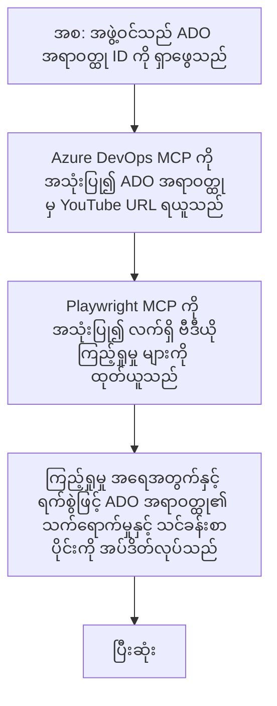

# နှိပ်စက်ဖြေရှင်းချက်: YouTube ဒေတာမှ MCP ဖြင့် Azure DevOps ပစ္စည်းများပြုပြင်ခြင်း

> **ကြေငြာချက်:** YouTube ကဲ့သို့သော ပလက်ဖောင်းများမှဒေတာဖြင့် Azure DevOps ပစ္စည်းများကို အချက်အလက်များကို အလိုအလျောက်ပြုပြင်ပေးနိုင်သော လက်ရှိ အွန်လိုင်းကိရိယာများနှင့်အစီရင်ခံစာများ ရှိပါသည်။ အောက်ပါအခြေအနေမှာ MCP ကိရိယာများကို စက်ရုပ်လက်ဖြင့်လုပ်ငန်းများနှင့် ပေါင်းစပ်ခြင်းအတွက် နမူနာအသုံးပြုမှုကို ရှင်းလင်းဖော်ပြရန်သာဖြစ်ပါသည်။

## အနှစ်ချုပ်

ဤနှိပ်စက်ဖြေရှင်းချက်သည် Model Context Protocol (MCP) နှင့် ၎င်း၏ကိရိယာများကို အသုံးပြုပြီး Azure DevOps (ADO) ၏အလုပ်ပစ္စည်းများကို ဥပမာ YouTube ကဲ့သို့သော အွန်လိုင်းပလက်ဖောင်းများမှ ရရှိသောအချက်အလက်များဖြင့် အလိုအလျောက်အပ်ဒိတ်လုပ်နိုင်ခြင်းကို ပြသသည်။ ဖော်ပြထားသော အခြေအနေမှာ MCP ကိရိယာများ၏ကျယ်ပြန့်သည့်စွမ်းဆောင်ရည်များထဲမှ တစ်ရပ်ဖြစ်ပြီး အခြားအလိုအလျောက်လုပ်ငန်းလိုအပ်ချက်များတွင်လည်း ကိုက်ညီစွာ အသုံးပြုနိုင်သည်။

ဤဥပမာတွင် Advocate တစ်ဦးသည် ADO ပစ္စည်းများဖြင့် အွန်လိုင်း ဆွေးနွေးပွဲများကို အထောက်အထားနောက်ခံထားပြီး အဆိုပါပစ္စည်းတိုင်းတွင် YouTube ဗီဒီယို URL ပါဝင်သည်။ MCP ကိရိယာများကို အသုံးပြုခြင်းဖြင့် Advocate သည် ADO ပစ္စည်းများကို နောက်ဆုံးဗီဒီယိုမြင်ကွင်းရေများနှင့်အတူ အဆိုပါအချက်အလက်များကို အလိုအလျောက် ပြန်လည်အသစ် ပြင်ဆင်နိုင်သည်။ ဤနည်းလမ်းကို ဤအတိုင်း အခြားအွန်လိုင်းအရင်းအမြစ်များမှအချက်အလက်များကို ADO သို့မဟုတ် အခြားစနစ်များနှင့် ပေါင်းစပ်ရန်ကျယ်ပြန့်စွာအသုံးပြုနိုင်သည်။

## အခြေအနေ

Advocate တစ်ဦးသည် အွန်လိုင်း ဆွေးနွေးပွဲများနှင့် လူမှုအသိုက်အဝန်း ဆက်ဆံရေးများ၏ သက်ရောက်မှုကို နောက်ကြောင်းတစ်ဆင့် စောင့်ကြည့် ထိန်းသိမ်းရန်တာဝန်ရှိသည်။ ဆွေးနွေးပွဲတိုင်းကို 'DevRel' project ၏ ADO အလုပ်ပစ္စည်းအဖြစ် မှတ်တမ်းတင်ပြီး၊ အလုပ်ပစ္စည်းတွင် YouTube ဗီဒီယို URL အတွက် ကွက်မျက်ပါရှိသည်။ ဆွေးနွေးပွဲ၏ သက်ရောက်မှုကို တိကျစွာအစီရင်ခံရန် Advocate သည် ဗီဒီယို မြင်ကွင်းရေ အရေအတွက်နှင့် ဤအချက်အလက်ရယူသည့်ရက်စွဲကို ADO ပစ္စည်းတွင် အပ်ဒိတ်လုပ်ရန်လိုအပ်သည်။

## အသုံးပြုသော ကိရိယာများ

- [Azure DevOps MCP](https://github.com/microsoft/azure-devops-mcp): MCP နှင့် ADO အလုပ်ပစ္စည်းများသို့ အစီအစဉ်ပိုင်းဖြင့် ဝင်ရောက်ပြင်ဆင်ခွင့် ပေးသည်။
- [Playwright MCP](https://github.com/microsoft/playwright-mcp): Web စာမျက်နှာများမှ တိုက်ရိုက် ဒေတာထုတ်ယူရန် ကြည့်ရှုသူများလုပ်ဆောင်ချက်များကို စက်ရုပ်ဖြင့် အလိုအလျောက်ပြုလုပ်သည်။

## အဆင့်ဆင့် လုပ်ငန်းစဉ်

1. **ADO ပစ္စည်းများသတ်မှတ်ခြင်း**: 'DevRel' project တွင် ADO အလုပ်ပစ္စည်း ID (ဥပမာ 1234) ဖြင့် စတင်ရန်။
2. **YouTube URL ရယူခြင်း**: Azure DevOps MCP ကိရိယာကို အသုံးပြုပြီး အလုပ်ပစ္စည်းမှ YouTube URL ကို ရယူပါ။
3. **ဗီဒီယို မြင်ကွင်းရေ ထုတ်ယူခြင်း**: Playwright MCP ကိရိယာကို အသုံးပြုပြီး YouTube URL သို့ သွား၍ လက်ရှိ မြင်ကွင်းရေကို ထုတ်ယူပါ။
4. **ADO ပစ္စည်းအပ်ဒိတ်လုပ်ခြင်း**: Azure DevOps MCP ကိရိယာဖြင့် 'Impact and Learnings' အပိုင်းတွင် နောက်ဆုံးမြင်ကွင်းရေ နှင့် ရယူသည့်ရက်စွဲကို ရေးထည့်ပါ။

## ဥပမာ Prompt

```bash
- Work with the ADO Item ID: 1234
- The project is '2025-Awesome'
- Get the YouTube URL for the ADO item
- Use Playwright to get the current views from the YouTube video
- Update the ADO item with the current video views and the updated date of the information
```

## Mermaid Flowchart


## နည်းပညာဆိုင်ရာ အကောင်အထည်ဖော်ခြင်း

- **MCP စီမံခန့်ခွဲမှု**: MCP ဆာဗာတစ်ခုက Azure DevOps MCP နှင့် Playwright MCP ကိရိယာများအသုံးပြုပြီး စနစ်တကျ ‌ညှိနှိုင်းမှု ပြုလုပ်ပါသည်။
- **အလိုအလျောက်လုပ်ငန်းဆောင်တာ**: လက်ဖြင့် သို့မဟုတ် အစီအစဉ်ချထားသော အချိန်များတွင် ထပ်မံ ဆောင်ရွက်ရန် ဖန်တီးနိုင်ပါသည်။
- **တွဲဖက်အမျိုးမျိုးဖြန့်ချိခြင်း**: အွန်လိုင်းမာတိကာများ (ဥပမာ Like များ၊ မှတ်ချက်များ) သို့မဟုတ် အခြားပလက်ဖောင်းများမှ ADO ပစ္စည်းများကို အပ်ဒိတ်လုပ်တာဝန် ထပ်မံ တိုးချဲ့နိုင်သည်။

## ရလဒ်နှင့် သက်ရောက်မှု

- **ထိရောက်မှု**: Advocate များအတွက် ဗီဒီယိုအချက်အလက်များကို ရယူခြင်းနှင့် အပ်ဒိတ်လုပ်ခြင်းတို့ကို စက်ရုပ်ဖြင့် လျှော့ချသည်။
- **တိကျမှု**: ADO ပစ္စည်းများတွင် အွန်လိုင်းအရင်းအမြစ်များမှ နောက်ဆုံးပေါ်ဒေတာများကို တိကျစွာ ဖော်ပြထားသည်။
- **ထပ်မံအသုံးပြုနိုင်မှု**: အခြားအချက်အလက် ရင်းမြစ်များ သို့မဟုတ်မာတိကာများ ပါသည့် ဆင့်ပါတ်အခြေအနေများအတွက် ထပ်မံအသုံးပြုနိုင်သည်။

## ကိုးကားချက်များ

- [Azure DevOps MCP](https://github.com/microsoft/azure-devops-mcp)
- [Playwright MCP](https://github.com/microsoft/playwright-mcp)
- [Model Context Protocol (MCP)](https://modelcontextprotocol.io/)

## နောက်တစ်ချက်

- ပြန်သွားရန်: [Case Studies Overview](./README.md)
- နောက်တော်: [Real-Time Documentation Retrieval with MCP](./docs-mcp/README.md)

---

<!-- CO-OP TRANSLATOR DISCLAIMER START -->
**တားမြစ်ချက်**  
ဒီစာရွက်စာတမ်းကို AI ဘာသာပြန်ဝန်ဆောင်မှုဖြစ်တဲ့ [Co-op Translator](https://github.com/Azure/co-op-translator) အသုံးပြုပြီး ဘာသာပြန်ထားတာဖြစ်ပါတယ်။ ကျွန်တော်တို့ အသေးစိတ်မှန်ကန်မှုအတွက် ကြိုးပမ်းနေခဲ့ပေမယ့် အော်တိုဘာသာပြန်မှုမှာ အမှားများ သို့မဟုတ် မှားယွင်းမှုများ ပါဝင်နိုင်ပါတယ်ဆိုတာကို သတိပြုပါ။ မူလစာရွက်စာတမ်းသည် မူရင်းဘာသာဖြင့် အတည်ပြုရမည့် အတိုင်ပင်ခံ အရင်းအမြစ်ဖြစ်သည်။ အရေးပါသောအချက်အလက်များအတွက် မဟာဇာတ်နည်းကျ လူသားဘာသာပြန်ခြင်းကို အကြံပြုပါသည်။ ဤဘာသာပြန်ချက်ကို အသုံးပြုခြင်းကြောင့် ဖြစ်ပေါ်နိုင်သည့် နားမလည်မှုများ သို့မဟုတ် မှားယွင်းဖတ်ရှုမှုများအတွက် ကျွန်တော်တို့တာဝန်ယူမထားပါ။
<!-- CO-OP TRANSLATOR DISCLAIMER END -->