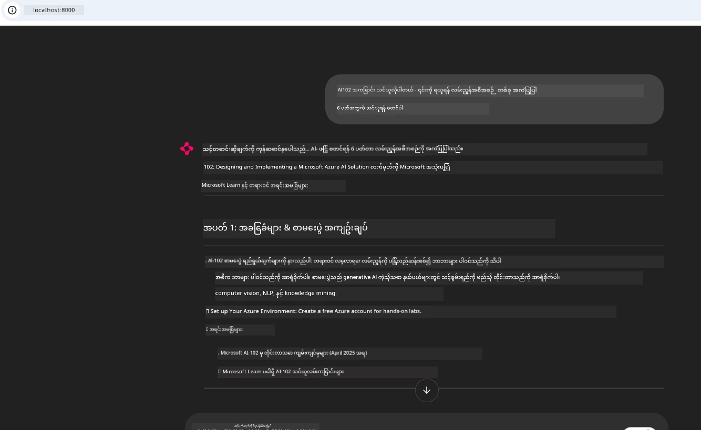
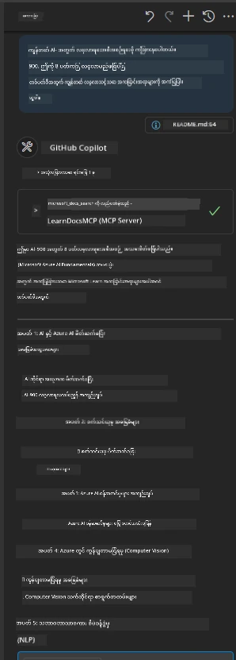

# အမှုလေ့လာမှု - Client မှ Microsoft Learn Docs MCP ဆာဗာနှင့် ချိတ်ဆက်ခြင်း

သင်သည် ကိုဒ်ထဲရှိ ပြဿနာတစ်ခုကိုဖြေရှင်းရာတွင် စာတမ်းများဆိုဒ်များ၊ Stack Overflow နှင့် ရှာဖွေမှုအင်ဂျင် တဘ်များကြား စပ်ဆက်ရင်း တွန်းလှန်တူးနေခဲ့ဖူးပါသလား? သင့်တွင် စာတမ်းများအတွက် ဒုတိယ မော်နီတာတစ်လုံးရှိနေတတ်ပါသလား၊ သို့မဟုတ် သင့် IDE နှင့် ဘရောက်ဇာအကြား အဲလ့်(Alt) + တက်(Tab) ဖြင့် စဉ်ဆက်မပြတ် ပြောင်းလဲနေတတ်ပါသလား။ စာတမ်းများကို သင့်ရဲ့လုပ်ဆောင်မှုစဉ်အတွင်း လိုက်ထည့်နိုင်ခဲ့ရင် ပိုမိုကောင်းမွန်မည် မဟုတ်သလားရှိတာစဉ်းစားပါ။ သင့်အက်ပ်များ၊ IDE သို့မဟုတ် ကိုယ်ပိုင် ကိရိယာများထဲတွင် ပေါင်းစည်းထားနိုင်မည်။ ဒီအမှုလေ့လာမှုတွင် ကျွန်ုပ်တို့ သင်၏ကိုယ်ပိုင် client application မှ Microsoft Learn Docs MCP ဆာဗာကို တိုက်ရိုက် ချိတ်ဆက်ခြင်းအား အသုံးပြု၍ အတိအကျ ပြသပါမည်။

## အနှစ်ချုပ်

ခေတ်မီ ဖွံ့ဖြိုးတိုးတက်ရေးဆိုသည်မှာ ကိုဒ်ရေးခြင်းထက်ပိုပြီး သင့်အချိန်မှာ မှန်ကန်သော အချက်အလက်ကို ရှာဖွေခြင်းဖြစ်သည်။ စာတမ်းများသည် နေရာတိုင်းတွင် ရှိသော်လည်း မကြာခဏ သင်လိုအပ်သော နေရာတွင် မရှိပါ: သင့်ကိရိယာများနှင့် လုပ်ငန်းစဉ်များအတွင်း။ စာတမ်းများ ရယူရေးကို သင့်အက်ပ်များထဲ တိုက်ရိုက်ပေါင်းစည်းခြင်းဖြင့် အချိန်ကိုသက်သာစေပြီး စိတ်ဝင်စားမှု ပြောင်းလဲခြင်းကို လျော့ပါးစေပြီး ထုတ်လုပ်မှုမြှင့်တင်နိုင်သည်။ ဤအပိုင်းတွင် ကျွန်ုပ်တို့ သင့် client ကို Microsoft Learn Docs MCP ဆာဗာနှင့် ချိတ်ဆက်ခြင်း၊ အချိန်နှင့်တပြေးညီ ကြောင်းဆက် (streaming) ဖြင့် data ရယူခြင်းကို ပြသပေးပါမည်၊ သင့်အက်ပ်မှ ထွက်ခွာစရာမလိုဘဲ ဖတ်ရှုနိုင်ပါသည်။

ချိတ်ဆက်ခြင်း မတည်ဆောက်ခြင်း၊ တောင်းဆိုမှုပို့ခြင်းနှင့် ကြောင်းဆက်ဖြေကြားချက်များကို ထိရောက်စွာ ကိုင်တွယ်ခြင်း စသည်တို့ကို လမ်းညွှန်ပါမည်။ ဤနည်းလမ်းသည် လုပ်ငန်းစဉ်ကို ပိုမိုချောမွေ့စေပြီး ပိုမို စမတ်နည်းပညာရှိသော developer ကိရိယာများ ဖန်တီးနိုင်ခြင်းကို ဖြစ်စေပါသည်။

## သင်ယူမှာဖြစ်သော ယနေ့ရလဒ်များ

ဘာကြောင့် ဒီကို လုပ်နေသလဲ? အကောင်းဆုံး developer အတွေ့အကြုံများသည် အတားအဆီးများကို ဖယ်ရှားပေးသည့် အတွေ့အကြုံများ ဖြစ်ပါသည်။ သင့်ရဲ့ code editor၊ chatbot သို့မဟုတ် web app မှ Microsoft Learn ၏ နောက်ဆုံးထွက်မူရင်းအကြောင်းအရာကို အသုံးပြုပြီး ဖတ်ရှုပြောကြားချက်များကို ချက်ချင်း ဖြေဆိုပေးနိုင်သည့် ကမ္ဘာကြီးကို စိတ်ကူးပါ။ ဤအခေါက်အထိ သင် သုတေသနလုပ်ပြီး ကျွမ်းကျင်သောဖြစ်ရန် - 

- Documentation ၏ MCP server-client ဆက်သွယ်မှု အခြေခံ နားလည်နိုင်ရန်
- Microsoft Learn Docs MCP ဆာဗာနှင့် ချိတ်ဆက်သော console သို့မဟုတ် web application တည်ဆောက်နိုင်ရန်
- အချိန်နှင့်တပြေးညီ documentation ရယူရန် streaming HTTP client အသုံးပြုနည်း
- သင့်အက်ပ်တွင် documentation ဖြေကြားချက်များ မှတ်တမ်းတင်ခြင်း နှင့် နားလည်ခြင်း

ဤကျွမ်းကျင်မှုများဖြင့် ပြန်လည်တုံ့ပြန် မဟုတ်ဘဲ အပြန်အလှန်နှင့် context-aware ဖြစ်သော ကိရိယာများ ပိုမိုတိုးတက်စေရန် အကူအညီပြုနိုင်ပါမည်။

## အခြေအနေ ၁ - MCP ဖြင့် အချိန်နှင့်တပြေးညီ Documentation ရယူခြင်း

ဤအခြေအနေတွင် ကျွန်ုပ်တို့ သင့် client ကို Microsoft Learn Docs MCP ဆာဗာနှင့် ချိတ်ဆက်၍ မည်သည့်အက်ပ်မှထွက်ခွာစရာမလိုဘဲ တိကျသော အချိန်နှင့် အသုံးပြုမှုအခြေအနေ ကိုင်တွယ်ထားသော စာတမ်းများကို သုံးစွဲနိုင်ခြင်းကို ပြပါမည်။

ယခု လက်တွေ့ကျကျလုပ်ဆောင်ကြရအောင်။ သင်၏တာဝန်မှာ Microsoft Learn Docs MCP ဆာဗာနှင့် ချိတ်ဆက်၍ `microsoft_docs_search` ကိရိယာကို တောင်းဆိုကာ ကြောင်းဆက်ဖြင့် ရရှိသော ပြန်လည်ဖြေကြားချက်ကို console တွင် မှတ်တမ်းတင်ပေးသည့် အက်ပ်ရေးသားခြင်းဖြစ်သည်။

### ဘာကြောင့် ဒီနည်းလမ်းကို နှစ်သက်သလဲ?  
ဒါကြောင့် အသွင်ကူးလွယ်ကူသော ပေါင်းစည်းမှုများ တည်ဆောက်ရန် အခြေခံဖြစ်ပါသည်- chatbot, IDE extension သို့မဟုတ် web dashboard အရာခုတစ်ခုကို တည်ဆောက်လိုပါကဖြစ်ပါသည်။

ဤအခြေအနေအတွက် code နှင့် လမ်းညွှန်ချက်များသည် ဤအမှုလေ့လာမှု အတွင်းရှိ [`solution`](./solution/README.md) ဖိုလ်ဒါတွင်ရှိသည်။ အဆင့်များမှာ ချိတ်ဆက်မှုတည်ဆောက်ခြင်းကို လမ်းပန်းညွှန်ပါသည် -  
- တရားဝင် MCP SDK နှင့် streamable HTTP client အသုံးပြု၍ ချိတ်ဆက်ခြင်း  
- `microsoft_docs_search` ကိရိယာကို query parameter ဖြင့် ခေါ်ယူကာ စာတမ်းများ ရယူခြင်း  
- မှန်ကန်သော မှတ်တမ်းတင်ခြင်း နှင့် အမှားကိုင်တွယ်ခြင်း  
- အသုံးပြုသူများ အတွက် အပြန်အလှန် console အင်တာဖေ့စ် ဖန်တီးခြင်း (search query များစွာ ထည့်သွင်းနိုင်ရန်)

ဤအခြေအနေသည် ပြသပါသည် -  
- Docs MCP ဆာဗာနှင့် ချိတ်ဆက်ခြင်း  
- query တစ်ခု ပို့ခြင်း  
- ရလဒ်များကို ခွဲခြမ်းစိတ်ဖြာ၊ စာတမ်းထုတ်ပြခြင်း

ဖြေရှင်းချက်ကို run ကြည့်ပါက - 

```
Prompt> What is Azure Key Vault?
Answer> Azure Key Vault is a cloud service for securely storing and accessing secrets. ...
```
  
အောက်တွင် နမူနာ ပုံစံဖြစ်သော ရိုးရှင်းသော ဖြေရှင်းချက်ပါရှိသည်။ မူလ code အပြည့်အစုံနှင့် အသေးစိတ်ဖော်ပြချက်များကို ဖြေရှင်းချက် ဖိုလ်ဒါတွင် တွေ့နိုင်ပါသည်။

<details>
<summary>Python</summary>

```python
import asyncio
from mcp.client.streamable_http import streamablehttp_client
from mcp import ClientSession

async def main():
    async with streamablehttp_client("https://learn.microsoft.com/api/mcp") as (read_stream, write_stream, _):
        async with ClientSession(read_stream, write_stream) as session:
            await session.initialize()
            result = await session.call_tool("microsoft_docs_search", {"query": "Azure Functions best practices"})
            print(result.content)

if __name__ == "__main__":
    asyncio.run(main())
```
  
- ပြည့်စုံသော အကောင်အထည်ဖော်မှုနှင့် မှတ်တမ်းတင်ခြင်းအတွက် [`scenario1.py`](../../../../09-CaseStudy/docs-mcp/solution/python/scenario1.py) ကို ကြည့်ပါ။  
- တပ်ဆင်ခြင်းနှင့် အသုံးပြုနည်းလမ်းညွှန်ချက်များအတွက် [`README.md`](./solution/python/README.md) ဖိုင်ကို ကြည့်ပါ။
</details>

## အခြေအနေ ၂ - MCP ဖြင့် အပြန်အလှန် ကျောင်းလေ့လာမှုအစီအစဉ် ပြုလုပ်နိုင်သော Web App

ဤအခြေအနေတွင် Docs MCP ကို web ဖွံ့ဖြိုးရေး စီမံကိန်းထဲ ပေါင်းစည်းနည်းလေ့လာမည်ဖြစ်သည်။ ရည်ရွယ်ချက်မှာ အသုံးပြုသူများကို Microsoft Learn စာတမ်းများကို တိုက်ရိုက် ရှာဖွေရန် ဆာဗာပါရှိသည့် web အင်တာဖေ့စ်မှ ရယူနိုင်ရန် ဖြစ်သည်၊ ထိုသို့ဖြင့် စာတမ်းများကို app သို့မဟုတ် ကိုယ့်ရဲ့ဆိုက်ထဲတွင် ခြုံငုံကြည့်ရှုနိုင်သည်။

သင်သည် ပြသချက်အဖြစ် သင်ယူပါမည် -  
- Web app တည်ဆောက်ခြင်း  
- Docs MCP ဆာဗာနှင့် ချိတ်ဆက်ခြင်း  
- အသုံးပြုသူ input ကိုင်တွယ်ပြီး ရလဒ်ပြခြင်း  

ဖြေရှင်းချက် run ကြည့်ပါက - 

```
User> I want to learn about AI102 - so suggest the roadmap to get it started from learn for 6 weeks

Assistant> Here’s a detailed 6-week roadmap to start your preparation for the AI-102: Designing and Implementing a Microsoft Azure AI Solution certification, using official Microsoft resources and focusing on exam skills areas:

---
## Week 1: Introduction & Fundamentals
- **Understand the Exam**: Review the [AI-102 exam skills outline](https://learn.microsoft.com/en-us/credentials/certifications/exams/ai-102/).
- **Set up Azure**: Sign up for a free Azure account if you don't have one.
- **Learning Path**: [Introduction to Azure AI services](https://learn.microsoft.com/en-us/training/modules/intro-to-azure-ai/)
- **Focus**: Get familiar with Azure portal, AI capabilities, and necessary tools.

....more weeks of the roadmap...

Let me know if you want module-specific recommendations or need more customized weekly tasks!
```
  
အောက်တွင် နမူနာဖြစ်သော ရိုးရှင်းဆုံး ဖြေရှင်းချက်ရှိသည်။ မူလ code နှင့် အသေးစိတ်ကို solution folder တွင် ရှိသည်။



<details>
<summary>Python (Chainlit)</summary>

Chainlit သည် ဆက်ဆံရေး AI web app ဖန်တီးရန် framework ဖြစ်သည်။ MCP ကိရိယာများကို ခေါ်ယူ၍ ရလဒ်များကို အချိန်နှင့်တပြေးညီ ပြသနိုင်သော အပြန်အလှန် chatbot များနှင့် সহသူများ ဖန်တီးရန် လွယ်ကူစေသည်။ ၎င်းသည် လျင်မြန်စွာ prototype လုပ်ခြင်းနှင့် အသုံးပြုသူ စိတ်တိုင်းကျ အင်တာဖေ့စ်များအတွက် ဉီးစားပေးဖြစ်သည်။

```python
import chainlit as cl
import requests

MCP_URL = "https://learn.microsoft.com/api/mcp"

@cl.on_message
def handle_message(message):
    query = {"question": message}
    response = requests.post(MCP_URL, json=query)
    if response.ok:
        result = response.json()
        cl.Message(content=result.get("answer", "No answer found.")).send()
    else:
        cl.Message(content="Error: " + response.text).send()
```
  
- ပြည့်စုံသော အကောင်အထည်ဖော်မှုအတွက် [`scenario2.py`](../../../../09-CaseStudy/docs-mcp/solution/python/scenario2.py) ကို ကြည့်ပါ။  
- စတင်တပ်ဆင်ခြင်းနှင့် run လုပ်ချက်လမ်းညွှန်အတွက် [`README.md`](./solution/python/README.md) ကို ကြည့်ပါ။
</details>

## အခြေအနေ ၃ - VS Code တွင် MCP ဆာဗာဖြင့် အတွင်းရေးသားသူ စာတမ်းများ

သင်သည် Microsoft Learn Docs ကို သင့် VS Code အတွင်းတွင် တိုက်ရိုက်ရယူလိုပါက (ဘရောက်ဇာတဘ် ပွင့်ထားရန် မလိုပါ) MCP ဆာဗာကို ကိုယ်ရေးသားသူတွင် အသုံးပြုနိုင်သည်။ ဤနည်းလမ်းဖြင့် -  
- သင့် coding ပတ်ဝန်းကျင်မှ မထွက်ဘဲ VS Code တွင် စာတမ်းများ ရှာဖွေဖတ်ရှုနိုင်သည်  
- README သို့မဟုတ် သင်ခန်းစာဖိုင်များတွင် တိုက်ရိုက် ကိုးကားပြု၍ လင့်ခ်ထည့်သွင်းနိုင်သည်  
- GitHub Copilot နှင့် MCP ကို ပေါင်းစပ်၍ AI အာဏာပြည့် documentation workflow ကို ခံစားနိုင်သည်  

**သင်သည် ဘယ်လိုလုပ်ရမည်ဆိုတာတွေ့ရမည်** -  
- သင့်ဝက်ခ်စပေ့စ် အမြစ်တွင် လက်ခံနိုင်သော `.vscode/mcp.json` ဖိုင် တစ်ခု ထည့်သွင်းခြင်း (အောက်တွင် ဥပမာ)  
- MCP ပန်းနယ် သို့မဟုတ် VS Code command palette အသုံးပြု၍ စာတမ်းများ ရှာဖွေ၍ ထည့်သွင်းခြင်း  
- markdown ဖိုင်များတွင် တိုက်ရိုက် ကိုးကားခြင်း  
- GitHub Copilot နှင့် ပေါင်းထားပြီး ထူးခြားသော ထုတ်လုပ်မှု မြှင့်တင်ခြင်း  

VS Code တွင် MCP ဆာဗာ တပ်ဆင်နည်း ဥပမာမှာ -

```json
{
  "servers": {
    "LearnDocsMCP": {
      "url": "https://learn.microsoft.com/api/mcp"
    }
  }
}
```
  
</details>

> ဆက်လက်လေ့လာမှုအတွက် screenshot များနှင့် လမ်းညွှန်ချက်တွဲသည့် အသေးစိတ် ယူနစ်ကို [`README.md`](./solution/scenario3/README.md) တွင် ကြည့်ရှုနိုင်ပါသည်။



ဤနည်းလမ်းသည် နည်းပညာသင်တန်းများ ဖန်တီးသူ၊ စာတမ်းရေးသူ သို့မဟုတ် အကြိမ်ကြိမ် ကိုးကားမှုလိုအပ်သည့် ကိရိယာ ဖန်တီးသူများအတွက် အထူးသင့်တော်ပါသည်။

## အဓိက အချက်များ

စာတမ်းများကို တိုက်ရိုက် သင့်ကိရိယာထဲတွင် ထည့်သွင်းခြင်းသည် အဆင်ပြေမှုသာမက ထုတ်လုပ်မှုအတွက် အရေးပါသောအပြောင်းအလဲ ဖြစ်သည်။ Microsoft Learn Docs MCP ဆာဗာမှ သင့် client မှ ချိတ်ဆက်ခြင်းဖြင့် -  

- သင့် code နှင့် စာတမ်းများအကြား စိတ်ဝင်စားမှု ပြောင်းလဲမှုကို ဖယ်ရှားနိုင်သည်  
- အချိန်နှင့်တပြေးညီ မူလ အချက်အလက်နှင့် context တစ်ခုလုံးကို ရယူနိုင်သည်  
- ပိုမို စမတ်နှင့် အပြန်အလှန်ရှိသော developer tools ဖန်တီးနိုင်သည်  

ဤကျွမ်းကျင်မှုများသည် နားလည်မှု ကောင်းမွန်သော၊ အသုံးပြုရလွယ်ကူသော ဖြေရှင်းချက်များ ဖန်တီးရာတွင် အထောက်အကူပြုပါသည်။

## နောက်ထပ် အရင်းအမြစ်များ

နားလည်မှုကို စိတ်ဝင်စားသေချာရန် အောက်ပါ တရားဝင် အရင်းအမြစ်များကို လေ့လာနိုင်ပါသည်-

- [Microsoft Learn Docs MCP Server (GitHub)](https://github.com/MicrosoftDocs/mcp)  
- [Get started with Azure MCP Server (mcp-python)](https://learn.microsoft.com/en-us/azure/developer/azure-mcp-server/get-started#create-the-python-app)  
- [What is the Azure MCP Server?](https://learn.microsoft.com/en-us/azure/developer/azure-mcp-server/)  
- [Model Context Protocol (MCP) Introduction](https://modelcontextprotocol.io/introduction)  
- [Add plugins from a MCP Server (Python)](https://learn.microsoft.com/en-us/semantic-kernel/concepts/plugins/adding-mcp-plugins)  

## နောက်ဆုံးတွင်

- ပြန်သွားရန် - [Case Studies Overview](../README.md)  
- ဆက်လက်ရန် - [Module 10: Streamlining AI Workflows with AI Toolkit](../../10-StreamliningAIWorkflowsBuildingAnMCPServerWithAIToolkit/README.md)

---

<!-- CO-OP TRANSLATOR DISCLAIMER START -->
**နောက်ဆက်တွေ့ မှတ်ချက်**  
ဤစာတမ်းအား AI ဘာသာပြန်ဝန်ဆောင်မှုဖြစ်သည့် [Co-op Translator](https://github.com/Azure/co-op-translator) ကို အသုံးပြု၍ ဘာသာပြန်ထားပါသည်။ ကျွန်ုပ်တို့သည် တိကျမှန်ကန်မှုအတွက် ကြိုးပမ်းနေခဲ့သော်လည်း၊ စက်ရုပ်ဘာသာပြန်ခြင်းမှ ဖြစ်ပေါ်နိုင်သည့် အမှားများ သို့မဟုတ် မှားယွင်းမှုများ ရှိနိုင်ကြောင်း သတိပြုပါရန် မေတ္တာရပ်ခံအပ်ပါသည်။ မူရင်းစာတမ်းကို သက်ဆိုင်ရာ မူလဘာသာဖြင့်သာ တရားဝင်အချက်အလက်အရင်းအမြစ်အဖြစ် တွက်ချက်သင့်ပါသည်။ အရေးပါတဲ့အချက်အလက်များအတွက် သာမန်လူသား ပရော်ဖက်ရှင်နယ် ဘာသာပြန်ခြင်းကို အကြံပြုပါသည်။ ဤဘာသာပြန်ချက်ကို အသုံးပြုမှုကြောင့်ဖြစ်ပေါ်နိုင်သည့် နားလည်မှုမှားယွင်းမှုများ သို့မဟုတ် မှားဖတ်လွဲမှုများအတွက် ကျွန်ုပ်တို့သည် တာဝန်မယူပါ။
<!-- CO-OP TRANSLATOR DISCLAIMER END -->