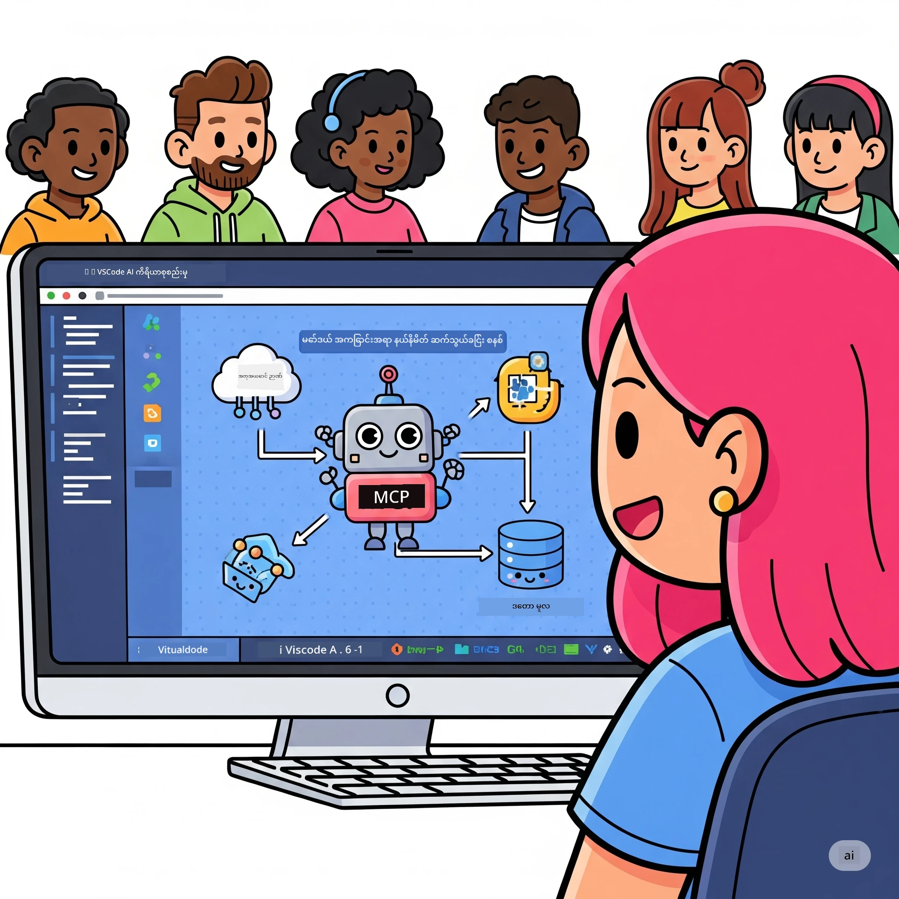
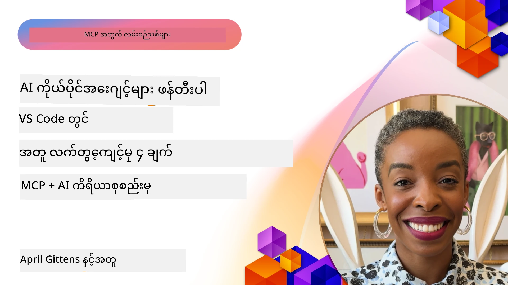

# AI လုပ်ငန်းစဉ်များကို ရိုးရှင်းတင်းကျစေခြင်း: AI Toolkit ဖြင့် MCP ဆာဗာ တည်ဆောက်ခြင်း

## 🎯 အခြေခံἄပေါ်အား

_(ဤမှတ်စု၏ဗီဒီယိုကိုကြည့်ရန် အပေါ်ဓာတ်ပုံကိုနှိပ်ပါ)_

**Model Context Protocol (MCP) Workshop** သို့ ကြိုဆိုပါသည်! ဤလက်တွေ့အလုပ်ရုံဆွေးနွေးပွဲသည် AI အက်ပ်လီကေးရှင်းဖန်တီးမှုကို ပြောင်းလဲပေးမည့် နောက်ဆုံးပေါ်နည်းပညာနှစ်ခုကို ပေါင်းစပ်ထားပါသည်-

- **🔗 Model Context Protocol (MCP)**: AI ကိရိယာများနှင့် ပေါင်းသင်းမှုအတွက် အဆင်ပြေလွယ်ကူသော အဆက်အသွယ်ပုံစံဖော်ပြမှု
- **🛠️ AI Toolkit for Visual Studio Code (AITK)**: Microsoft ၏ အင်အားကြီး AI ဖန်တီးမှုတိုးချဲ့မှု

### 🎓 သင်တန်းဝင်များအတွက် လေ့လာသင်ယူနိုင်မည့်အရာများ

ဤအလုပ်ရုံဆွေးနွေးပွဲပြီးဆုံးသောအချိန်တွင် သင်သည် AI မော်ဒယ်များကို လက်တွေ့ကိရိယာများနှင့် ဝန်ဆောင်မှုများနှင့် ဖက်စပ်၍ ထူးခြားသော အက်ပ်များကို တည်ဆောက်နိုင်ပါမည်။ အလိုအလျောက် စမ်းသပ်မှုမှ စ၍ ကိုယ်တိုင်ထုတ် API ပေါင်းစည်းမှုများအထိ ရရှိနိုင်မည့် ဆော့ဖ်ဝဲလ်ကိရိယာများကို လေ့လာပါမည်။

## 🏗️ နည်းပညာ များ

### 🔌 Model Context Protocol (MCP)

MCP သည် **"USB-C အတူတူ AI အတွက်"** ဖြစ်ပြီး AI မော်ဒယ်များကို ပြင်ပကိရိယာများနှင့် ဒေတာရင်းမြစ်များနှင့် ချိတ်ဆက်ပေးသည့် တစ်ခုတည်းသော စံမြတ် အဆက်အသွယ်ဖြစ်သည်။

**✨ အဓိကအင်္ဂါရပ်များ:**

- 🔄 **စံအဆက်အသွယ် ပေါင်းစည်းမှု**: AI ကိရိယာများနှင့် ချိတ်ဆက်ရန် စံသတ်မှတ်ထားသော အင်တာဖေ့စ်
- 🏛️ **တှေ့ပြန်နိုင်သော ဖွဲ့စည်းပုံ**: stdio/SSE ပို့ဆောင်မှု အသုံးပြုကာ ဒေသীয়နှင့် အဝေးဆာဗာများ
- 🧰 **စုံလင်သော စနစ်ပတ်ဝန်းကျင်**: ကိရိယာများ၊ ပြုစုမှု၊ အရင်းအမြစ်များ စုပေါင်းထားခြင်း
- 🔒 **စက်မှု လိုအပ်ချက်များနှင့် ကိုက်ညီမှု**: လုံခြုံရေးနှင့် ယုံကြည်စိတ်ချရမှု

**🎯 MCP ထူးခြားချက်:**
USB-C ကေဘယ်ဂျာရွေ့လျားမှု ပြဿနာများကို ဖြေရှင်းလိုက်သလို MCP က AI ပေါင်းစည်းမှု အားလုံးကို ရိုးရှင်းစေသည်။ Protocol တစ်ခုတည်းနဲ့ အခွင့်အလမ်း များစွာဖြစ်တည်နိုင်ပါသည်။

### 🤖 AI Toolkit for Visual Studio Code (AITK)

Microsoft ၏ ဦးဆောင် AI ဖန်တီးရေး တိုးချဲ့မှုဖြစ်ပြီး VS Code ကို AI ပါဝါရည်မြှင့်ပေးသော စနစ်တစ်ခုဖြစ်သည်။

**🚀 အဓိက စွမ်းဆောင်ရည်များ:**

- 📦 **မော်ဒယ်စာရင်း**: Azure AI, GitHub, Hugging Face, Ollama မှ မော်ဒယ်များ ဝင်ရောက်အသုံးပြုနိုင်မှု
- ⚡ **ဒေသတွင်း ခန့်မှန်းခြေခြင်း**: ONNX ကို အထူးထိန်းသိမ်းထားသော CPU/GPU/NPU ဖြင့် တည်ဆောင်မှု
- 🏗️ **အေးဂျင့် တည်ဆောက်သူ**: MCP ပေါင်းစည်းမှုဖြင့် ရုပ်ပိုင်းဆိုင်ရာ AI အေးဂျင့်ဖန်တီးမှု
- 🎭 **အမျိုးမျိုးမော်ဒယ်**: စာသား၊ မြင်ကွင်းနှင့် ဖွဲ့စည်းတည်ဆောက်မှုပေးခြင်း ထောက်ပံ့မှု

**💡 ဖန်တီးမှု အကျိုးကျေးဇူးများ:**

- မော်ဒယ် မလိုက်ရွေး တပ်ဆင်နိုင်မှု
- အမြင်ရှု့တံတား တည်ဆောက်မှုစနစ်
- ပွဲနက်အချိန် စမ်းသပ်မှု မြှင့်တင်ရေး
- MCP ဆာဗာနှင့် အဆက်မပြတ်ပေါင်းစည်းမှု

## 📚 သင်ယူစဉ်

### [🚀 Module 1: AI Toolkit အခြေခံများ](./lab1/README.md)

**ကြာမြင့်ချိန်**: 15 မိနစ်

- 🛠️ VS Code အတွက် AI Toolkit တပ်ဆင် ပြင်ဆင်ခြင်း
- 🗂️ မော်ဒယ်စာရင်း (GitHub, ONNX, OpenAI, Anthropic, Google မှ မော်ဒယ် ၁၀၀+)
- 🎮 ပွဲနက် စမ်းသပ်မှု အထောက်အကူပြု အင်တာဖေ့စ် အသုံးပြုခြင်း
- 🤖 ပထမဆုံး AI အေးဂျင့် Agent Builder ဖြင့် ဖန်တီးခြင်း
- 📊 မော်ဒယ် စွမ်းဆောင်ရည်ကို Built-in သတ်မှတ်ချက်များဖြင့် အကဲဖြတ်ခြင်း (F1, သက်ဆိုင်မှု၊ ဆင်တူမှု၊ သဘောတူမှု)
- ⚡ ကျစ်လစ်သော ပုံစံအလိုက် ပြုလုပ်ခြင်းနှင့် မော်ဒယ်အမျိုးမျိုးမော်ဒယ် ထောက်ပံ့ရေး လေ့လာခြင်း

**🎯 သင်ယူ၍ရမည့် ရလဒ်**: AITK ၏စွမ်းရည်များကို အထူးပြုသော လက်တွေ့ AI အေးဂျင့် တစ်ခု ဖန်တီးနိုင်ခြင်း

### [🌐 Module 2: MCP နှင့် AI Toolkit အခြေခံများ](./lab2/README.md)

**ကြာမြင့်ချိန်**: 20 မိနစ်

- 🧠 Model Context Protocol (MCP) ၏ ဖွဲ့စည်းပုံ နှင့် အယူအဆများ လေ့လာခြင်း
- 🌐 Microsoft ၏ MCP ဆာဗာ စနစ်တွင် ရှာဖွေသင်ယူခြင်း
- 🤖 Playwright MCP ဆာဗာ အသုံးပြုကာ ဘရောက်ဇာ အော်တိုမှေးရွေးကွယ်အေးဂျင့် တည်ဆောက်ခြင်း
- 🔧 MCP ဆာဗာများကို AI Toolkit Agent Builder နှင့် ပေါင်းစည်းခြင်း
- 📊 MCP ကိရိယာများ အေးဂျင့်များအတွင်း စမ်းသပ် အတည်ပြုခြင်း
- 🚀 MCP လုပ်ဆောင်မှုပေါ်တွင် အေးဂျင့်များ တင်သွင်း၊ ထုတ်လုပ်ခြင်း

**🎯 သင်ယူ၍ရမည့် ရလဒ်**: MCP ဖြင့် ပြင်ပကိရိယာများနှင့် ပေါင်းစပ်ထားသော AI အေးဂျင့် တစ်ခု ထုတ်လုပ်နိုင်ခြင်း

### [🔧 Module 3: AI Toolkit ဖြင့် တိုးတက်သော MCP ဖန်တီးခြင်း](./lab3/README.md)

**ကြာမြင့်ချိန်**: 20 မိနစ်

- 💻 AI Toolkit ကို အသုံးပြုကာ ကိုယ်ပိုင် MCP ဆာဗာ တည်ဆောက်ခြင်း
- 🐍 MCP Python SDK (v1.9.3) ကို ပြင်ဆင် အသုံးပြုခြင်း
- 🔍 Troubleshooting အတွက် MCP Inspector ချိန်ညှိ အသုံးပြုခြင်း
- 🛠️ Weather MCP ဆာဗာ တည်ဆောက်၍ ဝါရင့် debugging လုပ်ငန်းစဉ်များ ဆောင်ရွက်ခြင်း
- 🧪 Agent Builder နှင့် Inspector ပတ်ဝန်းကျင်များတွင် MCP ဆာဗာများကို ကြားဖြတ်မှု ပြုလုပ်ခြင်း

**🎯 သင်ယူ၍ရမည့် ရလဒ်**: နောက်ဆုံးပေါ်ကိရိယာများနှင့် ကိုယ်ပိုင် MCP ဆာဗာများ ဖန်တီး၊ သေချာစွာ စစ်ဆေးပြင်ဆင်နိုင်ခြင်း

### [🐙 Module 4: လက်တွေ့ MCP တိုးတက်မှု - ကိုယ်ပိုင် GitHub Clone ဆာဗာ](./lab4/README.md)

**ကြာမြင့်ချိန်**: 30 မိနစ်

- 🏗️ အပြင်လောက GitHub Clone MCP ဆာဗာ တည်ဆောက်ခြင်း အတွက် ပုံမှန်အလုပ်စဉ်များ လုပ်ဆောင်ရန်
- 🔄 Repository cloning ဖြည့်စွက်မှုနှင့် အမှားစစ်ဆေးမှုများ ထည့်သွင်းပြုလုပ်ခြင်း
- 📁 ဉာဏ်ရည်စွမ်း directory မန်နေဂ်မင့် နှင့် VS Code ပေါင်းစပ်မှု ဖြည့်ဆည်းခြင်း
- 🤖 GitHub Copilot Agent Mode ကို ကိုယ်ပိုင် MCP ကိရိယာများဖြင့် အသုံးပြုခြင်း
- 🛡️ ထုတ်လုပ်မှုအဆင့် အတွက်ယုံကြည်စိတ်ချရမှုနှင့် platform များအကြား လိုက်ဖက်စေမှု ဖြည့်ဆည်းခြင်း

**🎯 သင်ယူ၍ရမည့် ရလဒ်**: တည်ဆောက်မှု လုပ်ငန်းစဉ်ကိုပိုမို လိမ့်ချ၊ လမ်းညွှန်ပေးနိုင်သော ထုတ်လုပ်မှုအဆင့် MCP ဆာဗာ တစ်ခု တည်ဆောက်နိုင်ခြင်း

## 💡 လက်တွေ့ အသုံးချမှုများနှင့် ထိရောက်မှု

### 🏢 စက်မှုလုပ်ငန်း အသုံးပြုပုံများ

#### 🔄 DevOps အလိုအလျောက် စနစ်

တိုးတက်သော လုပ်ငန်းစဉ်များအတွက် ဉာဏ်ရည်အသုံးပြု လုပ်ငန်းစဉ်အလိုအလျောက်ပြုလုပ်မှု-

- **Smart Repository Management**: AI အခြေခံ ကုဒ်စစ်တမ်းနှင့် ပေါင်းစပ်ခြင်း ဆုံးဖြတ်ချက်များ
- **Intelligent CI/CD**: ကိုဒ်ပြောင်းလဲမှုအခြေခံ အလိုအလျောက် pipeline တိုးတက်မှု
- **Issue Triage**: အမှားများ အလိုအလျောက် သတ်မှတ် ခွဲခြား ပေးပို့ခြင်း

#### 🧪 အရည်အသွေး အာမခံ ပြုပြင်ပြောင်းလဲမှု

AI အခြေခံ စမ်းသပ်မှု အလိုအလျောက် ပြုလုပ်မှုများ –

- **Intelligent Test Generation**: အပြည့်အစုံ စမ်းသပ်မှုအစီအစဉ်များ ကို အလိုအလျောက် ဖန်တီးခြင်း
- **Visual Regression Testing**: UI ပြောင်းလဲမှုကို AI ဖြင့် တွေ့ရှိနိုင်မှု
- **Performance Monitoring**: ပြဿနာများကို အားမပြတ် ရှာဖွေမှတ်သားခြင်းနှင့် ဖြေရှင်းခြင်း

#### 📊 ဒေတာ လည်ပတ်မှု အသိပညာ

ခိုင်မာသော ဒေတာ လုပ်ငန်းစဉ်များ တည်ဆောက်ရေး-

- **Adaptive ETL Processes**: မိမိလိုအပ်သည့်အတိုင်းဒေတာ ပြုပြင်ပြောင်းလဲမှု
- **Anomaly Detection**: Real-time ဒေတာ အရည်အသွေး ကြည့်ကောင်းစောင့်ကြည့်မှု
- **Intelligent Routing**: ဉာဏ်ရည်ကြီး data ပြေးလမ်းစီမံခန့်ခွဲမှု

#### 🎧 ဖောက်သည် အတုံ့ပြန်မှု တိုးတက်မှု

ထူးခြားသော ဖောက်သည် အချိန်ဖြေဆိုမှုလုပ်ငန်းစဉ်များ-

- **Context-Aware Support**: ဖောက်သည်သမိုင်းကြောင်းကို ဝင်ရောက်နိုင်သော AI အေးဂျင့်များ
- **Proactive Issue Resolution**: ကြိုတင် ခန့်မှန်းဖြေရှင်းပေးခြင်း
- **Multi-Channel Integration**: AI အတွေ့အကြုံများကို များစွာသော ပလက်ဖောင်းများတွင် ပေါင်းစပ်ခြင်း

## 🛠️ မေတ္တာပေး အချက်များနှင့် တပ်ဆင်ခြင်း

### 💻 စနစ်လိုအပ်ချက်များ

| အစိတ်အပိုင်း | လိုအပ်ချက် | မှတ်ချက်များ |
|-----------|-------------|-------|
| **အော်ပရိတ်စနစ်** | Windows 10+၊ macOS 10.15+၊ Linux | မည်သည့်နောက်ဆုံးပေါ် OS မဆို |
| **Visual Studio Code** | နောက်ဆုံးပေါ်တည်ငြိမ်မှုဗားရှင်း | AITK အတွက် လိုအပ်သည် |
| **Node.js** | v18.0+ နှင့် npm | MCP ဆာဗာ ဖန်တီးရန် |
| **Python** | 3.10+ | Python MCP ဆာဗာများအတွက် အလိုအလျောက် ရွေးချယ်၍ အသုံးပြုနိုင်သည့် |
| **မှတ်ဉာဏ်** | အနည်းဆုံး 8GB RAM | ဒေသတွင်း မော်ဒယ်များအတွက် 16GB အကြံပြုသည် |

### 🔧 ဖွံ့ဖြိုးရေး ပတ်ဝန်းကျင်

#### VS Code Extensions အကြံပေးမှုများ

- **AI Toolkit** (ms-windows-ai-studio.windows-ai-studio)
- **Python** (ms-python.python)
- **Python Debugger** (ms-python.debugpy)
- **GitHub Copilot** (GitHub.copilot) - ရွေးချယ်အသုံးပြုနိုင်သော်လည်း အကူအညီဆောင်

#### ရွေးချယ်အသုံးပြုနိုင်သော ကိရိယာများ

- **uv**: နောက်ဆုံးပေါ် Python ကိရိယာ စီမံခန့်ခွဲရေး စနစ်
- **MCP Inspector**: MCP ဆာဗာများအတွက် Visual debugging ကိရိယာ
- **Playwright**: Web automation ဥပမာများအတွက်

## 🎖️ သင်ယူမှု ရလဒ်များနှင့် အသိမှတ်ပြုလမ်းကြောင်း

### 🏆 ကျွမ်းကျင်မှု စစ်ဆေးစာရင်း

ဤ အလုပ်ရုံဆွေးနွေးပွဲပြီးဆုံးပြီးနောက် သင်သည် ကျွမ်းကျင်မှုများ ရရှိမည်-

#### 🎯 အဓိက ကျွမ်းကျင်မှုများ

- [ ] **MCP Protocol ကျွမ်းကျင်မှု**: ဖွဲ့စည်းပုံနှင့် အကောင်အထည်ဖော်နည်းများ ရှင်းလင်းစွာ နားလည်မှု
- [ ] **AITK ကျွမ်းကျင်မှု**: AI Toolkit ကို နှစ်မြှုပ်ခြင်းမဲ့ ဖန်တီးမှု ကျွမ်းကျင်အဆင့်
- [ ] **ကိုယ်ပိုင် ဆာဗာ ဖန်တီးမှု**: MCP ဆာဗာများ ဖန်တီး၊ တပ်ဆင်နှင့် ထိန်းသိမ်းနိုင်ခြင်း
- [ ] **ကိရိယာ ပေါင်းစည်းမှု ကျွမ်းကျင်မှု**: AI နှင့် အခြား အလုပ်စဉ်များ ပေါင်းစပ်ခြင်း
- [ ] **ပြဿနာဖြေရှင်းမှု ကိရိယာအသုံးပြုမှု**: လုပ်ငန်းအခက်အခဲများကို လျှောက်ထားဆောင်ရွက်နိုင်ခြင်း

#### 🔧 နည်းပညာ ကျွမ်းကျင်မှု

- [ ] VS Code တွင် AI Toolkit ပြင်ဆင်ခြင်းနှင့် တပ်ဆင်ခြင်း
- [ ] ကိုယ်ပိုင် MCP ဆာဗာ ဖန်တီးခြင်း
- [ ] GitHub မော်ဒယ်များကို MCP ဖွဲ့စည်းပုံနှင့် ပေါင်းစည်းခြင်း
- [ ] Playwright ဖြင့် အလိုအလျောက် စမ်းသပ်မှုလုပ်ငန်းစဉ်ဖန်တီးခြင်း
- [ ] ထုတ်လုပ်မှုအတွက် AI အေးဂျင့်များ တင်သွင်းခြင်း
- [ ] MCP ဆာဗာ စနစ် ပေါ်အောင် debug နှင့် ထိန်းသိမ်းခြင်း

#### 🚀 တိုးတက်သော စွမ်းရည်များ

- [ ] စက်မှုအဆင့် AI ပေါင်းစပ်မှုများ ဖန်တီးနိုင်ခြင်း
- [ ] AI အပလီကေးရှင်းများအတွက် လုံခြုံရေး စံသတ်မှတ်ချက်များကို တာဝန်ယူ ဆောင်ရွက်နိုင်ခြင်း
- [ ] MCP ဆာဗာအတွက် စကေးအောင် ဖွဲ့စည်းပုံများ ဒီဇိုင်းဆွဲနိုင်ခြင်း
- [ ] အထူး နယ်ပယ်များအတွက် ကိုယ်ပိုင် ကိရိယာ စနစ်များ ဖန်တီးနိုင်ခြင်း
- [ ] AI Native ဖန်တီးရေးတွင် အခြားသူများကို ဦးဆောင် လမ်းပြနိုင်ခြင်း

## 📖 ထပ်ဆင့် အရင်းအမြစ်များ

- [MCP Specification (2025-11-25)](https://spec.modelcontextprotocol.io/specification/2025-11-25/)
- [AI Toolkit GitHub Repository](https://github.com/microsoft/vscode-ai-toolkit)
- [Sample MCP Servers Collection](https://github.com/modelcontextprotocol/servers)
- [Best Practices Guide](https://modelcontextprotocol.io/docs/best-practices)
- [OWASP MCP Top 10](https://microsoft.github.io/mcp-azure-security-guide/mcp/) - လုံခြုံရေး စံသတ်မှတ်ချက်များ

---

**🚀 သင့် AI ဖန်တီးမှု လုပ်ငန်းစဉ်ကို ပြောင်းလဲလိုပါသလား?**

MCP နှင့် AI Toolkit ကို အသုံးပြုကာ ထူးခြားသော အက်ပ်များ၏ အနာဂတ်ကို မဖြစ်မနေ တည်ဆောက်ကြပါစို့!

## နောက်တစ်ခု

ဆက်လက်သွားရန်: [Module 11: MCP Server Hands-On Labs](../11-MCPServerHandsOnLabs/README.md)

---

<!-- CO-OP TRANSLATOR DISCLAIMER START -->
**အသိပေးချက်**  
ဤစာတမ်းကို AI ဘာသာပြန်မှုဝန်ဆောင်မှု [Co-op Translator](https://github.com/Azure/co-op-translator) အသုံးပြု၍ ဘာသာပြန်ထားသည်။ ကျွန်ုပ်တို့သည် တိကျမှန်ကန်မှုအတွက် ကြိုးစားသော်လည်း အလိုအလျောက် ဘာသာပြန်ခြင်းများတွင် အမှားများ သို့မဟုတ် မှားယွင်းချက်များ ပါဝင်နိုင်ကြောင်း သတိပြုပါရန် မေတ္တာရပ်ခံပါသည်။ မူလစာတမ်းကို ဘာသာစကားမူရင်းဖြင့်သာ အတည်ပြုရန် သတ်မှတ်ထားသော အရင်းအမြစ်အဖြစ်ယူဆရန် လိုအပ်ပါသည်။ အရေးကြီးသော သတင်းအချက်အလက်များအတွက် လုပ်ငန်းအတွေ့အကြုံရှိ လူ့ဘာသာပြန်ခြင်းကိုအကြံပြု드립니다။ ဤဘာသာပြန်မှုကို အသုံးပြုမှုကြောင့် ဖြစ်ပေါ်လာသော နားလည်မှုမှားခြင်း သို့မဟုတ် ဘာသာရပ်ဆိုင်ရာ မမှန်ကန်မှုများအတွက် ငါတို့ တာဝန်မရှိပါ။
<!-- CO-OP TRANSLATOR DISCLAIMER END -->