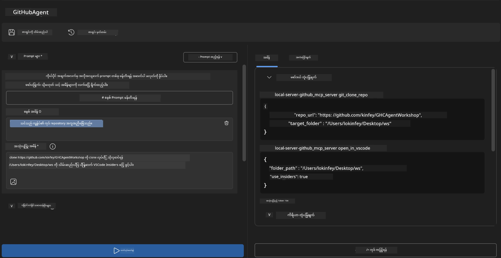
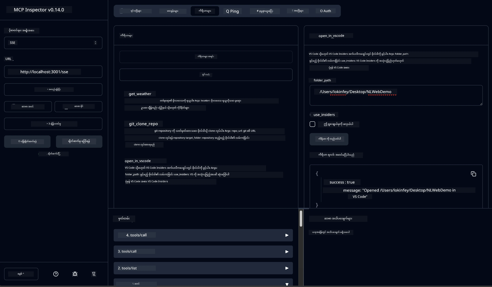

# 🐙 Module 4: Practical MCP Development - Custom GitHub Clone Server


> **⚡ မြန်ဆန်စတင်ခြင်း:** ၃၀ မိနစ်အတွင်း GitHub ရှိ repository များကို auto clone ပြုလုပ်၍ VS Code နှင့်ပေါင်းစပ်သုံးနိုင်သည့် production-ready MCP server တစ်ခု ဆောက်လုပ်ပါ။

## 🎯 သင်ယူရမည့်ရည်ရွယ်ချက်များ

ဤလက်တွေ့ လေ့ကျင့်ခန်းကုန်ဆုံးမြောက်ချိန်တွင်၊ သင်မှာ ဤအရာများပြုလုပ်နိုင်ပါမည် -

- ✅ လက်တွေ့ဖွံ့ဖြိုးတိုးတက်မှုလုပ်ငန်းစဉ်များအတွက် custom MCP server တစ်ခု ဖန်တီးနိုင်ခြင်း
- ✅ MCP မှတဆင့် GitHub repository cloning လုပ်ဆောင်နိုင်ခြင်း
- ✅ Custom MCP servers များကို VS Code နှင့် Agent Builder နှစ်ခုစလုံးဖြင့်ပေါင်းစပ်နိုင်ခြင်း
- ✅ GitHub Copilot Agent Mode ကို custom MCP tools နှင့်အသုံးပြုနိုင်ခြင်း
- ✅ Production ပတ်ဝန်းကျင်များတွင် custom MCP servers များကို စမ်းသပ်ပြီး ဖြန့်ချိနိုင်ခြင်း

## 📋 လိုအပ်ချက်များ

- Labs 1-3 (MCP အခြေခံများနှင့် အဆင့်မြင့်ဖွံ့ဖြိုးတိုးတက်မှု) ဖြည့်စွက်ပြီးစီးထားခြင်း
- GitHub Copilot subscription ([အခမဲ့ စာရင်းသွင်းနိုင်သည်](https://github.com/github-copilot/signup))
- AI Toolkit နှင့် GitHub Copilot extension များ ပါရှိသည့် VS Code
- Git CLI ထည့်သွင်းပြီးစနစ်တကျ ပြင်ဆင်ထားခြင်း

## 🏗️ စီမံကိန်းအနှစ်ချုပ်

### **လက်တွေ့ ဖွံ့ဖြိုးတိုးတက်မှု စိန်ခေါ်မှု**
ဖွံ့ဖြိုးသူများအနေဖြင့် ယင်းတို့သည် GitHub မှ repositories များကို clone ပြုလုပ်ပြီး VS Code သို့မဟုတ် VS Code Insiders တွင် ဖွင့်ကြသည်။ ဤ လက်ရှိလိုင်းလုပ်ငန်းစဉ်မှာ -

1. Terminal/command prompt ကိုဖွင့်ခြင်း
2. လိုအပ်သော directory သို့ သွားရောက်ခြင်း
3. `git clone` command ကို run ပြုလုပ်ခြင်း
4. Cloned directory ထဲမှ VS Code ကိုဖွင့်ခြင်း

**MCP ဖြေရှင်းနည်းက ထိုလုပ်ငန်းစဉ်ကို တစ်ချက်ပဲ ဖြတ်ပြီး စီမံနိုင်ပါသည်။**

### **သင်ဆောက်လုပ်မည့်အရာ**
**GitHub Clone MCP Server** (`git_mcp_server`) သည် အောက်ပါအချက်များကို ပံ့ပိုးပေးပါသည်-

| အင်္ဂါရပ် | ဖော်ပြချက် | အကျိုးပြုချက် |
|---------|-------------|---------|
| 🔄 **ကျွမ်းကျင်စွာ репိိုဇီတိုရီကလုံးထုတ်ခြင်း** | GitHub ရှိ repos များကို စစ်ဆေးမှုပြုစုပြီး clone ခြင်း | အလိုအလျောက် error စစ်ဆေးမှုများ |
| 📁 **နားလည်မြင်သာသည့် directory စီမံခန့်ခွဲမှု** | directory များရှိ/မရှိ စစ်ဆေးပြီး လုံခြုံစွာ ဖန်တီးခြင်း | overwrite မဖြစ်စေရန်ကာကွယ်မှု |
| 🚀 **အဆင်ပြေသော VS Code ပလက်ဖောင်း ညှိနှိုင်းမှု** | Project များကို VS Code/Insiders တွင် ဖွင့်ခြင်း | လုပ်ငန်းစဉ်များ ပေးပို့ရာတွင် ချောမွေ့မှု |
| 🛡️ **ခိုင်ခံ့သည့် error ကာကွယ်မှု** | network, permission, နှင့် path ပြဿနာများကို ဖြေရှင်းနိုင်ခြင်း | Production ready ယုံကြည်စိတ်ချမှု |

---

## 📖 အဆင့်ဆင့်လမ်းညွှန်ချက်များ

### အဆင့် ၁: Agent Builder မှ GitHub Agent တည်ဆောက်ခြင်း

1. AI Toolkit extension ဖြင့် **Agent Builder** ကို ဖွင့်ပါ
2. အောက်ပါအတိုင်း အေးဂျင့်အသစ်တစ်ခု ဖန်တီးပါ -
   ```
   Agent Name: GitHubAgent
   ```

3. Custom MCP server ကို စတင်ဖန်တီးခြင်း -
   - **Tools** → **Add Tool** → **MCP Server** သို့ သွားပါ
   - **"Create A new MCP Server"** ကို ရွေးချယ်ပါ
   - အဆင်ပြေဆုံးသော Python template ကို ရွေးချယ်ပါ
   - **Server Name:** `git_mcp_server`

### အဆင့် ၂: GitHub Copilot Agent Mode ကို ပြင်ဆင်ခြင်း

1. VS Code တွင် GitHub Copilot ဖွင့်ပါ (Ctrl/Cmd + Shift + P → "GitHub Copilot: Open")
2. Copilot အင်တာဖေ့စ်တွင် Agent Model ရွေးပါ
3. အဆင့်မြင့် အာရုံစူးစိုက်မှုအတွက် Claude 3.7 model ရွေးပါ
4. Tool 접근မှုအတွက် MCP integration ကို ဖွင့်ပါ

> **💡 အကြံပြုချက်:** Claude 3.7 သည် ဖွံ့ဖြိုးမှုလုပ်ငန်းစဉ်များနှင့် error ကာကွယ်မှု အကြောင်းအရာများကို ပိုမိုနက်ရှိုင်းစွာ နားလည်သည်။

### အဆင့် ၃: Core MCP Server လုပ်ဆောင်ချက် အကောင်အထည်ဖော်ခြင်း

**GitHub Copilot Agent Mode နှင့်အတူ အောက်ပါ အသေးစိတ် prompt ကို အသုံးပြုပါ:**

```
Create two MCP tools with the following comprehensive requirements:

🔧 TOOL A: clone_repository
Requirements:
- Clone any GitHub repository to a specified local folder
- Return the absolute path of the successfully cloned project
- Implement comprehensive validation:
  ✓ Check if target directory already exists (return error if exists)
  ✓ Validate GitHub URL format (https://github.com/user/repo)
  ✓ Verify git command availability (prompt installation if missing)
  ✓ Handle network connectivity issues
  ✓ Provide clear error messages for all failure scenarios

🚀 TOOL B: open_in_vscode
Requirements:
- Open specified folder in VS Code or VS Code Insiders
- Cross-platform compatibility (Windows/Linux/macOS)
- Use direct application launch (not terminal commands)
- Auto-detect available VS Code installations
- Handle cases where VS Code is not installed
- Provide user-friendly error messages

Additional Requirements:
- Follow MCP 1.9.3 best practices
- Include proper type hints and documentation
- Implement logging for debugging purposes
- Add input validation for all parameters
- Include comprehensive error handling
```

### အဆင့် ၄: MCP Server ကို စမ်းသပ်ခြင်း

#### 4a. Agent Builder တွင် စမ်းသပ်ခြင်း

1. Agent Builder အတွက် debug configuration ကို စတင်ပါ
2. အောက်ပါ system prompt ဖြင့် သင့်အေးဂျင့်ကို ညှိနှိုင်းပါ:

```
SYSTEM_PROMPT:
You are my intelligent coding repository assistant. You help developers efficiently clone GitHub repositories and set up their development environment. Always provide clear feedback about operations and handle errors gracefully.
```

3. အသုံးပြုသူ မှောင်ခိုများနှင့်တကွ စမ်းသပ်ပါ:

```
USER_PROMPT EXAMPLES:

Scenario : Basic Clone and Open
"Clone {Your GitHub Repo link such as https://github.com/kinfey/GHCAgentWorkshop
 } and save to {The global path you specify}, then open it with VS Code Insiders"
```



**မျှော်မှန်းရလဒ်များ:**
- ✅ cloning အောင်မြင်ပြီး path အတည်ပြုချက်ရှိခြင်း
- ✅ VS Code ကို အလိုအလျောက်ဖွင့်ခြင်း
- ✅ မမှန်ကန်သောအခြေအနေများအတွက် error မက်ဆေ့ခ်ျများ ပြသခြင်း
- ✅ edge case များကို မှန်ကန်စွာ ကိုင်တွယ်မှု

#### 4b. MCP Inspector တွင် စမ်းသပ်ခြင်း



---


**🎉 ဂုဏ်ပြုပါတယ်!** သင်သည် လက်တွေ့ အသုံးချနိုင်ပြီး production-ready MCP server တစ်ခုကို အောင်မြင်စွာ ဖန်တီးနိုင်ခဲ့ပါပြီ။ သင့် GitHub clone server သည် MCP ၏ စွမ်းအားကို အသုံးပြု၍ ဖွံ့ဖြိုးentwicklung လုပ်ငန်းစဉ်များကို အလိုအလျောက် ပြုလုပ်ခြင်းနှင့် တိုးတက်မြှင့်တင်ခြင်းများ ပြုလုပ်နိုင်ပါသည်။

### 🏆 အောင်မြင်မှုများရရှိ:

- ✅ **MCP Developer** - Custom MCP server တည်ဆောက်ပြီးစီး
- ✅ **Workflow Automator** - ဖွံ့ဖြိုးမှုအစီအစဉ်များကို ရိုးရှင်းပြုပြင်
- ✅ **Integration Expert** - ဖွံ့ဖြိုးမှုကိရိယာများစွာကို ပေါင်းစပ်ဆက်သွယ်ခြင်း
- ✅ **Production Ready** - ဖြန့်ချိနိုင်သည့် ဖြေရှင်းနည်းများတည်ဆောက်ခြင်း

---

## 🎓 Workshop ပြီးမြောက်ခြင်း: Model Context Protocol နှင့် သင့်ခရီးစဉ်

**ခင်ဗျားသော Workshop ပါဝင်သူများအားလုံး ကျေးဇူးအထူးတင်ရှိပါသည်၊**

Model Context Protocol workshop ၏ ငါးခုလုံး Modules များကို ပြီးမြောက်စေခဲ့ကြတာအတွက် ဂုဏ်ယူပါသည်! သင်သည် AI Toolkit အခြေခံများနားလည်မှုမှ စ၍ အထွက်ရှိတည်ဆောက်ထားပြီးသော MCP servers များဖန်တီးခြင်းအထိ ကြာရှည်တည်ကြောင်း လမ်းကြောင်းတစ်ခုကို လေ့လာရောက်ရှိခဲ့ပါသည်။

### 🚀 သင်၏ သင်ယူမှုလမ်းကြောင်းကို ပြန်လည်သုံးသပ်ခြင်း -

**[Module 1](../lab1/README.md)**: AI Toolkit အခြေခံများ၊ မော်ဒယ်စမ်းသပ်ခြင်းနှင့် ပထမ AI agent တည်ဆောက်ခြင်း။

**[Module 2](../lab2/README.md)**: MCP ဆောက်လုပ်ပုံ၊ Playwright MCP ပေါင်းစပ်ခြင်းနှင့် ပထမ browser automation agent ဖန်တီးခြင်း။

**[Module 3](../lab3/README.md)**: Weather MCP server နှင့် Custom MCP Servers ဖွံ့ဖြိုးတိုးတက်ရေး၊ debugging ကိရိယာ အသုံးပြုခြင်း။

**[Module 4](../lab4/README.md)**: လက်တွေ့ GitHub repository workflow automation ဖြစ်စဉ်တည်ဆောက်ခြင်း။

### 🌟 သင် ရရှိထားသော ကျွမ်းကျင်မှုများ

- ✅ **AI Toolkit Ecosystem**: မော်ဒယ်များ၊ အေးဂျင့်များနှင့် ပေါင်းစပ်မှုနမူနာများ
- ✅ **MCP Architecture**: Client-server ဒီဇိုင်း၊ ပို့ဆောင်မှု protocol များ၊ လုံခြုံမှု
- ✅ **ဖွံ့ဖြိုးတိုးတက်ရေးကိရိယာများ**: Playground → Inspector → production deployment
- ✅ **Custom Development**: သင့်ကိုယ်ပိုင် MCP servers တည်ဆောက်၊ စမ်းသပ်နှင့် ဖြန့်ချိခြင်း
- ✅ **လက်တွေ့အသုံးချမှုများ**: AI အသုံးပြု၍ လက်တွေ့ workflow စိန်ခေါ်ချက်များ ဖြေရှင်းခြင်း

### 🔮 နောက်လှပ်တန်းများ

1. **ကိုယ်ပိုင် MCP Server တည်ဆောက်ရန်**:  သင့်လုပ်ငန်းစဉ်များကို အလိုအလျောက်ပြုလုပ်ရန် သင်ယူထားသော အတတ်ပညာကို အသုံးချပါ
2. **MCP အသိုင်းအဝိုင်းဝင်ပါ**: သင့်ဖန်တီးမှုများကို မျှဝေပြီး အခြားသူများထံမှ သင်ယူပါ
3. **အဆင့်မြင့် ပေါင်းစက်မှုများကို စူးစမ်းပါ**: MCP servers များကို ကုမ္ပဏီစနစ်များနှင့် ချိတ်ဆက်ပါ
4. **Open Source အတွက် လှူဒါန်းပါ**: MCP tooling နှင့် စာရွက်စာတမ်းများ မြှင့်တင်ရာတွင် ပါဝင်ပါ

ဤ workshop သည် စတင်ခြင်းသာ ဖြစ်ပြီး Model Context Protocol ecosystem သည် အရှိန်မြန်စွာ တိုးတက်လျက်ရှိသည်။ သင်သည် AI စွမ်းအားနှင့် တိုးတက်မှုအဆင့်သို့ ခေါင်းဆောင်နေရာတွင် ရှိနေသည်။

**သင်၏ ပါဝင်ပတ်သက်မှုနှင့် စိတ်အားထက်သန်စွာ လေ့လာပေးမှုအတွက် ကျေးဇူးတင်ရှိပါသည်။**

အကျိုးရှိသော AI စွမ်းဆောင်မှုကိရိယာများကို သင်တည်ဆောက်ပြီး အသုံးပြုခွင့်ရပါစေ။

**ဧည့်သည်အောင် ကြိုးစားပါ!**

---

## နောက်တစ်ဆင့်

Module 10 ရဲ့ lab အားလုံး ဖြည့်စွက်ပြီးပြီ။

- ပြန်သွားရန်: [Module 10 Overview](../README.md)
- ဆက်လုပ်ရန်: [Module 11: MCP Server Hands-On Labs](../../11-MCPServerHandsOnLabs/README.md)

---

<!-- CO-OP TRANSLATOR DISCLAIMER START -->
**ကျေးဇူးပြု၍ သတိပြုရန်**:  
ဤစာတမ်းကို AI ဘာသာပြန်ခြင်း ဝန်ဆောင်မှုဖြစ်သော [Co-op Translator](https://github.com/Azure/co-op-translator) ဖြင့် ဘာသာပြန်ဆောင်ရွက်ထားပါသည်။ ကျွန်ုပ်တို့သည် တိကျမှုအတွက် ကြိုးစားဆောင်ရွက်သော်လည်း၊ အေလိုက်အထက် ဘာသာပြန်ချက်များတွင် အမှားများ သို့မဟုတ် မမှန်ကန်မှုများ ဖြစ်ပေါ်နိုင်ကြောင်း သတိပြုပါရန် မေတ္တာရပ်ခံအပ်ပါသည်။ မူရင်းစာတမ်းကို နိုင်ငံရေး ဘာသာစကားဖြင့်သာ ယုံကြည်စိတ်ချရသော အရင်းအမြစ်အတွက် အထောက်အထားအဖြစ် ယူဆရပါသည်။ အရေးကြီးသည့် အချက်အလက်များအတွက် နိုင်ငံအရည်အချင်းရှိ လူကိုယ်တိုင် ဘာသာပြန်ခြင်းကို အကြံပြုပါသည်။ ဤဘာသာပြန်ချက်ကို အသုံးပြုရာတွင် ဖြစ်ပေါ်နိုင်သော ဘာသာနားလည်မှုပျက်ယွင်းခြင်းများ သို့မဟုတ် အဓိပ္ပာယ်နားမလည်မှုများအတွက် ကျွန်ုပ်တို့သည် တာဝန်မဟုတ်ပါ။
<!-- CO-OP TRANSLATOR DISCLAIMER END -->