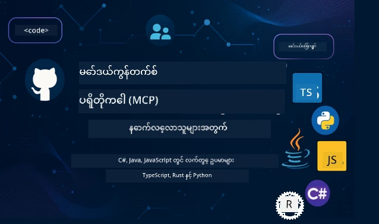

 

[](https://GitHub.com/microsoft/mcp-for-beginners/graphs/contributors)
[](https://GitHub.com/microsoft/mcp-for-beginners/issues)
[](https://GitHub.com/microsoft/mcp-for-beginners/pulls)
[](http://makeapullrequest.com)

[](https://GitHub.com/microsoft/mcp-for-beginners/watchers)
[](https://GitHub.com/microsoft/mcp-for-beginners/fork)
[](https://GitHub.com/microsoft/mcp-for-beginners/stargazers)


[](https://discord.gg/nTYy5BXMWG)

Follow these steps to get started using these resources:
1. **Fork the Repository**: Click [](https://GitHub.com/microsoft/mcp-for-beginners/fork)
2. **Clone the Repository**:   `git clone https://github.com/microsoft/mcp-for-beginners.git`
3. **Join The** [](https://discord.gg/nTYy5BXMWG)


### 🌐 ပရိုဂရမ်ဘာသာစကားများစွာအတွက် ထောက်ခံမှု

#### GitHub Action ဖြင့် ထောက်ခံပြီး (အလိုအလျောက် ပြုပြင်ပေးပြီး အမြဲအသစ်)

<!-- CO-OP TRANSLATOR LANGUAGES TABLE START -->
[Arabic](../ar/README.md) | [Bengali](../bn/README.md) | [Bulgarian](../bg/README.md) | [Burmese (Myanmar)](./README.md) | [Chinese (Simplified)](../zh-CN/README.md) | [Chinese (Traditional, Hong Kong)](../zh-HK/README.md) | [Chinese (Traditional, Macau)](../zh-MO/README.md) | [Chinese (Traditional, Taiwan)](../zh-TW/README.md) | [Croatian](../hr/README.md) | [Czech](../cs/README.md) | [Danish](../da/README.md) | [Dutch](../nl/README.md) | [Estonian](../et/README.md) | [Finnish](../fi/README.md) | [French](../fr/README.md) | [German](../de/README.md) | [Greek](../el/README.md) | [Hebrew](../he/README.md) | [Hindi](../hi/README.md) | [Hungarian](../hu/README.md) | [Indonesian](../id/README.md) | [Italian](../it/README.md) | [Japanese](../ja/README.md) | [Kannada](../kn/README.md) | [Korean](../ko/README.md) | [Lithuanian](../lt/README.md) | [Malay](../ms/README.md) | [Malayalam](../ml/README.md) | [Marathi](../mr/README.md) | [Nepali](../ne/README.md) | [Nigerian Pidgin](../pcm/README.md) | [Norwegian](../no/README.md) | [Persian (Farsi)](../fa/README.md) | [Polish](../pl/README.md) | [Portuguese (Brazil)](../pt-BR/README.md) | [Portuguese (Portugal)](../pt-PT/README.md) | [Punjabi (Gurmukhi)](../pa/README.md) | [Romanian](../ro/README.md) | [Russian](../ru/README.md) | [Serbian (Cyrillic)](../sr/README.md) | [Slovak](../sk/README.md) | [Slovenian](../sl/README.md) | [Spanish](../es/README.md) | [Swahili](../sw/README.md) | [Swedish](../sv/README.md) | [Tagalog (Filipino)](../tl/README.md) | [Tamil](../ta/README.md) | [Telugu](../te/README.md) | [Thai](../th/README.md) | [Turkish](../tr/README.md) | [Ukrainian](../uk/README.md) | [Urdu](../ur/README.md) | [Vietnamese](../vi/README.md)

> **ဒေသတွင်း၌ Clone ပြုလုပ်ချင်ပါသလား?**
>
> ဒီ repository မှာ ဘာသာစကား ၅၀ ကျော်ပေါင်းပြီး ထည့်သွင်းထားတာကြောင့် ဒေါင်းလုပ်အရွယ်အစားကြီးပါတယ်။ ဘာသာပြန်စာသားများမပါဘဲ clone ဖို့အတွက် sparse checkout ကို အသုံးပြုနိုင်ပါတယ်။
>
> **Bash / macOS / Linux:**
> ```bash
> git clone --filter=blob:none --sparse https://github.com/microsoft/mcp-for-beginners.git
> cd mcp-for-beginners
> git sparse-checkout set --no-cone '/*' '!translations' '!translated_images'
> ```
>
> **CMD (Windows):**
> ```cmd
> git clone --filter=blob:none --sparse https://github.com/microsoft/mcp-for-beginners.git
> cd mcp-for-beginners
> git sparse-checkout set --no-cone "/*" "!translations" "!translated_images"
> ```
>
> ဒါက သင့်ကို training လုပ်ဖို့လိုအပ်သော အရာအားလုံးကို လျင်မြန်စွာ ဒေါင်းလုပ် ဆွဲနိုင်အောင် ပြုလုပ်ပေးလိမ့်မယ်။
<!-- CO-OP TRANSLATOR LANGUAGES TABLE END -->

# 🚀 Model Context Protocol (MCP) စတင်လေ့လာသူများအတွက် ပရိုဂရမ်ဆောင်းပါး

## **C#, Java, JavaScript, Rust, Python, နှင့် TypeScript အတွက် ကိုက်ညီသော အသုံးချလက်တွေ့ နမူနာကုဒ်များဖြင့် MCP ကို လေ့လာလိုက်ပါ**

## 🧠 Model Context Protocol သင်ရိုးညွှန်းတမ်း အကျုံး

Model Context Protocol သို့ ခရီးစဉ်စတင်ရန် ကြိုဆိုပါတယ်! AI အက်ပလီကေးရှင်းများသည် အမျိုးမျိုးသောကိရိယာများနှင့် ဝန်ဆောင်မှုများနှင့် ကောင်းမွန်စွာ ဆက်သွယ်သည့်နည်းကို မေးမြန်းဖူးခဲ့လျှင်၊ ဒီနေရာတွင် စိတ်လှုပ်ရှားဖွယ်ဖြေပုံဟာ ဖန်တီးသူများအတွက် တိုးတက်မှုကို ပြောင်းလဲနေတယ်ဆိုတာကို သင်တွေ့မြင်တော့မှာပါ။

MCP ကို AI အက်ပလီကေးရှင်းများအတွက် အပြည့်အဝ ဘာသာပြန်အဖြစ် စဉ်းစားပါ။ USB ပို့အားတိုင်ကနေ အဘယ်သူမျှမရှိတဲ့ ကိရိယာတစ်ခုကို ကွန်ပျူတာနဲ့ ချိတ်ဆက်တဲ့သဘောတူ၊ MCP က AI မော်ဒယ်များကို မည်သည့်ကိရိယာ သို့ဝန်ဆောင်မှုတွင်မဆို စံနမူနာကျသည့်နည်းဖြင့် ချိတ်ဆက်ပေးနိုင်ပါသည်။ သင်၏ ပထမ chatbot ကို ဖန်တီးနေသည် ဖြစ်စေ၊ ရိုးရှင်းမဟုတ်သော AI အလုပ်စဉ်များလုပ်ဆောင်နေသည် ဖြစ်စေ MCP မှားနားလမ်းမရှိပဲ နားလည်တတ်လက်ရှိအတွက် လျင်မြန်သော နောက်ဆုံးသော လိုအပ်ချက်နှင့် ရင်းနှီးဖျော်ဖြေမှုများ တွင် စွမ်းဆောင်နိုင်မှု အား များစွာ ပေးသည်။

ဒီသင်ရိုးညွှန်းတမ်းကို သင်လေ့လာရာ အစမှ စပြီး မိမိတွေ့စေလိုတဲ့ ထိတွေ့နားလည်မှုများဖြင့် ဖန်တီးထားသည်။ မိမိသိပြီးသား ရိုးရှင်းသော အကြောင်းအရာများမှ စ၍ သင်၏စိတ်ဝင်စားတဲ့ programming ဘာသာစကားဖြင့် ရိုးရိုးရေးလက်တွေ့လေ့ကျင့်မှုများဖြင့် ချဉ်းကပ်ပေးမှာ ဖြစ်သည်။ တစ်ခုချင်းစီ အဆင့်မှာ ရှင်းလင်းသော ဖော်ပြချက်များ၊ လက်တွေ့နမူနာများနှင့်အတူ အားပေးကို ရှာဖွေခံစားရပါမည်။

ခရီးစဉ်ပြီးဆုံးသည့်အတွက် သင်သည် မိမိ၏ MCP ဆာဗာများကို ဖန်တီးနိုင်ပြီး၊ လူကြိုက်များသော AI ပလက်ဖောင်းများနှင့် ပေါင်းစည်းနိုင်ခြင်းနှင့် AI ဖန်တီးမှု၏ အနာဂတ်ကို ပြောင်းလဲစေသည့် နည်းပညာကို နားလည်နိုင်သော ဒေါသရှိလိမ့်မည်။ စိတ်လှုပ်ရှားဖွယ် ပြိုင်ဘက်တွေကို စတင်လိုက်ပါစို့!

### တရားဝင် စာတမ်းများနှင့် စနစ်သတ်မှတ်ချက်များ

ဒီသင်ရိုးညွှန်းတမ်းဟာ **MCP Specification 2025-11-25** (နောက်ဆုံးတည်တံ့သော ထုတ်ဝေမှု) နဲ့ ကိုက်ညီသည်။ MCP Specification သည် ရက်စွဲအပေါ် အခြေခံသော ဗားရှင်းခြင်း (YYYY-MM-DD) ကို အသုံးပြုကာ ပရိုတိုကေါ့ဗားရှင်း အမှန်တကယ်ကို ချျပပေးသည်။

ဒီအရင်းအမြစ်များသည် သင်၏ နားလည်မှု တိုးတက်လာသည်နှင့်အမျှ တန်ဖိုးများလာမည်၊ သို့သော် ခပ်သိမ်းတင်ပြချက်အားလုံးကို ချက်ချင်းဖတ်ရန် မလိုအပ်ပါ။ သင်စိတ်ဝင်စားသည့် နေရာမှ စတင်ဖတ်ရှုပါ။
- 📘 [MCP စာတမ်းများ](https://modelcontextprotocol.io/) – လမ်းညွှန်ချက်များနှင့် အသုံးပြုသူလမ်းညွှန်များပါဝင်ပြီး စတင်သူများအတွက် ရေးသားထားသော ထောက်ခံမှုများ ဖြစ်သည်။
- 📜 [MCP Specification](https://modelcontextprotocol.io/specification/2025-11-25) – သင့်တန်းအတွက် စံသတ်မှတ်ချက် စာအုပ်အာရုံစူးစိုက်မှုနှင့် တိကျသော အသေးစိတ်များ တည်းဖြတ်ထားသည်။
- 📜 [MCP Specification Versioning](https://modelcontextprotocol.io/specification/versioning) – ဗားရှင်းသမိုင်းနှင့် MCP ရက်စွဲအပေါ်အခြေခံ ဗားရှင်းကဲ့သို့သော အသေးစိတ်အချက်အလက်များ ပါဝင်သည်။
- 🧑‍💻 [MCP GitHub Repository](https://github.com/modelcontextprotocol) – SDK များ၊ ကိရိယာများနှင့် ကုဒ်နမူနာများကို စိတ်ကြိုက်ဘာသာစကားများဖြင့် ရယူနိုင်ပါသည်။
- 🌐 [MCP လူ့အသိုက်အဝန်း](https://github.com/orgs/modelcontextprotocol/discussions) – MCP အကြောင်း ပူးပေါင်းဆွေးနွေးသော အဖွဲ့ဝင်များနှင့် တွဲဖက်သိရှိမှုမျှဝေသော ပေါင်းသင်းတတ်ရှင် အသိုက်အဝန်းတစ်ခုဖြစ်သည်။
  
## သင်ယူရမည့် ရည်မှန်းချက်များ

ဒီသင်ရိုးများအဆုံးမှာ သင့်တွင် လုံခြုံစိတ်ချမှုနှင့် အားဖွင့်မူ ထိရောက်စွာ ဖန်တီးနိုင်မှု ရရှိပြီ ဖြစ်လိမ့်မည်။ သင် အောက်ပါအရာများကို ရောက်ရှိဦးမည်-

• **MCP အခြေခံများနားလည်ခြင်း**: Model Context Protocol ဆိုတာ ဘာလဲ၊ AI အက်ပလီကေးရှင်းများ ဘယ်လိုလည်းသုံးလို့ ရတာလဲဆိုတာနားလည်ရမည့် အယူအဆများ၊ နမူနာများနှင့်အတူ ရှင်းလင်းပြသပါမည်။

• **ပထမဆုံး MCP ဆာဗာ တည်ဆောက်ခြင်း**: သင်၏ကြိုက်နှစ်သက်သော programming ဘာသာစကားဖြင့် အလုပ်လုပ်တတ်တယ့် MCP ဆာဗာကို ရိုးရိုးရှင်းရှင်း နမူနာများဖြင့် တစ်ဆင့်ချင်း တိုးတက်ရမည့် လုပ်ငန်းစဉ်ပြုလုပ်ရန်။

• **AI မော်ဒယ်များကို ကိရိယာများနှင့် ချိတ်ဆက်ခြင်း**: AI မော်ဒယ်များနှင့် တိုက်ရိုက် ဝန်ဆောင်မှုများကို ချိတ်ဆက်ပေး၍ အက်ပလီကေးရှင်းအသစ်များ ဖန်တီးနိုင်မှု ထပ်တိုးပေးခြင်း။

• **လုံခြုံရေးနဲ့ ပတ်သက်သော အကောင်းဆုံး အလေ့အထများ ဆောင်ရွက်ခြင်း**: MCP ကို လုံခြုံစိတ်ချစွာ အသုံးချရန်နည်းလမ်းများ ရှင်းလင်းပေးပြီး အသုံးပြုသူများ နှင့်အတူ သင့်အက်ပလီကေးရှင်းကိုကာကွယ်ပေးခြင်း။

• **ယုံကြည်မှုရှိသော တပ်ဆင်ခြင်း**: အသုံးပြုနိုင်သော MCP စီမံကိန်းများကို တဖြည်းဖြည်း ဖန်တီးပြီး အလုပ်ထုတ်လုပ်မှုအဆင့်သို့ ဦးတည်၍ လက်တွေ့တပ်ဆင်နည်းများ နားလည်ရန်။

• **MCP အသိုက်အဝန်းထဲ ပါဝင်လာခြင်း**: AI app ဖန်တီးသူလုပ်ငန်းအား တိုးတက်ကျပ်တည်းစေသည့် တိုးတက်မှုကို ပံ့ပိုးတဲ့ လူကြီးမင်းအားဖြင့် လူပေါင်းများ စုပေါင်းနေသော အသိုက်အဝန်းတစ်ခုဖြစ်လာပါမည်။

## အရေးကြီး အခြေခံအကြောင်းအရာများ

MCP အထူးသဖြင့် မဝင်မီ အခြေခံ အယူအဆ သင်ယူကို အထူးစိတ်အရှည်သိမ်းပါ။ ဒီနယ်ပယ်တွင် ကျွမ်းကျင်မှုမရှိလည်း စိတ်မပူပါနှင့်၊ လိုအပ်ချက်အတိုင်း ရှင်းပြပေးပါမည်။

### ပရိုတိုကောများနားလည်ခြင်း (ခြေသည်နောက်ခံ)

ပရိုတိုကော ဆိုတာ သဘောတူညီထားသော စည်းမျဉ်းတွေကို ဆိုလိုပါတယ်။ မိတ်ဆွေကို ဖုန်းခေါ်တဲ့အခါ "ဟယ်လို" ပြော၊ စကားပြောရာမှာ တစ်ဦးတစ်ယောက်ပြောပြီး နောက်တစ်ယောက်ပြောရပါတယ်၊ ပြီးရင် "နေကောင်းပါစေ" လို့ပြောပါတယ်။ ကွန်ပျူတာပရိုဂရမ်းတွေဟာလည်း ဒီလို စည်းမျဉ်းတွေလိုပါတယ်။

MCP ကတော့ AI မော်ဒယ်များနဲ့ ကိရိယာ၊ ဝန်ဆောင်မှုတွေကို ထိရောက်စွာ ဆက်သွယ်နိုင်အောင် သဘောတူထားတဲ့ စည်းမျဉ်းတွေ စုစည်းထားတဲ့ ပရိုတိုကော တစ်ခုပါ။ လူတွေ စကားပြောရာမှာ စည်းမျဉ်းရှိတာက ဆက်ဆံရေးကောင်းစေသလို MCP ထောက်ပံ့တဲ့ AI ဆက်သွယ်မှုက တိုက်ရိုက်ကျယ်ကျယ်ပြန့်ပြန့် ထိရောက်စေပါတယ်။

### Client-Server ဆက်ဆံရေးများ (ပရိုဂရမ်းတွေ ပူးပေါင်းလုပ်ဆောင်ရေး)

သင်က ယနေ့ခေတ်မှာလည်း client-server ဆက်ဆံရေးကို အသုံးပြုနေပြီ။ ဝက်ဘ်ဘရောက်ဇာ (client) ဖြင့် ဝက်ဘ်ဆိုက်တစ်ခုသို့ ဝင်ရောက်လျှင် server ကနေ အကြောင်းအရာပေးပို့တာကိုကြုံတွေ့ရသည်။ browser က မေးခွန်းမေးတာကို server က ဖြေဆိုပေးပါတယ်။

MCP မှာလည်း အဲဒီလိုပုံစံပါ။ AI မော်ဒယ်တွေက client အဖြစ် လိုအပ်ချက်တောင်းဆိုရာမှာ MCP server က တာဝန်ယူထောက်ပံ့ပါတယ်။ သူသည် AI ၏ ကူညီသူတစ်ယောက်ကဲ့သို့ တိတိကျကျ အလုပ်လုပ်ပေးနိုင်သည်။

### စံချိန်တင်ခြင်း အရေးကြီးခြင်း (အတူတကွလက်တွဲဆောင်ရွက်ခြင်း)

ကားထုတ်လုပ်သူတိုင်းက အီသန်တွက်ဆံပင်မတူတာမျိုးရှိရင် အဲဒီကားတွေကို ချိတ်ဆက်ဖို့ ခွင့်ပြုချက်တစ်ခု လိုရင် ပုံမှန်မဟုတ်ပါဘူး။ စံချိန်တင်ခြင်းဆိုတာ သဘောတူညီထားတဲ့ နည်းလမ်းတွေကို ဦးစားပေး သုံးတာ ဖြစ်သည်။

MCP က AI အက်ပလီကေးရှင်းများအတွက် သံတမန်ထားတဲ့ စံချိန်တင်ခြင်းဖြစ်သည်။ AI မော်ဒယ်တစ်ခုစီမှာ လုပ်သင့်သော ချိတ်ဆက်မှု ကုဒ်စနစ် မဟုတ်ဘဲ MCP က စံနမူနာတစ်ခုဖြင့် ဆက်သွယ်ကြပါလိမ့်မည်။ အဲဒီကြောင့် ဖန်တီးသူများအနေဖြင့် တစ်ခါတည်းကိရိယာတစ်ခုတည်ဆောက်ပြီး အမျိုးမျိုးသော AI စနစ်များနှင့် သုံးနိုင်ပါသည်။

## 🧭 သင်ယူရာ လမ်းညွှန်

သင့် MCP ခရီးစဉ်ကို အဆင့်ဆင့်ကြိုးစားပြီး အတတ်ပညာတွေကို တိုးတက်စေဖို့ အကောင်းဆုံးကိုတည်ဆောက်ထားပါတယ်။ နေလမ်း ဇုန်တိုင်းမှာ သင် သိရှိပြီးသား အကြောင်းအရာများ ဝံ့ဝါးခြင်းမျှ သင် ထည့်သွင်းထားသည်။

### 🌱 အခြေခံအဆင့်: အခြေခံများ နားလည်ခြင်း (အပိုင်း 0-2)

ဒီဇုန်မှာ သင်၏ စွန့်စားမှု စတင်မည်ဖြစ်ပါသည်! MCP ၏ အယူအဆများကို ရိုးရိုးရှင်းရှင်း နားလည်စေဖို့ ပုံပြင်နည်းလမ်းများနှင့် နမူနာများ အသုံးပြုသည်။ MCP ဆိုတာ ဘာလဲ၊ ဘာကြောင့်ရှိတာလဲ၊ AI ဖွံ့ဖြိုးတိုးတက်မှုအတွင်း ဘယ်လိုထည့်သွင်းထားတာလဲ ဆိုတာ နားလည်ရန်။

• **Module 0 - MCP အကြောင်းမိတ်ဆက်ခြင်း**: MCP ဆိုတာဘာလဲ၊ စွမ်းဆောင်ရည်မြှင့် AI အက်ပလီကေးရှင်းများအတွက် အရေးကြီးပုံ၊ MCP ပြဿနာဖြေရှင်းပုံတို့ကို လေ့လာသွားမယ်။

• **Module 1 - အခြေခံ အယူအဆ ရှင်းလင်းခြင်း**: MCP ထုတ်လုပ်မှုတွင် အဓိကအမြင်များကို နားလည်ရန်၊ ပုံပြင်များနှင့် အမြင်မြင်ကွင်းများ အသုံးပြုကာ လေ့လာသွားမယ်။

• **Module 2 - MCP တည်ငြိမ်ရေး**: လုံခြုံရေးသည် ခက်ခဲသည့် အကြောင်းအရာမဟုတ်ပေ။ MCP ထဲတွင် တည်ငြိမ်မှုများ မိတ်ဆက်ထားပြီး၊ လုံခြုံစိတ်ချစွာ အသုံးပြုရန် အကောင်းဆုံး လေ့ကျင့်ပုံများ သင်ကြားပေးမည်။

### 🔨 ဖန်တီးခြင်း အဆင့်: ပထမဆုံး တည်ဆောက်မှုများ လုပ်ကိုင်ခြင်း (Module 3)

အခုမှ ပြီးပြည့်စုံသော စိတ်လှုပ်ရှားမှု စတင်ပါပြီ! MCP ဆာဗာနဲ့ client တိုင်း ကို လက်တွေ့ပြုလုပ်ကြည့်ရမည်။ စိတ်မပူပါနှင့် - ရိုးရိုးရှင်းရှင်း နမူနာများနဲ့ အဆင့်တိုင်း လမ်းပြပေးပါမည်။
ဤမော်ဒျူးတွင် သင်ကြိုက်နှစ်သက်သောပရိုဂရမ်မျာဘာသာစကားဖြင့် လက်တွေ့လေ့ကျင့်နိုင်ဖို့ လက်တွေ့ရွှေ့ပြောင်းလမ်းညွှန်များစွာ ပါဝင်သည်။ သင်၏ပထမဆုံး server ကို ဖန်တီးပြီး၊ ၎င်းတွင်ချိတ်ဆက်ရန် client ကိုဆောက်ပြီး၊ VS Code ကဲ့သို့သော လူကြိုက်များသော ဖွံ့ဖြိုးရေးကိရိယာများနှင့်ပေါင်းစည်းသုံးစွဲပါမည်။

လမ်းညွှန်တစ်ခုချင်းစီတွင် ပြည့်စုံသော ကုဒ်နမူနာများ၊ ပြဿနာဖြေရှင်းနည်းများနှင့် ဒီဇိုင်းရွေးချယ်မှုများကို လုပ်ကြံခဲ့ရသော အကြောင်းရင်းများ ရှင်းလင်းထားပါသည်။ ဤအဆင့်အဆုံးတွင် သင်သည် ဂုဏ်ယူစရာ MCP ဆောင်ရွက်မှုများ ကို ပိုင်ဆိုင်မည်ဖြစ်ပါသည်။

### 🚀 ကြီးထွားခြင်းအဆင့်: တိုးတက်ပြီး အမှန်တကယ်အသုံးချမှု (Modules 4-5)

အခြေခံများကို ကျွမ်းကျင်ပြီးနောက်၊ သင်သည် ပိုမိုကျွမ်းကျင်သော MCP အင်္ဂါရပ်များကို ရှာဖွေရန် အသင့်ဖြစ်နေပါပြီ။ လက်တွေ့အသုံးပြန်နည်းများ၊ အမှားရှာဖွေခြင်းနည်းပြောင်းများနှင့် multi-modal AI ပေါင်းစည်းခြင်းကဲ့သို့သော အဆင့်မြင့်ပြဿနာများကို ဖော်ပြပါမည်။

သင်သည် MCP ဆောင်ရွက်မှုများကို ထုတ်လုပ်မှုအသုံးပြုရန် များစွာတိုးချဲ့နည်းများနှင့် Azure ကဲ့သို့သော Cloud ပလက်ဖောင်းများနှင့် ပေါင်းစည်းခြင်းနည်းများကိုလည်း သင်ယူမည်။ ဤမော်ဒျူးများသည် အမှန်တကယ်လိုအပ်ချက်များကို ကောင်းစွာ ကိုင်တွယ်နိုင်သော MCP ဖြေရှင်းချက်များ ဖန်တီးရန် သင်အား ပြင်ဆင်ပေးပါသည်။

### 🌟 ကျွမ်းကျင်မှုအဆင့်: အသိုင်းအဝိုင်းနှင့် အထူးပြုခြင်း (Modules 6-11)

နောက်ဆုံးအဆင့်တွင် MCP အသိုင်းအဝိုင်းနှင့် ပူးပေါင်းပါဝင်ခြင်းနှင့် သင်စိတ်ဝင်စားသော နယ်ပယ်များတွင် အထူးပြုခြင်းကို ရှုမြင်ထားသည်။ သင်သည် open-source MCP ပရောဂျက်များတွင် ပါဝင်ဆောင်ရွက်နည်း၊ အဆင့်မြင့် authentication နည်းလမ်းများ အချိန်နှင့်တပြေးညီတည်ဆောက်နည်းများနှင့် ပြည့်စုံသော ဒေတာဘေ့စ် ပေါင်းစည်းထားသော ဖြေရှင်းချက်များ ဖန်တီးနည်းကို သင်ယူမည်။

Module 11 သည် အထူးထောင့်သတ်ချက်တစ်ခုဖြစ်ပြီး PostgreSQL ပေါင်းစည်းထားသော ထုတ်လုပ်မှုအသင့် MCP server များ ဖန်တီးပုံကို သင်ကြားသည့် 13 လက်တွေ့ လေ့ကျင့်ခန်းများပါရှိသည်။ ထိုသည် သင်ယူခဲ့သမျှအားလုံးကို ပေါင်းစည်းပေးသည့် စွမ်းဆောင်မှုကောင်းသော ရည်မှန်းချက်တစ်ခုကဲ့သို့ ဖြစ်ပါသည်။

### 📚 ပြည့်စုံသော သင်ရိုးညွှန်းပုံ

| Module | ခေါင်းစဉ် | ဖော်ပြချက် | Link |
|--------|-------|-------------|------|
| **Module 0-3: အခြေခံများ** | | | |
| 00 | MCP အကြောင်းသိရှိခြင်း | Model Context Protocol နှင့် AI pipeline များတွင် ၎င်း၏ အရေးပါမှုကို ကြည့်ရှုခြင်း | [Read more](./00-Introduction/README.md) |
| 01 | အဓိက အယူအဆများ ရှင်းလင်းချက် | MCP အဓိကအယူအဆများကို အနက်ရှိုင်းစွာ လေ့လာခြင်း | [Read more](./01-CoreConcepts/README.md) |
| 02 | MCP တွင် လုံခြုံရေး | လုံခြုံရေး မြားနှင့် အကောင်းဆုံး အသုံးပြုနည်းများ | [Read more](./02-Security/README.md) |
| 03 | MCP စတင်သုံးစွဲခြင်း | ပတ်ဝန်းကျင် ပြင်ဆင်ခြင်း၊ အခြေခံ server/client များ၊ ပေါင်းစည်းခြင်း | [Read more](./03-GettingStarted/README.md) |
| **Module 3: ပထမ Server & Client တည်ဆောက်ခြင်း** | | | |
| 3.1 | ပထမဆုံး Server | ပထမ MCP server ကို ဖန်တီးခြင်း | [Guide](./03-GettingStarted/01-first-server/README.md) |
| 3.2 | ပထမ Client | အခြေခံ MCP client တစ်ခု တည်ဆောက်ခြင်း | [Guide](./03-GettingStarted/02-client/README.md) |
| 3.3 | LLM ဖြင့် Client | ကြီးမားသော ဘာသာစကား မော်ဒယ်များ အတူ ပေါင်းစည်းခြင်း | [Guide](./03-GettingStarted/03-llm-client/README.md) |
| 3.4 | VS Code ပေါင်းစည်းခြင်း | MCP server များကို VS Code တွင် အသုံးပြုခြင်း | [Guide](./03-GettingStarted/04-vscode/README.md) |
| 3.5 | stdio Server | stdio သယ်ယူပို့ဆောင်မှုဖြင့် server များ ဖန်တီးခြင်း | [Guide](./03-GettingStarted/05-stdio-server/README.md) |
| 3.6 | HTTP Streaming | MCP တွင် HTTP streaming ကို တည်ဆောက်ခြင်း | [Guide](./03-GettingStarted/06-http-streaming/README.md) |
| 3.7 | AI Toolkit | MCP နှင့် AI Toolkit အသုံးပြုခြင်း | [Guide](./03-GettingStarted/07-aitk/README.md) |
| 3.8 | စမ်းသပ်ခြင်း | MCP server ဆောင်ရွက်မှု စမ်းသပ်ခြင်း | [Guide](./03-GettingStarted/08-testing/README.md) |
| 3.9 | တပ်ဆင်ခြင်း | MCP server များကို ထုတ်လုပ်ရန် တပ်ဆင်ခြင်း | [Guide](./03-GettingStarted/09-deployment/README.md) |
| 3.10 | အဆင့်မြင့် server အသုံးပြုမှု | အဆင့်မြင့် features နှင့် တိုးတက်တဲ့ စီးပွားရေးဆောက်လုပ်မှုအတွက် server များ အသုံးပြုခြင်း | [Guide](./03-GettingStarted/10-advanced/README.md) |
| 3.11 | ရိုးရှင်းသော အတည်ပြုခြင်း | အစပိုင်းမှ မှတ်ပုံတင်ခြင်းနှင့် RBAC ကို ပြသသော ဌာနခွဲ | [Guide](./03-GettingStarted/11-simple-auth/README.md) |
| 3.12 | MCP Hosts | Claude Desktop, Cursor, Cline နှင့် အခြား MCP hosts များ တပ်ဆင်ပုံ | [Guide](./03-GettingStarted/12-mcp-hosts/README.md) |
| 3.13 | MCP Inspector | Inspector ကိရိယာနှင့် MCP server များကို debug နှင့် စမ်းသပ်ခြင်း | [Guide](./03-GettingStarted/13-mcp-inspector/README.md) |
| **Module 4-5: လက်တွေ့ & အဆင့်မြင့်** | | | |
| 04 | လက်တွေ့ ဆောင်ရွက်မှု | SDK များ၊ debugging, စမ်းသပ်မှု၊ ပြန်လည်အသုံးပြုနိုင်သော prompt templates များ | [Read more](./04-PracticalImplementation/README.md) |
| 4.1 | Pagination | cursor အခြေခံ pagination ဖြင့် ပမာဏအကြီးစား ရလဒ်များကို ကိုင်တွယ်ခြင်း | [Guide](./04-PracticalImplementation/pagination/README.md) |
| 05 | MCP အဆင့်မြင့် ခေါင်းစဉ်များ | Multi-modal AI, scaling, စီးပွားရေးအသုံးပြုမှု | [Read more](./05-AdvancedTopics/README.md) |
| 5.1 | Azure ပေါင်းစည်းခြင်း | MCP နဲ့ Azure ပေါင်းစည်းခြင်း | [Guide](./05-AdvancedTopics/mcp-integration/README.md) |
| 5.2 | Multi-modality | modalities အမျိုးမျိုးနဲ့ လုပ်ကိုင်ခြင်း | [Guide](./05-AdvancedTopics/mcp-multi-modality/README.md) |
| 5.3 | OAuth2 ကို ပြသခြင်း | OAuth2 အတည်ပြုခြင်း ဆောင်ရွက်ခြင်း | [Guide](./05-AdvancedTopics/mcp-oauth2-demo/README.md) |
| 5.4 | Root Contexts | root contexts ကို နားလည်ခြင်းနှင့် ဆောင်ရွက်ခြင်း | [Guide](./05-AdvancedTopics/mcp-root-contexts/README.md) |
| 5.5 | Routing | MCP routing နည်းလမ်းများ | [Guide](./05-AdvancedTopics/mcp-routing/README.md) |
| 5.6 | Sampling | MCP တွင် sampling နည်းများ | [Guide](./05-AdvancedTopics/mcp-sampling/README.md) |
| 5.7 | Scaling | MCP ဆောင်ရွက်မှု တိုးချဲ့ခြင်း | [Guide](./05-AdvancedTopics/mcp-scaling/README.md) |
| 5.8 | Security | အဆင့်မြင့် လုံခြုံရေး ဇကာ | [Guide](./05-AdvancedTopics/mcp-security/README.md) |
| 5.9 | Web Search | ဝဘ် ရှာဖွေရေး တဲ့ဖွားမှု ဆောင်ရွက်ခြင်း | [Guide](./05-AdvancedTopics/web-search-mcp/README.md) |
| 5.10 | Realtime Streaming | အချိန်နှင့်တပြေးညီ streaming လုပ်ဆောင်ချက် တည်ဆောက်ခြင်း | [Guide](./05-AdvancedTopics/mcp-realtimestreaming/README.md) |
| 5.11 | Realtime Search | အချိန်နှင့်တပြေးညီ ရှာဖွေရေး ဆောင်ရွက်ခြင်း | [Guide](./05-AdvancedTopics/mcp-realtimesearch/README.md) |
| 5.12 | Entra ID အတည်ပြုခြင်း | Microsoft Entra ID ဖြင့် authentication | [Guide](./05-AdvancedTopics/mcp-security-entra/README.md) |
| 5.13 | Foundry ပေါင်းစည်းခြင်း | Azure AI Foundry နဲ့ ပေါင်းစည်းခြင်း | [Guide](./05-AdvancedTopics/mcp-foundry-agent-integration/README.md) |
| 5.14 | Context Engineering | ထိရောက်သော context engineering နည်းလမ်းများ | [Guide](./05-AdvancedTopics/mcp-contextengineering/README.md) |
| 5.15 | MCP Custom Transport | Custom Transport ဆောင်ရွက်ချက်များ | [Guide](./05-AdvancedTopics/mcp-transport/README.md) |
| 5.16 | Protocol Features | တိုးတက်မှု အသိပေးချက်များ၊ ဖျက်သိမ်းမှု၊ ရင်းမြစ် template များ | [Guide](./05-AdvancedTopics/mcp-protocol-features/README.md) |
| **Module 6-10: အသိုင်းအဝိုင်း & အကောင်းဆုံးအလေ့အထများ** | | | |
| 06 | အသိုင်းအဝိုင်း မှာ ပါဝင်ဆောင်ရွက်ခြင်း | MCP ecosystem တွင် ပါဝင်ရန်နည်းလမ်းများ | [Guide](./06-CommunityContributions/README.md) |
| 07 | အစောပိုင်း ပေါင်းစည်းမှုမှ သင်ခန်းစာများ | အမှန်တကယ် အသုံးချမှု ပုံပြင်များ | [Guide](./07-LessonsfromEarlyAdoption/README.md) |
| 08 | MCP အတွက် အကောင်းဆုံးအလေ့အထများ | လုပ်ဆောင်ရမည့် ထိရောက်မှု၊ အမှားခံနိုင်မှု၊ တည်တွဲရမည့် နည်းလမ်းများ | [Guide](./08-BestPractices/README.md) |
| 09 | MCP နမူနာလေ့လာမှုများ | လက်တွေ့ ဆောင်ရွက်မှုနမူနာ | [Guide](./09-CaseStudy/README.md) |
| 10 | လက်တွေ့ သင်တန်း | AI Toolkit ကို အသုံးပြုပြီး MCP Server တည်ဆောက်ခြင်း | [Lab](./10-StreamliningAIWorkflowsBuildingAnMCPServerWithAIToolkit/README.md) |
| **Module 11: MCP Server လက်တွေ့သင်တန်း** | | | |
| 11 | MCP Server Database ပေါင်းစည်းခြင်း | PostgreSQL ပေါင်းစည်းထားသော 13 လက်တွေ့သင်ခန်းစာလမ်းကြောင်း | [Labs](./11-MCPServerHandsOnLabs/README.md) |
| 11.1 | အမည်ပေါ် | database ပေါင်းစည်းခြင်း နှင့် လက်လီ သုံးသပ်ချက် အသုံးချမှုအတွက် MCP အကြောင်း ကွဲပြား၍ ရှင်းလင်းခြင်း | [Lab 00](./11-MCPServerHandsOnLabs/00-Introduction/README.md) |
| 11.2 | အဓိက စနစ် | MCP server စနစ်ပေါ်တည်ဆောက်ပုံ၊ database အပေါ်ထည့်သွင်းခန့်မှန်းချက်များနှင့် လုံခြုံရေးပုံစံများ | [Lab 01](./11-MCPServerHandsOnLabs/01-Architecture/README.md) |
| 11.3 | လုံခြုံရေး & Multi-Tenancy | စာတန်းအဆင့်လုံခြုံရေး၊ authentication နှင့် အများဆောင်ရာ ဒေတာ အသုံးပြုခွင့် | [Lab 02](./11-MCPServerHandsOnLabs/02-Security/README.md) |
| 11.4 | ပတ်ဝန်းကျင် တပ်ဆင်ခြင်း | ဖွံ့ဖြိုးရေး ပတ်ဝန်းကျင်, Docker ၊ Azure အရင်းအမြစ်များ တပ်ဆင်ခြင်း | [Lab 03](./11-MCPServerHandsOnLabs/03-Setup/README.md) |
| 11.5 | Database ဒီဇိုင်း | PostgreSQL တပ်ဆင်ခြင်း၊ လက်လီ schema ဒီဇိုင်းနှင့် နမူနာဒေတာ | [Lab 04](./11-MCPServerHandsOnLabs/04-Database/README.md) |
| 11.6 | MCP Server ဆောင်ရွက်မှု | database ပေါင်းစည်းမှုဖြင့် FastMCP server ဆောက်ခြင်း | [Lab 05](./11-MCPServerHandsOnLabs/05-MCP-Server/README.md) |
| 11.7 | ကိရိယာ ဖန်တီးမှု | database query ကိရိယာများနှင့် schema introspection တည်ဆောက်ခြင်း | [Lab 06](./11-MCPServerHandsOnLabs/06-Tools/README.md) |
| 11.8 | Semantic Search | Azure OpenAI နှင့် pgvector အသုံးပြုပြီး vector embedding ဆောင်ရွက်ခြင်း | [Lab 07](./11-MCPServerHandsOnLabs/07-Semantic-Search/README.md) |
| 11.9 | စမ်းသပ်ခြင်း & အမှားရှာဖွေခြင်း | စမ်းသပ်နည်းဗျူဟာများ၊ debugging ကိရိယာများနှင့် အတည်ပြုနည်းလမ်းများ | [Lab 08](./11-MCPServerHandsOnLabs/08-Testing/README.md) |
| 11.10 | VS Code ပေါင်းစည်းခြင်း | VS Code MCP ပေါင်းစည်းခြင်းနှင့် AI Chat အသုံးပြုမှု တပ်ဆင်ခြင်း | [Lab 09](./11-MCPServerHandsOnLabs/09-VS-Code/README.md) |
| 11.11 | တပ်ဆင်မှု များ | Docker တပ်ဆင်ခြင်း၊ Azure Container Apps နှင့် တိုးချဲ့ချက်များ မျှတစွာ စဉ်းစားခြင်း | [Lab 10](./11-MCPServerHandsOnLabs/10-Deployment/README.md) |
| 11.12 | နေ့စဉ်ကြည့်ရှုခြင်း | Application Insights၊ logging၊ စွမ်းဆောင်ရည် ကြည့်ရှုခြင်း | [Lab 11](./11-MCPServerHandsOnLabs/11-Monitoring/README.md) |
| 11.13 | အကောင်းဆုံးအလေ့အထများ | စွမ်းဆောင်ရည် တိုးတက်မှု၊ လုံခြုံရေး ဖြည့်စွက်မှုနှင့် ထုတ်လုပ်မှု အကြံပေးချက်များ | [Lab 12](./11-MCPServerHandsOnLabs/12-Best-Practices/README.md) |

### 💻 ကိုယ်တိုင်ရေးသားထားသော ကုဒ်ပရောဂျက် များ

MCP သင်ယူရာတွင် အလွန်စိတ်လှုပ်ရှားဖွယ်ကောင်းသော ကဏ္ဍများထဲမှ တစ်ခုမှာ သင်၏ကုဒ်ကျွမ်းကျင်မှု များစွာ တိုးတက်လာသည်ကို မြင်တွေ့ရခြင်းဖြစ်သည်။ ကျွန်ုပ်တို့၏ကုဒ်နမူနာများကို စတင်ချိန်တွင် ရိုးရှင်းစွာခံစားနိုင်ပြီး၊ သင်၏နားလည်မှုပိုမိုလှုပ်ရှားသွားသည့်အတိုင်း ကျွမ်းကျင်မှုပိုမိုမြင့်မားလာအောင် ဖန်တီးထားသည်။ ဒီမှာ သင်ယူပုံ သဘောတရားများကို စတင်မိတ်ဆက်ပုံဖြစ်ပြီး၊ အသုံးပြုရလွယ်ကူသော ကုဒ်ဖြင့် သက်ဆိုင်ရာ MCP အယူအဆများကို သင်နားလည်လိမ့်မည်၊ မဟုတ်ရင် အဲဒီကုဒ်တို့ ဘာကြောင့်ဒီပုံစံနဲ့လုပ်ထားသလဲ၊ MCP အတော်ကြီးများအတွင်း ၎င်းအနေအထား ဘယ်လိုကြပ်မတ်ထားသလဲကို နက်ရှိုင်းစွာ နားလည်နိုင်လိမ့်မည်။

#### အခြေခံ MCP ကုလားထိုင်တန်ခိုးနမူနာများ

| ဘာသာစကား | ဖော်ပြချက် | Link |
|----------|-------------|------|
| C# | MCP Server နမူနာ | [View Code](./03-GettingStarted/samples/csharp/README.md) |
| Java | MCP ကုလားထိုင် | [View Code](./03-GettingStarted/samples/java/calculator/README.md) |
| JavaScript | MCP ဖော်ပြချက် | [View Code](./03-GettingStarted/samples/javascript/README.md) |
| Python | MCP Server | [View Code](../../03-GettingStarted/samples/python/mcp_calculator_server.py) |
| TypeScript | MCP နမူနာ | [View Code](./03-GettingStarted/samples/typescript/README.md) |
| Rust | MCP နမူနာ | [View Code](./03-GettingStarted/samples/rust/README.md) |

#### အဆင့်မြင့် MCP ဆောင်ရွက်မှုများ

| ဘာသာစကား | ဖော်ပြချက် | Link |
|----------|-------------|------|
| C# | အဆင့်မြင့်နမူနာ | [View Code](./04-PracticalImplementation/samples/csharp/README.md) |
| Java with Spring | Container App နမူနာ | [View Code](./04-PracticalImplementation/samples/java/containerapp/README.md) |
| JavaScript | အဆင့်မြင့်နမူနာ | [View Code](./04-PracticalImplementation/samples/javascript/README.md) |
| Python | ရှုပ်ထွေးသော ဆောင်ရွက်မှု | [View Code](./04-PracticalImplementation/samples/python/README.md) |
| TypeScript | Container နမူနာ | [View Code](./04-PracticalImplementation/samples/typescript/README.md) |


## 🎯 MCP သင်ယူရန် မီတီအဆင့်များ

ဤသင်ရိုးမှ အပြည့်အဝ အကျိုးယူနိုင်ရန် သင့်တွင်:

- C#, Java, JavaScript, Python, သို့မဟုတ် TypeScript တစ်ခုခုတွင် အခြေခံပရိုဂရမ်ရေးဆွဲရေး သိမြင်မှုရှိထားရမည်
- client-server ပုံစံနှင့် API များနားလည်တတ်ကြသင့်သည်
- REST နှင့် HTTP အယူအဆများကို သိရှိထားရမည်
- (မဟုတ်ရင်) AI/ML အယူအဆများ ကို အနည်းငယ်မြင်စေခြင်း

- ကျွန်ုပ်တို့၏အသိုင်းအဝိုင်း ဆွေးနွေးပွဲများတွင် ပါဝင် ဆွေးနွေး ခံစားနိုင်ရန်

## 📚 သင်ယူမှုလမ်းညွှန် & ရင်းမြစ်များ

ဤဂိုဒေါင်းတွင် သင်၏ လမ်းညွှန်နှင့် ထိရောက်စွာ သင်ယူနိုင်စေရေး ရင်းမြစ်များစွာ ပါဝင်သည်။

### သင်ယူမှုလမ်းညွှန်  

ဒီ repository ကို ထိရောက်စွာ လေ့လာနိုင်ဖို့အတွက် ကွဲပြားပြီး ပြည့်စုံတဲ့ [Study Guide](./study_guide.md) တစ်ခု ရနိုင်ပါတယ်။ ဒီ visual curriculum map က အဝန်းအတွင်းပါ၀င်တဲ့ ခေါင်းစဉ်အားလုံး ဘယ်လိုချိတ်ဆက်ထားသလဲ ပြသပြီး sample project တွေကို မည်သို့အကျိုးရှိစွာ အသုံးပြုရမယ်ဆိုတာ လမ်းညွှန်ပေးတယ်။ သင့်ရဲ့ အသက်သွင်းပညာတတ်မှုကိုမြင်ချင်သူတွေအတွက် အထူးအသုံးဝင်ပါတယ်။

လမ်းညွှန်မှာ ပါဝင်တာတွေက:
- ဖုံးလွှမ်းထားတဲ့ ခေါင်းစဉ်အားလုံးကို ပြသတဲ့ visual curriculum map  
- repository ရဲ့ မျဉ်းကြောင်းအပိုင်းတစ်ခုစီအတွက် အသေးစိတ်ခွဲခြမ်း  
- sample project တွေကို အသုံးပြုနည်း လမ်းညွှန်ချက်များ  
- အတတ်ပညာအဆင့်အမျိုးမျိုးအတွက် အကြံပြုလေ့လာမှုလမ်းကြောင်းများ  
- သင်ယူရေးခရီး ပိုမိုတိုးတက်စေရန် နောက်ထပ် အရင်းအမြစ်များ  

### Changelog

curriculum ပစ္စည်းများတွင် ဖြစ်ပေါ်လာသော အရေးကြီးသော အဆင့်မြှင့်တင်ခြင်းများအားလုံးကို စောင့်ကြည့်ထားတဲ့ အသေးစိတ် [Changelog](./changelog.md) တစ်ခုကို ထိန်းသိမ်းထားသည်။ ဒါကြောင့် သင်သည် နောက်ဆုံးကောင်းမွန်မှုများနှင့် ပေါင်းထည့်မှုများကို မပျက်မကွက် နေစေနိုင်သည်။  
- အကြောင်းအရာအသစ်ထည့်သွင်းမှုများ  
- ဖွဲ့စည်းပုံပြောင်းလဲမှုများ  
- လုပ်ဆောင်ချက်တိုးတက်မှုများ  
- စာတမ်းပြင်ဆင်မှုများ  

## 🛠️ ဒီ Curriculum ကို ထိရောက်စွာ အသုံးပြုမယ်

ဒီလမ်းညွှန်အတွင်း တစ်ခုချင်းသင်ခန်းစာတိုင်းမှာ ပါဝင်တဲ့အချက်တွေက:

1. MCP အယူအဆတွေကို ပိုပြီးရှင်းပြချက်ထောက်ပြချက်  
2. အသုံးများတဲ့ ဘာသာစကားစုံမှာ ပြပေးထားသော live code ဥပမာများ  
3. အမှန်တကယ် MCP application များတည်ဆောက်ဖို့ လေ့ကျင့်ခန်းများ  
4. ဖြေရှင်းလေ့လာသူအဆင့်မြင့်သူများအတွက် နောက်ထပ်အရင်းအမြစ်များ  

### C# နဲ့ MCP သင်တန်း စီးရီးသင်ယူခြင်း  
Model Context Protocol (MCP) ကို သင်ယူကြမယ်။ MCP ဟာ AI မော်ဒယ်တွေ နဲ့ client application တွေကြား ဆက်သွယ်မှုကို စံချိန်စံညွှန်းတည်ဆောက်ဖို့ အတွက် ရှေ့နောက်ဆုံး နည်းပညာတစ်ခု ဖြစ်ပါတယ်။ စတင်သင်ယူသူတွေ အတွက် ပရိုဂရမ် MCP ကို မိတ်ဆက်ပေးပြီး သင့်ရဲ့ ပထမဆုံး MCP server ကို ဖန်တီးဖို့ လမ်းညွှန်ပေးမှာ ဖြစ်ပါတယ်။
#### C#: [https://aka.ms/letslearnmcp-csharp](https://aka.ms/letslearnmcp-csharp)  
#### Java: [https://aka.ms/letslearnmcp-java](https://aka.ms/letslearnmcp-java)  
#### JavaScript: [https://aka.ms/letslearnmcp-javascript](https://aka.ms/letslearnmcp-javascript)  
#### Python: [https://aka.ms/letslearnmcp-python](https://aka.ms/letslearnmcp-python)  

## 🎓 သင့်ရဲ့ MCP ခရီးစတင်ပြီ

ဂုဏ်ယူပါတယ်! သင်ကနေ လက်မှတ်တစ်ချက်စပြု၍ အံ့ဩဖွယ်ကောင်းတဲ့ ခရီးလမ်းမှ စတင်ခဲ့ပြီး သင့်ပရိုဂရမ်လုပ်နိုင်ခြင်းများကို တိုးချဲ့ကာ AI ဖွံ့ဖြိုးရေး နိုင်ငံတော်၏ လှမ်းတစ်ဆင့်တွင် ဖြန့်ဆက် စေနိုင်ပြီ ဖြစ်ပါတယ်။

### သင် စတင်ပြီး ပြုလုပ်ထားတာတွေ

ဒီမိတ်ဆက်စာအုပ်ကို ဖတ်ရှုမှုဖြင့် သင့်ရဲ့ MCP အသိပညာအခြေခံကို စတင်တည်ဆောက်ပြီးဖြစ်ပါတယ်။ MCP ဆိုတာ ဘာလဲ၊ မည်သည်နည်းမည်သို့ အရေးပါသလဲ၊ ဒီ curriculum ကသင့်အတွက် ဘယ်လို အကူအညီပေးမှာလဲဆိုတာနားလည်ပြီးသား ဖြစ်ပါတယ်။ ဒါက စိတ်ကြီးသည့် တိုးတက်မှုတစ်ခုဖြစ်ပြီး ဒီနည်းပညာရှင်အတွက် အစဖြစ်သည်။

### ရှေ့ဆက်မယ့် စွန့်စားခန်း

module တွေကို တက်ကာ နေရာချင်းရန်ဖြတ်သန်းသွားသည့်အချိန်မှာ နည်းပညာရှင်တွေ အားလုံးဟာ တစိတ်တပိုင်းမှာ စတင်လေ့လာသူများသာဖြစ်ခဲ့တာကို မေ့လျော့မထားပါနဲ့။ လောလောဆယ် ခက်ခဲနှောင့်နှေးနေသမျှ အယူဝါဒတွေဟာ လေ့ကျင့်ပြီး အသုံးချသွားတာနှင့်အတူ ထိရောက်မှုပိုမို ရရှိလာမည်။ တစ်စိတ်တစ်ပိုင်းစီသည် သင့်ရဲ့ တီထွင်ဖန်တီးမှုစွမ်းရည်များ အတွက် အခြေခံတည်ဆောက်မှုဖြစ်လာမယ်။

### သင့်အားထောက်ပံ့ရေး ကွန်ယက်

သင် MCP ကို စိတ်ဝင်စားပြီး အောင်မြင်ရန် ကြိုးစားနေကြတဲ့ လေ့လာသူများနဲ့ ကျွမ်းကျင်သူတွေ ပါဝင်တဲ့ အသိုင်းအဝိုင်းတစ်ခုကို ထပ်မံဝင်ရောက်ခဲ့တာ ဖြစ်ပါတယ်။ coding စိန်ခေါ်မှုတစ်ခုမှာအတုယူနေ သို့မဟုတ် ချိတ်ဆက်မှုတစ်ခုမျှဝေချင်တဲ့အခါ အနီးကပ်လိုအားပေးမှာအဲ့ဒီအသိုင်းအဝိုင်းပဲဖြစ်ပါတယ်။

AI app တွေ ဖန်တီးရာမှာ မည်သည့်အခက်အခဲရှိပါက MCP အကြောင်းကို လေ့လာနေသူများနဲ့ ကျွမ်းကျင်သူတွေနဲ့ တွေ့ဆုံဆွေးနွေးနိုင်ပါတယ်။ ၎င်းဟာ မေးခွန်းများကို အကြာကြီးလက်ခံကူညီပေးသည့်၊ အသိပညာကို အခမဲ့မျှဝေပေးရာ အထောက်အကူဖြစ်သော အသိုင်းအဝိုင်းဖြစ်သည်။

[](https://discord.gg/nTYy5BXMWG)

ထုတ်ကုန် feedback သို့မဟုတ် သင့်စီမံထားတဲ့ app တွင် error တွေရှိရင် ကျေးဇူးပြု၍ ဒီမှာပြန်ကြည့်ပါ:

[](https://aka.ms/foundry/forum)

### စတင်ရန် အသင့်ပြီလား?

သင့်ရဲ့ MCP ခရီးကို ယခုစတင်လိုက်ပါ! Module 0 နဲ့ ပထမ MCP လက်တွေ့အတွေ့အကြုံကို ကူးသန်းသွားခြင်း သို့မဟုတ် sample project တွေကို လေ့လာကြည့်ခြင်းဖြင့် စတင်နိုင်ပါတယ်။ ဂရုစိုက်စရာ အချက်ကတော့ နည်းပညာရှင်တွေဟာ ကျွန်တော်တို့လိုပဲ အစကနေစတင်ခဲ့ကြတာ ဝမ်းမြောက်ဖွယ် ဖြစ်ပြီး သည်းခံမှုနဲ့ လေ့ကျင့်မှုနဲ့ သင့်ရဲ့ ရည်မှန်းချက်တွေကို ဆောင်ရွက်နိုင်ကြမှာဖြစ်ပါတယ်။

Model Context Protocol ဖွံ့ဖြိုးရေးလောကသို့ ကြိုဆိုပါတယ်။ အတူတကွ အံ့ဩဖွယ်ရာ ရုပ်သိမ်းမှုတစ်ခု ဖန်တီးကြရအောင်!

## 🤝 သင်တန်းသား အသိုင်းအဝိုင်းကို ပါဝင်ကူညီခြင်း

ဒီ curriculum ဟာ သင်လိုနေသူတွေအားဖြင့် လူကြီးမင်းတို့ မှထောက်ကူမှုပြုခြင်းမှ တိုးတက်လာပါတယ်! သင့်ရဲ့ ပါဝင်မှုဟာ စာလုံးစစ်ခြင်း ပြုပြင်ခြင်းဖြစ်နေလား၊ ပိုမိုရှင်းလင်းတဲ့ ရှင်းပြချက် တစ်ခု အကြံပြုခြင်းဖြစ်နေလား၊ နမူနာအသစ် တစ်ခု ထည့်သွင်းခြင်းဖြစ်နေလား၊ သင့်ရဲ႕ ထောက်ကူမှုက နောက်အသက်သစ်ခေတ်တွေကို အောင်မြင်စေဖို့ ကူညီပေးမှာ ဖြစ်ပါတယ်။

Microsoft Valued Professional [Shivam Goyal](https://www.linkedin.com/in/shivam2003/) ကို ကုဒ်နမူနာများ ပံ့ပိုးပေးမှုအတွက် ကျေးဇူးတင်ရှိပါသည်။

ပံ့ပိုးမှုလုပ်ငန်းစဉ်ဟာ ကြိုဆိုလက်ခံဖို့နဲ့ အထောက်အပံ့ပေးဖို့ အတွက် ချမှတ်ထားပါတယ်။ ပံ့ပိုးမှုအများစုများမှာ Contributor License Agreement (CLA) လိုအပ်ပါတယ်၊ ဒါပေမဲ့ automated tool တွေက အဆင်ပြေစွာ လမ်းညွှန်ပေးပါသည်။

## 📜 အဖွင့္အမွတ္တရ သင်ယူမှု

ဒီ curriculum လုံးဝ MIT [LICENSE](../../LICENSE) အောက်မှာ ရနိုင်တာ အနေနဲ့ သင့်ရဲ့ အသုံးပြုမှု၊ ပြင်ဆင်မှုနဲ့ အခမဲ့မျှဝေရန် ခွင့်ပြုပါတယ်။ ဒီဟာဟာ MCP အသိပညာကို developer များအားလုံးအတွက် ရနိုင်သည့်အပြင် ကျွန်တော်တို့ရဲ့ ရည်မှန်းချက်ဖြစ်ပါတယ်။  
## 🤝 ပံ့ပိုးမှုအတွက် လမ်းညွှန်ချက်များ

ဒီ project သည် ပံ့ပိုးမှုများနှင့် အကြံပြုချက်များကို ကြိုဆိုသည်။ ပံ့ပိုးမှုအများစု အတွက် Contributor License Agreement (CLA) သို့ သဘောတူညီရမည်ဖြစ်ပြီး သင်၏ ပံ့ပိုးမှုကို အသုံးပြုခွင့်များပေးရန် သင်၏ အခွင့်အရေးရှိကြောင်း သတင်းပေးရပါမည်။ အသေးစိတ်အချက်အလက်များအတွက် <https://cla.opensource.microsoft.com> သို့ လည်ပတ်ကြည့်ရှုနိုင်သည်။

သင် Pull Request တင်သောအခါ CLA bot သည် သင့်အား CLA တခု လိုအပ်မလိုအပ် စစ်ဆေးပြီး PR ကို သင့်တော်စွာ အမှတ်အသားပြုမည် ဖြစ်ပြီး လမ်းညွှန်ချက်များကို အလိုအလျောက် တဲနေသွားမည်ဖြစ်သည်။ သင်သည် ဒီလို လုပ်တာကို ဤ Repo များအားလုံးမှာ တစ်ကြိမ်ခြင်းတည်းသာ လုပ်ရမည်ဖြစ်သည်။

ဒီ project သည် [Microsoft Open Source Code of Conduct](https://opensource.microsoft.com/codeofconduct/) ကို လက်ခံအသုံးပြုထားသည်။ အချက်အလက်များအတွက် [Code of Conduct FAQ](https://opensource.microsoft.com/codeofconduct/faq/) သို့ နှင့်  [opencode@microsoft.com](mailto:opencode@microsoft.com) ကို ဆက်သွယ်မေးမြန်းနိုင်ပါသည်။

---

*သင့် MCP ခရီး စတင်ဖို့ အသင့်ပြီလား? [Module 00 - Introduction to MCP](./00-Introduction/README.md) နဲ့ စတင်ပြီး Model Context Protocol ဖွံ့ဖြိုးရေး လောကထဲကို ခြေလှမ်းပထမ ယူလိုက်ပါ!*


## 🎒 အခြားသင်တန်းများ  
ကျွန်တော်တို့အဖွဲ့ဖန်တီးတဲ့ အခြားသင်တန်းတွေကိုလည်း ကြည့်ရှုပါ။

<!-- CO-OP TRANSLATOR OTHER COURSES START -->
### LangChain  
[](https://aka.ms/langchain4j-for-beginners)  
[](https://aka.ms/langchainjs-for-beginners?WT.mc_id=m365-94501-dwahlin)  
[](https://github.com/microsoft/langchain-for-beginners?WT.mc_id=m365-94501-dwahlin)  
---

### Azure / Edge / MCP / Agents  
[](https://github.com/microsoft/AZD-for-beginners?WT.mc_id=academic-105485-koreyst)  
[](https://github.com/microsoft/edgeai-for-beginners?WT.mc_id=academic-105485-koreyst)  
[](https://github.com/microsoft/mcp-for-beginners?WT.mc_id=academic-105485-koreyst)  
[](https://github.com/microsoft/ai-agents-for-beginners?WT.mc_id=academic-105485-koreyst)  

---  
 
### Generative AI Series  
[](https://github.com/microsoft/generative-ai-for-beginners?WT.mc_id=academic-105485-koreyst)  
[-9333EA?style=for-the-badge&labelColor=E5E7EB&color=9333EA)](https://github.com/microsoft/Generative-AI-for-beginners-dotnet?WT.mc_id=academic-105485-koreyst)  
[-C084FC?style=for-the-badge&labelColor=E5E7EB&color=C084FC)](https://github.com/microsoft/generative-ai-for-beginners-java?WT.mc_id=academic-105485-koreyst)  
[-E879F9?style=for-the-badge&labelColor=E5E7EB&color=E879F9)](https://github.com/microsoft/generative-ai-with-javascript?WT.mc_id=academic-105485-koreyst)  

---  
 
### Core Learning  
[](https://aka.ms/ml-beginners?WT.mc_id=academic-105485-koreyst)  
[](https://aka.ms/datascience-beginners?WT.mc_id=academic-105485-koreyst)  
[](https://aka.ms/ai-beginners?WT.mc_id=academic-105485-koreyst)  
[](https://github.com/microsoft/Security-101?WT.mc_id=academic-96948-sayoung)  
[](https://aka.ms/webdev-beginners?WT.mc_id=academic-105485-koreyst)  
[](https://aka.ms/iot-beginners?WT.mc_id=academic-105485-koreyst)  
[](https://github.com/microsoft/xr-development-for-beginners?WT.mc_id=academic-105485-koreyst)  

---  
 
### Copilot Series  
[](https://aka.ms/GitHubCopilotAI?WT.mc_id=academic-105485-koreyst)
[](https://github.com/microsoft/mastering-github-copilot-for-dotnet-csharp-developers?WT.mc_id=academic-105485-koreyst)
[](https://github.com/microsoft/CopilotAdventures?WT.mc_id=academic-105485-koreyst)
<!-- CO-OP TRANSLATOR OTHER COURSES END -->

---

<!-- CO-OP TRANSLATOR DISCLAIMER START -->
**အကြောင်းကြားချက်**၊  
ဤစာတမ်းကို AI ဘာသာပြန်ဝန်ဆောင်မှုဖြစ်သော [Co-op Translator](https://github.com/Azure/co-op-translator) သုံးပြီး ဘာသာပြန်ထားပါသည်။ ကျွန်ုပ်တို့သည် မှန်ကန်မှုအတွက် ကြိုးပမ်းနေသော်လည်း စက်ရုပ်ဘာသာပြန်ချက်များတွင် အမှားများ သို့မဟုတ် မှန်ကန်မှုမရှိခြင်းများ ဖြစ်ပေါ်နိုင်သောကြောင့် သတိပြုရန် လိုအပ်ပါသည်။ မူရင်းစာတမ်းကို မိခင်ဘာသာဖြင့်သာ အတည်ပြုရမည့် အရင်းအမြစ်အဖြစ် သတ်မှတ်သင့်ပါသည်။ အရေးကြီးသော အချက်အလက်များအတွက် ပညာရှင်လက်ရာဘာသာပြန်ခြင်းကို အကြံပြုပါသည်။ ဤဘာသာပြန်ချက်ကို အသုံးပြုရာမှ ဖြစ်ပေါ်လာသော မတိကျမှုများ သို့မဟုတ် ထင်မှတ်မှားယွင်းမှုများအတွက် ကျွန်ုပ်တို့ တာဝန်မယူပါ။
<!-- CO-OP TRANSLATOR DISCLAIMER END -->