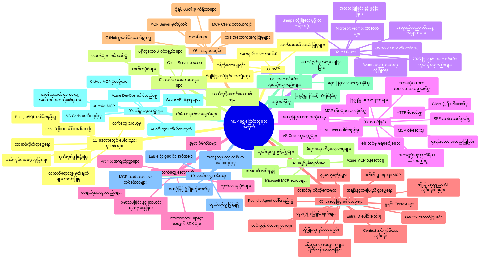

# Model Context Protocol (MCP) for Beginners - Study Guide

ဒီစတဒီလမ်းညွှန်မှာ "Model Context Protocol (MCP) for Beginners" လေ့လာမှုအစီအစဉ်အတွက် repository ဖွဲ့စည်းမှုနဲ့ ပါဝင်သော အကြောင်းအရာများကို အနှစ်ချုပ်ပေးထားပါတယ်။ ဒီလမ်းညွှန်ကို အသုံးပြုပြီး repository ကို ထိရောက်စွာ လမ်းညွှန်သွားနိုင်မယ့်အတွက် အသုံးချနိုင်ပါမယ်။

## Repository Overview

Model Context Protocol (MCP) ဟာ AI မော်ဒယ်နဲ့ client applications တွေရဲ့ အပြန်အလှန်ဆက်သွယ်မှုအတွက် စံချိန်စံညွှန်းတစ်ခုဖြစ်ပါတယ်။ မူရင်းမှာ Anthropic က ဖန်တီးခဲ့ပြီး၊ ယခုမှာ သက်ဆိုင်ရာ MCP အထူးအဖွဲ့ GitHub အဖွဲ့မှ တာဝန်ယူထိန်းသိမ်းနေပါတယ်။ ဒီ repository မှာ C#, Java, JavaScript, Python နဲ့ TypeScript စတဲ့ programming languages တွေမှာ လက်တွေ့ကွက်ကွက်တွေ ပါဝင်တဲ့ သင်ခန်းစာအစီအစဉ်တစ်ခု ပါရှိပြီး AI developer တွေ၊ system architecture နဲ့ software engineer တွေအတွက် တည်ဆောက်ထားပါတယ်။

## Visual Curriculum Map

## Repository Structure

ဒီ repository ကို MCP ရဲ့ အသီးသီး အချက်အလက်အခြေအနေအပေါ် အခြေခံပြီး အဋ္ဌာန(၁၁) ချက် ဒါမှမဟုတ် အပိုင်း(၁၁) ခုတွေအဖြစ် ဖွဲ့စည်းထားပါတယ်။

1. **Introduction (00-Introduction/)**
   - Model Context Protocol ကို အနှစ်ချုပ်ပြောကြားခြင်း
   - AI pipeline တွေမှာ စံချိန်စံညွှန်းပြုလုပ်ခြင်းရဲ့ အရေးကြီးမှု
   - လက်တွေ့ အသုံးချမှုနဲ့ အကျိုးကျေးဇူးများ

2. **Core Concepts (01-CoreConcepts/)**
   - Client-server နေရာချထားပုံ
   - MCP ၏ အဓိက protocol component များ
   - MCP မှာသုံးသော messaging ပုံစံများ

3. **Security (02-Security/)**
   - MCP မှာရှိတဲ့ လုံခြုံရေး အန္တရာယ်များ
   - အကောင်အထည်ဖော်ရာမှာ လုံခြုံရေးအကောင်းဆုံးနည်းလမ်းများ
   - အတည်ပြုခြင်းနှင့် ခွင့်ပြုခြင်းနည်းဗျူဟာများ
   - **လုံခြုံရေး စာတမ်းမြောက်တင်ပြချက်များ**:
     - MCP Security Best Practices 2025
     - Azure Content Safety Implementation Guide
     - MCP Security Controls and Techniques
     - MCP Best Practices Quick Reference
   - **အဓိက လုံခြုံရေး ခေါင်းစဉ်များ**:
     - Prompt injection နဲ့ tool poisoning ရိုက်ခတ်မှုများ
     - Session hijacking နဲ့ confused deputy ပြဿနာများ
     - Token passthrough ခြိမ်းခြောက်မှုများ
     - ခွင့်ပြုချက်များ အသုံးမလိုအောင်နှင့် access control
     - AI ပစ္စည်းအစိတ်အပိုင်းများအတွက် supply chain security
     - Microsoft Prompt Shields ပေါင်းစည်းမှု

4. **Getting Started (03-GettingStarted/)**
   - ပတ်ဝန်းကျင် တည်ဆောက်ခြင်းနှင့် ဖွင့်စက်ရေး
   - အခြေခံ MCP server နဲ့ client အဖန်တီးရေး
   - ရှိပြီးသား application များနှင့် ပေါင်းစည်းခြင်း
   - အပိုင်းများအပါအဝင်：
     - ပထမဆုံး server အသုံးပြုမှု
     - Client ဖန်တီးခြင်း
     - LLM client ပေါင်းစည်းခြင်း
     - VS Code ပေါင်းစည်းခြင်း
     - Server-Sent Events (SSE) server
     - အဆင့်မြင့် server အသုံးပြုမှု
     - HTTP streaming
     - AI Toolkit ပေါင်းစည်းမှု
     - စမ်းသပ် နည်းများ
     - အသုံးပြုမှုလမ်းညွှန်

5. **Practical Implementation (04-PracticalImplementation/)**
   - မတူညီသော programming languages တွေမှာ SDK ကို အသုံးပြုခြင်း
   - debugging, စမ်းသပ်နဲ့ အတည်ပြုနည်းလမ်းများ
   - ပြန်လည်အသုံးပြုနိုင်သော prompt templates နဲ့ workflow များ ဖန်တီးခြင်း
   - လက်တွေ့ project လုပ်ငန်းအတော်များ များပြသခြင်း

6. **Advanced Topics (05-AdvancedTopics/)**
   - context engineering နည်းပညာများ
   - foundry agent ပေါင်းစည်းခြင်း
   - multi-modal AI workflow များ
   - OAuth2 authentication ပုံပြင်
   - real-time ရှာဖွေရေး
   - real-time streaming
   - root context များ ဖန်တီးခြင်း
   - routing နည်းလမ်းများ
   - sampling နည်းများ
   - scaling နည်းလမ်းများ
   - လုံခြုံရေးပြုရန် စဉ်းစားမှုများ
   - Entra ID လုံခြုံရေး ပေါင်းစည်းမှု
   - web search ပေါင်းစည်းခြင်း

7. **Community Contributions (06-CommunityContributions/)**
   - code နဲ့ documentation တွေ အဖြစ် ထည့်သွင်းပံ့ပိုးပေးခြင်းနည်းလမ်းများ
   - GitHub မှတဆင့် ပူးပေါင်းဆောင်ရွက်ခြင်း
   - လူထုမှ တိုးတက်မှုတွေနဲ့ အကောက်အကျယ်ခေါင်းစဉ်များ
   - MCP clients များ (Claude Desktop, Cline, VSCode) အသုံးပြုမှု
   - လူကြိုက်များသော MCP servers (image generation အပါအဝင်) နှင့် ပူးပေါင်းတာဝန်ယူမှု

8. **Lessons from Early Adoption (07-LessonsfromEarlyAdoption/)**
   - လက်တွေ့အသုံးချ ပုံမှန်တွေ နဲ့ အောင်မြင်မှုဇာတ်လမ်းများ
   - MCP အခြေခံ ဖြေရှင်းနည်းများ ဖန်တီးခြင်းနှင့် တင်ပို့ခြင်း
   - လမ်းညွှန်အရွယ်အစားနှင့် အနာဂတ် လမ်းကြောင်း
   - **Microsoft MCP Servers လမ်းညွှန်**: ထုတ်လုပ်မှုအဆင့် Microsoft MCP servers ၁၀ ခုအကြောင်း အပြည့်အစုံ လမ်းညွှန်
     - Microsoft Learn Docs MCP Server
     - Azure MCP Server (၁၅+ အထူး connector များ)
     - GitHub MCP Server
     - Azure DevOps MCP Server
     - MarkItDown MCP Server
     - SQL Server MCP Server
     - Playwright MCP Server
     - Dev Box MCP Server
     - Azure AI Foundry MCP Server
     - Microsoft 365 Agents Toolkit MCP Server

9. **Best Practices (08-BestPractices/)**
   - စွမ်းဆောင်ရည် တိုးတက်မှုနဲ့ အကောင်းဆုံး ပြုပြင်မွမ်းမံမှု
   - MCP system များ fault-tolerant ပုံစံ ဒီဇိုင်းရေးဆွဲခြင်း
   - စမ်းသပ်ခြင်းနဲ့ တည်ကြည်ခံနိုင်မှု နည်းလမ်းများ

10. **Case Studies (09-CaseStudy/)**
    - **MCP ၏ ပြောင်းလဲနိုင်မှုကို သက်သေပြတဲ့ ကိစ္စလေ့လာမှု ရှစ်ခု** 
    - **Azure AI Travel Agents**: Azure OpenAI နဲ့ AI Search ဖြင့် multi-agent စီမံခန့်ခွဲခြင်း
    - **Azure DevOps Integration**: YouTube ဒေတာအသစ်များနှင့် workflow ကို automate လုပ်ခြင်း
    - **Real-Time Documentation Retrieval**: Python console client နဲ့ HTTP streaming
    - **Interactive Study Plan Generator**: Chainlit web app နဲ့ စကားပြော AI
    - **In-Editor Documentation**: VS Code ပေါင်းစည်းမှုနဲ့ GitHub Copilot workflow များ
    - **Azure API Management**: MCP server ဖန်တီးပြီး(entryprise API ပေါင်းစည်းမှု)
    - **GitHub MCP Registry**: ecosystem တည်ဆောက်ခြင်းနှင့် agentic ပေါင်းစည်းမှု
    - စနစ်တကျဖြင့် enterprise ပေါင်းစည်းမှု၊ developer ထုတ်လုပ်မှုနှင့် ecosystem တိုးတက်မှုအတွက် ရိုးရှင်းပြီးနည်းလမ်းများ

11. **Hands-on Workshop (10-StreamliningAIWorkflowsBuildingAnMCPServerWithAIToolkit/)**
    - MCP နဲ့ AI Toolkit ပေါင်းစပ်ထားသည့် လက်တွေ့လုပ်ငန်းရုံတက်ပွဲ
    - AI မော်ဒယ်များနဲ့ လက်တွေ့ကိရိယာများ ဆက်စပ်နိုင်စေနေတဲ့ အသိဉာဏ်ပြည့်စုံသော app များ ဖန်တီးခြင်း
    - အခြေခံများ၊ စိတ်ကြိုက် server ဖန်တီးမှုနဲ့ အထွေထွေ ထုတ်လုပ်မှုနည်းလမ်းများ အကြောင်း တတ်ကျွမ်းစေသော ပိုင်းများ
    - **Lab Structure**:
      - Lab 1: MCP Server အခြေခံအယူအဆ
      - Lab 2: အဆင့်မြင့် MCP Server ဖန်တီးခြင်း
      - Lab 3: AI Toolkit ပေါင်းစည်းခြင်း
      - Lab 4: ထုတ်လုပ်မှုပြုလုပ်ခြင်းနဲ့ စံချိန်ညှိခြင်း
    - Lab များအလိုက် လေ့လာမှုနည်းပညာ

12. **MCP Server Database Integration Labs (11-MCPServerHandsOnLabs/)**
    - PostgreSQL ပေါင်းစည်းထားသည့် ထုတ်လုပ်မှုအဆင့် MCP server များ ဖန်တီးသင်ကြားရန် အဆင့်ဆင့် ၁၃-လက်တွေ့ Lab
    - Zava Retail အကောင်အထည်ဖော်မှုမှ Retail analytics တရားဝင် လိုအပ်ချက်တွေ
    - Enterprise အဆင့် pattern များ (Row Level Security (RLS), semantic search, multi-tenant data access)
    - **Lab များ အပြည့်အစုံ**:
      - Labs 00-03: အခြေခံများ - နိဒါန်း၊ ပုံစံ၊ လုံခြုံရေး၊ ပတ်ဝန်းကျင် စတင်ခြင်း
      - Labs 04-06: MCP Server ဖန်တီးခြင်း - ဒေတာဘေ့စ် ဒီဇိုင်း၊ MCP Server အကောင်အထည်ဖော်ခြင်း၊ ကိရိယာ ဖန်တီးခြင်း
      - Labs 07-09: အဆင့်မြင့် feature များ - Semantic Search, စမ်းသပ်တင်ပြခြင်း၊ VS Code ပေါင်းစည်းခြင်း
      - Labs 10-12: ထုတ်လုပ်မှုနဲ့ အကောင်းဆုံး လုပ်ထုံးလုပ်နည်းများ - တင်ပို့ခြင်း၊ မော်နီတာ၊ စံချိန်ညှိခြင်း
    - **အသုံးပြုနိုင်သော နည်းပညာများ**: FastMCP framework, PostgreSQL, Azure OpenAI, Azure Container Apps, Application Insights
    - **သင်ယူရနိုင်သော အကျိုးအမြတ်များ**: ထုတ်လုပ်မှုအဆင့် MCP servers, ဒေတာဘေ့စ် ပေါင်းစည်းမှု နည်းပညာများ၊ AI ပါဝင်သော analytics, enterprise လုံခြုံရေး

## Additional Resources

Repository မှာ ထောက်ပံ့ပစ္စည်းများ ပါဝင်သည် -

- **ဓာတ်ပုံဖိုဒါ**: သင်ခန်းစာတွင် အသုံးပြုသော ပုံပညာဆွဲပုံများ
- **ဘာသာပြန်ဆိုင်ရာ**: စာတမ်းများအတွက် များစွာသော ဘာသာစကားအတွက် အလိုအလျောက် ဘာသာပြန်ခြင်း
- **တရားဝင် MCP Resources**:
  - [MCP Documentation](https://modelcontextprotocol.io/)
  - [MCP Specification](https://spec.modelcontextprotocol.io/)
  - [MCP GitHub Repository](https://github.com/modelcontextprotocol)

## How to Use This Repository

1. **တိုးတက်စိတ်ဝင်စားပြီး သင်ယူရန်**: 00 မှ 11 အထိ အပိုင်းများကို တစိတ်တပိုင်းလိုက်နာဖတ်ပါ။
2. **ဘာသာစကားအပေါ် အထူးစိတ်ဝင်စားပါက**: မိမိနှစ်သက်ရာ programming language အတွက် samples directory များတွင် ကျွမ်းကျင်မှုရှိစေလေ့လာပါ။
3. **လက်တွေ့လုပ်ဆောင်ရန်**: "Getting Started" အပိုင်းကနေ စတင်၍ ပတ်ဝန်းကျင်တည်ဆောက်ပြီး ပထမဆုံး MCP server နဲ့ client ဖန်တီးပါ။
4. **အဆင့်မြင့် ချဲ့ထွင်ရန်**: အခြေခံကို နားလည်ပြီးရင် advanced topic များကို လေ့လာစောင့်ကြည့်ပါ။
5. **လူထုနှင့် ပူးပေါင်းဆောင်ရွက်ရန်**: MCP community GitHub discussion နဲ့ Discord channel တွေမှာ ဝင်ရောက်ပြီး ကျွမ်းကျင်သူတွေနဲ့ အခြား developer တွေနဲ့ ဆက်သွယ်ပါ။

## MCP Clients and Tools

သင်ခန်းစာတွင် ပါဝင်သည့် MCP client များနဲ့ tool များမှာ -

1. **တရားဝင် Clients**:
   - Visual Studio Code
   - MCP in Visual Studio Code
   - Claude Desktop
   - Claude in VSCode
   - Claude API

2. **အဖွဲ့အစည်း Clients**:
   - Cline (terminal-based)
   - Cursor (code editor)
   - ChatMCP
   - Windsurf

3. **MCP စီမံခန့်ခွဲ Tools**:
   - MCP CLI
   - MCP Manager
   - MCP Linker
   - MCP Router

## Popular MCP Servers

Repository တွင် မိတ်ဆက်ထားသော MCP servers များမှာ -

1. **တရားဝင် Microsoft MCP Servers**:
   - Microsoft Learn Docs MCP Server
   - Azure MCP Server (၁၅+ အထူး connector များ)
   - GitHub MCP Server
   - Azure DevOps MCP Server
   - MarkItDown MCP Server
   - SQL Server MCP Server
   - Playwright MCP Server
   - Dev Box MCP Server
   - Azure AI Foundry MCP Server
   - Microsoft 365 Agents Toolkit MCP Server

2. **တရားဝင် ဥပမာ Servers**:
   - Filesystem
   - Fetch
   - Memory
   - Sequential Thinking

3. **ပုံရိပ်ဖန်တီးခြင်း**:
   - Azure OpenAI DALL-E 3
   - Stable Diffusion WebUI
   - Replicate

4. **ဖန်တီးရေး ကိရိယာများ**:
   - Git MCP
   - Terminal Control
   - Code Assistant

5. **အထူး server များ**:
   - Salesforce
   - Microsoft Teams
   - Jira & Confluence

## Contributing

ဒီ repository မှာ လူထုဆိုင်ရာ ပံ့ပိုးမှုများကို လက်ခံကြပါတယ်။ MCP ecosystem မှ တာဝန်ယူ ပံ့ပိုးပေးနိုင်ဖို့ Community Contributions အပိုင်းကို ကြည့်ပါ။

----

*ဒီ စတဒီလမ်းညွှန်ကို နောက်ဆုံးပြင်ဆင်ထားတာ February 5, 2026 ရက်နေ့ဖြစ်ပြီး MCP Specification 2025-11-25 အတွက် နောက်ဆုံးအချက်အလက်များအရ ဖြစ်ပါတယ်။ Repository အကြောင်းအရာများကို ထိုနေ့မှ ပြင်ဆင်တိုးချဲ့မှုများ ဖြစ်ပေါ်နိုင်ပါသည်။*

---

<!-- CO-OP TRANSLATOR DISCLAIMER START -->
**အဆိုပြုချက်**  
ဤစာရွက်စာတမ်းကို AI ဘာသာပြန်ဝန်ဆောင်မှု [Co-op Translator](https://github.com/Azure/co-op-translator) အသုံးပြု၍ ဘာသာပြန်ထားပါသည်။ ကျွန်ုပ်တို့က တိကျမှုအတွက် ထိန်ချုပ်ကြိုးစားပေမယ့်၊ စက်မှ ဘာသာပြန်ခြင်းမှ ဖြစ်ပေါ်နိုင်သည့် အမှားများ သို့မဟုတ် မှားယွင်းချက်များ ရှိနိုင်ကြောင်း ကျေးဇူးပြု၍ သိရှိထားပါရန်။ မူရင်းစာရွက်စာတမ်းသည် အစစ်အမှန်နှင့် တာဝန်ရှိသည့် အရင်းအမြစ်အဖြစ် စဉ်းစားရမည်။ အရေးကြီးသော သတင်းအချက်အလက်များအတွက် ကျွမ်းကျင်သော လူသားဘာသာပြန်ခြင်းကို အကြံပြုပါသည်။ ဤဘာသာပြန်ချက်ကို အသုံးပြုမှုကြောင့် ဖြစ်ပေါ်သော နားလည်မှုမှားခြင်းများ သို့မဟုတ် မှားနှုတ်ချက်များအတွက် ကျွန်ုပ်တို့ တာဝန်မယူပါ။
<!-- CO-OP TRANSLATOR DISCLAIMER END -->