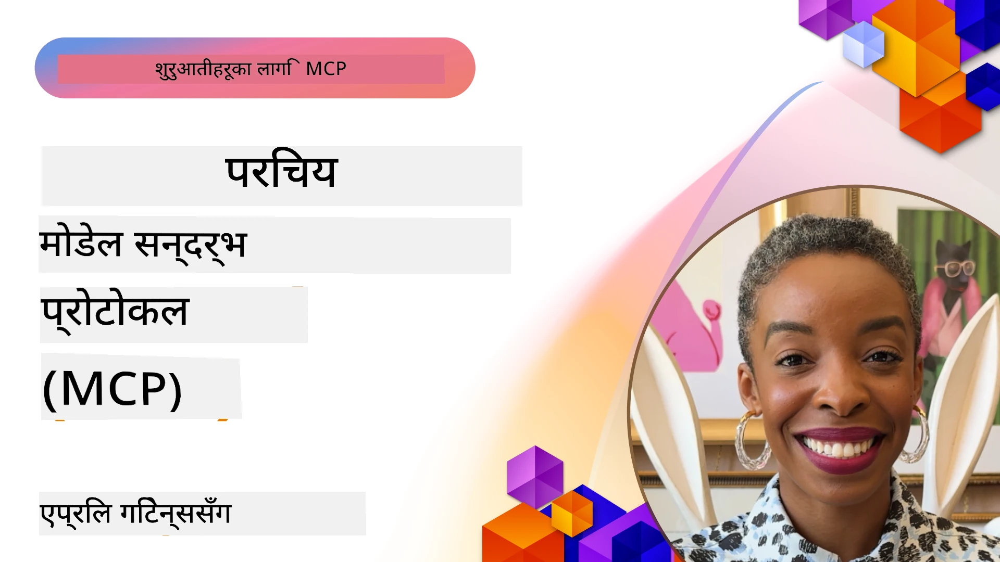
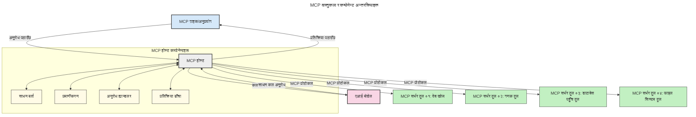

# मोडेल कन्टेक्स्ट प्रोटोकल (MCP) परिचय: स्केलेबल AI एप्लिकेसनहरूका लागि किन यो महत्त्वपूर्ण छ

[](https://youtu.be/agBbdiOPLQA)

_(यो पाठको भिडियो हेर्न माथिको तस्वीरमा क्लिक गर्नुहोस्)_

जेनेरेटिभ AI एप्लिकेसनहरू ठूलो प्रगति हुन पुगेका छन् किनभने ती प्रायः प्रयोगकर्तालाई प्राकृतिक भाषा प्रॉम्प्टहरू प्रयोग गरेर एपसँग अन्तरक्रिया गर्न अनुमति दिन्छन्। यद्यपि, यस्ता एपहरूमा थप समय र स्रोतहरू लगानी गरिहँदा, तपाईंले यस्ता प्रकारले कार्यक्षमताहरू र स्रोतहरू सजिलैसँग एकीकृत गर्न सक्नुहुन्छ भनेर सुनिश्चित गर्न चाहनुहुन्छ जसले विस्तार गर्न सजिलो होस्, तपाईंको एपले एउटै भन्दा बढी मोडेलहरूलाई सम्हाल्न सकोस्, र विभिन्न मोडेल जटिलताहरूलाई व्यवस्थापन गर्न सकोस्। संक्षेपमा भन्नुपर्दा, जेनेरेटिभ AI एप निर्माण गर्न सुरुमा सजिलो हुन्छ, तर जति तिनीहरू बढ्छन् र जटिल बन्छन्, तपाईंले एउटा वास्तुकला परिभाषित गर्न थाल्नुपर्ने हुन्छ र सम्भवतया तपाईंको एपहरूलाई एकसमान तरिकाले बनाउन एक मानकमा निर्भर रहनुपर्ने हुन्छ। यहाँ MCP ले कुराहरू व्यवस्थित गर्न र एक मानक प्रदान गर्न भूमिका खेल्दछ।

---

## **🔍 मोडेल कन्टेक्स्ट प्रोटोकल (MCP) के हो?**

**मोडेल कन्टेक्स्ट प्रोटोकल (MCP)** एउटा **खुला, मानकीकृत अन्तरफलक (इंटरफेस)** हो जुन ठूला भाषा मोडेलहरू (LLMs) लाई बाह्य उपकरणहरू, API हरू, र डाटा स्रोतहरूसँग सहजै अन्तरक्रिया गर्न अनुमति दिन्छ। यसले AI मोडेलको कार्यक्षमता तिनीहरूको प्रशिक्षण डाटाबाट बाहिर विस्तार गर्न एक समान वास्तुकला प्रदान गर्दछ, जसले बुद्धिमान, स्केलेबल, र चञ्चल AI प्रणालीहरू सक्षम बनाउँछ।

---

## **🎯 AI मा मानकीकरण किन आवश्यक छ**

जेनेरेटिभ AI एपहरू जति जटिल बन्दैछन्, त्यति त्यस्ता मानकहरू अपनाउनु जरूरी हुन्छ जुन **स्केलेबिलिटी, विस्तारयोग्यता, मर्मतयोग्यता,** र **भेन्डर लक-इनबाट बचाउने** सुनिश्चित गर्छ। MCP यी आवश्यकताहरूलाई सम्बोधन गर्दछ:

- मोडेल-उपकरण एकीकरणलाई एकीकृत गरेर
- कमजोर, एक पटकका अनुकूलन समाधानहरू घटाएर
- विभिन्न भेन्डरका धेरै मोडेलहरू एउटै वातावरणमा एकैसाथ चल्न दिन्छ

**सूचना:** MCP आफैँलाई खुला मानकको रूपमा प्रस्तुत गर्दछ तर यो कुनै पनि विद्यमान मानक निकायहरू जस्तै IEEE, IETF, W3C, ISO वा अन्य कुनै मानक निकायद्वारा मानकीकरण गर्ने कुनै योजना छैन।

---

## **📚 सिक्ने उद्देश्यहरू**

यस लेख समाप्तिमा तपाईं सक्षम हुनुहुनेछ:

- **मोडेल कन्टेक्स्ट प्रोटोकल (MCP)** र यसको प्रयोगका मामिलाहरू परिभाषित गर्न
- MCP ले मोडेल-टुल संवादलाई कसरी मानकीकृत गर्छ बुझ्न
- MCP वास्तुकलाका मुख्य तत्वहरू चिन्हित गर्न
- उद्यम र विकास सन्दर्भमा MCP का वास्तविक विश्व प्रयोगहरू अन्वेषण गर्न

---

## **💡 मोडेल कन्टेक्स्ट प्रोटोकल (MCP) किन क्रान्तिकारी छ**

### **🔗 MCP ले AI अन्तरक्रियामा विभाजन समस्या समाधान गर्छ**

MCP अघि, मोडेलहरूलाई उपकरणहरूसँग एकीकृत गर्न आवश्यक थियो:

- प्रत्येक उपकरण-मोडेल जोडीका लागि अनुकूलित कोड लेख्नु
- प्रत्येक भेन्डरका लागि गैर-मानकीकृत API
- अपडेटहरूका कारण बारम्बार ब्रेक हुनु
- धेरै उपकरणहरूसँग कमजोर स्केलेबिलिटी

### **✅ MCP मानकीकरणका फाइदाहरू**

| **फाइदा**              | **वर्णन**                                                                   |
|--------------------------|----------------------------------------------------------------------------|
| अन्तरसम्प्रेषणयोग्यता      | LLM हरू विभिन्न भेन्डरका उपकरणहरूसँग सहजै काम गर्छन्                      |
| समानता                  | प्लेटफर्म र उपकरणहरूमा एकरूप व्यवहार                                       |
| पुन: प्रयोगयोग्यता           | उपकरणहरू एक पटक बनाइएकाले फरक परियोजना र सिस्टमहरूमा प्रयोग गर्न सकिन्छ |
| विकास छिटो गर्नु           | मानकीकृत, प्लग-एण्ड-प्ले अन्तरफलक प्रयोग गरेर विकास समय घटाउँछ               |

---

## **🧱 उच्च-स्तरीय MCP वास्तुकला अवलोकन**

MCP एउटा **क्लाइंट-सर्भर मोडेल** पछ्याउँछ, जहाँ:

- **MCP होस्टहरू** AI मोडेलहरू चलाउँछन्
- **MCP क्लाइंटहरू** अनुरोध सुरु गर्छन्
- **MCP सर्भरहरू** कन्टेक्स्ट, उपकरणहरू, र क्षमताहरू सेवा दिन्छन्

### **मुख्य तत्वहरू:**

- **स्रोतहरू** – स्थिर वा गतिको डाटा मोडेलहरूका लागि  
- **प्रॉम्प्टहरू** – मार्गनिर्देशित जेनेरेसनका लागि पूर्वनिर्धारित कार्यप्रवाहहरू  
- **उपकरणहरू** – खोज, गणना जस्ता कार्यान्वयन योग्य कार्यहरू  
- **सैम्प्लिङ** – पुनरावृत्ति अन्तरक्रियाद्वारा एजेन्टिक व्यवहार
- **एलिसिटेसन** – प्रयोगकर्ताबाट अनुरोध लिने सर्भर आरम्भित प्रक्रिया
- **रूट्स** – सर्भर पहुँच नियन्त्रणका लागि फाइल सिस्टम सीमाना

### **प्रोटोकल वास्तुकला:**

MCP दुई-स्तर वास्तुकला प्रयोग गर्छ:
- **डेटा तह**: JSON-RPC 2.0 आधारित सञ्चार लाइफसाइकल व्यवस्थापन र प्रिमिटिभहरूसँग
- **ट्रान्सपोर्ट तह**: STDIO (स्थानीय) र SSE सहित स्ट्रिमेबल HTTP (रिमोट) सञ्चार च्यानलहरू

---

## MCP सर्भर कसरी काम गर्छ

MCP सर्भरहरू निम्न तरिकाले सञ्चालन हुन्छन्:

- **अनुरोध प्रवाह**:
    1. अनुरोध अन्त प्रयोगकर्ता वा तिनको प्रतिनिधि सफ्टवेयरले सुरु गर्दछ।
    2. **MCP क्लाइंट** अनुरोध **MCP होस्ट** मा पठाउँछ, जुन AI मोडेल रनटाइम प्रबन्ध गर्छ।
    3. **AI मोडेल** प्रयोगकर्ता प्रॉम्प्ट प्राप्त गरी, बाह्य उपकरण वा डाटामा पहुँचको लागि एक वा बढी उपकरण कल गर्न सक्छ।
    4. **MCP होस्ट** प्रत्यक्ष मोडेल होइन, उपयुक्त **MCP सर्भर(हरू)** सँग मानकीकृत प्रोटोकल प्रयोग गरेर संवाद गर्छ।
- **MCP होस्ट कार्यक्षमता**:
    - **उपकरण रजिष्ट्रि**: उपलब्ध उपकरणहरू र तिनीहरूको क्षमता सूचीबद्ध गर्छ।
    - **प्रमाणीकरण**: उपकरण पहुँचका अनुमति जाँच गर्दछ।
    - **अनुरोध ह्यान्डलर**: मोडेलबाट आउने उपकरण अनुरोधहरू प्रक्रिया गर्छ।
    - **प्रतिक्रिया फर्म्याटर**: उपकरणबाट प्राप्त आउटपुट मोडेलले बुझ्ने ढाँचामा संरचना गर्छ।
- **MCP सर्भर कार्यान्वयन**:
    - **MCP होस्ट** उपकरण कलहरू एउटाभन्दा बढी **MCP सर्भरहरू** तर्फ निर्देशन गर्छ, प्रत्येकले खोज, गणना, डाटाबेस सोधपुछ जस्ता विशेष कार्यहरू प्रदर्शन गर्छ।
    - **MCP सर्भरहरू** आफ्नो कार्यहरू पूरा गरी नतिजा **MCP होस्ट**लाई नियमित ढाँचामा फर्काउँछन्।
    - **MCP होस्ट** यी नतिजाहरूलाई फर्म्याट गरी AI मोडेललाई पठाउँछ।
- **प्रतिक्रिया पूर्णता**:
    - **AI मोडेल** उपकरण आउटपुटलाई अन्तिम प्रतिक्रियामा समावेश गर्छ।
    - **MCP होस्ट** यस प्रतिक्रियालाई फर्काएर **MCP क्लाइंट** मार्फत अन्त प्रयोगकर्ता वा कल गर्ने सफ्टवेयरलाई दिन्छ।

    


## 👨‍💻 MCP सर्भर कसरी बनाउने (उदाहरणसहित)

MCP सर्भरहरूले LLM क्षमताहरू डाटा र कार्यक्षमता प्रदान गरेर विस्तार गर्न अनुमति दिन्छ।

परीक्षण गर्न तयार? यहाँ विभिन्न भाषा/स्ट्याकका लागि SDK हरू छन् जुन साधारण MCP सर्भरहरू निर्माण गर्ने उदाहरणहरूसहित:

- **Python SDK**: https://github.com/modelcontextprotocol/python-sdk

- **TypeScript SDK**: https://github.com/modelcontextprotocol/typescript-sdk

- **Java SDK**: https://github.com/modelcontextprotocol/java-sdk

- **C#/.NET SDK**: https://github.com/modelcontextprotocol/csharp-sdk


## 🌍 MCP को वास्तविक विश्व प्रयोगका मामिलाहरू

MCP AI क्षमताहरू विस्तार गरेर विभिन्न प्रकारका अनुप्रयोगहरू सक्षम बनाउँछ:

| **अनुप्रयोग**                | **वर्णन**                                                                      |
|------------------------------|--------------------------------------------------------------------------------|
| उद्यम डाटा एकीकरण            | LLM लाई डेटाबेसहरू, CRM, वा आन्तरिक उपकरणहरूसँग जोड्न                           |
| एजेन्टिक AI प्रणालीहरू        | उपकरण पहुँच र निर्णय प्रक्रियाका लागि स्वतन्त्र एजेन्टहरू सक्षम बनाउने          |
| बहु-मोडाल अनुप्रयोगहरू       | पाठ, छवि, र अक्सन उपकरणहरूलाई एउटै एकीकृत AI एपमा संयोजन गर्ने                |
| वास्तविक-समय डाटा एकीकरण    | AI अन्तरक्रियामा वर्तमान र सही परिणामका लागि प्रत्यक्ष डाटा ल्याउने               |


### 🧠 MCP = AI अन्तरक्रियाका लागि सार्वभौमिक मानक

मोडेल कन्टेक्स्ट प्रोटोकल (MCP) AI अन्तरक्रियाका लागि एक सार्वभौमिक मानकको रूपमा काम गर्छ, जस्तै USB-C ले उपकरणहरूको भौतिक जडानलाई मानकीकृत गर्यो। AI को दुनियाँमा, MCP एक स्थिर अन्तरफलक प्रदान गर्छ, जसले मोडेलहरू (क्लाइंटहरू) लाई बाह्य उपकरणहरू र डाटा प्रदायकहरू (सर्भरहरू) सँग सहजै एकीकृत गराउँछ। यसले प्रत्येक API वा डाटा स्रोतका लागि फरक, अनुकूलित प्रोटोकलहरूको आवश्यकता हटाउँछ।

MCP अन्तर्गत, MCP सँग मिल्ने उपकरण (जसलाई MCP सर्भर भनिन्छ) एउटै मानक मापदण्डअनुसार काम गर्छ। यी सर्भरहरूले आफूले प्रदान गर्ने उपकरण वा क्रियाहरू सूचीबद्ध गर्न सक्छन् र AI एजेन्टबाट अनुरोध हुँदा ती कार्यहरू कार्यान्वयन गर्छन्। MCP समर्थन गर्ने AI एजेन्ट प्लेटफर्महरूले उपलब्ध उपकरणहरू पत्ता लगाउन र यस्तो मानकीकृत प्रोटोकल मार्फत तिनीहरूलाई कल गर्न सक्षम छन्।

### 💡 ज्ञान पहुँचमा सहजता

उपकरणहरू उपलब्ध गराउनुका साथै, MCP ज्ञान पहुँचमा पनि सहजता प्रदान गर्छ। यसले अनुप्रयोगहरूलाई ठूला भाषा मोडेलहरूसँग विभिन्न डाटा स्रोतहरू लिंक गरेर सन्दर्भ प्रदान गर्ने अनुमति दिन्छ। उदाहरणका लागि, एउटा MCP सर्भर कम्पनीको कागजात सञ्चयनस्थान प्रतिनिधित्व गर्न सक्छ, जसले एजेन्टहरूलाई आवश्यक जानकारी माग गर्दा प्राप्त गर्न अनुमति दिन्छ। अर्को सर्भरले इमेल पठाउने वा अभिलेख अपडेट गर्ने जस्ता विशिष्ट कार्यहरू गर्न सक्छ। एजेन्टको दृष्टिकोणमा, यी केवल उपकरणहरू हुन् — केही उपकरणहरू डाटा (ज्ञान सन्दर्भ) फर्काउँछन् भने अन्य कार्यहरू गर्छन्। MCP दुबैलाई प्रभावकारी रूपमा व्यवस्थापन गर्छ।

एजेन्टले एउटा MCP सर्भरमा जडान हुँदा, प्रोटोकलका माध्ययमबाट सर्भरको उपलब्ध क्षमता र पहुँचयोग्य डाटा स्वतः सिक्छ। यस मानकीकरणले गतिशील उपकरण उपलब्धता सम्भव बनाउँछ। उदाहरणका लागि, एजेन्टको प्रणालीमा नयाँ MCP सर्भर थप्दा, त्यसका कार्यहरू तुरुन्त प्रयोगयोग्य हुन्छन्, एजेन्ट निर्दिष्टीकरण फेरबदल बिना।

यो एकीकृत प्रवाह तलको चित्रमा देखाइएको छ, जहाँ सर्भरहरूले उपकरण र ज्ञान दुवै प्रदान गर्छन्, प्रणालीहरूबीच सहज सहकार्य सुनिश्चित गर्दै।

### 👉 उदाहरण: स्केलेबल एजेन्ट समाधान

```mermaid
---
title: MCP सहित स्केलेबल एजेन्ट समाधान
description: एक डायग्राम जसले देखाउँछ कसरी प्रयोगकर्ता LLM सँग अन्तरक्रिया गर्छ जुन बहु MCP सर्भरहरूसँग जडान हुन्छ, प्रत्येक सर्भरले ज्ञान र उपकरणहरू प्रदान गर्दछ, स्केलेबल AI प्रणाली वास्तुकला सिर्जना गर्दै
---
graph TD
    User -->|प्रॉम्प्ट| LLM
    LLM -->|प्रतिक्रिया| User
    LLM -->|MCP| ServerA
    LLM -->|MCP| ServerB
    ServerA -->|विश्वव्यापी कनेक्टर| ServerB
    ServerA --> KnowledgeA
    ServerA --> ToolsA
    ServerB --> KnowledgeB
    ServerB --> ToolsB

    subgraph Server A
        KnowledgeA[ज्ञान]
        ToolsA[उपकरणहरू]
    end

    subgraph Server B
        KnowledgeB[ज्ञान]
        ToolsB[उपकरणहरू]
    end
``` युनिभर्सल कनक्टरले MCP सर्भरहरूलाई आपसमा संवाद गर्न र क्षमताहरू साझेदारी गर्न सक्षम बनाउँछ, जसले ServerA लाई ServerB लाई काम सुम्पन वा यसको उपकरण र ज्ञान पहुँच गर्न अनुमति दिन्छ। यसले सर्भरहरूबीच उपकरण र डाटा संघटन गर्दछ, स्केलेबल र मोड्युलर एजेन्ट वास्तुकलाहरू समर्थन गर्दै। किनभने MCP ले उपकरण पहुँच मानकीकृत गर्छ, एजेन्टहरूले गतिशील रूपमा उपकरण पत्ता लगाउन र सर्भरहरूबीच अनुरोध मार्गदर्शन गर्न सक्छन् बिना हार्डकोड गरिएको एकीकरण।

उपकरण र ज्ञान संघटन: उपकरण र डाटालाई सर्भरहरु छिचोल्दै पहुँच गर्न सकिन्छ, जसले स्केलेबल र मोड्युलर एजेन्ट संरचनाहरू सम्भव बनाउँछ।

### 🔄 क्लाइंट-साइड LLM एकीकरणसहित उन्नत MCP परिदृश्यहरू

आधारभूत MCP वास्तुकलाभन्दा पर, त्यहाँ उन्नत परिदृश्यहरू छन् जहाँ दुवै क्लाइंट र सर्भरमा LLM हुन्छन्, जसले अझ परिष्कृत अन्तरक्रिया सक्षम बनाउँछ। तलको चित्रमा, **क्लाइंट एप** IDE हुन सक्छ जहाँ प्रयोगकर्ताको लागि धेरै MCP उपकरणहरू उपलब्ध छन्:

```mermaid
---
title: ग्राहक-सेवा LLM एकीकरणसहित उन्नत MCP परिदृश्यहरू
description: प्रयोगकर्ता, क्लाइन्ट अनुप्रयोग, क्लाइन्ट LLM, बहुविध MCP सर्भरहरू, र सर्भर LLM बीचको विवरणात्मक अन्तरक्रिया प्रवाह देखाउने अनुक्रमिका आरेख, उपकरण पत्ता लगाउने, प्रयोगकर्ता अन्तरक्रिया, सिधा उपकरण कल गर्ने, र सुविधाहरूको नेगोशियसन चरणहरू देखाउँदै
---
sequenceDiagram
    autonumber
    actor User as 👤 प्रयोगकर्ता
    participant ClientApp as 🖥️ क्लाइन्ट अनुप्रयोग
    participant ClientLLM as 🧠 क्लाइन्ट LLM
    participant Server1 as 🔧 MCP सर्भर १
    participant Server2 as 📚 MCP सर्भर २
    participant ServerLLM as 🤖 सर्भर LLM
    
    %% Discovery Phase
    rect rgb(220, 240, 255)
        Note over ClientApp, Server2: उपकरण पत्ता लगाउने चरण
        ClientApp->>+Server1: उपलब्ध उपकरण/स्रोतहरूको अनुरोध
        Server1-->>-ClientApp: उपकरण सूची फिर्ता (JSON)
        ClientApp->>+Server2: उपलब्ध उपकरण/स्रोतहरूको अनुरोध
        Server2-->>-ClientApp: उपकरण सूची फिर्ता (JSON)
        Note right of ClientApp: संयुक्त उपकरण<br/>सूची स्थानीय रूपमा भण्डारण गर्नुहोस्
    end
    
    %% User Interaction
    rect rgb(255, 240, 220)
        Note over User, ClientLLM: प्रयोगकर्ता अन्तरक्रिया चरण
        User->>+ClientApp: प्राकृतिक भाषा संकेत प्रविष्ट गर्नुहोस्
        ClientApp->>+ClientLLM: संकेत + उपकरण सूची प्रदान गर्नुहोस्
        ClientLLM->>-ClientLLM: संकेत विश्लेषण र उपकरण चयन गर्नुहोस्
    end
    
    %% Scenario A: Direct Tool Calling
    alt Direct Tool Calling
        rect rgb(220, 255, 220)
            Note over ClientApp, Server1: परिदृश्य A: सिधा उपकरण कल
            ClientLLM->>+ClientApp: उपकरण कार्यान्वयन अनुरोध
            ClientApp->>+Server1: निर्दिष्ट उपकरण चलाउनुहोस्
            Server1-->>-ClientApp: परिणाम फिर्ता
            ClientApp->>+ClientLLM: परिणाम प्रक्रिया गर्नुहोस्
            ClientLLM-->>-ClientApp: प्रतिक्रिया तयार गर्नुहोस्
            ClientApp-->>-User: अन्तिम उत्तर प्रदर्शन गर्नुहोस्
        end
    
    %% Scenario B: Feature Negotiation (VS Code style)
    else Feature Negotiation (VS Code style)
        rect rgb(255, 220, 220)
            Note over ClientApp, ServerLLM: परिदृश्य B: सुविधा वार्ता
            ClientLLM->>+ClientApp: आवश्यक क्षमता चिन्हित गर्नुहोस्
            ClientApp->>+Server2: सुविधाहरू/क्षमताहरूको वार्ता गर्नुहोस्
            Server2->>+ServerLLM: अतिरिक्त प्रसङ्ग अनुरोध
            ServerLLM-->>-Server2: प्रसङ्ग उपलब्ध गराउनुहोस्
            Server2-->>-ClientApp: उपलब्ध सुविधाहरू फिर्ता
            ClientApp->>+Server2: वार्ता गरिएको उपकरणहरू कल गर्नुहोस्
            Server2-->>-ClientApp: परिणाम फिर्ता
            ClientApp->>+ClientLLM: परिणाम प्रक्रिया गर्नुहोस्
            ClientLLM-->>-ClientApp: प्रतिक्रिया तयार गर्नुहोस्
            ClientApp-->>-User: अन्तिम उत्तर प्रदर्शन गर्नुहोस्
        end
    end
```
## 🔐 MCP का व्यवहारिक फाइदाहरू

यहाँ MCP प्रयोग गर्दा पाइने व्यवहारिक फाइदाहरू छन्:

- **ताजगी**: मोडेलहरूले तिनीहरूको प्रशिक्षण डाटाभन्दा बाहिरको अद्यावधिक जानकारी पहुँच गर्न सक्छन्
- **क्षमता विस्तार**: मोडेलहरूले विशेष उपकरणहरू प्रयोग गर्न सक्छन् जुन तिनीहरूलाई प्रशिक्षण गरिएको थिएन
- **हल्युसिनेसन घटाउनु**: बाह्य डाटा स्रोतहरूले तथ्यात्मक आधार प्रदान गर्छन्
- **गोपनीयता**: संवेदनशील डाटा सुरक्षित वातावरणमा रहन सक्छ, प्रॉम्प्टमा समावेश नगरी

## 📌 मुख्य निष्कर्षहरू

MCP प्रयोग गर्दा निम्न मुख्य निष्कर्षहरू छन्:

- **MCP** मोडेल-उपकरण र डाटासँग अन्तरक्रिया गर्ने तरिका मानकीकृत गर्छ
- विस्तारयोग्यता, समरूपता, र अन्तरसम्प्रेषणलाई प्रवर्द्धन गर्छ
- MCP विकास समय घटाउन, विश्वसनीयता सुधार गर्न, र मोडेल क्षमताहरू विस्तार गर्न सहयोग गर्दछ
- क्लाइंट-सर्भर वास्तुकलाले लचकदार, विस्तारयोग्य AI एप्लिकेसन सक्षम बनाउँछ

## 🧠 अभ्यास

तपाईं निर्माण गर्न चाहनुभएको AI एप्लिकेसनको बारेमा सोच्नुहोस्।

- कुन **बाह्य उपकरण वा डाटा** ले यसको क्षमता बढाउन सक्छ?
- MCP ले एकीकरणलाई कसरी **सरल र विश्वसनीय** बनाउन सक्छ?

## अतिरिक्त स्रोतहरू

- [MCP GitHub रिपोजिटरी](https://github.com/modelcontextprotocol)


## अब के होला

अर्को: [अध्याय 1: मुख्य अवधारणाहरू](../01-CoreConcepts/README.md)

---

<!-- CO-OP TRANSLATOR DISCLAIMER START -->
**अस्वीकरण**:
यो दस्तावेज AI अनुवाद सेवा [Co-op Translator](https://github.com/Azure/co-op-translator) प्रयोग गरी अनुवाद गरिएको हो। हामी सटीकताको प्रयास गर्छौं भने पनि, कृपया जानकार हुनुहोस् कि स्वचालित अनुवादमा त्रुटिहरू वा अविश्वसनीयताहरू हुनसक्छन्। मूल भाषामा रहेको दस्तावेजलाई प्रामाणिक स्रोतको रूपमा मान्नुपर्छ। महत्वपूर्ण जानकारीका लागि व्यवसायिक मानव अनुवाद सिफारिश गरिन्छ। यस अनुवादको प्रयोगबाट उत्पन्न हुने कुनै पनि गलतफहमी वा गलत व्याख्याहरूका लागि हामी जिम्मेवार छैनौं।
<!-- CO-OP TRANSLATOR DISCLAIMER END -->