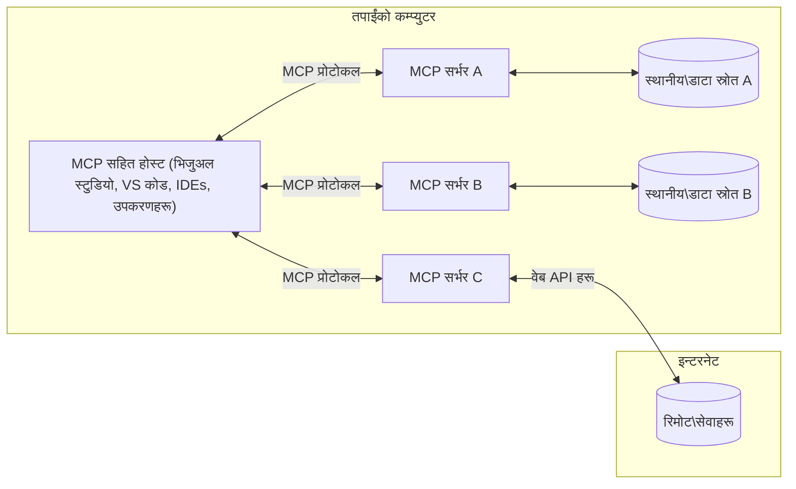

# MCP कोर अवधारणाहरू: AI एकीकरणका लागि मोडेल सन्दर्भ प्रोटोकलमा दक्षता

[](https://youtu.be/earDzWGtE84)

_(यो पाठको भिडियो हेर्न माथिको तस्वीरमा क्लिक गर्नुहोस्)_

[Model Context Protocol (MCP)](https://github.com/modelcontextprotocol) एक शक्तिशाली, मानकीकृत फ्रेमवर्क हो जसले ठूला भाषा मोडेलहरू (LLMs) र बाह्य उपकरणहरू, अनुप्रयोगहरू, र डाटा स्रोतहरू बीचको संचारलाई अनुकूलित गर्दछ।  
यो मार्गदर्शिकाले तपाईंलाई MCP का कोर अवधारणाहरू मार्फत लैजानेछ। तपाईं यसको क्लाइन्ट-सर्भर आर्किटेक्चर, आवश्यक कम्पोनेन्टहरू, संचार प्रक्रिया, र कार्यान्वयनका उत्कृष्ट अभ्यासहरू सिक्नुहुनेछ।

- **स्पष्ट प्रयोगकर्ता स्वीकृति**: सबै डाटा पहुँच र अपरेशनहरू कार्यान्वयन अगाडि स्पष्ट प्रयोगकर्ता अनुमोदनको आवश्यकता हुन्छ। प्रयोगकर्ताहरूले के डाटा पहुँच गरिनेछ र के क्रियाहरू गर्नेछन् स्पष्ट रूपमा बुझ्नुपर्छ, अनुमति र अधिकारहरूमा सूक्ष्म नियन्त्रण सहित।

- **डाटा गोपनियताको संरक्षण**: प्रयोगकर्ताको डाटा केवल स्पष्ट स्वीकृतिसँग मात्र देखापर्दछ र सम्पूर्ण अन्तर्क्रियामा कडा पहुँच नियन्त्रणले सुरक्षित गरिनुपर्छ। कार्यान्वयनहरूले अनधिकृत डाटा प्रसारण रोक्न र कडा गोपनीयता सीमाहरू कायम राख्नुपर्छ।

- **उपकरण कार्यान्वयन सुरक्षा**: प्रत्येक उपकरण आह्वानमा प्रयोगकर्ताको स्पष्ट स्वीकृति आवश्यक छ जसले उपकरणको कार्यक्षमता, प्यारामिटरहरू, र सम्भावित प्रभाव बुझ्न मद्दत गर्छ। कडा सुरक्षा सीमाहरूले अनपेक्षित, असुरक्षित, वा दुर्भावनापूर्ण उपकरण कार्यान्वयन रोक्नुपर्छ।

- **ट्रान्सपोर्ट लेयर सुरक्षा**: सबै सञ्चार च्यानलहरूले उपयुक्त इन्क्रिप्शन र प्रमाणीकरण मेकानिज्महरू प्रयोग गर्नुपर्छ। टाढाका जडानहरूले सुरक्षित ट्रान्सपोर्ट प्रोटोकल र उचित क्रेडेन्सियल व्यवस्थापन लागू गर्नुपर्छ।

#### कार्यान्वयन मार्गदर्शनहरू:

- **अनुमति व्यवस्थापन**: सूक्ष्म अनुमति प्रणालीहरू कार्यान्वयन गर्नुहोस् जसले प्रयोगकर्तालाई कुन सर्भरहरू, उपकरणहरू, र स्रोतहरू पहुँचयोग्य छन् नियन्त्रण गर्न अनुमति दिन्छ  
- **प्रमाणीकरण र अधिकारहरू**: सुरक्षित प्रमाणीकरण विधिहरू (OAuth, API कुञ्जीहरू) उपयुक्त टोकन व्यवस्थापन र समाप्ति संग प्रयोग गर्नुहोस्  
- **इनपुट प्रमाणीकरण**: परिभाषित स्कीमाहरू अनुसार सबै प्यारामिटर र डाटा इनपुटहरू प्रमाणीकरण गर्नुहोस् ताकि इन्जेक्सन आक्रमणहरू रोक्न सकियोस्  
- **लेखा लग राख्ने**: सबै अपरेशनहरूको व्यापक लग राख्नुहोस् सुरक्षा अनुगमन र अनुपालनका लागि  

## अवलोकन

यस पाठले Model Context Protocol (MCP) पारिस्थितिकी तन्त्रको आधारभूत आर्किटेक्चर र कम्पोनेन्टहरूको अन्वेषण गर्दछ। तपाईंले क्लाइन्ट-सर्भर आर्किटेक्चर, मुख्य कम्पोनेन्टहरू, र MCP अन्तर्क्रियाहरूलाई सशक्त बनाउने संचार प्रक्रियाहरूका बारेमा जान्नुहुनेछ।

## मुख्य सिकाइ उद्देश्यहरू

यस पाठको अन्त्य सम्म, तपाईं:

- MCP क्लाइन्ट-सर्भर आर्किटेक्चर बुझ्नुहुनेछ।  
- होस्टहरू, क्लाइन्टहरू, र सर्भरहरूको भूमिका र जिम्मेवारीहरू चिन्हित गर्नुहोस्।  
- MCP लाई लचिलो एकीकरण तह बनाउने मुख्य सुविधाहरू विश्लेषण गर्नुहोस्।  
- MCP पारिस्थितिकी तन्त्रभित्र जानकारी कसरी प्रवाह हुन्छ भन्ने सिक्नुहोस्।  
- .NET, Java, Python, र JavaScript मा कोड उदाहरणहरू मार्फत व्यावहारिक अन्तर्दृष्टि प्राप्त गर्नुहोस्।

## MCP आर्किटेक्चर: गहिरो दृष्टि

MCP पारिस्थितिकी तन्त्र क्लाइन्ट-सर्भर मोडेलमा आधारित छ। यस मोड्युलर संरचनाले AI अनुप्रयोगहरूलाई उपकरणहरू, डेटाबेसहरू, API हरू, र सन्दर्भ स्रोतहरूसँग कुशलतापूर्वक अन्तरक्रिया गर्न अनुमति दिन्छ। अब यस आर्किटेक्चरलाई यसको मुख्य कम्पोनेन्टहरूमा विभाजन गरौं।

यसको केन्द्रबिन्दुमा, MCP ले क्लाइन्ट-सर्भर आर्किटेक्चर अनुसरण गर्दछ जहाँ होस्ट अनुप्रयोगले धेरै सर्भरहरूसँग जडान गर्न सक्छ:


- **MCP होस्टहरू**: VSCode, Claude Desktop, IDE हरू, वा AI उपकरणहरू जसले MCP मार्फत डाटा पहुँच गर्न चाहन्छन्  
- **MCP क्लाइन्टहरू**: प्रोटोकल क्लाइन्टहरूले सर्भरहरूसँग 1:1 जडान कायम राख्छन्  
- **MCP सर्भरहरू**: प्रत्येकले विशिष्ट क्षमताहरू पूर्वनिर्धारित Model Context Protocol मार्फत खुलासा गर्ने हल्का प्रोग्रामहरू  
- **स्थानीय डाटा स्रोतहरू**: तपाईंको कम्प्युटरका फाइलहरू, डेटाबेसहरू, र सेवा जुन MCP सर्भरहरूले सुरक्षित रूपमा पहुँच गर्न सक्छन्  
- **टाढा सेवा**: इन्टरनेट मार्फत उपलब्ध बाह्य प्रणालीहरू जसलाई MCP सर्भरहरूले API मार्फत जडान गर्न सक्छन्।  

MCP प्रोटोकल एउटा विकासशील मापदण्ड हो जसले मिति-आधारित संस्करण (YYYY-MM-DD ढाँचा) प्रयोग गर्दछ। हालको प्रोटोकल संस्करण **2025-11-25** हो। तपाईं [प्रोटोकल विशिष्टता](https://modelcontextprotocol.io/specification/2025-11-25/) मा नयाँ अपडेटहरू हेर्न सक्नुहुन्छ।

### 1. होस्टहरू

Model Context Protocol (MCP) मा, **होस्टहरू** ती AI अनुप्रयोगहरू हुन् जसले प्रयोगकर्तासँग प्रोटोकल मार्फत अन्तरक्रिया गर्नको लागि प्राथमिक इन्टरफेसको रूपमा कार्य गर्छन्। होस्टहरूले धेरै MCP सर्भरहरूसँग जडान व्यवस्थापन गर्छन् र प्रत्येक सर्भर जडानको लागि समर्पित MCP क्लाइन्टहरू सिर्जना गर्छन्। होस्टका उदाहरणहरू:

- **AI अनुप्रयोगहरू**: Claude Desktop, Visual Studio Code, Claude Code  
- **विकास वातावरणहरू**: IDE हरू र MCP एकीकरण भएका कोड सम्पादकहरू  
- **अनुकूलित अनुप्रयोगहरू**: उद्देश्यसहित निर्मित AI एजेन्टहरू र उपकरणहरू  

**होस्टहरू** ती अनुप्रयोगहरू हुन् जसले AI मोडेल अन्तरक्रियाहरू समन्वय गर्छन्। तिनीहरूले:

- **AI मोडेलहरू सञ्चालन गर्छन्**: LLM हरूसँग अन्तरक्रिया गरी प्रतिक्रियाहरू उत्पन्न गर्छन् र AI कार्यप्रवाह समन्वय गर्छन्  
- **क्लाइन्ट जडान व्यवस्थापन गर्छन्**: हरेक MCP सर्भर जडानको लागि एक MCP क्लाइन्ट सिर्जना र कायम राख्छन्  
- **प्रयोगकर्ता इन्टरफेस नियन्त्रण गर्छन्**: संवाद प्रवाह, प्रयोगकर्ता अन्तरक्रिया, र प्रतिक्रिया प्रदर्शन व्यवस्थापन गर्छन्  
- **सुरक्षा लागू गर्छन्**: अनुमतिहरू, सुरक्षा सिमा, र प्रमाणीकरण नियन्त्रण गर्छन्  
- **प्रयोगकर्ता स्वीकृति सम्हाल्छन्**: डाटा साझेदारी र उपकरण कार्यान्वयनको लागि प्रयोगकर्ता अनुमोदन व्यवस्थापन गर्छन्  

### 2. क्लाइन्टहरू

**क्लाइन्टहरू** महत्वपूर्ण कम्पोनेन्टहरू हुन् जसले होस्ट र MCP सर्भरहरू बीच समर्पित एक-देखि-एक जडान कायम गर्छन्। प्रत्येक MCP क्लाइन्ट होस्टले विशिष्ट MCP सर्भरमा जडान गर्न सिर्जना गर्दछ जसले सुव्यवस्थित र सुरक्षित संचार च्यानल सुनिश्चित गर्छ। धेरै क्लाइन्टहरूले होस्टलाई एकै समयमा धेरै सर्भरहरूमा जडान गर्न अनुमति दिन्छ।

**क्लाइन्टहरू** होस्ट अनुप्रयोग भित्र कनेक्टर कम्पोनेन्टहरू हुन्। तिनीहरूले:

- **प्रोटोकल संचार**: सर्भरहरूलाई JSON-RPC 2.0 अनुरोधहरू पठाउँछन् जुन प्रॉम्प्ट र निर्देशनहरू समावेश गर्छ  
- **क्षमता वार्ता**: सुरुमै सर्भरसँग समर्थित सुविधाहरू र प्रोटोकल संस्करणहरूको वार्ता गर्छ  
- **उपकरण कार्यान्वयन**: मोडेलबाट उपकरण कार्य अनुरोध व्यवस्थापन र प्रतिक्रिया प्रक्रिया गर्छ  
- **रियल-टाइम अपडेटहरू**: सर्भरहरूबाट सूचना र रियल-टाइम अपडेटहरू ह्यान्डल गर्छ  
- **प्रतिक्रिया प्रशोधन**: प्रयोगकर्तालाई प्रदर्शनका लागि सर्भर प्रतिक्रिया प्रक्रिया र फारम्याट गर्छ  

### 3. सर्भरहरू

**सर्भरहरू** ती प्रोग्रामहरू हुन् जसले MCP क्लाइन्टहरूलाई सन्दर्भ, उपकरण, र क्षमताहरू प्रदान गर्छन्। तिनीहरू स्थानीय (होस्टसँग एउटै मेसिनमा) वा टाढाका (बाह्य प्लेटफर्महरूमा) चल्न सक्छन् र क्लाइन्ट अनुरोधहरू ह्यान्डल गरी संरचित प्रतिक्रिया प्रदान गर्छन्। सर्भरहरूले मानकीकृत Model Context Protocol मार्फत विशिष्ट कार्यक्षमता खुलासा गर्छन्।

**सर्भरहरू** सेवा हुन् जसले सन्दर्भ र क्षमताहरू प्रदान गर्छन्। तिनीहरूले:

- **विशेषता दर्ता**: क्लाइन्टहरूलाई उपलब्ध प्राथमिक स्रोतहरू (स्रोतहरू, प्रॉम्प्ट, उपकरणहरू) दर्ता र खुलासा गर्छन्  
- **अनुरोध प्रक्रिया**: क्लाइन्टहरूबाट उपकरण कॉल, स्रोत अनुरोध, र प्रॉम्प्ट अनुरोध प्राप्त गरी कार्यान्वयन गर्छन्  
- **सन्दर्भ व्यवस्था**: मोडेल प्रतिक्रियाहरूलाई बढावा दिन सन्दर्भगत सूचना र डाटा प्रदान गर्छन्  
- **अवस्था व्यवस्थापन**: सत्र अवस्था कायम राख्छन् र आवश्यकतामा राज्यपूर्ण अन्तर्क्रियाहरू ह्यान्डल गर्छन्  
- **रियल-टाइम सूचनाहरू**: क्षमतामा परिवर्तन र अपडेटहरूको सूचना जडित क्लाइन्टहरूलाई पठाउँछन्  

सर्भरहरूलाई कुनै पनि व्यक्तिले विकास गर्न सक्छ जसले मोडेल क्षमताहरूलाई विशेष कार्यक्षमतासँग विस्तार गर्न सक्छ, र तिनीहरूले स्थानीय र टाढाको दुवै परिदृश्य समर्थन गर्छन्।

### 4. सर्भर प्राथमिक स्रोतहरू

Model Context Protocol (MCP) का सर्भरहरूले तीन कोर **प्राथमिक स्रोतहरू** प्रदान गर्छन् जुन क्लाइन्ट, होस्ट, र भाषा मोडेलहरू बीच धनी अन्तरक्रियाहरूका लागि आधारभूत ब्लकहरू परिभाषित गर्छन्। यी प्राथमिक स्रोतहरूले प्रोटोकल मार्फत उपलब्ध सन्दर्भगत जानकारी र क्रियाहरूको प्रकार निर्दिष्ट गर्छन्।

MCP सर्भरहरूले तलका कुनै पनि तीन कोर प्राथमिक स्रोतहरूको संयोजन खोल्न सक्छन्:

#### स्रोतहरू 

**स्रोतहरू** ती डाटा स्रोतहरू हुन् जसले AI अनुप्रयोगहरूलाई सन्दर्भगत जानकारी प्रदान गर्छन्। तिनीहरूले स्थिर वा गतिशील सामग्री प्रतिनिधित्व गर्छन् जसले मोडेल समझ र निर्णयमा सुधार ल्याउँछन्:

- **सन्दर्भगत डाटा**: AI मोडेल खपतको लागि संरचित सूचना र सन्दर्भ  
- **ज्ञान भण्डारहरू**: डकुमेन्ट रिपोजिटोरीहरू, लेखहरू, म्यानुअलहरू, र अनुसन्धान कागजातहरू  
- **स्थानीय डाटा स्रोतहरू**: फाइलहरू, डेटाबेसहरू, र स्थानीय प्रणाली जानकारी  
- **बाह्य डाटा**: API प्रतिक्रियाहरू, वेब सेवाहरू, र टाढाको प्रणाली डाटा  
- **गतिशील सामग्री**: बाह्य अवस्थाहरूको आधारमा अपडेट हुने रियल-टाइम डाटा  

स्रोतहरू URI द्वारा पहिचान गरिन्छ र `resources/list` मार्फत पत्ता लगाउन र `resources/read` मार्फत प्राप्त गर्न सकिन्छ:

```text
file://documents/project-spec.md
database://production/users/schema
api://weather/current
```
  
#### प्रॉम्प्टहरू

**प्रॉम्प्टहरू** पुन: प्रयोगयोग्य ढाँचाहरू हुन् जसले भाषा मोडेलहरूसँग अन्तरक्रिया संरचना गर्न मद्दत गर्छन्। तिनीहरूले मानकीकृत अन्तरक्रिया ढाँचाहरू र टेम्प्लेट गरिएको कार्यप्रवाहहरू प्रदान गर्छन्:

- **ढाँचामा आधारित अन्तरक्रिया**: पूर्व-संरचित सन्देशहरू र संवाद शुरुवातकर्ताहरू  
- **कार्यप्रवाह टेम्प्लेटहरू**: सामान्य कार्यहरू र अन्तरक्रियाहरूका लागि मानकीकृत श्रृंखला  
- **थोरै उदाहरण**: मोडेल निर्देशिका लागि उदाहरण-आधारित टेम्प्लेटहरू  
- **प्रणाली प्रॉम्प्टहरू**: मोडेल व्यवहार र सन्दर्भ परिभाषित गर्ने आधारभूत प्रॉम्प्टहरू  
- **गतिशील टेम्प्लेटहरू**: विशेष सन्दर्भहरूमा अनुकूल हुने प्यारामेटरयुक्त प्रॉम्प्टहरू  

प्रॉम्प्टहरूले चर प्रतिस्थापन समर्थन गर्छन् र `prompts/list` मार्फत पत्ता लगाउन र `prompts/get` मार्फत प्राप्त गर्न सकिन्छ:

```markdown
Generate a {{task_type}} for {{product}} targeting {{audience}} with the following requirements: {{requirements}}
```
  
#### उपकरणहरू

**उपकरणहरू** त्यो कार्यान्वयनयोग्य फंक्शनहरू हुन् जुन AI मोडेलहरूले विशेष कार्यहरू सम्पन्न गर्न आह्वान गर्न सक्छन्। तिनीहरूले MCP पारिस्थितिकी तन्त्रका "क्रियाहरू" प्रतिनिधित्व गर्छन् जसले मोडेलहरूलाई बाह्य प्रणालीहरूसँग अन्तरक्रिया गर्न सक्षम बनाउँछन्:

- **कार्यान्वयन योग्य फंक्शनहरू**: विशिष्ट प्यारामिटरहरूसँग मोडेलहरूले आह्वान गर्न सक्ने पृथक अपरेशनहरू  
- **बाह्य प्रणाली एकीकरण**: API कलहरू, डाटाबेस क्वेरीहरू, फाइल अपरेशनहरू, गणना  
- **अद्वितीय पहिचान**: प्रत्येक उपकरणसँग फरक नाम, विवरण, र प्यारामिटर स्कीमा हुन्छ  
- **संरचित I/O**: उपकरणहरूले प्रमाणीकरण गरिएका प्यारामिटरहरू स्वीकार्छन् र संरचित, टाइप गरिएका प्रतिक्रिया फर्काउँछन्  
- **कार्यक्षमता**: मोडेलहरूलाई वास्तविक संसारका कार्यहरू गर्न र प्रत्यक्ष डाटा प्राप्त गर्न सक्षम बनाउँछन्  

उपकरणहरू प्यारामिटर प्रमाणीकरणका लागि JSON स्कीमा प्रयोग गरेर परिभाषित गरिन्छ र तिनीहरू `tools/list` मार्फत पत्ता लगाइन्छ र `tools/call` मार्फत कार्यान्वयन गरिन्छ। उपकरणहरूले **आइकनहरू** पनि थप मेटाडाटा रूपमा समावेश गर्न सक्छन् UI प्रदर्शनका लागि।

**उपकरण टिप्पणीहरू**: उपकरणहरूले व्यवहारिक टिप्पणीहरू (जस्तै, `readOnlyHint`, `destructiveHint`) समर्थन गर्छन् जसले उपकरण पढ्न मात्र हो वा विनाशकारी छ भनी वर्णन गर्छ, जसले क्लाइन्टहरूलाई उपकरण कार्यान्वयनबारे सूचित निर्णय लिन मद्दत गर्दछ।

उदाहरण उपकरण परिभाषा:

```typescript
server.tool(
  "search_products", 
  {
    query: z.string().describe("Search query for products"),
    category: z.string().optional().describe("Product category filter"),
    max_results: z.number().default(10).describe("Maximum results to return")
  }, 
  async (params) => {
    // खोज कार्यान्वयन गर्नुहोस् र संरचित परिणामहरू फर्काउनुहोस्
    return await productService.search(params);
  }
);
```
  
## क्लाइन्ट प्राथमिक स्रोतहरू

Model Context Protocol (MCP) मा, **क्लाइन्टहरूले** त्यस्ता प्राथमिक स्रोतहरू खुलासा गर्न सक्छन् जसले सर्भरहरूलाई होस्ट अनुप्रयोगबाट अतिरिक्त क्षमताहरू अनुरोध गर्न सक्षम बनाउँछन्। यी क्लाइन्ट-तर्फका प्राथमिक स्रोतहरूले अझ धनी, अन्तरक्रियात्मक सर्भर कार्यान्वयनहरूलाई अनुमति दिन्छन् जुन AI मोडेल क्षमताहरू र प्रयोगकर्ता अन्तरक्रियाहरू पहुँच गर्न सक्छन्।

### स्याम्पलिङ

**स्याम्पलिङ**ले सर्भरहरूलाई क्लाइन्टको AI अनुप्रयोगबाट भाषा मोडेल पूर्णता अनुरोध गर्न अनुमति दिन्छ। यसले सर्भरहरूलाई LLM क्षमताहरू बिना आफ्नै मोडेल निर्भरता समावेश नगरी पहुँचयोग्य बनाउँछ:

- **मोडेल-स्वतन्त्र पहुँच**: सर्भरहरूले LLM SDK समावेश नगरी वा मोडेल पहुँच व्यवस्थापन नगरी पूर्णता अनुरोध गर्न सक्छन्  
- **सर्भर-प्रेरित AI**: सर्भरहरूलाई स्वायत्त रूपमा क्लाइन्टको AI मोडेल प्रयोग गरी सामग्री सिर्जना गर्ने अनुमति दिन्छ  
- **पुनरावृत्त LLM अन्तरक्रियाहरू**: जटिल परिदृश्यहरू समर्थन गर्दछ जहाँ सर्भरहरूले AI सहयोग आवश्यक पर्छ  
- **गतिशील सामग्री सिर्जना**: होस्टको मोडेल प्रयोग गरी सर्भरहरूले सन्दर्भगत प्रतिक्रिया सिर्जना गर्न सक्छन्  
- **उपकरण आह्वान समर्थन**: सर्भरहरूले `tools` र `toolChoice` प्यारामिटरहरू सहित क्लाइन्टको मोडेललाई स्याम्पलिङको क्रममा उपकरण आह्वान गर्न सक्षम पार्न सक्छन्  

स्याम्पलिङ `sampling/complete` विधि मार्फत सुरु गरिन्छ जहाँ सर्भरहरूले क्लाइन्टलाई पूर्णता अनुरोधहरू पठाउँछन्।

### रुटहरू

**रुटहरू** ले क्लाइन्टहरूले सर्भरहरूलाई फाइल सिस्टम सीमाहरू मानकीकृत तरिकाले देखाउन अनुमति दिन्छन्, जसबाट सर्भरहरूले कुन निर्देशिका र फाइलहरूमा पहुँच छ भन्ने बुझ्न सक्छन्:

- **फाइल सिस्टम सीमा**: सर्भरहरूले फाइल सिस्टममा कहाँ काम गर्न सकिन्छ भन्ने सीमाहरू परिभाषित गर्दछ  
- **प्रवेश नियन्त्रण**: सर्भरलाई कुन फोल्डरहरू र फाइलहरूमा अनुमति छ बुझ्न मद्दत गर्छ  
- **गतिशील अपडेटहरू**: रुटहरूको सूची परिवर्तन हुँदा क्लाइन्टहरूले सर्भरलाई सूचना दिन सक्छ  
- **URI-आधारित पहिचान**: रुटहरूले पहुँचयोग्य निर्देशिका र फाइलहरू पहिचान गर्न `file://` URI प्रयोग गर्छन्  

रुटहरू `roots/list` विधि मार्फत पत्ता लगाइन्छ, र क्लाइन्टहरूले रुटहरू परिवर्तन हुँदा `notifications/roots/list_changed` पठाउँछन्।

### सोधपुछ  

**सोधपुछ** ले सर्भरहरूलाई क्लाइन्ट इन्टरफेसमार्फत थप जानकारी वा प्रयोगकर्ताको पुष्टि माग्न सक्षम बनाउँछ:

- **प्रयोगकर्ता इनपुट अनुरोधहरू**: उपकरण कार्यान्वयनका लागि आवश्यक थप जानकारी सोध्न सर्भरहरूले अनुरोध गर्न सक्छन्  
- **पुष्टि संवादहरू**: संवेदनशील वा प्रभावकारी अपरेशनहरूको लागि प्रयोगकर्ता अनुमोदन माग्न  
- **इन्टरएक्टिभ कार्यप्रवाहहरू**: चरण-द्वारा-चरण प्रयोगकर्ता अन्तरक्रियाहरू सिर्जना गर्न सक्षम पार्दछ  
- **गतिशील प्यारामिटर सङ्कलन**: उपकरण कार्यान्वयनको क्रममा हराएका वा वैकल्पिक प्यारामिटरहरू सङ्कलन गर्न  

सोधपुछ अनुरोधहरू `elicitation/request` विधि प्रयोग गरी क्लाइन्टको इन्टरफेसमार्फत प्रयोगकर्ता इनपुट सङ्कलन गर्न गरिन्छ।

**URL मोड सोधपुछ**: सर्भरहरूले URL-आधारित प्रयोगकर्ता अन्तरक्रिया पनि अनुरोध गर्न सक्छन् जसले सर्भरलाई प्रमाणिकरण, पुष्टि, वा डाटा इन्ट्रीका लागि प्रयोगकर्तालाई बाह्य वेब पृष्ठहरूमा निर्देशित गर्न अनुमति दिन्छ।

### लगिङ

**लगिङ**ले सर्भरहरूलाई डिबगिङ, अनुगमन, र अपरेशनल दृश्यतालाई सक्षम बनाउन क्लाइन्टहरूलाई संरचित लग सन्देशहरू पठाउन सक्षम बनाउँछ:

- **डिबगिङ समर्थन**: समस्याको समाधानका लागि विस्तृत कार्यान्वयन लगहरू सर्भरहरूले प्रदान गर्न सक्छन्  
- **अपरेशनल अनुगमन**: क्लाइन्टहरूलाई स्थिति अद्यावधिक र प्रदर्शन मेट्रिक्स पठाउँछन्  
- **त्रुटि रिपोर्टिङ**: विस्तृत त्रुटि सन्दर्भ र डायग्नोस्टिक जानकारी प्रदान गर्छ  
- **लेखा ट्रेलहरू**: सर्भर अपरेशन र निर्णयहरूको व्यापक लग सिर्जना गर्छ  

लग सन्देशहरू क्लाइन्टहरूलाई पठाइन्छ जुन सर्भर अपरेशनहरूको पारदर्शिता र डिबगिङ सुविधा प्रदान गर्दछ।

## MCP मा जानकारी प्रवाह

Model Context Protocol (MCP) ले होस्ट, क्लाइन्ट, सर्भर, र मोडेलहरू बीच संरचित जानकारी प्रवाह परिभाषित गर्छ। यो प्रवाह बुझ्नाले प्रयोगकर्ता अनुरोधहरू कसरी प्रशोधन हुन्छन् र बाह्य उपकरणहरू तथा डाटाहरू मोडेल प्रतिक्रियामा कसरी एकीकृत हुन्छन् भन्ने स्पष्ट हुन्छ।

- **होस्टले जडान सुरु गर्छ**  
  होस्ट अनुप्रयोग (जस्तै IDE वा च्याट इन्टरफेस) एउटा MCP सर्भरसँग जडान स्थापन गर्छ, सामान्यतया STDIO, WebSocket, वा अर्को समर्थित ट्रान्सपोर्टमार्फत।

- **क्षमता वार्ता**  
  क्लाइन्ट (होस्टमा समाविष्ट) र सर्भरले समर्थित सुविधाहरू, उपकरणहरू, स्रोतहरू, र प्रोटोकल संस्करणहरूबारे सूचना साटासाट गर्छन्। यसले दुवै पक्षलाई सत्रका लागि उपलब्ध क्षमताहरू बुझ्न सुनिश्चित गर्छ।

- **प्रयोगकर्ता अनुरोध**  
  प्रयोगकर्ताले होस्टसँग अन्तरक्रिया गर्छ (जस्तै, प्रॉम्प्ट वा कमाण्ड प्रविष्ट गर्दछ)। होस्टले यो इनपुट सङ्कलन गरी प्रशोधनको लागि क्लाइन्टलाई पठाउँछ।

- **स्रोत वा उपकरण प्रयोग**  
  - क्लाइन्टले मोडेलको समझ बढाउन थप सन्दर्भ वा स्रोतहरू (जस्तै फाइलहरू, डेटाबेस प्रविष्टिहरू, वा ज्ञान आधार लेखहरू) सर्भरबाट अनुरोध गर्न सक्छ।  
  - यदि मोडेलले उपकरण आवश्यक ठाने (जस्तै डाटा ल्याउन, गणना गर्न, वा API कल गर्न), क्लाइन्टले उपकरण आह्वान अनुरोध सर्भरलाई पठाउँछ, उपकरण नाम र प्यारामिटरहरू निर्दिष्ट गरी।

- **सर्भर कार्यान्वयन**  

सर्भरले स्रोत वा उपकरण अनुरोध प्राप्त गर्दछ, आवश्यक अपरेशनहरु (जस्तै, एउटा फंक्शन चलाउनु, डाटाबेस सोधपुछ गर्नु, वा फाइल प्राप्त गर्नु) कार्यान्वयन गर्दछ, र संरचित ढाँचामा नतिजाहरूलाई क्लाइन्टमा फर्काउँछ।

- **प्रतिक्रिया उत्पादन**  
  क्लाइन्टले सर्भरका प्रतिक्रियाहरू (स्रोत डाटा, उपकरण आउटपुटहरू आदि) लाई जारी मोडेल अन्तरक्रियामा एकीकृत गर्छ। मोडेलले यस जानकारीलाई प्रयोग गरेर व्यापक र सन्दर्भगत रूपमा सान्दर्भिक प्रतिक्रिया उत्पादन गर्छ।

- **नतिजा प्रस्तुतीकरण**  
  होस्टले क्लाइन्टबाट अन्तिम आउटपुट प्राप्त गरेर प्रयोगकर्तालाई प्रस्तुत गर्छ, प्रायः मोडेलले उत्पादन गरेको पाठ र कुनै पनि उपकरण कार्यान्वयन वा स्रोत खोजहरूका परिणामहरू दुबै समावेश गर्दै।

यो प्रवाहले MCP लाई आधुनिक, अन्तरक्रियात्मक र सन्दर्भ-ज्ञानी AI अनुप्रयोगहरूलाई समर्थन गर्न सक्षम पार्छ जसले मोडेलहरूलाई बाह्य उपकरण र डाटास्रोतहरूसँग सजिलै जोड्छ।

## प्रोटोकल वास्तुकला र तहहरू

MCP दुई फरक वास्तुकला तहहरूबाट बनेको छ जुन सँगै एक सम्पूर्ण सञ्चार फ्रेमवर्क प्रदान गर्न काम गर्छन्:

### डाटा तह

**डाटा तह** ले MCP प्रोटोकलको मुख्य कार्यान्वयन **JSON-RPC 2.0** लाई आधारको रूपमा प्रयोग गर्छ। यस तहले सन्देश संरचना, अर्थ र अन्तरक्रिया ढाँचाहरू परिभाषित गर्छ:

#### मुख्य कम्पोनेन्टहरू:

- **JSON-RPC 2.0 प्रोटोकल**: सबै सञ्चारले विधि कल, प्रतिक्रिया, र सूचना लागि मानकीकृत JSON-RPC 2.0 सन्देश ढाँचा प्रयोग गर्छ
- **जीवनचक्र व्यवस्थापन**: क्लाइन्ट र सर्भरबीच जडान आरम्भ, क्षमता वार्ता, र सत्र समाप्ति व्यवस्थापन गर्छ
- **सर्भर प्राथमिकहरू**: सर्भरहरूलाई उपकरण, स्रोत, र प्रम्प्ट मार्फत मुख्य कार्यक्षमता प्रदान गर्न सक्षम पार्छ
- **क्लाइन्ट प्राथमिकहरू**: सर्भरहरूलाई LLMs बाट नमूना अनुरोध गर्न, प्रयोगकर्ताबाट इनपुट प्राप्त गर्न, र लग सन्देशहरू पठाउन सक्षम बनाउँछ
- **रियल-टाइम सूचनाहरू**: पोलिङ बिना गतिशील अपडेटहरूका लागि असिन्क्रोनस सूचनाहरू समर्थन गर्दछ

#### मुख्य विशेषताहरू:

- **प्रोटोकल संस्करण वार्ता**: मिति-आधारित संस्करण (YYYY-MM-DD) प्रयोग गरेर सुसंगतता सुनिश्चित गर्दछ
- **क्षमता पत्ता लगाउने**: आरम्भको समयमा क्लाइन्ट र सर्भरले समर्थन गरिएको विशेषता जानकारी साटासाट गर्छन्
- **राज्यपूर्ण सत्रहरू**: सन्दर्भ निरन्तरताका लागि बहु अन्तरक्रियाहरूमा जडान अवस्था राख्छ

### ट्रान्सपोर्ट तह

**ट्रान्सपोर्ट तह** MCP सहभागीहरूबीच सञ्चार च्यानलहरू, सन्देश फ्रेमिङ, र प्रमाणीकरण व्यवस्थापन गर्छ:

#### समर्थित ट्रान्सपोर्ट मेकानिजमहरू:

1. **STDIO ट्रान्सपोर्ट**:  
   - प्रत्यक्ष प्रक्रिया सञ्चारका लागि मानक इनपुट/आउटपुट स्ट्रिमहरू प्रयोग गर्छ  
   - कुनै नेटवर्क ओभरहेड नभएको एउटै मेसिनमा स्थानीय प्रक्रियाहरूका लागि उत्तम  
   - प्रायः स्थानीय MCP सर्भर कार्यान्वयनहरूमा प्रयोग गरिन्छ

2. **स्ट्रिमयोग्य HTTP ट्रान्सपोर्ट**:  
   - क्लाइन्ट-देखि-सर्भर सन्देशका लागि HTTP POST प्रयोग गर्छ  
   - वैकल्पिक रूपमा सर्भर-देखि-क्लाइन्ट स्ट्रिमिङको लागि Server-Sent Events (SSE) प्रयोग गर्छ  
   - नेटवर्कहरू मार्फत दूरसञ्चार सम्भव बनाउँछ  
   - मानक HTTP प्रमाणीकरण (बेयरर टोकन, API कुञ्जी, कस्टम हेडरहरू) समर्थन गर्छ  
   - MCP ले सुरक्षित टोकन-आधारित प्रमाणीकरणको लागि OAuth सिफारिस गर्दछ

#### ट्रान्सपोर्ट अमूर्तता:

ट्रान्सपोर्ट तहले सञ्चार विवरणहरूलाई डाटा तहबाट अलग पार्छ, जसले सबै ट्रान्सपोर्ट मेकानिजमहरूमा JSON-RPC 2.0 सन्देश ढाँचाको समान प्रयोग सक्षम पार्छ। यस अमूर्तताले अनुप्रयोगहरूलाई स्थानीय तथा दूरसञ्चार सर्भरहरूबीच सहज रूपमा स्विच गर्न सजिलो बनाउँछ।

### सुरक्षा विचारहरू

MCP कार्यान्वयनहरूले सबै प्रोटोकल अपरेशनहरूमा सुरक्षित, भरपर्दो र सुरक्षित अन्तरक्रियाहरू सुनिश्चित गर्नका लागि तल्लीन सुरक्षा सिद्धान्तहरू पालना गर्नुपर्छ:

- **प्रयोगकर्ता सहमति र नियन्त्रण**: कुनै पनि डाटा पहुँच गर्नु वा अपरेशन गर्नु अघि प्रयोगकर्ताले स्पष्ट सहमति दिनुपर्छ। उनीहरूले के डाटा साझा हुँदैछ र कुन कार्यहरू अनुमति दिइएको छ स्पष्ट रूपमा नियन्त्रण गर्न सक्षम हुनुपर्छ, र गतिविधिहरू समीक्षा तथा अनुमोदन गर्न सहज प्रयोगकर्ता इन्टरफेसहरू हुनुपर्छ।

- **डेटा गोपनीयता**: प्रयोगकर्ता डाटा केवल स्पष्ट सहमति सहित मात्र प्रकट हुनुपर्छ र उचित पहुँच नियन्त्रणद्वारा सुरक्षित हुनुपर्छ। MCP कार्यान्वयनहरूले अनधिकृत डाटा प्रसारण विरुद्ध सुरक्षा गर्नु आवश्यक छ र सबै अन्तरक्रियाहरूमा गोपनीयता कायम राख्नुपर्छ।

- **उपकरण सुरक्षा**: कुनै उपकरण कल गर्नु अघि स्पष्ट प्रयोगकर्ता सहमति आवश्यक हुन्छ। प्रयोगकर्ताले प्रत्येक उपकरणको कार्यक्षमताबारे स्पष्ट बुझ्नुपर्छ र अवाञ्छित वा असुरक्षित उपकरण क्रियान्वयन रोक्न कडा सुरक्षा सीमाहरू लागु गर्नुपर्छ।

यी सुरक्षा सिद्धान्तहरू पालना गरेर MCP ले प्रयोगकर्ता विश्वास, गोपनीयता र सुरक्षा सुनिश्चित गर्नेछ र सबै प्रोटोकल अन्तरक्रियाहरूमा शक्तिशाली AI एकीकरण सक्षम पार्दछ।

## कोड उदाहरणहरू: मुख्य कम्पोनेन्टहरू

तल विभिन्न लोकप्रिय प्रोग्रामिङ भाषाहरूमा MCP सर्भरका मुख्य कम्पोनेन्टहरू र उपकरणहरू कसरी कार्यान्वयन गर्ने देखाउने कोड उदाहरणहरू छन्।

### .NET उदाहरण: साधारण MCP सर्भर उपकरणहरूसहित सिर्जना

यहाँ .NET को व्यावहारिक कोड उदाहरण छ जसले कसरी कस्टम उपकरणहरूसहित साधारण MCP सर्भर कार्यान्वयन गर्ने देखाउँछ। यो उदाहरणले उपकरणहरू परिभाषित गर्ने, दर्ता गर्ने, अनुरोधहरू ह्यान्डल गर्ने, र मोडल कन्टेक्स्ट प्रोटोकल प्रयोग गरेर सर्भर जोड्ने तरिका देखाउँछ।

```csharp
using System;
using System.Threading.Tasks;
using ModelContextProtocol.Server;
using ModelContextProtocol.Server.Transport;
using ModelContextProtocol.Server.Tools;

public class WeatherServer
{
    public static async Task Main(string[] args)
    {
        // Create an MCP server
        var server = new McpServer(
            name: "Weather MCP Server",
            version: "1.0.0"
        );
        
        // Register our custom weather tool
        server.AddTool<string, WeatherData>("weatherTool", 
            description: "Gets current weather for a location",
            execute: async (location) => {
                // Call weather API (simplified)
                var weatherData = await GetWeatherDataAsync(location);
                return weatherData;
            });
        
        // Connect the server using stdio transport
        var transport = new StdioServerTransport();
        await server.ConnectAsync(transport);
        
        Console.WriteLine("Weather MCP Server started");
        
        // Keep the server running until process is terminated
        await Task.Delay(-1);
    }
    
    private static async Task<WeatherData> GetWeatherDataAsync(string location)
    {
        // This would normally call a weather API
        // Simplified for demonstration
        await Task.Delay(100); // Simulate API call
        return new WeatherData { 
            Temperature = 72.5,
            Conditions = "Sunny",
            Location = location
        };
    }
}

public class WeatherData
{
    public double Temperature { get; set; }
    public string Conditions { get; set; }
    public string Location { get; set; }
}
```

### Java उदाहरण: MCP सर्भर कम्पोनेन्टहरू

यो उदाहरण माथिको .NET उदाहरणसँग समान MCP सर्भर र उपकरण दर्ताका लागि हो, तर यो Java मा कार्यान्वित गरिएको छ।

```java
import io.modelcontextprotocol.server.McpServer;
import io.modelcontextprotocol.server.McpToolDefinition;
import io.modelcontextprotocol.server.transport.StdioServerTransport;
import io.modelcontextprotocol.server.tool.ToolExecutionContext;
import io.modelcontextprotocol.server.tool.ToolResponse;

public class WeatherMcpServer {
    public static void main(String[] args) throws Exception {
        // एक MCP सर्भर बनाउनुहोस्
        McpServer server = McpServer.builder()
            .name("Weather MCP Server")
            .version("1.0.0")
            .build();
            
        // मौसम उपकरण पंजीकृत गर्नुहोस्
        server.registerTool(McpToolDefinition.builder("weatherTool")
            .description("Gets current weather for a location")
            .parameter("location", String.class)
            .execute((ToolExecutionContext ctx) -> {
                String location = ctx.getParameter("location", String.class);
                
                // मौसम डेटा प्राप्त गर्नुहोस् (सरलीकृत)
                WeatherData data = getWeatherData(location);
                
                // स्वरूपित प्रतिक्रिया फर्काउनुहोस्
                return ToolResponse.content(
                    String.format("Temperature: %.1f°F, Conditions: %s, Location: %s", 
                    data.getTemperature(), 
                    data.getConditions(), 
                    data.getLocation())
                );
            })
            .build());
        
        // stdio ट्रान्सपोर्ट प्रयोग गरी सर्भर जडान गर्नुहोस्
        try (StdioServerTransport transport = new StdioServerTransport()) {
            server.connect(transport);
            System.out.println("Weather MCP Server started");
            // प्रक्रिया समाप्त नहुँदासम्म सर्भर चलिराख्नुहोस्
            Thread.currentThread().join();
        }
    }
    
    private static WeatherData getWeatherData(String location) {
        // कार्यान्वयनले मौसम API कल गर्नेछ
        // उदाहरणका लागि सरलीकृत गरिएको छ
        return new WeatherData(72.5, "Sunny", location);
    }
}

class WeatherData {
    private double temperature;
    private String conditions;
    private String location;
    
    public WeatherData(double temperature, String conditions, String location) {
        this.temperature = temperature;
        this.conditions = conditions;
        this.location = location;
    }
    
    public double getTemperature() {
        return temperature;
    }
    
    public String getConditions() {
        return conditions;
    }
    
    public String getLocation() {
        return location;
    }
}
```

### Python उदाहरण: MCP सर्भर निर्माण

यो उदाहरणले fastmcp प्रयोग गर्छ, त्यसैले कृपया पहिलो यो इन्स्टल गर्नुहोस्:

```python
pip install fastmcp
```
Code Sample:

```python
#!/usr/bin/env python3
import asyncio
from fastmcp import FastMCP
from fastmcp.transports.stdio import serve_stdio

# FastMCP सर्भर सिर्जना गर्नुहोस्
mcp = FastMCP(
    name="Weather MCP Server",
    version="1.0.0"
)

@mcp.tool()
def get_weather(location: str) -> dict:
    """Gets current weather for a location."""
    return {
        "temperature": 72.5,
        "conditions": "Sunny",
        "location": location
    }

# कक्षा प्रयोग गरेर वैकल्पिक दृष्टिकोण
class WeatherTools:
    @mcp.tool()
    def forecast(self, location: str, days: int = 1) -> dict:
        """Gets weather forecast for a location for the specified number of days."""
        return {
            "location": location,
            "forecast": [
                {"day": i+1, "temperature": 70 + i, "conditions": "Partly Cloudy"}
                for i in range(days)
            ]
        }

# कक्षा उपकरणहरू दर्ता गर्नुहोस्
weather_tools = WeatherTools()

# सर्भर सुरु गर्नुहोस्
if __name__ == "__main__":
    asyncio.run(serve_stdio(mcp))
```

### JavaScript उदाहरण: MCP सर्भर सिर्जना

यो उदाहरणले JavaScript मा MCP सर्भर सिर्जना कसरी गर्ने र दुई मौसम सम्बन्धित उपकरणहरू कसरी दर्ता गर्ने देखाउँछ।

```javascript
// आधिकारिक मोडेल कन्टेक्स्ट प्रोटोकल SDK प्रयोग गर्दै
import { McpServer } from "@modelcontextprotocol/sdk/server/mcp.js";
import { StdioServerTransport } from "@modelcontextprotocol/sdk/server/stdio.js";
import { z } from "zod"; // प्यारामिटर मान्यकरणको लागि

// एक MCP सर्भर बनाउनुहोस्
const server = new McpServer({
  name: "Weather MCP Server",
  version: "1.0.0"
});

// मौसम उपकरण परिभाषित गर्नुहोस्
server.tool(
  "weatherTool",
  {
    location: z.string().describe("The location to get weather for")
  },
  async ({ location }) => {
    // यो सामान्यतया मौसम API कल गर्नेछ
    // प्रदर्शनको लागि सरल बनाइएको
    const weatherData = await getWeatherData(location);
    
    return {
      content: [
        { 
          type: "text", 
          text: `Temperature: ${weatherData.temperature}°F, Conditions: ${weatherData.conditions}, Location: ${weatherData.location}` 
        }
      ]
    };
  }
);

// पूर्वानुमान उपकरण परिभाषित गर्नुहोस्
server.tool(
  "forecastTool",
  {
    location: z.string(),
    days: z.number().default(3).describe("Number of days for forecast")
  },
  async ({ location, days }) => {
    // यो सामान्यतया मौसम API कल गर्नेछ
    // प्रदर्शनको लागि सरल बनाइएको
    const forecast = await getForecastData(location, days);
    
    return {
      content: [
        { 
          type: "text", 
          text: `${days}-day forecast for ${location}: ${JSON.stringify(forecast)}` 
        }
      ]
    };
  }
);

// सहायक कार्यहरू
async function getWeatherData(location) {
  // API कल नक्कल गर्नुहोस्
  return {
    temperature: 72.5,
    conditions: "Sunny",
    location: location
  };
}

async function getForecastData(location, days) {
  // API कल नक्कल गर्नुहोस्
  return Array.from({ length: days }, (_, i) => ({
    day: i + 1,
    temperature: 70 + Math.floor(Math.random() * 10),
    conditions: i % 2 === 0 ? "Sunny" : "Partly Cloudy"
  }));
}

// stdio ट्रान्सपोर्ट प्रयोग गरेर सर्भर जडान गर्नुहोस्
const transport = new StdioServerTransport();
server.connect(transport).catch(console.error);

console.log("Weather MCP Server started");
```

यो JavaScript उदाहरणले कसरी MCP क्लाइन्ट बनाउने र सर्भरमा जडान गर्ने, प्रम्प्ट पठाउने, र उपकरण कलहरू सहितको प्रतिक्रियालाई प्रक्रिया गर्ने देखाउँछ।

## सुरक्षा र प्राधिकरण

MCP ले प्रोटोकलभरि सुरक्षा र प्राधिकरण व्यवस्थापनका लागि धेरै कार्यान्वित अवधारणाहरू र संयन्त्रहरू समावेश गर्दछ:

1. **उपकरण अनुमति नियन्त्रण**:  
  क्लाइन्टहरूले सत्रको दौरान कुन उपकरणहरू मोडेलले प्रयोग गर्न अनुमति पाउँछ निर्दिष्ट गर्न सक्छन्। यसले केवल स्पष्ट रूपमा अनुमोदित उपकरणहरू पहुँचयोग्य बनाउँछ, जसले अवाञ्छित वा असुरक्षित अपरेशनको जोखिम कम गर्छ। अनुमति प्रयोगकर्ता प्राथमिकता, संगठन नीतिहरू, वा अन्तरक्रिया सन्दर्भमा आधारित गतिशील रूपमा सञ्‍चालित गर्न सकिन्छ।

2. **प्रमाणीकरण**:  
  सर्भरहरूले उपकरण, स्रोत वा संवेदनशील अपरेशनहरू पहुँच गर्नु अघि प्रमाणीकरण आवश्यक पार्न सक्छ। यसमा API कुञ्जीहरू, OAuth टोकनहरू, वा अन्य प्रमाणीकरण योजनाहरू समावेश हुन सक्छन्। उचित प्रमाणीकरणले मात्र भरपर्दो क्लाइन्ट र प्रयोगकर्ताहरू सर्भर पक्षका क्षमता कल गर्न सकून् सुनिश्चित गर्छ।

3. **वैधता जाँच**:  
  सबै उपकरण कलहरूका लागि प्यारामिटर वैधता अनिवार्य छ। प्रत्येक उपकरणले यसको प्यारामिटरहरूको अपेक्षित प्रकार, ढाँचा, र प्रतिबन्धहरू परिभाषित गर्छ, र सर्भरले आउने अनुरोधहरूको तदनुसार जाँच गर्छ। यसले खोटपूर्ण वा दूषित इनपुट उपकरण कार्यान्वयनसम्म पुग्न नदिने र अपरेशन्सको अखण्डता कायम राख्न मद्दत गर्छ।

4. **दर प्रतिबन्धन**:  
  दुरुपयोग रोक्न र सर्भर स्रोतहरूको निष्पक्ष प्रयोग सुनिश्चित गर्न MCP सर्भरहरूले उपकरण कल र स्रोत पहुँचका लागि दर प्रतिबन्धन लागू गर्न सक्छन्। दर सीमाहरू प्रयोगकर्ता, सत्र, वा विश्वव्यापी रूपमा लागु गर्न सकिन्छ र सेवा अस्वीकृति आक्रमण वा अत्यधिक स्रोत उपभोगबाट सुरक्षा गर्दछ।

यी संयन्त्रहरूको संयोजनमार्फत, MCP भाषागत मोडेलहरूलाई बाह्य उपकरण र डाटास्रोतहरूसँग सुरक्षित रूपमा एकीकृत गर्ने आधार प्रदान गर्दछ, साथै प्रयोगकर्ता र विकासकर्ताहरूलाई पहुँच र प्रयोगमा सूक्ष्म नियन्त्रण दिन्छ।

## प्रोटोकल सन्देशहरू र सञ्चार प्रवाह

MCP सञ्चारले होस्ट, क्लाइन्ट र सर्भरबीच स्पष्ट र भरपर्दो अन्तरक्रिया सहज बनाउन संरचित **JSON-RPC 2.0** सन्देशहरू प्रयोग गर्छ। प्रोटोकलले विभिन्न प्रकारका अपरेशनहरूका लागि विशिष्ट सन्देश ढाँचाहरू परिभाषित गर्छ:

### मुख्य सन्देश प्रकारहरू:

#### **आरम्भ सन्देशहरू**
- **`initialize` अनुरोध**: जडान स्थापना र प्रोटोकल संस्करण तथा क्षमता वार्ता
- **`initialize` प्रतिक्रिया**: समर्थित विशेषताहरू र सर्भर जानकारी पुष्टि
- **`notifications/initialized`**: आरम्भ पूरा भएको र सत्र तयार भएको संकेत

#### **पत्ता लगाउने सन्देशहरू**
- **`tools/list` अनुरोध**: सर्भरबाट उपलब्ध उपकरणहरू पत्ता लगाउने
- **`resources/list` अनुरोध**: उपलब्ध स्रोतहरू (डाटास्रोतहरू) सूचीबद्ध गर्ने
- **`prompts/list` अनुरोध**: उपलब्ध प्रम्प्ट टेम्पलेटहरू प्राप्त गर्ने

#### **कार्यान्वयन सन्देशहरू**  
- **`tools/call` अनुरोध**: निर्दिष्ट उपकरणलाई प्रदान गरिएको प्यारामिटरहरूसँग कार्यान्वयन गर्ने
- **`resources/read` अनुरोध**: निर्दिष्ट स्रोतबाट सामग्री प्राप्त गर्ने
- **`prompts/get` अनुरोध**: वैकल्पिक प्यारामिटरहरूसहित प्रम्प्ट टेम्पलेट प्राप्त गर्ने

#### **क्लाइन्ट-पक्षीय सन्देशहरू**
- **`sampling/complete` अनुरोध**: सर्भरले क्लाइन्टबाट LLM पूर्णता अनुरोध गर्ने
- **`elicitation/request`**: क्लाइन्ट इन्टरफेसमार्फत प्रयोगकर्ता इनपुट अनुरोध गर्ने
- **लगिङ सन्देशहरू**: सर्भरले संरचित लग सन्देशहरू क्लाइन्टलाई पठाउने

#### **सूचना सन्देशहरू**
- **`notifications/tools/list_changed`**: सर्भरले उपकरण परिवर्तन बारे क्लाइन्टलाई खबर गर्ने
- **`notifications/resources/list_changed`**: सर्भरले स्रोत परिवर्तन बारे क्लाइन्टलाई खबर गर्ने  
- **`notifications/prompts/list_changed`**: सर्भरले प्रम्प्ट परिवर्तन बारे क्लाइन्टलाई खबर गर्ने

### सन्देश संरचना:

सबै MCP सन्देशहरू JSON-RPC 2.0 ढाँचामा हुन्छन् जसमा:
- **अनुरोध सन्देशहरू**: `id`, `method`, र वैकल्पिक `params` समावेश हुन्छन्
- **प्रतिक्रिया सन्देशहरू**: `id` र `result` वा `error` मध्ये कुनै एक समावेश गर्छन्  
- **सूचना सन्देशहरू**: `method` र वैकल्पिक `params` हुन्छन् (कुनै `id` वा प्रतिक्रिया आवश्यक छैन)

यो संरचित सञ्चारले रियल-टाइम अपडेट, उपकरण श्रृंखला, र कडा दोष सम्हाल्ने जस्ता उन्नत परिदृश्यहरूलाई समर्थन गर्दै भरपर्दो, ट्रेस योग्य, र विस्तारयोग्य अन्तरक्रियाहरू सुनिश्चित गर्छ।

### कार्यहरू (प्रयोगात्मक)

**कार्यहरू** प्रयोगात्मक सुविधा हो जसले स्थायी कार्यान्वयन रैपरहरू प्रदान गर्छ जसले MCP अनुरोधहरूको लागि परिणाम ढिलाइ प्राप्ति र स्थिति ट्र्याकिङ सक्षम पार्छ:

- **लामो समय चल्ने अपरेशनहरू**: महङ्गो गणना, कार्यप्रवाह स्वचालन, र ब्याच प्रशोधन ट्र्याक गर्ने
- **ढिलाइ प्राप्त परिणामहरू**: कार्य स्थिति पोल गर्ने र अपरेशन पूरा हुँदा नतिजा प्राप्त गर्ने
- **स्थिति ट्र्याकिङ**: परिभाषित जीवनचक्र अवस्थाहरूद्वारा कार्य प्रगति अनुगमन गर्ने
- **बहु-चरण अपरेशनहरू**: बहु अन्तरक्रियाहरूमा फैलिएका जटिल कार्यप्रवाहहरू समर्थन गर्ने

कार्यहरूले कार्यान्वयनका लागि असिन्क्रोनस ढाँचाहरू सक्षम पार्न मानक MCP अनुरोधहरूलाई रैपर गर्छन् जुन तुरुन्त पूरा हुन सक्दैनन्।

## मुख्य निष्कर्षहरू

- **वास्तुकला**: MCP क्लाइन्ट-सर्भर वास्तुकला प्रयोग गर्छ जहाँ होस्टहरूले धेरै क्लाइन्ट जडानहरू सर्भरहरूसँग व्यवस्थापन गर्दछन्
- **भागीदारहरू**: पारिस्थितिकी तन्त्रमा होस्ट (AI अनुप्रयोगहरू), क्लाइन्ट (प्रोटोकल कनक्टरहरू), र सर्भर (क्षमता प्रदायकहरू) समावेश छन्
- **ट्रान्सपोर्ट मेकानिजमहरू**: सञ्चार STDIO (स्थानीय) र स्ट्रिमयोग्य HTTP सहित वैकल्पिक SSE (दूरस्थ) समर्थन गर्छ
- **मुख्य प्राथमिकहरू**: सर्भरहरूले उपकरणहरू (कार्यन्वयन योग्य फंक्शनहरू), स्रोतहरू (डाटास्रोतहरू), र प्रम्प्टहरू (टेम्पलेटहरू) प्रकट गर्छन्
- **क्लाइन्ट प्राथमिकहरू**: सर्भरहरूले नमूना (उपकरण कल समर्थन सहित LLM पूर्णता), इनपुट प्राप्ति (URL मोड सहित प्रयोगकर्ता इनपुट), जरा (फाइल सिस्टम सीमाहरू), र लगिङ क्लाइन्टबाट अनुरोध गर्न सक्छन्
- **प्रयोगात्मक सुविधाहरू**: कार्यहरूले लामो समय चल्ने अपरेशनहरूको लागि स्थायी कार्यान्वयन रैपरहरू उपलब्ध गराउँछन्
- **प्रोटोकल आधार**: JSON-RPC 2.0 मा निर्माण, मिति-आधारित संस्करण (हाल: 2025-11-25)
- **रियल-टाइम क्षमता**: गतिशील अपडेट र रियल-टाइम समक्रमणका लागि सूचनाहरू समर्थन गर्छ
- **सुरक्षा पहिलो**: स्पष्ट प्रयोगकर्ता सहमति, डाटा गोपनीयता सुरक्षा, र सुरक्षित सञ्चार मुख्य आवश्यकताहरू हुन्

## अभ्यास

तपाईंको क्षेत्रका लागि उपयोगी हुने सरल MCP उपकरण डिजाइन गर्नुहोस्। परिभाषित गर्नुहोस्:
1. उपकरणको नाम के हुने?
2. यसले के-के प्यारामिटरहरू स्वीकार गर्नेछ?
3. यसले के नतिजा दिन्छ?
4. मोडेलले यो उपकरण प्रयोग गरेर प्रयोगकर्ताका समस्याहरू कसरी समाधान गर्न सक्छ?

---

## के छ अर्को

अर्को: [अध्याय २: सुरक्षा](../02-Security/README.md)

---

<!-- CO-OP TRANSLATOR DISCLAIMER START -->
**अस्वीकृति**:  
यो दस्तावेज AI अनुवाद सेवा [Co-op Translator](https://github.com/Azure/co-op-translator) प्रयोग गरी अनुवाद गरिएको हो। हामी शुद्धताको लागि प्रयासरत भए पनि, कृपया ध्यान दिनुहोस् कि स्वचालित अनुवादमा त्रुटिहरू वा अशुद्धिहरू हुन सक्छन्। मूल भाषामा रहेको दस्तावेजलाई अधिकृत स्रोत मानिनु पर्छ। महत्वपूर्ण जानकारीको लागि व्यावसायिक मानव अनुवाद सिफारिस गरिएको छ। यस अनुवादको प्रयोगबाट उत्पन्न कुनै पनि गलतफहमी वा गलत व्याख्यामा हामी जिम्मेवार हुने छैनौं।
<!-- CO-OP TRANSLATOR DISCLAIMER END -->