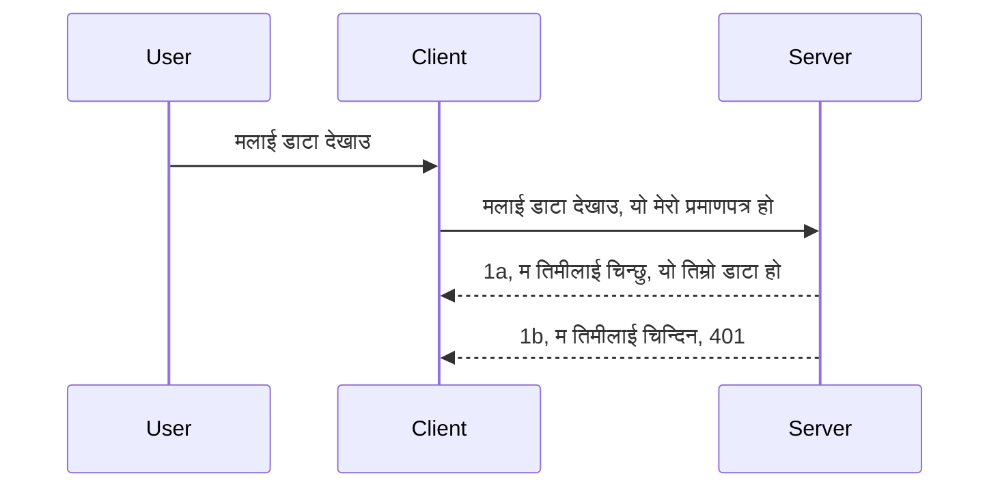

# सरल प्रमाणीकरण

MCP SDK हरूले OAuth 2.1 को प्रयोग समर्थन गर्छ जुन सत्य भन्नुपर्दा एक धेरै संलग्न प्रक्रिया हो जसमा प्रमाणीकरण सर्भर, स्रोत सर्भर, प्रमाणपत्र पोस्ट गर्ने, कोड प्राप्त गर्ने, कोडलाई बीयरर टोकनमा आदान प्रदान गर्ने सम्मका अवधारणा समावेश छन् जबसम्म तपाईं अन्तमा आफ्नो स्रोत डाटा प्राप्त गर्न सक्नुहुन्छ। यदि तपाईं OAuth प्रयोग गर्न अनभिज्ञ हुनुहुन्छ जुन लागू गर्न महान कुरा हो भने, केही आधारभूत स्तरको प्रमाणीकरणबाट सुरु गरेर अझ राम्रो सुरक्षा निर्माण गर्नु राम्रो विचार हो। त्यसैले यो अध्याय अस्तित्वमा छ, तपाईंलाई अझ उन्नत प्रमाणीकरणतर्फ तयार पार्न।

## प्रमाणीकरण, हामी के भन्न चाहन्छौं?

प्रमाणीकरण भनेको authentication र authorization को छोटकरी हो। विचार यो हो कि हामीले दुई कुराहरू गर्नु आवश्यक छ:

- **Authentication**, जुन प्रक्रिया हो कि हामीले कसैलाई हाम्रो घरमा छिर्न अनुमति दिने हो की हैन भनेर थाहा पाउने, कि उनीहरूलाई "यहाँ" रहनको लागि अधिकार छ, जसको अर्थ हाम्रो स्रोत सर्भर जहाँ हाम्रो MCP सर्भर सुविधाहरू बस्छन्, त्यसमा पहुँच छ।
- **Authorization**, त्यो प्रक्रिया हो जहाँ हामी पत्ता लगाउँछौं कि एउटाले माग गरेको विशिष्ट स्रोतहरूको पहुँच हुनु पर्ने हो कि हैन, जस्तै यी अर्डरहरू वा यी उत्पादनहरू वा तिनीहरूलाई सामग्री पढ्न अनुमति छ तर मेटाउन अनुमति छैन जस्तो।

## प्रमाणपत्रहरू: हामीले प्रणालीलाई कसरी आफ्नो परिचय दिन्छौं

ठिक छ, त्यहाँ धेरै वेब विकासकर्ताहरू सर्वरलाई प्रमाणपत्र प्रदान गर्ने सन्दर्भमा सोच्न थाल्छन्, प्राय: एउटा गोप्य सूचना जुन उनीहरू यहाँ हुनुको अधिकार छ भन्ने बताउँछ "Authentication"। यो प्रमाणपत्र सामान्यतया username र password को base64 इन्कोड गरिएको संस्करण वा एउटा API की हो जुन एक विशिष्ट प्रयोगकर्तालाई अद्वितीय रूपमा चिन्हित गर्दछ। 

यसलाई "Authorization" नामक हेडर मार्फत पठाइन्छ जस्तै:

```json
{ "Authorization": "secret123" }
```

यसलाई सामान्यतया बेसिक प्रमाणीकरण भनिन्छ। त्यसपछि समग्र प्रवाह यसरी काम गर्छ:


अब हामीले प्रवाहको हिसाबले कसरी काम गर्छ बुझ्यौं, अब यसलाई कसरी लागू गर्ने? प्राय: धेरै वेब सर्भरहरूमा middleware भनिने अवधारणा हुन्छ, अनुरोधको भागको रूपमा चल्ने एउटा कोड पिन्टु जसले प्रमाणपत्र जाँच्छ, र प्रमाणपत्र वैध भए अनुरोधलाई अनुमति दिन्छ। यदि प्रमाणपत्र वैध छैन भने तपाईंलाई प्रमाणीकरण त्रुटि प्राप्त हुन्छ। हेरौं यसलाई कसरी लागू गर्न सकिन्छ:

**Python**

```python
class AuthMiddleware(BaseHTTPMiddleware):
    async def dispatch(self, request, call_next):

        has_header = request.headers.get("Authorization")
        if not has_header:
            print("-> Missing Authorization header!")
            return Response(status_code=401, content="Unauthorized")

        if not valid_token(has_header):
            print("-> Invalid token!")
            return Response(status_code=403, content="Forbidden")

        print("Valid token, proceeding...")
       
        response = await call_next(request)
        # कुनै पनि ग्राहक हेडरहरू थप्नुहोस् वा प्रतिक्रिया कुनै तरिकाले परिवर्तन गर्नुहोस्
        return response


starlette_app.add_middleware(CustomHeaderMiddleware)
```

यहाँ हामीले:

- एउटा middleware `AuthMiddleware` बनायौं जहाँ यसको `dispatch` विधि वेब सर्भरले आह्वान गर्दछ।
- middleware वेब सर्भरमा थप्यौं:

    ```python
    starlette_app.add_middleware(AuthMiddleware)
    ```

- Validation logic लेख्यौं जसले Authorization हेडर छ कि छैन र पठाइएको गोप्य सूचना वैध छ कि छैन जाँच्छ:

    ```python
    has_header = request.headers.get("Authorization")
    if not has_header:
        print("-> Missing Authorization header!")
        return Response(status_code=401, content="Unauthorized")

    if not valid_token(has_header):
        print("-> Invalid token!")
        return Response(status_code=403, content="Forbidden")
    ```

    यदि गोप्य सूचना छ र वैध छ भने `call_next` कल गरेर अनुरोधलाई अघि जान दिइन्छ र प्रतिक्रिया फर्काइन्छ।

    ```python
    response = await call_next(request)
    # कुनै पनि ग्राहक हेडरहरू थप्नुहोस् वा जवाफमा केही परिवर्तन गर्नुहोस्
    return response
    ```

यसले यस्तो काम गर्छ कि वेब अनुरोध सर्भरतर्फ गर्दा middleware आह्वान हुनेछ र यसको कार्यान्वयन अनुसार अनुरोधलाई अनुमति दिने या क्लाइन्टलाई अघि बढ्न नदिने त्रुटि फर्काउने।

**TypeScript**

यहाँ हामी लोकप्रिय फ्रेमवर्क Express सँग middleware बनाउँछौं र MCP सर्भर पुग्नु अघि अनुरोध रोक्छौं। कोड यस्तो छ:

```typescript
function isValid(secret) {
    return secret === "secret123";
}

app.use((req, res, next) => {
    // १. प्राधिकरण हेडर छ?
    if(!req.headers["Authorization"]) {
        res.status(401).send('Unauthorized');
    }
    
    let token = req.headers["Authorization"];

    // २. वैधता जाँच गर्नुहोस्।
    if(!isValid(token)) {
        res.status(403).send('Forbidden');
    }

   
    console.log('Middleware executed');
    // ३. अनुरोधलाई अनुरोध पाइपलाइनको अर्को चरणमा पठाउनुहोस्।
    next();
});
```

यस कोडमा हामीले:

1. पहिला Authorization हेडर छ कि छैन जाँच गर्यौं, नभए 401 त्रुटि पठायौं।
2. प्रमाणपत्र / टोकन वैध छ कि छैन सुनिश्चित गर्यौं, नभए 403 त्रुटि पठायौं।
3. अन्तमा अनुरोध पाइपलाइनमा अनुरोध पठाइँदै सोधिएको स्रोत फर्काउँछ।

## अभ्यास: प्रमाणीकरण लागू गर्नुहोस्

हाम्रो ज्ञान लिएर यसलाई लागू गर्न प्रयास गरौं। योजना यस्तो छ:

सर्भर

- वेब सर्भर र MCP instance बनाउनुहोस्।
- सर्भरका लागि middleware लागू गर्नुहोस्।

क्लाइन्ट 

- प्रमाणपत्र सहित वेब अनुरोध हेडर मार्फत पठाउनुहोस्।

### -1- वेब सर्भर र MCP instance बनाउनुहोस्

हाम्रो पहिलो चरणमा, हामीलाई वेब सर्भर instance र MCP सर्भर बनाउन आवश्यक छ।

**Python**

यहाँ हामी MCP सर्भर instance बनाउँछौं, starlette वेब एप बनाउँछौं र uvicorn बाट होस्ट गर्छौं।

```python
# MCP सर्भर सिर्जना गर्दै

app = FastMCP(
    name="MCP Resource Server",
    instructions="Resource Server that validates tokens via Authorization Server introspection",
    host=settings["host"],
    port=settings["port"],
    debug=True
)

# starlette वेब अनुप्रयोग सिर्जना गर्दै
starlette_app = app.streamable_http_app()

# uvicorn मार्फत अनुप्रयोग सेवा गर्दै
async def run(starlette_app):
    import uvicorn
    config = uvicorn.Config(
            starlette_app,
            host=app.settings.host,
            port=app.settings.port,
            log_level=app.settings.log_level.lower(),
        )
    server = uvicorn.Server(config)
    await server.serve()

run(starlette_app)
```

यस कोडमा हामीले:

- MCP सर्भर बनायौं।
- MCP सर्भरबाट starlette वेब एप निर्माण गर्यौं `app.streamable_http_app()`।
- uvicorn प्रयोग गरेर वेब एप होस्ट र सर्भ गर्यौं `server.serve()`।

**TypeScript**

यहाँ हामी MCP सर्भर instance बनाउनेछौं।

```typescript
const server = new McpServer({
      name: "example-server",
      version: "1.0.0"
    });

    // ... सर्भर स्रोतहरू, उपकरणहरू, र प्रॉम्प्टहरू सेटअप गर्नुहोस् ...
```

यस MCP सर्भर निर्माणलाई POST /mcp रुट परिभाषा भित्र गर्नुपर्छ, त्यसैले माथि कोडलाई यसरी सारौं:

```typescript
import express from "express";
import { randomUUID } from "node:crypto";
import { McpServer } from "@modelcontextprotocol/sdk/server/mcp.js";
import { StreamableHTTPServerTransport } from "@modelcontextprotocol/sdk/server/streamableHttp.js";
import { isInitializeRequest } from "@modelcontextprotocol/sdk/types.js"

const app = express();
app.use(express.json());

// सत्र आईडी द्वारा ट्रान्सपोर्टहरू भण्डारण गर्ने नक्शा
const transports: { [sessionId: string]: StreamableHTTPServerTransport } = {};

// क्लाइन्ट-देखि-सर्भर संवादका लागि POST अनुरोधहरू व्यवस्थापन गर्नुहोस्
app.post('/mcp', async (req, res) => {
  // विद्यमान सत्र आईडी जाँच गर्नुहोस्
  const sessionId = req.headers['mcp-session-id'] as string | undefined;
  let transport: StreamableHTTPServerTransport;

  if (sessionId && transports[sessionId]) {
    // विद्यमान ट्रान्सपोर्ट पुन: प्रयोग गर्नुहोस्
    transport = transports[sessionId];
  } else if (!sessionId && isInitializeRequest(req.body)) {
    // नयाँ आरम्भिक अनुरोध
    transport = new StreamableHTTPServerTransport({
      sessionIdGenerator: () => randomUUID(),
      onsessioninitialized: (sessionId) => {
        // सत्र आईडी अनुसार ट्रान्सपोर्ट भण्डारण गर्नुहोस्
        transports[sessionId] = transport;
      },
      // DNS रिबाइन्डिङ सुरक्षा डिफल्ट रूपमा पुरानो संस्करणसँग अनुकूलताका लागि अक्षम छ। यदि तपाईंले यो सर्भर
      // स्थानीय रूपमा चलाउँदै हुनुहुन्छ भने, सुनिश्चित गर्नुहोस् सेट गर्नुहोस्:
      // enableDnsRebindingProtection: true,
      // allowedHosts: ['127.0.0.1'],
    });

    // बन्द गर्दा ट्रान्सपोर्ट सफा गर्नुहोस्
    transport.onclose = () => {
      if (transport.sessionId) {
        delete transports[transport.sessionId];
      }
    };
    const server = new McpServer({
      name: "example-server",
      version: "1.0.0"
    });

    // ... सर्भर स्रोतहरू, उपकरणहरू, र प्रम्प्टहरू सेट गर्नुहोस् ...

    // MCP सर्भरसँग जडान गर्नुहोस्
    await server.connect(transport);
  } else {
    // अमान्य अनुरोध
    res.status(400).json({
      jsonrpc: '2.0',
      error: {
        code: -32000,
        message: 'Bad Request: No valid session ID provided',
      },
      id: null,
    });
    return;
  }

  // अनुरोध व्यवस्थापन गर्नुहोस्
  await transport.handleRequest(req, res, req.body);
});

// GET र DELETE अनुरोधहरूको पुन: प्रयोगयोग्य ह्यान्डलर
const handleSessionRequest = async (req: express.Request, res: express.Response) => {
  const sessionId = req.headers['mcp-session-id'] as string | undefined;
  if (!sessionId || !transports[sessionId]) {
    res.status(400).send('Invalid or missing session ID');
    return;
  }
  
  const transport = transports[sessionId];
  await transport.handleRequest(req, res);
};

// SSE मार्फत सर्भर-देखि-क्लाइन्ट सूचनाहरूका लागि GET अनुरोधहरू व्यवस्थापन गर्नुहोस्
app.get('/mcp', handleSessionRequest);

// सत्र समाप्तिका लागि DELETE अनुरोधहरू व्यवस्थापन गर्नुहोस्
app.delete('/mcp', handleSessionRequest);

app.listen(3000);
```

अब तपाईंले देख्नुहुन्छ कि MCP सर्भर सिर्जना `app.post("/mcp")` भित्र सारिएको छ।

अहिले आउँ अगाडि middleware बनाउने चरणमा जहाँ हामी आउने प्रमाणपत्रको प्रमाणिकरण गर्न सक्छौं।

### -2- सर्भरका लागि middleware लागू गर्नुहोस्

अर्को middleware भागमा जाऔं। यहाँ हामी एउटा middleware बनाउनेछौं जुन `Authorization` हेडरमा प्रमाणपत्र खोज्छ र त्यसको वैधता प्रमाणित गर्छ। स्वीकार्य भए अनुरोध अगाडि बढ्छ र आवश्यक कार्य गर्दछ (जस्तै उपकरणहरूको सूची हेर्ने, स्रोत पढ्ने वा क्लाइन्टले मागेको MCP कार्यक्षमता)।

**Python**

middleware बनाउन, हामीले `BaseHTTPMiddleware` बाट वितरण गर्ने एउटा कक्षा बनाउनुपर्छ। दुई रोचक भागहरू छन्:

- अनुरोध `request`, जसबाट हामी हेडर जानकारी पढ्छौं।
- `call_next` जुन कल गर्नुपर्छ यदि क्लाइन्टले स्वीकार्य प्रमाणपत्र ल्याएको छ।

पहिले, `Authorization` हेडर नभएमा ह्यान्डल गर्नुपर्छ:

```python
has_header = request.headers.get("Authorization")

# कुनै शीर्षक उपस्थित छैन, ४०१ मा असफल गर्नुहोस्, अन्यथा अगाडि बढ्नुहोस्।
if not has_header:
    print("-> Missing Authorization header!")
    return Response(status_code=401, content="Unauthorized")
```

यहाँ हामी 401 unauthorized सन्देश पठाउँछौं किनकि क्लाइन्ट प्रमाणीकरण असफल भइरहेको छ।

अर्को, यदि प्रमाणपत्र पठाइएको छ भने, यसको वैधता यी तरिकाले जाँचौं:

```python
 if not valid_token(has_header):
    print("-> Invalid token!")
    return Response(status_code=403, content="Forbidden")
```

यहाँ हामीले 403 forbidden सन्देश पठाएको छ। पुरा middleware कोड तल छ जसले माथिका सबै लागू गरेको छ:

```python
class AuthMiddleware(BaseHTTPMiddleware):
    async def dispatch(self, request, call_next):

        has_header = request.headers.get("Authorization")
        if not has_header:
            print("-> Missing Authorization header!")
            return Response(status_code=401, content="Unauthorized")

        if not valid_token(has_header):
            print("-> Invalid token!")
            return Response(status_code=403, content="Forbidden")

        print("Valid token, proceeding...")
        print(f"-> Received {request.method} {request.url}")
        response = await call_next(request)
        response.headers['Custom'] = 'Example'
        return response

```

राम्ररी भयो, तर `valid_token` फंक्शन के हो? तल हेर्नुहोस्:
:

```python
# उत्पादनको लागि प्रयोग नगर्नुहोस् - यसलाई सुधार गर्नुहोस् !!
def valid_token(token: str) -> bool:
    # "Bearer " उपसर्ग हटाउनुहोस्
    if token.startswith("Bearer "):
        token = token[7:]
        return token == "secret-token"
    return False
```

यो स्पष्ट रूपमा सुधार गर्नुपर्छ।

महत्वपूर्ण: यस्तो गोप्य सूचनाहरू कहिल्यै कोडमा नराख्नुपर्छ। आदर्श रूपमा तुलना गर्नको लागि मान डेटास्रोत वा IDP (identity service provider) बाट ल्याउनुपर्छ वा अझ राम्रो, IDP लाई प्रमाणिकरण गराउन दिनुपर्छ।

**TypeScript**

Express सँग यो लागू गर्न `use` विधि कल गरी middleware फंक्शनहरू लिनुपर्छ।

हामीले गर्नुपर्ने:

- अनुरोध भेरिएबलसँग अन्तरक्रिया गरेर `Authorization` सम्पत्ति भित्र प्रमाणपत्र जाँच्ने।
- प्रमाणपत्र मान्य भए अनुरोधलाई जारी राख्न र क्लाइन्टको MCP अनुरोधले के गर्नुपर्छ गराउन दिने।

यहाँ, हामीले `Authorization` हेडर छ कि छैन जाँच्छौं नभए अनुरोध रोक्छौं:

```typescript
if(!req.headers["authorization"]) {
    res.status(401).send('Unauthorized');
    return;
}
```

यदि हेडर पहिलो पटक पठाइएको छैन भने, तपाईं 401 प्राप्त गर्नुहुन्छ।

अर्को, प्रमाणपत्र मान्य छ कि छैन जाँच्छौं, नभए अर्को फरक सन्देशसहित अनुरोध रोक्छौं:

```typescript
if(!isValid(token)) {
    res.status(403).send('Forbidden');
    return;
} 
```

यहाँ 403 त्रुटि आउँछ।

पुरा कोड यस्तो छ:

```typescript
app.use((req, res, next) => {
    console.log('Request received:', req.method, req.url, req.headers);
    console.log('Headers:', req.headers["authorization"]);
    if(!req.headers["authorization"]) {
        res.status(401).send('Unauthorized');
        return;
    }
    
    let token = req.headers["authorization"];

    if(!isValid(token)) {
        res.status(403).send('Forbidden');
        return;
    }  

    console.log('Middleware executed');
    next();
});
```

हामीले वेब सर्भरलाई middleware स्वीकार गर्ने गरी सेटअप गर्यौं जसले क्लाइन्टले पठाएको प्रमाणपत्र जाँच्छ। क्लाइन्टको कुरा के हुन्छ?

### -3- प्रमाणपत्र सहित वेब अनुरोध हेडर मार्फत पठाउनुहोस्

हामीले सुनिश्चित गर्नु छ कि क्लाइन्ट हेडरबाट प्रमाणपत्र पास गर्दैछ। हामी MCP क्लाइन्ट प्रयोग गर्दैछौं, त्यसैले कसरी गर्छौं थाहा पाउनुपर्छ।

**Python**

क्लाइन्टका लागि, प्रमाणपत्र सहित हेडर पास गर्नुपर्छ जस्तै:

```python
# मान कडाईका साथ कोडमा नराख्नुहोस्, कम्तीमा यसलाई वातावरण चर वा थप सुरक्षित भण्डारणमा राख्नुहोस्
token = "secret-token"

async with streamablehttp_client(
        url = f"http://localhost:{port}/mcp",
        headers = {"Authorization": f"Bearer {token}"}
    ) as (
        read_stream,
        write_stream,
        session_callback,
    ):
        async with ClientSession(
            read_stream,
            write_stream
        ) as session:
            await session.initialize()
      
            # TODO, तपाईँले क्लाइन्टमा के गर्न चाहनुहुन्छ, जस्तै सूची उपकरणहरू, उपकरणहरू कल गर्नु आदि।
```

यहाँ नोट गर्नुहोस् कि हामी `headers` गुणप्रति यस्तै पूर्ति गर्छौं ` headers = {"Authorization": f"Bearer {token}"}`।

**TypeScript**

यसलाई दुई चरणमा गर्न सकिन्छ:

1. प्रमाणपत्र सहित configuration वस्तु बनाउने।
2. त्यो configuration वस्तु ट्रान्सपोर्टलाई पास गर्ने।

```typescript

// यहाँ जस्तो मानलाई कडाइले कोडमा लेख्नु हुँदैन। कम्तीमा यो वातावरण चरका रूपमा राख्नुहोस् र विकास मोडमा dotenv जस्ता केहि प्रयोग गर्नुहोस्।
let token = "secret123"

// एक क्लाइन्ट ट्रान्सपोर्ट विकल्प वस्तु परिभाषित गर्नुहोस्
let options: StreamableHTTPClientTransportOptions = {
  sessionId: sessionId,
  requestInit: {
    headers: {
      "Authorization": "secret123"
    }
  }
};

// विकल्प वस्तुलाई ट्रान्सपोर्टमा पास गर्नुहोस्
async function main() {
   const transport = new StreamableHTTPClientTransport(
      new URL(serverUrl),
      options
   );
```

यहाँ तपाईंले माथि देख्नुभयो कसरी `options` वस्तु बनाएर हेडरहरू `requestInit` गुणमा राखेका छौं।

महत्वपूर्ण: यद्यपि यो सुधार कसरी गर्ने? अहिलेको कार्यान्वयन केही समस्याहरू छन्। सबभन्दा पहिले, यस्तो तरिकाले प्रमाणपत्र पास गर्नु जोखिमपूर्ण हो जबसम्म तुरुन्त HTTPS छैन भने। त्यसभन्दा बाहेक प्रमाणपत्र चोरी हुन सक्छ त्यसैले तपाईंलाई यस्तो प्रणाली चाहिन्छ जहाँ टोकन सजिलै रद गर्न सकियोस् र थप जाँचहरू गर्न सकियोस् जस्तै विश्वको कुन भागबाट आएको, बोट जस्तो व्यवहार छ कि छैन, छोटकरीमा धेरै कुराहरू विचार गर्नुपर्छ।

तर भन्नुपर्दा, धेरै सरल API हरूको लागि जहाँ तपाईंले प्रमाणीकरण बिना कसैलाई API कल गर्न दिन चाहनुहुन्न, यो राम्रो शुरुवात हो।

त्यसो भए, सुरक्षा कडा बनाउन थोरै JSON Web Token प्रयोग गरौं जसलाई JWT वा "JOT" टोकन पनि भनिन्छ।

## JSON वेब टोकनहरू, JWT

हामीले धेरै सरल प्रमाणपत्र पठाउने भन्दा सुधार गर्न खोजिरहेका छौं। JWT अपनाउँदा के के तुरुन्त सुधारहरू ल्याउँछ?

- **सुरक्षा सुधारहरू**। बेसिक अ‍थमा तपाईं username र password base64 इन्कोड गरिएको टोकन(वा API key) बारम्बार पठाउनुहुन्छ जुन जोखिम बढाउँछ। JWT मा तपाईं username र password पठाउनुहुन्छ र टोकन प्राप्त गर्नुहुन्छ जुन पनि समयबद्ध हुन्छ अर्थात समाप्ति हुन्छ। JWT ले भूमिकाहरू, स्कोप र अनुमति मार्फत सजिलो ठ्याक्कै पहुँच नियन्त्रण दिन्छ।
- **राज्य रहितता र स्केलेबिलिटी**। JWT स्व-विवरणात्मक हुन्छन्, सबै प्रयोगकर्ता जानकारी बोकेका हुन्छन् र सर्भर साइड सत्र भण्डारण आवश्यक पर्दैन। टोकन स्थानीय रूपमा पनि प्रमाणीकरण गर्न सकिन्छ।
- **इन्टरओपरेबिलिटी र संघ**। JWT Open ID Connect को केन्द्रमा हुन्छ र परिचित IDP हरूसँग प्रयोग हुन्छ जस्तै Entra ID, Google Identity र Auth0। यीले सिंगल साइन-ऑन र थप धेरै कुरा सम्भव बनाउँछन् जुन उद्यम-स्तरको बनाउँछ।
- **मोड्युलरिटी र लचिलोपन**। JWT Azure API Management, NGINX आदि जस्ता API गेटवेहरूसँग पनि प्रयोग गर्न सकिन्छ। यसले प्रमाणीकरण परिदृश्यहरू र सर्भर-देखि-सर्भर सञ्चारलाई पनि समर्थन गर्छ, जसमा नक्कल र प्रतिनिधित्व गर्ने परिदृश्यहरू साह्रै महत्त्वपूर्ण छन्।
- **प्रदर्शन र क्याचिंग**। JWT डिकोड पछि क्यास गर्न सकिन्छ जसले पार्सिंग आवश्यकतालाई कम गर्छ। यसले विशेष गरी उच्च-ट्राफिक एपहरूमा थ्रूपुट सुधार र तपाईंले रोजेको पूर्वाधारमा लोड कम गर्दछ।
- **उन्नत सुविधाहरू**। यसले इन्ट्रोस्पेक्सन (सर्भरमा वैधता जाँच) र रद्दीकरण (टोकन अमान्य बनाउने) समर्थन पनि गर्छ।

यी सबै फाइदासँग, आउनुस् हामीले हाम्रो कार्यान्वयनलाई अर्को स्तरमा कसरी लैजाने हेर्नौं।

## बेसिक अ‍थलाई JWT मा परिणत गर्दै

त्यसैले, हामीले उच्च स्तरमा गर्नुपर्ने परिवर्तनहरू:

- **JWT टोकन बनाउने तरिका सिक्नुहोस्** र यसलाई क्लाइन्टबाट सर्भरसम्म पठाउन तयार पार्नुहोस्।
- **JWT टोकन प्रमाणित गर्नुहोस्**, र यदि मान्य छ भने क्लाइन्टलाई हाम्रो स्रोतहरूमा पहुँच दिने।
- **टोकन सुरक्षित भण्डारण**। यो टोकन कसरी भण्डारण गर्ने।
- **रूटहरू सुरक्षा गर्नुहोस्**। हामीले रूटहरू सुरक्षा गर्नुपर्छ, हाम्रो अवस्थामा MCP सुविधाहरू सुरक्षा गर्नुपर्छ।
- **रिफ्रेश टोकन थप्नुहोस्**। छोटो अवधि टोकनहरू बनाउनुपर्छ र रिफ्रेश टोकनहरू जुन लामो अवधिका हुन्छन् र समाप्त भए नयाँ टोकन लिन सकिन्छ। रिफ्रेश अन्त बिन्दु र घुमाउने रणनीति सुनिश्चित गर्नुहोस्।

### -1- JWT टोकन बनाउने

पहिलो, JWT टोकनका भागहरू:

- **हेडर**, प्रयोग गरिएको एल्गोरिदम र टोकन प्रकार।
- **पेलोड**, दाबीहरू, जस्तै sub (टोकनले प्रतिनिधित्व गर्ने प्रयोगकर्ता वा संस्था, प्रायः userid), exp (समयसीमा), role (भूमिका)
- **सिग्नेचर**, गोप्य कुञ्जी वा निजी कुञ्जीसँग हस्ताक्षरित।

यसका लागि हामीले हेडर, पेलोड र इन्कोड गरिएको टोकन निर्माण गर्नुपर्छ।

**Python**

```python

import jwt
import jwt
from jwt.exceptions import ExpiredSignatureError, InvalidTokenError
import datetime

# JWT साइन गर्न प्रयोग गरिएको गोप्य कुञ्जी
secret_key = 'your-secret-key'

header = {
    "alg": "HS256",
    "typ": "JWT"
}

# प्रयोगकर्ता जानकारी र यसको दावीहरू तथा समाप्ति समय
payload = {
    "sub": "1234567890",               # विषय (प्रयोगकर्ता आईडी)
    "name": "User Userson",                # अनुकूल दावी
    "admin": True,                     # अनुकूल दावी
    "iat": datetime.datetime.utcnow(),# जारी गरिएको मिति
    "exp": datetime.datetime.utcnow() + datetime.timedelta(hours=1)  # समाप्ति
}

# यसलाई एन्कोड गर्नुहोस्
encoded_jwt = jwt.encode(payload, secret_key, algorithm="HS256", headers=header)
```

माथिको कोडमा हामीले:

- HS256 एल्गोरिदम र JWT प्रकार प्रयोग गरेर एक हेडर परिभाषित गर्यौं।
- पेलोड बनायौं जसमा विषय वा प्रयोगकर्ता ID, प्रयोगकर्ता नाम, भूमिका, जारी गरिएको समय र समाप्ति समय समावेश छ, जसले समय सीमा कार्यान्वयन गर्दछ।

**TypeScript**

यहाँ हामीलाई केही निर्भरता आवश्यक छ जुन JWT टोकन बनाउँन मद्दत गर्नेछ।

निर्भरता

```sh

npm install jsonwebtoken
npm install --save-dev @types/jsonwebtoken
```

अब त्यो तयार भएपछि, हेडर, पेलोड बनाउन र अन्तमा इन्कोड गरिएको टोकन बनाउने कोड:

```typescript
import jwt from 'jsonwebtoken';

const secretKey = 'your-secret-key'; // उत्पादनमा env vars प्रयोग गर्नुहोस्

// पे-लोड परिभाषित गर्नुहोस्
const payload = {
  sub: '1234567890',
  name: 'User usersson',
  admin: true,
  iat: Math.floor(Date.now() / 1000), // जारी गरिएको मिति
  exp: Math.floor(Date.now() / 1000) + 60 * 60 // १ घण्टामा म्याद सकिन्छ
};

// हेडर परिभाषित गर्नुहोस् (वैकल्पिक, jsonwebtoken ले पूर्वनिर्धारित सेट गर्दछ)
const header = {
  alg: 'HS256',
  typ: 'JWT'
};

// टोकन सिर्जना गर्नुहोस्
const token = jwt.sign(payload, secretKey, {
  algorithm: 'HS256',
  header: header
});

console.log('JWT:', token);
```

यो टोकन:

HS256 प्रयोग गरी हस्ताक्षरित
1 घण्टा लागि मान्य
sub, name, admin, iat, र exp जस्ता दाबीहरू समावेश गर्दछ।

### -2- टोकन प्रमाणित गर्ने

हामीले टोकन प्रमाणित गर्नु पर्छ, यो सर्भरमा गर्नुपर्छ ताकि क्लाइन्टले पठाएको टोकन साँच्चिकै मान्य हो कि होइन जाँच्न। धेरै जाँचहरू गर्नुपर्छ जस्तै संरचना र वैधता। तपाईंलाई सुझाव दिइन्छ कि अन्य जाँचहरू पनि थप्नुस् जस्तै प्रयोगकर्ता प्रणालीमा छ कि छैन र यस्ता।

टोकन प्रमाणित गर्न हामीलाई decode गर्नुपर्छ ताकि पढ्न सकियोस् र त्यसपछि वैधता जाँच्न सकियोस्:

**Python**

```python

# JWT डीकोड गर्नुहोस् र प्रमाणित गर्नुहोस्
try:
    decoded = jwt.decode(token, secret_key, algorithms=["HS256"])
    print("✅ Token is valid.")
    print("Decoded claims:")
    for key, value in decoded.items():
        print(f"  {key}: {value}")
except ExpiredSignatureError:
    print("❌ Token has expired.")
except InvalidTokenError as e:
    print(f"❌ Invalid token: {e}")

```

यस कोडमा, हामीले `jwt.decode` कल गर्छौं टोकन, गोप्य कुञ्जी र एल्गोरिदम प्रयोग गरेर। यहाँ try-catch संरचना प्रयोग भएको छ किनकि प्रमाणीकरण असफल हुँदा त्रुटि आउँछ।

**TypeScript**

यहाँ हामीले `jwt.verify` कल गरेर टोकन decode गर्छौं जसलाई अझ विश्लेषण गर्न सकिन्छ। यदि यो कल असफल भयो भने टोकनको संरचना गलत छ वा त्यहाँ मान्यता छैन।

```typescript

try {
  const decoded = jwt.verify(token, secretKey);
  console.log('Decoded Payload:', decoded);
} catch (err) {
  console.error('Token verification failed:', err);
}
```

ध्यान दिनुहोस्: पहिले भनिसकेको अनुसार, तपाईंले थप जाँच गर्नुपर्छ कि यो टोकनले हाम्रो प्रणालीमा प्रयोगकर्तालाई जनाउँछ र प्रयोगकर्ताले दाबी गरेको अधिकारहरू छ कि छैन यो सुनिश्चित गर्न।
अर्को, हामी भूमिका आधारित पहुँच नियन्त्रण (Role Based Access Control), जसलाई RBAC पनि भनिन्छ, हेर्न जाऔं।

## भूमिका आधारित पहुँच नियन्त्रण थप्दै

विचार यस्तो छ कि हामी व्यक्त गर्न चाहन्छौं कि विभिन्न भूमिकाहरूले फरक-फरक अनुमति पाउँछन्। उदाहरणका लागि, हामी मान्छौं कि एडमिनले सबै गर्न सक्छ र सामान्य प्रयोगकर्ताले पढ्न/लेख्न सक्छ र अतिथिले मात्र पढ्न सक्छ। त्यसैले, यहाँ केही सम्भावित अनुमति स्तरहरू छन्:

- Admin.Write  
- User.Read  
- Guest.Read  

हामी हेर्न जाऔं कि हामी कसरि यस्तो नियन्त्रण मिडलवेयर मार्फत लागू गर्न सक्छौं। मिडलवेयरहरू प्रत्येक मार्गमा वा सबै मार्गहरूको लागि थप्न सकिन्छ।

**Python**

```python
from starlette.middleware.base import BaseHTTPMiddleware
from starlette.responses import JSONResponse
import jwt

# कोडमा यस्तो गोप्य कुरा नराख्नुहोस्, यो मात्र प्रदर्शनका लागि हो। सुरक्षित स्थानबाट पढ्नुहोस्।
SECRET_KEY = "your-secret-key" # यसलाई env भेरिएबलमा राख्नुहोस्।
REQUIRED_PERMISSION = "User.Read"

class JWTPermissionMiddleware(BaseHTTPMiddleware):
    async def dispatch(self, request, call_next):
        auth_header = request.headers.get("Authorization")
        if not auth_header or not auth_header.startswith("Bearer "):
            return JSONResponse({"error": "Missing or invalid Authorization header"}, status_code=401)

        token = auth_header.split(" ")[1]
        try:
            decoded = jwt.decode(token, SECRET_KEY, algorithms=["HS256"])
        except jwt.ExpiredSignatureError:
            return JSONResponse({"error": "Token expired"}, status_code=401)
        except jwt.InvalidTokenError:
            return JSONResponse({"error": "Invalid token"}, status_code=401)

        permissions = decoded.get("permissions", [])
        if REQUIRED_PERMISSION not in permissions:
            return JSONResponse({"error": "Permission denied"}, status_code=403)

        request.state.user = decoded
        return await call_next(request)


```
  
मिडलवेयर थप्न केही फरक तरिकाहरू छन्, तल जस्ता:

```python

# वैकल्पिक १: स्टारलेट एप निर्माण गर्दा मिडलवेयर थप्नुहोस्
middleware = [
    Middleware(JWTPermissionMiddleware)
]

app = Starlette(routes=routes, middleware=middleware)

# वैकल्पिक २: स्टारलेट एप पहिले नै निर्माण भइसकेपछि मिडलवेयर थप्नुहोस्
starlette_app.add_middleware(JWTPermissionMiddleware)

# वैकल्पिक ३: प्रत्येक मार्गका लागि मिडलवेयर थप्नुहोस्
routes = [
    Route(
        "/mcp",
        endpoint=..., # ह्यान्डलर
        middleware=[Middleware(JWTPermissionMiddleware)]
    )
]
```
  
**TypeScript**

हामी `app.use` र एउटा मिडलवेयर प्रयोग गर्न सक्छौं जुन सबै अनुरोधहरूको लागि चल्नेछ।

```typescript
app.use((req, res, next) => {
    console.log('Request received:', req.method, req.url, req.headers);
    console.log('Headers:', req.headers["authorization"]);

    // 1. अधिकृतता हेडर पठाइएको छ कि छैन जाँच गर्नुहोस्

    if(!req.headers["authorization"]) {
        res.status(401).send('Unauthorized');
        return;
    }
    
    let token = req.headers["authorization"];

    // 2. टोकन वैध छ कि छैन जाँच गर्नुहोस्
    if(!isValid(token)) {
        res.status(403).send('Forbidden');
        return;
    }  

    // 3. टोकन प्रयोगकर्ता हाम्रो प्रणालीमा अस्तित्वमा छ कि छैन जाँच गर्नुहोस्
    if(!isExistingUser(token)) {
        res.status(403).send('Forbidden');
        console.log("User does not exist");
        return;
    }
    console.log("User exists");

    // 4. टोकनसँग सही अनुमतिहरू छन् कि छैन पुष्टि गर्नुहोस्
    if(!hasScopes(token, ["User.Read"])){
        res.status(403).send('Forbidden - insufficient scopes');
    }

    console.log("User has required scopes");

    console.log('Middleware executed');
    next();
});

```
  
हामीले हाम्रो मिडलवेयरले गर्न सक्ने र गरिनु पर्ने धेरै कुरा छन्, अर्थात्:

1. जाँच गर्नुहोस् कि authorization header उपस्थित छ कि छैन  
2. जाँच गर्नुहोस् कि टोकन वैध छ कि छैन, हामी `isValid` कल गर्छौं जुन एउटा विधि हो जुन हामीले JWT टोकनको अखण्डता र वैधता जाँच्न लेखेका छौं।  
3. प्रयोगकर्ता हाम्रो प्रणालीमा अवस्थित छ कि छैन जाँच्नुहोस्, हामीले यसलाई पनि जाँच्नु पर्छ।  

   ```typescript
    // DB मा प्रयोगकर्ताहरू
   const users = [
     "user1",
     "User usersson",
   ]

   function isExistingUser(token) {
     let decodedToken = verifyToken(token);

     // TODO, DB मा प्रयोगकर्ता छ कि छैन जाँच गर्नुहोस्
     return users.includes(decodedToken?.name || "");
   }
   ```
  
   माथि, हामीले एकदमै सरल `users` सूची बनाएका छौं, जुन स्पष्ट रूपमा डाटाबेसमा हुनुपर्छ।

4. थप रूपमा, हामीले टोकनमा सही अनुमतिहरू छन् कि छैनन् पनि जाँच्नु पर्छ।  

   ```typescript
   if(!hasScopes(token, ["User.Read"])){
        res.status(403).send('Forbidden - insufficient scopes');
   }
   ```
  
   माथिको कोडमा मिडलवेयरबाट, हामी जाँच गर्छौं कि टोकनमा User.Read अनुमति छ, नभएमा हामी 403 त्रुटि पठाउँछौं। तल `hasScopes` हेल्पर विधि छ।

   ```typescript
   function hasScopes(scope: string, requiredScopes: string[]) {
     let decodedToken = verifyToken(scope);
    return requiredScopes.every(scope => decodedToken?.scopes.includes(scope));
  }  
   ```

Have a think which additional checks you should be doing, but these are the absolute minimum of checks you should be doing.

Using Express as a web framework is a common choice. There are helpers library when you use JWT so you can write less code.

- `express-jwt`, helper library that provides a middleware that helps decode your token.
- `express-jwt-permissions`, this provides a middleware `guard` that helps check if a certain permission is on the token.

Here's what these libraries can look like when used:

```typescript
const express = require('express');
const jwt = require('express-jwt');
const guard = require('express-jwt-permissions')();

const app = express();
const secretKey = 'your-secret-key'; // put this in env variable

// Decode JWT and attach to req.user
app.use(jwt({ secret: secretKey, algorithms: ['HS256'] }));

// Check for User.Read permission
app.use(guard.check('User.Read'));

// multiple permissions
// app.use(guard.check(['User.Read', 'Admin.Access']));

app.get('/protected', (req, res) => {
  res.json({ message: `Welcome ${req.user.name}` });
});

// Error handler
app.use((err, req, res, next) => {
  if (err.code === 'permission_denied') {
    return res.status(403).send('Forbidden');
  }
  next(err);
});

```
  
अब तपाईंले देख्नुभयो कि मिडलवेयर कसरी प्रमाणीकरण र प्राधिकरण दुवैको लागि प्रयोग गर्न सकिन्छ, तर MCP को के? के यसले प्रमाणीकरण गर्ने तरिका परिवर्तन गर्छ? आउनुहोस् अर्को भागमा पत्ता लगाउँ।

### -3- MCP मा RBAC थप्नुहोस्

अहिलेसम्म तपाईंले देख्नुभयो कि कसरी मिडलवेयर मार्फत RBAC थप्न सकिन्छ, तर MCP को लागि प्रति MCP सुविधा RBAC थप्न सजिलो तरिका छैन, त्यसैले हामी के गर्ने? हामी जस्तै कोड थप्नुपर्छ जुन यो जाँच गर्छ कि यो अवस्थामा क्लाइन्टसँग विशिष्ट उपकरण कल गर्ने अधिकार छ कि छैन:

तपाईंको उपकरण अनुसार RBAC पुरा गर्नका लागि केही विकल्पहरू छन्, यहाँ केही छन्:

- तपाईं प्रत्येक उपकरण, स्रोत, प्रॉम्प्टका लागि एक जाँच थप्न सक्नुहुन्छ जहाँ तपाईं अनुमति स्तर जाँच्न चाहनुहुन्छ।  

   **python**

   ```python
   @tool()
   def delete_product(id: int):
      try:
          check_permissions(role="Admin.Write", request)
      catch:
        pass # ग्राहक प्रमाणिकरण असफल भयो, प्रमाणिकरण त्रुटि उठाउनुहोस्
   ```
  
   **typescript**

   ```typescript
   server.registerTool(
    "delete-product",
    {
      title: Delete a product",
      description: "Deletes a product",
      inputSchema: { id: z.number() }
    },
    async ({ id }) => {
      
      try {
        checkPermissions("Admin.Write", request);
        // गर्ने, id लाई productService र remote entry मा पठाउनुहोस्
      } catch(Exception e) {
        console.log("Authorization error, you're not allowed");  
      }

      return {
        content: [{ type: "text", text: `Deletected product with id ${id}` }]
      };
    }
   );
   ```
  

- उन्नत सर्भर दृष्टिकोण र अनुरोध ह्यान्डलरहरू प्रयोग गर्नुहोस् ताकि कुन स्थानहरूमा जाँच गर्नुपर्छ कम गर्न सकियोस्।  

   **Python**

   ```python
   
   tool_permission = {
      "create_product": ["User.Write", "Admin.Write"],
      "delete_product": ["Admin.Write"]
   }

   def has_permission(user_permissions, required_permissions) -> bool:
      # user_permissions: प्रयोगकर्ताले भएका अनुमतिहरूको सूची
      # required_permissions: उपकरणका लागि आवश्यक अनुमतिहरूको सूची
      return any(perm in user_permissions for perm in required_permissions)

   @server.call_tool()
   async def handle_call_tool(
     name: str, arguments: dict[str, str] | None
   ) -> list[types.TextContent]:
    # मान्नुहोस् request.user.permissions प्रयोगकर्ताका लागि अनुमतिहरूको सूची हो
     user_permissions = request.user.permissions
     required_permissions = tool_permission.get(name, [])
     if not has_permission(user_permissions, required_permissions):
        # त्रुटि उठाउनुहोस् "तपाईंलाई उपकरण {name} कल गर्न अनुमत छैन"
        raise Exception(f"You don't have permission to call tool {name}")
     # जारी राख्नुहोस् र उपकरण कल गर्नुहोस्
     # ...
   ```   
     

   **TypeScript**

   ```typescript
   function hasPermission(userPermissions: string[], requiredPermissions: string[]): boolean {
       if (!Array.isArray(userPermissions) || !Array.isArray(requiredPermissions)) return false;
       // यदि प्रयोगकर्तासँग कम्तीमा एक आवश्यक अनुमति छ भने साँचो फर्काउनुहोस्
       
       return requiredPermissions.some(perm => userPermissions.includes(perm));
   }
  
   server.setRequestHandler(CallToolRequestSchema, async (request) => {
      const { params: { name } } = request;
  
      let permissions = request.user.permissions;
  
      if (!hasPermission(permissions, toolPermissions[name])) {
         return new Error(`You don't have permission to call ${name}`);
      }
  
      // जारी राख्नुहोस्..
   });
   ```
  
   ध्यान दिनुहोस्, तपाईंले सुनिश्चित गर्नुपर्छ कि तपाईंको मिडलवेयरले डिकोड गरिएको टोकन अनुरोधको user गुणमा असाइन गरेको छ ताकि माथिको कोड सजिलो बनोस्।

### संक्षेपमा

अब हामीले सामान्य रूपमा र MCP का लागि RBAC कसरी थप्ने बारे चर्चा गरिसकेका छौं, तपाईंले सिकेका अवधारणाहरू बुझ्नु भएको सुनिश्चित गर्न आफ्नै सुरक्षा कार्यान्वयन गर्ने समय आएको छ।

## असाइनमेन्ट 1: आधारभूत प्रमाणीकरण प्रयोग गरी एक mcp सर्वर र mcp क्लाइन्ट बनाउनुहोस्

यहाँ तपाईंले हेडर मार्फत प्रमाणपत्र पठाउने तरिका सिक्नु भएको छ।

## समाधान 1

[Solution 1](./code/basic/README.md)

## असाइनमेन्ट 2: असाइनमेन्ट 1 को समाधानलाई JWT प्रयोग गर्दै अपग्रेड गर्नुहोस्

पहिलो समाधान लिनुहोस् तर यस पटक यसलाई सुधारौं।  

Basic Auth प्रयोग गर्नुभन्दा, JWT प्रयोग गरौं।  

## समाधान 2

[Solution 2](./solution/jwt-solution/README.md)

## चुनौती

हामीले "MCP मा RBAC थप्नुहोस्" भनी खण्डमा वर्णन गरेको अनुसार प्रति उपकरण RBAC थप्नुहोस्।

## सारांश

आशा छ तपाईँले यस अध्यायमा धेरै कुरा सिक्नुभयो, कुनै सुरक्षा नहुँदादेखि लिएर आधारभूत सुरक्षा र JWT सम्म, र त्यसलाई कसरी MCP मा थप्ने।

हामीले कस्टम JWT सँग एक बलियो आधार निर्माण गरेका छौं, तर जति हामी विस्तार गर्छौं, हामी मानक-आधारित पहिचान मोडेल तर्फ अग्रसर छौं। Entra वा Keycloak जस्ता IdP अपनाउँदा, हामी टोकन जारी, मान्यता, र जीवनचक्र व्यवस्थापनलाई एक विश्वासयोग्य प्लेटफर्ममा सार्न सक्छौं — जसले हामीलाई एप तर्क र प्रयोगकर्ता अनुभवमा केन्द्रित हुन अनुमति दिन्छ।

त्यसका लागि हामीसँग [Entra मा उन्नत अध्याय](../../05-AdvancedTopics/mcp-security-entra/README.md) छ।

## के छ next

- Next: [MCP होस्टहरू सेट अप गर्दै](../12-mcp-hosts/README.md)

---

<!-- CO-OP TRANSLATOR DISCLAIMER START -->
**अस्वीकरण**:
यो कागजात AI अनुवाद सेवा [Co-op Translator](https://github.com/Azure/co-op-translator) द्वारा अनुवाद गरिएको हो। हामी शुद्धताका लागि प्रयासरत छौं भने पनि, कृपया ध्यान दिनुहोस् कि स्वचालित अनुवादहरूमा त्रुटि वा अशुद्धता हुन सक्दछ। मूल कागजात यसको मूल भाषामा आधिकारिक स्रोत मानिनुपर्छ। महत्वपूर्ण जानकारीका लागि पेशेवर मानव अनुवाद सिफारिस गरिन्छ। यस अनुवादको प्रयोगबाट उत्पन्न हुने कुनै पनि गलतफहमी वा गलत अर्थ लगाउने स्थितिको लागि हामी जिम्मेवार छैनौं।
<!-- CO-OP TRANSLATOR DISCLAIMER END -->