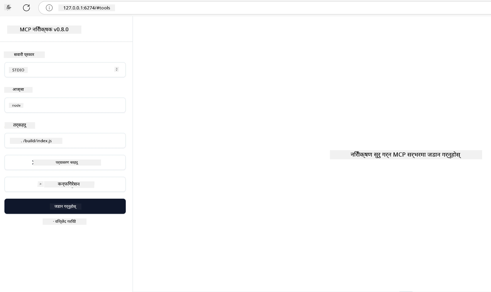

# व्यावहारिक कार्यान्वयन

[](https://youtu.be/vCN9-mKBDfQ)

_(उपरोक्त छवि क्लिक गर्दा यस पाठको भिडियो हेर्न सकिन्छ)_

व्यावहारिक कार्यान्वयन भनेको Model Context Protocol (MCP) को शक्ति स्पर्शयोग्य हुन्छ। MCP पछाडि रहेको सिद्धान्त र वास्तुकला बुझ्नु महत्त्वपूर्ण भए पनि, वास्तविक मूल्य तब देखा पर्छ जब तपाईं यी अवधारणाहरूलाई वास्तविक विश्व समस्याहरू समाधान गर्न निर्माण, परीक्षण, र तैनाथ गर्नुहुन्छ। यो अध्यायले वैचारिक ज्ञान र व्यावहारिक विकासबीचको खाडललाई पुल पार्छ, तपाईलाई MCP आधारित एप्लिकेसनहरू जीवित बनाउन मार्गदर्शन गर्दछ।

तपाईं बुद्धिमान सहायकहरू विकास गर्दै हुनुहुन्छ वा AI लाई व्यापार कार्यप्रवाहहरूमा समाहित गर्दै हुनुहुन्छ वा डाटा प्रसोधनका लागि कस्टम उपकरणहरू निर्माण गर्दै हुनुहुन्छ भने, MCP एक लचिलो आधार प्रदान गर्दछ। यसको भाषा-स्वतन्त्र डिजाइन र लोकप्रिय प्रोग्रामिंग भाषाहरूको लागि आधिकारिक SDK हरूले यसलाई व्यापक विकासकर्ताहरूका लागि पहुँचयोग्य बनाउँछ। यी SDK हरूको प्रयोग गरेर, तपाईं छिटो प्रोटोटाइप बनाउन, पुनरावृत्ति गर्न र विभिन्न प्लेटफर्महरू र वातावरणहरूमा तपाईंका समाधानहरू विस्तार गर्न सक्नुहुन्छ।

अगाडि आएका खण्डहरूमा, तपाईंले व्यावहारिक उदाहरणहरू, नमूना कोडहरू, र तैनाती रणनीतिहरू पाउनुहुनेछ जसले C#, Java with Spring, TypeScript, JavaScript, र Python मा MCP कसरी कार्यान्वयन गर्ने देखाउँछन्। तपाईंले आफ्नो MCP सर्भरहरू कसरी डिबग र परीक्षण गर्ने, API हरू व्यवस्थापन गर्ने, र Azure मार्फत समाधानहरू कसरी क्लाउडमा तैनाथ गर्ने सिक्नुहुनेछ। यी प्रयोगात्मक स्रोतहरूले तपाईंको सिकाइलाई तीव्र बनाउन र आत्मविश्वासका साथ बलियो, उत्पादन-तयार MCP एप्लिकेसनहरू निर्माण गर्न मद्दत गर्ने उद्देश्य राख्दछन्।

## अवलोकन

यो पाठले विभिन्न प्रोग्रामिङ भाषाहरूमा MCP कार्यान्वयनका व्यावहारिक पक्षहरूमा केन्द्रित छ। हामी C#, Java with Spring, TypeScript, JavaScript, र Python मा MCP SDK हरू प्रयोग गरेर बलियो एप्लिकेसनहरू कसरी बनाउन, MCP सर्भरहरू डिबग र परीक्षण गर्न, र पुन: प्रयोग गर्न मिल्ने स्रोतहरू, प्रॉम्प्टहरू, र उपकरणहरू कसरी सिर्जना गर्ने अन्वेषण गर्नेछौं।

## सिकाइ लक्ष्यहरू

यस पाठको अन्त्यसम्म, तपाईं सक्षम हुनुहुनेछ:

- आधिकारिक SDK हरू प्रयोग गरेर विभिन्न प्रोग्रामिङ भाषाहरूमा MCP समाधान कार्यान्वयन गर्न
- MCP सर्भरहरूलाई व्यवस्थित रूपमा डिबग र परीक्षण गर्न
- सर्भर सुविधाहरू (स्रोतहरू, प्रॉम्प्टहरू, र उपकरणहरू) सिर्जना र प्रयोग गर्न
- जटिल कार्यहरूको लागि प्रभावकारी MCP कार्यप्रवाहहरू डिजाइन गर्न
- प्रदर्शन र विश्वसनीयताको लागि MCP कार्यान्वयनहरू अनुकूलन गर्न

## आधिकारिक SDK स्रोतहरू

Model Context Protocol ले विभिन्न भाषाहरूका लागि आधिकारिक SDK हरू प्रस्ताव गर्दछ ([MCP विनिर्देशन 2025-11-25](https://spec.modelcontextprotocol.io/specification/2025-11-25/) सँग मेल खाने):

- [C# SDK](https://github.com/modelcontextprotocol/csharp-sdk)
- [Java with Spring SDK](https://github.com/modelcontextprotocol/java-sdk) **टिप्पणी:** [Project Reactor](https://projectreactor.io) मा निर्भरता आवश्यक छ। (हेर्नुहोस् [बहस मुद्दा 246](https://github.com/orgs/modelcontextprotocol/discussions/246)।)
- [TypeScript SDK](https://github.com/modelcontextprotocol/typescript-sdk)
- [Python SDK](https://github.com/modelcontextprotocol/python-sdk)
- [Kotlin SDK](https://github.com/modelcontextprotocol/kotlin-sdk)
- [Go SDK](https://github.com/modelcontextprotocol/go-sdk)

## MCP SDK हरूसँग काम गर्दै

यस खण्डले विभिन्न प्रोग्रामिङ भाषाहरूमा MCP कार्यान्वयनका व्यावहारिक उदाहरणहरू प्रस्तुत गर्दछ। तपाईं `samples` निर्देशिकामा भाषाअनुसार व्यवस्थित नमूना कोडहरू फेला पार्न सक्नुहुन्छ।

### उपलब्ध नमूनाहरू

रेपोजिटरीले निम्न भाषाहरूमा [नमूना कार्यान्वयनहरू](../../../04-PracticalImplementation/samples) समावेश गर्दछ:

- [C#](./samples/csharp/README.md)
- [Java with Spring](./samples/java/containerapp/README.md)
- [TypeScript](./samples/typescript/README.md)
- [JavaScript](./samples/javascript/README.md)
- [Python](./samples/python/README.md)

प्रत्येक नमूनाले उक्त भाषा र पारिस्थितिकी तंत्रका लागि महत्वपूर्ण MCP अवधारणाहरू र कार्यान्वयन ढाँचाहरू प्रदर्शन गर्दछ।

### व्यावहारिक मार्गदर्शकहरू

अतिरिक्त MCP कार्यान्वयनका लागि मार्गदर्शकहरू:

- [पेजिनेशन र ठूलो परिणाम सेटहरू](./pagination/README.md) - उपकरणहरू, स्रोतहरू, र ठूलो डाटासेटका लागि कर्सर-आधारित पेजिनेशन ह्यान्डल गर्ने

## मुख्य सर्भर सुविधाहरू

MCP सर्भरहरूले यी सुविधाहरूको कुनै पनि संयोजन कार्यान्वयन गर्न सक्छन्:

### स्रोतहरू

स्रोतहरूले प्रयोगकर्ता वा AI मोडेलले प्रयोग गर्ने सन्दर्भ र डाटा प्रदान गर्दछन्:

- कागजात संग्रहालयहरू
- ज्ञान आधारहरू
- संरचित डाटा स्रोतहरू
- फाइल प्रणालीहरू

### प्रॉम्प्टहरू

प्रॉम्प्टहरूले प्रयोगकर्ताका लागि टेम्पलेट गरिएको सन्देशहरू र कार्यप्रवाहहरू हुन्:

- पूर्वनिर्धारित संवाद टेम्पलेटहरू
- निर्देशित अन्तरक्रिया ढाँचाहरू
- विशेषीकृत संवाद संरचनाहरू

### उपकरणहरू

उपकरणहरू AI मोडेलले कार्यान्वयन गर्नका लागि कार्यहरू हुन्:

- डाटा प्रशोधन उपयोगिताहरू
- बाह्य API इन्टिग्रेसनहरू
- गणनात्मक क्षमताहरू
- खोज कार्य क्षमता

## नमूना कार्यान्वयन: C# कार्यान्वयन

आधिकारिक C# SDK रेपोजिटरीमा MCP का विभिन्न पाटाहरू प्रदर्शन गर्ने धेरै नमूना कार्यान्वयनहरू छन्:

- **मूल MCP क्लाइन्ट**: MCP क्लाइन्ट कसरी बनाउने र उपकरणहरू कसरी कल गर्ने सरल उदाहरण
- **मूल MCP सर्भर**: आधारभूत उपकरण दर्तासहित न्यूनतम सर्भर कार्यान्वयन
- **उन्नत MCP सर्भर**: उपकरण दर्ता, प्रमाणीकरण, र त्रुटि ह्यान्डलिङ्गसहित पूर्ण सुविधायुक्त सर्भर
- **ASP.NET एकीकरण**: ASP.NET Core सँगको एकीकरण देखाउने उदाहरणहरू
- **उपकरण कार्यान्वयन नमूनाहरू**: विभिन्न जटिलताका साथ उपकरणहरू कार्यान्वयन गर्ने विविध ढाँचाहरू

MCP C# SDK प्रावलोकन अवस्थामा छ र API हरू परिवर्तन हुन सक्छन्। SDK विकास हुँदै जाँदा हामी यस ब्लगलाई निरन्तर अद्यावधिक गर्नेछौं।

### मुख्य सुविधाहरू

- [C# MCP Nuget ModelContextProtocol](https://www.nuget.org/packages/ModelContextProtocol)
- तपाईंको [पहिलो MCP सर्भर](https://devblogs.microsoft.com/dotnet/build-a-model-context-protocol-mcp-server-in-csharp/) बनाउँदै।

पूर्ण C# कार्यान्वयन नमूनाहरूको लागि, [आधिकारिक C# SDK नमूना रेपोजिटरी](https://github.com/modelcontextprotocol/csharp-sdk) भ्रमण गर्नुहोस्।

## नमूना कार्यान्वयन: Java with Spring कार्यान्वयन

Java with Spring SDK ले उद्यम-ग्रेड सुविधाहरूसँग बलियो MCP कार्यान्वयन विकल्पहरू प्रदान गर्दछ।

### मुख्य सुविधाहरू

- Spring Framework एकीकरण
- बलियो प्रकार सुरक्षा
- प्रतिक्रियात्मक प्रोग्रामिङ समर्थन
- समग्र त्रुटि ह्यान्डलिङ्ग

पूर्ण Java with Spring कार्यान्वयन नमूनाको लागि, नमूनाहरू निर्देशिकामा [Java with Spring नमूना](samples/java/containerapp/README.md) हेर्नुहोस्।

## नमूना कार्यान्वयन: JavaScript कार्यान्वयन

JavaScript SDK ले MCP कार्यान्वयनका लागि हल्का र लचिलो दृष्टिकोण प्रदान गर्दछ।

### मुख्य सुविधाहरू

- Node.js र ब्राउजर समर्थन
- Promise-आधारित API
- Express र अन्य फ्रेमवर्कहरूसँग सजिलो एकीकरण
- स्ट्रिमिङका लागि WebSocket समर्थन

पूर्ण JavaScript कार्यान्वयन नमूनाको लागि, नमूनाहरू निर्देशिकामा [JavaScript नमूना](samples/javascript/README.md) हेर्नुहोस्।

## नमूना कार्यान्वयन: Python कार्यान्वयन

Python SDK ले उत्कृष्ट ML फ्रेमवर्क एकीकरणहरू सहित Pythonic रुपमा MCP कार्यान्वयन प्रस्ताव गर्दछ।

### मुख्य सुविधाहरू

- asyncio सहित Async/await समर्थन
- FastAPI एकीकरण
- सरल उपकरण दर्ता प्रक्रिया
- लोकप्रिय ML पुस्तकालयहरूसँग स्वदेशी एकीकरण

पूर्ण Python कार्यान्वयन नमूनाको लागि, नमूनाहरू निर्देशिकामा [Python नमूना](samples/python/README.md) हेर्नुहोस्।

## API व्यवस्थापन

Azure API Management एक उत्कृष्ट उत्तर हो कसरी MCP सर्भरहरूलाई सुरक्षित गर्ने। विचार यो हो कि तपाईँको MCP सर्भर अगाडि Azure API Management instance राख्नु र यसलाई निम्न जस्तै चाहिने सुविधाहरू ह्यान्डल गर्न दिनु:

- दर सीमितीकरण (rate limiting)
- टोकन व्यवस्थापन
- अनुगमन
- लोड ब्यालेन्सिङ
- सुरक्षा

### Azure नमूना

यहाँ एक Azure नमूना छ जुन ठीक त्यही गर्छ, अर्थात [MCP सर्भर बनाउने र Azure API Management मार्फत सुरक्षित गर्ने](https://github.com/Azure-Samples/remote-mcp-apim-functions-python)।

अधिकार प्रवाह तल दिइएको छवि अनुसार कसरी हुन्छ हेर्नुहोस्:


अर्को चित्रमा, तलका क्रियाहरू हुन्छन्:

- प्रमाणीकरण/अधिकार Microsoft Entra प्रयोग गरेर हुन्छ।
- Azure API Management एक गेटवेको रूपमा काम गर्छ र नीति प्रयोग गरी ट्राफिक निर्देशित र व्यवस्थापन गर्छ।
- Azure Monitor सबै अनुरोधहरू लग गर्दछ थप विश्लेषणका लागि।

#### अधिकार प्रवाह

अधिकरा प्रवाहलाई विश्लेषण गर्दै थप विवरण हेर्नुहोस्:


#### MCP अधिकार विनिर्देशन

[MCP अधिकार विनिर्देशन](https://spec.modelcontextprotocol.io/specification/2025-11-25/basic/authorization/)बारे थप जान्नुहोस्।

## रिमोट MCP सर्भरलाई Azure मा तैनाथ गर्नुहोस्

अब हामीले पहिले उल्लेख गरेको नमूना तैनाथ गर्न सक्छौं कि गर्दैनौं हेर्नुहोस्:

1. रेपोजिटरी क्लोन गर्नुहोस्

    ```bash
    git clone https://github.com/Azure-Samples/remote-mcp-apim-functions-python.git
    cd remote-mcp-apim-functions-python
    ```

1. `Microsoft.App` स्रोत प्रदायक दर्ता गर्नुहोस्।

   - यदि तपाईं Azure CLI प्रयोग गर्दै हुनुहुन्छ भने, चलाउनुहोस् `az provider register --namespace Microsoft.App --wait`।
   - यदि तपाईं Azure PowerShell प्रयोग गर्दै हुनुहुन्छ भने, चलाउनुहोस् `Register-AzResourceProvider -ProviderNamespace Microsoft.App`। त्यसपछि केही समयपछि ` (Get-AzResourceProvider -ProviderNamespace Microsoft.App).RegistrationState` चलाएर दर्ता सम्पन्न भएको छ कि छैन जाँच गर्नुहोस्।

1. यो [azd](https://aka.ms/azd) आदेश चलाउनुहोस् जसले API व्यवस्थापन सेवा, function app(कोडसहित) र अन्य आवश्यक Azure स्रोतहरू प्रस्ताव गर्नेछ

    ```shell
    azd up
    ```

    यो आदेशले सबै क्लाउड स्रोतहरू Azure मा तैनाथ गरिनु पर्छ

### MCP Inspector सँग आफ्नो सर्भर परीक्षण गर्नुहोस्

1. **नयाँ टर्मिनल विन्डोमा**, MCP Inspector स्थापना गरी चलाउनुहोस्

    ```shell
    npx @modelcontextprotocol/inspector
    ```

    तपाईंले त्यस्तो प्रयोगकर्ता अन्तरफलक देख्नु पर्नेछ:

    

1. CTRL क्लिक गरेर एपले देखाएको URL बाट MCP Inspector वेब एप लोड गर्नुहोस् (जस्तै [http://127.0.0.1:6274/#resources](http://127.0.0.1:6274/#resources))
1. ट्रान्सपोर्ट प्रकार `SSE` मा सेट गर्नुहोस्
1. तपाइँको चलिरहेको API Management SSE एन्डपोइन्ट URL स्थापना गर्नुहोस् जुन `azd up` पछि देखिन्छ र **Connect** गर्नुहोस्:

    ```shell
    https://<apim-servicename-from-azd-output>.azure-api.net/mcp/sse
    ```

1. **सूचीकरण उपकरणहरू**। कुनै उपकरणमा क्लिक गरी **Run Tool** गर्नुहोस्।

यदि सबै चरणहरू सफल भए भने, तपाईं अहिले MCP सर्भरमा जडान हुनुहुन्छ र उपकरण कल गर्न सक्षम हुनुहुन्छ।

## Azure का लागि MCP सर्भरहरू

[Remote-mcp-functions](https://github.com/Azure-Samples/remote-mcp-functions-dotnet): यी रेपोजिटरीहरूले Azure Functions सँग Python, C# .NET वा Node/TypeScript प्रयोग गरेर कस्टम रिमोट MCP (Model Context Protocol) सर्भरहरू निर्माण र तैनाथ गर्ने द्रुत आरम्भ टेम्प्लेटहरू हुन्।

नमूनाहरूले विकासकर्ताहरूलाई पूर्ण समाधान प्रदान गर्दछ जसले:

- स्थानीय रूपमा निर्माण र चलाउन: स्थानीय मेसिनमा MCP सर्भर विकास र डिबग गर्न
- Azure मा तैनाथ गर्न: सजिलै क्लाउडमा तैनाथ गर्न `azd up` आदेश प्रयोग गरेर
- क्लाइन्टहरूबाट जडान गर्न: विभिन्न क्लाइन्टहरूबाट MCP सर्भरमा जडान गर्न, जसमा VS Code को Copilot एजेन्ट मोड र MCP Inspector उपकरण समावेश छन्

### मुख्य विशेषताहरू

- डिजाइनबाट सुरक्षा: MCP सर्भर कुञ्जीहरू र HTTPS प्रयोग गरेर सुरक्षित गरिएको छ
- प्रमाणीकरण विकल्पहरू: निर्माण गरिएको प्रमाणीकरण र/वा API व्यवस्थापन प्रयोग गरेर OAuth समर्थन
- नेटवर्क अलगाव: Azure Virtual Networks (VNET) प्रयोग गरेर नेटवर्क अलगावको अनुमति
- सर्वरलेस वास्तुकला: Azure Functions को प्रयोगले स्केलेबल, घटना-आधारित कार्यान्वयन
- स्थानीय विकास: व्यापक स्थानीय विकास र डिबगिङ्ग समर्थन
- सरल तैनाती: Azure मा सरलीकृत तैनाती प्रक्रिया

रेपोजिटरीले सबै आवश्यक कन्फिगरेसन फाइलहरू, स्रोत कोड, र पूर्वाधार परिभाषाहरू समावेश गर्दछ जसले उत्पादन-तयार MCP सर्भर कार्यान्वयनमा छिटो सुरुवात गर्न मद्दत गर्छ।

- [Azure Remote MCP Functions Python](https://github.com/Azure-Samples/remote-mcp-functions-python) - Python सँग Azure Functions प्रयोग गरी MCP को नमूना कार्यान्वयन

- [Azure Remote MCP Functions .NET](https://github.com/Azure-Samples/remote-mcp-functions-dotnet) - C# .NET सँग Azure Functions प्रयोग गरी MCP को नमूना कार्यान्वयन

- [Azure Remote MCP Functions Node/Typescript](https://github.com/Azure-Samples/remote-mcp-functions-typescript) - Node/TypeScript सँग Azure Functions प्रयोग गरी MCP को नमूना कार्यान्वयन

## मुख्य सिकाइ

- MCP SDK हरूले बलियो MCP समाधानहरू कार्यान्वयन गर्न भाषाविशेष उपकरणहरू प्रदान गर्दछन्
- डिबगिङ र परीक्षण प्रक्रिया विश्वसनीय MCP अनुप्रयोगहरूको लागि महत्त्वपूर्ण छ
- पुन: प्रयोग हुने प्रॉम्प्ट टेम्पलेटहरूले स्थिर AI अन्तर्क्रियाहरू सक्षम पार्दछन्
- राम्ररी डिजाइन गरिएका कार्यप्रवाहहरूले एक भन्दा बढी उपकरण प्रयोग गरी जटिल कार्यहरू समन्वय गर्न सक्छन्
- MCP समाधान कार्यान्वयन गर्दा सुरक्षा, प्रदर्शन, र त्रुटि ह्यान्डलिङ्गलाई ध्यानमा राख्नुपर्छ

## अभ्यास

तपाईंको डोमेनमा वास्तविक समस्या समाधान गर्ने व्यावहारिक MCP कार्यप्रवाह डिजाइन गर्नुहोस्:

1. यस समस्याको समाधानका लागि उपयोगी हुने ३-४ उपकरणहरू पहिचान गर्नुहोस्
2. ती उपकरणहरूको अन्तरक्रिया देखाउने कार्यप्रवाह आरेख बनाउनुहोस्
3. तपाईंले रोजेको भाषामा एउटा उपकरणको आधारभूत संस्करण कार्यान्वयन गर्नुहोस्
4. त्यो उपकरणलाई प्रभावकारी रूपमा प्रयोग गर्न मोडललाई सहयोग गर्ने प्रॉम्प्ट टेम्पलेट सिर्जना गर्नुहोस्

## थप स्रोतहरू

---

## के अगाडि छ

अगाडि: [उन्नत विषयहरू](../05-AdvancedTopics/README.md)

---

<!-- CO-OP TRANSLATOR DISCLAIMER START -->
**अस्वीकरण**:
यस दस्तावेजलाई AI अनुवाद सेवा [Co-op Translator](https://github.com/Azure/co-op-translator) प्रयोग गरी अनुवाद गरिएको हो। हामी शुद्धताको प्रयास गर्छौं, तर कृपया बुझ्नुस् कि स्वचालित अनुवादमा त्रुटि वा अशुद्धता हुनसक्छ। मूल दस्तावेज यसको स्थानीय भाषामा आधिकारिक स्रोत मानिनुपर्छ। महत्वपूर्ण जानकारीका लागि पेशेवर मानवीय अनुवाद सिफारिस गरिन्छ। यस अनुवादको प्रयोगबाट उत्पन्न हुने कुनै पनि गलतफहमी वा व्याख्याको लागि हामी जिम्मेवार छैनौं।
<!-- CO-OP TRANSLATOR DISCLAIMER END -->