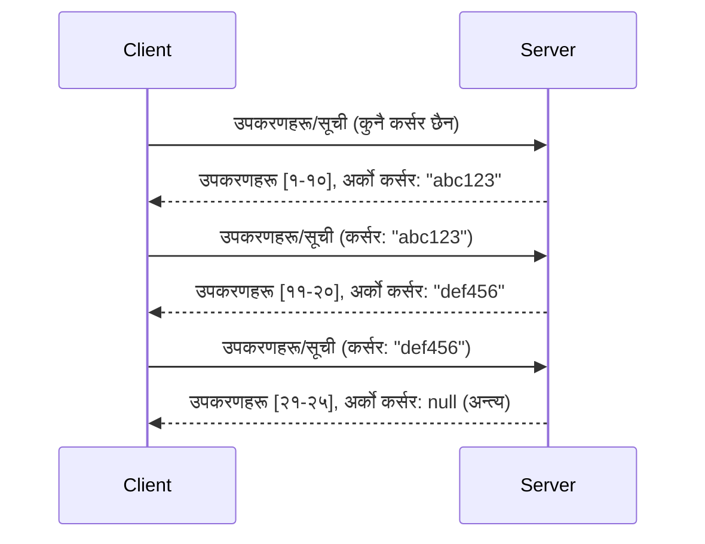

# MCP मा पेजिनेशन र ठूलो नतिजा सेटहरू

जब तपाईँको MCP सर्भरले ठूलो डेटा सेटहरू सम्हाल्छ - हजारौं फाइलहरू, डेटाबेस रेकर्डहरू, वा खोज परिणामहरूको सूची बनाउँदा - तपाईंलाई स्मृति कुशलतापूर्वक व्यवस्थापन गर्न र प्रतिक्रियाशील प्रयोगकर्ता अनुभवहरू प्रदान गर्न पेजिनेशन आवश्यक हुन्छ। यो गाइडले MCP मा कसरी पेजिनेशन कार्यान्वयन र प्रयोग गर्ने बारेमा कभर गर्छ।

## किन पेजिनेशन महत्त्वपूर्ण छ

पेजिनेशन बिना, ठूला प्रतिक्रिया कारण हुन सक्छन्:

- **स्मृति समाप्ति** - एकै पटक लाखौं रेकर्डहरू लोड गर्ने
- **ढिलो प्रतिक्रिया समय** - सबै डेटा लोड हुनाले प्रयोगकर्ताहरू प्रतीक्षा गर्छन्
- **टाइमआउट त्रुटिहरू** - अनुरोधहरूले टाइमआउट सीमा पार गर्छन्
- **खराब AI प्रदर्शन** - LLM हरू विशाल सन्दर्भसँग संघर्ष गर्छन्

MCP ले परिणाम सेटहरूमा विश्वसनीय, स्थिर पेजिंगका लागि **करसर-आधारित पेजिनेशन** प्रयोग गर्छ।

---

## MCP पेजिनेशन कसरी काम गर्छ

### करसर अवधारणा

एक **करसर** एउटा अपारदर्शी स्ट्रिङ हो जुन तपाईंको परिणाम सेटमा स्थितिलाई चिन्ह गर्छ। यसलाई लामो पुस्तकमा बुकमार्क जस्तै सोच्नुहोस्।


### MCP विधिहरूमा पेजिनेशन

यी MCP विधिहरूले पेजिनेशन समर्थन गर्छन्:

| विधि | फिर्ता गर्दछ | करसर समर्थन |
|--------|---------|----------------|
| `tools/list` | उपकरण परिभाषाहरू | ✅ |
| `resources/list` | स्रोत परिभाषाहरू | ✅ |
| `prompts/list` | प्रॉम्प्ट परिभाषाहरू | ✅ |
| `resources/templates/list` | स्रोत टेम्प्लेटहरू | ✅ |

---

## सर्भर कार्यान्वयन

### Python (FastMCP)

```python
from mcp.server import Server
from mcp.types import Tool, ListToolsResult
import math

app = Server("paginated-server")

# अनुकरण गरिएको ठूलो डेटासेट
ALL_TOOLS = [
    Tool(name=f"tool_{i}", description=f"Tool number {i}", inputSchema={})
    for i in range(100)
]

PAGE_SIZE = 10

@app.list_tools()
async def list_tools(cursor: str | None = None) -> ListToolsResult:
    """List tools with pagination support."""
    
    # सुरु गर्न सूचकाङ्क पाउन कर्सर डिकोड गर्नुहोस्
    start_index = 0
    if cursor:
        try:
            start_index = int(cursor)
        except ValueError:
            start_index = 0
    
    # परिणामहरूको पृष्ठ प्राप्त गर्नुहोस्
    end_index = min(start_index + PAGE_SIZE, len(ALL_TOOLS))
    page_tools = ALL_TOOLS[start_index:end_index]
    
    # अर्को कर्सर गणना गर्नुहोस्
    next_cursor = None
    if end_index < len(ALL_TOOLS):
        next_cursor = str(end_index)
    
    return ListToolsResult(
        tools=page_tools,
        nextCursor=next_cursor
    )
```

### TypeScript

```typescript
import { Server } from "@modelcontextprotocol/sdk/server/index.js";
import { ListToolsResultSchema } from "@modelcontextprotocol/sdk/types.js";

const server = new Server({
  name: "paginated-server",
  version: "1.0.0"
});

// अनुकरण गरिएको ठूलो डाटा सेट
const ALL_TOOLS = Array.from({ length: 100 }, (_, i) => ({
  name: `tool_${i}`,
  description: `Tool number ${i}`,
  inputSchema: { type: "object", properties: {} }
}));

const PAGE_SIZE = 10;

server.setRequestHandler(ListToolsResultSchema, async (request) => {
  // कर्सर डिकोड गर्नुहोस्
  let startIndex = 0;
  if (request.params?.cursor) {
    startIndex = parseInt(request.params.cursor, 10) || 0;
  }
  
  // नतिजाहरूको पृष्ठ प्राप्त गर्नुहोस्
  const endIndex = Math.min(startIndex + PAGE_SIZE, ALL_TOOLS.length);
  const pageTools = ALL_TOOLS.slice(startIndex, endIndex);
  
  // अर्को कर्सर गणना गर्नुहोस्
  const nextCursor = endIndex < ALL_TOOLS.length ? String(endIndex) : undefined;
  
  return {
    tools: pageTools,
    nextCursor
  };
});
```

### Java (Spring MCP)

```java
@Service
public class PaginatedToolService {
    
    private static final int PAGE_SIZE = 10;
    private final List<Tool> allTools;
    
    public PaginatedToolService() {
        // ठूलो डेटा सेट प्रारम्भ गर्नुहोस्
        this.allTools = IntStream.range(0, 100)
            .mapToObj(i -> new Tool("tool_" + i, "Tool number " + i, Map.of()))
            .collect(Collectors.toList());
    }
    
    @McpMethod("tools/list")
    public ListToolsResult listTools(@Param("cursor") String cursor) {
        // कर्सर डिकोड गर्नुहोस्
        int startIndex = 0;
        if (cursor != null && !cursor.isEmpty()) {
            try {
                startIndex = Integer.parseInt(cursor);
            } catch (NumberFormatException e) {
                startIndex = 0;
            }
        }
        
        // परिणामहरूको पृष्ठ प्राप्त गर्नुहोस्
        int endIndex = Math.min(startIndex + PAGE_SIZE, allTools.size());
        List<Tool> pageTools = allTools.subList(startIndex, endIndex);
        
        // अर्को कर्सर गणना गर्नुहोस्
        String nextCursor = endIndex < allTools.size() ? String.valueOf(endIndex) : null;
        
        return new ListToolsResult(pageTools, nextCursor);
    }
}
```

---

## क्लाइन्ट कार्यान्वयन

### Python क्लाइन्ट

```python
from mcp import ClientSession

async def get_all_tools(session: ClientSession) -> list:
    """Fetch all tools using pagination."""
    all_tools = []
    cursor = None
    
    while True:
        result = await session.list_tools(cursor=cursor)
        all_tools.extend(result.tools)
        
        if result.nextCursor is None:
            break
        cursor = result.nextCursor
    
    return all_tools

# प्रयोग गर्ने तरिका
async with client_session as session:
    tools = await get_all_tools(session)
    print(f"Found {len(tools)} tools")
```

### TypeScript क्लाइन्ट

```typescript
import { Client } from "@modelcontextprotocol/sdk/client/index.js";

async function getAllTools(client: Client): Promise<Tool[]> {
  const allTools: Tool[] = [];
  let cursor: string | undefined = undefined;
  
  do {
    const result = await client.listTools({ cursor });
    allTools.push(...result.tools);
    cursor = result.nextCursor;
  } while (cursor);
  
  return allTools;
}

// प्रयोग
const tools = await getAllTools(client);
console.log(`Found ${tools.length} tools`);
```

### सुस्त लोडिङ्ग ढाँचा

धेरै ठूलो डेटा सेटहरूका लागि, आवश्यकता अनुसार पृष्ठहरू लोड गर्नुहोस्:

```python
class PaginatedToolIterator:
    """Lazily iterate through paginated tools."""
    
    def __init__(self, session: ClientSession):
        self.session = session
        self.cursor = None
        self.buffer = []
        self.exhausted = False
    
    async def __anext__(self):
        # उपलब्ध भएमा बफरबाट फर्किनुहोस्
        if self.buffer:
            return self.buffer.pop(0)
        
        # जाँच्नुहोस् कि हामीले सबै पृष्ठहरू समाप्त गरिसक्यौं कि छैन
        if self.exhausted:
            raise StopAsyncIteration
        
        # अर्को पृष्ठ ल्याउनुहोस्
        result = await self.session.list_tools(cursor=self.cursor)
        self.buffer = list(result.tools)
        self.cursor = result.nextCursor
        
        if self.cursor is None:
            self.exhausted = True
        
        if not self.buffer:
            raise StopAsyncIteration
        
        return self.buffer.pop(0)
    
    def __aiter__(self):
        return self

# प्रयोग - ठूलो डेटासेटहरूको लागि स्मृति कुशल
async for tool in PaginatedToolIterator(session):
    process_tool(tool)
```

---

## स्रोतहरूको लागि पेजिनेशन

स्रोतहरूले प्रायः डाइरेक्टरीहरू वा ठूलो डेटा सेटहरूका लागि पेजिनेशन आवश्यक पर्छ:

```python
from mcp.server import Server
from mcp.types import Resource, ListResourcesResult
import os

app = Server("file-server")

@app.list_resources()
async def list_resources(cursor: str | None = None) -> ListResourcesResult:
    """List files in directory with pagination."""
    
    directory = "/data/files"
    all_files = sorted(os.listdir(directory))
    
    # कर्सर डिकोड गर्नुहोस् (फाइल सूचकांक)
    start_index = int(cursor) if cursor else 0
    page_size = 20
    end_index = min(start_index + page_size, len(all_files))
    
    # यस पृष्ठको लागि स्रोत सूची बनाउनुहोस्
    resources = []
    for filename in all_files[start_index:end_index]:
        filepath = os.path.join(directory, filename)
        resources.append(Resource(
            uri=f"file://{filepath}",
            name=filename,
            mimeType="application/octet-stream"
        ))
    
    # अर्को कर्सर गणना गर्नुहोस्
    next_cursor = str(end_index) if end_index < len(all_files) else None
    
    return ListResourcesResult(
        resources=resources,
        nextCursor=next_cursor
    )
```

---

## करसर डिजाइन रणनीतिहरू

### रणनीति 1: सूची-आधारित (सरल)

```python
# कर्सर केवल सूची सूचकांक हो
cursor = "50"  # आइटम ५० बाट सुरु गर्नुहोस्
```

**फाइदा:** सरल, स्टेटलेस  
**नोक्सानी:** वस्तुहरू थपिए/हटाइएमा नतिजाहरू सर्न सक्छन्

### रणनीति 2: आईडी-आधारित (स्थिर)

```python
# कर्सर अन्तिम देखिएको ID हो
cursor = "item_abc123"  # यस वस्तुको पछि सुरु गर्नुहोस्
```

**फाइदा:** वस्तुहरू परिवर्तन भए पनि स्थिर रहन्छ  
**नोक्सानी:** क्रमबद्ध ID आवश्यक छ

### रणनीति 3: एन्कोड गरिएको अवस्था (जटिल)

```python
import base64
import json

def encode_cursor(state: dict) -> str:
    return base64.b64encode(json.dumps(state).encode()).decode()

def decode_cursor(cursor: str) -> dict:
    return json.loads(base64.b64decode(cursor).decode())

# कर्सरमा धेरै अवस्था क्षेत्रहरू छन्
cursor = encode_cursor({
    "offset": 50,
    "filter": "active",
    "sort": "name"
})
```

**फाइदा:** जटिल अवस्था एन्कोड गर्न सक्छ  
**नोक्सानी:** बढी जटिल, ठूलो करसर स्ट्रिङ

---

## उत्तम अभ्यासहरू

### 1. उपयुक्त पृष्ठ आकार छान्नुहोस्

```python
# डाटा आकार विचार गर्नुहोस्
PAGE_SIZE_SMALL_ITEMS = 100   # साधारण मेटाडाटा
PAGE_SIZE_MEDIUM_ITEMS = 20   # धनी वस्तुहरू
PAGE_SIZE_LARGE_ITEMS = 5     # जटिल सामग्री
```

### २. अमान्य करसरहरूलाई सजिलै ह्यान्डल गर्नुहोस्

```python
@app.list_tools()
async def list_tools(cursor: str | None = None) -> ListToolsResult:
    try:
        start_index = int(cursor) if cursor else 0
        if start_index < 0 or start_index >= len(ALL_TOOLS):
            start_index = 0  # सुरुमा पुनःसेट गर्नुहोस्
    except (ValueError, TypeError):
        start_index = 0  # अवैध कर्सर, नयाँबाट सुरु गर्नुहोस्
    # ...
```

### 3. कुल गणना समावेश गर्नुहोस् (वैकल्पिक)

```python
return ListToolsResult(
    tools=page_tools,
    nextCursor=next_cursor,
    # केहि कार्यान्वयनहरूले UI प्रगतिको लागि कुल समावेश गर्छन्
    _meta={"total": len(ALL_TOOLS)}
)
```

### 4. एज् केसहरू परीक्षण गर्नुहोस्

```python
async def test_pagination():
    # खाली परिणाम सेट
    result = await session.list_tools()
    assert result.tools == []
    assert result.nextCursor is None
    
    # एक पृष्ठ
    result = await session.list_tools()
    assert len(result.tools) <= PAGE_SIZE
    
    # अमान्य कर्सर
    result = await session.list_tools(cursor="invalid")
    assert result.tools  # पहिलो पृष्ठ फर्किनुपर्छ
```

---

## सामान्य गल्तीहरू

### ❌ सबै परिणामहरू फिर्ता गरेर त्यसपछि क्लाइन्ट पक्षमा पेजिनेशन गर्ने

```python
# खराब: सबै कुरा मेमोरीमा लोड गर्दछ
@app.list_tools()
async def list_tools() -> ListToolsResult:
    all_tools = load_all_tools()  # १ लाख उपकरणहरू!
    return ListToolsResult(tools=all_tools)
```

### ✅ डेटा स्रोतमा पेजिनेशन गर्ने

```python
# राम्रो: केवल आवश्यक पर्ने कुरा मात्र लोड गर्छ
@app.list_tools()
async def list_tools(cursor: str | None = None) -> ListToolsResult:
    offset = int(cursor) if cursor else 0
    tools = await db.query_tools(offset=offset, limit=PAGE_SIZE)
    return ListToolsResult(tools=tools, nextCursor=...)
```

---

## अर्को के छ

- [Module 5.14 - Context Engineering](../../05-AdvancedTopics/mcp-contextengineering/README.md)
- [Module 8 - Best Practices](../../08-BestPractices/README.md)
- [3.8 - Testing Your MCP Server](../../03-GettingStarted/08-testing/README.md)

---

## थप स्रोतहरू

- [MCP Specification - Pagination](https://spec.modelcontextprotocol.io/specification/2025-11-25/)
- [करसर-आधारित पेजिनेशन व्याख्या](https://slack.engineering/evolving-api-pagination-at-slack/)
- [Python SDK पेजिनेशन परीक्षणहरू](https://github.com/modelcontextprotocol/python-sdk/blob/main/tests/client/test_list_methods_cursor.py)

---

<!-- CO-OP TRANSLATOR DISCLAIMER START -->
**अस्वीकरण**:  
यो दस्तावेज AI अनुवाद सेवा [Co-op Translator](https://github.com/Azure/co-op-translator) प्रयोग गरी अनुवाद गरिएको हो। हामी शुद्धतामा प्रयासरत छौँ भने पनि, कृपया ध्यान दिनुहोस् कि स्वचालित अनुवादहरूमा गल्ती वा अशुद्धि हुन सक्छ। मूल दस्तावेज आफ्नो मूल भाषामा अधिकारिक स्रोत मानिनुपर्छ। महत्वपूर्ण जानकारीका लागि व्यावसायिक मानव अनुवाद सिफारिस गरिन्छ। यस अनुवादको प्रयोगबाट उत्पन्न कुनै पनि गलतफहमी वा गलत व्याख्याका लागि हामी जिम्मेवार छैनौं।
<!-- CO-OP TRANSLATOR DISCLAIMER END -->