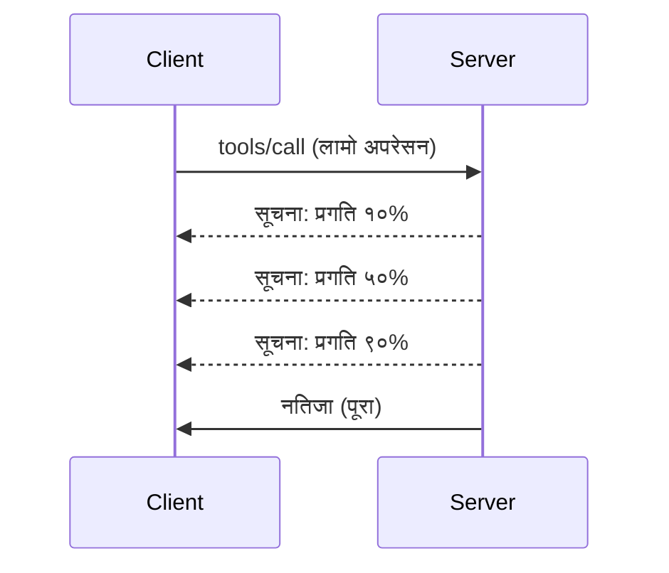

# MCP प्रोटोकल सुविधा गहिरो अन्वेषण

यो मार्गदर्शिकाले आधारभूत उपकरण र स्रोत व्यवस्थापन भन्दा पर गएर उन्नत MCP प्रोटोकल सुविधाहरू अन्वेषण गर्छ। यी सुविधाहरू बुझ्दा तपाईंले थप बलियो, प्रयोगकर्तामैत्री र उत्पादन-तय MCP सर्भरहरू निर्माण गर्न सक्नुहुन्छ।

## समेटिएका सुविधाहरू

1. **प्रगति सूचनाहरू** - लामो समय चल्ने अपरेसनहरूको प्रगतिको रिपोर्ट गर्नुहोस्
2. **अनुरोध रद्दीकरण** - ग्राहकहरूले चलिरहेका अनुरोधहरू रद्द गर्न सक्ने अनुमति
3. **स्रोत टेम्प्लेटहरू** - प्यारामिटरहरूसँग गतिशील स्रोत URI हरू
4. **सर्भर जीवनचक्र घटना** - उचित आरम्भ र बन्द प्रक्रियाहरू
5. **लगिङ नियन्त्रण** - सर्भर-पक्षको लगिङ कन्फिगरेसन
6. **त्रुटि ह्यान्डलिङ ढाँचा** - सुसंगत त्रुटि प्रतिक्रिया

---

## १. प्रगति सूचनाहरू

समय लाग्ने अपरेसनहरू (डेटा प्रशोधन, फाइल डाउनलोड, API कलहरू) का लागि प्रगति सूचनाले प्रयोगकर्ताहरूलाई जानकारीमा राख्छ।

### यसले कसरी काम गर्छ


### Python कार्यान्वयन

```python
from mcp.server import Server, NotificationOptions
from mcp.types import ProgressNotification
import asyncio

app = Server("progress-server")

@app.tool()
async def process_large_file(file_path: str, ctx) -> str:
    """Process a large file with progress updates."""
    
    # प्रगति गणनाको लागि फाइल आकार प्राप्त गर्नुहोस्
    file_size = os.path.getsize(file_path)
    processed = 0
    
    with open(file_path, 'rb') as f:
        while chunk := f.read(8192):
            # खन्ड प्रक्रिया गर्नुहोस्
            await process_chunk(chunk)
            processed += len(chunk)
            
            # प्रगति सूचन पठाउनुहोस्
            progress = (processed / file_size) * 100
            await ctx.send_notification(
                ProgressNotification(
                    progressToken=ctx.request_id,
                    progress=progress,
                    total=100,
                    message=f"Processing: {progress:.1f}%"
                )
            )
    
    return f"Processed {file_size} bytes"

@app.tool()
async def batch_operation(items: list[str], ctx) -> str:
    """Process multiple items with progress."""
    
    results = []
    total = len(items)
    
    for i, item in enumerate(items):
        result = await process_item(item)
        results.append(result)
        
        # प्रत्येक वस्तु पछि प्रगति रिपोर्ट गर्नुहोस्
        await ctx.send_notification(
            ProgressNotification(
                progressToken=ctx.request_id,
                progress=i + 1,
                total=total,
                message=f"Processed {i + 1}/{total}: {item}"
            )
        )
    
    return f"Completed {total} items"
```

### TypeScript कार्यान्वयन

```typescript
import { Server } from "@modelcontextprotocol/sdk/server/index.js";

server.setRequestHandler(CallToolSchema, async (request, extra) => {
  const { name, arguments: args } = request.params;
  
  if (name === "process_data") {
    const items = args.items as string[];
    const results = [];
    
    for (let i = 0; i < items.length; i++) {
      const result = await processItem(items[i]);
      results.push(result);
      
      // प्रगति सूचित गर्नुहोस्
      await extra.sendNotification({
        method: "notifications/progress",
        params: {
          progressToken: request.id,
          progress: i + 1,
          total: items.length,
          message: `Processing item ${i + 1}/${items.length}`
        }
      });
    }
    
    return { content: [{ type: "text", text: JSON.stringify(results) }] };
  }
});
```

### ग्राहक-पक्ष ह्यान्डलिङ (Python)

```python
async def handle_progress(notification):
    """Handle progress notifications from server."""
    params = notification.params
    print(f"Progress: {params.progress}/{params.total} - {params.message}")

# ह्यान्डलर दर्ता गर्नुहोस्
session.on_notification("notifications/progress", handle_progress)

# उपकरण कल गर्नुहोस् (प्रगतिको अपडेटहरू ह्यान्डलरमार्फत आउनेछन्)
result = await session.call_tool("process_large_file", {"file_path": "/data/large.csv"})
```

---

## २. अनुरोध रद्दीकरण

ग्राहकहरूले आवश्यक नाघेका वा धेरै लामो समय लिएर रहेका अनुरोधहरू रद्द गर्न सक्ने सुविधा।

### Python कार्यान्वयन

```python
from mcp.server import Server
from mcp.types import CancelledError
import asyncio

app = Server("cancellable-server")

@app.tool()
async def long_running_search(query: str, ctx) -> str:
    """Search that can be cancelled."""
    
    results = []
    
    try:
        for page in range(100):  # धेरै पृष्ठहरू मार्फत खोजी गर्नुहोस्
            # रद्दीकरण अनुरोध गरिएको छ कि छैन जाँच गर्नुहोस्
            if ctx.is_cancelled:
                raise CancelledError("Search cancelled by user")
            
            # पृष्ठ खोजीको अनुकरण गर्नुहोस्
            page_results = await search_page(query, page)
            results.extend(page_results)
            
            # सानोतिनो ढिलाइले रद्दीकरण जाँचहरू गर्न अनुमति दिन्छ
            await asyncio.sleep(0.1)
            
    except CancelledError:
        # आंशिक परिणामहरू फर्काउनुहोस्
        return f"Cancelled. Found {len(results)} results before cancellation."
    
    return f"Found {len(results)} total results"

@app.tool()
async def download_file(url: str, ctx) -> str:
    """Download with cancellation support."""
    
    async with aiohttp.ClientSession() as session:
        async with session.get(url) as response:
            total_size = int(response.headers.get('content-length', 0))
            downloaded = 0
            chunks = []
            
            async for chunk in response.content.iter_chunked(8192):
                if ctx.is_cancelled:
                    return f"Download cancelled at {downloaded}/{total_size} bytes"
                
                chunks.append(chunk)
                downloaded += len(chunk)
            
            return f"Downloaded {downloaded} bytes"
```

### रद्दीकरण सन्दर्भ कार्यान्वयन

```python
class CancellableContext:
    """Context object that tracks cancellation state."""
    
    def __init__(self, request_id: str):
        self.request_id = request_id
        self._cancelled = asyncio.Event()
        self._cancel_reason = None
    
    @property
    def is_cancelled(self) -> bool:
        return self._cancelled.is_set()
    
    def cancel(self, reason: str = "Cancelled"):
        self._cancel_reason = reason
        self._cancelled.set()
    
    async def check_cancelled(self):
        """Raise if cancelled, otherwise continue."""
        if self.is_cancelled:
            raise CancelledError(self._cancel_reason)
    
    async def sleep_or_cancel(self, seconds: float):
        """Sleep that can be interrupted by cancellation."""
        try:
            await asyncio.wait_for(
                self._cancelled.wait(),
                timeout=seconds
            )
            raise CancelledError(self._cancel_reason)
        except asyncio.TimeoutError:
            pass  # सामान्य समय समाप्ति, जारी राख्नुहोस्
```

### ग्राहक-पक्ष रद्दीकरण

```python
import asyncio

async def search_with_timeout(session, query, timeout=30):
    """Search with automatic cancellation on timeout."""
    
    task = asyncio.create_task(
        session.call_tool("long_running_search", {"query": query})
    )
    
    try:
        result = await asyncio.wait_for(task, timeout=timeout)
        return result
    except asyncio.TimeoutError:
        # अनुरोध रद्ध गर्नुहोस्
        await session.send_notification({
            "method": "notifications/cancelled",
            "params": {"requestId": task.request_id, "reason": "Timeout"}
        })
        return "Search timed out"
```

---

## ३. स्रोत टेम्प्लेटहरू

स्रोत टेम्प्लेटहरूले प्यारामिटरहरूसहित गतिशील URI निर्माण गर्ने सुविधा दिन्छ, जुन API र डेटाबेसहरूका लागि उपयोगी छ।

### टेम्प्लेट परिभाषा

```python
from mcp.server import Server
from mcp.types import ResourceTemplate

app = Server("template-server")

@app.list_resource_templates()
async def list_templates() -> list[ResourceTemplate]:
    """Return available resource templates."""
    return [
        ResourceTemplate(
            uriTemplate="db://users/{user_id}",
            name="User Profile",
            description="Fetch user profile by ID",
            mimeType="application/json"
        ),
        ResourceTemplate(
            uriTemplate="api://weather/{city}/{date}",
            name="Weather Data",
            description="Historical weather for city and date",
            mimeType="application/json"
        ),
        ResourceTemplate(
            uriTemplate="file://{path}",
            name="File Content",
            description="Read file at given path",
            mimeType="text/plain"
        )
    ]

@app.read_resource()
async def read_resource(uri: str) -> str:
    """Read resource, expanding template parameters."""
    
    # प्यारामिटरहरू निकाल्नको लागि URI पार्स गर्नुहोस्
    if uri.startswith("db://users/"):
        user_id = uri.split("/")[-1]
        return await fetch_user(user_id)
    
    elif uri.startswith("api://weather/"):
        parts = uri.replace("api://weather/", "").split("/")
        city, date = parts[0], parts[1]
        return await fetch_weather(city, date)
    
    elif uri.startswith("file://"):
        path = uri.replace("file://", "")
        return await read_file(path)
    
    raise ValueError(f"Unknown resource URI: {uri}")
```

### TypeScript कार्यान्वयन

```typescript
server.setRequestHandler(ListResourceTemplatesSchema, async () => {
  return {
    resourceTemplates: [
      {
        uriTemplate: "github://repos/{owner}/{repo}/issues/{issue_number}",
        name: "GitHub Issue",
        description: "Fetch a specific GitHub issue",
        mimeType: "application/json"
      },
      {
        uriTemplate: "db://tables/{table}/rows/{id}",
        name: "Database Row",
        description: "Fetch a row from a database table",
        mimeType: "application/json"
      }
    ]
  };
});

server.setRequestHandler(ReadResourceSchema, async (request) => {
  const uri = request.params.uri;
  
  // GitHub मुद्दा URI पार्स गर्नुहोस्
  const githubMatch = uri.match(/^github:\/\/repos\/([^/]+)\/([^/]+)\/issues\/(\d+)$/);
  if (githubMatch) {
    const [_, owner, repo, issueNumber] = githubMatch;
    const issue = await fetchGitHubIssue(owner, repo, parseInt(issueNumber));
    return {
      contents: [{
        uri,
        mimeType: "application/json",
        text: JSON.stringify(issue, null, 2)
      }]
    };
  }
  
  throw new Error(`Unknown resource URI: ${uri}`);
});
```

---

## ४. सर्भर जीवनचक्र घटना

उचित आरम्भ र बन्द प्रक्रियाले स्रोतहरूको सफा व्यवस्थापन सुनिश्चित गर्छ।

### Python जीवनचक्र व्यवस्थापन

```python
from mcp.server import Server
from contextlib import asynccontextmanager

app = Server("lifecycle-server")

# साझा अवस्था
db_connection = None
cache = None

@asynccontextmanager
async def lifespan(server: Server):
    """Manage server lifecycle."""
    global db_connection, cache
    
    # सुरु गर्दैछ
    print("🚀 Server starting...")
    db_connection = await create_database_connection()
    cache = await create_cache_client()
    print("✅ Resources initialized")
    
    yield  # सर्भर यहाँ चल्छ
    
    # बन्द गर्दैछ
    print("🛑 Server shutting down...")
    await db_connection.close()
    await cache.close()
    print("✅ Resources cleaned up")

app = Server("lifecycle-server", lifespan=lifespan)

@app.tool()
async def query_database(sql: str) -> str:
    """Use the shared database connection."""
    result = await db_connection.execute(sql)
    return str(result)
```

### TypeScript जीवनचक्र

```typescript
import { Server } from "@modelcontextprotocol/sdk/server/index.js";

class ManagedServer {
  private server: Server;
  private dbConnection: DatabaseConnection | null = null;
  
  constructor() {
    this.server = new Server({
      name: "lifecycle-server",
      version: "1.0.0"
    });
    
    this.setupHandlers();
  }
  
  async start() {
    // स्रोतहरू प्रारम्भ गर्नुहोस्
    console.log("🚀 Server starting...");
    this.dbConnection = await createDatabaseConnection();
    console.log("✅ Database connected");
    
    // सर्भर सुरु गर्नुहोस्
    await this.server.connect(transport);
  }
  
  async stop() {
    // स्रोतहरू सफा गर्नुहोस्
    console.log("🛑 Server shutting down...");
    if (this.dbConnection) {
      await this.dbConnection.close();
    }
    await this.server.close();
    console.log("✅ Cleanup complete");
  }
  
  private setupHandlers() {
    this.server.setRequestHandler(CallToolSchema, async (request) => {
      // this.dbConnection सुरक्षित रूपमा प्रयोग गर्नुहोस्
      // ...
    });
  }
}

// शालीन बन्दसँग प्रयोग
const server = new ManagedServer();

process.on('SIGINT', async () => {
  await server.stop();
  process.exit(0);
});

await server.start();
```

---

## ५. लगिङ नियन्त्रण

MCP सर्भर-पक्ष लगिङ स्तरहरू समर्थन गर्दछ जुन ग्राहकहरूले नियन्त्रण गर्न सक्छन्।

### लगिङ स्तर कार्यान्वयन

```python
from mcp.server import Server
from mcp.types import LoggingLevel
import logging

app = Server("logging-server")

# MCP स्तरहरूलाई Python लगिङ स्तरहरूमा नक्साङ्कन गर्नुहोस्
LEVEL_MAP = {
    LoggingLevel.DEBUG: logging.DEBUG,
    LoggingLevel.INFO: logging.INFO,
    LoggingLevel.WARNING: logging.WARNING,
    LoggingLevel.ERROR: logging.ERROR,
}

logger = logging.getLogger("mcp-server")

@app.set_logging_level()
async def set_logging_level(level: LoggingLevel) -> None:
    """Handle client request to change logging level."""
    python_level = LEVEL_MAP.get(level, logging.INFO)
    logger.setLevel(python_level)
    logger.info(f"Logging level set to {level}")

@app.tool()
async def debug_operation(data: str) -> str:
    """Tool with various logging levels."""
    logger.debug(f"Processing data: {data}")
    
    try:
        result = process(data)
        logger.info(f"Successfully processed: {result}")
        return result
    except Exception as e:
        logger.error(f"Processing failed: {e}")
        raise
```

### ग्राहकलाई लग सन्देशहरू पठाउने

```python
@app.tool()
async def complex_operation(input: str, ctx) -> str:
    """Operation that logs to client."""
    
    # ग्राहकलाई लग सूचना पठाउनुहोस्
    await ctx.send_log(
        level="info",
        message=f"Starting complex operation with input: {input}"
    )
    
    # काम गर्नुहोस्...
    result = await do_work(input)
    
    await ctx.send_log(
        level="debug",
        message=f"Operation complete, result size: {len(result)}"
    )
    
    return result
```

---

## ६. त्रुटि ह्यान्डलिङ ढाँचा

सुसंगत त्रुटि ह्यान्डलिङले डिबगिङ र प्रयोगकर्ता अनुभव सुधार्छ।

### MCP त्रुटि कोडहरू

```python
from mcp.types import McpError, ErrorCode

class ToolError(McpError):
    """Base class for tool errors."""
    pass

class ValidationError(ToolError):
    """Invalid input parameters."""
    def __init__(self, message: str):
        super().__init__(ErrorCode.INVALID_PARAMS, message)

class NotFoundError(ToolError):
    """Requested resource not found."""
    def __init__(self, resource: str):
        super().__init__(ErrorCode.INVALID_REQUEST, f"Not found: {resource}")

class PermissionError(ToolError):
    """Access denied."""
    def __init__(self, action: str):
        super().__init__(ErrorCode.INVALID_REQUEST, f"Permission denied: {action}")

class InternalError(ToolError):
    """Internal server error."""
    def __init__(self, message: str):
        super().__init__(ErrorCode.INTERNAL_ERROR, message)
```

### संरचित त्रुटि प्रतिक्रिया

```python
@app.tool()
async def safe_operation(input: str) -> str:
    """Tool with comprehensive error handling."""
    
    # इनपुट प्रमाणित गर्नुहोस्
    if not input:
        raise ValidationError("Input cannot be empty")
    
    if len(input) > 10000:
        raise ValidationError(f"Input too large: {len(input)} chars (max 10000)")
    
    try:
        # अनुमति जाँच गर्नुहोस्
        if not await check_permission(input):
            raise PermissionError(f"read {input}")
        
        # कार्य सम्पन्न गर्नुहोस्
        result = await perform_operation(input)
        
        if result is None:
            raise NotFoundError(input)
        
        return result
        
    except ConnectionError as e:
        raise InternalError(f"Database connection failed: {e}")
    except TimeoutError as e:
        raise InternalError(f"Operation timed out: {e}")
    except Exception as e:
        # अप्रत्याशित त्रुटिहरू लग गर्नुहोस्
        logger.exception(f"Unexpected error in safe_operation")
        raise InternalError(f"Unexpected error: {type(e).__name__}")
```

### TypeScript मा त्रुटि ह्यान्डलिङ

```typescript
import { McpError, ErrorCode } from "@modelcontextprotocol/sdk/types.js";

function validateInput(data: unknown): asserts data is ValidInput {
  if (typeof data !== "object" || data === null) {
    throw new McpError(
      ErrorCode.InvalidParams,
      "Input must be an object"
    );
  }
  // थप मान्यता...
}

server.setRequestHandler(CallToolSchema, async (request) => {
  try {
    validateInput(request.params.arguments);
    
    const result = await performOperation(request.params.arguments);
    
    return {
      content: [{ type: "text", text: JSON.stringify(result) }]
    };
    
  } catch (error) {
    if (error instanceof McpError) {
      throw error;  // पहिले नै MCP त्रुटि
    }
    
    // अन्य त्रुटिहरू रूपान्तरण गर्नुहोस्
    if (error instanceof NotFoundError) {
      throw new McpError(ErrorCode.InvalidRequest, error.message);
    }
    
    // अज्ञात त्रुटि
    console.error("Unexpected error:", error);
    throw new McpError(
      ErrorCode.InternalError,
      "An unexpected error occurred"
    );
  }
});
```

---

## प्रायोगिक सुविधाहरू (MCP 2025-11-25)

यी सुविधाहरू निर्दिष्टिमा प्रायोगिक भनेर चिन्हित छन्:

### कार्यहरू (लामो समय चल्ने अपरेसनहरू)

```python
# टास्कहरूले अवस्था सहित लामो समयसम्म चल्ने अपरेसनहरूको ट्र्याकिङ गर्न अनुमति दिन्छन्
@app.task()
async def training_task(model_id: str, data_path: str, ctx) -> str:
    """Long-running ML training task."""
    
    # टास्क सुरु भयो रिपोर्ट गर्नुहोस्
    await ctx.report_status("running", "Initializing training...")
    
    # तालिम लूप
    for epoch in range(100):
        await train_epoch(model_id, data_path, epoch)
        await ctx.report_status(
            "running",
            f"Training epoch {epoch + 1}/100",
            progress=epoch + 1,
            total=100
        )
    
    await ctx.report_status("completed", "Training finished")
    return f"Model {model_id} trained successfully"
```

### उपकरण एनोटेसनहरू

```python
# उपकरणको व्यवहार सम्बन्धी मेटाडाटा प्रदान गर्दछ
@app.tool(
    annotations={
        "destructive": False,      # डाटा परिवर्तन गर्दैन
        "idempotent": True,        # पुन: प्रयास गर्न सुरक्षित
        "timeout_seconds": 30,     # अपेक्षित अधिकतम अवधि
        "requires_approval": False # प्रयोगकर्ता अनुमोदन आवश्यक छैन
    }
)
async def safe_query(query: str) -> str:
    """A read-only database query tool."""
    return await execute_read_query(query)
```

---

## के आउँदैछ

- [मोड्युल ८ - उत्तम अभ्यासहरू](../../08-BestPractices/README.md)
- [५.१४ - सन्दर्भ इन्जिनियरिङ](../mcp-contextengineering/README.md)
- [MCP स्पेसिफिकेसन परिवर्तन विवरण](https://spec.modelcontextprotocol.io/)

---

## अतिरिक्त स्रोतहरू

- [MCP स्पेसिफिकेसन 2025-11-25](https://spec.modelcontextprotocol.io/specification/2025-11-25/)
- [JSON-RPC 2.0 त्रुटि कोडहरू](https://www.jsonrpc.org/specification#error_object)
- [Python SDK उदाहरणहरू](https://github.com/modelcontextprotocol/python-sdk/tree/main/examples)
- [TypeScript SDK उदाहरणहरू](https://github.com/modelcontextprotocol/typescript-sdk/tree/main/examples)

---

<!-- CO-OP TRANSLATOR DISCLAIMER START -->
**अस्वीकरण**:
यो दस्तावेज एआई अनुवाद सेवा [Co-op Translator](https://github.com/Azure/co-op-translator) प्रयोग गरी अनुवाद गरिएको हो। हामी शुद्धताको लागि प्रयासरत छौं, तर कृपया जानकारि हुनुस् कि स्वचालित अनुवादमा त्रुटि वा अशुद्धता हुन सक्छ। मूल दस्तावेज यसको मूल भाषामै आधिकारिक स्रोत मानिनुपर्नेछ। महत्वपूर्ण जानकारीका लागि पेशेवर मानव अनुवाद सिफारिस गरिन्छ। यस अनुवादको प्रयोगबाट हुने कुनै पनि गलत बुझाइ वा व्याख्यागत त्रुटिको लागि हामी उत्तरदायी छैनौं।
<!-- CO-OP TRANSLATOR DISCLAIMER END -->